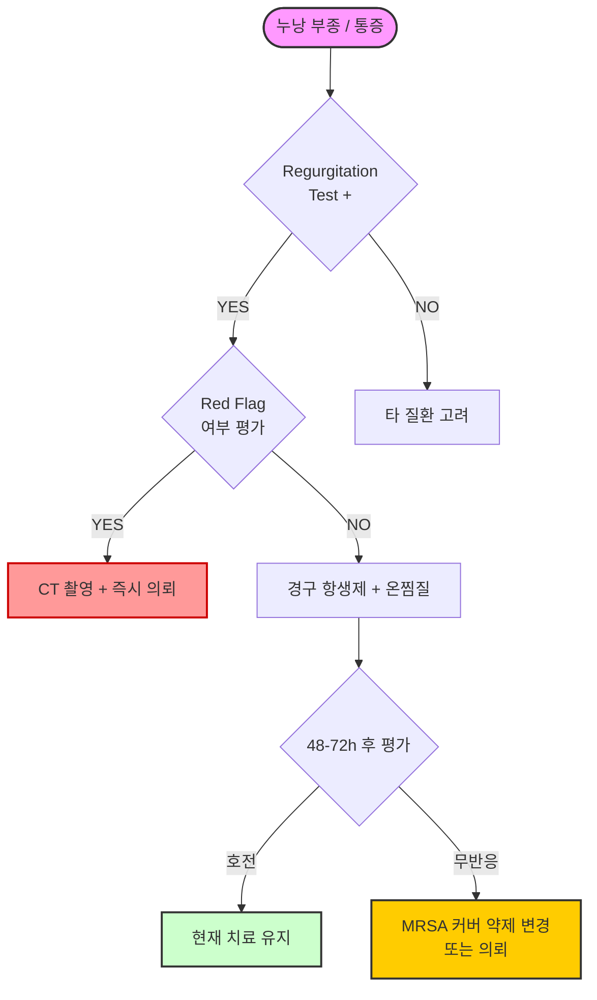

# 누낭염 Dacryocystitis

## <mark style="color:green;">일반 사항</mark>

* nasolacrimal system의 선천적 또는 후천적 폐쇄에 기인한 lacrimal sac의 감염; 보통 2차적 세균 감염으로 발생
* 주요 원인균 : _S. aureus_ (가장 흔함), _S. epidermidis_, _S. pneumoniae_, _S. pyogenes_, _S. viridans_, _P. aeruginosa_, _E. coli_
  * MRSA : 지역 및 의료환경에 따라 비율이 다양함; 보존적 치료 실패 또는 위험군(당뇨·면역저하)에서 반드시 고려
* 영아 및 >40세에서 호발, 여성에서 3:1 비율로 더 흔함(비루관 직경이 남성보다 좁기 때문), 보통 편측 발생
* 위험 인자 : 여성·고령(누점 협착), 누석(dacryolith), 비중격만곡·비염·비갑개 비대, 안면 외상 또는 비내시경 수술 과거력, 당뇨 등 면역 저하 상태, Wegener 육아종증·사르코이드증·SLE 등 전신 질환, 일부 약물(5-FU, docetaxel, 방사성 요오드 등)

### <mark style="color:$danger;">🚩 Red Flags!</mark>

<mark style="color:$danger;">**즉각 조치 또는 의뢰**</mark>

* **CT 적응증** — 안구 돌출(proptosis), 안구 운동 제한, 시력 저하, 심한 두통·발열 중 하나 이상: orbital cellulitis 의심 → 즉시 contrast-enhanced CT(안와·부비동) 시행 또는 의뢰
* 안구 돌출 + 복시(diplopia)/안구 운동 제한 + 심한 두통·발열 → 해면정맥동 혈전증(cavernous sinus thrombosis) 의심 → 즉시 contrast-enhanced CT(뇌·안와) 시행 또는 의뢰
* 고열, 오한, 빈맥 등 전신 감염 징후 → 패혈증 의심

<mark style="color:$warning;">**당일 또는 조기 의뢰**</mark>

* 누낭 부위 파동성 종괴(fluctuant mass) → 농양 형성 → 절개 배농 또는 수술 고려
* 48\~72시간 경구 항생제 치료에도 호전 없는 경우 (MRSA 가능성 포함)
* 당뇨·면역저하 환자에서 발생한 누낭염 (급격한 악화 및 안와 봉와직염 진행 위험이 높음)
* 누낭염 재발

<mark style="color:$info;">**외래 추적 / 추가 평가 계획**</mark> <mark style="color:$info;">- 즉각 위험 낮으나 호전 없으면 의뢰</mark>

* 반복적 눈물·분비물 지속 → 만성 누낭염 → 누낭비루관조성술(dacryocystorhinostomy) 고려
* 만성·재발성 경과에서 딱딱하고 무통성 종괴 → 누낭 종양 감별 (\*누낭 악성 종양은 드물지만 누낭염으로 오인되기 쉬움)
* 원인 불명의 재발성 누낭염 → Wegener 육아종증·사르코이드증·SLE 등 전신 질환 감별

## <mark style="color:green;">임상 양상</mark>

* 누낭의 갑작스런 부종, 발적, 통증/압통 (내안각 하방 코 옆)
* 누낭을 누르면 점액과 농의 혼합물이 눈물점(punctum)을 통해 역류되어 나옴 → 진단적 소견
* 전신 증상 : 발열, 전신 피로감
* 만성 누낭염 : 눈물흘림(epiphora), 분비물, 점액 또는 농의 간헐적 역류

### <mark style="color:orange;">감별진단</mark>

누낭 부위를 손가락으로 압박했을 때의 역류 성상(regurgitation test)이 핵심 감별 포인트

<table><thead><tr><th width="141">질환</th><th width="132">역류 성상</th><th width="143">통증</th><th>기타 특징</th></tr></thead><tbody><tr><td><strong>급성 누낭염</strong></td><td>농성 역류</td><td>심한 통증·압통</td><td>발적·발열 동반; 항생제 반응</td></tr><tr><td><strong>누낭 mucocele</strong></td><td>맑은 점액 역류</td><td>무통성</td><td>비감염성·낭성 종괴; 서서히 커짐</td></tr><tr><td><strong>누낭 종양</strong></td><td>혈성 역류 가능</td><td>무통성(초기)</td><td>딱딱한 고형 종괴; 항생제 무반응<br>→ 즉시 의뢰</td></tr><tr><td><strong>안와 봉와직염</strong></td><td>역류 없음</td><td>안구 운동 시 통증</td><td>안구 돌출·안구 운동 제한 동반</td></tr><tr><td><strong>사골동염</strong></td><td>역류 없음</td><td>비부비동 압통</td><td>코 증상·비루 동반</td></tr></tbody></table>

***

## <mark style="background-color:$warning;">Management</mark>

### <mark style="color:orange;">치료 방침</mark>

* 온찜질 : 하루 4\~6회, 1회 10\~15분 적용; 통증 완화 및 배농 촉진
  * 목적 : 누낭 주위 혈류 증가 → 화농성 내용물의 연화 및 자연 배농 유도
  * 온도 유지가 핵심 : 젖은 수건은 수분 내 급속히 식어 유효 시간이 짧음 → 10분 이상의 찜질이 필요한 누낭염에서는 아이마스크형 온찜질 팩(전자레인지 20\~30초) 또는 물에 적신 수건을 밀봉 지퍼백에 넣어 전자레인지로 데운 것(지퍼백 수건 팩)을 권장
  * ⚠️ 저온 화상 주의 : 특히 고령 환자 및 당뇨 환자는 피부 감각이 둔화되어 있어 과열 시 화상을 인지하지 못할 수 있음 — 반드시 적정 온도(40\~43℃) 확인 후 사용
  * 찜질 후 배농 마사지 : 찜질 직후 누낭 부위(내안각 하방)를 손가락으로 부드럽게 아래쪽으로 눌러 내용물을 눈물점 방향으로 유도; 강하게 짜듯 압박하면 감염이 번질 수 있으므로 주의
* 전신 항생제 : 급성 감염의 기본 치료
  * 1차: amoxicillin/clavulanate <mark style="color:blue;">\[오구멘틴]</mark>
  * 페니실린 알레르기·부작용 시 대안: cefpodoxime 등 2·3세대 세팔로스포린
  * 위 약제 사용 불가 또는 1차 치료 실패 시: levofloxacin <mark style="color:blue;">\[크라비트]</mark> (QT 연장·건 손상 등 부작용 고려)
  * 경구 항생제에 반응 없거나 전신 증상 동반 시 입원 및 정주 항생제 고려
* 국소 항생제 점안액 : 보조적 역할에 한정 - 누낭염의 주 병소는 누낭 심부 조직이므로 점안액의 도달이 불충분함; 분비물·결막 오염 조절 목적으로만 사용하며 전신 항생제를 대체할 수 없음
* 국소 스테로이드 : 뚜렷한 부종·염증이 심한 경우에 한해 단기간, 반드시 항생제 병용 하에 사용; 단독 사용 금지 (☞ [안과계 약제](ophthalmic-medications.md#undefined-14))
* 농양 형성 시 절개 배농(I\&D) - 의뢰
* 급성기 탐침술(lacrimal probing) : 급성 염증 중 탐침술은 취약해진 조직에 가성 통로(false passage)를 만들 위험이 있으므로 일반적으로 금기; 급성기 해소 후 안과에서 시행. 단, 소아 선천성 비루관폐쇄(NLDO)에서는 안과 전문의 판단 하에 예외적으로 시행될 수 있음
* 수술(dacryocystorhinostomy, DCR) : 폐쇄된 눈물길을 수술로 개방; 만성 누낭염 또는 반복 재발에서 고려
  * 내시경 누낭비강문합술(Endoscopic DCR, EDCR 또는 EN-DCR)과 외부 DCR(EX-DCR)의 성공률은 대체로 유사하나, 술자 경험 및 해부학적 조건에 따라 차이가 있을 수 있음; EDCR은 안면 흉터 없이 출혈이 적은 장점이 있어 최근 선호도 증가

**※ 안과 질환별 온찜질 비교**

* 온찜질은 질환의 병태생리적 목표에 따라 적용 강도를 달리함. 시간보다 온도를 일정하게 유지(40\~43℃)하는 것이 더 중요
* 급성 염증·화농형(누낭염, 다래끼)에서는 '최대한 자주, 충분히', 만성 관리형(안검염, 건성안)에서는 '매일 꾸준히, 짧게'
* 10분 이상의 긴 찜질이 필요한 경우 '아이마스크형 온찜질 팩' 또는 '지퍼백 수건 팩' 활용

<table><thead><tr><th width="108">질환</th><th width="195">목적</th><th width="145">권장 빈도·시간</th><th>찜질 후 처치</th></tr></thead><tbody><tr><td><strong>누낭염</strong></td><td>배농 촉진, 혈류 개선</td><td>1일 4~6회,<br>10~15분</td><td>누낭 부위 배농 마사지</td></tr><tr><td><strong>다래끼·</strong><br><strong>콩다래끼</strong></td><td>고형 meibum·농양 용해 및 자연 배농 유도</td><td>1일 4회,<br>15분</td><td>눈꺼풀 세척(lid scrub)</td></tr><tr><td><strong>안검염</strong></td><td>눈꺼풀 테두리 세정 보조, MGD 지질층 개선</td><td>1일 2~4회,<br>5~10분</td><td>눈꺼풀 세척(lid scrub)</td></tr><tr><td><strong>안구건조증</strong><br><strong>(MGD)</strong></td><td>meibomian gland 기능 개선, 증상 예방</td><td>1일 1~2회,<br>5~10분</td><td>눈꺼풀 세척(lid scrub)</td></tr></tbody></table>

#### <mark style="color:$primary;">항생제 선택</mark>

<table><thead><tr><th width="228">성분명 [상품명]</th><th width="240">특징</th><th width="139">용법</th></tr></thead><tbody><tr><td>amoxicillin/clavulanate<br><mark style="color:blue;">[오구멘틴]*</mark></td><td>1차 선택; 광범위 그람양성균 + 일부 그람음성균 커버</td><td>375 ㎎ tid</td></tr><tr><td>cefpodoxime <mark style="color:blue;">[세프포독심 등]</mark></td><td>페니실린 알레르기·부작용 시 2차 선택; 그람양성균 + 일부 그람음성균 커버; 단순 누낭염에서 FQ 대안</td><td>200 ㎎ bid</td></tr><tr><td>levofloxacin <mark style="color:blue;">[크라비트]</mark></td><td>위 약제 사용 불가 또는 1차 실패 시; 조직 침투력 우수; 고령자 QT 연장·건 손상 주의</td><td>500 ㎎ qd</td></tr><tr><td>TMP/SMX <mark style="color:blue;">[박트림]</mark></td><td>MRSA 의심 1차 경구 옵션</td><td>160/800 ㎎ bid</td></tr><tr><td>doxycycline <mark style="color:blue;">[독시사이클린]</mark></td><td>MRSA 의심 1차 경구 옵션 (TMP/SMX와 동등); 신부전·설파제 알레르기 시 TMP/SMX 대신 우선 고려</td><td>100 ㎎ bid</td></tr><tr><td>clindamycin <mark style="color:blue;">[클린다마이신]</mark></td><td>MRSA 의심 경구 대안; TMP/SMX·doxycycline 사용 불가 시 고려; C. difficile 위험 주의</td><td>300 ㎎ tid~qid</td></tr></tbody></table>

\*오구멘틴 용량 참고 : 375 ㎎ tid는 국내 표준 처방이지만, _S. aureus_ 등 심부 감염에서 치료 반응이 느릴 경우 증량 고려 - 500/125 ㎎ 제형 <mark style="color:blue;">\[아목시클라브]</mark> tid, 또는 375 ㎎ 제형을 1회 2정(amoxicillin 500 ㎎ 상당)으로 증량. 국내에서 875 ㎎ 제형은 유통이 제한적이며, 625 ㎎ 제형은 현재 단종 상태임

※ 입원 IV 항생제 적응증 (안와 봉와직염·패혈증·경구 치료 실패) 시 ampicillin-sulbactam 또는 ceftriaxone; MRSA 의심 시 vancomycin 병용

※ Step-down 기준 : IV 항생제 시작 후 발열 소실 및 국소 증상 호전이 24\~48시간 지속되면 경구 전환 가능; 총 치료 기간은 경구 포함 10\~14일

#### <mark style="color:$primary;">국소 항생제 점안액</mark>

* tobramycin bid\~qid <mark style="color:blue;">\[토브라]</mark>
* polymyxin-B/TMP <mark style="color:blue;">\[포러스 점안액]</mark>

#### <mark style="color:$primary;">국소 항생제/Steroid 복합제</mark>

* dexamethasone + tobramycin qid <mark style="color:blue;">\[토브라덱스]</mark>

***



<p align="center"><strong>누낭염 관리 알고리듬</strong></p>

<p align="center"><em>amox/clav 불가 시 → cefpodoxime → levofloxacin 순으로 대체</em><br><em>농양 형성(fluctuant mass) 확인 시 즉시 의뢰 (절개 배농)</em><br><em>당뇨·면역저하 환자는 악화 속도가 빠르므로 48시간 이내 재평가 권장</em></p>

***

### <mark style="color:red;">질병코드</mark>

H04.30 상세불명의 급성 및 아급성 누낭염

H04.31 급성 누낭염

H04.41 만성 누낭염

***

## <mark style="color:purple;">처방례</mark>

> **처방례 1. 급성 누낭염 (1차 선택)**
>
> ```
> 오구멘틴 375 ㎎/T  3T #3  (7~10일)
> 토브라덱스 점안액 5 ㎖/병  1방울 qid
> ```
>
> _✽온찜질(1일 4\~6회) 병행 지도. 점안액은 보조적 사용이며 전신 항생제가 치료의 핵심임을 설명_\
> &#xNAN;_✽48\~72시간 이내 호전 없거나 농양 형성 시 안과 의뢰. 치료 반응 불충분 시 1회 2정(amoxicillin 500 ㎎ 상당)으로 증량 또는 제네릭 500/125 ㎎ 제형으로 변경 고려_

> **처방례 2. 급성 누낭염 (페니실린 알레르기·부작용 시 — 세팔로스포린 대안)**
>
> ```
> 세프포독심 200 ㎎/T  1T bid  (7~10일)
> 포러스 점안액 10 ㎖/병  1방울 qid
> ```
>
> _✽amoxicillin/clavulanate에 알레르기 또는 소화 장애 등 부작용이 있는 경우 선택. 단순 누낭염에서 fluoroquinolone 사용 전 우선 고려_

> **처방례 3. 급성 누낭염 (위 약제 사용 불가 또는 1차 치료 실패)**
>
> ```
> 크라비트 500 ㎎/T  1T qd  (7~10일)
> 포러스 점안액 10 ㎖/병  1방울 qid
> ```
>
> _✽크라비트(levofloxacin)는 S. aureus, S. pneumoniae, P. aeruginosa 등 주요 원인균에 유효하며 조직 침투력이 우수함. 고령자에서 QT 연장·건 손상 여부 확인_

> **처방례 4. MRSA 의심 (초기 항생제 48\~72h 무반응)**
>
> ```
> 박트림 DS 800/160 ㎎/T  1T bid  (7~10일)
>     또는 독시사이클린 100 ㎎/T  1T bid  (7~10일)
>     또는 클린다마이신 300 ㎎/T  1T tid  (7~10일)  ← TMP/SMX·doxycycline 사용 불가 시
> 토브라덱스 점안액 5 ㎖/병  1방울 qid
> ```
>
> _✽경구 치료에도 악화되거나 전신 증상 동반 시 입원하여 IV vancomycin으로 전환. 발열 소실 후 24\~48시간 경과하면 경구 전환(step-down) 가능; 총 치료 기간 10\~14일. 배농 전 분비물 배양 검사는 재발·치료 실패·입원 환자에서 권장 (모든 케이스에서 routine 시행은 불필요)_

***

### <mark style="color:$success;">핵심 복약 지도</mark>

> **경구 항생제 복용 안내**
>
> * 오구멘틴(아목시실린/클라불라네이트)은 식사와 함께 복용하면 소화 장애(메스꺼움, 설사)를 줄일 수 있습니다.
> * 세프포독심(cefpodoxime)은 식사와 함께 복용하면 흡수율이 높아집니다.
> * 증상이 호전되더라도 처방된 기간(보통 7\~10일)을 끝까지 복용하십시오. 도중에 중단하면 재발하거나 내성균이 생길 수 있습니다.
> * 크라비트(레보플록사신)는 제산제, 철분제, 칼슘 보충제와 함께 복용하면 흡수가 줄어들 수 있으므로 2시간 이상 간격을 두십시오.

> **점안액 사용 안내**
>
> * 점안액은 아래 눈꺼풀을 살짝 당긴 후, 결막낭(아랫 눈꺼풀 안쪽)에 1방울 떨어뜨리십시오. 약병 끝이 눈에 닿지 않도록 주의하십시오.
> * 점안 후 수 초 동안 눈을 살며시 감고, 눈 안쪽(코 옆 눈물점)을 손가락으로 1\~2분간 가볍게 눌러 주십시오.
> * 여러 종류의 점안액을 함께 사용하는 경우 3\~5분 간격을 두십시오.
> * 개봉 후 4주가 지난 점안액은 사용하지 마십시오.

> **온찜질 방법**
>
> * 깨끗한 수건을 따뜻한 물(40\~43℃)에 적셔 눈 아래 코 옆(누낭 부위)에 대십시오.
> * 1회 10\~15분, 하루 4\~6회 시행하십시오.
> * **온찜질 후 배농 마사지** : 찜질 직후, 누낭 부위(눈 안쪽 아래)를 손가락 끝으로 부드럽게 아래쪽으로 눌러 주십시오. 고름이 눈물점 방향으로 빠져나오도록 유도하는 마사지입니다. 강하게 짜듯 압박하지 마십시오 — 감염이 주변으로 번질 수 있습니다.
>
> **💡 온도 유지 팁**
>
> 젖은 수건은 눈에 닿는 순간 빠르게 식어, 10\~15분의 긴 찜질에는 유효 시간이 부족합니다.
>
> * **아이마스크형 온찜질 팩** : 전자레인지에 20\~30초 데워 사용. 온도가 균일하고 오래 유지됩니다.
> * **지퍼백 수건 팩** : 물에 적신 수건을 밀봉 지퍼백에 넣고 전자레인지에 30\~40초 데운 후 수건에 감싸 사용. 팩 자체가 열을 보존해 10분 이상 적정 온도가 유지됩니다.
> * 전자레인지로 수건만 직접 데우면 표면 온도가 불균일해 화상 위험이 있으므로 권장하지 않습니다.

> **언제 다시 병원을 방문해야 하나요?**
>
> * 항생제를 복용해도 **48\~72시간 내에 호전되지 않거나 악화**되는 경우
> * 눈 옆·코 옆 부종이 **뺨이나 눈꺼풀 전체로 확산**되는 경우 — 즉시 내원
> * **고열(38.5℃ 이상), 오한, 심한 두통**이 동반되는 경우 — 즉시 내원
> * 종괴에 \*\*파동감(말랑말랑하게 고름이 잡히는 느낌)\*\*이 생기는 경우 — 즉시 내원
> * **시력 저하 또는 눈 움직임의 불편함**이 생기는 경우 — 즉시 내원

***

### <mark style="color:blue;">환자 안내서</mark>


**누낭염이란?**

누낭염은 눈물이 코로 빠져나가는 통로(비루관)가 막혀, 눈물이 고이는 주머니(누낭)에 세균 감염이 생기는 질환입니다. 눈과 코 사이 아래쪽이 붓고 빨개지며 눌렀을 때 눈 안쪽으로 고름이 나오는 것이 특징입니다. 항생제 치료로 대부분 호전되지만, 반복되거나 심한 경우 수술이 필요할 수 있습니다.


#### <mark style="color:$primary;">증상은 어떻게 나타나나요?</mark>

* 눈과 코 사이 아래 피부(내안각 부위)가 붓고, 빨개지고, 통증이 있습니다.
* 해당 부위를 손가락으로 누르면 눈물점을 통해 고름이나 점액이 역류합니다.
* 발열이나 전신 피로감이 동반될 수 있습니다.

#### <mark style="color:$primary;">집에서 어떻게 관리하나요?</mark>

* **온찜질** : 깨끗한 수건을 따뜻하게 적셔 누낭 부위(눈과 코 사이 아래)에 1회 10\~15분, 하루 4\~6회 대십시오. 열이 혈액순환을 도와 염증 회복을 앞당깁니다. 젖은 수건은 금방 식으므로 **아이마스크형 온찜질 팩** 또는 **지퍼백 수건 팩**을 활용하면 온도를 더 오래 유지할 수 있습니다.
* **배농 마사지** : 온찜질 직후 누낭 부위를 손가락 끝으로 부드럽게 아래쪽으로 눌러 주십시오. 고름이 빠져나오도록 돕는 마사지입니다. 단, 강하게 짜듯 압박하지 마십시오.
* **손 위생** : 눈 주위를 만지기 전후로 반드시 손을 씻으십시오. 감염 확산을 막을 수 있습니다.
* **눈 비비거나 강하게 누르지 않기** : 무리하게 짜거나 누르면 감염이 주변 조직으로 퍼질 수 있습니다.
* **항생제 끝까지 복용** : 증상이 나아진 것 같아도 처방된 기간을 반드시 완료하십시오.

#### <mark style="color:$primary;">이럴 때는 즉시 병원을 방문하세요</mark>

* 항생제 복용 중에도 **붓기와 통증이 48\~72시간 내에 줄지 않거나 심해지는** 경우
* 부종이 **눈꺼풀·뺨 전체로 빠르게 퍼지는** 경우
* **38.5℃ 이상의 발열, 오한, 심한 두통**이 동반되는 경우
* 종괴가 **말랑말랑해지며 고름이 잡히는 느낌**이 드는 경우
* **시력이 흐려지거나, 눈을 돌리기 불편하거나, 눈이 튀어나오는 느낌**이 드는 경우 — 응급 상황
* 두통·발열과 함께 **눈을 움직일 때 통증이 심하고 물체가 두 개로 보이는** 경우 — 응급 상황 (해면정맥동 혈전증 의심)
