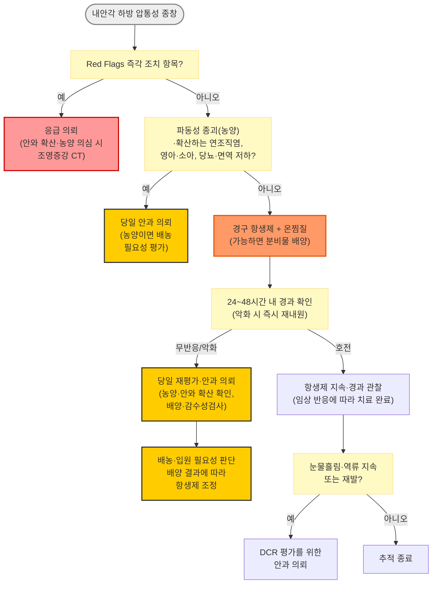

# 누낭염 Dacryocystitis

## <mark style="color:green;">일반 사항</mark>

* nasolacrimal system의 선천적 또는 후천적 폐쇄에 기인한 lacrimal sac의 감염 ([누낭염 이미지](https://www.reviewofoptometry.com/article/one-last-time))
* 보통 2차적 세균 감염으로 발생
* 분류&#x20;
  * 급성 vs 만성
  * 선천성(신생아·영아, 선천성 비루관 폐쇄 동반) vs 후천성(대부분 원발성 후천성 비루관 폐쇄)
* 주요 원인균 : 포도알균·연쇄구균(_S. aureus_, _S. epidermidis_, _S. pneumoniae_ 등), 그람음성균(_P. aeruginosa_ 등)
  * 균 분포는 지역, 급성/만성, 환자군에 따라 다름. 영아에서는 _S. pneumoniae_, _H. influenzae_ 외에 _S. aureus_ 등 다양한 균이 분리됨
  * MRSA : 지역 및 의료 환경에 따라 비율이 다양함
    * 최근 입원·요양시설 거주, MRSA 감염/보균력, 최근 항생제 사용, 혈액투석 등 위험인자가 있거나 배양에서 확인된 경우 고려
    * 치료 실패만으로 MRSA로 단정하지 않음
* 영아 및 ＞40세에서 호발, 여성에서 3:1 비율로 더 흔함(비루관 골관이 남성보다 좁은 것과 관련)
* 보통 편측 발생
* 합병증 : 누낭 농양, 누낭 피부 누공(fistula), 눈꺼풀앞 연조직염, 드물게 안와 연조직염·안와 농양, 해면정맥동 혈전증, 수막염, 패혈증
  * 누낭은 안와 격막 앞에 위치하므로 대부분 눈꺼풀앞(격막전) 연조직염 양상이며, 안와 내 확산은 드묾

## <mark style="color:green;">원인</mark>

* 비루관 폐쇄로 누낭에 눈물이 정체되면서 2차 세균 감염이 발생

### <mark style="color:orange;">위험 인자</mark>&#x20;

* 인구학적 요인 : 여성, 고령(원발성 후천성 비루관 폐쇄)
* 눈물길 내 요인 : 누석(dacryolith)
* 비강·부비동 요인 : 비중격만곡, 비염, 비갑개 비대
* 외상·수술 : 안면(비안와·사골) 외상, 비내시경·부비동 수술 과거력
* 전신 염증 질환 : 육아종증 다발혈관염(GPA), 사르코이드증, SLE 등
* 약물·치료 : 5-FU, docetaxel, 방사성 요오드 등
* cf. 당뇨·면역 저하에서는 중증화·합병증 진행에 특히 주의

## <mark style="color:green;">임상 양상</mark>

* 누낭의 갑작스러운 부종, 발적, 통증/압통 (내안각 하방 코 옆)
* 누낭을 부드럽게 누르면 점액과 농의 혼합물이 눈물점(punctum)을 통해 역류 - 진단적 소견
  * 단, 급성기 종창이 심하거나 공통소관(common canaliculus)이 막힌 경우 역류가 없을 수 있으므로 역류가 없다고 배제하지 않음
* 종창은 내안각 인대 아래에 위치함(인대 위로 확장되면 종양 감별)
* 전신 증상 : 발열, 전신 피로감
* 만성 누낭염 : 눈물흘림(epiphora), 분비물, 점액 또는 농의 간헐적 역류
* 영아 : 생후 수주 내 눈물흘림·눈곱이 지속되다가 누낭 부위 발적·종창으로 나타남

### <mark style="color:$danger;">🚩 Red Flags!</mark>

<mark style="color:$danger;">**즉각 조치**</mark>

* 안구 돌출, 안구 운동 제한 또는 안구 운동 시 통증, 시력 저하, 상대구심동공운동장애(RAPD), 결막 부종 중 하나 이상  `안와 연조직염·안와 골막하 농양`
* 양측 눈 증상, 복시·외안근 마비, 안면(V1·V2) 감각 저하, 심한 두통, 의식 변화  `해면정맥동 혈전증`  `수막염`
* 고열·오한·빈맥·저혈압 등 전신 감염 징후  `패혈증`&#x20;
* 신생아의 누낭 부위 종창·발적, 또는 영아 내안각 종괴와 함께 호흡곤란·수유 시 청색증  `신생아 누낭염`  `선천성 누낭류`&#x20;

<mark style="color:$warning;">**당일 평가**</mark>

* 누낭 부위 파동성 종괴(fluctuant mass)  `누낭 농양`&#x20;
* 안와 징후 없이 발적·부종이 눈꺼풀 전체나 뺨으로 확산  `눈꺼풀앞 연조직염`
* 경구 항생제 치료 후 24\~48시간 내 경과 확인에서 호전 없음, 또는 치료 중 악화  `농양 형성`  `내성균`  `다른 원인`
* 당뇨·면역 저하 환자의 급성 누낭염
* 영아·소아의 급성 누낭염  `선천성 비루관 폐쇄 동반 누낭염`

<mark style="color:$info;">**조기 평가 및 추적**</mark>

* 급성기 해소 후에도 눈물흘림·점액 역류 지속, 또는 누낭염 재발  `만성 누낭염`
* 내안각 인대 위쪽으로 확장되는 종괴, 혈성 눈물·혈성 역류, 딱딱한 무통성 종괴, 항생제에 반응하지 않는 종괴  `누낭 종양`&#x20;
* 원인 불명의 재발성·양측성 누낭염, 또는 비출혈·비폐색·전신 증상 동반  `GPA`  `사르코이드증`

## <mark style="color:green;">진단</mark>

* 임상 진단 : 내안각 하방 누낭 부위의 급성 압통성 발적·종창으로 진단
  * 부드러운 압박으로 확인되는 점액·농성 역류는 진단을 뒷받침하지만, 역류가 없어도 배제하지 않음
* 함께 평가할 소견 : 종창 위치(내안각 인대 위·아래), 누점의 변화, 시력·동공 반응·안구 운동·안구 돌출
* 배양 : 역류 분비물이 얻어지면 항생제 시작 전 그람염색·배양 권장 - 특히 MRSA 위험군, 재발, 치료 실패, 입원 환자
* CT(조영증강, 안와·부비동) : 안와 징후, 진단 불확실, 종양 의심 시
* 만성기 평가(안과) : 누관 세척 검사, 비내시경, 필요시 누낭조영술


급성기에는 일반적인 누관 세척(irrigation)·탐침을 피함. 다만 영아의 선천성 비루관 폐쇄 동반 누낭염에서는 전신 항생제 치료와 함께 안과 전문의 판단으로 조기 탐침술·비강 내 낭종 처치를 시행할 수 있음


### <mark style="color:orange;">감별</mark>

<table data-search="false"><thead><tr><th width="142">질환</th><th width="162">역류 성상</th><th width="162">통증</th><th>기타 특징</th></tr></thead><tbody><tr><td><strong>급성 누낭염</strong></td><td>농성 역류</td><td>심한 통증·압통</td><td>발적·발열 동반; 항생제 반응</td></tr><tr><td><strong>누낭 mucocele</strong></td><td>점액성 역류</td><td>무통성</td><td>비감염성·낭성 종괴; 서서히 커짐</td></tr><tr><td><strong>눈물소관염</strong></td><td>누점에서 고름·황색 결석(sulfur granule) 배출</td><td>경미</td><td>누점 부종·돌출(pouting punctum), 누낭 종창 없음; Actinomyces 흔함; 점안 항생제에 잘 낫지 않음 → 안과 의뢰</td></tr><tr><td><strong>선천성 누낭류</strong></td><td>-</td><td>무통성(감염 전)</td><td>신생아 내안각 하방의 청색 낭성 종괴; 비강 내 낭종으로 호흡곤란 시 → 즉시 응급 평가</td></tr><tr><td><strong>누낭 종양</strong></td><td>혈성 역류 가능</td><td>무통성(초기)</td><td>딱딱한 고형 종괴; 내안각 인대 상방 확장; 항생제 무반응<br>→ 조기 안과 의뢰</td></tr><tr><td><strong>안와 연조직염</strong></td><td>누낭염에 합병되면 역류 동반 가능</td><td>안구 운동 시 통증</td><td>안구 돌출·안구 운동 제한 동반; 누낭염의 합병증으로 함께 발생할 수 있음</td></tr><tr><td><strong>사골동염</strong></td><td>역류 없음</td><td>비부비동 압통</td><td>코 증상·비루 동반</td></tr></tbody></table>

***


```mermaid
graph TD
    A([내안각 하방 압통성 종창]) --> B["Red Flags 즉각 조치 항목?"]
    B -- 예 --> C["응급 의뢰<br/>(안와 확산·농양 의심 시 <br/>조영증강 CT)"]
    B -- 아니오 --> D["파동성 종괴(농양)<br/>·확산하는 연조직염,<br/>영아·소아, 당뇨·면역 저하?"]
    D -- 예 --> E["당일 안과 의뢰<br/>(농양이면 배농 <br/>필요성 평가)"]
    D -- 아니오 --> F["경구 항생제 + 온찜질<br/>(가능하면 분비물 배양)"]
    F --> G["24~48시간 내 경과 확인<br/>(악화 시 즉시 재내원)"]
    G -- 호전 --> H["항생제 지속·경과 관찰<br/>(임상 반응에 따라 치료 완료)"]
    G -- 무반응/악화 --> I["당일 재평가·안과 의뢰<br/>(농양·안와 확산 확인, <br/>배양·감수성검사)"]
    I --> M["배농·입원 필요성 판단<br/>배양 결과에 따라 <br/>항생제 조정"]
    H --> J["눈물흘림·역류 지속<br/>또는 재발?"]
    J -- 예 --> K["DCR 평가를 위한<br/>안과 의뢰"]
    J -- 아니오 --> L["추적 종료"]
    style A fill:#eeeeee,stroke:#888888,stroke-width:2px
    classDef yellow fill:#fff9c4,stroke:#ffe082
    class B,D,G,J yellow
    style C fill:#ff9999,stroke:#c00,stroke-width:2px
    style E fill:#ffcc00,stroke:#333,stroke-width:2px
    style F fill:#f96,stroke:#e65100,stroke-width:2px
    style I fill:#ffcc00,stroke:#333,stroke-width:2px
    style M fill:#ffcc00,stroke:#333,stroke-width:2px
```

<p align="center"><strong>누낭염 진단 및 관리 알고리듬</strong></p>

<p align="center"><em>대체 항생제는 사용 불가 사유·알레르기 유형·배양 결과에 따라 선택</em><br><em>농양 형성(fluctuant mass) 확인 시 당일 안과 의뢰 (배농 필요성 평가)</em><br><em>영아·소아 및 당뇨·면역 저하 환자는 당일 안과 평가; 악화 시 즉시 재내원</em></p>

***

## <mark style="background-color:$warning;">Management</mark>

### <mark style="color:orange;">치료 방침</mark>

* 급성 누낭염 : 전신 항생제 + 온찜질이 기본; 국소 점안제는 보조
* 농양 형성 시 배농을 위한 안과 의뢰
* 급성기 해소 후 비루관 폐쇄가 남으면 재발 예방을 위해 DCR 평가
* 영아·소아는 당일 안과 의뢰, 신생아는 입원·IV 항생제가 원칙

## <mark style="color:green;">비-약물 치료 및 예방</mark>

* 온찜질 : 편안하게 따뜻한 정도로 하루 수 회, 1회 5\~10분 시행하는 보조적 증상 완화법
  * 상용 온찜질 제품은 제조사 지침을 따르고, 화상을 입을 정도의 열은 피함
  * 고령자·당뇨 환자는 피부 감각이 둔화되어 화상을 인지하지 못할 수 있으므로 사용 전 손목 안쪽으로 온도 확인
* 배농 : 진료 중 부드러운 압박으로 역류를 확인하는 것과 달리, 환자가 집에서 누낭 부위를 반복해서 짜거나 누르는 것은 권장하지 않음; 밖으로 나온 분비물은 깨끗하게 닦도록 지도
  * 성인 후천성 비루관 폐쇄는 퇴행성 섬유화 협착이 대부분이므로 하방 마사지로 비루관 개방을 기대할 수 없음 (비감염성 영아 선천성 비루관 폐쇄의 Crigler 마사지와 구분)


**Crigler 마사지**는 눈물주머니(누낭) 압박 마사지로, 단순히 피부 겉면을 문지르는 것이 아니라 눈물주머니 내부의 압력(수압)을 높여 눈물길 하단의 얇은 막을 뚫어 주는 것임. 의사가 선천성 비루관 폐쇄로 진단한 경우에 한해 지도함

* 보호자 안내 : 아기 눈에 눈물이 고이거나 눈곱이 낀다고 해서 집에서 눈물길 마사지를 하지 않도록 함. 대부분 저절로 좋아지며, 마사지가 필요한지는 진료 후 안내받도록 함


### <mark style="color:orange;">안과 질환별 온찜질 비교</mark>

* 온찜질의 목적과 시행 방법은 질환에 따라 다름. 아래 빈도·시간은 실용적인 안내이며, 누낭염에서 특정 온도·시간이 확립된 치료 기준은 아님; 상용 제품은 제조사 지침을 따르고 피부를 데일 정도의 열과 강한 압박을 피함

<table><thead><tr><th width="100">질환</th><th>목적</th><th>권장 빈도·시간</th><th>찜질 후 처치</th></tr></thead><tbody><tr><td><strong>누낭염</strong></td><td>보조적 증상 완화</td><td>편안한 온도,<br>하루 수 회, 5~10분</td><td>분비물 닦기</td></tr><tr><td><strong>다래끼·</strong><br><strong>콩다래끼</strong></td><td>meibum 연화·배출 및 자연 배농 유도</td><td>1일 4회, 15분</td><td>눈꺼풀 세척(lid scrub)</td></tr><tr><td><strong>안검염</strong></td><td>눈꺼풀 테두리 세정 보조, MGD 지질층 개선</td><td>1일 2~4회, 5~10분</td><td>눈꺼풀 세척(lid scrub)</td></tr><tr><td><strong>눈마름증</strong><br><strong>(MGD)</strong></td><td>meibomian gland 기능 개선, 증상 예방</td><td>1일 1~2회, 5~10분</td><td>눈꺼풀 세척(lid scrub)</td></tr></tbody></table>

## <mark style="color:green;">약물 치료</mark>

### <mark style="color:orange;">전신 항생제</mark>

* 급성 감염의 기본 치료 : 전신 항생제
* 1차 : amoxicillin/clavulanate <mark style="color:blue;">\[오구멘틴]</mark>
* 페니실린 비중증 알레르기·부작용 시 대안 : cefpodoxime <mark style="color:blue;">\[바난]</mark> 등 3세대 세팔로스포린 - amoxicillin과 측쇄 구조가 달라 교차반응 낮음
  * 아나필락시스 등 중증 즉시형 과민반응 병력이면 clindamycin 고려
  * SJS/TEN·DRESS 등 중증 지연형 반응 또는 약물성 장기 손상 병력이면 측쇄 구조와 관계없이 β-lactam 사용 전 전문 평가 필요
* 다른 대안이 없고 사용 불가 사유·배양 결과 등을 검토한 경우 : levofloxacin <mark style="color:blue;">\[크라비트]</mark> - 건염·건 파열, 대동맥류·박리, 혈당 이상, 말초신경병증, QT 연장 등 중대한 이상반응 주의
  * MRSA에는 내성이 흔해 부적합
* 경구 항생제에 반응 없거나 악화 시 당일 재평가·안과 의뢰
  * 농양·안와 확산, 복약 상태, 용량 및 내성균·다른 원인을 확인하고 배농·입원·정주 항생제 필요성을 판단

<table><thead><tr><th width="144">성분명 [상품명]</th><th width="419">특징</th><th>용법</th></tr></thead><tbody><tr><td>amoxicillin/clavulanate<br><mark style="color:blue;">[오구멘틴]</mark>*</td><td>1차 선택; 광범위 그람양성균 + 일부 그람음성균 커버</td><td>375 ㎎ tid<br>중증 감염 시 625 ㎎ tid</td></tr><tr><td>cefpodoxime <br><mark style="color:blue;">[바난]</mark></td><td>페니실린 비중증 알레르기·부작용 시 대안; 그람양성균 + 일부 그람음성균 커버; 단순 누낭염에서 FQ보다 우선; 100 ㎎ 정만 유통</td><td>100~200 ㎎ bid 식후<br>(중증 200 ㎎ bid)</td></tr><tr><td>levofloxacin <br><mark style="color:blue;">[크라비트]</mark></td><td>다른 대안이 없을 때 사용; 배양·감수성과 사용 불가 사유에 따라 선택; 중대한 이상반응(건 손상, 대동맥류·박리, 혈당 이상, 말초신경병증, QT 연장 등) 주의; MRSA 부적합</td><td>500 ㎎ qd</td></tr><tr><td>TMP/SMX <br><mark style="color:blue;">[셉트린]</mark></td><td>MRSA 의심 경구 옵션; 연쇄구균 커버 불확실; 피부·연조직 감염은 허가 외 사용; 임부·수유부·2개월 미만 영아·G6PD 결핍 금기; 고칼륨혈증·warfarin 상호작용 주의</td><td>160/800 ㎎ bid<br>(80/400 ㎎ 정 2정)</td></tr><tr><td>doxycycline <br><mark style="color:blue;">[모노신]</mark></td><td>MRSA 의심 경구 옵션; 연쇄구균 커버 불확실; 국내 허가 적응증에 급성 눈물주머니염 포함; 12세 미만·임부·수유부·신부전·중증 간기능 이상·레티노이드(isotretinoin 등) 병용 금기; 페니실린 병용을 피함(국내 허가사항)</td><td>100 ㎎ bid</td></tr><tr><td>clindamycin <br><mark style="color:blue;">[훌그램]</mark></td><td>페니실린 중증 알레르기 또는 MRSA·연쇄구균 동시 치료가 필요할 때 고려; 지역 내성·감수성 확인; C. difficile 위험 주의; erythromycin 내성·clindamycin 감수성 균주는 유도성 clindamycin 내성(D-test) 확인</td><td>300 ㎎ qid<br>(150 ㎎ 캡슐 2개)</td></tr></tbody></table>

> \*amoxicillin/clavulanate 용량 참고 : 국내 375 ㎎ 정은 amoxicillin 250 ㎎ + clavulanate 125 ㎎, 625 ㎎ 정은 amoxicillin 500 ㎎ + clavulanate 125 ㎎ 제형임. 성인 허가 용량은 250/125 ㎎ tid이며, 중증 감염 시 500/125 ㎎ tid로 증량 가능. 375 ㎎ 정 2정은 500/250 ㎎으로 두 성분 모두 2배가 되고 clavulanate 과량으로 위장관 부작용이 증가할 수 있으므로 625 ㎎ 정 1정을 대신할 수 없음. 반응이 느리면 amoxicillin 단일제를 임의로 추가하지 말고 농양·배농 필요성, 내성균 및 복약 상태를 재평가
>
> ※ 위 표와 처방례는 성인 기준이며, amoxicillin/clavulanate·cefpodoxime·levofloxacin·TMP/SMX는 신기능에 따라 용량·간격 조정 필요. TMP/SMX는 CrCl 15\~30 ㎖/분에서 상용량의 1/2, ＜15 ㎖/분에서는 투여 금지(국내 허가사항); CKD 또는 ACEi/ARB·칼륨보존 이뇨제·NSAID 병용 시 투여 중 혈청 칼륨 확인

* 입원 IV 항생제 적응증(안와 연조직염·패혈증·경구 치료 실패) 시 ampicillin/sulbactam 또는 ceftriaxone
  * MRSA 위험인자·지역 내성·중증도와 입원 기관 지침에 따라 vancomycin 병용
  * 치성 기원이 의심되면 혐기성균 범위를 확인(ceftriaxone 사용 시 metronidazole 추가 고려)
  * 두개 내 확장이 의심되면 즉시 응급 입원·전문과 협진하여 중추신경계 감염에 적합한 항생제와 용량, 배농 필요성을 결정
* 치료 기간 : 단순 누낭염의 경구 치료는 보통 7\~10일, 임상 반응에 따라 조정
  * 안와 연조직염·농양·두개 내 확장이 동반되면 합병증별 치료 원칙에 따라 안과·감염내과에서 기간을 결정
  * IV에서 경구로의 전환은 발열이 있었으면 해열되고, 국소 소견이 뚜렷이 호전되며, 배농 필요성이 해소되고 경구 복용이 가능한지를 함께 평가

### <mark style="color:orange;">국소 점안제</mark>

* 국소 항생제 점안액 : 분비물·결막염이 동반될 때 보조적으로 사용
  * 누낭의 주 병소에 도달이 불충분하므로 전신 항생제를 대체할 수 없음
  * 용법은 제품 허가사항을 따름&#x20;
    * 예: tobramycin 점안액은 경증\~중등도에서 4시간마다 1\~2방울, 증상에 따라 증감
* 국소 스테로이드 : 안과 판단 하에서만 사용 (☞ [안과계 약제](037_1-ophthalmic-medications.md#undefined-14))

#### <mark style="color:$primary;">국소 항생제 점안액</mark>

* tobramycin : 경증\~중등도에서 4시간마다 1\~2방울, 증상에 따라 증감 <mark style="color:blue;">\[토브라점안액]</mark>
* ofloxacin : 1회 1방울 1일 3회 <mark style="color:blue;">\[푸가신점안액]</mark>
* levofloxacin : 1회 1방울 1일 3회 <mark style="color:blue;">\[오큐레보점안액 0.5%]</mark>

## <mark style="color:green;">시술 및 기타 처치</mark>

* 농양 형성 시 배농(바늘 흡인 또는 절개 배농, I\&D) - 의뢰
  * 피부 절개는 누낭 피부 누공을 남길 수 있음 주의
* 급성기 탐침술(lacrimal probing)·누관 세척 : 급성 염증 중에는 취약해진 조직에 가성 통로(false passage)를 만들 위험이 있으므로 일반적으로 피함 - 급성기 해소 후 안과에서 시행
  * 다만 영아의 선천성 비루관 폐쇄 동반 누낭염에서는 전신 항생제 치료와 함께 안과 전문의 판단으로 조기 탐침술·비강 내 낭종 처치를 시행할 수 있음
* 수술(dacryocystorhinostomy, DCR) : 폐쇄된 눈물길을 수술로 개방
  * 만성 누낭염 또는 반복 재발에서 고려
  * 기계식 내시경 DCR(EN-DCR)의 성공률은 외부 DCR(EX-DCR)과 비슷하고 안면 흉터가 없음(레이저 내시경 DCR은 성공률이 낮음); 술자 경험 및 해부학적 조건에 따라 차이가 있을 수 있음
  * 선택된 급성 누낭염 환자에서는 전신 항생제 치료와 함께 조기 내시경 DCR을 고려할 수 있음
  * 무작위시험과 메타분석에서 지연 수술과 비슷한 성공률과 더 빠른 증상 해소가 보고됨. 연구 규모가 작고 대상·수술 시점이 달라 모든 환자에게 일률적으로 적용하지 않으며, 시행 시점은 안과·이비인후과에서 판단 ([Acta Ophthalmol 2024](https://doi.org/10.1111/aos.15752), [Am J Rhinol Allergy 2024](https://doi.org/10.1177/19458924241237009))
* 백내장 등 안구 내 수술이 예정되어 있으면 만성 누낭염·눈물길 감염 여부를 먼저 안과에 알리고 평가받도록 안내

***

## <mark style="color:red;">질병코드</mark>

* H04.30 연조직염성 누낭염 Phlegmonous dacryocystitis
* H04.31 급성 누낭염 Acute dacryocystitis
* H04.40 만성 누낭염 Chronic dacryocystitis
* P39.1 신생아 결막염 및 누낭염 Neonatal conjunctivitis and dacryocystitis

***

## <mark style="color:purple;">처방례</mark>

> **처방례 1. 급성 누낭염 (1차 선택)**
>
> ```
> 오구멘틴 375 ㎎/T  3T #3  (7~10일)
>     또는 중증 감염 시 오구멘틴 625 ㎎/T  3T #3  (7~10일)
> ```
>
> _✽온찜질(편안한 온도, 하루 수 회, 1회 5\~10분) 병행 지도. 전신 항생제가 치료의 핵심이며, 분비물·결막염 동반 시 국소 항생제 점안 추가_\
> _✽24\~48시간 내 경과 확인; 악화 시 즉시 재내원. 호전 없거나 농양 형성 시 당일 안과 의뢰. 375 ㎎ 정 2정은 500/250 ㎎으로, 625 ㎎ 정 1정(500/125 ㎎)을 대신할 수 없음_

> **처방례 2. 급성 누낭염 (페니실린 비중증 알레르기·부작용 시 - 세팔로스포린 대안)**
>
> ```
> 바난 100 ㎎/T  2T #2 식후  (7~10일)
>     또는 중증·효과 불충분 시 바난 100 ㎎/T  4T #2 식후  (7~10일)
> ```
>
> _✽amoxicillin/clavulanate에 비중증 알레르기 또는 소화 장애 등 부작용이 있는 경우 선택. 국내 허가 용량은 1회 100 ㎎ bid이며 중증 또는 효과 불충분 시 1회 200 ㎎ bid; 제산제·H2 차단제와 병용 시 흡수 감소_\
> _✽SJS/TEN·DRESS 등 중증 지연형 반응 또는 약물성 장기 손상 병력이면 측쇄 구조와 관계없이 β-lactam 사용 전 전문 평가 필요_\
> _✽분비물·결막염 동반 시 국소 항생제 점안 추가. 24\~48시간 내 경과 확인; 악화 시 즉시 재내원_

> **처방례 3. 급성 누낭염 (다른 대안이 없고 사용 불가 사유·배양 결과 등을 검토한 경우)**
>
> ```
> 크라비트 500 ㎎/T  1T #1  (7~10일)
> ```
>
> _✽levofloxacin은 감수성 균주에 유효하나 주요 원인균에 대한 효과를 일률적으로 보장할 수 없으며 MRSA에는 부적합함. 건염·건 파열, 대동맥류·박리, 혈당 이상, 말초신경병증, QT 연장 등 중대한 이상반응이 있어 다른 대안이 없을 때 사용; 고령자에서 특히 주의_\
> _✽분비물·결막염 동반 시 국소 항생제 점안 추가. 치료 실패 시 단순히 다음 항생제로 교체하지 말고 농양·안와 확산, 배양·감수성 및 배농·입원 필요성을 재평가_

> **처방례 4. MRSA 의심 (MRSA 위험인자가 있거나 배양에서 확인된 경우)**
>
> ```
> 셉트린 80/400 ㎎/T  4T #2  (7~10일)
>     또는 모노신 100 ㎎/T  2T #2  (7~10일)
>     또는 훌그램 150 ㎎/C  8C #4  (7~10일)
> ```
>
> _✽TMP/SMX와 doxycycline은 모두 연쇄구균 커버가 불확실함. 주변 눈꺼풀앞 연조직염이 동반되어 MRSA와 연쇄구균을 함께 치료해야 하면 clindamycin 단독 또는 TMP/SMX + β-lactam 병용을 고려(doxycycline은 국내 허가사항상 페니실린과 병용을 피함). clindamycin은 지역 내성과 감수성 결과를 고려. TMP/SMX는 국내 허가 적응증에 피부·연조직 감염이 없어 허가 외 사용_\
> _✽경구 치료에도 악화되거나 전신 증상 동반 시 입원; 안와 확산 등 중증 감염에서는 그람음성균·혐기성균 범위를 유지하면서 vancomycin 등 MRSA 치료제를 병용. 배농 분비물 배양 결과에 따라 약제를 조정하며, 치료 기간과 경구 전환은 합병증 및 임상 반응에 따라 판단_\
> _✽doxycycline은 국내 허가 적응증에 급성 눈물주머니염이 포함되나 12세 미만·임부·수유부·신부전·중증 간기능 이상·레티노이드(isotretinoin 등) 병용은 금기(국내 허가사항)_\
> _✽분비물·결막염 동반 시 국소 항생제 점안 추가. 24\~48시간 내 경과 확인; 악화 시 즉시 재내원하고 호전 없으면 당일 안과 재평가_

***

### <mark style="color:$success;">핵심 복약 지도</mark>

> **경구 항생제 복용 안내**
>
> * 오구멘틴(아목시실린/클라불라네이트)은 식사와 함께 복용하면 소화 장애(메스꺼움, 설사)를 줄일 수 있습니다.
> * 바난(세프포독심)은 식후에 복용하면 흡수가 좋아집니다. 제산제나 위산 억제제와 함께 복용하면 흡수가 줄어듭니다.
> * 증상이 호전되더라도 처방된 기간(보통 7\~10일)을 끝까지 복용하십시오. 도중에 중단하면 재발하거나 내성균이 생길 수 있습니다.
> * 크라비트(레보플록사신)는 제산제, 철분제, 칼슘 보충제와 함께 복용하면 흡수가 줄어들 수 있으므로 2시간 이상 간격을 두십시오. 발목·발꿈치 통증이 생기면 복용을 중단하고 연락하십시오. 햇빛 노출을 피하고, 당뇨 환자는 저혈당 증상에 주의하십시오.
> * 셉트린(설파메톡사졸/트리메토프림) : 물을 충분히 드시고, 발진·물집·입안 헐음이 생기면 즉시 복용을 중단하고 연락하십시오.
> * 모노신(독시사이클린) : 충분한 물과 함께 서거나 앉은 자세로 복용하고, 복용 후 바로 눕지 마십시오(식도 궤양 예방). 제산제·철분제·칼슘제와는 2시간 이상 간격을 두고, 햇빛 노출을 피하십시오.
> * 훌그램(클린다마이신) : 하루 3회 이상 묽은 설사가 계속되면 연락하십시오.

> **점안액 사용 안내**
>
> * 점안액은 아래 눈꺼풀을 살짝 당긴 후, 결막낭(아랫 눈꺼풀 안쪽)에 처방된 양(보통 1\~2방울)을 떨어뜨리십시오. 약병 끝이 눈에 닿지 않도록 주의하십시오.
> * 점안 후 1\~2분간 눈을 살며시 감고 계십시오. 아픈 눈 안쪽 부위는 누르지 마십시오.
> * 여러 종류의 점안액을 함께 사용하는 경우 5분 이상 간격을 두십시오.
> * 개봉 후 사용 기간과 보관 방법은 제품 설명서를 따르십시오.

> **온찜질 및 분비물 관리**
>
> * 편안하게 따뜻한 찜질 팩을 눈 아래 코 옆(누낭 부위)에 하루 수 회, 1회 5\~10분 대십시오. 피부를 데일 정도의 열은 피하고, 상용 제품은 제조사 지침을 따르십시오.
> * 사용 전 손목 안쪽에 대어 뜨겁지 않은지 확인하십시오. 고령자·당뇨 환자는 화상에 특히 주의하십시오.
> * 아픈 누낭 부위를 직접 짜거나 반복해서 누르지 마십시오. 밖으로 나온 분비물은 깨끗한 거즈로 닦으십시오. 마사지가 필요한 경우에는 안과에서 방법을 안내받으십시오.

> **언제 다시 병원을 방문해야 하나요?**
>
> * 항생제 치료 후 **24\~48시간 내 경과 확인에서 호전되지 않는** 경우 - 당일 재평가; **치료 중 악화되면 기다리지 말고 즉시 내원**
> * 눈 옆·코 옆 부종이 **뺨이나 눈꺼풀 전체로 확산**되는 경우 - 즉시 내원
> * **새로운 발열이나 오한, 전신 상태 악화**가 있는 경우 - 체온 수치와 관계없이 즉시 내원
> * **심한 두통**이 동반되는 경우 - 즉시 내원
> * 종괴에 **파동감(말랑말랑하게 고름이 잡히는 느낌)**이 생기는 경우 - 즉시 내원
> * **시력 저하 또는 눈 움직임의 불편함**이 생기는 경우 - 즉시 내원

***

## <mark style="color:blue;">환자 안내서</mark>


**누낭염, 항생제를 끝까지 먹고 막힌 눈물길을 확인하는 것이 중요합니다**

누낭염은 눈물이 코로 빠져나가는 통로(비루관)가 막혀, 눈물이 고이는 주머니(누낭)에 세균 감염이 생기는 질환입니다. 눈과 코 사이 아래쪽이 붓고 빨개지며, 눈 안쪽 눈물점으로 고름이나 점액이 나올 수 있습니다. 항생제 치료로 대부분 호전되지만, 반복되거나 심한 경우 막힌 눈물길을 여는 수술이 필요할 수 있습니다.


#### <mark style="color:$primary;">증상은 어떻게 나타나나요?</mark>

* 눈과 코 사이 아래 피부(내안각 부위)가 붓고, 빨개지고, 통증이 있습니다.
* 눈물점을 통해 고름이나 점액이 나올 수 있습니다. 이를 확인하려고 직접 누르거나 짜지 마십시오.
* 발열이나 전신 피로감이 동반될 수 있습니다.

#### <mark style="color:$primary;">집에서 어떻게 관리하나요?</mark>

* **온찜질** : 편안하게 따뜻한 찜질 팩을 누낭 부위(눈과 코 사이 아래)에 하루 수 회, 1회 5\~10분 대십시오. 증상을 줄이는 보조적인 방법입니다. 피부를 데일 정도의 열은 피하고, 상용 제품은 제조사 지침을 따르십시오. 사용 전 손목 안쪽에 대어 너무 뜨겁지 않은지 확인하십시오.
* **분비물 관리** : 아픈 누낭 부위를 직접 짜거나 반복해서 누르지 마십시오. 밖으로 나온 분비물은 깨끗한 거즈로 닦으십시오. 마사지가 필요한 경우에는 안과에서 방법을 안내받으십시오.
* **손 위생** : 눈 주위를 만지기 전후로 반드시 손을 씻으십시오. 감염 확산을 막을 수 있습니다.
* **눈 비비거나 강하게 누르지 않기** : 무리하게 짜거나 누르면 감염이 주변 조직으로 퍼질 수 있습니다.
* **항생제 끝까지 복용** : 증상이 나아진 것 같아도 처방된 기간을 반드시 완료하십시오.
* **치료 후에도 눈물이 계속 흐르면** : 눈물길이 여전히 막혀 있어 재발할 수 있으므로 안과 진료를 받으십시오.
* **아기 눈물 고임·눈곱** : 아기 눈에 눈물이 고이거나 눈곱이 낀다고 해서 집에서 눈물길 마사지를 하지 마십시오. 대부분 저절로 좋아지며, 마사지가 필요한지는 진료 후 안내받으십시오.

#### <mark style="color:$primary;">이럴 때는 즉시 병원을 방문하세요</mark>

* 항생제 치료 후 **24\~48시간 내 경과 확인에서 붓기와 통증이 줄지 않는** 경우 - 당일 재평가; **치료 중 심해지면 기다리지 말고 즉시 내원**
* 부종이 **눈꺼풀·뺨 전체로 빠르게 퍼지는** 경우 - 즉시 내원
* **새로운 발열이나 오한, 전신 상태 악화**가 있는 경우 - 체온 수치와 관계없이 즉시 내원
* **심한 두통**이 동반되는 경우 - 즉시 내원
* 종괴가 **말랑말랑해지며 고름이 잡히는 느낌**이 드는 경우 - 즉시 내원
* **시력이 흐려지거나, 눈을 돌리기 불편하거나, 눈이 튀어나오는 느낌**이 드는 경우 - 응급 상황
* **양쪽 눈이 붓거나 물체가 두 개로 보이고, 심한 두통 또는 졸림·의식 변화**가 동반되는 경우 - 발열 유무와 관계없이 응급 상황
* 아기의 눈 안쪽 아래가 빨갛게 붓는 경우에는 집에서 누르거나 마사지하지 말고 당일 진료를 받으십시오. 생후 1개월 이내 아기라면 응급 상황입니다.
