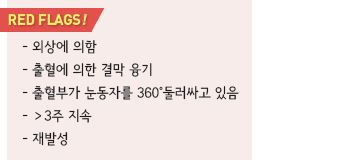

# 결막하출혈 Subconjunctival Hemorrhage

## 일반 사항

* 안구 결막과 공막 사이의 혈액 고임 상태

## 원인 또는 위험 인자

* spontaneous
* 외상, 콘택트렌즈
* 흉강 내 압력 상승 : 기침, 구역질
* 고혈압(고령에서 보다 흔함), 당뇨
* 항응고제 복용, 출혈 질환

## 임상 양상

* 명확한 경계를 가진 국소의 평평한 붉은 반점; 하부의 공막이 보이지 않음
* 외관상 문제 외에는 문제없음; 분비물 없음, 통증 없음, 시력 문제 없음

***

## Management

* 유효한 치료 방법 없음
* 자발적, 비외상성 결막하출혈은 치료 필요 없음; 2\~3주 내 후유 장애 없이 자연 치유됨
* 원인에 따른 조치
* 항응고제 복용 환자에 대해서는 응고 검사, 항응고제 용량 조절

> **질병코드** H11.3 결막출혈

S05.08 이물에 대한 언급이 없는 기타 결막찰과상 및 각막찰과상 질병코드
