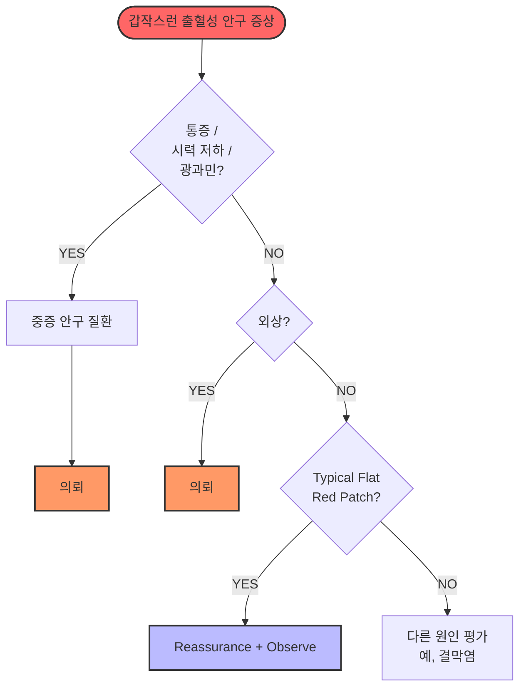

# 결막하출혈 Subconjunctival Hemorrhage

## <mark style="color:green;">일반 사항</mark>

* 안구 결막과 공막 사이에 혈액이 고인 상태 (subconjunctival hemorrhage, SCH)
* 대부분 자연 치유되며 후유 장애 없음; 외관상 문제가 주된 호소
* 대부분 통증·시력 변화는 없으며, 경미한 이물감은 동반될 수 있음; 분비물은 없음

## <mark style="color:green;">원인 및 위험인자</mark>

* 특발성(spontaneous) : 가장 흔함; 원인 불명
* 압력 상승(Valsalva) : 기침, 재채기, 구역·구토, 무거운 물건 들기·웨이트 트레이닝(스쿼트 등), 관악기 연주, 분만, 심한 변비에서의 과도한 힘주기; 수면 무호흡(야간 반복적 흉강 내압 상승)도 원인 불명 재발성 SCH의 잠재 요인으로 보고됨
* 외상 : 직접 안구 외상, 콘택트렌즈
* 전신 요인 : 고혈압(고령에서 보다 흔함), 당뇨
* 혈액 요인 : 항응고제(와파린, DOAC-아픽사반·리바록사반·다비가트란 등)·항혈소판제(아스피린·클로피도그렐) 복용, 출혈 질환(혈소판 감소증 등)
  * 건강기능식품 문진 필수 : 오메가-3 고용량, 비타민 E, 은행잎 추출물(징코) 등도 출혈 경향을 높일 수 있음; 처방약이 아니어서 환자가 자발적으로 보고하지 않는 경우 많음

## <mark style="color:green;">임상 양상</mark>

* 명확한 경계를 가진 국소의 평평한 붉은 반점; 하부의 공막이 보이지 않음
* 진단적 음성 지표 : 뚜렷한 통증 없음, 눈부심(photophobia) 없음, 시력 저하 없음, 분비물 없음, 동공 이상 없음 → 이 중 뚜렷한 이상이 하나라도 있으면 다른 질환 적극 감별 (단, 경미한 이물감·자극감은 SCH에서도 가능)
* 출혈은 처음 수일간 범위가 넓어지거나 색이 짙어질 수 있음 → 정상 경과이므로 미리 설명
* 이후 선명한 빨간색 → 짙은 빨간색 → 황록색으로 변하며 흡수됨 (헤모글로빈이 빌리베르딘·빌리루빈으로 대사되는 과정)
* 흡수 기간 : 소량 출혈은 1주 이내, 대량 출혈은 3주까지 소요; 환자 나이·전신 질환에 따라 차이 있음

## <mark style="color:green;">감별 진단</mark>

**▶ 1차 진료 핵심 판단 기준 : 뚜렷한 통증·시력 저하·광과민이 없으면 대부분 단순 SCH이다**

"눈이 갑자기 빨개졌다"는 주소로 내원한 환자에서 아래 질환들의 감별이 필요\
뚜렷한 통증, 시력 저하, 광과민이 있는 경우 다른 질환을 적극 감별; 경미한 이물감·자극감만 있는 경우는 SCH에서도 나타날 수 있음

<table><thead><tr><th width="110">감별 질환</th><th width="155">충혈 양상</th><th width="170">SCH에는 없는 것</th><th>추가 감별 포인트</th></tr></thead><tbody><tr><td><strong>결막염</strong></td><td>전반적 미만성 충혈</td><td>분비물 없음, 가려움 없음</td><td>분비물·가려움 동반; 명확한 경계 없음</td></tr><tr><td><strong>상공막염</strong><br><strong>/공막염</strong></td><td>국소 자색(violet) 충혈</td><td>통증 없음</td><td>국소 압통; 공막염은 심한 안구통, 안구 운동 시 악화</td></tr><tr><td><strong>급성 폐쇄각</strong><br><strong>녹내장</strong></td><td>모양 충혈(ciliary flush)</td><td>두통 없음, 시력 저하 없음, 동공 이상 없음</td><td>심한 두통·구역, 동공 중등도 산대·반응 소실</td></tr><tr><td><strong>각막염</strong><br><strong>/포도막염</strong></td><td>모양 충혈(ciliary flush)</td><td>눈부심 없음, 시력 저하 없음</td><td>눈부심·눈물·시력 저하; 각막 혼탁 또는 전방 염증</td></tr><tr><td><strong>결막하 종양</strong><br><strong>/혈관종</strong></td><td>국소 융기성 병변</td><td>—</td><td>재발성; 경계 불규칙·융기; 항생제·경과 관찰에 무반응</td></tr></tbody></table>

### <mark style="color:$danger;">🚩 Red Flags!</mark>

<mark style="color:$danger;">**즉각 조치 또는 의뢰**</mark>

* 외상에 의한 SCH → 안구 파열·안와 골절 동반 가능 → 즉시 안과 의뢰
* 심한 chemosis(결막 융기) 또는 외상 동반 시 → 안구 손상 가능성 고려 → 즉시 안과 의뢰
* 출혈부가 각막윤부(limbus)를 360° 둘러싸고 있음 → 안구 파열 또는 심한 외상 의심 소견 → 즉시 안과 의뢰

<mark style="color:$warning;">**당일 또는 조기 의뢰**</mark>

* 3주 이상 지속 → 자연 흡수되지 않는 원인 감별 필요
* 재발성 SCH → 혈액 질환·혈관 질환·전신 원인 평가; 짧은 간격으로 반복되는 경우(예: 수주\~1개월 내 재발) 응고 이상(coagulopathy) 검사 우선 시행
* 항응고제 복용 환자 → 응고 검사(INR 등) 및 용량 적절성 확인; 임의 중단 금지

<mark style="color:$info;">**외래 추적 / 추가 평가 계획**</mark> <mark style="color:$info;">- 즉각 위험 낮으나 호전 없으면 의뢰</mark>

* 고혈압이 원인으로 의심될 경우 → 혈압 측정 및 조절
* 첫 발생이더라도 고령·항응고제 복용·출혈 경향이 있는 경우 → 기저 질환 확인
* 재발성 SCH → 고혈압·당뇨·이상지질혈증 등 심혈관 위험 인자 평가 권장 (재발성 SCH 자체가 심혈관 질환의 직접 전조는 아니나 공통 위험 인자를 공유함); 고령 재발성 환자에서 갑상샘 기능 확인도 고려
* 원인 불명 재발성 SCH + 비만·고령·코골이 → 폐쇄성 수면 무호흡(OSA) 가능성 고려; 수면 습관 문진 권장 (강한 근거는 제한적이나 연관성이 보고됨)

***

## <mark style="background-color:$warning;">Management</mark>

### <mark style="color:orange;">치료 방침</mark>

* 자발성·비외상성 SCH는 치료 불필요; 대부분 1\~3주 내 자연 치유 (크기에 따라 차이)
* 이물감·자극감 호소 시 인공 눈물 점안으로 증상 완화
* 냉찜질 : 초기 24시간 내 냉찜질은 불편감 감소에 도움이 될 수 있음; 출혈 흡수를 촉진한다는 근거는 확립되지 않음. 온찜질은 급성기에는 권장하지 않음
* 원인에 따른 조치
  * 고혈압 → SCH와 직접 인과보다 연관성이 높음; 혈압 측정 및 조절 권장
  * 항응고제 복용 → 와파린: INR 확인 및 용량 적절성 협의 / DOAC: 복용 여부·용량·신기능 확인; 처방 의사와 협의; 환자가 임의로 중단하지 않도록 주의
  * 출혈 질환 → 의뢰




<p align="center">Sudden Red Eye 관리 알고리듬 </p>

<p align="center"><em>경미한 이물감만 있는 경우는 SCH에서 가능 — 뚜렷한 통증·시력 저하·광과민이 없으면 의뢰 불필요</em><br><em>360° limbal 출혈, 심한 chemosis → 즉시 의뢰</em><br><em>수주~1개월 이내 재발 → 응고 검사 및 전신 원인 평가</em></p>

***

### <mark style="color:red;">질병코드</mark>

H11.3 결막출혈 (자발성 SCH)

S05.08 이물에 대한 언급이 없는 기타 결막찰과상 및 각막찰과상 (외상성 SCH에 사용; 자발성 SCH에는 H11.3 단독 적용)

***

## <mark style="color:purple;">처방례</mark>

> **처방례. 자발성 결막하출혈 (이물감·자극감 동반 시)**
>
> ```
> 인공눈물 점안액(무방부제) 0.5 ㎖×30개/box  1방울 필요 시 (prn)
> ```
>
> _✽결막하출혈 자체에 대한 약물 치료는 없음. 인공눈물은 이물감·건조감 완화 목적으로만 사용. 출혈은 크기에 따라 1\~3주 내 자연 흡수됨을 반드시 설명하여 불필요한 재내원을 줄임_

***

### <mark style="color:$success;">핵심 복약 지도</mark>

> **인공눈물 사용 안내**
>
> * 점안액은 아래 눈꺼풀을 살짝 당긴 후, 결막낭(아랫 눈꺼풀 안쪽)에 1방울 떨어뜨리십시오. 약병 끝이 눈에 닿지 않도록 주의하십시오.
> * 점안 후 수 초 동안 눈을 살며시 감고, 눈 안쪽(코 옆 눈물점)을 손가락으로 1\~2분간 가볍게 눌러 주십시오.
> * 단회용(일회용) 제품은 개봉 후 즉시 사용하고 남은 양은 버리십시오.
> * 다회용 제품은 개봉 후 4주가 지나면 사용하지 마십시오.

> **경과 및 주의사항 안내**
>
> * 결막하출혈은 눈 속의 작은 혈관이 터진 것으로, **통증·분비물·시력 저하는 없습니다.**
> * 처음 며칠간 출혈 범위가 조금 더 넓어지거나 색이 짙어질 수 있으나 이는 정상 경과입니다.
> * 출혈은 크기에 따라 **1\~3주 내에 저절로 흡수**됩니다. 빨간색 → 짙은 빨간색 → 황록색으로 변해가며 사라집니다.
> * 눈을 비비거나 과도하게 만지지 마십시오. 출혈이 악화될 수 있습니다.
> * 항응고제(와파린, 아픽사반·리바록사반 등 DOAC, 아스피린·클로피도그렐 등)를 복용 중인 경우 담당 의사에게 알려 주십시오. **결막하출혈이 생겼다고 해서 항응고제를 임의로 중단해서는 안 됩니다.** (와파린 복용 중이라면 INR 수치 확인이 필요할 수 있으며, DOAC 복용 중이라면 용량 및 복용 이행 여부를 의사가 확인합니다)
> * 오메가-3 고용량, 비타민 E, 은행잎 추출물(징코) 등 건강기능식품을 드시고 있다면 의사에게 알려 주십시오. 이러한 제품도 출혈 경향을 높일 수 있습니다.

> **언제 다시 병원을 방문해야 하나요?**
>
> * 출혈과 함께 **눈의 통증** 또는 **시력 저하**가 동반되는 경우 — 즉시 내원
> * 소량 출혈이 **1주, 대량 출혈이 3주가 지나도 흡수되지 않는** 경우
> * 결막하출혈이 **반복적으로 재발**하는 경우 (특히 **수주\~1개월 이내 재발 시** 응고 검사 필요)
> * 출혈 부위가 **결막 전체를 둘러싸거나 결막이 부풀어 오르는** 경우 — 즉시 내원

***

### <mark style="color:blue;">환자 안내서</mark>


**결막하출혈이란?**

결막하출혈은 눈 속이 아니라 **눈 흰자위 표면에 생긴 멍**입니다. 흰자위(결막) 아래의 작은 혈관이 터져 피가 고이는 상태로, 눈이 갑자기 빨개져서 놀라는 경우가 많지만, 대부분 통증이나 시력 변화는 없으며 1\~3주 내에 저절로 흡수됩니다. 특별한 치료 없이 경과를 지켜보면 됩니다.


#### <mark style="color:$primary;">왜 생기나요?</mark>

* 특별한 원인 없이 자연적으로 발생하는 경우가 가장 흔합니다.
* 기침, 재채기, 구역질, 심한 변비에서 힘주기, 무거운 웨이트 트레이닝처럼 순간적으로 눈에 압력이 가해질 때 생기기도 합니다.
* 고혈압, 당뇨, 항응고제(와파린, 아픽사반·리바록사반 등) 복용이 관련될 수 있습니다.
* 오메가-3 고용량, 비타민 E, 은행잎 추출물 등 건강기능식품도 출혈 경향을 높일 수 있습니다.
* 외상(눈을 세게 비비거나 부딪힌 경우)으로도 발생합니다.

#### <mark style="color:$primary;">어떻게 변해가나요?</mark>

* 처음 며칠간은 출혈 범위가 조금 더 넓어지거나 색이 짙어질 수 있습니다. **이는 정상 경과**이므로 걱정하지 않아도 됩니다.
* 이후 빨간색 → 짙은 빨간색 → 황록색 순으로 변하며 흡수됩니다. 피부 멍이 없어지는 과정과 같습니다.
* 소량 출혈은 **1주 이내**, 대량 출혈은 **3주까지** 걸릴 수 있습니다.

#### <mark style="color:$primary;">집에서 어떻게 관리하나요?</mark>

* **눈 비비기 금지** : 출혈이 악화될 수 있으므로 눈을 만지거나 비비지 마십시오.
* **인공눈물** : 이물감이나 뻑뻑함이 느껴지면 인공눈물로 불편감을 줄일 수 있습니다.
* **혈압 관리** : 고혈압이 있다면 꾸준히 조절하십시오. 혈압이 높으면 재발하기 쉽습니다.
* **변비 관리** : 심한 변비로 과도하게 힘을 주면 재발할 수 있습니다. 충분한 수분·식이섬유 섭취로 배변을 원활하게 유지하십시오.
* **무거운 물건 주의** : 무거운 물건을 들거나 강도 높은 웨이트 트레이닝 시 순간적으로 눈 혈관에 압력이 가해질 수 있습니다.
* **항응고제 복용 중인 경우** : 결막하출혈이 생겼다고 해서 와파린·아픽사반·리바록사반·아스피린 등을 임의로 중단하지 마십시오. 중단이 필요한지는 반드시 담당 의사와 상의하십시오.

#### <mark style="color:$primary;">이럴 때는 즉시 병원을 방문하세요</mark>

* 출혈과 함께 **눈의 통증**이 있거나 **시력이 떨어지는** 경우
* **결막이 부풀어 오르거나** 출혈이 각막(검은 눈동자) 주변 전체를 둘러싸는 경우
* 소량 출혈은 1주, 대량 출혈은 **3주가 지나도 흡수되지 않는** 경우
* 결막하출혈이 **자주 반복되는** 경우, 특히 **수주\~1개월 이내에 재발**한 경우
* **외상 후** 발생한 경우 (안구 내부 손상 동반 가능)

#### <mark style="color:$primary;">출혈 범위에 따른 예상 흡수 기간</mark>

<table><thead><tr><th width="230">출혈 범위</th><th width="129">예상 흡수 기간</th></tr></thead><tbody><tr><td>점 모양 또는 아주 작은 반점</td><td>3~5일</td></tr><tr><td>흰자위 일부(1/4 이하)</td><td>약 1주</td></tr><tr><td>흰자위 절반 정도</td><td>1~2주</td></tr><tr><td>흰자위 대부분 또는 전체</td><td>2~3주 이상</td></tr></tbody></table>

※ 출혈을 발견한 날 출혈 범위를 확인하세요(사진 촬영), 3\~4일 후 색이 변하기 시작했는지 살펴 보세요, 1주일 후 범위가 줄어들었는지 살펴 보세요.

※ 고혈압·당뇨·항응고제 복용 중인 경우 흡수가 더 오래 걸릴 수 있습니다.

#### <mark style="color:$primary;">단순 결막하출혈인지 확인하세요</mark>


아래 항목 중 **하나라도 해당하면** 단순 결막하출혈이 아닐 수 있습니다. 즉시 병원을 방문하십시오.

* 눈을 움직일 때 통증이 있다
* 평소보다 빛이 더 눈부시게 느껴진다
* 시야가 뿌옇거나 가려져 보인다
* 분비물(눈곱)이 평소보다 심하다
* 두통 또는 구역이 동반된다

**전부 '해당 없음'이라면, 경과를 관찰합니다.**

