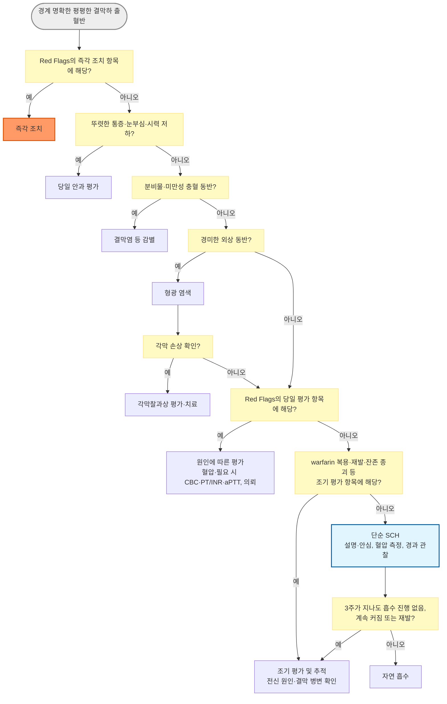

# 결막하출혈 Subconjunctival Hemorrhage (SCH)

## <mark style="color:green;">일반 사항</mark>

* 안구 결막과 공막 사이에 혈액이 고인 상태 (subconjunctival hemorrhage, SCH)
* 대부분 자연 치유되며 후유 장애 없음; 외관상 문제가 주된 호소
* 대부분 통증·시력 변화는 없으며, 경미한 이물감은 동반될 수 있음; 분비물은 없음
* 역학 : 대만 인구기반 연구(청구자료)에서 비외상성 SCH의 연간 발생률은 약 0.6%; 여성에서 더 흔하고 60\~69세에서 가장 높았음 \[PLOS One 2015]
* 예후 : 인구기반 코호트에서 SCH 환자의 뇌출혈·위장관 출혈이나 급성관상동맥증후군 위험 증가는 관찰되지 않았음 \[Sci Rep 2023] \[Front Cardiovasc Med 2021]; 출혈 질환이 의심되는 개별 환자의 평가 필요성은 별개임

## <mark style="color:green;">원인 및 위험 인자</mark>

* 특발성(idiopathic) : 가장 흔함; 원인 불명
* 압력 상승(Valsalva) : 기침, 재채기, 구역·구토, 무거운 물건 들기·웨이트 트레이닝(스쿼트 등), 관악기 연주, 분만, 심한 변비에서의 과도한 힘주기
* 수면 무호흡 : SCH와의 연관은 주로 야간 고혈압을 동반한 증례보고 수준; 확립된 위험 인자로 일반화하기에는 근거 제한적
* 외상 : 직접 안구 외상, 눈 비비기
* 국소 안과 요인 : 결막이완증(conjunctivochalasis; 고령 재발성 SCH의 흔한 국소 원인), 안과 수술·유리체강내 주사 후, 콘택트렌즈
* 전신 요인 : 고혈압(고령에서 보다 흔함), 당뇨
* 혈액 요인 : 항응고제(warfarin, DOAC - apixaban·rivaroxaban·edoxaban·dabigatran)·항혈소판제(aspirin·clopidogrel) 복용, 출혈 질환(혈소판 감소증, 백혈병, von Willebrand병 등)
  * 건강기능식품·보충제의 종류와 용량도 문진; 일반 오메가-3 보충제의 출혈 위험 증가는 뚜렷하지 않으나 고용량 정제 EPA에서 소폭의 출혈 위험 증가가 보고됨 \[JAHA 2024]; SCH와의 직접 연관 근거는 제한적
* 감염 : 급성 출혈성 결막염(enterovirus 70, coxsackievirus A24 변이; 제4급 감염병), 유행성각결막염; 발열성 전신 감염 - 신증후군출혈열, 렙토스피라증
* 소아 : 신생아는 분만 과정에서 흔히 발생하며 1\~2주 내 자연 소실; 영아·유아의 설명되지 않는 SCH는 학대 및 백일해(발작성 기침) 감별 필요

## <mark style="color:green;">임상 양상</mark>

* 명확한 경계를 가진 국소의 평평한 붉은 반점; 하부의 공막이 보이지 않음 ([결막하출혈 이미지](https://www.aoa.org/healthy-eyes/eye-and-vision-conditions/subconjunctival-hemorrhage))
* 진단적 음성 지표 : 뚜렷한 통증 없음, 눈부심 없음, 시력 저하 없음, 분비물 없음, 동공 이상 없음 → 이 중 뚜렷한 이상이 하나라도 있으면 다른 질환 적극 감별 (단, 경미한 이물감·자극감은 SCH에서도 가능)
* 출혈은 처음 수일간 범위가 넓어지거나 색이 짙어질 수 있음 → 정상 경과이므로 미리 설명
* 이후 선명한 빨간색 → 짙은 빨간색 → 황록색으로 변하며 흡수됨 (헤모글로빈이 빌리베르딘·빌리루빈으로 대사되는 과정)
* 흡수 기간 : 대부분 1\~3주 내 자연 흡수되며, 광범위한 출혈은 4주 정도 걸릴 수 있음; 흡수가 진행되지 않거나 계속 커지는 경우 재평가
* 외상 후 SCH에서 출혈의 뒤쪽 경계가 보이지 않고 후방으로 이어지면 안와 골절 또는 두개저 골절 가능성

### <mark style="color:$danger;">🚩 Red Flags!</mark>

<mark style="color:$danger;">**즉각 조치**</mark>

* 중등도 이상의 안구 외상, 관통상·고속 이물(연마·망치질 등), 또는 외상 후 시력 저하·심한 통증·동공 이상·전방출혈·안구 돌출 동반  `안구 파열` `안구내 이물`
* 외상 후 360° 또는 결막이 부풀어 오른 융기성(bullous) 결막하출혈  `잠재적 안구 손상(occult globe injury)`
* 두부·안면 외상 후 출혈의 뒤쪽 경계가 보이지 않음  `안와 골절` `두개저 골절`
* 급격하거나 심한 시력 저하 동반  `안과적 응급질환`
* 현저한 혈압 상승과 함께 흉통·호흡곤란·신경학적 이상·의식 변화·급격한 시력 변화 등 급성 표적장기손상 의심 소견 동반  `고혈압 응급`
* 다른 부위 출혈이 많거나 창백·어지럼·의식 변화 등 전신 상태 악화 동반  `중증 혈소판 감소증` `급성 백혈병`

<mark style="color:$warning;">**당일 평가**</mark>

* 새로 생긴 피부 점상출혈·멍, 잇몸·코 출혈 등 다른 부위 출혈 동반  `혈소판 감소증` `백혈병` `응고 장애`
* 발열·근육통·두통 동반 (야외 활동력)  `신증후군출혈열` `렙토스피라증`
* 영아·유아에서 설명되지 않는 결막하출혈  `아동 학대` `백일해`
* 수축기 ≥180 ㎜Hg 또는 이완기 ≥120 ㎜Hg가 반복 측정에서 지속  `중증 고혈압`

<mark style="color:$info;">**조기 평가 및 추적**</mark>

* warfarin 복용 중 발생  `INR 치료범위 초과`
* 3주가 지나도 흡수가 진행되지 않거나 계속 커짐, 같은 부위 반복 출혈 또는 잔존 종괴  `결막 림프종` `결막 혈관 병변` `결막 아밀로이드증`
* 재발성 SCH (특히 수주 간격의 짧은 재발, 양측성)  `응고 장애` `결막이완증`
* 재발성 SCH + 고혈압·당뇨·이상지질혈증 미평가 상태 (재발성 SCH 자체가 심혈관 질환의 직접 전조는 아니나 공통 위험 인자를 공유함)  `고혈압` `당뇨병`
* 원인 불명 재발성 SCH + 코골이·목격된 무호흡·주간졸림·저항성 고혈압 (연관성 보고, 근거 제한적)  `폐쇄성 수면 무호흡`

## <mark style="color:green;">진단</mark>

* 임상적 진단 : 특별한 검사 없이 병력 청취와 육안·세극등 소견만으로 대부분 진단 가능
* 기본 확인 항목
  * 시력 (정상 여부 - 단순 SCH에서는 시력에 영향 없음)
  * 동공 크기 및 반응
  * 통증 유무 및 눈부심 여부
  * 안구 운동 시 통증 유무
  * 외상 여부; 외상 시 출혈의 뒤쪽 경계 확인
  * 각막 투명도 (혼탁 여부)
  * 필요 시 형광 염색(fluorescein staining) - 각막 손상 동반 여부 확인
  * 혈압 측정
* 비외상성·첫 발생의 전형적인 SCH에서 위 확인 항목이 정상이고 다른 출혈 소견이 없으면 추가 영상 또는 검사실 검사는 일반적으로 불필요; 항응고제 복용·재발 등은 별도 평가
* 재발성 SCH 또는 다른 출혈 소견 동반 시 : CBC(혈소판 포함), PT/INR, aPTT; 정상이나 출혈 병력이 있으면 von Willebrand 검사 또는 혈액내과 의뢰

### <mark style="color:orange;">감별</mark>

"눈이 갑자기 빨개졌다"는 주소로 내원한 환자에서 아래 질환들의 감별이 필요 (☞ [눈 충혈](037_-red-eye.md))\
뚜렷한 통증, 시력 저하, 눈부심이 있는 경우 다른 질환을 적극 감별; 경미한 이물감·자극감만 있는 경우는 SCH에서도 나타날 수 있음

<table><thead><tr><th width="130">감별</th><th width="170">충혈·병변 양상</th><th>SCH와 구별되는 소견</th></tr></thead><tbody><tr><td><strong>결막염</strong></td><td>결막 전반 미만성 충혈, 혈관이 개별로 보임</td><td>분비물·가려움·눈곱, 양측성 흔함</td></tr><tr><td><strong>급성 출혈성 결막염</strong><br><strong>/유행성각결막염</strong></td><td>점상·융합성 결막하출혈 + 결막 충혈</td><td>여포, 분비물·이물감·통증, 귀앞 림프절, 주변 유행; 전염성 높음; 급성 출혈성 결막염·유행성각결막염은 제4급 감염병 (☞ <a href="038_-conjunctivitis.md">결막염</a>)</td></tr><tr><td><strong>상공막염</strong></td><td>분절성 선홍색 충혈</td><td>경미한 불편감·압통; 흰 공막 위로 확장된 혈관이 보임</td></tr><tr><td><strong>공막염</strong></td><td>깊은 자색(violaceous) 충혈</td><td>심한 심부 통증(야간·안구 운동 시 악화), 압통, 자가면역 질환 동반</td></tr><tr><td><strong>급성 폐쇄각 녹내장</strong></td><td>모양체충혈(ciliary flush)</td><td>심한 안구통·두통·구역/구토, 각막 부종, 중등도 산동, 시력 저하</td></tr><tr><td><strong>각막염</strong><br><strong>/포도막염</strong></td><td>모양체충혈(ciliary flush)</td><td>눈부심·통증·시력 저하, 각막 혼탁 또는 전방 염증</td></tr><tr><td><strong>결막 종양</strong><br><strong>/혈관 병변</strong></td><td>연어살색 또는 적자색 융기 병변</td><td>융기·경계 불규칙, 흡수 진행 없음·같은 부위 반복 출혈·잔존 종괴 (림프종, 카포시육종, 드물게 아밀로이드증 등)</td></tr></tbody></table>

***


```mermaid
graph TD
    Start(["경계 명확한 평평한 결막하 출혈반"]) --> Q1["Red Flags의 즉각 조치 항목에 해당?"]
    Q1 -- 예 --> R1["즉각 조치"]
    Q1 -- 아니오 --> Q2["뚜렷한 통증·눈부심·시력 저하?"]
    Q2 -- 예 --> R4["당일 안과 평가"]
    Q2 -- 아니오 --> Q2b["분비물·미만성 충혈 동반?"]
    Q2b -- 예 --> D1["결막염 등 감별"]
    Q2b -- 아니오 --> Q3["경미한 외상 동반?"]
    Q3 -- 예 --> F1["형광 염색"]
    F1 --> QF["각막 손상 확인?"]
    QF -- 예 --> C1["각막찰과상 평가·치료"]
    QF -- 아니오 --> Q4["Red Flags의 당일 평가 항목에 해당?"]
    Q3 -- 아니오 --> Q4
    Q4 -- 예 --> R2["원인에 따른 평가<br/>혈압·필요 시 CBC·PT/INR·aPTT, 의뢰"]
    Q4 -- 아니오 --> Q4b["warfarin 복용·재발·잔존 종괴 등<br/>조기 평가 항목에 해당?"]
    Q4b -- 예 --> R3["조기 평가 및 추적<br/>전신 원인·결막 병변 확인"]
    Q4b -- 아니오 --> M1["단순 SCH<br/>설명·안심, 혈압 측정, 경과 관찰"]
    M1 --> Q5["3주가 지나도 흡수 진행 없음,<br/>계속 커짐 또는 재발?"]
    Q5 -- 예 --> R3
    Q5 -- 아니오 --> E1["자연 흡수"]

    style Start fill:#eeeeee,stroke:#888888,stroke-width:2px
    style Q1 fill:#fff9c4,stroke:#ffe082
    style Q2 fill:#fff9c4,stroke:#ffe082
    style Q2b fill:#fff9c4,stroke:#ffe082
    style Q3 fill:#fff9c4,stroke:#ffe082
    style QF fill:#fff9c4,stroke:#ffe082
    style Q4 fill:#fff9c4,stroke:#ffe082
    style Q4b fill:#fff9c4,stroke:#ffe082
    style Q5 fill:#fff9c4,stroke:#ffe082
    style R1 fill:#f96,stroke:#e65100,stroke-width:2px
    style M1 fill:#e1f5fe,stroke:#01579b,stroke-width:2px
```

<p align="center"><strong>결막하출혈 감별 및 관리 알고리듬</strong></p>

<p align="center"><em><mark style="color:$info;">저자 재구성 (참고 문헌 : EyeWiki(AAO) Subconjunctival Hemorrhage; StatPearls)</mark></em></p>

***

## <mark style="background-color:$warning;">Management</mark>

### <mark style="color:orange;">치료 방침</mark>

* Red Flags의 즉각 조치 항목에 해당하면 원인에 따라 응급실 또는 응급 안과 평가
* 단순 자발성·비외상성 SCH는 치료 불필요; 대부분 1\~3주 내 자연 치유하며, 광범위한 출혈은 4주 정도 걸릴 수 있음
* 이물감·자극감 호소 시 인공눈물 점안으로 증상 완화
* 찜질(냉·온)이 흡수를 촉진한다는 효과는 확립되지 않음; 냉찜질은 초기 불편감 완화에 사용 가능
* 원인에 따른 조치
  * 외상 : 개방성 안구 손상이 의심되면 안구를 압박하지 말고 단단한 보호 덮개(eye shield)를 적용한 뒤 응급 안과 평가; 안압 측정·압박 안대·박힌 이물 제거는 하지 않음. 명백한 관통·파열에서는 추가 검사로 의뢰를 지연하지 않음. Seidel 검사 음성만으로 후방 공막 손상이나 자연 봉합된 관통상을 배제할 수 없음
  * 고혈압 : SCH의 직접 원인이라기보다 연관된 위험 인자; 내원 시 혈압이 높으면 안정 후 재측정하고, 지속 상승 시 고혈압 평가. 단순 SCH는 급성 표적장기손상에 해당하지 않음; 현저한 혈압 상승과 급성 표적장기손상 의심 소견이 동반되면 응급 평가
  * 항응고·항혈소판제 : 임의 중단 금지. warfarin은 INR 확인 및 처방 의사와 용량 협의; 최근 INR 검사·용량 변경·동반 출혈에 따라 검사 시점 결정; DOAC는 INR을 모니터링 지표로 쓰지 않으므로 복용 이행·용량·신기능 확인; 단독 SCH만으로 항응고 중단 사유가 되지 않음
  * 출혈 질환 의심 : 새로 생긴 다른 부위 출혈이나 점상출혈은 당일 CBC·PT/INR·aPTT 등 평가; 이상 시 혈액내과 의뢰. 출혈이 많거나 전신 상태가 악화되면 응급 평가
  * 영아·유아 : 분만 관련 신생아 SCH 외에는 경위를 확인하고, 설명되지 않으면 당일 평가하고 학대 평가 절차에 따름

***

## <mark style="color:red;">질병코드</mark>

* H11.3 결막출혈 Conjunctival haemorrhage
* S05.0 이물에 대한 언급이 없는 결막의 손상 및 각막찰과상 Injury of conjunctiva and corneal abrasion without mention of foreign body

> S05.0은 결막·각막 손상이 실제로 동반된 경우에 적용

***

## <mark style="color:purple;">처방례</mark>

> **처방례 1. 결막하출혈 + 건성안 동반 (이물감·건조감 호소 시)**
>
> ```
> 히알루미니점안액0.1% 0.5 ㎖/관  1회 1방울  1일 4회
> ```
>
> _✽결막하출혈 자체에 대한 약물 치료는 없으며, SCH만을 사유로 한 히알루론산 점안제 처방은 급여 인정 대상이 아님. 히알루론산 점안제는 건성안증후군 등 내인성 질환에 의한 각결막상피장애에 급여 인정되며, 외인성 질환 이후 지속되는 내인성 각결막상피장애로 진단된 경우도 포함함. 일회용은 원칙적으로 1일 최대 6관이며 일부 질환은 예외(☞ [눈마름증](042_-dry-eye.md)). 건성안이 실제 동반된 경우에만 해당 상병으로 처방하고, SCH 단독이면 일반의약품 인공눈물 구입을 안내함. 1관은 1회 사용 후 폐기. 출혈은 대부분 1\~3주 내 자연 흡수되며, 광범위한 출혈은 4주 정도 걸릴 수 있음을 설명함_

***

### <mark style="color:$success;">핵심 복약 지도</mark>

> **인공눈물 사용 안내**
>
> * 점안액은 아래 눈꺼풀을 살짝 당긴 후, 결막낭(아랫 눈꺼풀 안쪽)에 1방울 떨어뜨리십시오. 약병 끝이 눈에 닿지 않도록 주의하십시오. (☞ [안과계 약제](037_1-ophthalmic-medications.md))
> * 점안 후 수 초 동안 눈을 살며시 감아 약물이 눈 표면에 고르게 퍼지도록 하십시오.
> * 1회용 제품은 처음 개봉할 때 1\~2방울을 버린 뒤 점안하십시오(개봉 시 생긴 미세 파편 제거).
> * 1회용 제품은 개봉 후 즉시 사용하고 남은 양은 버리십시오.

> **경과 및 주의사항 안내**
>
> * 결막하출혈은 흰자위 표면(결막)의 작은 혈관이 터져 피가 고인 것으로, 눈 속 출혈이 아닙니다. 전형적으로 **통증·분비물·시력 저하가 없습니다.**
> * 처음 며칠간 출혈 범위가 조금 더 넓어지거나 색이 짙어질 수 있으나 이는 정상 경과입니다.
> * 출혈은 대부분 **1\~3주 내에 저절로 흡수**되며, 출혈이 넓으면 **4주 정도** 걸리기도 합니다 (개인차 있음). 빨간색 → 짙은 빨간색 → 황록색으로 변해가며 사라집니다.
> * 눈을 비비거나 과도하게 만지지 마십시오. 출혈이 악화될 수 있습니다.
> * 혈액을 묽게 하는 약(와파린, 아픽사반·리바록사반·에독사반 등, 아스피린·클로피도그렐)을 복용 중이면 담당 의사에게 알려 주십시오. **결막하출혈만으로 약을 임의로 중단해서는 안 됩니다.** 와파린 복용 중이라면 혈액 검사(INR)가 필요할 수 있습니다.
> * 복용 중인 건강기능식품도 약 목록에 포함하여 의사에게 알려 주십시오.

> **언제 다시 병원을 방문해야 하나요?**
>
> * 출혈과 함께 **눈의 통증** 또는 **시력 저하**가 동반되는 경우 - 즉시 내원
> * **외상 후** 출혈 부위가 검은 눈동자 주변 전체를 둘러싸거나 결막이 부풀어 오르는 경우 - 즉시 내원
> * 열이 나거나, 잇몸·코 출혈, 피부 멍이 함께 생긴 경우 - 즉시 내원
> * 출혈이 **3주가 지나도 줄어들지 않거나**, 처음 며칠이 지난 뒤에도 **계속 커지는** 경우
> * 결막하출혈이 **반복적으로 재발**하는 경우 (재발 간격이 짧거나 다른 출혈 소견이 동반되면 검사가 필요할 수 있음)

***

## <mark style="color:blue;">환자 안내서</mark>


**결막하출혈이란?**

결막하출혈은 눈 속이 아니라 **눈 흰자위 표면에 생긴 멍**입니다. 흰자위(결막) 아래의 작은 혈관이 터져 피가 고이는 상태로, 눈이 갑자기 빨개져서 놀라는 경우가 많지만, 대부분 통증이나 시력 변화는 없으며 1\~3주 내에 저절로 흡수됩니다. 출혈이 넓으면 4주 정도 걸리기도 합니다. 단순 결막하출혈은 특별한 치료 없이 경과를 지켜보면 됩니다.


#### <mark style="color:$primary;">왜 생기나요?</mark>

* 특별한 원인 없이 자연적으로 발생하는 경우가 가장 흔합니다.
* 기침, 재채기, 구역질, 심한 변비에서 힘주기, 무거운 웨이트 트레이닝처럼 순간적으로 눈에 압력이 가해질 때 생기기도 합니다.
* 고혈압, 당뇨, 혈액을 묽게 하는 약(와파린, 아픽사반·리바록사반·에독사반, 아스피린 등) 복용이 관련될 수 있습니다.
* 복용 중인 건강기능식품도 약 목록에 포함하여 의사에게 알려 주십시오.
* 외상(눈을 세게 비비거나 부딪힌 경우)으로도 발생합니다.

#### <mark style="color:$primary;">어떻게 변해가나요?</mark>

* 처음 며칠간은 출혈 범위가 조금 더 넓어지거나 색이 짙어질 수 있습니다. **이는 정상 경과**이므로 걱정하지 않아도 됩니다.
* 이후 빨간색 → 짙은 빨간색 → 황록색 순으로 변하며 흡수됩니다. 피부 멍이 없어지는 과정과 같습니다.
* 대부분 **1\~3주** 안에 흡수되며, 출혈이 넓으면 **4주 정도** 걸리기도 합니다 (개인차가 있음).

#### <mark style="color:$primary;">집에서 어떻게 관리하나요?</mark>

* **눈 비비기 금지** : 출혈이 악화될 수 있으므로 눈을 만지거나 비비지 마십시오.
* **인공눈물** : 이물감이나 뻑뻑함이 느껴지면 인공눈물로 불편감을 줄일 수 있습니다.
* **혈압 관리** : 고혈압이 있다면 꾸준히 조절하십시오. 혈압이 높으면 재발 위험이 높아질 수 있습니다.
* **변비 관리** : 심한 변비로 과도하게 힘을 주면 재발할 수 있습니다. 충분한 수분·식이섬유 섭취로 배변을 원활하게 유지하십시오.
* **무거운 물건 주의** : 무거운 물건을 들거나 강도 높은 웨이트 트레이닝 시 순간적으로 눈 혈관에 압력이 가해질 수 있습니다.
* **혈액을 묽게 하는 약을 복용 중인 경우** : 결막하출혈이 생겼다고 해서 와파린·아픽사반·리바록사반·에독사반·아스피린 등을 임의로 중단하지 마십시오. 중단이 필요한지는 반드시 담당 의사와 상의하십시오.

#### <mark style="color:$primary;">이럴 때는 즉시 병원을 방문하세요</mark>

* 출혈과 함께 **눈의 통증**이 있거나 **시력이 떨어지는** 경우
* **눈을 다친 뒤** 생긴 경우, 특히 결막이 부풀어 오르거나 출혈이 검은 눈동자 주변 전체를 둘러싸는 경우
* **열·근육통**이 함께 있거나, **잇몸·코 출혈, 피부 멍**이 함께 생긴 경우
* **아기**의 눈에 원인을 알 수 없는 출혈이 생긴 경우

#### <mark style="color:$primary;">진료 예약이 필요한 경우</mark>

* **3주가 지나도 줄어들지 않거나**, 처음 며칠이 지난 뒤에도 **계속 커지는** 경우
* 결막하출혈이 **자주 반복되는** 경우, 특히 재발 간격이 짧은 경우

> 출혈을 발견한 날 사진을 찍어 두고, 며칠 간격으로 찍은 사진과 전체적인 변화를 비교해 보십시오. 처음 며칠은 범위가 넓어질 수 있습니다.

#### <mark style="color:$primary;">단순 결막하출혈인지 확인하세요</mark>


아래 항목 중 **하나라도 해당하면** 단순 결막하출혈이 아닐 수 있습니다. 병원을 방문하십시오.

* 눈을 움직일 때 통증이 있다
* 평소보다 빛이 더 눈부시게 느껴진다
* 시야가 뿌옇거나 가려져 보인다
* 분비물(눈곱)이 평소보다 심하다
* 두통 또는 구역이 동반된다

**전부 '해당 없음'이고, 눈을 다치지 않았으며, 다른 부위 출혈이나 열이 없다면 경과를 관찰합니다. 아기에게 생긴 경우는 병원을 방문하십시오.**

