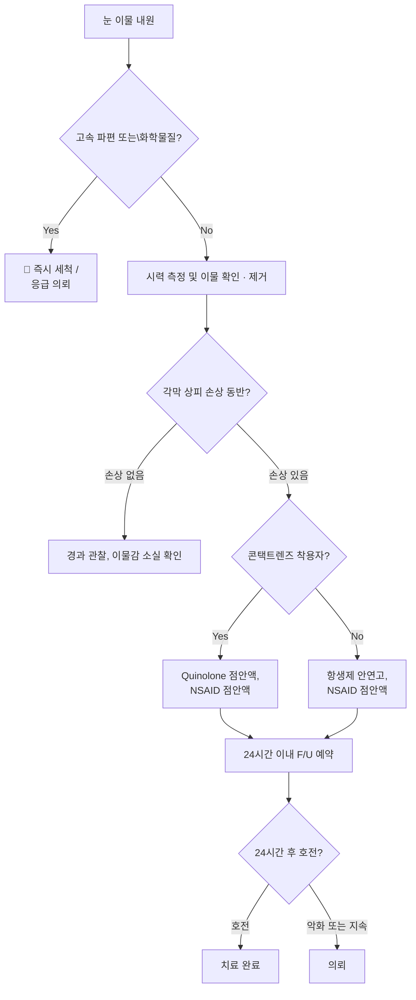

# 눈 이물 Foreign Body in the Eye

## <mark style="color:green;">일반 사항</mark>

* 주요 원인 : 속눈썹, 마른 눈곱, 모래, 먼지
* 증상 : 충혈, 눈물, 불편감 또는 통증(특히 눈을 깜박일 때), 눈부심
  * 이물에 의한 눈 충혈은 이물 제거 후에도 24시간 이상 지속될 수 있음
* 치료 전 시력 평가 필수
* 이물 종류에 따른 임상적 의미 차이에 유의

<table><thead><tr><th width="160">이물 종류</th><th width="220">주요 위험</th><th>특이 조치</th></tr></thead><tbody><tr><td>금속(철)</td><td>녹 흔적(rust ring) 잔존</td><td>rust ring은 즉시 완전 제거가 어려운 경우 24~48시간 후 제거가 더 용이; 잔존 시 의뢰</td></tr><tr><td>유기물(목편·식물)</td><td>감염률 높음 (진균 포함)</td><td>항생제 강화, 면밀한 추적</td></tr><tr><td>콘택트렌즈 파편</td><td>슬릿램프 없이 확인 어려움</td><td>의뢰</td></tr><tr><td>화학 물질·분진</td><td>지속적 각막 화학 손상</td><td>즉시 다량 세척 후 의뢰</td></tr></tbody></table>

### <mark style="color:$danger;">🚩 Red Flags!</mark>

<mark style="color:$danger;">**즉각 조치 또는 의뢰**</mark>

* 빠른 속도의 물체(망치질·연삭·예초 작업 등 금속 파편)에 의한 손상 → 안구 관통 배제 필수; fluorescein 하에서 Seidel test 양성이면 즉시 의뢰
* 화학 물질 노출, 날카로운 물체에 의한 손상, 동공이 원형이 아님(이물 방향으로 찌그러짐) → 즉시 세척 또는 안과 의뢰
* 결막보다 깊게 박혀 있는 이물
* 각막 중앙에 위치한 이물 또는 각막 손상이 의심되는 혼탁한 부위

<mark style="color:$warning;">**당일 또는 조기 의뢰**</mark>

* 제거 후에도 여전히 이물감이 남거나 눈물이 계속 흐름
* 제거 후 시력이 정상으로 돌아오지 않음
* 콘택트렌즈 착용자 : 각막 침윤(corneal infiltrate) 의심 시

<mark style="color:$info;">**외래 추적 / 추가 평가 계획**</mark> <mark style="color:$info;"></mark><mark style="color:$info;">- 즉각 위험 낮으나 호전 없으면 의뢰</mark>

* 이물 제거 후 24시간 이내 통증 증가, 충혈 악화, 시각 장애 발생
* 철 함유 이물 제거 후 rust ring 잔존이 의심되는 경우

***

## <mark style="background-color:$warning;">Management</mark>

### <mark style="color:orange;">Quick Decision Tips</mark>

<table><thead><tr><th width="258">핵심 질문</th><th width="340">YES →</th></tr></thead><tbody><tr><td>빠른 속도의 금속 파편이 튀었는가?</td><td>즉시 의뢰 (안구 관통 배제; Seidel test)</td></tr><tr><td>화학물질이 눈에 들어갔는가?</td><td>즉시 다량 세척(최소 15분) 후 의뢰</td></tr><tr><td>이물 제거 후에도 이물감이 남는가?</td><td>⚠️ 반드시 위 눈꺼풀을 뒤집어 확인 (missed FB의 주요 원인); 호전 없으면 의뢰</td></tr><tr><td>콘택트렌즈 착용자인가?</td><td>quinolone 점안액 선택; 각막 침윤 여부 확인</td></tr><tr><td>이물이 철 성분인가?</td><td>rust ring 잔존 여부 확인; 즉시 제거 어려우면 24~48시간 후 재내원 또는 의뢰</td></tr></tbody></table>

### <mark style="color:orange;">임상 흐름도</mark>



***

**1. 눈 주위 피부에 붙은 이물 제거**

* 고개를 숙이게 하고 눈은 감은 상태로 눈꺼풀에 바람을 붐
* 테이프로 눈 주위 피부의 이물을 떼어냄
* 물로 눈꺼풀과 얼굴을 씻어냄

**2. 눈 속의 이물 제거**

* 필요시 마취 안약(proparacaine 0.5% <mark style="color:blue;">\[알카인]</mark>) 사용 후 조작 (처치용; 처방 교부 금지 ☞ 아래 참조)
* 생리식염수로 세척이 원칙; 즉시 세척이 필요한 상황에서는 깨끗한 수돗물 사용 가능 — 화학물질 노출 시 최소 15분 이상 지속 세척
* 물에 적신 무균 면봉으로 부드럽게 묻혀 냄
* **이물 제거 후 fluorescein staining으로 각막 상피 결손 및 Seidel sign 확인** (Seidel sign 양성 → 안구 관통 의심 → 즉시 의뢰)
* ⚠️ **이물감 지속 시 반드시 위 눈꺼풀을 뒤집어 확인** — missed foreign body의 가장 흔한 원인; 상안검 결막에 숨어 있는 이물은 육안으로 놓치기 쉬움

**3. 이물 제거 후 조치**

* 항생제 안연고 수일간 적용 (연고가 윤활 효과도 함께 제공하므로 점안액보다 우선 선택)
  * tobramycin 안연고 <mark style="color:blue;">\[토라빈]</mark> qid ×3\~5d
  * oxytetracycline/polymyxin-B 안연고 <mark style="color:blue;">\[테라마이신]</mark> qid ×3\~5d
  * 상피 손상이 있는 각막은 감염되기 쉬움을 유의
  * **일반 환자에서는 광범위 quinolone 점안액보다 안연고를 우선 고려; quinolone 점안액은 콘택트렌즈 착용자 또는 감염 징후 의심 시에만 사용 (불필요한 내성 선택압 방지)**
* 콘택트렌즈 착용자 : _P. aeruginosa_ 위험을 고려하여 quinolone 계열 점안액 우선 선택; levofloxacin <mark style="color:blue;">\[크라비트]</mark>, moxifloxacin <mark style="color:blue;">\[모록사신]</mark> qid (경증 시 bid 가능); 필요 이상의 장기 투여는 금함
  * ※ Quinolone 점안액 사용 시 주의 : 내성균 선택압 및 불필요한 광범위 항균 범위 확대를 방지하기 위해 필요한 최단 기간(통상 3\~5일)에 한하여 사용하고, 감염 징후 해소 시 즉시 중단
* 눈 패치는 권장하지 않음 : 단순 각막 미란에서 치유를 촉진하지 않으며 통증 감소에도 유의한 이점이 없음 (Cochrane review); 패치를 하지 않은 경우 치유가 더 빠르고 시야 흐림도 적음
* 통증 조절 : 마취 안약은 금지 또는 제한 사용
  * 국소 NSAID 점안액 : bromfenac <mark style="color:blue;">\[브로낙]</mark> bid 또는 diclofenac 점안액 qid ×2\~3d — 단기 처방에 한함; 각막 상피 결손이 지속된 상태에서의 장기 사용 또는 고위험군(스테로이드 병용, 수술 후 등)에서 드물게 각막 합병증(corneal melt 등) 위험 증가
  * 경구 진통제 : ibuprofen, acetaminophen
* F/U : 24시간 이내 재진; **증상 완전 소실 + 중심부 병변 아님 + 시력 정상**의 세 조건을 모두 충족하는 경우에 한해 생략 가능

**파상풍 예방 접종**

**▶ 단순 비관통성 각막 이물 → 파상풍 예방 불필요** (☞ 파상풍 예방접종 챕터 참조)

* 단순 각막 표면 이물(비관통성) : 파상풍 예방 접종 불필요 - 각막은 무혈관 조직이며, 비관통성 손상 후 파상풍이 발생한 사례는 문헌상 보고된 바 없음
* 다음의 경우에 한하여 파상풍 접종 이력 확인 및 필요 시 접종 :
  * 관통성 안구 손상 또는 안내 이물(intraocular foreign body) 의심 → 의뢰 시 함께 처리
  * 안와 주변 피부 열상이 동반된 경우
  * 흙·녹슨 금속·유기물 이물로 인한 결막 열상 동반 시

_※ CDC 기준: 파상풍 불필요 - 최근 5년 이내 접종력 있음. 접종 필요(Td/Tdap) - 마지막 접종 후 5년 이상(오염 상처) 또는 10년 이상(청결 상처) 경과 시. 접종력 불명 또는 기초접종 미완료 + 오염 상처 - Td or Tdap + TIG_


**마취 안약(proparacaine 등) 처방·교부 금지**

처치실에서의 단회 사용 외에 환자에게 제공하지 않는다. 장기 남용 시 각막 궤양·영구 혼탁·실명으로 이어질 수 있다.

_※ 참고 : 2024년 ACEP는 단순 각막 미란(simple corneal abrasion)에 한하여 24시간 이내 소량(최대 2 mL) 처방이 안전할 수 있다는 Level B 권고를 발표하였으나, 미국안과학회(AAO)는 이에 동의하지 않고 공동 저자에서 철회하였다(Ann Emerg Med 2024). 국내 관행 및 안과 전문가 권고에 따라 현 시점에서는 처방 교부를 하지 않는다._


***

### <mark style="color:red;">질병코드</mark>

H02.80 눈꺼풀의 잔류이물

T15 외안의 이물

T26 열 및 화학물질에 의한 눈 및 부속기의 화상

***

## <mark style="color:purple;">처방례</mark>

> **처방례 1. 이물 제거 후 각막 미란 동반 (일반)**
>
> ```
> 토라빈 안연고 3.5 g/개  약 0.5 ㎝ qid ×3~5d
>     또는 테라마이신 안연고 3.5 g/개  약 0.5 ㎝ qid ×3~5d
> 브로낙 점안액 0.09% 5 ㎖/병  1방울 bid ×2~3d  (통증 조절)
> ```
>
> _✽이물 제거 후 각막 상피 손상 시 감염 예방 목적으로 항생제 안연고 수일간 적용. 연고가 윤활 효과도 겸하므로 점안액보다 우선. 브로낙은 단기 통증 조절 목적으로 병용 가능하나 장기 사용 금지. 마취 안약은 처방·교부하지 않음_

> **처방례 2. 이물 제거 후 각막 미란 동반 (콘택트렌즈 착용자)**
>
> ```
> 크라비트 점안액(0.5%) 5 ㎖/병  1방울 qid ×3~5d
>     또는 모록사신 점안액 5 ㎖/병  1방울 qid ×3~5d  (경증 시 bid 가능)
> 브로낙 점안액 0.09% 5 ㎖/병  1방울 bid ×2~3d  (통증 조절)
> ```
>
> _✽콘택트렌즈 착용자는 P. aeruginosa 각막 궤양 위험이 높으므로 quinolone 계열 우선 선택. 각막 침윤 여부를 반드시 확인하고 의심 시 즉시 안과 의뢰. Quinolone은 필요 최단 기간 사용_

***

### <mark style="color:$success;">핵심 복약 지도</mark>

> **항생제 안연고 사용 안내**
>
> * 항생제 안연고는 아래 눈꺼풀을 살짝 당긴 후 결막낭(아랫 눈꺼풀 안쪽)에 약 0.5 ㎝ 길이로 짜 넣으십시오. 연고 끝이 눈에 직접 닿지 않도록 주의하십시오.
> * 점안 후 눈을 살며시 감고 좌우로 천천히 굴려 연고가 고르게 퍼지도록 하십시오.
> * 연고를 바른 직후에는 일시적으로 시야가 흐릿할 수 있습니다. 운전이나 정밀 작업은 잠시 삼가십시오.
> * 증상이 나아졌더라도 처방 기간이 끝날 때까지 꾸준히 사용하십시오.
> * 개봉 후 4주가 지난 안연고는 오염 우려가 있으므로 사용하지 마십시오.

> **소염 진통 점안액(브로낙 등) 사용 안내**
>
> * 통증 완화 목적으로 단기간(2\~3일)만 사용합니다. 임의로 기간을 늘리지 마십시오.
> * 항생제 안연고와 함께 사용하는 경우, 점안 간격을 3\~5분 이상 두고 점안액을 먼저, 연고를 나중에 넣으십시오.
> * 콘택트렌즈를 착용 중이라면 점안 전 렌즈를 빼고 점안 후 15분 뒤에 착용하십시오.

> **이물 제거 후 주의사항**
>
> * 대부분의 각막 상처는 **24\~48시간 내**에 자연적으로 아뭅니다. 충혈은 그 이후에도 남을 수 있으니 너무 걱정하지 않으셔도 됩니다.
> * 눈이 낫는 동안은 눈을 비비거나 손으로 만지지 마십시오. 상처 부위에 감염이 생길 수 있습니다.
> * 콘택트렌즈는 의사의 확인을 받을 때까지 착용을 중단하십시오.

> **언제 다시 병원을 방문해야 하나요?**
>
> * 이물 제거 후 **24시간 이내** 예약한 추적 진료를 받으십시오 (증상이 완전히 소실된 경우에는 생략 가능합니다).
> * 통증이 오히려 **심해지거나** 충혈이 악화되는 경우 — 즉시 내원
> * **시력이 흐려지거나 떨어지는** 경우 — 즉시 내원
> * 이물감이 **여전히 느껴지거나** 눈물이 계속 흐르는 경우 — 즉시 내원

***

### <mark style="color:blue;">환자 안내서</mark>


**눈에 이물이 들어갔을 때는 당황하지 말고 차분히 대처하세요**

눈에 들어간 이물(속눈썹, 모래, 먼지 등)은 대부분 간단한 처치로 제거할 수 있습니다. 그러나 각막(눈의 투명한 앞면)에 상처를 남길 수 있으므로 올바른 처치와 사후 관리가 중요합니다. 각막 상처는 대부분 24\~48시간 내에 자연적으로 아뭅니다.


#### <mark style="color:$primary;">이물이 들어갔을 때 가정에서 어떻게 하나요?</mark>

* **눈을 비비지 마십시오.** 이물이 각막을 긁어 상처를 더 깊게 만들 수 있습니다.
* 흐르는 깨끗한 물이나 생리식염수로 눈을 천천히 세척하십시오. 눈을 크게 뜬 채로 물이 눈 전체를 씻어내도록 하십시오.
* **화학물질이 들어간 경우**에는 즉시 수돗물로 최소 15분 이상 계속 세척하면서 병원으로 이동하십시오.
* 세척 후에도 이물감이 남아 있으면 스스로 제거하려 하지 말고 병원을 방문하십시오.

#### <mark style="color:$primary;">병원에서 어떤 처치를 받나요?</mark>

* 필요한 경우 마취 안약을 점안한 뒤 이물을 제거합니다.
* 이물 제거 후 각막에 상처가 생겼다면 감염 예방을 위해 항생제 안연고를 며칠간 사용합니다.
* **마취 안약은 처치 목적으로만 사용하는 약입니다.** 집에서 계속 사용하면 각막에 심각한 손상을 일으킬 수 있으므로 처방·교부하지 않습니다.

#### <mark style="color:$primary;">이물 제거 후 가정에서 어떻게 관리하나요?</mark>

* 처방받은 항생제 안연고를 정해진 횟수대로 사용하십시오. 연고 사용 후 잠시 시야가 흐릴 수 있습니다.
* 통증 완화 목적의 소염 점안액(브로낙 등)이 처방된 경우, 정해진 기간(2\~3일)만 사용하고 임의로 늘리지 마십시오.
* 눈을 비비거나 손으로 만지지 마십시오.
* 콘택트렌즈는 의사의 확인을 받기 전까지 착용하지 마십시오.
* 충혈은 24시간 이상 지속될 수 있으나, 통증이 점점 심해진다면 즉시 내원하십시오.

#### <mark style="color:$primary;">🔍 이런 증상, 괜찮을까요? — 자가 확인표</mark>

아래 항목 중 **하나라도 해당된다면 지체 없이 병원을 방문하세요.**

* [ ] 어제보다 눈의 통증이 심해졌다
* [ ] 눈앞이 뿌옇거나 시력이 떨어진 것 같다
* [ ] 눈곱이 평소보다 훨씬 많이 나온다
* [ ] 이물 제거 후에도 여전히 이물감이 느껴진다
* [ ] 강한 빛을 보기 힘들 정도로 눈부심이 심하다

#### <mark style="color:$primary;">이럴 때는 즉시 병원을 방문하세요</mark>

* 통증이 오히려 **심해지거나** 충혈이 악화되는 경우
* **시력이 흐려지거나 떨어지는** 경우
* 이물감이 **여전히 느껴지거나** 눈물이 계속 흐르는 경우
* 망치질, 연삭·예초 작업 등 **빠른 속도의 금속 파편**이 눈에 튀었던 경우 (눈 안으로 파고들었을 가능성)
* **화학물질**이 눈에 들어간 경우 — 세척하면서 즉시 내원

#### <mark style="color:$primary;">예방 — 눈 보호 안경 착용</mark>

* 망치질, 연삭, 예초, 목공, 용접, 화학약품 취급 등 눈에 이물이 튀기 쉬운 작업에는 반드시 **보호 안경(안전 고글)**을 착용하십시오.
* 일반 안경은 측면 보호가 없어 충분하지 않습니다. 작업용 보호 안경을 별도로 사용하십시오.
* 콘택트렌즈 착용자는 이물이 렌즈 아래에 끼기 쉬우므로 작업 시 특히 주의가 필요합니다.
* 잔디 깎기, 화단 관리 등 야외 작업에서도 분진·식물 파편이 눈에 들어갈 수 있으므로 보호 안경 착용을 권장합니다.
