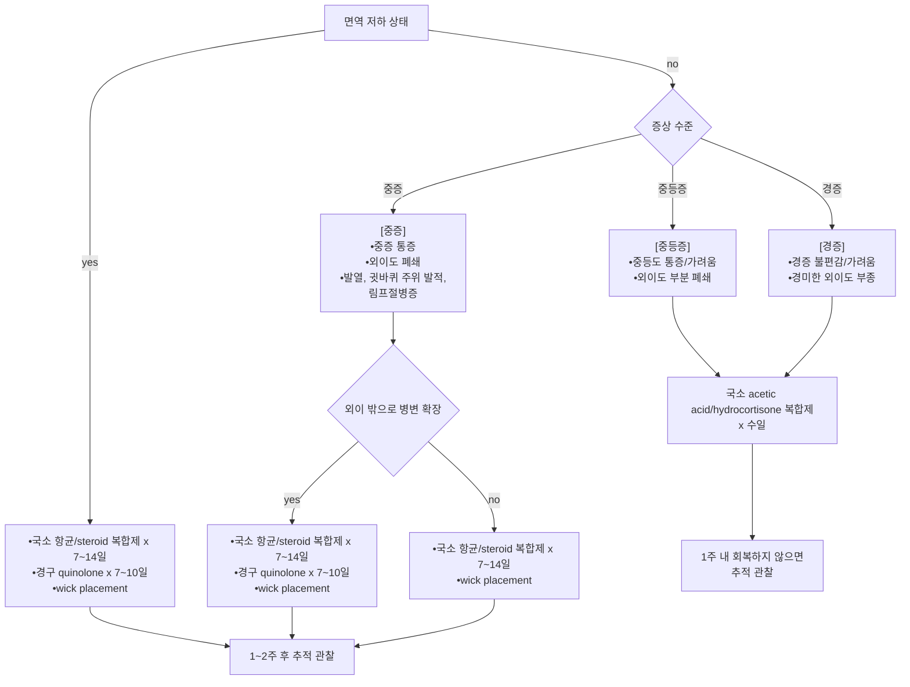

# 외이염 Otitis Externa, OE

## 일반 사항

* 외이도나 귓바퀴의 염증 또는 감염
* 다른 명칭 : swimmer’s ear
* 경과 : 발병 2\~3일째 가장 심한 증상 → 치료 시작 3일 내 호전되기 시작; 보통 7일 내 치유

### 분류

* Acute diffuse Otitis externa(OE) : OE의 대부분의 형태
* Acute localized OE (=Furunculosis) : 외이의 hair follicle의 감염
* Chronic OE : acute diffuse OE가 ＞6주 지속
* Eczematous OE : 아토피, 건선, SLE, 습진 등 여러 가지 피부 상태와 관련
* Necrotizing(or Malignant) OE : 심부 조직으로 염증이 확대된 상태(예: 골수염, 봉소염)
* Otomycosis : 진균 감염

## 원인

* 감염(98%에서 세균, 10%에서 진균 관련), 알레르기, 기타 피부 질환

### 원인균

* 세균 : P. aeruginosa (가장 흔함), S. aureus (특히 농양 관련), 그람(-) 막대균
* 곰팡이 : Aspergillus niger , Candida ; 항생제 남용과 관련
* 바이러스

### 위험 인자

* 높은 습도, 외이도의 물기(예: 수영, 목욕, 땀) : 피부 저항력의 감소, 균 증식의 좋은 조건
* 귀지 매복 : 귀 안의 습도를 높이며 물이 들어갔을 때 건조를 방해함
* 빈번한 귀지 제거 : 귀지를 제거하는 과정에서 외이가 손상될 가능성이 있음, 귀지가 없으면 외이도의 산성도가 떨어져 균에 대한 저항력이 떨어짐
* 좁거나 구부러진 외이도 : 수분 정체를 유발
* 외상 : 자극(예: 손가락, 면봉), 이물 삽입(예: 면봉, 손톱, 보청기, 이어폰)
* (만성) 피부염 : 습진, 건선, 지루피부염, 신경피부염, 접촉피부염
* Necrotizing OE : 고령, 영양 결핍, 당뇨병, HIV 감염, 면역 역제

## 임상 양상

* 외이 발적, 부종, 충만감, 답답함
* 통증 : 특히 pinna를 당길 때, tragus를 누를 때, 턱을 움직일 때
* 가려움 : 특히 진균 감염, 만성 외이염, 감염에 의한 통증 발생 전 또는 회복기
* 외이 분비물 : 맑은 점액성으로 시작하여 농성(악취)으로 변화; 습진을 유발할 수 있음
* 흰색 솜털 부스러기 : 진균 감염 의심
* 약간의 이명, 청력 감소 : 심하면 다른 질환 의심
* 환부 쪽 얼굴/목의 봉소염, 림프절염, ＞39℃, 심부 통증 : necrotizing/malignant OE 의심
* 치료에도 불구하고 ＞2주 지속
* necrotizing OE 의심 소견
* 당뇨/면역저하자에서 회복되지 않음
* 절개/배농이 필요함
* 고막 천공 상태

## 진단

* 보통 검사는 필요 없음
* 검사 대상 : 심한 증상(전신 증상 발생), 2주 내 회복되지 않음
* 검사 항목 : 분비물 그람/배양 검사, 영상 검사

### 외이 이루(otorrhea)의 감별 및 치료

<table><thead><tr><th width="82">원인</th><th>진단상 단서</th><th>치료</th></tr></thead><tbody><tr><td>세균성 외이염</td><td>화농성 분비물, 부종 또는 발적, 이통, 외이 폴립, 최근 외이에 물이 들어간 병력, 외이 손상력(면봉), 당뇨병</td><td>항생제 이용액+경구제, 귀 청결, 귀 건조 유지, ear wick 고려</td></tr><tr><td>진균성 외이염</td><td>습한, 흰색-황백색 분비물(다양한 색 가능), hyphae 관찰, 항생제 저항성, 당뇨병, 고령, 면역 저하</td><td>acetic acid 이용액, 외이 건조 유지</td></tr><tr><td>피부염</td><td>알레르기 또는 자극성 피부염 병력, 발적 및 소양증</td><td>원인 제거, 2차 감염 시 항생제, 국소 steroid, 심할 경우 전신 steroid</td></tr><tr><td>이물</td><td>이물 관찰, 이물질 삽입력, 면봉 사용력, 코나 귀에 이물을 넣은 적이 있는 소아 또는 정신지체자</td><td>이물 제거, 감염 또는 출혈의 증거가 있는 경우 항생제 이용액</td></tr><tr><td>외이도 손상</td><td>기구 사용력(면봉, 머리핀), 출혈성 이루 또는 손상 관찰</td><td>항생제 이용액, 청력 검사, 두부 외상력이 있으면 bone CT</td></tr><tr><td>악성 외이염</td><td>전격성 감염력(Pseudomonas), 심한 통증, 외이도 폴립, 당뇨병력, 고령</td><td>Pseudomonas 특이 항생제, 외이 청결, bone CT</td></tr><tr><td>종양</td><td>편측 종괴, 외이도 폴립</td><td>bone CT</td></tr><tr><td>정신적 요소</td><td>지속적인 귀의 이상 감각 호소(예: "벌레가 기어 다니는 느낌이다"), 정상 소견임에도 지속적인 증상 호소, 간혹 외이의 자극 또는 감염 상태</td><td>정신적 문제 해결, 국소 steroid, 2차 감염 시 항생제</td></tr></tbody></table>

_<mark style="color:$info;">Ref. Rakel Family medicine 9th ed. 2016. eTable 18-5.</mark>_

### 귀에서의 연관통

* 귀에 통증을 일으킬 수 있는 기관들 : 부비동, 치아/턱, 인두, 이하선, 목, 갑상선, 뇌신경(삼차신경통, 헤르페스 질환)

***

## Management

### 치료 방침

* 외이도 cleansing
* 대증 치료 : 통증에 대하여 진통제, 국소 온열 치료; 가려움에 대하여 경구 항히스타민제 고려
* 약물 치료 : 국소 acetic acid 또는 항생제 ± steroid; 보통 7일 내 호전
* 중증(cellulitis, 외이 밖으로 확장, 전신 감염 증상) : 경구 항생제 치료 및 악성 원인 배제
* 기저 질환 치료

## 외이도 cleansing

* 귀지 제거, 외이도 청소 : 국소 약제 투여 전 외이도를 청소하면 약제의 효과가 증진됨
* 흡인, 세척(과산화수소+온수); 흡인이나 세척보다 포셉/큐렛 등을 이용한 제거가 안전함
* debridement : 진균 감염 시 고려
* 만성 OE 시 2주마다 cleansing

## 약물 치료

#### 통증 관리, 가려움 관리

**소염진통제**

* ibuprofen : 400\~800 ㎎ tid \[부루펜]
* acetaminophen : 650\~1,300 ㎎ tid \[타이레놀]

**항히스타민제**

☞ [항히스타민제](../231_/212_-antihistamines.md)

**국소 Steroid**

* 대상 : 습진성 OE, 감염성 OE
* 효과 : 염증/통증 완화에 다소 도움; 회복과는 무관
* hydrocortisone, dexamethasone, triamcinolone 0.1% \[트리코트] (☞ p.1139)
* 보통 국소 항균제와 병용 : dexamethasone + ciprofloxacin \[실로덱스]

#### 2% acetic acid 국소제

* 작용 : 산성화; 세균 및 진균에 대한 약간의 치료와 예방 효과
* 부작용 : 외이도 자극 및 염증 유발; 고막 천공 시 금기
* 용법 : 3\~4 drops qid; 단독 또는 혼합 사용(예: 70% 알코올/2% acetic acid=2:1 mix)

#### 국소 항생제 (점이용제)

* 용법 : 보통 1일 1회 ×7\~10d 적용
* 투여 전 손으로 1\~2분 정도 쥐어 따듯하게 하여 사용
* 치료 시작 3일 내 호전되지 않으면 재평가
* 고막 천공 시 주의
* 이욕(耳浴)
  1. 환측을 위로 하여 눕는다. 외이도에 가득 차도록 용액을 떨어뜨린다(보통 10 방울)
  2. 용액(특히 점도 높은 용액)이 잘 들어가도록 귓바퀴를 잡아 움직여 본다.
  3. 3\~5분간 누운 자세를 유지한 후 일어난다. 흘러나오는 용액을 닦는다.

**Fluoroquinolone**

* Pseudomonas 에 대해서 다른 약제들보다 우수; 다른 균주에 대해서는 차이 없음
* 저자극, 이독성 없음; 고막 천공 시 사용 가능
* ofloxacin 0.3% : 10 drops qd ×7d \[타리비드]
* ciprofloxacin 0.3% : 10 drops qd ×7d [시프레닛](../%EB%B9%84%EB%B3%B4%ED%97%98/)

**Aminoglycoside**

* 이독성 있음; 10일 이상 지속 사용 금지, 고막 천공 시 사용 금지
  * ✽이용액 시판 제제는 없음, 안약제를 차용 (보험주의)
* gentamicin 0.3% \[오큐겐타], tobramycin 0.3% \[토브라], neomycin

**국소 항생제/Steroid 복합제**

* 항생제와 steroid 병합으로 통증 기간을 줄일 수 있음
* ciprofloxacin 0.3%/dexamethasone 0.1% 4 drops bid ×7d \[실로덱스]
* ciprofloxacin 0.3%/fluocinolone 0.025% 4 drops tid ×7d \[세트락살 플러스]
* ciprofloxacin 0.2%/hydrocortisone 1% 4 drops bid ×7d \[싸이록사신]
* neomycin/polymyxin-B/hydrocortisone 4 drops qid ×7d

#### 전신 항생제

* 대상 : 염증이 외이를 넘어 확장(발열, 주변 연조직염, 경부 림프절병증), 외용제를 사용할 수 없는 경우, 면역저하자
*   한계 : 외이염을 일으킨 균들은 신체 외부에 위치하므로 전신 항생제는 효과가 제한적이며 외이염의 지속 또는

    재발 빈도를 높일 수 있음
* ciprofloxacin : 250\~500 ㎎ bid ×7d \[씨프로바이]
* cephalexin : 500 ㎎ bid ×7d \[팔렉신]
* flucloxacillin : 250\~500 ㎎ qid ×7d

#### 항진균제

**국소**

* clotrimazole 1% : 4 drops qid ×7d
* amphotericin B, miconazole, natamycin \[나타신 점안액], nystatin
* ✽시판 점이 항진균제는 없으며 점안액을 차용할 수 있음 (보험주의)

**경구**

* itraconazole : 200 ㎎ qd ×1주 \[스포라녹스] (☞ [백선증](../229_/173_-onychomycosis-tinea-unguium.md#undefined-10))

***

<strong>외이염 치료 알고리듬</strong>
 <em><mark style="color:$info;">Ref. Goguen LA. External otitis: Treatment. UpToDate. 2017.</mark></em>

## 관리 및 예방

* 건조 상태 유지 : 치료 중 및 치료 후 1\~2주 동안 유지
*   물 접촉 회피 : 외이염 발생 중 수영이나 귀에 대한 물의 접촉을 피함; 세발 등 일상적인 물 접촉은 치료 2\~3일 후,

    수영 활동은 치료 4\~5일 후 재개
* 귀마개 : 수영/목욕/세발 시 귀마개 또는 (petroleum jelly를 묻힌) 솜으로 귀를 막음
*   수영/목욕 후 관리 : 헤어드라이어로 건조시키고 다음 제제를 3\~4 방울 점이;

    소독용 알코올(½ 희석), 식초(½ 희석), 2% acetic acid, 또는 알코올:식초:증류수=2:1:1 혼합액
* ear wick(심지) : 외이도가 심하게 부어 있을 때 약물 전달 작용 및 분비물 흡수 작용을 기대하여 적용. 단, 근거는 부족함
* tea tree oil 도포 : 유효 가능성이 있음; 용법 및 부작용에 대해서 연구 필요
* 온열 치료 : 효과 입증 안 됨
* 잦은 비누 세척은 피함 : 알칼리화로 균에 대한 저항력이 저하됨
* 자가 귀지 제거를 제한함
* 보청기/귀마개 관리 : 보청기는 세정 건조기로 관리, 귀마개는 사용 후 알코올로 닦음
* 필요시 2\~3주마다 진찰 및 외이도 청소

### **질병코드**&#x20;

H60 외이염

### 처방례

처방례 1. 통증 동반
\
싸이록사신 점이현탁액 5 ㎖/병 4 drops bid 타이레놀 이알 650 ㎎/T 3T #3\

\
처방례 2. 진균성
\
카네스텐 크림 10 g/tube bid (보험주의) 스로라녹스 200 ㎎/C qd ×1주
\
\
처방례 3. 습진성
\
트리코트 크림 10 g/tube bid
\
\
처방례 4. 염증 확장
\
타리비드 이용액 5 ㎖/병 10 drops qd 이욕 팔렉신 500 ㎎/C 2C #2
\
부루펜 200 ㎎/T 6T #3

