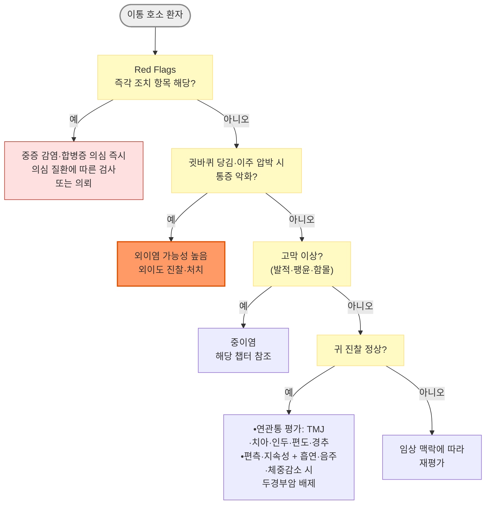
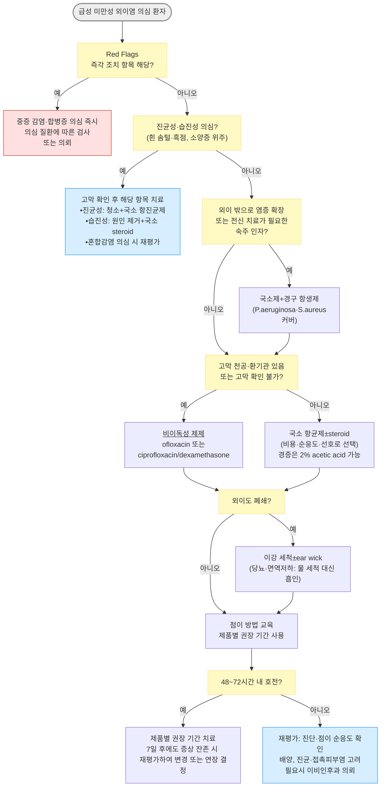

# 외이염 Otitis Externa

## <mark style="color:green;">일반 사항</mark>

* 외이도 또는 귓바퀴의 염증·감염; "swimmer's ear"라고도 불림
* 유병률 : 미국 기준 연간 약 123명 중 1명에서 발생; 평생 유병률 최대 10% \[AAO-HNSF 2014]
* 경과 : 적절한 국소 치료 시작 후 48\~72시간 내 호전이 시작되며, 대부분 7일 이내에 회복
  * 국소제는 제품별 권장 기간(통상 7일) 사용하고, 7일 이후에도 증상이 남으면 지속 감염·진균증·접촉피부염 여부를 재평가하여 연장(최대 7일 추가) 또는 변경 \[AAO-HNSF 2014]

### <mark style="color:orange;">분류</mark>

* **Acute diffuse OE** : OE의 대부분을 차지. 세균 감염이 원인의 대부분
* **Acute localized OE (Furunculosis)** : 외이도 모낭 감염. _S. aureu&#x73;_&#xAC00; 주원인
* **Chronic OE** : 6주 이상 지속 (일부는 3개월 기준을 사용). 피부질환·접촉 알레르기·습기·기계적 자극이 관여
* **Eczematous OE** : 아토피·건선·SLE·습진 등 피부 질환과 관련. 진균 중복 감염 주의
* **Necrotizing OE** : 심부 조직·측두골로 염증 확대(골수염·연조직염). 'Malignant OE'보다 'Necrotizing OE'가 선호 명칭임 \[BMJ Open 2023]. 즉시 의뢰 필요
* **Otomycosis** : 진균 감염. 항생제 남용 후, 당뇨·면역 저하 시 빈발

## <mark style="color:green;">원인</mark>

### <mark style="color:orange;">원인균</mark>

* **세균** : Acute diffuse OE의 대부분은 세균 감염; 주 원인 -  _P. aeruginosa_(가장 흔함), _S. aureus_(농양·Furunculosis), 그람(-) 막대균
* **진균** : 전체 OE의 약 10% 차지; _Aspergillus_(회백색 솜털 모양 + 흑색 점), _Candida_(흰색 크림상 분비물)
  * 열대기후·항생제 장기사용·당뇨·면역 저하 시 더 흔함
* **바이러스** : 외이도·귓바퀴의 수포는 herpes zoster oticus를 시사; 안면신경 마비가 동반되면 Ramsay Hunt 증후군

### <mark style="color:orange;">위험 인자</mark>

* 높은 습도, 외이도의 물기(수영, 목욕, 발한) : 피부 저항력 감소 + 세균 증식 조건 형성
* 잦은 귀지 제거·면봉 사용 : 보호막 손상 및 외이도 산성도 저하
* 귀지 매복 : 수분 배출 방해
* 좁거나 구부러진 외이도 : 수분 정체
* 만성 피부염 : 습진, 건선, 지루피부염, 접촉피부염
* 이물 삽입 : 면봉, 보청기, 이어폰
  * 커널형(인이어) 이어폰의 장시간 착용은 외이도 내 온도·습도 상승 및 밀착 설계에 의한 압력 증가로 세균 증식 환경 조성에 기여할 수 있음
  * 실리콘 팁은 접촉 알레르기(습진성 OE)를 유발할 수 있음
* 고막 환기관(tympanostomy tube), 두경부 방사선 치료력
* Necrotizing OE 특이 위험 인자 : 당뇨병(특히 혈당 조절 불량), 고령(65세 이상), HIV 감염, 악성 종양, 면역억제제 사용, 방사선 치료 후

## <mark style="color:green;">임상 양상</mark>

* 외이 발적·부종·충만감
* 이통 : 특히 귓바퀴(pinna)를 당기거나, 이주(tragus)를 누르거나, 턱을 움직일 때 악화 - OE의 특징적 소견
* 가려움 : 진균성 OE에서는 이통보다 소양증이 훨씬 심하거나 먼저 나타나는 경우가 많음; 만성 OE·습진성 OE에서도 두드러짐&#x20;
  * 소양증·흑점은 진균 감염의 단서이나 확진 기준은 아니며, 흑점이 없는 _Aspergillus_ 감염과 세균 혼합감염도 있음
* 외이 분비물 : 맑은 점액성 → 농성(악취)으로 변화
  * 분비물에 의해 외이 입구·귓바퀴 피부가 2차 습진화될 수 있음
* 진균 감염 시 : 회백색 솜털 모양 잔재물 또는 흰색 크림상 분비물(_Candida_)
  * _A. nige&#x72;_&#xB294; 균사 위에 분생자두(포자 덩어리)가 흑색 점으로 보여 "젖은 신문지" 모양을 띠나, _A. flavus_(황록색)·_A. fumigatus_(회녹색)는 흑점이 없음
* 경미한 이명·청력 감소 : 외이도 폐쇄에 의한 전음성 난청

### <mark style="color:$danger;">🚩 Red Flags!</mark>

<mark style="color:$danger;">**즉각 조치**</mark>

* 당뇨·면역 저하·고령 환자에서 소견에 비해 불균형적으로 심한 이통(특히 야간 악화) 또는 치료 무반응 `괴사성 외이염`
* 외이도 바닥의 육아조직(granulation tissue) 또는 뼈 노출 `괴사성 외이염`
* 안면신경 마비, 연하곤란, 쉰 목소리 `괴사성 외이염(두개저 골수염)`
* 심한 두통, 의식 변화, 경부 강직 `두개내 합병증`
* 귀 뒤 부종·압통, 귓바퀴의 전방 변위 `유양돌기염`
* 귓바퀴 파동성 부종 또는 빠르게 진행하는 연골부 괴사 `연골막 농양`

<mark style="color:$warning;">**당일\~수일 내 평가**</mark>

* 외이도 밖으로 퍼지는 발적·부종·압통 ± 발열·전신 증상 `외이 주위 연조직염`
* 귓불은 보존된 채 귓바퀴 연골부의 발적·부종·압통 `귓바퀴 연골막염`
* 외이·귓바퀴 수포 ± 새로 생긴 안면신경 마비 `Ramsay Hunt 증후군`
* 외이도가 완전히 폐쇄되어 점이 불가 `중증 외이염`
* 적절한 국소 치료 48\~72시간 후에도 호전 없음 `진균성 외이염` `접촉피부염` `오진`
* 귀 진찰 정상 + 편측 지속성 이통 + 흡연·음주·체중감소·연하통 `두경부암`

<mark style="color:$info;">**조기 평가 및 추적**</mark>

* 치료에도 2주 이상 지속되거나 6주 이상 만성화 `만성 외이염` `진균성 외이염`
* 항생제 치료 후 악화된 가려움, 흰 솜털·흑색 점 잔재물 `진균성 외이염`
* 기저 피부 질환과 연관된 반복 재발 `습진성 외이염` `접촉피부염`
* 편측 지속 이루, 외이도 폴립, 출혈성 이루 `외이도 암` `외이도 진주종`
* 귀 진찰 정상인 편측 이통이 2주 이상 지속 `연관통(TMJ·치성·경추)`

## <mark style="color:green;">진단</mark>

### <mark style="color:orange;">진단 기준</mark>

* 급성 외이염 : 최근 3주 이내에 급격히(대략 48시간 이내) 발생 + 외이도 염증 증상(이통, 가려움, 충만감, 난청, 턱 통증) + 외이도 염증 징후(이주·귓바퀴 압통 또는 외이도의 미만성 부종·발적) \[AAO-HNSF 2014]
* 관리 수정 인자 확인 : 고막 천공·고막 환기관, 당뇨병, 면역 저하, 두경부 방사선 치료력 \[AAO-HNSF 2014]
  * 부종·분비물로 고막이 보이지 않으면 천공이 있는 것으로 간주하고 비이독성 제제 선택
* 초기 미합병 OE에서 routine 배양은 불필요

### <mark style="color:orange;">외이 이루의 감별</mark>

<table data-search="false"><thead><tr><th width="109.55555725097656">원인</th><th>진단상 단서</th><th>치료</th></tr></thead><tbody><tr><td>세균성<br>외이염</td><td>화농성 분비물, 부종·발적, 이통, 최근 외이 물 접촉력·손상력(면봉), 당뇨병</td><td>국소 항균제 ± steroid, 이강 세척 및 건조 유지, ear wick 고려; 외이 밖 확장·고위험 숙주에서만 경구 항생제 추가</td></tr><tr><td>진균성<br>외이염</td><td>흰색-황백색 습한 분비물 (<em>Aspergillus</em>: 흑점 동반), hyphae 관찰, 항생제 저항성, 당뇨·고령·면역 저하</td><td>debridement + 국소 항진균제; 세균-진균 혼합감염이 아닌 전형적 진균성 OE에서는 불필요한 국소 항생제 지속 사용을 중단함; 혼합감염 의심 시 배양·경과에 따라 조정하되 <mark style="color:blue;">실로덱스</mark>는 진균성 귀 감염에 금기</td></tr><tr><td>중이염<br>(고막 천공)</td><td>급성 중이염 후 갑작스러운 이루와 통증 감소, 고막 천공; 만성 화농성 중이염은 반복·지속 이루, 이주 압통은 대개 없음</td><td>급성은 중이염 치료 원칙에 따라 경구 항생제 필요성 평가; 점이제를 사용하는 경우 비이독성 제제(ofloxacin 등) 선택. 만성은 이비인후과 의뢰</td></tr><tr><td>피부염</td><td>알레르기·자극성 피부염 병력, 발적·소양증 위주, 분비물 적음</td><td>원인 제거, 국소 steroid; 2차 감염 시 항생제 추가</td></tr><tr><td>이물</td><td>이물 관찰, 이물질 삽입력, 소아·지적장애인</td><td>이물 제거; 감염·출혈 증거 있으면 항생제 이용액</td></tr><tr><td>외이도<br>손상</td><td>기구(면봉·머리핀) 사용력, 출혈성 이루 또는 손상 관찰</td><td>항생제 이용액; 두부 외상력 있으면 측두골 CT</td></tr><tr><td>괴사성<br>외이염*</td><td>소견에 비해 심한 통증(야간 악화), 외이도 육아조직, 당뇨·고령·면역 저하, 국소 치료 무반응, ESR/CRP 상승; <em>P. aeruginosa</em>가 가장 흔하나 진균(<em>Aspergillus</em> 등)·MRSA도 원인</td><td>즉시 의뢰; 항생제 시작 전 배양(가능하면), 초기 영상은 측두골 CT(필요시 MRI)</td></tr><tr><td>Ramsay Hunt 증후군</td><td>외이·귓바퀴의 수포성 발진, 안면신경 마비, 이통</td><td>즉시 의뢰; 항바이러스제 + 스테로이드</td></tr><tr><td>종양·진주종</td><td>편측 종괴, 외이도 폴립, 출혈성 이루, 치료 무반응의 만성 이루</td><td>측두골 CT; 이비인후과 의뢰</td></tr></tbody></table>

> _<mark style="color:$info;">\*</mark>Necrotizing OE (구 용어: 악성 외이염/malignant OE)_

<p align="center"><em><mark style="color:$info;">Ref. Am Fam Physician 2023;107(2):145-151; Am Fam Physician 2026;114(3):238-247.</mark></em></p>

### <mark style="color:orange;">귀 통증(이통)의 감별</mark>

* 성인 이통은 귀 자체 이상 없이 발생하는 연관통(referred otalgia)이 더 흔함 \[AFP 2026]
* 감별 : 치아/턱관절(TMJ), 인두·편도, 부비동, 이하선, 갑상선, 경추, 삼차신경통, 대상포진(Ramsay Hunt 증후군)

<table data-search="false"><thead><tr><th width="126">질환</th><th>핵심 통증 특징</th><th>결정적 진찰 소견</th><th>동반 증상</th><th>진단 포인트</th></tr></thead><tbody><tr><td>외이염 (OE)</td><td>귓바퀴를 당기거나 이주(tragus)를 누르면 심한 통증</td><td>외이도 발적·부종·압통, 분비물</td><td>가려움, 이루, 귀 먹먹함</td><td>tragus tenderness</td></tr><tr><td>급성<br>중이염</td><td>깊은 귀 통증, 박동성 통증, 감기 후 발생 흔함</td><td>고막 발적·팽윤, mobility 감소</td><td>발열, 청력저하</td><td>pinna manipulation은 대개 무통</td></tr><tr><td>삼출성<br>중이염</td><td>통증보다 답답함·먹먹함이 주된 호소</td><td>고막 함몰, air-fluid level</td><td>청력저하, 자가음강조</td><td>pain보다 fullness dominant</td></tr><tr><td>괴사성<br>외이염</td><td>매우 심한 지속성 통증, 특히 야간 악화</td><td>외이도 육아조직, 심한 압통</td><td>당뇨, 면역 저하, 안면마비</td><td>pain out of proportion</td></tr><tr><td>Ramsay Hunt 증후군</td><td>심한 이통 + burning pain</td><td>외이·귓바퀴 수포</td><td>안면신경 마비, 어지럼</td><td>vesicle + facial palsy</td></tr><tr><td>TMJ disorder</td><td>씹을 때 아픔, 턱 움직임 시 악화</td><td>TMJ 압통, clicking</td><td>이갈이, 턱 뻣뻣함</td><td>귀 진찰 정상</td></tr><tr><td>치성 통증</td><td>씹을 때 찌르는 통증, 편측</td><td>충치, 치주염, percussion pain</td><td>치통, 잇몸 부종</td><td>귀 진찰 정상</td></tr><tr><td>편도염 /<br>인두염</td><td>삼킬 때 귀까지 퍼지는 통증</td><td>인두 발적, 편도 비대</td><td>인후통, 발열</td><td>referred otalgia (설인신경)</td></tr><tr><td>경추성 통증</td><td>목 움직임에 따라 변함</td><td>cervical tenderness</td><td>목·어깨 통증</td><td>귀 진찰 정상</td></tr><tr><td>두경부암</td><td>지속적·편측·점진적 악화</td><td>초기 귀 진찰 정상 가능</td><td>체중감소, 흡연·음주, HPV 관련 위험, 연하통</td><td>정상 귀 + 지속 통증 = red flag (연령과 무관하게 의심 유지, 특히 ≥50세)</td></tr></tbody></table>

***



<p align="center"><strong>이통 감별 알고리듬</strong></p>

<p align="center"><em><mark style="color:$info;">저자 재구성 (참고 문헌 : Am Fam Physician 2026;114(3):238-247</mark></em><br><em><mark style="color:$info;">; Am Fam Physician 2023;107(2):145-151)</mark></em></p>

***



<p align="center"><strong>급성 미만성 외이염 치료 알고리듬</strong></p>

<p align="center"><em><mark style="color:$info;">저자 재구성 (참고 문헌 : AAO-HNSF CPG Acute Otitis Externa Update, Otolaryngol Head Neck Surg 2014;150(1 Suppl):S1-S24; Am Fam Physician 2023;107(2):145-151)</mark></em></p>

***

## <mark style="background-color:$warning;">Management</mark>

### <mark style="color:orange;">치료 방침</mark>

1. 외이도 이강 세척(Aural Toilet / Cleansing) : 국소 약제 투여 전 외이도를 청소하면 효과 증진
2. 통증 조절 : 통증 정도를 평가하고 그에 맞는 충분한 용량의 경구 진통제 사용
   * 가려움에는 경구 항히스타민제, 국소 온열 치료
3. 국소 약물 치료 : 단순 OE의 1차 치료(제품별 권장 기간, 통상 7일 치료)
   * 국소 항균제 ± steroid 또는 acetic acid&#x20;
4. 전신 항생제 : 외이 밖으로 염증 확장 또는 전신 치료가 필요한 숙주 인자가 있을 때 적용
   * 단순 OE에 초기 경구 항생제 투여는 권고되지 않음
5. 기저 질환 치료 : 피부 질환, 당뇨 혈당 조절 등

#### <mark style="color:$primary;">외이도 이강 세척 (Aural Toilet / Cleansing)</mark>

* 귀지 제거 및 외이도 청소 : 약제 투여 전 선행하면 효과 증진
* 직접 시야 하에서 suction, dry mopping, 포셉/큐렛을 이용한 변연절제(debridement)를 우선 권장
  * 고막 천공 여부 불확실 시 irrigation은 피함
  * 과산화수소·온수 세척은 고막 확인 후 보조적으로만 고려
  * 당뇨·면역 저하 환자에서는 외이도 세척(irrigation)을 피하고 직시하 흡인으로 청소 (NOE 유발 위험)
* 변연절제(debridement) : 진균 감염 시 필수적으로 선행 (국소 항진균제만으로는 효과 불충분)
* Ear wick(심지) : 외이도가 심하게 부어 국소 약제 전달이 어려울 때 삽입
  * 압축 스펀지 심지(Merocel/Pope wick, hydroxylated polyvinyl acetate) 또는 거즈 심지 사용
  * Wick가 건조해지면 점이용액이 외이도에 전달되지 않으므로, 규칙적으로 처방한 방울 수를 점이하도록 반드시 교육
  * 2\~3일 후 자연 배출 또는 의사가 제거
* 만성·재발성 OE에서 분비물·각질(debris)이 반복 축적되거나 국소 약제가 도달하기 어려운 경우에는 임상 경과에 따라 반복적으로 이강 세척을 시행

## <mark style="color:green;">비-약물 치료 및 예방</mark>

* 물 접촉 최소화 : 치료 중에는 외이도에 물이 들어가지 않도록 하고, 세발·샤워 시 귀마개 또는 petroleum jelly를 묻힌 솜 사용
* 수영 재개 : 치료 중 통상 7\~10일간 수영·수상 활동을 피하고, 통증·부종 소실 후 귀마개를 착용하고 재개
* 수영·목욕 후 관리 : 헤어드라이어로 건조(가장 약한 바람, 20\~30 ㎝ 거리)
* 수영 관련 외이염이 반복되면 예방 점이(소독용 알코올·백식초 혼합액 등)를 선택적으로 고려; 일반적으로가정용 혼합액은 임상시험으로 평가되지 않았음
  * 고막 천공·환기관·활동성 외이염·이루가 있으면 사용하지 않음
* 귀지 자가 제거 제한 : 면봉 삽입 금지; 귀지는 자연 배출되도록 두는 것이 원칙
* 보청기·귀마개 관리 : 보청기는 건조제(건조함)로 관리, 귀마개는 사용 후 알코올로 닦음
  * 이어몰드가 외이도에 맞지 않으면 습기가 갇혀 외이염 위험이 높아지므로 피팅 상태를 주기적으로 점검
* 잦은 비누 세척 피함 : 알칼리화로 균 저항력 저하

## <mark style="color:green;">약물 치료</mark>

### <mark style="color:orange;">통증·가려움 관리</mark>

#### <mark style="color:$primary;">소염진통제</mark>

* ibuprofen : 400\~800 ㎎ tid <mark style="color:blue;">\[부루펜]</mark>
* acetaminophen : 650\~1,000 ㎎ q6h prn, 1일 최대 4,000 ㎎ 초과 금지 <mark style="color:blue;">\[타이레놀]</mark>; 서방형 650 ㎎은 1회 2정 8시간마다 <mark style="color:blue;">\[타이레놀 이알]</mark>
  * 간질환, 고령, 저체중, 만성 음주력이 있는 경우 1일 상한을 이보다 낮게(예: 2,000\~3,000 ㎎) 조정
* 통증이 심한 경우 초기 2\~3일 규칙적으로 복용

#### <mark style="color:$primary;">항히스타민제</mark>

* 소양증 주 증상 시 (☞ [항히스타민제](../231_/212_-antihistamines.md))

### <mark style="color:orange;">2% Acetic Acid 국소제</mark>

* 작용 : 외이도 산성화 → 세균·진균에 대한 억균 효과
* 적응 : 경증 OE의 단기(≤7일) 치료, 진균 OE 보조, 예방
  * 치료가 1주를 넘어가면 항균제·steroid 복합제보다 효과가 떨어짐
* 금기 : 고막 천공 시 (자극·염증 유발)
* 용법 : 3\~4 drops qid × 5\~7d; 농도·조성이 확인된 제제로 사용
  * 국내 시판 점이제 없음 - 농도가 확인된 원내 조제 제제로 사용

### <mark style="color:orange;">국소 스테로이드</mark>

* 습진성 OE : 국소 스테로이드 단독 사용이 치료의 중심; 2차 감염이 동반되면 국소 항균제 병용
  * triamcinolone 0.1% <mark style="color:blue;">\[트리코트]</mark>
* 감염성 OE : steroid 단독 사용은 권하지 않으며, 부종·가려움이 두드러지면 항균제/steroid 복합제를 선택 (☞ 국소 항균제/Steroid 복합제)

### <mark style="color:orange;">국소 항균제 (점이용제)</mark>&#x20;

* 고막 천공 가능성이 있는 경우 fluoroquinolone 우선

**투여 방법 (이욕, 耳浴)**

1. 약병을 손으로 1\~2분 쥐어 체온 수준으로 따뜻하게 함(냉각된 용액은 현기증 유발 가능)
2. 환측을 위로 하여 누움
3. 외이도에 가득 차도록 용액을 점이
4. 이주(tragus)를 몇 차례 부드럽게 눌러(tragal pumping) 용액이 외이도 깊이 들어가도록 유도
5. 제품별로 정해진 시간 동안(에펙신은 약 10분, <mark style="color:blue;">실로덱스</mark>는 60초) 누운 자세를 유지한 후 일어나 흘러나오는 용액을 닦음

* 스스로 점이하는 환자는 첫 3일 동안 약 40%만 올바르게 점이하므로, 가능하면 보호자가 넣어 주도록 교육 \[AAO-HNSF 2014]
* 치료 시작 48\~72시간 내 호전 없으면 재평가 필요 (진단 재확인, 점이 순응도 확인) \[AAO-HNSF 2014]
* 단순 급성 OE의 1차 치료는 국소 항균제이며, 약제 계열 간·quinolone과 비quinolone 간·steroid 병용 여부에 따른 임상적 우열은 뚜렷하지 않음 - 선택은 고막 상태, 이독성 여부, 비용, 순응도, 접촉피부염 위험 등을 고려하여 결정

#### <mark style="color:$primary;">Fluoroquinolone계</mark>

* 이독성이 없어 고막 천공·환기관이 있을 때 쓰는 계열. 단, 중이 사용 허가는 제품별로 다름(ofloxacin·ciprofloxacin/dexamethasone은 가능)
* ofloxacin 0.3% : 성인 1회 6\~10 drops bid, 점이 후 약 10분간 이욕 <mark style="color:blue;">\[에펙신]</mark>&#x20;
* ciprofloxacin 단일 점이제는 국내에 없음 - 0.3% 점안액 차용(허가 외) <mark style="color:blue;">\[씨펙스]</mark>

#### <mark style="color:$primary;">Aminoglycoside계</mark>

* 이독성 있음; 고막 천공 시 절대 금기
  * 시판 점이용 제제 없음 - 점안액 차용 (보험 주의)
* tobramycin 0.3% <mark style="color:blue;">\[토브라]</mark>, gentamicin, neomycin

#### <mark style="color:$primary;">국소 항균제/Steroid 복합제</mark>

* steroid 병용이 단독 항균제보다 우월하다는 일관된 근거는 없음; 부종·가려움이 두드러질 때 선택할 수 있음
* ciprofloxacin 0.3% + dexamethasone 0.1% : 성인·12세 이상 4 drops bid × 7d, 2\~12세 미만 3 drops bid × 7d <mark style="color:blue;">\[실로덱스]</mark>; 사용 직전 흔들고 점이 후 60초 자세 유지, 치료 후 남은 약은 폐기
  * 환기관을 삽입한 소아(6개월 이상)의 급성 중이염에도 허가(4 drops bid × 7d)되어, 고막 천공이 확인되거나 의심되는 경우에도 사용 가능
  * 진균성·바이러스성 귀 감염에는 금기; 진균 혼합감염이 의심되는 경우에도 사용하지 않음
* ciprofloxacin 0.3% + fluocinolone 0.025% : 4\~6 drops q8h × 7\~8d, 7세 이상 <mark style="color:blue;">\[세트락살플러스]</mark>
  * 효능은 급성 외이염이며, 고막 천공 환자와 중이염에서는 안전성·유효성 미확립
* neomycin/polymyxin-B + hydrocortisone 4 drops qid × 7d; 10일 이상 연속 사용하지 않음
  * 고막 천공 시 금기
  * neomycin 함유 제제는 반복 사용 시 접촉피부염을 유발할 수 있음 - 증상 개선 없이 소양증이 악화되면 neomycin 알레르기를 의심하고 fluoroquinolone 제제로 교체


**고막 천공 시 이독성 있는 제제 사용 금지**

* **사용 금지** : Aminoglycoside계(gentamicin, tobramycin) · neomycin · polymyxin-B 함유 제제 - 이독성 위험
* **사용 가능** : ofloxacin(예: 에펙신) 및 ciprofloxacin/dexamethasone 복합제(예: <mark style="color:blue;">실로덱스</mark>) - 허가사항상 중이염·tympanostomy tube 존재 시에도 사용 가능한 비이독성 제제
* ciprofloxacin/fluocinolone 복합제(세트락살플러스)는 고막 천공 시 안전성이 확립되지 않았으므로 신중 투여
* 고막 상태를 확인할 수 없거나 천공이 의심되는 모든 상황에서도 위 원칙을 동일하게 적용
* <mark style="color:blue;">실로덱스</mark>는 진균성·바이러스성 귀 감염에 금기이며, 진균 혼합감염이 의심되는 경우에도 사용하지 않음


### <mark style="color:orange;">전신 항생제</mark>

* 단순 미합병 OE에 전신 항생제는 원칙적으로 사용하지 않음 - 효과가 국소 치료보다 열등하고 내성 증가 및 재발·지속을 초래할 수 있음

**적응증**

* 염증이 외이 밖으로 확장 : 외이도 밖으로 퍼지는 발적·부종·압통 ± 발열·전신 증상
* 국소 약물 투여 불가 : 심한 부종·협착이 있어도 먼저 청소·wick으로 약물 전달을 확보할 수 있는지 평가
* 당뇨·면역 저하 : 전신 치료 필요성과 NOE 위험을 높이는 인자로, 혈당 조절·면역 저하 정도·감염 범위를 함께 평가

**균 배양 검사 적응증**

* 초기 미합병 OE에서 routine 배양은 불필요
* 아래 중 하나 이상 해당 시 시행
  * 재발·지속, 치료 실패, 고위험 숙주에서 고려
  * 48\~72시간 치료 무반응
  * 면역 저하자 (당뇨, HIV, 항암치료 중)
  * Necrotizing OE 의심
  * 항생제 치료 실패 후 진균 OE 의심

#### <mark style="color:$primary;">단계별 선택</mark>

* 전신 항생제가 필요하면 _P. aeruginos&#x61;_&#xC640; _S. aureu&#x73;_&#xC5D0; 모두 활성인 약제를 선택 \[AAO-HNSF 2014]

**1단계**

* ciprofloxacin : 500 ㎎ bid × 7d <mark style="color:blue;">\[씨프로바이]</mark>&#x20;
  * _P. aeruginosa_ 커버; OE 관련 연조직염에서 우선 고려되나, _S. aureu&#x73;_&#xC5D0; 대한 활성은 상대적으로 약함
  * 실제 선택은 감염 범위·배양 결과(가능한 경우)·지역 내 감수성·환자 위험요인을 종합하여 결정
  * fluoroquinolone 주의 : 혈당 이상(당뇨 환자의 저·고혈당), 건병증·건파열, 대동맥류
* cephalexin : 500 ㎎ qid(또는 bid) × 7d <mark style="color:blue;">\[팔렉신]</mark>&#x20;
  * _S. aureus_ 중심의 경증 furunculosis·단순 연조직염에서 선택지
  * 그람(-) 커버가 불충분하므로 OE 관련 연조직염에 단독 사용은 주의
* Furunculosis : 파동성 농양이 있으면 절개 배농이 우선이며, 국소 점이제는 효과가 제한적

**2단계**

* 원인·배양·약물 전달·합병증을 재평가한 후 고용량 경구 또는 IV 전환을 결정
* 아래 중 하나라도 해당 시 즉시 의뢰 + 입원 고려
  * 경구 ciprofloxacin 48\~72시간 무반응
  * 당뇨 환자에서 혈당 조절이 현저히 불량한 경우 + 골수염 의심
  * Necrotizing OE 확인 또는 의심 : 즉시 이비인후과·감염내과 의뢰
    * 가능하면 항생제 시작 전 배양(필요시 생검으로 악성 종양 배제), 항녹농균 정주 항생제(ceftazidime, cefepime, piperacillin/tazobactam 등) 후 감수성에 따라 경구 ciprofloxacin으로 전환, 진균성이면 항진균제; 치료 기간은 통상 6주 이상
    * 초기 영상은 측두골 CT로 골 침범을 평가하나, CT가 음성이어도 임상적 의심이 높거나 뇌신경·두개저·두개내 침범이 의심되면 MRI를 추가 \[ACR 2025]
    * 배양 음성이나 정상 ESR/CRP만으로 배제하지 않음; 육아조직·종괴는 필요시 생검으로 악성 종양 배제 \[J Laryngol Otol 2024]
    * 확진 후 다학제 진료 권장; 항생제 종료 후 3개월 이상 통증·이루가 없으면 완치로 정의(영국 합의 기준이며, 이후에도 재발 가능) \[BMJ Open 2023]

### <mark style="color:orange;">항진균제</mark>

* 전형적인 진균 OE에서는 불필요한 국소 항균제의 지속 사용을 중단하고 debridement + 국소 항진균 치료
  * 단, 세균-진균 혼합감염이 임상적으로 의심되면 배양 결과와 경과에 따라 항균제 병용을 조정함
* <mark style="color:blue;">실로덱스</mark>는 진균성 귀 감염에 금기이므로 사용하지 않음
* 국소 azole 간 우열을 판단할 근거는 불충분함

#### <mark style="color:$primary;">국소</mark>

* 1차 : debridement 후 clotrimazole 1% 크림을 외이도에 얇게 도포 <mark style="color:blue;">\[카네스텐]</mark>; 고막 정상 확인 후 사용, 1\~2주 후 재진하여 잔재물 재청소
  * 고막 천공·확인 불가 환자에게 크림 자가 도포를 일반화하지 않음
* clotrimazole 1% 점이액 (CLOTIC, 국내 미허가) : 2025년 9월 26일 FDA 승인; 18세 이상의 _Aspergillus_·_Candida_ 진균성 외이염에 1회용 바이알 1개씩 bid × 14d; 위약 대비 효과 입증, 고막이 정상인 환자에서만 연구되어 고막 천공 시 권고되지 않음 \[FDA 2025; J Otolaryngol Head Neck Surg 2025]
* 기타 : miconazole, nystatin, amphotericin B
* 국내에는 시판 점이용 항진균제 없음

#### <mark style="color:$primary;">국소 치료 실패·침습성 감염 의심</mark>

* 충분한 청소·국소 치료에도 지속되면 잔재물·약물 전달·접촉피부염·고막 천공 여부를 재평가하고, 이비인후과 의뢰 및 배양을 고려
* 침습성 감염(외이도 밖 확장, 육아조직, 뇌신경 증상 등)이 의심되면 즉시 의뢰; 전신 항진균제는 균종·감수성·침범 범위에 따라 전문 진료에서 결정

***

## <mark style="color:red;">질병코드</mark>

* H60.0 외이의 농양 Abscess of external ear
* H60.1 외이의 연조직염 Cellulitis of external ear
* H60.2 악성(괴사성) 외이염 Malignant otitis externa
* H60.31 확산성 외이염 Diffuse otitis externa
* H60.32 출혈성 외이염 Hemorrhagic otitis externa
* H60.33 수영인 외이염 Swimmer's ear
* H60.4 외이의 진주종 Cholesteatoma of external ear
* H60.5 급성 비감염성 외이염 Acute otitis externa, noninfective
* H60.8 기타 외이염 Other otitis externa
* H60.9 상세불명의 외이염 Otitis externa, unspecified
* B36.9† H62.2\* 진균증에서의 외이염 Otitis externa in mycoses
  * H62.2\*는 발현 코드이므로 원인 진균증 코드(†)를 함께 기재; B36.9†는 원인이 상세불명인 경우의 예이며, 원인 진균증이 확인되면 해당 코드 적용
* B02.2 기타 신경계통 침범을 동반한 대상포진 Zoster with other nervous system involvement

***

## <mark style="color:purple;">처방례</mark>

> **처방례 1. 세균성 OE - 중등증, 고막 정상 확인**
>
> ```
> 세트락살플러스 점이액 10 ㎖/병    4~6 drops  q8h  × 7d
> 타이레놀 이알 650 ㎎/T            6T         #3   × 3~5d
> ```
>
> _✽고막 천공이 없음을 확인한 후 투여(천공 시 안전성 미확립). 투여 전 약병을 손으로 1\~2분 따뜻하게 할 것. 통증이 줄면 진통제는 필요시로 감량. 48\~72시간 내 호전 없으면 재내원_

> **처방례 2. 세균성 OE - 고막 확인 불가 또는 천공·환기관 의심**
>
> ```
> 실로덱스 점이현탁액 7.5 ㎖/병     4 drops    bid  × 7d
> 부루펜 200 ㎎/T                   6T         #3   × 3~5d
> ```
>
> _✽ciprofloxacin/dexamethasone 복합제 - P. aeruginosa 및 S. aureus 모두 커버. 고막 천공이 확인되거나 의심되는 경우에도 사용 가능한 비이독성 제제이다(tympanostomy tube를 통한 중이염 치료 허가 제제). 사용 전 잘 흔들고 점이 후 60초 자세 유지, 치료 후 남은 약은 폐기. 진균 감염(혼합감염 포함)이 의심되면 사용하지 않음(진균성 귀 감염은 허가상 금기)_

> **처방례 3. 진균성 OE**
>
> ```
> 카네스텐 크림 10 g/tube          소량       의사 도포 / 추가 도포는 지시에 따름
> ```
>
> _✽고막이 정상임을 확인하고, 의사가 변연절제(debridement) 후 클로트리마졸 크림을 외이도에 얇게 도포함. 추가 도포는 의사의 지시에 따르며, 고막 천공·확인 불가 환자에게 크림 자가 도포를 일반화하지 않음. 불필요한 국소 항생제 지속 사용은 중단하고, 1\~2주 후 재진하여 잔재물 재청소. 충분한 청소·국소 치료에도 지속되면 이비인후과 의뢰 및 배양을 고려함._
>
> _국내 시판 점이용 항진균제가 없어 크림을 외이도에 도포하며, 점안액 등 다른 제형을 차용하는 경우는 허가 외 사용이므로 비용 고지와 진료기록에 사용 근거를 남긴다._

> **처방례 4. 습진성 OE**
>
> ```
> 트리코트 크림 10 g/tube          소량       bid
> ```
>
> _✽2차 감염 동반 시 국소 항균제 병용. 원인 피부 질환(아토피·건선 등) 동시 관리_

> **처방례 5. 외이 밖으로 염증 확장 (전신 항생제 필요)**
>
> ```
> 에펙신 이용액 5 ㎖/병          6~10 drops bid  이욕  × 7~10d
> 씨프로바이 500 ㎎/T              2T         #2   × 7d
> 부루펜 200 ㎎/T                  6T         #3   × 3~5d
> ```
>
> _✽외이도 밖으로 퍼지는 발적·부종·압통 ± 발열·전신 증상이 있는 경우 해당. ciprofloxacin 전신 투여로 P. aeruginosa 커버(감염 범위·환자 위험요인에 따라 선택 조정). 포도알균 연조직염이 우세하면 cephalexin 추가를 고려. 48\~72시간 내 호전 없으면 이비인후과 의뢰; NOE·심부 확장이 의심될 때 CT/MRI (단순 미합병 외이염에는 영상검사 불필요)_

***

### <mark style="color:$success;">핵심 복약 지도</mark>

> **점이용액 올바른 사용법**
>
> * **약을 먼저 따뜻하게 하십시오.** 차가운 약액이 귀에 들어가면 일시적인 어지럼증이 생길 수 있으므로, **약병을 손으로 1\~2분 쥐어** 체온 정도로 데운 뒤 사용합니다.
> * 아픈 귀를 위로 향하게 눕거나 머리를 기울이고 처방된 방울 수를 점이하십시오.
> * 귀 앞 돌출부(이주)를 몇 차례 부드럽게 눌러 약이 귀 안 깊이 들어가게 합니다.
> * **제품별로 정해진 시간 동안 그 자세를 유지**한 후 일어나 흘러나오는 약액을 닦습니다(에펙신은 약 10분, 실로덱스는 60초).
> * 혼자 넣기 어려우면 **가족이 넣어 주는 것이 더 정확합니다.**
> * 처방된 횟수대로 매일 같은 시간에 규칙적으로 사용하십시오.
> * **치료 시작 후 48\~72시간 이내에 통증이 나아지기 시작해야 합니다.** 충분히 나아지지 않거나 오히려 악화되면 반드시 재내원하십시오.

> **항생제 이용액 사용 주의**
>
> * **고막에 구멍(천공)이 있거나 환기관을 넣은 경우** 반드시 의사에게 알리십시오. 일부 점이용 항생제(겐타마이신, 토브라마이신, 네오마이신 등)는 청력 손상 가능성이 있어 사용 금지입니다. 오플록사신 단일제와 시프로플록사신/덱사메타손 복합제는 고막 천공이 있어도 사용할 수 있습니다. 다른 복합제는 의사가 고막 상태를 확인한 뒤 사용합니다.
> * 증상이 좋아져도 제품별로 처방된 기간 동안 사용하십시오. 7일 후에도 증상이 남으면 재진하여 치료 변경 또는 연장 여부를 결정하십시오.

> **귀를 건조하게 유지하는 방법**
>
> * 치료 중에는 귀에 물이 들어가지 않도록 하십시오.
> * 세발 시 귀마개를 사용하거나 petroleum jelly(바셀린)를 묻힌 솜으로 귀를 막으십시오.
> * 치료 중 통상 7\~10일간 수영·수상 활동을 피하고, 통증·부종이 사라진 후 귀마개를 착용하고 재개합니다.
> * 수영·샤워 후에는 헤어드라이어를 가장 약한 바람으로, 귀에서 20\~30 ㎝ 거리를 두고 30초간 건조하십시오.
> * **면봉은 절대 사용하지 마십시오.** 귀지를 제거하는 것이 아니라 외이도를 더 손상시키고 귀지를 안쪽으로 밀어 넣습니다.

> **언제 다시 병원을 방문해야 하나요?**
>
> * 치료 시작 **48\~72시간이 지나도 통증이 충분히 나아지지 않거나 악화되는** 경우
> * 통증이 귀에서 **얼굴·턱·목으로 퍼지거나 발열이 동반**되는 경우
> * **귀 주변 피부가 붉게 부어오르거나 귀 앞뒤 림프절이 만져지는** 경우
> * 당뇨·면역 저하 환자에서 외이염이 치료 후에도 **회복되지 않는** 경우
> * 안면 마비, 삼킴 곤란, 쉰 목소리 등 **새로운 신경 증상이 생기는** 경우 **(즉시 응급실)**

***

## <mark style="color:blue;">환자 안내서</mark>


**외이염(귀의 감염)이란 무엇인가요?**

외이도(귀의 입구에서 고막 사이의 관)가 세균이나 진균에 감염되어 붓고 아픈 상태입니다. 흔히 "swimmer's ear"라고도 불리며, 귀에 물이 자주 들어가거나 면봉으로 자주 후비는 경우에 잘 생깁니다. 고막 바깥의 감염이므로, 적절한 치료를 받으면 대부분 7\~10일 내에 낫습니다.


#### <mark style="color:$primary;">어떤 증상이 생기나요?</mark>

* 귀 통증 - 특히 귓바퀴를 당기거나 귀 입구 돌출부(이주)를 누를 때 심해집니다.
* 귀가 막히거나 가득 찬 느낌, 가려움
* 귀에서 액체(초기엔 맑고, 심해지면 고름 냄새)가 나올 수 있습니다.
* 심해지면 외이도가 부어 청력이 일시적으로 떨어질 수 있습니다.

#### <mark style="color:$primary;">치료는 어떻게 하나요?</mark>

* 점이용액(귀에 떨어뜨리는 약)이 치료의 핵심입니다. 처방된 방법대로 정확히 사용하면 2\~3일 이내에 통증이 줄기 시작합니다.
* **💡 어지럼증 예방 팁** : 차가운 약병을 귀에 바로 사용하면 어지럼증이 생길 수 있습니다. 사용 전에 **약병을 손으로 1\~2분 쥐어** 체온에 가깝게 데우십시오.
* 혼자 넣기 어려우면 가족에게 넣어 달라고 하는 것이 좋습니다.
* 통증이 심한 초기에는 아세트아미노펜(타이레놀 등)이나 이부프로펜을 함께 복용하면 도움이 됩니다(제품 설명서의 1일 최대 용량을 넘기지 마십시오).
* 입을 열거나 씹을 때 아픈 것도 외이염의 증상이며, 치료와 함께 자연히 좋아집니다.

#### <mark style="color:$primary;">치료 중 꼭 지켜야 할 것</mark>

* **귀에 물이 들어가지 않도록** 하십시오. 샤워·세발 시 귀마개나 솜(바셀린 묻힘)으로 귀를 막으세요.
* **면봉은 절대 사용하지 마십시오.** 외이도를 손상시키고 회복을 방해합니다.
* 통증·부종이 있는 동안에는 **보청기·이어폰 사용을 가능한 줄이고**, 사용해야 한다면 외이도를 자극하지 않도록 주의하십시오.
* 처방된 기간 동안 약을 끝까지 사용하십시오. 증상이 나아졌다고 일찍 중단하면 재발할 수 있습니다.

#### <mark style="color:$primary;">재발 예방을 위한 생활 습관</mark>

* 수영 후에는 헤어드라이어(약한 바람, 귀에서 20\~30 ㎝ 거리)로 귀를 건조하십시오.
* 수영 후 외이염이 자주 생기면 의사와 상의하여 예방 점이제를 고려하십시오. 고막에 구멍이 있거나 환기관을 넣었거나, 귀가 아프거나 고름이 나올 때는 사용하지 마십시오.
* 귀지는 스스로 밀어내는 자정 능력이 있습니다. 면봉으로 후비지 말고 자연 배출되도록 두십시오.
* 보청기는 건조 케이스(건조기)에 보관하고, 이어폰·귀마개는 알코올로 닦아 청결히 유지하십시오.
* 커널형(인이어) 이어폰의 장시간 연속 착용은 외이도 내 습도와 온도를 높여 외이염이 잘 생기는 환경을 만들 수 있습니다. 이어팁(실리콘 팁)은 정기적으로 교체하고, 외이염 치료 중에는 착용을 중단하십시오.
* 당뇨가 있으신 경우 혈당 조절이 외이염 예방에도 중요합니다. 이유 없이 귀가 오래 아프다면 반드시 진료를 받으십시오.

#### <mark style="color:$primary;">이럴 때는 즉시 병원을 방문하세요</mark>

* 치료 시작 후 2\~3일이 지나도 통증이 충분히 줄지 않거나 오히려 심해질 때
* 귀 주변 피부가 붉게 부어오르거나 열이 날 때
* 얼굴 한쪽이 처지거나 마비되는 느낌이 들 때 **(즉시 응급실)**
* 당뇨 또는 면역 저하 상태에서 외이염이 낫지 않을 때
