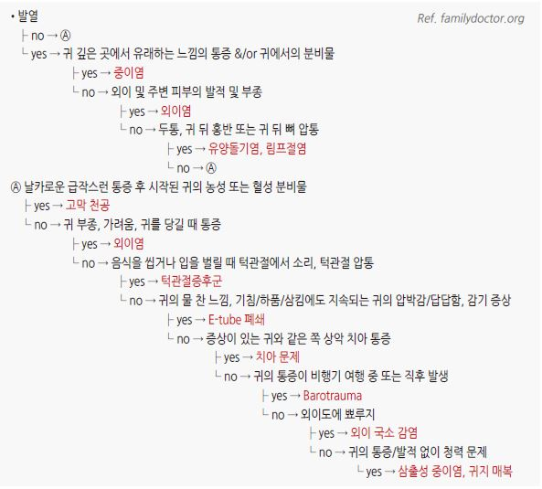
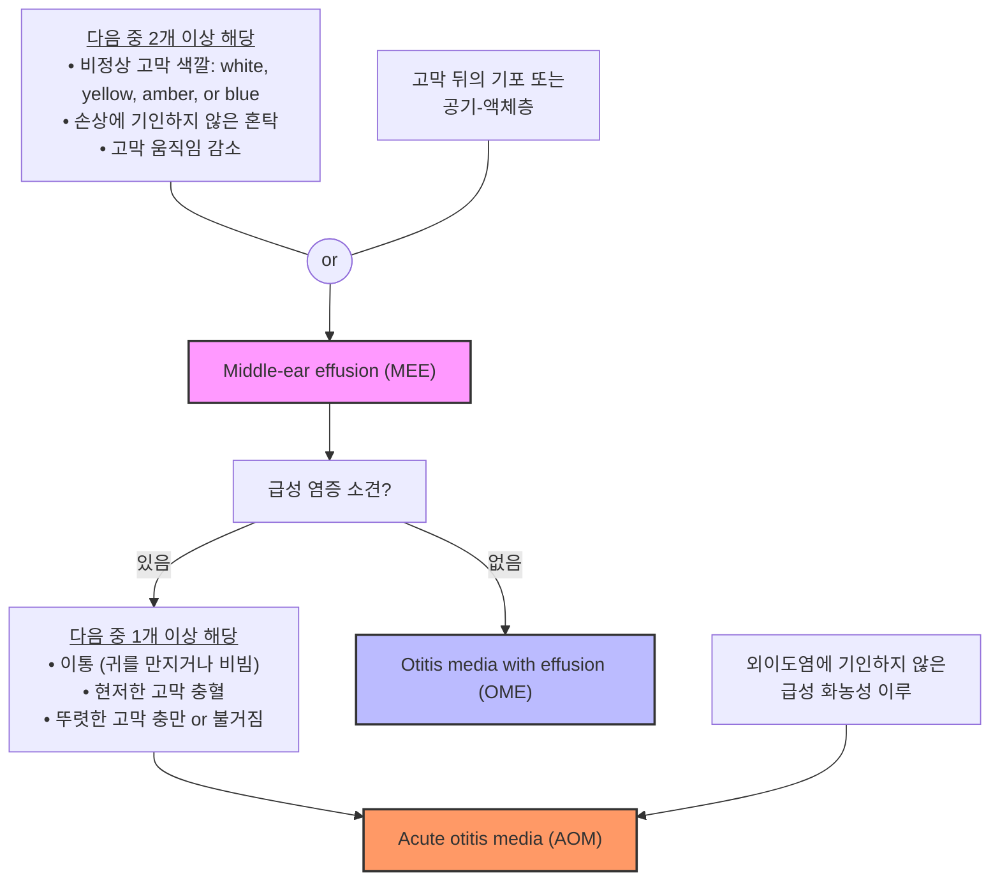
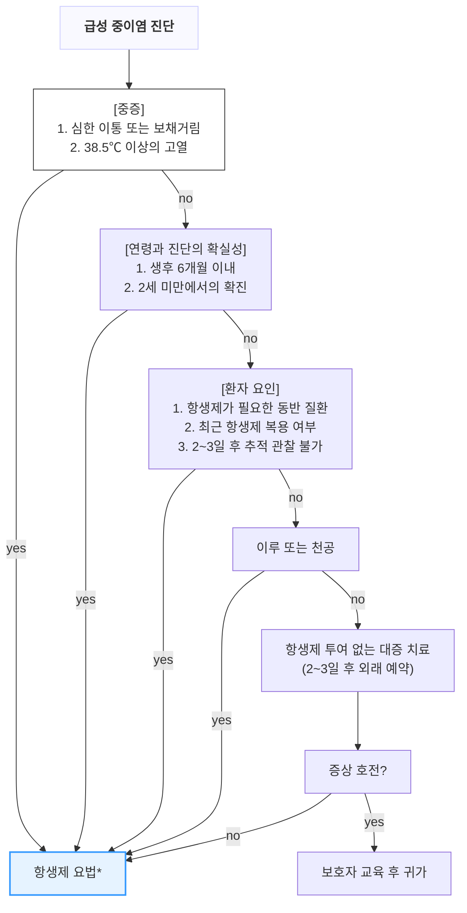
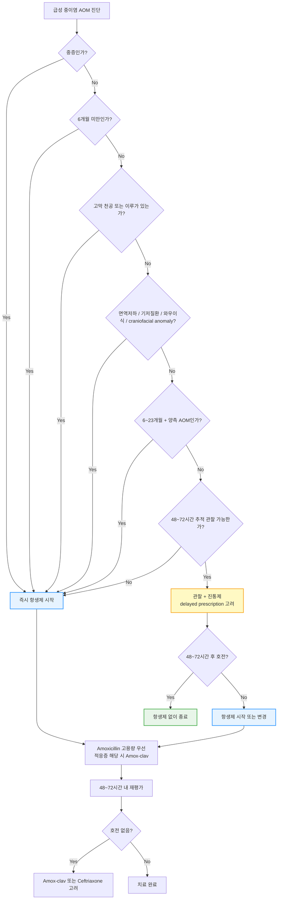
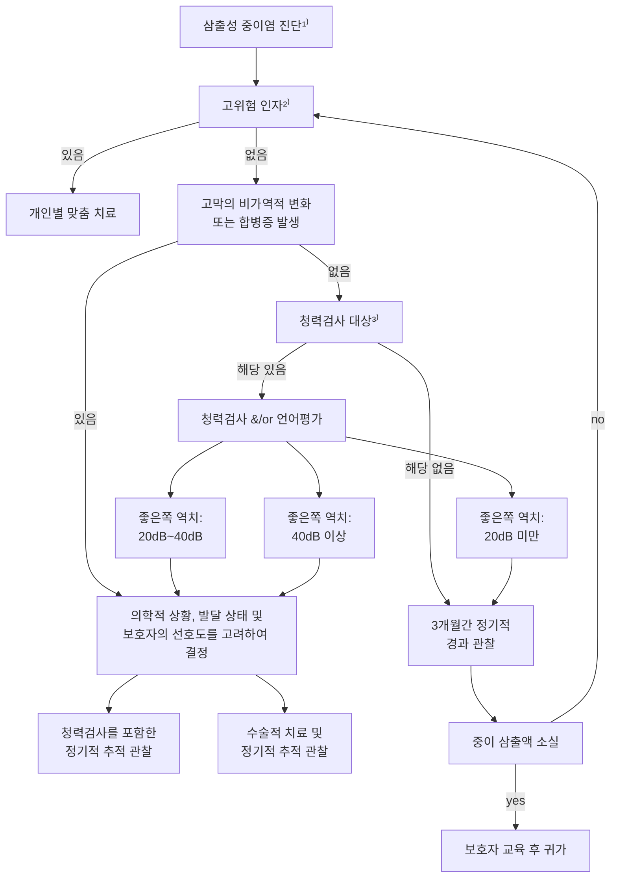

# 중이염 Otitis Media

## <mark style="color:green;">일반 사항</mark>

* 중이 점막의 염증; 보통 fluid collection 동반
* 소아에서 항생제 사용 및 난청의 가장 흔한 원인
* 빈도 : 3세까지 ≥80%의 소아가 ≥1회 경험; 24개월 이후 나이가 들수록 감소; 성인에서는 드묾
* 삼출 중이염 (OME) : 급성 염증 소견 없이 중이 내 삼출액이 있는 상태
* 재발 중이염 : ≥3회/6개월 또는 ≥4회/1년 발생
* 만성 화농성 중이염 (CSOM) : >3개월(WHO 기준 >2주) 지속 또는 반복 발생
* 치료 저해 요인 : 항생제 내성균, 불량한 순응도, 바이러스 동반 감염, 이관 기능 부전, 재감염, 면역 저하

## <mark style="color:green;">원인 및 위험 인자</mark>

* 바이러스에 의한 상기도 감염 : 아데노이드 비대 및 이관 부종 → 비인두·중이 병원균 집락화 증가
* 담배 노출 : 직·간접 흡연은 염증 반응을 연장시키고, 이관을 통한 중이 분비물 배출 방해
* 면역 저하, 악안면 기형, 이관(Eustachian tube) 기능 부전
* 낮은 사회경제적 상태
* 겨울철 : 호흡기 바이러스 활동과 관련
* 6개월\~2세 : 발생 빈도 가장 높은 연령 - 낮은 면역 기능, 비인두 림프 조직 풍부, 짧고 수평인 이관(Eustachian tube), 누워서 자는 시간 많음
* 보육 시설 이용 : 가정 보육아 대비 2\~3배 높은 발생률
* 남아, 유전, 가족력
* 조산(<37주), 저체중 출산(<2.5 ㎏), 모유 수유 부족

### <mark style="color:orange;">예방 / 백신</mark>

* 폐렴구균 백신 : 현재 국내 소아 국가예방접종(NIP)은 PCV20(20가) 기반으로 운영됨 (☞ [예방접종](../231_/210_-vaccination.md#pneumococcal-pneumonia))
  * PCV20은 PCV13 대비 7개 혈청형(8, 10A, 11A, 12F, 15B, 22F, 33F)을 추가 커버; 이 중 **혈청형 3·19A**는 PCV13 커버에도 불구하고 AOM 유발 빈도가 높게 보고된 혈청형으로, PCV20의 추가 커버가 AOM 감소에 기여할 것으로 기대됨
  * AOM 예방 효과 수치는 PCV7 기준 연구(고위험군 5\~6%, 저위험군 6% 감소)로 참고치로만 활용; PCV20의 소아 AOM 특이 장기 데이터는 아직 축적 중
* 인플루엔자 백신 : 호흡기 질환 시즌 동안 influenza 관련 AOM 감소에 도움
* 기타 : xylitol 껌(하루 5회 사용 시 재발성 AOM 예방 기대; 간헐적 사용은 효과 없음; 실제 순응도가 낮아 일상적 권고는 제한적), Vit D 보충(일부 관찰 연구에서 혈중 농도 유지 시 재발 감소 보고; 근거 수준 제한적)
* RSV 단일클론항체(예: Nirsevimab <mark style="color:blue;">\[베이포터스]</mark>) : RSV 예방을 통해 영유아의 첫 번째 AOM 발생 시기를 늦추고 항생제 노출을 줄이는 데 유의미한 기여를 한다는 보고 있음; 장기 면역 영향 및 비용-효과에 대한 추가 근거 축적 중
* 예방적 항생제 : 내성균 발생 우려 크고 효과 미약 - 권고하지 않음

### <mark style="color:$danger;">🚩 Red Flags!</mark>

<mark style="color:$danger;">**즉각 의뢰**</mark> <mark style="color:$danger;">- 두개 내 합병증 의심</mark>

* 두개 내 합병증 발생 또는 의심 : 골막하 농양, 경막외/하 농양
* 자발 안진(spontaneous nystagmus) 동반 : 내이염(labyrinthitis) 또는 미로 침범 의심
* 안면 마비(facial nerve palsy) : 즉시 CT/MRI + 의뢰
* 두통, 고열, 구토, 의식 변화 : 뇌막염·뇌농양 배제 필요

<mark style="color:$warning;">**당일 또는 조기 재평가·의뢰**</mark>

* 주변 합병증 발생 : 유양돌기염(귀 뒤 발적·부종·압통), 내이염
* 6주 이상 지속되는 고막 천공
* 재발성 급성 중이염 (≥3회/6개월 또는 ≥4회/1년)
* 적절한 항생제 치료 48\~72시간 내 호전 없거나 악화

<mark style="color:$info;">**외래 추적 / 추가 평가**</mark>

* OME 진단 시 3개월 후 청력 및 고막 상태 재평가
* 편측으로 지속되는 이루 또는 청력 저하 — nasopharyngeal carcinoma 감별 필요 (성인); 특히 흡연력·경부 림프절 종대·비출혈 동반 시 즉시 의뢰

## <mark style="color:green;">증상/병력에 따른 귀 문제의 감별</mark>

<figure><figcaption></figcaption></figure>

***

## ■ 급성 중이염 Acute Otitis Media (AOM)

## <mark style="color:green;">일반 사항</mark>

* 중이의 급속한 염증 소견
* 합병증 : 유양돌기염, 두개 내 감염, 안면 신경 마비, 만성 중이염
* 기전 : 상기도 바이러스 감염 선행 → 이관(Eustachian tube) 기능 부전, clearance 저하 → fluid·mucus 축적 → 2차 세균 감염

## <mark style="color:green;">원인</mark>

* 바이러스 : rhinovirus, RSV; 중이염 감염의 15\~44% 차지
* 세균 : _S. pneumoniae_, _H. influenzae_, _M. catarrhalis_
  * 세균·바이러스 중복 감염(\~70%) 또는 세균 중복 감염(\~50%)이 흔함
* 무균성

## <mark style="color:green;">임상 양상</mark>

* 귀 증상 : 보통 편측 발생; 통증(보챔, 귀를 만짐), 전음성 청력 저하, 이명, 유양돌기 압통
* 고막 소견 : 팽륜, 운동성 감소, 발적, 혼탁, 색깔 변화(흰색·노란색·호박색), air-fluid level, ossicular landmark 소실
  * 고막 발적 : 고열·울음에 의한 홍조와 구별 필요; 발적보다 팽륜이 진단에 더 신뢰할 만함
  * 고막 팽륜 : 수일 후 감소; 고막 파열로 이어질 수 있음
* 고막 파열 시 : 갑자기 통증 감소 + 이루 시작; 대부분 자연 치유, 지속 시 만성 중이염 발생 가능
* 귀 외 증상 : 발열, 어지럼, 식욕 저하, 구역, 구토, 설사

## <mark style="color:green;">진단</mark>

#### <mark style="color:$primary;">급성 중이염 진단 기준 (AAP 2013)</mark>

다음 3가지 기준 중 하나 이상을 충족하면 AOM으로 진단:

1. **중등도~심한 TM 팽륜** (moderate to severe bulging)
2. **새로 발생한 이루** — 외이염에 기인하지 않는 경우
3. **경도 TM 팽륜** + 48시간 이내에 발생한 이통(귀를 만지거나 비빔 포함) 또는 심한 TM 충혈


**발적(erythema) 단독은 AOM 확진 기준 불충분.** 고열이나 울음에 의한 홍조와 구별이 필요하며, 팽륜(bulging)이 가장 신뢰할 수 있는 진단 소견이다.


* **의증** : 위 기준을 완전히 충족하지 않으나 MEE 소견 + 급성 증상이 있는 경우

#### <mark style="color:$primary;">보조 검사</mark>

* 고막운동성계측(tympanometry)
  * **Type B** : MEE를 강력히 지지하는 소견
  * **Type C** : 음압 증가(이관 기능 부전)의 참고 소견 — AOM 단독 확진 근거로는 약함
* pneumatic otoscopy : 고막 운동성 감소 확인

#### <mark style="color:$primary;">중증 급성 중이염 진단 기준</mark>

* 의사가 환아를 관찰한 시점 이후 24시간 이내에 다음 중 ≥1개 관찰
  * 심한 이통 또는 보챔
  * ≥38.5℃ (미국 지침 ≥39℃)

#### <mark style="color:$primary;">감별</mark>


**AOM 오진 방지 — 항생제 시작 전 마지막 체크**

| 상황 | 먼저 생각할 진단 | 항생제 |
|---|---|---|
| TM 발적만 있음 (팽륜 없음) | 울음·고열에 의한 홍조 → AOM 아님 | 보류 |
| Bulging TM + 급성 이통 | AOM 가능성 높음 | 고려 |
| 이루 + 갑작스러운 통증 완화 | AOM + 고막 천공 | 필요 |
| 귀 충만감만 있음 (이통 없음) | OME 또는 ETD 우선 | 보통 불필요 |
| 이주(tragus) 압통 / 이개 당김 통증 | 외이염(OE) 우선 | 경구 항생제 ✕ |
| 씹을 때 통증 / 턱 클릭 | TMJ disorder 우선 | 불필요 |
| 상악 구치부 통증 | 치성 방사통 우선 | 불필요 |
| 귀 뒤 부종·발적·압통 | 유양돌기염 의심 | 즉시 CT + 의뢰 |
| 어지럼 + 자발 안진 | 내이염(labyrinthitis) 의심 | 즉시 의뢰 |
| 안면 마비 | 안면신경 침범 | 즉시 CT/MRI + 의뢰 |
| 성인 편측 지속 삼출 | NPC 감별 필요 | 원인 평가 우선 |


* 유양돌기염 : 귀 뒤의 통증/압통, 두통 동반
* Temporomandibular joint disorder : 입 벌릴 때 통증/소리, 씹을 때 심해지는 통증, 귓바퀴 앞 통증
* 이관 폐쇄 : 귀의 멍멍한 느낌 또는 압박감 (☞ [귀인두관기능부전](046_-eustachian-tube-dysfunction.md))
* 치아 문제 : 이환된 쪽 상악 치아 통증
* Barotrauma : 비행기 탑승, 잠수 경력 (☞ [귀 손상](049_-ear-injury.md#ear-barotrauma))

#### <mark style="color:$primary;">AOM·OME 감별 진단 흐름도</mark>



<p align="center"><strong>급성 중이염 및 삼출 중이염의 감별</strong><br><em><mark style="color:$info;">Ref. Kerschner JE, Preciado D. Otitis Media. Fig 640-1. In: Nelson Textbook of Pediatrics, 20th ed. 2016.</mark></em></p>

#### <mark style="color:$primary;">중이 이루의 감별 — phenotype-first 접근</mark>

<table><thead><tr><th width="145">이루 양상</th><th width="200">먼저 생각할 진단</th><th>진단적 단서</th><th>치료 방향</th></tr></thead><tbody><tr><td>급성 화농성<br/>(갑작스러운 통증 후 배출)</td><td>AOM, 고막 천공</td><td>선행 상기도 감염; 분비물 배출 후 통증 호전</td><td>항생제 이용액; 귀 청결·건조 유지 (☞ <a href="047_-otitis-externa.md#undefined-7">외이염</a>)</td></tr><tr><td>만성 화농성, 악취<br/>(간헐적 또는 지속적)</td><td>CSOM ± cholesteatoma</td><td>고막 천공력; 이전 항생제 무반응; 진주색 덩어리; 폴립</td><td>항생제 이용액; 청력 평가; bone CT; 배양 검사; 이비인후과 의뢰</td></tr><tr><td>맑은 장액성<br/>(묽고 냄새 없음)</td><td>중이 결핵 / ETD 삼출</td><td>결핵 감염력; 이전 항생제 무반응; 만성 경과</td><td>결핵 검사 및 치료 (☞ <a href="../223_/070_-tuberculosis.md">결핵</a>)</td></tr><tr><td>혈성 또는 지속 혈청성</td><td>두부·귀 외상 / 종양</td><td>외상력; 안면 신경 악화; 편측 박동성 이명; 종괴</td><td>청력 검사; bone CT; 의뢰 (☞ <a href="049_-ear-injury.md#traumatic-tm-perforation">귀손상</a>)</td></tr><tr><td>박동성 이루</td><td>사구종양(glomus tumor) / 고혈관 종양</td><td>편측 박동성 이명; 종괴; 청력 저하</td><td>bone CT/MRI; 즉시 의뢰</td></tr></tbody></table>

_<mark style="color:$info;">Ref. Rakel Family Medicine 9th ed. 2016.</mark>_

***

## <mark style="background-color:$warning;">Management - 급성 중이염</mark>

### <mark style="color:orange;">치료 방침</mark>

1. 진통제 : 모든 AOM에서 통증·발열 조절
2. 항생제 : 필요 시 사용; 일률적 투여는 권고하지 않음
3. 수술 : 적응증 해당 시 고려

**합병증이 없는 AOM의 항생제 적용 기준**

<table><thead><tr><th width="91">연령</th><th width="91">&#x3C;6개월</th><th width="93">≥6개월</th><th width="109">6~23개월</th><th width="137">6~23개월</th><th width="146">≥24개월</th></tr></thead><tbody><tr><td>중증도</td><td>무관</td><td>심함¹⁾</td><td>심하지 않음</td><td>심하지 않음</td><td></td></tr><tr><td>이환 부위</td><td>무관</td><td>무관</td><td>양측</td><td>편측</td><td>양측/편측</td></tr><tr><td>항생제</td><td>투여</td><td>투여</td><td>투여</td><td>투여 또는 관찰²⁾</td><td>투여 또는 관찰²⁾</td></tr></tbody></table>

_1) 이루, 아파 보임, >48시간 이통 지속, 이전 48시간에 ≥39℃(한국 지침 38.5℃), 추적 관찰 여부가 불확실_\
&#xNAN;_&#x32;) 48\~72시간 동안 철저한 감시 및 대증 치료; 호전되지 않거나 악화되면 항생제 투여 시작_\
&#xNAN;_<mark style="color:$info;">Ref. The Diagnosis and Management of Acute Otitis Media. Pediatrics 2013;131(3).</mark>_

**관찰 없이 즉시 항생제 투여 대상**

* 중증(연령 무관)
* <6개월아(중증도 무관)
* 2\~23개월 소아에서 확진 또는 양측 이환
* 고막 천공 상태 또는 이루
* 동반 질환 : 기저 질환, 면역 저하, 와우 이식
* 최근 30일 이내 항생제 복용 (내성균 가능성)
* 2\~3일 후 추적 관찰 불가, 또는 타병원에서 이미 경과 관찰 시행한 상태

**관찰 후 항생제 투여 결정 대상**

* 6\~23개월 소아에서 의증 상태 또는 편측 경증 발생
* ≥2세에서 경증으로 발생

 ✽ 지연 처방전(Delayed Prescription) 방식 가능 : 처방전을 진료 시 미리 교부하되, 48\~72시간 이내 호전이 없을 때만 조제하도록 보호자에게 안내

## <mark style="color:green;">약물 치료</mark>

* 항히스타민제, 코 울혈 제거제는 효과 없고 부작용 가능성이 있어 권고하지 않는다


**합병증 없는 AOM 초치료 원칙 = Amoxicillin 고용량 우선.** Amoxicillin/clavulanate(오구멘틴)는 다음 상황에 한해 초치료로 선택: ① 최근 30일 이내 amoxicillin 복용 ② otitis-conjunctivitis syndrome ③ 재발성 AOM ④ beta-lactamase 생성균 의심(H. influenzae, M. catarrhalis). 이외에는 amoxicillin을 먼저 사용하고 실패 시 amox-clav로 단계적 상향.


### <mark style="color:orange;">진통제</mark>

* acetaminophen : 650\~1,000 ㎎ q6h, 최대 4 g/d <mark style="color:blue;">\[타이레놀]</mark>
  * 소아 : 10\~15 ㎎/㎏ q4\~6h, 최대 5회/d; ≥3개월 연령 허가
  * <mark style="color:blue;">\[세토펜 현탁액]</mark> (32 ㎎/㎖; 0.4 ㎖/㎏ qid 또는 1.5\~2 ㎖/㎏/d #4)
* ibuprofen : 400 ㎎ q6h <mark style="color:blue;">\[부루펜]</mark>
  * 소아 : 5\~10 ㎎/㎏ q6\~8h, 최대 40 ㎎/㎏/d; ≥6개월 연령 허가
  * <mark style="color:blue;">\[부루펜 시럽]</mark> (20 ㎎/㎖; 0.25\~0.5 ㎖/㎏ tid\~qid 또는 1.5 ㎖/㎏/d #3\~4)
* ✽통증이 심한 초기 2\~3일은 규칙적으로 투여; 외부 온열 치료는 통증 완화에 약간의 효과 기대

### <mark style="color:orange;">항생제</mark>

* 대부분 항생제 사용 없이 회복. >6개월 소아에서 항생제 없이 81%, 항생제 사용 시 93% 회복
* 항생제 치료 시 8명 중 1명에서 1일 단축
* 항생제는 재발 및 청력 손실을 줄이지 못함

#### <mark style="color:$primary;">항생제 선택 및 용법</mark>

**초치료 — 1차 (amoxicillin 우선)**

<table><thead><tr><th width="286">1차 선택제</th><th>대체제 (Pc-allergy)</th></tr></thead><tbody><tr><td><strong>Amox. 80~90 ㎎/㎏/d #2</strong> (합병증 없는 AOM 원칙)<br/>→ Amox-clav. 90 ㎎/㎏/d #2 (하단 적응증 해당 시)</td><td>cefdinir 14 ㎎/㎏/d #1~2 / cefuroxime 30 ㎎/㎏/d #2 / cefpodoxime 10 ㎎/㎏/d #2 / ceftriaxone 50 ㎎/㎏/d IM/IV ×1~3d</td></tr></tbody></table>

**48\~72시간 초치료 실패 후**

<table><thead><tr><th width="286">1차 선택제</th><th>대체제 (Pc-allergy)</th></tr></thead><tbody><tr><td>Amox-clav. 90 ㎎/㎏/d #2 PO 또는 ceftriaxone 50 ㎎/㎏ IM/IV ×3d</td><td>ceftriaxone 50 ㎎/㎏ IM/IV ×3d / clindamycin 30~40 ㎎/㎏/d #3 ± 3세대 세파 / 고막천자·의뢰</td></tr></tbody></table>

**투여 기간**

* <2세 또는 심한 증상 : 10일
* ≥2세 경증 : 5\~7일
* 치료 48\~72시간 내 호전 없으면(=치료 실패) 항생제 교체 고려

#### <mark style="color:$primary;">1차 선택제</mark>

**Amoxicillin** <mark style="color:blue;">\[파목신]</mark>

* 합병증이 없는 AOM의 1차 선택
* \[미국소아과학회] 80\~90 ㎎/㎏/d
* \[대한이과학회]
  * 표준 용량 : 40\~45 ㎎/㎏/d; 성인 500 ㎎ tid — ≥2세이면서 최근 항생제 투여 없고 보육 시설 미이용 시 고려
  * 고용량 : 80\~90 ㎎/㎏/d — <2세, 최근 β-lactam 투여, 단체 생활 시 고려
* \[NICE] 1\~11개월 125 ㎎, 1\~4세 250 ㎎, 5\~17세 500 ㎎ tid ×5\~7d

**Amoxicillin/Clavulanate** <mark style="color:blue;">\[오구멘틴]</mark>

* 대상 : 중증, 초치료 실패, 최근 30일 내 Amox 복용, otitis-conjunctivitis syndrome
* 부작용 : 설사 (probiotics 병용으로 약간의 완화 기대)
* 용법 : Amox 기준 (80\~)90 ㎎/㎏/d #2
* \[NICE] : 1차 치료 2\~3일 후 증상 악화 시 선택; 25 ㎎/㎏ tid ×5\~7d
* 설사 부작용이 문제인 경우, Amox:Clav = 14:1 제제 <mark style="color:blue;">\[아목시클라브 ES]</mark> 고려 - 기존 4:1 제제 대비 clavulanate 함량이 낮아 위장 부작용 감소 기대

#### <mark style="color:$primary;">대체제</mark>

> ✽페니실린 알레르기 시 세팔로스포린 선택 원칙 : 1세대(cephalexin 등)는 R1 side chain 유사성으로 교차 반응 가능성이 있어 피한다. 2·3세대(cefdinir, cefuroxime, cefpodoxime)는 side chain 구조가 달라 페니실린 알레르기 환자에서도 안전하게 사용 가능하다.

**대상**

* amoxicillin에 알레르기가 있는 경우
  * Ⅰ형 면역 반응인 경우(예: 두드러기, anaphylaxis) : macrolide, quinolone(✽FDA 비승인)
  * Ⅰ형 면역 반응이 아닌 경우 : cephalosporin
* 부적절한 증상 회복
* 지속되는 화농성 콧물 동반
* 항생제 투여 중 AOM 발생
* 면역저하자
* 이전 중이염 감염 시 중증 또는 합병증 발생
* cefdinir : 14 ㎎/㎏/d #1\~2 <mark style="color:blue;">\[옴니세프]</mark>
* cefpodoxime : 10 ㎎/㎏/d #2 <mark style="color:blue;">\[바난]</mark>
* cefuroxime : 30 ㎎/㎏/d #2 <mark style="color:blue;">\[진네트]</mark>
* ceftriaxone : 50 ㎎/㎏(최대 1 g) IM/IV ×3d <mark style="color:blue;">\[트리악손]</mark>
  * 대상 : 경구제 투여 불가, 경구 치료 실패, 저항성 _S. pneumoniae_ 감염
* azithromycin : 10 ㎎/㎏/d qd ×1d + 5 ㎎/㎏/d ×4d <mark style="color:blue;">\[지스로맥스]</mark>
  * 국내 _S. pneumoniae_ macrolide 내성률 60\~80%; 페니실린 알레르기 중 I형 면역 반응(두드러기, anaphylaxis)이 있어 cephalosporin도 사용 불가한 경우에 한해 최후 수단으로 고려
  * 가급적 cephalosporin을 우선 선택
* clindamycin : 150\~300 ㎎ qid <mark style="color:blue;">\[훌그램]</mark> - macrolide 내성균은 교차 내성 있음
* clarithromycin : 소아 체중별 용량 (8 ㎏ 7.5 ㎎/㎏, 8\~11 ㎏ 62.5 ㎎, 12\~19 ㎏ 125 ㎎, 20\~29 ㎏ 187.5 ㎎, 30\~40 ㎏ 250 ㎎) bid ×5\~7d <mark style="color:blue;">\[클래리시드]</mark>
* levofloxacin : 성인 AOM에서 페니실린 알레르기 또는 초치료 실패 시 고려; 500 ㎎ qd ×5\~7d <mark style="color:blue;">\[크라비트]</mark> (보험 주의)

### <mark style="color:orange;">수술</mark>

**고막절개술 (Myringotomy) / Tympanocentesis**

* 급성 AOM의 유의미한 치유 촉진 여부는 논란이 있으나 배농·배액이 증상 완화에 도움 가능
* 대상 : 두 차례 적절한 약물 치료 course에도 무반응, 심한 이통·고열, 합병증 발생(안면 마비·유양돌기염·내이염·두개 내 염증), 면역 저하, 배양 검사 목적

**고막튜브삽입술·아데노이드절제술** (☞ [재발 중이염](048_-otitis-media.md#재발-중이염))

### <mark style="color:orange;">추적 관리</mark>

* 일회적 발생·빠른 회복 : 1개월 후 F/U (영유아는 2주 내 F/U)
* MEE 지속 시 청력 저하 및 합병증 감별 위해 F/U
* 고막 상태 회복은 오래 걸릴 수 있으나 보통 임상적으로 문제없음

### <mark style="color:orange;">성인 AOM 특이사항</mark>

* 성인 AOM은 소아에 비해 드묾; 편측 또는 반복 발생 시 반드시 기저 원인 감별 필요


**성인 편측 반복 AOM / 지속 삼출** — 다음 원인을 적극 배제:

* **비인두암(Nasopharyngeal Carcinoma, NPC)** : 특히 흡연력 + 경부 림프절 종대 + 비출혈 동반 시 즉시 이비인후과 의뢰
* **심한 이관 기능 부전(Eustachian tube dysfunction)** : 만성 비부비동염, 알레르기비염, 비용 동반 여부 확인 (☞ [귀인두관기능부전](046_-eustachian-tube-dysfunction.md))
* **두경부 종양 / 편도 종양** : 편측 편도 비대 동반 시


**성인 AOM 항생제 용량**

* amoxicillin : 500 ㎎ tid 또는 1 g bid × 5\~7d <mark style="color:blue;">\[파목신]</mark>
* amoxicillin/clavulanate : 875/125 ㎎ bid × 5\~7d <mark style="color:blue;">\[오구멘틴]</mark> (적응증 해당 시)
* levofloxacin : 500 ㎎ qd × 5\~7d <mark style="color:blue;">\[크라비트]</mark> (페니실린 알레르기 또는 초치료 실패 시)

### <mark style="color:orange;">급성 중이염 치료 알고리듬</mark>



_\*항생제 요법 ⓵ 치료 반응 판정: 2\~3일 후, 증상 호전 여부 ⓶ 치료 기간: 반응 시 5\~10일 ⓷ 항생제 감수성 결과 나오면 적절한 항생제로 변경_

<p align="center"><strong>급성 중이염 진단 및 치료 알고리듬</strong><br><em><mark style="color:$info;">Ref. 대한이과학회. 유소아 중이염 진료지침. 2014.</mark></em></p>

***

### <mark style="color:orange;">AOM 항생제 결정 알고리듬 (상세)</mark>



<p align="center"><strong>AOM 항생제 결정 알고리듬</strong><br><em><mark style="color:$info;">Ref. AAP. Pediatrics 2013;131(3). / 대한이과학회. 유소아 중이염 진료지침. 2014.</mark></em></p>


**중증(severe) 기준** — 다음 중 하나라도 있으면 즉시 항생제: 심한 이통, 48시간 이상 지속 통증, 고열 ≥39℃(국내 일부 지침 ≥38.5℃), 심한 보챔

**Delayed prescription** — 처방전을 진료 시 미리 교부하되, "2\~3일 내 호전 없을 때만 조제"하도록 보호자에게 안내 → 불필요한 항생제 감소, 보호자 만족도 유지


***

### <mark style="color:red;">질병코드 - 급성 중이염</mark>

H65 비화농성 중이염

H66.0 급성 화농성 중이염

***

## <mark style="color:purple;">처방례 - 급성 중이염</mark>

> **처방례 1. AOM — 소아 15 ㎏, 중증**
>
> ```
> 오구멘틴 듀오 시럽  1,350 ㎎/d (Amox 기준 90 ㎎/㎏/d)   #2  × 10d
> 부루펜 시럽 20 ㎎/㎖                                  11 ㎖  #3  × 3~5d
> ```
>
> _✽중증, 양측 이환, 최근 항생제 복용력 등 amox-clav 적응증 해당 시 고용량 요법 선택. **단순 비중증 AOM 초치료는 amoxicillin 단독이 원칙.** 발열·통증 지속 48\~72시간에도 호전 없으면 재내원_

> **처방례 2. AOM — 소아 15 ㎏, 오구멘틴 치료 실패 (48\~72시간 무반응)**
>
> ```
> 바난 시럽 10 ㎎/㎖   15 ㎖   #2   × 5~7d
> ```
>
> _✽cefpodoxime으로 전환 (cephalosporin 2차 선택). 초치료 실패 시 amoxicillin 내성 S. pneumoniae 또는 beta-lactamase 생성 H. influenzae 고려. 48시간 내 재내원 예약_

> **처방례 3. AOM — 성인**
>
> ```
> 파목신 500 ㎎/C        2C      #2   × 5~7d
> 타이레놀 이알 650 ㎎/T  1T      q8h  × 3~5d (통증·발열 시)
> ```
>
> _✽성인 AOM은 소아에 비해 드묾; 편측 발생·반복 발생 시 NPC·이관 기능 부전·두경부 종양 감별 필요 (☞ 성인 AOM 특이사항). 증상 지속 또는 악화 시 재내원_

> **처방례 4. AOM — 고막 천공 + 이루 동반**
>
> ```
> 타리비드 이용액 5 ㎖/병   10 drops   bid   이욕  × 7d
> 파목신 500 ㎎/C           2C         #2         × 7d
> 타이레놀 이알 650 ㎎/T     1T         q8h        × 3~5d
> ```
>
> _✽천공 동반 시 fluoroquinolone 단성분 이용액(타리비드, 시프레닛 등) 사용; **스테로이드·항생제 혼합 시판 제제 중 일부는 천공 시 금기 성분이 포함될 수 있으므로 반드시 단성분 fluoroquinolone 제제를 선택할 것.** 경구 항생제 병용. 4\~6주 내 고막 회복 확인 필요_

***

### <mark style="color:$success;">핵심 복약 지도 - 급성 중이염</mark>

> **항생제 치료 안내**
>
> * **처방된 기간을 반드시 끝까지 복용하십시오.** 증상이 좋아졌더라도 일찍 중단하면 세균이 완전히 제거되지 않아 재발하거나 내성이 생길 수 있습니다.
> * 항생제 복용 **48\~72시간 이내에 통증·발열이 나아지기 시작해야 합니다.** 그렇지 않으면 반드시 재내원하십시오 — 항생제 교체가 필요할 수 있습니다.
> * amoxicillin/clavulanate(오구멘틴)는 **설사 부작용**이 생길 수 있습니다. 식사와 함께 복용하면 위장 자극을 줄일 수 있고, 유산균제(프로바이오틱스) 병용이 도움이 됩니다.

> **진통제 사용**
>
> * 귀 통증이 심한 초기 2\~3일은 타이레놀 또는 이부프로펜을 **규칙적으로** 복용하는 것이 통증 조절에 더 효과적입니다.
> * 귀에 따뜻한 찜질을 하면 통증 완화에 약간 도움이 됩니다 (질병 경과에는 영향 없음).
> * **아스피린은 소아에게 절대 사용하지 마십시오** (Reye 증후군 위험).

> **언제 즉시 병원을 방문해야 하나요?**
>
> * 항생제 복용 **48\~72시간이 지나도 통증·발열이 전혀 나아지지 않거나 오히려 악화**되는 경우
> * 귀 뒤가 **빨갛게 부어오르거나 눌리면 아픈** 경우 (유양돌기염 의심)
> * 얼굴 한쪽이 처지거나 마비되는 느낌이 드는 경우 **(즉시 응급실)**
> * **두통, 고열, 구토, 의식이 흐려지는** 증상이 동반되는 경우 **(즉시 응급실)**
> * 귀에서 분비물이 나온 후 통증이 갑자기 없어졌다가 다시 통증이 생기는 경우

***

### <mark style="color:blue;">환자 안내서 - 급성 중이염</mark>


**급성 중이염이란 무엇인가요?**

고막 안쪽의 중이(middle ear)에 세균이나 바이러스가 감염되어 염증이 생긴 상태입니다. 흔히 감기 후에 이관(귀와 코를 잇는 관)을 통해 세균이 들어와 발생합니다. 소아에서 매우 흔하며, 적절한 치료를 받으면 대부분 회복됩니다. 고막 바깥의 외이염과 달리, 귓바퀴를 잡아당겨도 통증이 심해지지 않는 것이 특징입니다.


#### <mark style="color:$primary;">어떤 증상이 생기나요?</mark>

* 귀 통증 — 특히 누울 때 심해질 수 있으며, 영아는 귀를 자꾸 만지거나 보챕니다.
* 발열, 식욕 저하, 보챔 (소아)
* 귀가 먹먹하거나 소리가 울려 들리는 느낌
* 고막이 파열되면 갑자기 통증이 줄고 귀에서 분비물이 나올 수 있습니다 — 이 경우 자연적인 배농이므로 너무 놀라지 않아도 됩니다.

#### <mark style="color:$primary;">치료는 어떻게 하나요?</mark>

* 경증인 경우 2\~3일 동안 항생제 없이 진통제만으로 경과를 관찰합니다. 대부분 저절로 좋아집니다.
* 중증이거나 6개월 미만, 양측 이환인 경우 항생제를 즉시 사용합니다.
* 항생제를 처방받은 경우 **처방 기간을 끝까지 복용하세요.** 증상이 나아져도 중단하지 마십시오.
* 귀에 따뜻한 찜질이 통증 완화에 도움이 됩니다.

#### <mark style="color:$primary;">치료 중 주의사항</mark>

* **귀에 물이 들어가지 않도록** 하십시오. 수영은 의사의 허가 후에 재개하십시오.
* **면봉으로 귀 안을 후비지 마십시오.** 중이염 치료에 도움이 되지 않으며 오히려 해롭습니다.
* 코를 세게 풀지 말고 한 번에 한쪽씩 가볍게 풀어주십시오 (이관을 통한 세균 역행 방지).
* 비행기 탑승 시 이관 압력 조절이 어려울 수 있습니다 — 껌을 씹거나 하품을 하면 도움이 됩니다.

#### <mark style="color:$primary;">이럴 때는 즉시 병원을 방문하세요</mark>

* 항생제 복용 2\~3일이 지나도 통증·발열이 전혀 줄지 않을 때
* 귀 뒤가 빨갛게 부어오르거나 누르면 아플 때
* 얼굴이 한쪽으로 처지거나 마비될 때 **(즉시 응급실)**
* 두통, 구토, 의식이 흐려질 때 **(즉시 응급실)**

***

## ■ 삼출 중이염 Otitis Media with Effusion (OME)

## <mark style="color:green;">일반 사항</mark>

* 이통·발열 등 급성 염증 소견 없이 중이 내에 삼출액이 있는 상태
* 기전 : 중이 자극 → mucin 생성↑, 이관(Eustachian tube) 기능 부전/폐쇄 → 중이 내 mucin-rich effusion 축적
* 경과 : >3세 환자에서 3개월 내 50%가 자연 치유 (특히 AOM에 2차적으로 발생한 경우 잘 치유); OME 소아의 30\~40%에서 재발 경과
* 합병증 : 고막 천공, 외이염, 유착성 중이염, 진주종, 이소골 미란, 청력 손실, 언어 장애

## <mark style="color:green;">원인 및 위험 인자</mark>

* URI, 알레르기비염, AOM, 부비동 질환, adenoidal hypertrophy, 두경부 종양
  * AOM 치료 2주 후 60\~70%, 1개월 후 40%, 3개월 후 10\~25%에서 중이에 삼출액 잔존
* 영유아, 흡연

## <mark style="color:green;">임상 양상</mark>

* 명백한 증상이 없을 수 있음; 영유아에서는 표현이 모호할 수 있음 (귀를 문지름, 보챔, 소리에 부적절한 반응)
* 청력 감소, ear fullness, popping
* 이명, 균형 장애
* 고막 소견 : retracted 또는 neutral position, 운동성 감소, 불투명, 색깔 변화, air-fluid level·bubble
* 성인에서 편측으로 지속되는 경우 종양(특히 nasopharyngeal carcinoma) 감별 필요; 흡연력·경부 림프절 종대·비출혈 동반 시 즉시 의뢰

## <mark style="color:green;">진단</mark>

* 고막운동성계측(tympanometry) : 가장 유용; type-B 시 진단
* pneumatic otoscopy : 고막 운동성 감소 확인
* 청력 검사 : 재발성 AOM, ≥3개월 지속 MEE, 언어 지연·학습 장애 의심 시

***

## <mark style="background-color:$warning;">Management - OME</mark>

### <mark style="color:orange;">치료 방침</mark>

* OME 단독 진단 시 약물 요법 없이 3개월간 경과 관찰 → 이후 고막 상태, 청력, 언어 발달 평가 후 추가 치료 결정 \[대한이과학회]
  * 단, 구개열·다운증후군·감각신경성 난청·언어 발달 지연 등 고위험군은 3개월 대기 없이 즉시 청력 검사 및 의뢰 고려
* 약물 치료 고려 상황 : 동반 질환으로 치료 필요, 보호자 불안, 수술 거부
* F/U : 삼출액 소실될 때까지 1\~3개월 간격 검진

### <mark style="color:orange;">비약물 치료</mark>

* **자가 통기법 (Autoinflation)** : 코를 막고 양압을 만들어 이관을 열어주는 방법
  * Otovent 장치 (풍선형 통기 장치) : 소아에서 OME 삼출액 해소 및 청력 개선에 유의미한 효과를 보고한 RCT 있음 (NICE 권고 포함); 약물 치료 전 시도 가능한 비침습 옵션
  * 코를 한 쪽씩 막고 반대쪽 콧구멍으로 풍선을 부풀리는 동작 하루 2\~3회; ≥3세에서 협조 가능
  * 껌 씹기, 하품, Valsalva 수기도 동일 기전으로 도움

### <mark style="color:orange;">약제</mark>

* 항히스타민제, 코 울혈 제거제, 점액용해제 : 효과 없음 - 사용하지 않음
* 전신 steroid : 단기간 동안 효과 있으나 위험-이익 논란
* 비내 steroid : 이관 기능 치료에 기여하지 못함
* 항생제 : 단기적 효과만 있고 내성 위험 - 일반적으로 권고하지 않음 (AOM 또는 세균성 URI 동반 시 고려)

### <mark style="color:orange;">조기 조치 대상자</mark>

* 아래에 해당하는 경우 조기에 청력 검사, 언어 평가, 수술 고려
  * OME와 별도의 감각신경성 난청
  * 교정 불가능한 시각 저하
  * 다운증후군·두개안면기형
  * 구개열
  * 자폐증 및 전반적 발달 장애
  * 언어·인지 기능 저하
  * 진단 시 청력 역치 ≥40 ㏈ 또는 언어 발달 지연 의심
  * 경과 관찰 중 고막의 비가역적 구조 변화 발생 또는 예측

### <mark style="color:orange;">수술</mark>

* 일반적으로 3개월 경과 관찰 후 해당 시 고려
  * 양측 OME에서 좋은 쪽 귀 청력 역치 ≥40 ㏈
  * 편측 OME에서는 이환 기간, 청력 수준, 보호자 선호도 고려
  * 고위험군·고막의 비가역적 변화 예측 시 조기 수술 고려
* 고막절개술(myringotomy) 또는 고막튜브삽입술(tympanostomy tube insertion)

### <mark style="color:orange;">난청 동반 유소아 삼출성 중이염 - 청각 환경 개선</mark>

* 배경 음악·TV 등 잡음을 끈다
* 1 m 이내로 접근해서 천천히 크게 또렷이 발음한다
* 대면하여 손동작을 더하며 이야기한다
* 교실에서 선생님과 가까운 거리에 앉도록 하고 FM 시스템 등 음향 증폭 장치를 사용한다

### <mark style="color:orange;">삼출 중이염 치료 알고리듬</mark>



_1) 삼출성 중이염 진단 ⓵ 급성 염증 소견이 없음 ⓶ 중이 삼출액 존재: 이경, 통기 이경, tympanometry (B, C형)_\
&#xNAN;_&#x32;) 고위험 인자 ⓵ 감각신경성 난청 ⓶ 교정 불가 시각 저하 ⓷ 다운증후군·두개안면기형 ⓸ 구개열 ⓹ 자폐증·전반적 발달 장애 ⓺ 언어·인지 기능 저하_\
&#xNAN;_&#x33;) 청력검사 대상 ⓵ 난청 동반 여부 확인 필요 ⓶ 난청 의심 증상, 언어 지연·학습 장애 ⓷ 3개월 관찰 후 다음 단계 치료 결정 필요_

<p align="center"><strong>삼출 중이염 치료 알고리듬</strong><br><em><mark style="color:$info;">Ref. 대한이과학회. 유소아 중이염 진료지침. 2014.</mark></em></p>

***

### <mark style="color:red;">질병코드 - 삼출 중이염</mark>

H65.0 급성 장액성 중이염

H65.2 만성 장액성 중이염

***

## <mark style="color:purple;">처방례 - 삼출 중이염</mark>

> **처방례 1. OME — 경과 관찰 중 통증·발열 없이 청력 저하만 있는 소아**
>
> ```
> (약물 처방 없음 — 3개월간 경과 관찰 원칙)
> ```
>
> _✽OME 단독 진단 시 항생제·항히스타민제 등 약물 요법의 이득이 입증되지 않음. 3개월 후 청력 검사 및 고막 재평가 예약. 언어 발달 지연·고위험군은 조기 의뢰_

> **처방례 2. OME — AOM 동반 또는 세균성 URI 병발 시 (항생제 고려)**
>
> ```
> 파목신 500 ㎎/C   2C   #2   × 5~7d
> ```
>
> _✽AOM 또는 세균성 상기도 감염이 동반된 경우에 한해 항생제 고려. OME 단독에는 항생제 불필요_

***

### <mark style="color:$success;">핵심 복약 지도 - 삼출 중이염</mark>

> **삼출 중이염(귀 안에 물이 찬 상태) 안내**
>
> * 삼출 중이염은 귀 안에 액체(삼출액)가 고인 상태로, 급성 중이염처럼 통증·고열이 심하지 않습니다.
> * 3개월 이내에 절반 이상이 저절로 좋아지므로, 처음에는 약 없이 경과를 관찰하는 것이 원칙입니다.
> * **항생제, 항히스타민제, 코 막힘 약은 삼출 중이염에 효과가 없습니다.** 의사의 처방 없이 임의로 복용하지 마십시오.
> * 청력이 다소 감소할 수 있습니다. 아이가 말을 잘 못 듣거나 TV 볼륨을 높인다면 빠른 재진이 필요합니다.
> * 코를 세게 풀지 말고, 한 번에 한 쪽씩 부드럽게 풀어주십시오.

***

### <mark style="color:blue;">환자 안내서 - 삼출 중이염</mark>


**삼출 중이염(귀 안에 물이 찼어요)이란?**

고막 안쪽 중이에 액체(삼출액)가 고인 상태로, 통증이나 고열은 없거나 경미합니다. 감기 후나 급성 중이염 후에 잘 생깁니다. 대부분 시간이 지나면 저절로 회복되지만, 청력에 일시적인 영향을 줄 수 있어 추적 관찰이 필요합니다.


#### <mark style="color:$primary;">어떤 증상이 생기나요?</mark>

* 귀가 먹먹하거나 꽉 찬 느낌
* 소리가 울려 들리거나 TV 소리를 크게 해야 잘 들림
* 아이가 말을 자꾸 못 듣거나 반응이 늦어짐

#### <mark style="color:$primary;">치료는 어떻게 하나요?</mark>

* 처음 3개월은 약 없이 관찰하는 것이 원칙입니다. 자연적으로 회복되는 경우가 많습니다.
* 코를 풀거나 하품, 껌 씹기로 이관을 열어주는 것이 도움이 됩니다.
* 3개월 이상 지속되거나 청력이 많이 떨어진 경우 수술(고막 튜브 삽입)을 고려합니다.

#### <mark style="color:$primary;">이럴 때는 빨리 병원을 방문하세요</mark>

* 아이가 말을 잘 못 하거나 언어 발달이 느려 보일 때
* 3개월 이상 귀가 먹먹한 느낌이 지속될 때
* 갑자기 귀에서 분비물이 나오거나 통증이 생길 때

***

## ■ 만성 화농성 중이염 Chronic Suppurative Otitis Media (CSOM)

## <mark style="color:green;">일반 사항</mark>

* 3개월(WHO 기준: >2주) 지속 또는 반복적으로 고막 천공을 통한 이루가 발생하는 중이·유양동의 만성 염증
* 진주종(cholesteatoma)을 동반할 수 있으며, 동반 시 침습적 경과를 보이고 수술 필요성이 높음; 대부분 유양돌기 이환
* 원인균 : _H. influenzae_, _S. aureus_, _S. pyogenes_, _Pseudomonas_, 혐기성균

## <mark style="color:green;">임상 양상</mark>

* 농성 이루 : 지속 또는 간헐적; URI 또는 물에 노출된 후 심해질 수 있음
* 통증 : 급성 악화기 외에는 흔하지 않음 (영아 - 귀를 만지거나 당김)
* 전도성 청력 소실 : 고막·이소골 손상에 의해 발생
* 이명, 현훈

## <mark style="color:green;">검사</mark>

* 배양·항생제 감수성 검사 : 치료 실패(3주간 국소 항생제에 무반응) 또는 내성 의심 시
* CT 또는 MRI : 치료 실패, 합병증, cholesteatoma 의심 시

***

## <mark style="background-color:$warning;">Management - CSOM</mark>

### <mark style="color:orange;">귀 청소</mark>

* 자체 치료 효과는 없으나 청소 후 국소 항생제 치료 시 효과 향상

### <mark style="color:orange;">국소 살균제</mark>

* 국소 항생제와 동등한 효과
* 희석 acetic acid, boric acid ± iodine powder, Al acetate, Burow's solution (☞ [외이염](047_-otitis-externa.md))

### <mark style="color:orange;">국소 항생제</mark>

* 전신 항생제보다 효과적 (☞ [외이염](047_-otitis-externa.md#undefined-7))
* Fluoroquinolone (1차 선택) : 저자극, 이독성 없음, 고막 천공 시 안전
  * ofloxacin 0.3% 5 drops tid ×2주 <mark style="color:blue;">\[타리비드]</mark>
  * ciprofloxacin 0.3% 5 drops tid ×2주 <mark style="color:blue;">\[시프레닛]</mark>
* Aminoglycoside : 이독성 있음; 고막 천공 시 사용 피함 — fluoroquinolone 우선 (국내 aminoglycoside 이용액 시판 제제 없음)

### <mark style="color:orange;">경구 항생제</mark>

* 약제가 병소에 도달하기 어려워 효과 제한적; 국소제 추가 이득도 입증되지 않음
* 증세가 심하거나 분비물이 많아 국소제 사용 불가 시 적용
* 세균 감수성 검사에 따라 선택; 3주 투여 또는 이루 중단 3\~4일 후까지
* ciprofloxacin : 250\~500 ㎎ bid <mark style="color:blue;">\[씨프로바이]</mark>
* linezolid : 600 ㎎ bid <mark style="color:blue;">\[자이복스]</mark> (MRSA 의심 시)

### <mark style="color:orange;">수술</mark>

* 대부분의 경우 수술이 최종 치료
* 고막유양돌기절제술(tympanomastoidectomy) : 약물 치료 실패 시
* Tympanoplasty : cholesteatoma 없는 환자에서 CSOM 해결 후에도 고막 천공 >6개월 지속 시

***

### <mark style="color:red;">질병코드 - 만성 화농성 중이염</mark>

H66.3 기타 만성 화농성 중이염

***

## <mark style="color:purple;">처방례 - 만성 화농성 중이염</mark>

> **처방례 1. CSOM — 국소 항생제 (1차)**
>
> ```
> 타리비드 이용액 5 ㎖/병   5 drops   tid   이욕  × 14d
> ```
>
> _✽fluoroquinolone 점이용제는 고막 천공 상태에서도 사용 가능; 투여 전 귀 청소 선행. 3주간 적절한 치료에 무반응이면 배양 검사 및 의뢰_

> **처방례 2. CSOM — 분비물 과다 또는 국소제 사용 불가 시 (경구 항생제)**
>
> ```
> 씨프로바이 500 ㎎/T   2T   #2   × 14~21d
> ```
>
> _✽경구 항생제는 국소 치료가 불가능한 경우에 한해 사용. 세균 배양·감수성 검사 후 적절한 항생제로 조정. 이비인후과 협진 고려_

***

### <mark style="color:$success;">핵심 복약 지도 - 만성 화농성 중이염</mark>

> **점이용액 올바른 사용법**
>
> * 아픈 귀를 위로 향하게 눕거나 머리를 기울이고 처방된 방울 수를 점이하십시오.
> * **약병을 겨드랑이에 1분간 끼워두거나 바지 앞주머니에 5분간 넣어 체온 가깝게 데운 후 사용하십시오.** 차가운 약이 들어가면 어지럼증이 생길 수 있습니다.
> * 귓바퀴를 부드럽게 당겨 약이 귀 안 깊이 들어가도록 하고, **3\~5분간 그 자세를 유지**하십시오.
> * 처방 기간을 끝까지 사용하십시오.

> **귀에 물 들어가지 않도록 하는 방법**
>
> * 샤워·세발 시 귀마개나 솜(바셀린 묻힘)으로 귀를 막으십시오.
> * 수영은 치료 기간 중 삼가십시오.
> * **면봉으로 귀 안을 후비지 마십시오.** 분비물을 외이도로 밀어 넣고 상처를 줄 수 있습니다.

> **언제 즉시 병원을 방문해야 하나요?**
>
> * 귀 뒤가 빨갛게 부어오르거나 눌리면 아플 때 (유양돌기염 의심)
> * 얼굴 한쪽이 마비되거나 처지는 느낌이 들 때 **(즉시 응급실)**
> * 두통, 구토, 고열이 동반될 때 **(즉시 응급실)**
> * 3주간 치료 후에도 분비물이 지속될 때 (배양 검사 및 의뢰 필요)

***

### <mark style="color:blue;">환자 안내서 - 만성 화농성 중이염</mark>


**만성 화농성 중이염이란?**

고막에 구멍(천공)이 생기고, 귀에서 고름 같은 분비물이 2주 이상 반복적으로 나오는 상태입니다. 흔히 오래된 급성 중이염이 제대로 치료되지 않아 만성으로 진행되거나, 물이 귀에 자주 들어가는 것이 원인이 됩니다. 청력 저하가 동반될 수 있으며, 완치를 위해 수술이 필요한 경우도 있습니다.


#### <mark style="color:$primary;">어떤 증상이 생기나요?</mark>

* 귀에서 고름 같은 분비물이 나옴 (간헐적 또는 지속적)
* 청력 감소 (소리가 잘 안 들림)
* 이명(귀 울림)

#### <mark style="color:$primary;">치료 중 꼭 지켜야 할 것</mark>

* **귀에 절대 물이 들어가지 않게 하십시오.** 목욕·샤워 시 귀마개를 사용하고, 수영은 금지입니다.
* 귀약(점이용액)을 처방대로 끝까지 사용하십시오.
* 코를 세게 풀지 마십시오.

#### <mark style="color:$primary;">이럴 때는 즉시 병원을 방문하세요</mark>

* 귀 뒤쪽이 부어오르거나 통증이 심해질 때
* 얼굴 마비, 어지럼증이 갑자기 생길 때 **(즉시 응급실)**
* 3주 치료 후에도 분비물이 지속될 때

***

## ■ 재발 중이염 Recurrent Otitis Media

* ≥3회/6개월 또는 ≥4회/1년 발생
* 치료 후 수일 안에 다시 증상이 나타나면 재발로 판단
* 이전의 불충분한 치료 또는 상기도 감염 재발과 관련

***

## <mark style="background-color:$warning;">Management</mark>

* 재발 : 2차 약제 선택; 의뢰 고려
* 재감염 : 2주 이후 증상 재발 시 다른 균주에 의한 것으로 간주하여 새로 항생제 선택
* 예방적 항생제 : 권고하지 않음 — 효과 없고 항생제 내성 증가

### <mark style="color:orange;">고막튜브삽입술 (Tympanostomy Tube Insertion)</mark>

* 6\~12개월 또는 12\~18개월 유지 후 자연 배출되도록 제작된 튜브 삽입
* 대부분 배출·제거되기까지 성장 변화가 이루어지므로 재삽입이 필요한 경우는 드묾
* <3세 재발성 중이염에서 고막튜브삽입술과 약물 치료 사이에 유의미한 차이가 없었다는 보고 있음

**대상**

* 재발성 AOM : ≥3회/6개월 또는 ≥4회/12개월 (이 중 한 번은 6개월 내 발생) \[AAP]
* 평가 기간 중 한 번도 MEE가 없었던 경우는 제외 \[AAO-HNSF]

**고막 튜브 유지 중 AOM 발생 시 관리**

* 고막 튜브를 통해 이루가 배출되며 통증은 없음
* 필요시 배양 검사 시행(진균 검사 포함)
* 귀 청소 시행; 외부 오염(물) 주의
* 국소 항생제 : fluoroquinolone 점이액 1차 선택 - ofloxacin <mark style="color:blue;">\[타리비드]</mark>, ciprofloxacin <mark style="color:blue;">\[시프레닛]</mark>; 필요시 dexamethasone 병용 <mark style="color:blue;">\[실로덱스]</mark>
* 경구 항생제 : 점이액 무반응 또는 전신 증상 동반 시

**부작용** : 고막 영구 천공, 고실 경화증, 고막 위축성 반흔 - 드묾

### <mark style="color:orange;">아데노이드절제술 (Adenoidectomy)</mark>

* 아데노이드·편도절제술 효과 : 수술 후 첫 해 AOM 0.7회 감소 및 합병증 15% 감소
* 장기 효과에 대해서는 논란

**대상**

* 아데노이드 비대로 인한 기도 폐쇄 : 심한 코막힘, 수면 호흡 장애, 구강 호흡
* 구강안면기형 : 하악·치아 발달 이상, 발음 장애
* 약물 치료로 해결되지 않는 재발성 비부비동염 또는 중이염

 ✽ 편도 절제 ☞ [편도염](../223_/064_-tonsillitis.md#undefined-12)
