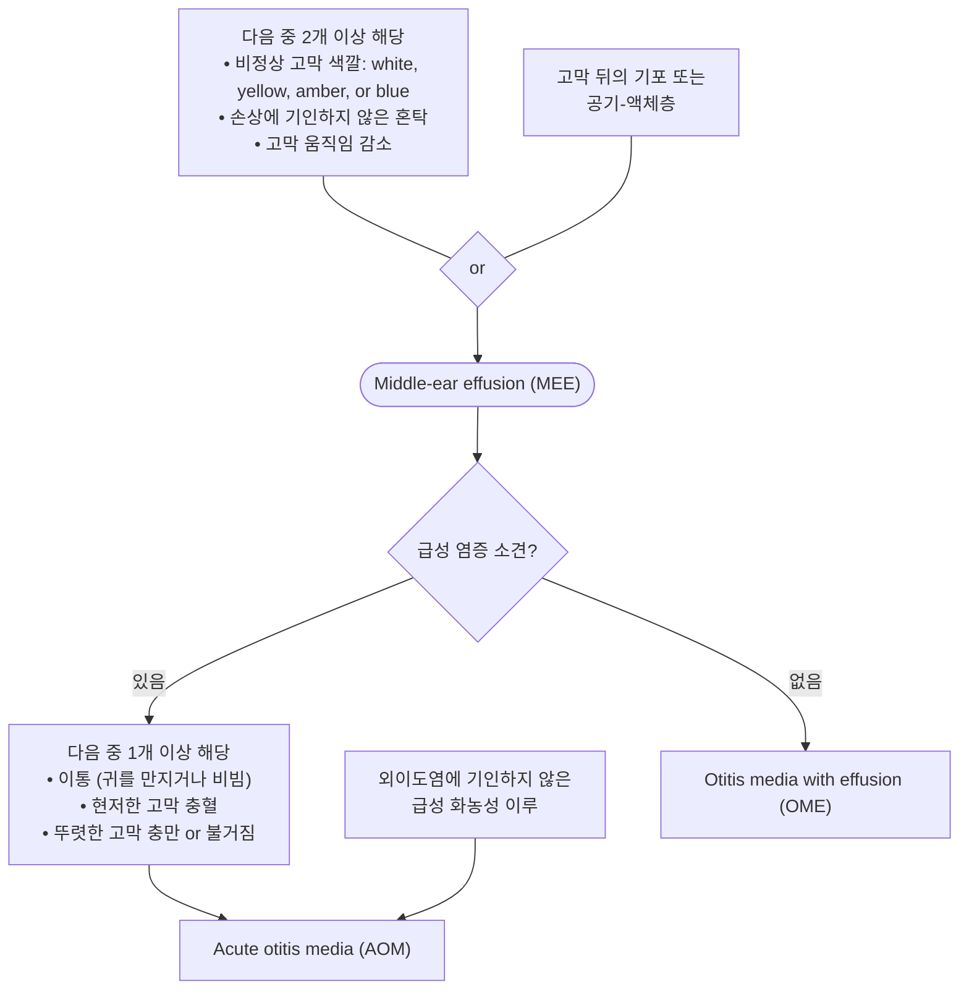

# 중이염 Otitis Media

## 일반 사항

* 중이 점막의 염증. 보통 fluid collection 동반
* 소아에서의 항생제 사용 및 난청의 가장 흔한 원인
* 빈도 : 3세까지 ≥80%의 소아가 ≥1회 경험, 24개월 이후 나이가 들수록 감소, 성인에서는 드묾
* 삼출 중이염 : 급성 염증 소견은 없으면서 중이 내에 삼출액이 있는 상태
* 재발 중이염 : ≥3회/6개월 또는 ≥4회/1년 발생
* 만성 화농성 중이염 : ＞3개월(WHO 정의- 2주) 지속 또는 반복적 발생
* 치료 저해 요인 : 항생제 내성균 감염, 불량한 순응도, 바이러스 감염  동반, 이관 기능 부전, 다른 부위로부터의 재감염, 면역 저하

## 원인 및 위험 인자

* 바이러스에 의한 상기도 감염 : 아데노이드 비대 및 이관 부종을 초래하고 비인두 및 중이의 병원균 집락화를 증가시킴
* 담배 노출 : 직간접 흡연은 염증 반응을 연장시키고 병원균 집락화를 증가시키고 이관을 통한 중이 내 분비물 배출을 방해함
* 면역 저하, 악안면 기형, 이관(Eustachian tube) 기능 부전
* 낮은 사회 경제적 상태
* 겨울철 : 호흡기 바이러스 활동과 관련하여 증가
* 6개월\~2세 : 급성 중이염 발생 빈도가 가장 높은 연령; 관련 인자- 낮은 면역 기능, 비인두 부위의 풍부한 림프 조직, 짧고 수평인 E-tube, 누워서 자는 시간이 많음
* 보육 시설 이용 : 시설 보육아는 가정 보육아보다 중이염이 2\~3배 더 많이 발생
* 남아, 유전, 가족력
* 조산(＜37주), 저체중 출산(＜2.5 ㎏), 모유 수유 부족, 임신 중 건강하지 못했던 산모 출산아

### Red Flags!

* 재발성 급성 중이염
* 6주 이상 지속되는 고막 천공
* 주변 합병증 발생 : 유양돌기염, 내이염
* 두개 내 합병증 발생 또는 의심 : 골막하 농양, 안면 마비, 자발 안진
* 중추 신경계 증상 의심 : 두통, 고열, 구토

## 예방

* 위험 인자 회피
* 감기 등 상기도 감염 예방, 백신 접종
* 아연, propolis, probiotics, 자두, 베리류 : 소아에 대한 일부 연구에서 감염 감소 (논란)
* Vit D 보충 : 혈중 농도 ＞30 ng/㎖ 유지 시 재발을 줄인다는 보고가 있음
* xylitol 껌, 사탕 : AOM 치료에는 효과가 없으며 호흡기 질환 유행 시기에 하루 5회 사용으로 재발성 AOM 예방 기대 (간헐적 사용은 효과 없음); 추가 연구 필요
* 예방적 항생제 투여 : 내성균 발생 우려는 큰 반면, 효과는 미약하므로 권고하지 않음

### 백신

* 폐렴구균 백신
  * AOM 상대 위험도 감소(7가 백신) : 고위험군 소아에서 5\~6%, 저위험군 소아에서 6% 감소 (13가 백신은 연구 부족)
  * 한계 : 효과 지속 기간이 불명확함(폐렴에 대해서는 5세 이후에는 효과 없음), 접종군에 있어 다른 균주에 의한 감염이 늘었으며 백신 포함 균주에 의한 감염 발생 시 중증도가 심해졌다는 보고가 있음 (☞ [예방접종](../231_/210_-vaccination.md#pneumococcal-pneumonia))
* 인플루엔자 백신 : AOM 발생률 4% 감소; 호흡기 질환 시즌 동안 AOM 30\~55% 감소

## 증상/병력에 따른 귀 문제의 감별

<figure><figcaption></figcaption></figure>

***

## ￭ 급성 중이염 Acute Otitis Media (AOM)

## 일반 사항

* 중이의 급속한 염증 소견
* 합병증 : 유양돌기염, 두개 내 감염, 안면 신경 마비, 만성 중이염
* 기전 : 보통 상기도 바이러스 감염이 선행 → E-tube dysfunction, clearance 저하 → fluid & mucus 축적 → 2차적 세균 감염

## 원인

* 바이러스 : rhinovirus, RSV; 중이염 감염의 15\~44% 차지
* 세균 : S. pneumoniae , H. influenzae , M. catarrhalis
  * 세균과 바이러스의 중복 감염(\~70%) 또는 중복 세균 감염(\~50%)이 흔함
* 무균성

## 임상 양상

* 귀 증상 : 보통 편측 발생; 통증(보챔, 귀를 만짐), 전음성 청력 저하, 이명, 유양돌기 압통
* 고막 소견 : 팽륜, 운동성 감소, 발적, 혼탁, 색깔 변화(흰색, 노란색, 호박색), air-fluid level 또는 고막 내 공기 방울, ossicular landmark가 관찰되지 않음
  * 고막 발적 : 고열이나 울음에 의한 홍조와 구별을 요함; 발적보다 팽륜이 진단에 신뢰할 만함
  * 고막 팽륜 : 감염이 지속되어도 수일 후에는 보통 감소됨; 고막 파열로 이어질 수 있음
  * 고막 retraction : 중이염 발생 전 단계에서는 이관 폐쇄와 함께 중이 내강으로부터의 공기 확산으로 인한 음압이 만들어져 고막이 retraction됨
* 고막 파열 시 갑자기 통증이 감소하고 이루가 시작됨
  * 파열된 고막은 대부분 적절한 치료로 자연 치유되지만, 지속되면 만성 중이염이 발생할 수 있음
* 귀 외 증상 : 발열, 어지럼, 식욕 저하, 구역, 구토, 설사

## 진단

### 급성 중이염 진단 기준&#x20;

(대한이과학회)

* 확진: 주관적 증상이 있고 객관적 징후가 ≥1개 있는 경우
* 의증: 주관적 증상은 있으나 객관적 징후가 분명치 않은 경우

#### 주관적 증상

* 급성 발생 : 48시간 이내 진행
* 국소 증상 : 이통, 이루
* 전신 증상 : 귀를 만짐, 울고 보챔, 수면 장애, 활동 저하, 식욕 부진, 발열, 급성 중이염 증상과 관련된 호흡기 증상이 있음

#### 객관적 징후

* 고막 소견 : 팽륜, 수포, 발적, 중이 삼출액 소견, 이루를 동반한 천공
* 고막운동성계측(tympanometry) : B형 또는 C형
* 고막천자 : 여러 항생제 치료에도 불구하고 심한 증상이 지속되는 경우 고려

### 중증 급성 중이염 진단 기준

* 의사가 환아를 관찰한 시점 이후 24시간 이내에 다음 중 ≥1개 관찰
  1. 심한 이통 또는 보챔
  2. ≥38.5℃ (미국 지침 ≥39℃)

### 감별

* 유양돌기염 : 귀 뒤의 통증/압통, 흔히 두통 동반
* temporomandibular joint disorder : 입을 벌릴 때 통증/소리, 씹을 때 심해지는 통증, 귓바퀴 앞 통증, 턱관절 압통
* 이관 폐쇄 : 귀의 멍멍한 느낌 또는 압박감 (☞ [귀인두관기능부전](046_-eustachian-tube-dysfunction.md))
* 치아 문제 : 이환된 쪽의 상악 치아 통증
* barotrauma : 비행기 탑승, 잠수 경력 (☞ [귀 손상](049_-ear-injury.md#ear-barotrauma))

<strong>급성 중이염 및 삼출 중이염의 감별</strong>
 <em><mark style="color:$info;">Ref. Kerschner JE, Preciado D. Otitis Media. Fig 640-1. In: Nelson Textbook of Pediatrics, 20th ed. 2016.</mark></em>

### 중이 이루의 감별

<table><thead><tr><th width="120">원인</th><th>진단적 단서</th><th>치료</th></tr></thead><tbody><tr><td>급성 중이염, 천공(+)</td><td>화농성 분비물; 이전에 상기도 감염력; 발생 전 통증</td><td>항생제 이용액(☞ <a href="047_-otitis-externa-oe.md#undefined-9">외이염</a>); 귀 청결, 귀 건조 유지</td></tr><tr><td>만성 중이염, 천공(+)</td><td>화농성 분비물; 고막 천공력; 고막 뒤 흰색 또는 진주색 덩어리; 이전 항생제 치료에 반응 안 함; 폴립</td><td>항생제 이용액; 청력 평가; bone CT; 이전 항생제 치료에 반응 없었으면 분비물 배양 검사</td></tr><tr><td>외상 (☞ <a href="049_-ear-injury.md#traumatic-tm-perforation">귀손상</a>)</td><td>혈성 또는 지속되는 맑은 분비물; 두부 또는 귀 외상력; 안면 신경 악화</td><td>항생제 이용액; 청력 검사; bone CT</td></tr><tr><td>중이 결핵</td><td>냄새가 없는 묽은 만성 분비물; 결핵 감염력, 결핵 검사 양성; 이전 항생제 치료에 반응 없음</td><td>결핵 검사 및 치료 (☞ <a href="../223_/070_-tuberculosis.md">결핵</a>)</td></tr><tr><td>종양</td><td>편측 박동성 이명; 종괴; 폴립</td><td>청력 평가; bone CT</td></tr></tbody></table>

<em><mark style="color:$info;">Ref. Rakel Family medicine 9th ed. 2016. eTable 18-7.</mark></em>

## Management

### 치료 방침

* 진통제
* 항생제 : 필요시 사용; 일률적 사용은 권고하지 않음
* 수술 : 적응증에 해당되는 경우 고려

## 진통제

* acetaminophen : 650\~1,000 ㎎ q6hr, 최대 4 g/d \[타이레놀]
  * 소아 : 10\~15 ㎎/㎏ q4\~6hr, 최대 5회/d; ≥3개월 연령 허가
  * \[세토펜 현탁액]\(32 ㎎/㎖; 0.4 ㎖/㎏ qid 또는 1.5\~2 ㎖/㎏/d #4)
* ibuprofen : 400 ㎎ q6hr \[부루펜]
  * 소아 : 5\~10 ㎎/㎏ q6\~8hr, 최대 40 ㎎/㎏/d; ≥6개월 연령 허가
  * \[부루펜 시럽]\(20 ㎎/㎖; 0.25~~0.5 ㎖/㎏ tid~~qid 또는 1.5 ㎖/㎏/d #3\~4)

## 항생제

* 대부분 항생제 사용 없이 회복
* 치유 및 후유증에 대한 항생제의 이익이 크지 않으며, 항생제 남용으로 인한 내성 및 슈퍼 박테리아의 발생 문제가 있음
  * ✽＞6개월 소아에서 항생제 없이 81% vs 항생제 사용 시 93% 회복. 치료 시 8명 중 1명에서 1일 단축; 항생제는 재발 및 청력 손실을 줄이지 못함)
* AOM 후 MEE(middle ear effusion)만 있는 경우에는 항생제 치료가 필요 없음

### 합병증이 없는 급성 중이염 환자의 항생제 적용 기준

<table><thead><tr><th width="91">연령</th><th width="91">&#x3C;6개월</th><th width="93">≥6개월</th><th width="109">6~23개월</th><th width="137">6~23개월</th><th width="146">≥24개월</th></tr></thead><tbody><tr><td>중증도</td><td>무관</td><td>심함¹⁾</td><td>심하지 않음</td><td>심하지 않음</td><td></td></tr><tr><td>이환 부위</td><td>무관</td><td>무관</td><td>양측</td><td>편측</td><td>양측/편측</td></tr><tr><td>항생제</td><td>투여</td><td>투여</td><td>투여</td><td>투여 또는 관찰²⁾</td><td>투여 또는 관찰²⁾</td></tr></tbody></table>

1\) 이루, 아파 보임, ＞48시간 이통 지속, 이전 48시간에 ≥39℃(한국지침 38.5℃), 추적 관찰 여부가 불확실 \
2\) 48\~72시간 동안 철저한 감시 및 대증 치료; 호전되지 않거나 악화되면 항생제 투여 시작
\
&#xNAN;_<mark style="color:$info;">Ref. The Diagnosis and Management of Acute Otitis Media. Pediatrics 2013;131(3).</mark>_

#### 관찰 없이 즉시 항생제 투여 대상

* 중증(연령 무관)&#x20;
* ＜6개월아(중증도 무관)&#x20;
* 2\~23개월 소아에서 확진 또는 양측 이환&#x20;
* 고막 천공 상태 또는 이루
* 동반 질환 : 기저 질환, 면역 저하, 와우 이식
* 최근\* 항생제 복용\
  \*최근 30일 이내에 항생제 처방을 받은 경우 내성균주의 존재 가능성이 높은 것으로 보고됨
* 2\~3일 후 추적 관찰이 불가능, 또는 타병원에서 이미 경과 관찰을 시행한 상태

#### 관찰 후 항생제 투여 결정 대상

* 6\~23개월 소아에서 의증 상태 또는 한쪽에 경증으로 발생
* ≥2세에서 경증으로 발생

### 항생제 선택 및 용법

**초치료 또는 지연 치료**

| 1차 선택제                                                                                       | 대체제 (Pc-allergy)                                                                                                                               |
| -------------------------------------------------------------------------------------------- | ---------------------------------------------------------------------------------------------------------------------------------------------- |
| <ul><li>Amox. 80~90 ㎎/kg/d #2*</li></ul>
  또는
<ul><li>Amox-clav. 90 ㎎/kg/d #2</li></ul> | <ul><li>cefdinir 14 ㎎/㎏/d #1~2</li><li>cefuroxime 30 ㎎/㎏/d #2</li><li>cefpodoxime 10 ㎎/㎏/d #2</li><li>ceftriaxone 50 ㎎/d IM/IV ×1~3d</li></ul> |

**48\~72시간 항생제 초치료 실패 후 항생제 치료**

<table><thead><tr><th width="282">1차 선택제</th><th>대체제 (Pc-allergy)</th></tr></thead><tbody><tr><td><ul><li>Amox-clav. 90 ㎎/kg/d #2 PO</li></ul>
  또는
<ul><li>ceftriaxone 50 ㎎ IM/IV ×3d</li></ul></td><td><ul><li>ceftriaxone 50 ㎎ IM/IV ×3d</li><li>clindamycin 30-40 ㎎/㎏/d #3 ± 3세대 세파</li><li>2차 항생제 실패 시 clindamycin 30-40 ㎎/㎏/d #3 + 3세대 세파</li><li>고막천자, 의뢰</li></ul></td></tr></tbody></table>

_<mark style="color:$info;">대한이과학회 유소아중이염진료지침(2014) : 연령 24개월 이상이면서 최근에 항생제를 투여 받은 병력이 없고 보육 시설에 다니지 않는 경우는 40\~50 ㎎/㎏/d 용법 가능</mark>_ \
_<mark style="color:$info;">Ref. Clinical practice guideline: The diagnosis and management of acute otitis media. Pediatrics 2013;131(3).</mark>_

#### 투여 기간

* ＜2세 또는 심한 증상 : 10일
* ≥2세의 경증 : 5\~7일
* 치료 48\~72시간 내 호전 없으면(=치료 실패) 항생제 교체 고려

### 1차 선택제

#### Amoxicillin

* 합병증이 발생하지 않은 경우 1차 선택 \[파목신]
* \[미국소아과학회] 80\~90 ㎎/㎏/d
*   \[대한이과학회]

    •표준 용량 : (40\~)45 ㎎/㎏/d, 성인 500 ㎎ tid; ≥2세이면서 최근 항생제를 투여 받은 적이 없고 보육 시설에 다니지 않는

    경우 고려

    •고용량 : 80\~90 ㎎/㎏/d; ＜2세, 최근 β-lactam 계열 항생제 투여, 단체 생활 시 고려
* [NICE](../2018/) 1~~11개월 125 ㎎, 1~~4세 250 ㎎, 5~~17세 500 ㎎ tid ×5~~7d

#### Amoxicillin/Clavulanate

* 대상 : 중증, 항생제 초치료 실패, 최근 30일 내 Amox 복용, otitis-conjunctivitis syndrome
* 부작용 : 설사 (✽probiotics 병용으로 설사 부작용의 약간의 완화 기대)
* 용법 : Amox 기준 (80\~)90 ㎎/㎏/d #2 \[오구멘틴]
* [NICE 권고안](../2018/) : 2~~3일간 1차 치료 후 증상 악화 시 선택; 25 ㎎/㎏ tid ×5~~7d

### 대체제

#### 대상

*   amoxicillin에 알레르기가 있는 경우

    •Ⅰ형 면역 반응인 경우(예: 두드러기, anaphylaxis) : macrolide, quinolone(✽FDA 비승인)

    •Ⅰ형 면역 반응이 아닌 경우 : cephalosporin
* 부적절한 증상 회복
* 지속되는 화농성 콧물 동반
* 항생제 투여 중 AOM 발생
* 면역저하자
* 이전 중이염 감염 시 중증 또는 합병증 발생

#### 약제

* cefdinir : 14 ㎎/㎏/d #1\~2 \[옴니세프]
* cefpodoxime : 10 ㎎/㎏/d #2 \[바난]
* cefuroxime : 30 ㎎/㎏/d #2 \[진네트]
*   ceftriaxone : 50 ㎎/㎏(최대 1 g) IM/IV ×3d \[트리악손]

    •대상 : 경구제 투여가 어려움, 경구제로 치료 실패, 저항력이 강한 S. pneumoniae 감염
* azithromycin : 내성 문제로 제한적 효과; 10 ㎎/㎏/d(최대 500 ㎎) qd ×1d + 5 ㎎/㎏/d(최대 250 ㎎/d) ×4d \[지스로맥스]
* clindamycin : macrolide 내성균은 clindamycin에도 내성이 있음; 150\~300 ㎎ qid \[훌그램]
*   clarithromycin : ~~8 ㎏ 7.5 ㎎/㎏, 8~~11 ㎏ 62.5 ㎎, 12~~19 ㎏ 125 ㎎, 20~~29 ㎏ 187.5 ㎎, 30~~40 ㎏ 250 ㎎ bid ×5~~7d

    \[클래리시드]

## 기타

* 항히스타민제, 코 울혈 제거제 : 효과는 없으면서 부작용의 가능성이 있어 사용을 권고하지 않음
* 외부 온열 치료 : 질병 경과에 영향 없음. 통증 완화에 대하여 약간의 효과 기대
* 국소 마취 점이액 : 증거 불충분. 일부에서 통증 완화 효과; 고막 천공 시 금지

## 수술

### 고막절개술 (Myringotomy) or Tympanocentesis

* 고막 절개에 의한 배농/배액이 증상 완화에 도움이 될 가능성이 있으나 급성 중이염의 유의미한 치유 촉진 여부에 대해서는 논란

#### 대상

* 두 차례의 적절한 약물 치료 course에도 반응하지 않는 경우
* 심한 이통, 고열
* 합병증 발생. 예) 안면 마비, 유양돌기염, 내이염, 중추 신경계 염증
* 면역 저하
* 삼출액에 대한 배양 검사 목적; 배양/항생제 감수성 검사는 가능한 한 항생제 투여 전 시행

### 고막튜브삽입술, 아데노이드절제술

(☞ [고막튜브삽입술](048_-otitis-media.md#tympanostomy-tube-insertion),  [아데노이드절제술](048_-otitis-media.md#adenoidectomy))

## 추적 관리

* 일회적 발생 및 빠르게 회복한 경우에는 1달 후 F/U (영유아는 2주 내 F/U)
* 고막 상태의 회복은 오래 걸리거나 이전 상태로 완전히 회복되지 않을 수 있으나 보통 문제없음
* MEE가 지속되는 경우 청력 저하 및 합병증 발생 감별을 위하여 F/U

* 급성 중이염 진단
  \
  (1) 주관적 증상
  \
   ⓵ 급성 발생 ⓶ 급성 염증에 의한 중이 국소(이통, 이루 등) 또는 전신 증상(발열, 울고 보챔 등)
  \
  (2) 객관적 징후
  \
   ⓵ 고막 진찰 소견 : 고막 팽륜, 수포, 발적, 이루, 중이 삼출액
  \
   ⓶ 고막운동성계측 검사 B or C형, 고막천자상 중이 삼출액 존재
  \
  ▶판정
  \
   확진 : (1)항 모두 만족 AND (2)항 중 1개 이상 만족
  \
   의증 : (1)항 모두 만족 BUT (2)항이 분명치 않은 경우

†항생제 요법
\
 ⓵ 치료 반응 성공/실패 판정; 2\~3일 후, 증상 호전 유무로 판단
\
 ⓶ 치료 기간: 반응 시 5\~10일간
\
 ⓷ 항생제 감수성 결과가 나오면 언제든지 적절한 항생제로 변경

<strong>급성 중이염 진단 및 치료 알고리듬</strong>
 <em><mark style="color:$info;">Ref. 대한이과학회. 유소아 중이염 진료지침. 2014.</mark></em>
 

### **질병코드**&#x20;

H65 비화농성 중이염

H66.0 급성 화농성 중이염

### 처방례

처방례 1. 15 ㎏, 중증
\
오구멘틴 듀오 시럽 30 ㎖ #2 맥시부펜 시럽 15 ㎖ #3


\
처방례 2. 15 ㎏, 오구멘틴 치료 실패
\
바난 시럽 15 ㎖ #2

처방례 3. 성인

***

## ■ 삼출 중이염 Otitis Media with Effusion (OME)

## 일반 사항

* 이통, 발열 등 급성 염증 소견은 없으면서 중이 내에 삼출액이 있는 상태
* 기전 : 중이 자극 → mucin 생성↑, E-tube 기능 부전/폐쇄 → 중이 내 mucin-rich effusion 축적
*   경과 : ＞3세 환자에서 3개월 내 50%가 자연 치유(특히 AOM에 2차적으로 발생한 경우 잘 치유됨);

    OME를 가진 소아의 30\~40%에서 재발 경과를 보임
* 합병증 : 고막 천공(대부분 자연 회복), 외이염(이루 발생 시), 유착성 중이염, 진주종, 이소골 미란, 청력 손실, 언어 장애

## 원인 및 위험 인자

* URI, 알레르기비염, AOM, 부비동 질환, adenoidal hypertrophy, 두경부 종양
  * AOM에 선행하거나 뒤에 발생할 수 있음; 중이염 치료 2주 후 60\~70%, 1개월 후 40%, 3개월 후 10\~25%에서 중이에 삼출액이 남아 있음
* 영유아, 흡연 (☞ [위험인자](048_-otitis-media.md#undefined-1))

## 임상 양상

* 명백한 증상이 없을 수 있음
* 영유아에서는 표현이 모호할 수 있음; 귀를 문지름, 보챔, 수면 장애, 소리에 부적절한 반응
* 청력 감소, ear fullness, popping
* 이명, 균형 장애
* 고막 소견 : retract 또는 neutral position, 운동성 감소, 불투명, 발적(심하지 않음), 색깔 변화(흰색, 노란색, 호박색), 고막 내 air-fluid level 또는 bubble, 고막 천공, 이루

## 진단

* 고막운동성계측(tympanometry) : 가장 유용한 진단 방법; type-B 시 진단
* pneumatic otoscopy : 고막 운동성 감소 확인; 검사자의 숙련도에 따라 진단율이 달라짐
* 청력 검사
  * 고려 대상
    1. 난청 감별이 필요(예: 재발성 급성 중이염, ≥3개월 지속되는 MEE)
    2. 난청 의심 또는 난청과 연관된 소견을 보임(예: 언어 지연, 학습 장애)
    3. 3개월간 추적 관찰 후 다음 단계 치료 방침의 결정이 필요
    4. 조기 조치 대상자
* 성인에서 지속되는 경우(특히 편측) 종양 등의 감별을 요함
* 편측성으로 지속되는 경우 nasopharyngeal carcinoma 감별을 요함

## Management

### 치료 방침

*   OME 단독으로 진단된 경우에는 약물 요법 없이 3개월간 경과 관찰 → 이후에는 고막상태, 청력 상태 및

    언어 발달 문제 여부를 판정하여 추가적인 치료 여부를 결정 \[대한이과학회]
* 다음의 경우 약물 치료를 고려&#x20;
  1. 동반 질환으로 인해 치료가 필요함
  2. 경과 관찰 요법에 대하여 보호자가 불안해함
  3. 수술적 치료가 필요한 상태에서 수술에 대한 거부감을 보임
* F/U : 지속 및 재발 여부를 감별하기 위해 소실될 때까지 매달 검진

### 조기 조치 대상자

* 다음의 경우에는 조기에 청력 검사, 언어 평가, 수술 등을 고려

1. 고위험군 : 다음을 동반
   1. OME와 별도의 감각 신경성 난청
   2. 교정 불가능한 시각 저하
   3. 다운증후군이나 두개안면기형
   4. 구개열
   5. 자폐증 및 전반적 발달 장애
   6. 언어 발달 장애
   7. 인지 기능 저하
2. 진단 시점의 청력 역치가 ≥40 ㏈이거나 언어 발달의 지연이 의심됨
3. 경과 관찰 중 고막의 비가역적인 구조 변화가 발생하거나 예측됨
4. 급격한 청력 저하나 어지럼 등 합병증이 예상되는 소견이 있음

### 약제

* 항히스타민제, 코 울혈 제거제, 점액용해제 : 효과 없음
* steroid
  * 전신 steroid : 단기간 동안 효과가 있으나 위험-이익에 대해서는 논란
  * 비내 steroid : 이관 기능 치료에 기여하지 못함
* 항생제 : 단기적 효과만 있는 반면 내성균 발생 위험이 있어 일반적으로 권고하지 않음
  * AOM 또는 세균성 상기도 감염이 동반된 경우 고려 (☞ [AOM](048_-otitis-media.md#undefined-17))

### Autoinflation

* Valsalva maneuver : 장기 효과 입증 안 됨
* 큰 아이들에게 유효

### 수술

* 일반적으로는 3개월의 경과 관찰 후 다음에 해당되는 경우 고려
  * 양측 OME에서 좋은 쪽 귀의 청력 역치가 ≥40 ㏈
  * 편측 OME에서는 이환 기간, 청력 수준, 보호자의 선호도를 고려하여 결정
  * 고위험군이나 고막의 비가역적 변화가 예측될 때는 조기 수술 치료 고려
* 고막절개술(myringotomy) 또는 고막튜브삽입술(tympanostomy tube insertion)
* nasopharyngeal orifice의 내시경 가이드 laser expansion

### 난청 동반 유소아 삼출성 중이염 환자에 대한 청각 환경 개선법

 (대한이과학회)

* 배경 음악이나 텔레비전 등 다른 소리를 끈다.
* 1 m 이내로 접근해서 말한다.
* 천천히 크게 똑똑히 발음한다.
* 대면하여 명확하게 말하고 손동작을 더하며 이야기한다.
* 글을 읽어줄 때는 그림을 설명하거나 이해한 것을 물어 확인한다.
* 교실에서는 선생님과 가까운 거리에 앉도록 한다.
* 교실에서는 FM 시스템 등 음향 증폭 장치를 사용한다.

1\) 삼출성중이염진단\
⓵ 급성 염증 소견이 없음\
⓶ 중이 삼출액 존재: 이경, 통기 이경, 이내시경, 수술 현미경, 고막운동성 계측 (B, C형)

2\) 고위험인자\
⓵ 삼출성 중이염과 별도로 감각신경성 난청을 가지고 있는 경우\
⓶ 교정 불가능한 시각저하\
⓷ 다운증후군이나 두개안면기형\
⓸ 구개열\
⓹ 자폐증 및 전반적 발달장애\
⓺ 언어발달장애\
⓻ 인지기능저하가 동반된 경우

3\) 청력검사 대상\
⓵ 진단시 난청의 동반 여부 및 정도의 확인이 필요\
⓶ 경과 관찰 도중 난청이 의심되는 증상을 보이거나 언어지연, 학습장애 등 난청과 연관된 소견을 보이는 경우\
⓷ 3개월간 추적 관찰 후 다음 단계 치료 방침의 결정이 필요\
\* 청력검사는 환아의 의학적 상태와 보호자의 요구에 따라 진료 중 어느 시기에나 시행할 수 있음

<strong>삼출 중이염 치료 알고리듬</strong>
 <em><mark style="color:$info;">Ref. 대한이과학회. 유소아 중이염 진료지침. 2014.</mark></em>

***

## ■ 만성 화농성 중이염 Chronic Suppurative Otitis Media

## 일반 사항

* ＞3개월(WHO 정의: ＞2주) 지속 또는 반복적으로 고막 천공부를 통한 이루가 발생하는 중이 또는 유양동의 만성 염증
* 진주종(cholesteatoma)을 포함, 대부분 유양돌기 이환
* 다른 명칭 : chronic active mucosal otitis media, chronic otomastoiditis, chronic tympanic mastoiditis
* 원인균 : H. influenzae , S. aureus , S. pyogenes , Pseudomonas , 혐기성균

## 임상 양상

* 농성 이루 : 지속 또는 간헐적 발생; URI 또는 물에 노출된 후 심해질 수 있음
* 통증(영아- 귀를 만짐 또는 당김) : 급성 악화기 외에는 흔하지 않음
* 전도성 청력 소실 : 고막 또는 이소골의 손상에 의해 발생
* 이명, 현훈

## 검사

* 배양 검사, 항생제 감수성 검사 : 치료 실패(3주간의 적절한 국소 항생제 치료에 반응하지 않는 경우) 또는 항생제 내성 의심 시 고려
* CT or MRI : 치료 실패 또는 합병증, cholesteatoma 의심 시 고려

## Management

### 귀 청소

* 자체의 치료 효과는 없으나 귀 청소 후 국소 항생제 치료 시 치료 효과 향상

### 국소 살균제 (antiseptics)

* 국소 항생제와 동등 효과
* 희석 acetic acid, boric acid±iodine powder, Al acetate, Burow’s solution (☞ [외이염](047_-otitis-externa-oe.md#undefined-9))

### 국소 항생제

(☞ [외이염](047_-otitis-externa-oe.md#undefined-9))

* 전신 항생제보다 유효 ✽국소 항생제의 효과와 안전성이 불확실하다는 보고가 있음
* fluoroquinolone : 저자극, 이독성 없음, 고막 천공 시 사용 가능
  * ciprofloxacin 0.3% \[시프레닛], ofloxacin 0.3% \[타리비드]; 보통 5 방울씩 tid ×2주
* aminoglycoside : 이독성 있음, 10일 이상 지속 사용 금지, 고막 천공 시 사용 금지 (이용액 시판 제제는 없음)

### 경구 항생제

* 약제가 병소에 도달하기 어려워 효과 적음, 국소제에 추가 투여 시의 이득도 입증되지 않음
* 증세가 심하거나 분비물이 많아 국소용제를 사용할 수 없을 때 적용
* 세균 감수성 검사에 따라 선택
* 3주 투여 또는 이루 중단 3\~4일 후까지 투여; 용량은 규정되어 있지 않음
* ciprofloxacin : 250\~500 ㎎ bid \[씨프로바이]
* linezolid : 600 ㎎ bid \[자이복스]

### 수술

* 대부분의 경우에 수술이 최종적인 치료 방법이 됨
* 고막유양돌기절제술(tympanomastoidectomy) : 약물 치료 실패 시 고려
* tympanoplasty : cholesteatoma가 없는 환자에서 CSOM 해결 후에도 고막 천공이 ＞6개월 지속되는 경우 고려

***

## ■ 재발 중이염 Recurrent Otitis Media

* ≥3회/6개월 또는 ≥4회/1년 발생하는 경우
* 치료 후 수일 안에 다시 증상이 나타나면 재발로 판단
* 이전의 불충분한 치료 또는 상기도 감염의 재발과 관련

## Management

* 재발 : 2차 약제 선택; 의뢰 고려
* 재감염 : 2주 이후 증상이 다시 나타나면 다른 균주에 의한 증상으로 간주하여 항생제 선택
* 예방적 항생제 투여 : 권고하지 않음. 효과가 없고 항생제 내성을 증가시킴
* 수술

### 고막튜브삽입술 (Tympanostomy tube insertion)

* 6\~12개월 또는 12\~18개월 유지 후 자연 배출되도록 제작된 고막 튜브를 삽입 (드물게 수년 후에 제거가 필요할 수 있음)
* 대부분 삽입한 튜브가 배출 또는 제거되기까지 성장 등의 변화가 이루어지므로 해부학적 이상을 가진 경우 외에는 튜브를 다시 삽입해야 하는 경우는 드묾

✽＜3세의 재발성 중이염에서 고막튜브삽입술과 약물 치료 사이에 유의미한 차이가 없었다는 보고가 있음

#### 대상

* 재발성 AOM : ≥3회/6개월 또는 ≥4회/12개월 (이 중 한 번은 6개월 내 발생) \[AAP]
* 평가 기간 중에 한 번도 middle ear effusion이 없었던 경우는 제외 \[AAO-HNSF]

#### 고막 튜브 유지 중 AOM 발생 시 관리

* 고막 튜브를 통하여 이루가 배출되며 통증은 없음
* 필요시 이루에 대하여 배양 검사 시행(진균 검사 포함)
* 외이 귀 청소 시행, 외부 오염(예: 물) 주의
*   국소 항생제 : fluoroquinolone 점이액; 1차 선택제; ciprofloxacin \[시프레닛], ofloxacin \[타리비드];

    간혹 dexamethasone 병용 \[실로덱스] (☞ [외이염](047_-otitis-externa-oe.md#undefined-9))
* 경구 항생제 : 점이액으로 호전되지 않는 경우 또는 전신 증상 동반 시 선택

#### 부작용

* 고막 영구 천공, 고실 경화증, 고막 위축성 반흔; 드묾

### 아데노이드절제술 (Adenoidectomy)

* 아데노이드 및 편도절제술 효과 : 수술 후 첫 해 0.7회 발생 감소 및 합병증 15% 감소
* 효과(특히 장기 효과)에 대하여 논란

#### 대상

*   아데노이드 비대로 인하여 다음 상태가 발생

    •기도 폐쇄 : 심한 코 막힘, 수면 호흡 장애를 유발하는 코골이, 구강 호흡

    •구강 안면 기형 : 하악 발달 이상, 치아 발달 이상, 발음 장애
* 약물 치료로 해결되지 않는 재발성 비부비동염 또는 중이염

✽편도 절제 ☞ [편도염](../223_/064_-tonsillitis.md#undefined-12)

### **질병코드**&#x20;

H65.0 급성 장액성 중이염

H65.2 만성 장액성 중이염

H66.3 기타 만성 화농성 중이염

### 처방례

처방례 1. 만성 화농성 중이염
\
타리비드 이용액 5 ㎖/병 5 drops tid
 

처방례 2. 점이액을 사용할 수 없는 만성 화농성 중이염
\
씨프로바이 250 ㎎/T 4T #2
