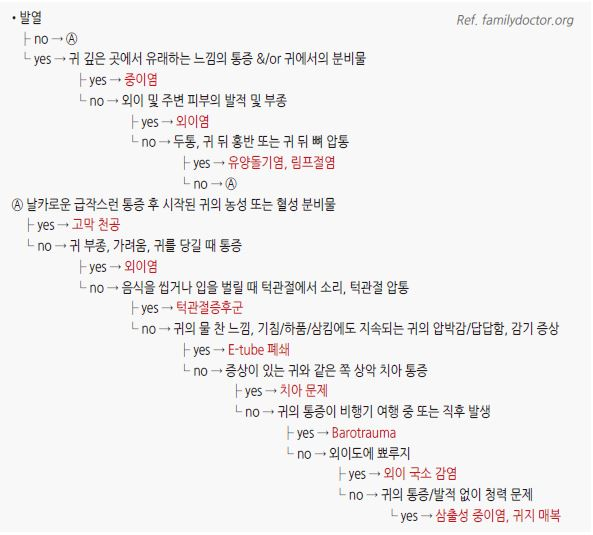
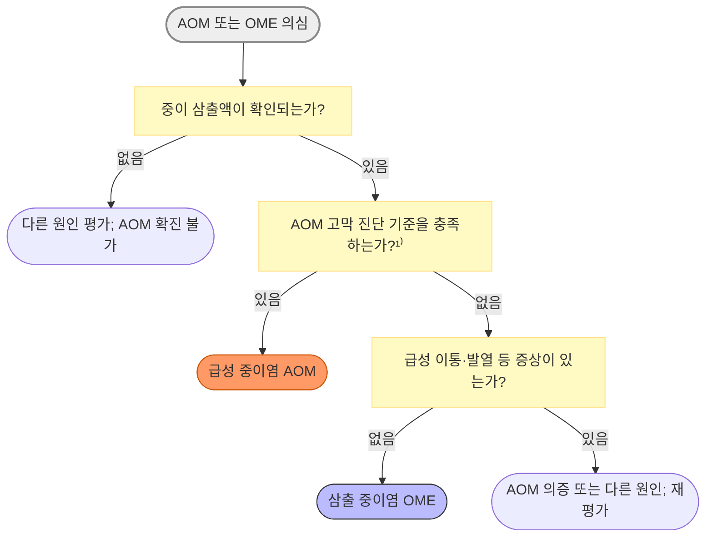
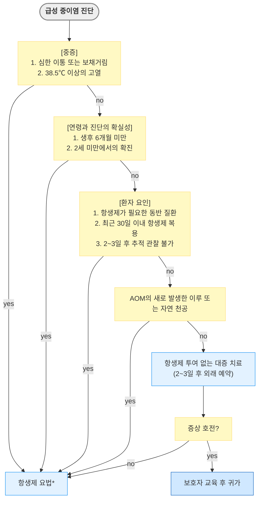
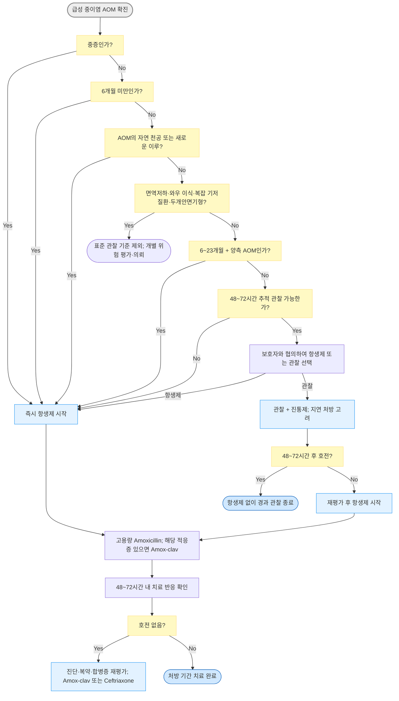
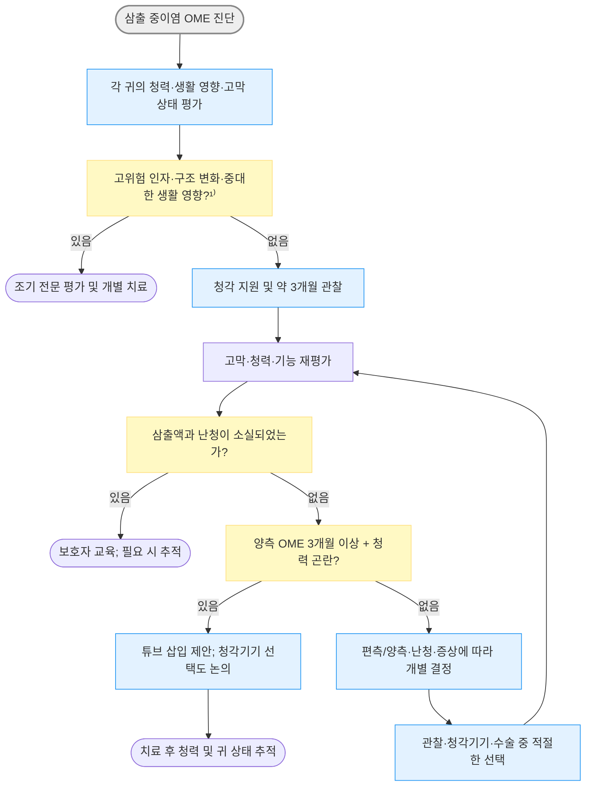

# 중이염 Otitis Media

## <mark style="color:green;">일반 사항</mark>

* 중이 점막의 염증; 보통 fluid collection 동반
* 소아에서 항생제 사용 및 난청의 가장 흔한 원인
* 빈도 : 3세까지 ≥80%의 소아가 ≥1회 경험; 24개월 이후 나이가 들수록 감소; 성인에서는 드묾
* 삼출 중이염 (OME) : 급성 염증 소견 없이 중이 내 삼출액이 있는 상태
* 재발 중이염 : ≥3회/6개월 또는 ≥4회/1년 발생
* 만성 화농성 중이염 (CSOM) : 고막 천공을 통한 지속·반복적 이루를 동반하는 만성 중이 염증; 기간 정의는 자료에 따라 다름(WHO 기준 ≥2주). 3개월까지 기다려 진단·평가하는 것은 아님
* 치료 저해 요인 : 항생제 내성균, 불량한 순응도, 바이러스 동반 감염, 이관 기능 부전, 재감염, 면역 저하

## <mark style="color:green;">원인 및 위험 인자</mark>

* 바이러스에 의한 상기도 감염 : 아데노이드 비대 및 이관 부종 → 비인두·중이 병원균 집락화 증가
* 담배 노출 : 직·간접 흡연은 염증 반응을 연장시키고, 이관을 통한 중이 분비물 배출 방해
* 면역 저하, 악안면 기형, 이관(Eustachian tube) 기능 부전
* 낮은 사회경제적 상태
* 겨울철 : 호흡기 바이러스 활동과 관련
* 6개월\~2세 : 발생 빈도 가장 높은 연령 - 낮은 면역 기능, 비인두 림프 조직 풍부, 짧고 수평인 이관(Eustachian tube), 누워서 자는 시간 많음
* 보육 시설 이용 : 가정 보육아 대비 2\~3배 높은 발생률
* 남아, 유전, 가족력
* 조산(＜37주), 저체중 출산(＜2.5 ㎏), 모유 수유 부족

### <mark style="color:orange;">예방 / 백신</mark>

* 폐렴구균 백신 : 2025년 10월부터 PCV20(20가)이 소아 국가예방접종(NIP)에 신규 도입됨; 기존 PCV13으로 접종을 시작한 소아는 PCV20으로 교차접종 가능하며, PCV15로 시작한 경우 동일 백신으로 접종 완료 권장(질병관리청) - 세부 기준은 변경될 수 있어 최신 안내 확인 필요 (☞ [예방접종](../231_/210_-vaccination.md#pneumococcal-pneumonia))
  * PCV20은 PCV13 대비 7개 혈청형(8, 10A, 11A, 12F, 15B, 22F, 33F)을 추가 커버; 이 중 11A·15B·22F·33F 등은 PCV13 도입 후 AOM에서 증가한 비백신 혈청형으로, 추가 커버에 따른 AOM 감소 효과가 기대됨
  * PCV7 연구에서 저위험 영아의 전체 원인 AOM은 약 6% 상대 감소; 고위험군에서는 예방 효과가 확립되지 않음(상대 감소율 −5%, 95% CI −25%~12%) \[Cochrane 2020]. 이 수치를 PCV20의 예방 효과로 적용하지 않으며, PCV20의 소아 AOM 특이 장기 데이터는 축적 중
* 인플루엔자 백신 : 호흡기 질환 시즌 동안 influenza 관련 AOM 감소에 도움
* Xylitol : 건강한 보육시설 이용 소아에서 예방 효과가 보고되었으나, 재발성 AOM 소아·호흡기 감염 중 소아의 예방 효과는 확립되지 않음. 연구에서 잦은 투여가 필요했고 순응도 문제가 있어 일상적 권고는 제한적 \[Cochrane 2016]
* Vitamin D : 일부 관찰 연구에서 혈중 농도와 재발 위험의 연관성이 보고되었으나, AOM 예방만을 위한 일률적 보충 근거는 부족함
* RSV 단일클론항체 : 본래 적응증은 RSV 하기도질환 예방이며, AOM 예방 자체를 위한 적응증은 아님
  * nirsevimab <mark style="color:blue;">\[베이포투스]</mark> : 2026년 관찰연구에서 AOM 및 항생제 노출 감소와의 연관성이 보고됨. 핀란드 전국 시계열 연구에서는 도입 후 영아 AOM 발생률이 44% 감소했으나(RR 0.56, 95% CI 0.54~0.58), 개인별 투여 효과를 확인한 무작위시험 결과는 아님 \[Eur J Pediatr 2026;185:827, 2026-10-09]
  * clesrovimab <mark style="color:blue;">\[엔플론시아]</mark> : nirsevimab의 AOM 관련 결과를 동일하게 적용하지 않음; AOM 예방 효과는 약제별 추가 근거 필요
* RSV 모체면역 백신(예: Abrysvo <mark style="color:blue;">\[아브리스보]</mark>, 임신 28\~36주 접종) : 2026년 8월 국내 허가; 태반을 통한 항체 이행으로 출생 후 약 6개월까지(효과는 시간 경과에 따라 감소) 영아 RSV 하기도질환 예방 목적 - NIP 편입 및 급여 여부는 확인 필요
* 예방적 항생제 : 내성균 발생 우려 크고 효과 미약 - 권고하지 않음

### <mark style="color:$danger;">🚩 Red Flags!</mark>

<mark style="color:$danger;">**즉각 조치**</mark>

* 두통, 고열, 구토, 의식 변화, 경부 강직  `뇌막염` `뇌농양` `경막외/하 농양`
* 심한 두통과 고열 지속, 유두부종 또는 외전신경 마비  `S상정맥동 혈전증`
* 귀 뒤 발적·부종·파동, 이개의 전외방 돌출  `급성 유양돌기염` `골막하 농양`
* 안면 마비  `안면신경 침범`
* 자발 안진을 동반한 어지럼, 감각신경성 청력 저하  `미로염(내이염)`
* 생후 ＜3개월 영아의 ≥38℃ 발열(특히 ＜28일 신생아)  `패혈증` `심부 세균 감염`

<mark style="color:$warning;">**당일 평가**</mark>

* 귀 뒤 압통이 발적·부종 없이 지속되거나 악화  `초기 유양돌기염`
* 적절한 항생제 치료 48\~72시간에도 호전 없거나 악화  `치료 실패` `내성균`
* 면역 저하자 또는 와우 이식자의 AOM  `중증 감염` `이식물 감염`

<mark style="color:$info;">**외래 추적**</mark>

* 재발성 AOM (≥3회/6개월 또는 ≥4회/1년)  `재발 중이염`
* 6주 이상 지속되는 고막 천공  `지속 천공` `이루 동반 시 CSOM 평가`
* 악취 이루가 지속되거나 고막에 진주색 덩어리가 보임  `진주종`
* OME 3개월 이상 지속, 또는 언어 지연·청력 저하 동반  `만성 OME`
* 성인에서 편측으로 지속되는 삼출·청력 저하(흡연력·경부 림프절 종대·비출혈이 없어도 원인 평가)  `비인두 병변`

## <mark style="color:green;">증상/병력에 따른 귀 문제의 감별</mark>

<figure><figcaption></figcaption></figure>

***

## ■ 급성 중이염 Acute Otitis Media (AOM)

## <mark style="color:green;">일반 사항</mark>

* 중이의 급속한 염증 소견
* 합병증 : 유양돌기염, 두개 내 감염, 안면 신경 마비, 만성 중이염
* 기전 : 상기도 바이러스 감염 선행 → 이관(Eustachian tube) 기능 부전, clearance 저하 → fluid·mucus 축적 → 2차 세균 감염

## <mark style="color:green;">원인</mark>

* 바이러스 : rhinovirus, RSV; 중이염 감염의 15\~44% 차지
* 세균 : _S. pneumoniae_, 비피막형 _H. influenzae_, _M. catarrhalis_
  * PCV 도입 이후 _H. influenzae_의 비중이 증가하여 _S. pneumoniae_와 비슷하거나 더 높게 보고됨; _H. influenzae_·_M. catarrhalis_의 상당수가 β-lactamase를 생성 - amox-clav 적응증 판단의 근거
  * 세균과 바이러스가 함께 검출되는 경우가 흔함
* 무균성

## <mark style="color:green;">임상 양상</mark>

* 귀 증상 : 보통 편측 발생; 통증(보챔, 귀를 만짐), 전음성 청력 저하, 이명, 귀 뒤 통증·압통이 있으면 유양돌기염 감별 필요; 발적·부종이 없어도 지속·악화 시 당일 평가(☞ Red Flags)
* 고막 소견 : 팽륜, 운동성 감소, 발적, 혼탁, 색깔 변화(흰색·노란색·호박색), air-fluid level, ossicular landmark 소실
  * 고막 발적 : 고열·울음에 의한 홍조와 구별 필요; 발적보다 팽륜이 진단에 더 신뢰할 만함
  * 고막 팽륜 : 수일 후 감소; 고막 파열로 이어질 수 있음
* 고막 파열 시 : 갑자기 통증 감소 + 이루 시작; 대부분 자연 치유, 지속 시 만성 중이염 발생 가능
* 귀 외 증상 : 발열, 어지럼, 식욕 저하, 구역, 구토, 설사

## <mark style="color:green;">진단</mark>

#### <mark style="color:$primary;">급성 중이염 진단 기준</mark>&#x20;

**중이 삼출액(MEE)의 존재가 필수**이며, 다음 3가지 기준 중 하나 이상을 충족하면 AOM으로 진단 \[AAP 2013]. MEE가 확인되지 않으면 AOM으로 진단하지 않음

1. 중등도\~심한 TM 팽륜 (moderate to severe bulging)
2. 새로 발생한 이루 - 외이염에 기인하지 않는 경우
3. 경도 TM 팽륜 + [48시간 이내 발생한 이통(귀를 만지거나 비빔 포함) 또는 심한 TM 충혈]


<mark style="color:red;">**발적(erythema) 단독은 AOM 확진 기준 불충분**</mark>**.** 고열이나 울음에 의한 홍조와 구별이 필요하며, 팽륜(bulging)이 가장 신뢰할 수 있는 진단 소견이다.


* **의증** : 위 기준을 완전히 충족하지 않으나 MEE 소견 + 급성 증상이 있는 경우

**중증 급성 중이염 진단 기준**

* 다음 중 ≥1개
  * 중등도\~심한 이통 또는 보챔
  * ≥48시간 지속되는 이통
  * 최근 48시간 내 ≥39℃ \[AAP] (대한이과학회 ≥38.5℃)

#### <mark style="color:$primary;">보조 검사</mark>

* 고막운동성계측(tympanometry)
  * Type B : 외이도 용적이 정상인 경우 MEE를 지지; 큰 용적은 고막 천공·개방된 튜브, 작은 용적은 탐침 폐쇄·귀지 등을 확인
  * Type C : 음압 증가(이관 기능 부전)의 참고 소견 - AOM 단독 확진 근거로는 약함
* pneumatic otoscopy : 고막 운동성 감소 확인

#### <mark style="color:$primary;">감별</mark>

 ※ AOM 오진 방지 / 항생제 시작 전 마지막 점검 포인트

<table><thead><tr><th width="240">상황</th><th width="230">먼저 생각할 진단</th><th>항생제</th></tr></thead><tbody><tr><td>TM 발적만 있음 (팽륜 없음)</td><td>울음·고열에 의한 홍조 → AOM 아님</td><td><mark style="color:red;">보류</mark></td></tr><tr><td>Bulging TM + 급성 이통</td><td>AOM 가능성 높음</td><td>고려</td></tr><tr><td>이루 + 갑작스러운 통증 완화</td><td>AOM + 고막 천공</td><td>필요</td></tr><tr><td>귀 충만감만 있음 (이통 없음)</td><td>OME 또는 ETD 우선</td><td><mark style="color:red;">보통 불필요</mark></td></tr><tr><td>이주(tragus) 압통 / 이개 당김 통증</td><td>외이염(OE) 우선</td><td><mark style="color:red;">경구 항생제 ✕</mark></td></tr><tr><td>씹을 때 통증 / 턱 클릭</td><td>TMJ disorder 우선</td><td><mark style="color:red;">불필요</mark></td></tr><tr><td>상악 구치부 통증</td><td>치성 방사통 우선</td><td><mark style="color:red;">불필요</mark></td></tr><tr><td>귀 뒤 부종·발적·압통</td><td>유양돌기염 의심</td><td><strong>Red Flags 참조</strong></td></tr><tr><td>어지럼 + 자발 안진</td><td>미로염(내이염) 의심</td><td><strong>Red Flags 참조</strong></td></tr><tr><td>안면 마비</td><td>안면신경 침범</td><td><strong>Red Flags 참조</strong></td></tr><tr><td>성인 편측 지속 삼출</td><td>NPC 감별 필요</td><td><mark style="color:red;">원인 평가 우선</mark></td></tr></tbody></table>

* 유양돌기염 : 귀 뒤의 통증/압통, 두통 동반
* Temporomandibular joint disorder : 입 벌릴 때 통증/소리, 씹을 때 심해지는 통증, 귓바퀴 앞 통증
* 이관 폐쇄 : 귀의 멍멍한 느낌 또는 압박감 (☞ [귀인두관기능부전](046_-eustachian-tube-dysfunction-etd.md))
* 치아 문제 : 이환된 쪽 상악 치아 통증
* Barotrauma : 비행기 탑승, 잠수 경력 (☞ [귀 손상](049_-ear-injury.md#ear-barotrauma))

#### <mark style="color:$primary;">AOM·OME 감별 흐름도</mark>

***


```mermaid
graph TD
    Start(["AOM 또는 OME 의심"]) --> Effusion["중이 삼출액이 확인되는가?"]
    Effusion -- 없음 --> Other(["다른 원인 평가; AOM 확진 불가"])
    Effusion -- 있음 --> Criteria["AOM 고막 진단 기준을 충족하는가?¹⁾"]
    Criteria -- 있음 --> AOM(["급성 중이염 AOM"])
    Criteria -- 없음 --> Acute["급성 이통·발열 등 증상이 있는가?"]
    Acute -- 없음 --> OME(["삼출 중이염 OME"])
    Acute -- 있음 --> Uncertain(["AOM 의증 또는 다른 원인; 재평가"])
    style Start fill:#eeeeee,stroke:#888888,stroke-width:2px
    style AOM fill:#ff9966,stroke:#cc5500
    style OME fill:#bbf,stroke:#333
    classDef q fill:#fff9c4,stroke:#ffe082
    class Effusion,Criteria,Acute q
```

_1) 중등도~심한 고막 팽륜, 외이염에 의하지 않은 새로 발생한 이루, 또는 경도 팽륜과 최근 48시간 이내 이통/심한 충혈의 조합. 단순 발적이나 이통만으로 AOM을 확진하지 않음. 고막튜브 이루는 별도 관리 기준 적용._

<p align="center"><strong>급성 중이염 및 삼출 중이염의 감별</strong><br><em><mark style="color:$info;">Ref. AAP. The Diagnosis and Management of Acute Otitis Media. Pediatrics 2013;131(3):e964–e999. 기준을 바탕으로 재구성.</mark></em></p>

***

#### <mark style="color:$primary;">중이 이루의 감별 (Phenotype-first 접근)</mark>

<table><thead><tr><th width="170">상황 / 이루 양상</th><th width="170">먼저 생각할 진단</th><th width="220">진단적 단서</th><th>치료 방향</th></tr></thead><tbody><tr><td>급성 화농성, 통증 후 배출</td><td>AOM의 자연 고막 천공</td><td>선행 상기도 감염; 배출 후 통증 호전</td><td>AOM 기준의 경구 항생제; 귀 청결·건조 유지. 점이제만으로 경구제를 일률적으로 대체하지 않음</td></tr><tr><td>고막튜브를 통한 급성 이루</td><td>급성 튜브 이루</td><td>튜브 확인; 통증이 없거나 경미할 수 있음</td><td>합병증 없으면 적절한 국소 항생제 단독; 전신제는 선택적으로 사용</td></tr><tr><td>만성 화농성·악취</td><td>CSOM ± cholesteatoma</td><td>고막 천공; 반복·지속 이루; 폴립·진주색 병변</td><td>귀 청소·국소 항생제, 청력 평가; 무반응 시 배양·의뢰. 진주종·합병증 의심 시 영상검사</td></tr><tr><td>맑은 물 같은 이루</td><td>천공·튜브·외이도 병변; CSF 누출 감별</td><td>고막 상태; 두부 외상·수술력; 지속적 물 같은 분비물</td><td>원인 평가. CSF 의심 시 이비인후과 평가, β₂-transferrin 등 검사 및 측두골 CT 고려. 고막이 온전한 OME·ETD는 외이도 이루를 만들지 않음</td></tr><tr><td>혈성 또는 지속 혈청성</td><td>외상·육아조직·종양</td><td>외상력; 종괴; 안면신경 증상</td><td>청력검사·의뢰; 병변에 따라 측두골 CT/MRI (☞ [귀손상](049_-ear-injury.md#traumatic-tm-perforation))</td></tr><tr><td>박동성 이명 + 고막 뒤 혈관성 종괴</td><td>사구종양 / 혈관성 병변</td><td>편측 박동성 이명; 청력 저하; 혈관성 종괴</td><td>이비인후과 의뢰 및 CT/MRI; 이루의 박동성만으로 종양을 판단하지 않음</td></tr></tbody></table>

* 중이 결핵 : 만성 난치성 이루·결핵 위험요인 등 임상 맥락에서 감별; 분비물이 맑다는 이유만으로 결핵 검사·치료를 결정하지 않음 (☞ [결핵](../223_/070_-tuberculosis.md))

<p align="center"><em><mark style="color:$info;">Ref. AAP 2013; AAO-HNSF 고막튜브 지침 2022; CSOM Cochrane 검토 2025. 치료 상황별로 재구성.</mark></em></p>

***

## <mark style="background-color:$warning;">Management - 급성 중이염</mark>

### <mark style="color:orange;">치료 방침</mark>

1. 진통제 : 모든 AOM에서 통증·발열 조절
2. 항생제 : 필요 시 사용; 일률적 투여는 권고하지 않음
3. 수술 : 적응증 해당 시 고려

**합병증이 없는 AOM의 항생제 적용 기준 — AAP 기준 중심**

※ 본문·처방례 및 하단 AOM 항생제 결정 알고리듬은 AAP 기준 중심으로 제시함. 국내 2014 지침과의 차이는 별도 주석 및 비교용 알고리듬에 표시함. AAP 지침의 주 대상은 생후 6개월~12세이며, ＜6개월 영아·면역저하자·와우 이식자는 별도 위험 평가 필요.

<table><thead><tr><th width="91">연령</th><th width="91">&#x3C;6개월</th><th width="93">≥6개월</th><th width="109">6~23개월</th><th width="137">6~23개월</th><th width="146">≥24개월</th></tr></thead><tbody><tr><td>중증도</td><td>무관</td><td>심함¹⁾</td><td>심하지 않음</td><td>심하지 않음</td><td>심하지 않음</td></tr><tr><td>이환 부위</td><td>무관</td><td>무관</td><td>양측</td><td>편측</td><td>양측/편측</td></tr><tr><td>항생제</td><td>투여</td><td>투여</td><td>투여</td><td>투여 또는 관찰²⁾</td><td>투여 또는 관찰²⁾</td></tr></tbody></table>

_1) 중등도\~심한 이통, ≥48시간 지속되는 이통, 최근 48시간 내 ≥39℃(대한이과학회 ≥38.5℃) 중 하나; 이루 동반 AOM과 추적 관찰이 불확실한 경우도 투여. 2) 48\~72시간 동안 철저한 감시 및 대증 치료; 호전되지 않거나 악화되면 항생제 투여 시작_

<p align="center"><em><mark style="color:$info;">Ref. The Diagnosis and Management of Acute Otitis Media. Pediatrics 2013;131(3).</mark></em></p>

**관찰 없이 즉시 항생제 투여 대상**

* 중증(연령 무관)
* ＜6개월아(중증도 무관)
* 6\~23개월 소아의 양측 확진 AOM \[AAP]; 국내 2014 지침은 ＜24개월 확진 AOM에서 편측도 즉시 투여 권고
* AOM의 자연 고막 천공 또는 새로 발생한 이루(튜브 이루·CSOM은 별도 기준)
* 동반 질환 : 감염 위험을 높이는 기저 질환·면역저하·와우 이식은 개별 위험 평가 및 조기 치료·의뢰
* 최근 항생제 사용력은 약제 선택에 반영. 최근 30일 내 amoxicillin 사용 시 amox-clav 고려; AAP 기준에서 모든 항생제 사용력이 단독 즉시 치료 조건은 아님(국내 2014 지침은 최근 사용력을 즉시 치료 고려 조건에 포함)
* 2\~3일 후 추적 관찰 불가, 또는 타병원에서 이미 경과 관찰 시행한 상태

**관찰 후 항생제 투여 결정 대상**

* 6\~23개월 소아의 편측·비중증 확진 AOM: 보호자와 협의 후 관찰 또는 항생제 선택. 의증이면 진단을 재평가
* ≥2세에서 경증으로 발생

※ **지연 처방전 (Delayed prescription)** - 처방전을 진료 시 미리 교부하되, 48\~72시간 이내 호전이 없을 때만 조제/투약하도록 보호자에게 안내→ 불필요한 항생제 감소, 보호자 만족도 유지

### <mark style="color:orange;">약물 치료</mark>

* 항히스타민제, 코 울혈 제거제는 효과 없고 부작용 가능성이 있어 권고하지 않는다


<mark style="color:red;">**합병증 없는 AOM 초치료 원칙 = Amoxicillin 고용량 우선**</mark>**.** AAP 기준에서 amoxicillin/clavulanate는 다음 상황에 초치료로 선택: ① 최근 30일 이내 amoxicillin 복용, ② otitis-conjunctivitis syndrome, ③ amoxicillin 치료에 반응하지 않았던 재발성 AOM, ④ beta-lactamase 생성균 의심(H. influenzae, M. catarrhalis). 다른 적응증이 없으면 amoxicillin을 먼저 사용하고 실패 시 amox-clav로 변경. **국내 2014 지침은 중증 AOM 초치료에 고용량 amox-clav를 권고하므로 적용 지침을 구분함.**


### <mark style="color:orange;">진통제</mark>

* acetaminophen : 650\~1,000 ㎎ q6h, 최대 4 g/d <mark style="color:blue;">\[타이레놀]</mark>
  * 소아 : 10\~15 ㎎/㎏ q4\~6h, 최대 5회/d(75 ㎎/㎏/d); 국내 현탁액 용량표는 4개월(7 ㎏)부터, ＜2세는 의사 판단 하 투여
  * <mark style="color:blue;">\[세토펜]</mark> (32 ㎎/㎖; 1회 약 0.31\~0.47 ㎖/㎏, q4\~6h. 예: 0.4 ㎖/㎏/회; 1일 최대 횟수·총량 확인)
* ibuprofen : 400 ㎎ q6h <mark style="color:blue;">\[부루펜]</mark>
  * 소아 체중 기준(해외 지침) : 5\~10 ㎎/㎏ q6\~8h, 최대 40 ㎎/㎏/d(20 ㎎/㎖이면 1회 0.25\~0.5 ㎖/㎏); ≥6개월 기준이며 국내 연령별 허가 용량과 구분
  * <mark style="color:blue;">\[어린이부루펜]</mark> (20 ㎎/㎖) 국내 허가 용량 : 1~2세 1회 2.5~5 ㎖·1일 최대 20 ㎖; 3~6세 5~7.5 ㎖·최대 30 ㎖; 7~10세 7.5~10 ㎖·최대 40 ㎖; 11~14세 10~12.5 ㎖·최대 50 ㎖. 1일 3~4회; 연령·체중·허가사항을 함께 확인. ＜2세는 의사 판단하에 투여
  * 탈수·신기능 저하가 있으면 ibuprofen 사용에 주의
* 통증이 심한 초기 2\~3일은 규칙적으로 투여; 외부 온열 치료(예: 적외선 램프)는 통증 완화에 약간의 효과 기대

### <mark style="color:orange;">항생제</mark>

* 합병증 없는 경증 AOM은 항생제 없이도 호전되는 경우가 많음; 연령·양측 여부·중증도·이루·추적 가능성에 따라 항생제 필요성 판단
* 항생제는 첫 24시간 통증에는 영향이 없고 2\~3일째 통증을 약간 줄임(NNTB 약 20); 고막 천공·반대편 AOM은 소폭 감소하나 구토·설사·발진 증가(NNTH 약 14) \[Cochrane 2023]
* 항생제는 재발 및 청력 손실을 줄이지 못함

#### <mark style="color:$primary;">항생제 선택 및 용법</mark>

**초치료 - 1차 (Amoxicillin 우선)**

<table><thead><tr><th width="286">1차 선택제</th><th>대체제 (Pc-allergy)</th></tr></thead><tbody><tr><td><strong>Amox. 80~90 ㎎/㎏/d #2</strong> (합병증 없는 AOM 원칙)<br>→ Amox-clav. 90 ㎎/㎏/d #2 (하단 적응증 해당 시)</td><td>cefdinir 14 ㎎/㎏/d #1~2 / cefuroxime 30 ㎎/㎏/d #2 / cefpodoxime 10 ㎎/㎏/d #2 / ceftriaxone 50 ㎎/㎏ IM/IV 1회</td></tr></tbody></table>

**48\~72시간 초치료 실패 후**

<table><thead><tr><th width="286">1차 선택제</th><th>대체제 (Pc-allergy)</th></tr></thead><tbody><tr><td>Amox-clav. 90 ㎎/㎏/d #2 PO 또는 ceftriaxone 50 ㎎/㎏ IM/IV ×3d</td><td>ceftriaxone 50 ㎎/㎏ IM/IV ×3d / clindamycin 30~40 ㎎/㎏/d #3 ± 3세대 세파 / 고막천자·의뢰</td></tr></tbody></table>

**투여 기간**

* ＜2세 또는 중증 : 10일
* 2\~5세 경증\~중등도 : 7일
* ≥6세 경증\~중등도 : 5\~7일
* ＜2세에서 5일 단축 요법은 10일 요법보다 치료 실패가 많았음 \[NEJM 2016]
* 치료 48\~72시간 내 이통·발열·고막 염증이 호전되지 않거나 악화되면 재진하여 진단·복약·합병증 평가 후 항생제 변경 고려. 잔존 MEE, 콧물·기침만으로 치료 실패로 판단하지 않음

#### <mark style="color:$primary;">1차 선택제</mark>

**Amoxicillin** <mark style="color:blue;">\[파목신]</mark>

* 합병증이 없는 AOM의 1차 선택
* \[미국소아과학회] 80\~90 ㎎/㎏/d
* \[대한이과학회]
  * 표준 용량 : 40\~45 ㎎/㎏/d; 성인 500 ㎎ tid - ≥2세이면서 최근 항생제 투여 없고 보육 시설 미이용 시 고려
  * 고용량 : 80\~90 ㎎/㎏/d - ＜2세, 최근 β-lactam 투여, 단체 생활 시 고려
* \[NICE] 1\~11개월 125 ㎎, 1\~4세 250 ㎎, 5\~17세 500 ㎎ tid ×5\~7d

**Amoxicillin/Clavulanate** <mark style="color:blue;">\[오구멘틴]</mark>

* 대상 : 최근 30일 내 amoxicillin 복용, otitis-conjunctivitis syndrome, amoxicillin에 반응하지 않았던 재발성 AOM, amoxicillin 초치료 실패 (AAP 기준에서 중증만으로 amox-clav를 필수 선택하지 않음; 국내 2014 지침은 중증 초치료에 권고)
* 부작용 : 설사 (probiotics 병용으로 약간의 완화 기대)
* 용법 : Amox 기준 (80\~)90 ㎎/㎏/d #2
* \[NICE NG91] : 1차 치료 2\~3일 후 악화 시 선택. 영국 4:1 현탁액의 연령·농도별 용량표를 사용하며, 국내 고용량 14:1 요법과 구분(아래 참고문헌 링크). 예: 125/31 ㎎/5 ㎖ 제제 0.25 ㎖/㎏/회 tid는 amoxicillin 6.25 ㎎/㎏/회이며, 25 ㎎/㎏/회가 아님
* 고용량(90 ㎎/㎏/d) 투여 시 14:1 제제 선택 <mark style="color:blue;">\[아모크라네오]</mark>(5 ㎖ 중 amoxicillin/clavulanate 600/42.9 ㎎; amoxicillin 120 ㎎/㎖) - 7:1 제제로 90 ㎎/㎏/d를 맞추면 clavulanate가 ＞10 ㎎/㎏/d가 되어 설사 증가; 국내 허가 ≥3개월, 1일 2회, AOM 10일

#### <mark style="color:$primary;">대체제</mark>

> 페니실린 알레르기 시 세팔로스포린 선택 원칙 : amoxicillin·ampicillin과 R1 side chain이 같거나 유사한 cephalexin·cefadroxil·cefprozil·cefaclor는 피한다. 구조적으로 다른 R1 side chain의 cephalosporin(cefdinir, cefuroxime, cefpodoxime, ceftriaxone 등)은 페니실린 아나필락시스 병력만 있는 경우 사전 검사 없이 투여 가능 \[AAAAI/ACAAI 2022]. 단, 해당 cephalosporin 자체 알레르기·다중 β-lactam 알레르기·중증 지연형 반응은 별도 평가 필요.

**대상**

* amoxicillin에 알레르기가 있는 경우
  * Ⅰ형 반응(두드러기, anaphylaxis) 포함 대부분 : side chain이 다른 2·3세대 cephalosporin
  * 중증 지연형 피부 반응(SJS/TEN, DRESS) 병력 : β-lactam 회피 → clindamycin 또는 의뢰
* 적절한 초치료 48~72시간에도 AOM 증상이 호전되지 않거나 악화
* 별도의 세균성 부비동염 등 동반 질환이 확진되면 해당 치료 지침도 검토; 화농성 콧물만으로 AOM 항생제를 변경하지 않음
* 항생제 투여 중 AOM 발생
* 면역 저하자
* 이전 중이염 감염 시 중증 또는 합병증 발생
* cefdinir : 14 ㎎/㎏/d #1\~2 <mark style="color:blue;">\[옴니세프]</mark>
* cefpodoxime : 10 ㎎/㎏/d #2 <mark style="color:blue;">\[바난]</mark> - 국내 허가 용량은 3 ㎎/㎏ bid\~tid(중증 4.5 ㎎/㎏ tid)
* cefuroxime : 30 ㎎/㎏/d #2 <mark style="color:blue;">\[진네트]</mark>
* ceftriaxone : 50 ㎎/㎏(최대 1 g) IM/IV 1회(초치료) 또는 ×3d(치료 실패) <mark style="color:blue;">\[트리악손]</mark>
  * 대상 : 경구제 투여 불가, 경구 치료 실패, 저항성 _S. pneumoniae_ 감염
* azithromycin : 10 ㎎/㎏/d qd ×1d + 5 ㎎/㎏/d ×4d <mark style="color:blue;">\[지스로맥스]</mark>
  * 국내 _S. pneumoniae_의 macrolide 내성이 높으며, 수치는 조사 연도·검체·대상군에 따라 다름; cephalosporin을 사용할 수 없는 경우에 한해 최후 수단으로 고려
  * 가급적 cephalosporin을 우선 선택
* clindamycin : 소아 30\~40 ㎎/㎏/d #3, 성인 150\~300 ㎎ qid <mark style="color:blue;">\[훌그램]</mark> - _H. influenzae_·_M. catarrhalis_ 미커버(필요시 3세대 cephalosporin 병용); macrolide 내성균에서 clindamycin 교차내성이 있을 수 있어 감수성 확인 필요
* clarithromycin : 15 ㎎/㎏/d #2 ×5\~7d (성인 250\~500 ㎎ bid) <mark style="color:blue;">\[클래리시드]</mark> - azithromycin과 같은 macrolide 내성 문제; cephalosporin 사용 불가 시 제한적으로 고려
* levofloxacin : **국내 AOM 허가외 사용**. 적절한 대체제가 없거나 배양 결과상 필요한 성인에서 전문의 판단하에 고려; 예: 500 ㎎ qd ×5\~7d <mark style="color:blue;">\[크라비트]</mark>. 단순 페니실린 알레르기·1차 치료 실패만으로 일률적으로 선택하지 않음; 신기능에 따른 용량 조정, 건 손상·말초신경병증·QT 연장 등 주의

### <mark style="color:orange;">수술</mark>

**고막절개술 (Myringotomy) / Tympanocentesis**

* 급성 AOM의 유의미한 치유 촉진 여부는 논란이 있으나 배농·배액이 증상 완화에 도움 가능
* 대상 : 두 차례 적절한 약물 치료 course에도 무반응, 심한 이통·고열, 합병증 발생(안면 마비·유양돌기염·내이염·두개 내 염증), 면역 저하, 배양 검사 목적

**고막튜브삽입술·아데노이드절제술** (☞ [재발 중이염](048_-otitis-media.md#재발-중이염))

### <mark style="color:orange;">추적 관리</mark>

* 일회적 발생·빠른 회복 : 1개월 후 F/U (영유아는 2주 내 F/U)
* MEE 지속 시 청력 저하 및 합병증 감별 위해 F/U
* 고막 상태 회복은 오래 걸릴 수 있으나 보통 임상적으로 문제없음

### <mark style="color:orange;">성인 AOM 특이사항</mark>

* 성인 AOM은 소아에 비해 드묾; 반복 발생·지속성 편측 삼출이면 기저 원인 감별 필요

**성인 AOM 항생제 용량**

* amoxicillin : 500 ㎎ tid 또는 1 g bid × 5\~7d <mark style="color:blue;">\[파목신]</mark>
* amoxicillin/clavulanate : 500/125 ㎎ tid × 5\~7d <mark style="color:blue;">\[오구멘틴]</mark> (적응증 해당 시)
* levofloxacin : 국내 AOM 허가외 사용; 적절한 대체제가 없는 경우 전문의 판단하에 고려(용법·주의사항은 대체제 항목 참조)

**성인 편측 반복 AOM / 지속 삼출 시 다음 원인을 적극 배제**

* 비인두 병변/NPC : 지속성 편측 삼출·난청은 위험인자나 동반 증상이 없어도 이비인후과 원인 평가 필요. 경부 종대·비출혈 등 동반 시 신속 의뢰
* 심한 이관 기능 부전(Eustachian tube dysfunction) : 만성 비부비동염, 알레르기비염, 비용 동반 여부 확인 (☞ [귀인두관기능부전](046_-eustachian-tube-dysfunction-etd.md))
* 두경부 종양 / 편도 종양 : 편측 편도 비대 동반 시

### <mark style="color:orange;">급성 중이염 치료 알고리듬</mark>

**국내 2014 지침 비교용** — ＜24개월 확진 AOM·최근 항생제 사용력·38.5℃ 기준은 국내 지침의 조건임. 본문의 AAP 중심 적용 기준과 구분하며, 중증 초치료에는 국내 지침상 고용량 amox-clav 권고.


```mermaid
graph TD
    Start(["<b>급성 중이염 진단</b>"])
    Severity["[중증]<br/>1. 심한 이통 또는 보채거림<br/>2. 38.5℃ 이상의 고열"]   
    Start --> Severity
    Severity -- "yes" --> Antibiotics["항생제 요법*"]
    Severity -- "no" --> Certainty["[연령과 진단의 확실성]<br/>1. 생후 6개월 미만<br/>2. 2세 미만에서의 확진"]
    Certainty -- "yes" --> Antibiotics
    Certainty -- "no" --> PatientFactor["[환자 요인]<br/>1. 항생제가 필요한 동반 질환<br/>2. 최근 30일 이내 항생제 복용<br/>3. 2~3일 후 추적 관찰 불가"]
    PatientFactor -- "yes" --> Antibiotics
    PatientFactor -- "no" --> Otorrhea["AOM의 새로 발생한 이루 또는 자연 천공"]
    Otorrhea -- "yes" --> Antibiotics
    Otorrhea -- "no" --> Supportive["항생제 투여 없는 대증 치료<br/>(2~3일 후 외래 예약)"]
    Supportive --> Improvement["증상 호전?"]
    Improvement -- "no" --> Antibiotics
    Improvement -- "yes" --> Home["보호자 교육 후 귀가"]

    style Start fill:#eeeeee,stroke:#888888,stroke-width:2px
    style Home fill:#d0e8ff,stroke:#1a6abf
    classDef sky fill:#e3f2ff,stroke:#2196f3
    class Antibiotics,Supportive sky
    classDef q fill:#fff9c4,stroke:#ffe082
    class Severity,Certainty,PatientFactor,Otorrhea,Improvement q

    
```

_\*항생제 요법 ① 치료 반응 판정: 2\~3일 후, 증상 호전 여부 ② 치료 기간: 반응 시 5\~10일 ③ 항생제 감수성 결과 나오면 적절한 항생제로 변경_

<p align="center"><strong>급성 중이염 진단 및 치료 알고리듬</strong><br><em><mark style="color:$info;">Ref. 대한이과학회. 유소아 중이염 진료지침. 2014.</mark></em></p>

***

### <mark style="color:orange;">AOM 항생제 결정 알고리듬</mark>&#x20;


```mermaid
graph TD
A(["급성 중이염 AOM 확진"]) --> B["중증인가?"]
B -->|Yes| ABX["즉시 항생제 시작"]
B -->|No| C["6개월 미만인가?"]
C -->|Yes| ABX
C -->|No| D["AOM의 자연 천공 또는 새로운 이루?"]
D -->|Yes| ABX
D -->|No| E["면역저하·와우 이식·복잡 기저질환·두개안면기형?"]
E -->|Yes| SPECIAL(["표준 관찰 기준 제외; 개별 위험 평가·의뢰"])
E -->|No| F["6~23개월 + 양측 AOM인가?"]
F -->|Yes| ABX
F -->|No| G["48~72시간 추적 관찰 가능한가?"]
G -->|No| ABX
G -->|Yes| SHARED["보호자와 협의하여 항생제 또는 관찰 선택"]
SHARED -->|항생제| ABX
SHARED -->|관찰| OBS["관찰 + 진통제; 지연 처방 고려"]
OBS --> H["48~72시간 후 호전?"]
H -->|Yes| HOME(["항생제 없이 경과 관찰 종료"])
H -->|No| ABX2["재평가 후 항생제 시작"]
ABX --> I["고용량 Amoxicillin; 해당 적응증 있으면 Amox-clav"]
ABX2 --> I
I --> J["48~72시간 내 치료 반응 확인"]
J --> K["호전 없음?"]
K -->|Yes| ESC["진단·복약·합병증 재평가; Amox-clav 또는 Ceftriaxone"]
K -->|No| END(["처방 기간 치료 완료"])

    style A fill:#eeeeee,stroke:#888888,stroke-width:2px
classDef blue fill:#d0e8ff,stroke:#1a6abf
class HOME,END blue
classDef yellow fill:#fff9c4,stroke:#ffe082
class B,C,D,E,F,G,H,K yellow
classDef sky fill:#e3f2ff,stroke:#2196f3
class ABX,ABX2,ESC,OBS sky

```

<p align="center"><strong>AOM 항생제 결정 알고리듬</strong><br><em><mark style="color:$info;">Ref. AAP. Pediatrics 2013;131(3):e964–e999. 고위험군 평가를 포함하여 재구성.</mark></em></p>


**AAP 중심 알고리듬** — 중등도~심한 이통/보챔, ≥48시간 이통 또는 ≥39℃ 발열이면 즉시 항생제. 국내 2014 지침은 ≥38.5℃ 및 ＜24개월 확진 AOM의 즉시 치료 등에서 차이가 있음. 면역저하·와우 이식·두개안면기형은 표준 관찰 기준을 그대로 적용하지 않고 개별 위험 평가·의뢰 고려.


***

## <mark style="color:red;">질병코드 - 급성 중이염</mark>

* H66.0 급성 화농성 중이염 Acute suppurative otitis media
* H65.1 기타 급성 비화농성 중이염 Other acute nonsuppurative otitis media

***

## <mark style="color:purple;">처방례 - 급성 중이염</mark>

> **처방례 1. AOM - 3세, 15 ㎏, 중증·amox-clav 적응증 없는 초치료 (AAP 기준)**
>
> ```
> amoxicillin 건조시럽        1회 675 ㎎    bid   × 10d
> 어린이부루펜시럽 20 ㎎/㎖    7 ㎖          tid   × 3~5d (통증·발열 시)
> ```
>
> _✽amoxicillin 90 ㎎/㎏/d(1일 1,350 ㎎ ÷ 2회분); 사용 제품의 농도에 맞춰 ㎖로 환산. AAP 기준에서 다른 amox-clav 적응증이 없으면 중증에도 amoxicillin 선택 가능; 국내 2014 지침은 중증 초치료에 amox-clav 권고. 투여 기간은 ＜2세 또는 중증 10일, 2\~5세 경증\~중등도 7일. 부루펜은 1회 7 ㎖(140 ㎎, 약 9.3 ㎎/㎏/회). 48\~72시간에도 호전 없으면 재내원_

> **처방례 2. AOM - 3세, 15 ㎏, amox-clav 적응증 (최근 30일 내 amoxicillin 복용 또는 초치료 실패)**
>
> ```
> 아모크라네오시럽(14:1) 120 ㎎/㎖   5.6 ㎖   bid   × 10d
> 어린이부루펜시럽 20 ㎎/㎖           7 ㎖     tid   × 3~5d (통증·발열 시)
> ```
>
> _✽Amox 기준 90 ㎎/㎏/d(1일 1,350 ㎎ ÷ 2회분 = 1회 675 ㎎ ÷ 120 ㎎/㎖ ≒ 5.6 ㎖). 14:1 제제는 7:1 제제보다 clavulanate가 적어(약 6.4 ㎎/㎏/d) 설사 부작용을 줄임. 국내 허가 ≥3개월, AOM 10일 요법. 부루펜 용량은 3세 처방례이며 ＜3세에 그대로 적용하지 않음. 48\~72시간 내 재평가_

> **처방례 3. AOM - 소아 15 ㎏, amox-clav 치료 실패 (48\~72시간 무반응)**
>
> ```
> 트리악손주 1 g   750 ㎎   IM   qd   × 3d
> ```
>
> _✽ceftriaxone 50 ㎎/㎏(최대 1 g) 1일 1회 3일. 근주 시 통증 완화를 위해 lidocaine 희석액 사용 가능(lidocaine 희석액은 정맥 투여 금기). 이후에도 호전 없으면 고막천자·배양 및 이비인후과 의뢰_

> **처방례 4. AOM - 성인**
>
> ```
> 파목신 500 ㎎/C        1회 1C   tid   × 5~7d
> 타이레놀 이알 650 ㎎/T  1T      q8h  × 3~5d (통증·발열 시)
> ```
>
> _✽성인 AOM은 소아에 비해 드묾; 편측 삼출이 지속되거나 AOM이 반복되면 비인두 병변·이관 기능 부전 등 감별 필요 (☞ 성인 AOM 특이사항). 증상 지속 또는 악화 시 재내원_

> **처방례 5. AOM - 성인, 자연 고막 천공 + 이루 동반**
>
> ```
> 파목신 500 ㎎/C           1회 1C   tid   × 7d
> 타이레놀 이알 650 ㎎/T     1회 1T   q8h   × 3~5d (통증·발열 시)
> ```
>
> _✽자연 천공 AOM은 경구 항생제 중심으로 치료하며, 점이제 추가를 모든 환자에게 일률적으로 적용하지 않음. 국소 치료가 필요한 경우 제품의 중이염·천공 관련 허가사항 확인 후 ofloxacin 0.3% [에펙신] 등을 선택(성인 1회 6~10방울 bid, 점이 후 약 10분 이욕; 기간은 병변·반응에 따라 결정). 세트락살플러스는 국내에서 중이염·천공 환자의 안전성·유효성이 확립되지 않음. 48~72시간 반응 재평가 및 4~6주 내 고막 회복 확인._

***

### <mark style="color:$success;">핵심 복약 지도 - 급성 중이염</mark>

> **항생제 치료 안내**
>
> * **처방된 용량과 기간대로 복용하십시오.** 임의로 중단·연장하지 말고, 부작용이나 치료 변경이 필요하면 의사와 상의하십시오.
> * 항생제 복용 **48\~72시간 이내에 통증·발열이 나아지기 시작해야 합니다.** 그렇지 않으면 반드시 재내원하십시오 - 항생제 교체가 필요할 수 있습니다.
> * amoxicillin/clavulanate(오구멘틴)는 **설사 부작용**이 생길 수 있습니다. 식사와 함께 복용하면 위장 자극을 줄일 수 있고, 유산균제(프로바이오틱스) 병용이 도움이 됩니다.

> **진통제 사용**
>
> * 귀 통증이 심한 초기 2\~3일은 타이레놀 또는 이부프로펜을 **규칙적으로** 복용하는 것이 통증 조절에 더 효과적입니다.
> * 귀에 따뜻한 찜질을 하면 통증 완화에 약간 도움이 됩니다 (질병 경과에는 영향 없음).
> * **소아의 해열·진통 목적으로 아스피린을 사용하지 마십시오** (Reye 증후군 위험).

> **언제 즉시 병원을 방문해야 하나요?**
>
> * 항생제 복용 **48\~72시간이 지나도 통증·발열이 전혀 나아지지 않거나 오히려 악화**되는 경우
> * 귀 뒤가 **빨갛게 부어오르거나 눌리면 아픈** 경우 (유양돌기염 의심)
> * 얼굴 한쪽이 처지거나 마비되는 느낌이 드는 경우 **(즉시 응급실)**
> * **두통, 고열, 구토, 의식이 흐려지는** 증상이 동반되는 경우 **(즉시 응급실)**
> * 귀에서 분비물이 나온 후 통증이 갑자기 없어졌다가 다시 통증이 생기는 경우

***

## <mark style="color:blue;">환자 안내서 - 급성 중이염</mark>


**급성 중이염이란 무엇인가요?**

고막 안쪽의 중이(middle ear)에 세균이나 바이러스가 감염되어 염증이 생긴 상태입니다. 흔히 감기 후에 이관(귀와 코를 잇는 관)을 통해 세균이 들어와 발생합니다. 소아에서 매우 흔하며, 적절한 치료를 받으면 대부분 회복됩니다. 고막 바깥의 외이염과 달리, 귓바퀴를 잡아당겨도 통증이 심해지지 않는 것이 특징입니다.


#### <mark style="color:$primary;">어떤 증상이 생기나요?</mark>

* 귀 통증 - 특히 누울 때 심해질 수 있으며, 영아는 귀를 자꾸 만지거나 보챕니다.
* 발열, 식욕 저하, 보챔 (소아)
* 귀가 먹먹하거나 소리가 울려 들리는 느낌
* 고막이 파열되면 갑자기 통증이 줄고 귀에서 분비물이 나올 수 있습니다 - 통증이 줄어도 고막 상태와 치료 필요성을 확인하기 위해 진료를 받으십시오.

#### <mark style="color:$primary;">치료는 어떻게 하나요?</mark>

* 경증인 경우 2\~3일 동안 항생제 없이 진통제만으로 경과를 관찰합니다. 대부분 저절로 좋아집니다.
* 중증이거나, 6개월 미만이거나, 2세 미만에서 양쪽 귀에 생긴 경우에는 항생제를 바로 사용합니다.
* 항생제를 처방받은 경우 **처방 기간을 끝까지 복용하세요.** 증상이 나아져도 중단하지 마십시오.
* 귀에 따뜻한 찜질이 통증 완화에 도움이 됩니다.

#### <mark style="color:$primary;">치료 중 주의사항</mark>

* 귀에서 분비물이 나오는 경우(고막 천공)에는 **귀에 물이 들어가지 않도록** 하고, 수영은 의사 확인 후 재개하십시오.
* **면봉으로 귀 안을 후비지 마십시오.** 중이염 치료에 도움이 되지 않으며 오히려 해롭습니다.
* 코를 세게 풀지 말고 한 번에 한쪽씩 가볍게 풀어주십시오 (이관을 통한 세균 역행 방지).
* 비행기 탑승 시 이관 압력 조절이 어려울 수 있습니다 - 껌을 씹거나 하품을 하면 도움이 됩니다.

#### <mark style="color:$primary;">이럴 때는 즉시 병원을 방문하세요</mark>

* 항생제 복용 2\~3일이 지나도 통증·발열이 전혀 줄지 않을 때
* 귀 뒤가 빨갛게 부어오르거나 누르면 아플 때
* 얼굴이 한쪽으로 처지거나 마비될 때 **(즉시 응급실)**
* 두통, 구토, 의식이 흐려질 때 **(즉시 응급실)**

***

## ■ 삼출 중이염 Otitis Media with Effusion (OME)

## <mark style="color:green;">일반 사항</mark>

* 이통·발열 등 급성 염증 소견 없이 중이 내에 삼출액이 있는 상태
* 기전 : 중이 자극 → mucin 생성↑, 이관(Eustachian tube) 기능 부전/폐쇄 → 중이 내 mucin-rich effusion 축적
* 경과 : ＞3세 환자에서 3개월 내 50%가 자연 치유 (특히 AOM에 2차적으로 발생한 경우 잘 치유); OME 소아의 30\~40%에서 재발 경과
* 지속 시 문제 : 전음성 난청과 의사소통·학습 영향, 고막 함몰·유착·이소골 손상·진주종 등 구조 변화. 언어 발달 영향은 지속 기간·양측 여부·기저 발달 상태에 따라 평가하며 일률적인 영구 언어 장애로 설명하지 않음

## <mark style="color:green;">원인 및 위험 인자</mark>

* URI, 알레르기비염, AOM, 부비동 질환, adenoidal hypertrophy, 두경부 종양
  * AOM 치료 2주 후 60\~70%, 1개월 후 40%, 3개월 후 10\~25%에서 중이에 삼출액 잔존
* 영유아, 흡연

## <mark style="color:green;">임상 양상</mark>

* 명백한 증상이 없을 수 있음; 영유아에서는 표현이 모호할 수 있음 (귀를 문지름, 보챔, 소리에 부적절한 반응)
* 청력 감소, ear fullness, popping
* 이명, 균형 장애
* 고막 소견 : retracted 또는 neutral position, 운동성 감소, 불투명, 색깔 변화, air-fluid level·bubble
* 성인 지속성 편측 OME는 비인두 병변 등 원인 감별을 위해 이비인후과 평가; 흡연력·경부 종대·비출혈이 없어도 평가 대상이며 동반 시 신속 의뢰

## <mark style="color:green;">진단</mark>

* pneumatic otoscopy : 1차 진단 도구 - 고막 운동성 감소 확인
* 고막운동성계측(tympanometry) : 진단이 불확실할 때 시행; 정상 외이도 용적을 동반한 type B는 MEE 지지
* 청력 검사 : OME 의심 시 정식 평가에 연령에 적합한 청력검사·tympanometry 포함 \[NICE NG233, 2023]. 각 귀의 난청·편측/양측 여부·생활 영향을 확인. ≥3개월 지속 MEE, 언어 지연·학습 장애·고위험군은 반드시 평가하며, 첫 검사를 위해 3개월 기다리지 않음

***

## <mark style="background-color:$warning;">Management - OME</mark>

### <mark style="color:orange;">치료 방침</mark>

* OME 단독에서 고위험 인자·중대한 생활 영향·구조 변화가 없으면 약물 요법 없이 약 3개월 관찰. **초기 청력·기능 평가 후**, 약 3개월에 고막 상태·청력·언어 발달을 재평가하여 추가 치료 결정 \[NICE NG233, 2023; AAO-HNSF 2022]
  * 단, 구개열·다운증후군·감각신경성 난청·언어 발달 지연 등 고위험군은 3개월 대기 없이 즉시 청력 검사 및 의뢰 고려
* 약물 치료(항생제·전신/비강 스테로이드·항히스타민제 등)는 OME 자체에는 권장되지 않음; 알레르기비염 등 별도 치료가 필요한 동반 질환이 있는 경우에 한해 해당 질환의 치료를 고려 - 보호자 불안이나 수술 거부 자체는 근거 없는 약물 치료의 적응증이 되지 않음
* F/U : 삼출액 소실될 때까지 1\~3개월 간격 검진

### <mark style="color:orange;">비-약물 치료</mark>

* 자가 통기법 (Autoinflation) : 협조 가능한 소아에서 관찰 기간 중 고려하는 비침습적 선택지
  * 풍선형 장치(예: Otovent) : 단기적으로 OME 지속·질환 관련 삶의 질에 도움이 될 가능성은 있으나, 청력 정상화 효과는 불확실 \[Cochrane 2023; NICE NG233]. 불편감·이통과 시행 부담을 설명
  * 장치의 방법에 따라 보통 하루 2~3회 시행; 나이보다 정확한 동작 수행 가능 여부가 중요. 통증·어지럼 발생 시 중단하고 평가
  * 하품·삼킴 등은 압력 조절에 도움을 줄 수 있으나, 껌·일반 Valsalva 수기를 풍선 장치 연구와 같은 효과로 제시하지 않음
* 난청 지원 : 청각 환경 개선과 함께 보청기 또는 골전도 청각기기 고려. 관찰 중 난청이 지속되거나 수술을 기다리는 경우·수술을 원하지 않는 경우에도 선택 가능; 청력 변동·이루·착용 가능성에 따라 청각 전문가와 결정 \[NICE NG233]

#### <mark style="color:$primary;">난청 동반 유소아 삼출성 중이염 - 청각 환경 개선</mark>

* 배경 음악·TV 등 잡음을 끈다
* 1 m 이내로 접근해서 천천히 크게 또렷이 발음한다
* 대면하여 손동작을 더하며 이야기한다
* 교실에서 선생님과 가까운 거리에 앉도록 하고 FM 시스템 등 음향 증폭 장치를 사용한다

### <mark style="color:orange;">약물 치료</mark>

* 항히스타민제, 코 울혈 제거제, 점액용해제 : 효과 없음 - 사용하지 않음
* 전신 steroid : 청력 개선 효과 없음 \[Lancet 2018] - 권고하지 않음
* 비내 steroid : 이관 기능 치료에 기여하지 못함
* 항생제 : 단기적 효과만 있고 내성 위험 - 일반적으로 권고하지 않음 (AOM 또는 세균성 URI 동반 시 고려)

### <mark style="color:orange;">수술</mark>

* 일반적으로 3개월 경과 관찰 후 해당 시 고려
  * 양측 OME ≥3개월 지속 + 청력 저하가 객관적으로 확인(documented hearing difficulties)된 경우 고막튜브삽입술 제안 \[AAO-HNSF 고막튜브 지침 2022] - 특정 ㏈ 수치보다 청력 저하의 실재 여부와 기능적 영향(언어·학업·행동)을 우선 고려
  * 편측 OME에서는 이환 기간, 청력 수준, 동반 증상, 보호자 선호도 고려
  * 고위험군·고막의 비가역적 변화 예측 시 조기 수술 고려
* 지속성 OME의 수술적 환기는 고막튜브삽입술(tympanostomy tube insertion) 중심; 단순 고막절개술만으로 장기 환기 효과를 기대하기 어려움
* ≥4세 OME에서 튜브 삽입 시 아데노이드절제술 병행 고려; ＜4세는 별도 적응증(코막힘·아데노이드 감염 등)이 없으면 병행하지 않음 \[AAO-HNSF 2022]
  * NICE NG233(2023)은 튜브 수술 시 동반 절제를 더 넓게 고려하도록 제시하며 구개 이상을 주의 조건으로 명시. 구개열·점막하 구개열·구개인두 기능 부전은 수술 전 별도 평가
* 수술 후 : 약 6주에 청력검사 \[NICE NG233]; 튜브 삽입 후 3개월 이내 귀 상태 확인, 이후 튜브 배출까지 정기 추적 \[AAO-HNSF 2022]

### <mark style="color:orange;">조기 조치 대상자</mark>

* 아래에 해당하는 경우 조기에 청력 검사, 언어 평가, 수술 고려
  * OME와 별도의 감각신경성 난청
  * 교정 불가능한 시각 저하
  * 다운증후군·두개안면기형
  * 구개열
  * 자폐증 및 전반적 발달 장애
  * 언어·인지 기능 저하
  * 진단 시 청력 역치 ≥40 ㏈ 또는 언어 발달 지연 의심
  * 경과 관찰 중 고막의 비가역적 구조 변화 발생 또는 예측

### <mark style="color:orange;">삼출 중이염 치료 알고리듬</mark>


```mermaid
graph TD
    Start(["삼출 중이염 OME 진단"]) --> Eval["각 귀의 청력·생활 영향·고막 상태 평가"]
    Eval --> Risk["고위험 인자·구조 변화·중대한 생활 영향?¹⁾"]
    Risk -- 있음 --> Early(["조기 전문 평가 및 개별 치료"])
    Risk -- 없음 --> Observe["청각 지원 및 약 3개월 관찰"]
    Observe --> Review["고막·청력·기능 재평가"]
    Review --> Gone["삼출액과 난청이 소실되었는가?"]
    Gone -- 있음 --> End(["보호자 교육; 필요 시 추적"])
    Gone -- 없음 --> Bilateral["양측 OME 3개월 이상 + 청력 곤란?"]
    Bilateral -- 있음 --> Offer["튜브 삽입 제안; 청각기기 선택도 논의"]
    Bilateral -- 없음 --> Tailor["편측/양측·난청·증상에 따라 개별 결정"]
    Offer --> Follow(["치료 후 청력 및 귀 상태 추적"])
    Tailor --> Plan["관찰·청각기기·수술 중 적절한 선택"]
    Plan --> Review
    style Start fill:#eeeeee,stroke:#888888,stroke-width:2px
    classDef sky fill:#e3f2ff,stroke:#2196f3
    class Eval,Observe,Offer,Tailor,Plan sky
    classDef q fill:#fff9c4,stroke:#ffe082
    class Risk,Gone,Bilateral q
```

_1) 감각신경성 난청·교정 불가 시각 저하·다운증후군/두개안면기형·구개열·자폐증/발달 장애·언어/인지 기능 저하, 고막의 비가역적 변화 또는 난청으로 인한 중대한 생활 영향. 한쪽 귀의 난청도 기능에 영향을 줄 수 있어 좋은 쪽 역치만으로 결정하지 않음._

<p align="center"><strong>삼출 중이염 치료 알고리듬</strong><br><em><mark style="color:$info;">Ref. AAO-HNSF 고막튜브 지침 2022; NICE NG233, 2023. 재구성.</mark></em></p>


**3개월 관찰은 최초 청력검사를 미루라는 뜻이 아님.** 초기 평가에서 각 귀의 청력과 편측·양측 여부, 언어·학업·행동·생활 영향을 확인함. 수술 여부는 특정 dB 수치 하나로 정하지 않으며, 고위험군·구조 변화·중대한 생활 영향은 조기 개입 고려.


***

## <mark style="color:red;">질병코드 - 삼출 중이염</mark>

* H65.0 급성 장액성 중이염 Acute serous otitis media
* H65.2 만성 장액성 중이염 Chronic serous otitis media
* H65.3 만성 점액성 중이염 Chronic mucoid otitis media

***

## <mark style="color:purple;">처방례 - 삼출 중이염</mark>

> **처방례 1. OME - 경과 관찰 중 통증·발열 없이 청력 저하만 있는 소아**
>
> ```
> (약물 처방 없음 - 초기 청력 평가 후 청각 지원·경과 관찰)
> ```
>
> _✽OME 단독 진단 시 항생제·항히스타민제 등 약물 요법의 이득이 입증되지 않음. 초기 청력검사 및 생활 영향 평가 후 약 3개월에 고막·청력 재평가 예약. 필요 시 보청기·골전도 청각기기 고려. 언어 지연·고위험군·중대한 생활 영향은 조기 의뢰_

> **처방례 2. OME - 경과 중 AOM 병발**
>
> ```
> (급성 중이염 처방례 1~3에 준함)
> ```
>
> _✽OME 경과 중 이통·발열·고막 팽륜 등 급성 염증 소견이 생기면 AOM으로 진단하고 AOM 기준으로 치료. OME 단독에는 항생제 불필요_

***

### <mark style="color:$success;">핵심 복약 지도 - 삼출 중이염</mark>

> **삼출 중이염(귀 안에 물이 찬 상태) 안내**
>
> * 삼출 중이염은 귀 안에 액체(삼출액)가 고인 상태로, 급성 중이염처럼 통증·고열이 심하지 않습니다.
> * 자연적으로 좋아지는 경우가 많아 약 없이 관찰할 수 있습니다. 청력과 생활에 미치는 영향은 처음부터 확인하며, 약 3개월에 다시 평가합니다.
> * **항생제, 항히스타민제, 코 막힘 약은 삼출 중이염에 효과가 없습니다.** 의사의 처방 없이 임의로 복용하지 마십시오.
> * 청력이 다소 감소할 수 있습니다. 아이가 말을 잘 못 듣거나 TV 볼륨을 높인다면 빠른 재진이 필요합니다.
> * 코를 세게 풀지 말고, 한 번에 한 쪽씩 부드럽게 풀어주십시오.

***

## <mark style="color:blue;">환자 안내서 - 삼출 중이염</mark>


**삼출 중이염(귀 안에 물이 찼어요)이란?**

고막 안쪽 중이에 액체(삼출액)가 고인 상태로, 통증이나 고열은 없거나 경미합니다. 감기 후나 급성 중이염 후에 잘 생깁니다. 대부분 시간이 지나면 저절로 회복되지만, 청력에 일시적인 영향을 줄 수 있어 추적 관찰이 필요합니다.


#### <mark style="color:$primary;">어떤 증상이 생기나요?</mark>

* 귀가 먹먹하거나 꽉 찬 느낌
* 소리가 울려 들리거나 TV 소리를 크게 해야 잘 들림
* 아이가 말을 자꾸 못 듣거나 반응이 늦어짐

#### <mark style="color:$primary;">치료는 어떻게 하나요?</mark>

* 청력을 확인한 뒤 약 없이 관찰할 수 있습니다. 보통 약 3개월에 다시 평가하지만, 말이나 생활에 영향이 크면 더 일찍 치료를 논의합니다.
* 협조 가능한 아이는 의사의 안내에 따라 풍선 장치로 자가 통기를 시도할 수 있습니다. 통증이 생기면 중단하십시오.
* 난청이 있으면 보청기 등 청각 지원을 고려할 수 있습니다. 지속 기간·청력·생활 영향을 함께 보고 고막튜브 수술 여부를 결정합니다.

#### <mark style="color:$primary;">이럴 때는 빨리 병원을 방문하세요</mark>

* 아이가 말을 잘 못 하거나 언어 발달이 느려 보일 때
* 3개월 이상 귀가 먹먹한 느낌이 지속될 때
* 갑자기 귀에서 분비물이 나오거나 통증이 생길 때

***

## ■ 만성 화농성 중이염 Chronic Suppurative Otitis Media (CSOM)

## <mark style="color:green;">일반 사항</mark>

* 고막 천공을 통한 지속·반복적 이루를 동반하는 중이·유양동의 만성 염증. 기간 정의는 2주~수개월로 자료마다 다름(WHO ≥2주); 3개월까지 평가를 미루지 않으며 이루 없는 건성 천공과 구분
* 진주종(cholesteatoma)을 동반할 수 있으며, 동반 시 침습적 경과를 보이고 수술 필요성이 높음; 대부분 유양돌기 이환
* 원인균 : _P. aeruginosa_, _S. aureus_(MRSA 포함)가 가장 흔함; 그 외 _Proteus_·_Klebsiella_ 등 그람음성균, 혐기성균, 진균

## <mark style="color:green;">임상 양상</mark>

* 농성 이루 : 지속 또는 간헐적; URI 또는 물에 노출된 후 심해질 수 있음
* 통증 : 급성 악화기 외에는 흔하지 않음 (영아 - 귀를 만지거나 당김)
* 전도성 청력 소실 : 고막·이소골 손상에 의해 발생
* 이명, 현훈

## <mark style="color:green;">검사</mark>

* 청력검사 : 각 귀의 청력·전음성/감각신경성 성분을 평가; 감염 치료 후에도 난청 지속 시 재평가
* 배양·항생제 감수성 검사 : 반복·난치성 이루, 내성 의심 또는 적절한 초기 국소 치료에도 지속 시 시행. 대개 1~2주에 반응을 재평가하며 악화 시 조기 검사·의뢰; 3주 무반응까지 기다리는 고정 기준은 없음
* CT 또는 MRI : 치료 실패, 합병증, cholesteatoma 의심 시

***

## <mark style="background-color:$warning;">Management - CSOM</mark>

### <mark style="color:orange;">귀 청소</mark>

* 분비물·잔해를 제거하여 병변 확인과 국소 약물 전달을 돕기 위해 시행. 귀 청소 단독의 치료 효과는 불확실 \[Cochrane 2025]; 흡인·청소는 적절한 장비와 숙련하에 시행

### <mark style="color:orange;">국소 살균제</mark>

* 퀴놀론 점이제는 boric acid보다 1~2주 이루 소실에 유리할 가능성; 다른 살균제와의 비교 효과·안전성 근거는 불확실 \[Cochrane 2025]
* Acetic acid·boric acid·povidone-iodine·aluminium acetate/Burow 용액은 농도·용매(특히 알코올)·천공 여부에 따른 자극·이독성 검토가 필요. 천공 귀에 임의 조제·가정용 용액을 사용하지 않으며 전문의가 제제별 안전성을 확인한 경우에 한해 고려 (☞ [외이염](047_-otitis-externa.md))

### <mark style="color:orange;">국소 항생제</mark>

* 국소 항생제가 전신 항생제보다 단기 이루 소실에 유리할 가능성이 있으나 비교 근거의 확실성은 낮음 \[Cochrane 2025]. 귀 청소·배액 확보와 국소 치료를 우선
* Fluoroquinolone 점이액(1차 선택) : aminoglycoside보다 이독성 우려가 적음; 중이염·고막 천공에 적합한 제제 선택
  * ofloxacin 0.3% <mark style="color:blue;">\[에펙신]</mark> : 국내 중이염·외이염 허가; 성인 1회 6~10방울 bid, 점이 후 약 10분 이욕. 초기 약 1~2주 치료 후 반응 재평가; 총 기간은 병변·배양·반응에 따라 결정. 국내 허가사항의 표준 기간은 4주이며, 연장 여부는 신중히 판단. 소아는 연령·증상에 따라 감량하며 1세 미만 안전성·유효성 미확립
  * <mark style="color:blue;">\[세트락살플러스]</mark>(ciprofloxacin/fluocinolone) : 국내 적응증은 정상 고막의 급성 외이염. 중이염·고막 천공에서 안전성·유효성 미확립 → CSOM·튜브 이루의 일반적 선택제로 제시하지 않음. 사용 고려 시 허가외 여부와 전문의 판단 명시
  * 타리비드이용액은 2025-06-27 허가 취하되어 처방 상품명에서 제외
* Aminoglycoside : 고막 천공·튜브를 통해 중이에 노출되면 이독성 우려가 있어 일반적으로 피함; 비이독성 점이제 우선

### <mark style="color:orange;">경구 항생제</mark>

* 적절한 국소 항생제에 전신 항생제를 일률적으로 추가해도 이득은 작거나 불확실 \[Cochrane 2025]. 반대로 경구제에 국소제를 추가하면 이루 소실에 도움이 될 가능성이 있어, 병용 방향을 구분
* 전신 감염·주변 조직 확산·합병증 의심, 국소 약물 전달이 불가능하거나 적절한 국소 치료 실패 시 배양 결과와 전문의 판단에 따라 선택. 분비물이 많으면 우선 청소·흡인·약물 전달을 확인
* 치료 기간은 감염 범위·배양·반응에 따라 결정; 일률적인 3주 또는 이루 중단 후 일정 기간까지 연장하는 규칙은 적용하지 않음
* ciprofloxacin : 성인에서 감수성 확인 후 고려 <mark style="color:blue;">\[씨프로바이]</mark>; 용량·기간은 병변·신기능·허가사항에 따라 결정. 소아는 제한적으로 전문의 판단하에 사용
* MRSA 의심 시 : 배양·감수성 결과에 따라 선택; 이비인후과 의뢰

### <mark style="color:orange;">수술</mark>

* 진주종·구조 손상·지속 천공·난청·반복 이루에 따라 수술 여부 결정; 모든 CSOM에서 수술이 필수인 것은 아님
* 진주종 또는 합병증·난치성 병변 : 이비인후과에서 고막유양돌기 수술 등 적절한 수술 판단
* Tympanoplasty : 감염을 조절한 뒤 천공 지속·난청·반복 감염·생활 영향을 고려. 천공 6개월을 일률적인 수술 전제 조건으로 삼지 않음

***

## <mark style="color:red;">질병코드 - 만성 화농성 중이염</mark>

* H66.1 만성 이관고실의 화농성 중이염 Chronic tubotympanic suppurative otitis media
* H66.2 만성 상고실유돌동화농성 중이염 Chronic atticoantral suppurative otitis media
* H66.3 기타 만성 화농성 중이염 Other chronic suppurative otitis media

***

## <mark style="color:purple;">처방례 - 만성 화농성 중이염</mark>

> **처방례 1. CSOM - 성인, 국소 항생제 (1차)**
>
> ```
> 에펙신이용액 0.3% 5 ㎖/병   1회 10방울   bid   × 14d
> (점이 후 약 10분 이욕; 치료 중 반응 재평가)
> ```
>
> _✽중이염에 허가된 ofloxacin 제제를 선택; 귀 청소 후 투여. 본 예시는 초기 14일 치료이며 1~2주에 이루·고막·약물 전달을 재평가. 국내 허가 표준 기간은 4주이므로 반응·배양에 따라 총 기간 결정; 악화·무반응이면 조기 배양 및 의뢰._

> **처방례 2. CSOM - 국소 치료 실패 또는 전신 치료 필요 시**
>
> ```
> (배양·감수성 검사 및 이비인후과 평가 후 전신 항생제·기간 결정)
> ```
>
> _✽분비물 과다만으로 전신제를 선택하지 않음. 귀 청소·약물 전달·진주종 여부를 먼저 확인하며, 전신 증상·조직 확산·합병증 의심 시 신속 의뢰. 경험적 ciprofloxacin 14~21일을 모든 환자에게 적용하지 않음._

***

### <mark style="color:$success;">핵심 복약 지도 - 만성 화농성 중이염</mark>

> **점이용액 올바른 사용법**
>
> * 아픈 귀를 위로 향하게 눕거나 머리를 기울이고 처방된 방울 수를 점이하십시오.
> * **약병을 겨드랑이에 1분간 끼워두거나 바지 앞주머니에 5분간 넣어 체온 가깝게 데운 후 사용하십시오.** 차가운 약이 들어가면 어지럼증이 생길 수 있습니다.
> * 귓바퀴를 부드럽게 당겨 약이 귀 안 깊이 들어가도록 하고, **에펙신은 약 10분간 그 자세를 유지**하십시오.
> * 처방 기간을 끝까지 사용하십시오.

> **귀에 물 들어가지 않도록 하는 방법**
>
> * 샤워·세발 시 귀마개나 솜(바셀린 묻힘)으로 귀를 막으십시오.
> * 수영은 치료 기간 중 삼가십시오.
> * **면봉으로 귀 안을 후비지 마십시오.** 분비물을 귀 안쪽으로 밀어 넣고 상처를 줄 수 있습니다.

> **언제 즉시 병원을 방문해야 하나요?**
>
> * 귀 뒤가 빨갛게 부어오르거나 눌리면 아플 때 (유양돌기염 의심)
> * 얼굴 한쪽이 마비되거나 처지는 느낌이 들 때 **(즉시 응급실)**
> * 두통, 구토, 고열이 동반될 때 **(즉시 응급실)**
> * 초기 1~2주 치료에도 분비물이 지속되거나 치료 중 악화될 때 (재평가·배양 및 의뢰 고려)

***

## <mark style="color:blue;">환자 안내서 - 만성 화농성 중이염</mark>


**만성 화농성 중이염이란?**

고막에 구멍(천공)이 생기고, 귀에서 고름 같은 분비물이 오랜 기간(수 주\~수개월) 반복적으로 나오는 상태입니다. 이관 기능, 반복 감염, 고막 천공, 진주종 등 여러 요인이 관련됩니다. 이미 천공이 있는 귀에 물이 들어가면 이루가 악화될 수 있습니다. 청력 저하가 동반될 수 있으며, 완치를 위해 수술이 필요한 경우도 있습니다.


#### <mark style="color:$primary;">어떤 증상이 생기나요?</mark>

* 귀에서 고름 같은 분비물이 나옴 (간헐적 또는 지속적)
* 청력 감소 (소리가 잘 안 들림)
* 이명(귀 울림)

#### <mark style="color:$primary;">치료 중 꼭 지켜야 할 것</mark>

* **활동성 이루·고막 천공이 있는 동안 귀에 물이 들어가지 않게 주의하십시오.** 샤워 시 보호하고, 수영 재개는 귀 상태를 확인한 뒤 의사와 상의하십시오.
* 귀약(점이용액)을 처방대로 끝까지 사용하십시오.
* 코를 세게 풀지 마십시오.

#### <mark style="color:$primary;">이럴 때는 즉시 병원을 방문하세요</mark>

* 귀 뒤쪽이 부어오르거나 통증이 심해질 때
* 얼굴 마비, 어지럼증이 갑자기 생길 때 **(즉시 응급실)**
* 초기 1~2주 치료에도 분비물이 지속되거나 치료 중 악화될 때

***

## ■ 재발 중이염 Recurrent Otitis Media

* ≥3회/6개월 또는 ≥4회/1년 발생
* 반복성 AOM은 분리된 확진 에피소드의 횟수로 정의. 치료 직후 증상이 지속·재출현하면 치료 실패·기존 감염 재발·새 감염을 재평가
* 재발 위험에는 연령·이관 기능·호흡기 감염 노출 등이 관련; 불충분한 치료만으로 설명하지 않음

***

## <mark style="background-color:$warning;">Management</mark>

* 치료 후 재출현 : AOM 진단·최근 사용 약제·복약·현재 중증도 확인 후 항생제 선택; 반복·난치성은 배양 또는 의뢰 고려
* 시간 간격만으로 기존 균의 재발과 다른 균의 재감염을 구분할 수 없음. 2주 이후라는 이유만으로 다른 균주로 간주하지 않음
* 예방적 항생제 : 예방 이득이 제한적이고 내성·부작용 위험이 있어 일상적으로 권고하지 않음

### <mark style="color:orange;">고막튜브삽입술 (Tympanostomy Tube Insertion)</mark>

* 6\~12개월 또는 12\~18개월 유지 후 자연 배출되도록 제작된 튜브 삽입
* 배출 후에도 재발·OME가 지속되면 재삽입 필요성을 평가. 지침에 인용된 자료에서는 약 14%가 5년 내 두 번째 튜브를 받음 \[AAO-HNSF 2022]
* 삽입 후 3개월 이내 귀 상태 확인 및 배출까지 정기 추적; OME 수술 후 약 6주 청력검사 고려
* 6\~35개월 재발성 AOM에서 고막튜브삽입술과 약물 치료 사이에 2년간 AOM 발생률의 유의한 차이가 없었음 \[NEJM 2021]

**대상**

* 재발성 AOM : ≥3회/6개월 또는 ≥4회/12개월 (이 중 한 번은 6개월 내 발생) \[AAP]
* 평가 시점에 양측 모두 MEE가 없으면 시행하지 않음. 한쪽 또는 양쪽 MEE가 있으면 양측 튜브 삽입을 제안하고 이득·위험을 설명 \[AAO-HNSF 2022]

**고막 튜브 유지 중 AOM 발생 시 관리**

* 고막 튜브를 통해 이루가 배출되며 통증은 없거나 경미할 수 있음
* 필요시 배양 검사 시행(진균 검사 포함)
* 귀 청소·점이제 전달 및 튜브 개방 상태 확인
* **합병증 없는 급성 튜브 이루는 국소 항생제 단독** \[AAO-HNSF 2022]. 국내 중이염 허가 ofloxacin <mark style="color:blue;">\[에펙신]</mark> 등 적합한 제제 선택; 소아 용량은 연령·증상 및 제품 허가사항 확인
* <mark style="color:blue;">\[세트락살플러스]</mark>는 국내 중이염·고막 천공에서 안전성·유효성 미확립; 일반적인 튜브 이루 선택제에서 제외
* 전신 항생제 : 주변 연조직염·중대한 전신 증상·면역저하·다른 전신 감염 또는 적절한 국소 치료 실패 시 개별 결정. 무반응이면 청소·튜브 폐쇄·배양·진균 등을 먼저 평가
* 활동성 이루 때는 오염된 물 노출에 주의. **튜브가 있다는 이유만으로 일상적인 귀마개·수영 제한을 일률적으로 권고하지 않음**

**부작용** : 이루, 고실 경화·고막 위축성 반흔, 지속 천공 등. 발생 빈도·임상 영향은 다르며, 모두 드물거나 영구 난청을 유발하는 것은 아님; 수술 전 설명 및 추적 필요

### <mark style="color:orange;">아데노이드절제술 (Adenoidectomy)</mark>

* 단독으로는 재발성 AOM 예방 효과가 제한적; ≥4세 OME 또는 튜브 재삽입 시 병행 고려 \[AAO-HNSF 2022]
* 편도절제술은 중이염 적응증이 아님

**대상**

* 아데노이드 비대로 인한 기도 폐쇄 : 심한 코막힘, 수면 호흡 장애, 구강 호흡
* 아데노이드 관련 감염 또는 ≥4세에서 OME·튜브 재삽입 등 적응증을 함께 고려
* 두개안면기형·발음 장애 자체를 포괄적인 절제 적응증으로 삼지 않음. 구개열·점막하 구개열·구개인두 기능 부전은 수술 후 발음 악화 위험을 고려해 전문 평가

 ✽ 편도 절제 ☞ [편도염](../223_/064_-tonsillitis.md#undefined-12)

***

## <mark style="color:green;">주요 참고문헌 및 국내 허가사항</mark>

* [AAP. The Diagnosis and Management of Acute Otitis Media. Pediatrics. 2013;131:e964–e999](https://publications.aap.org/pediatrics/article/131/3/e964/30912/).
* [대한이과학회. 유소아 중이염 진료지침. 2014](https://www.otologicalsociety.or.kr/member/file/2014_01.pdf). 국내 기준과 AAP 기준의 차이는 본문에 구분함.
* [NICE NG91. Otitis media (acute): antimicrobial prescribing](https://www.nice.org.uk/guidance/ng91/chapter/recommendations).
* [NICE NG233. Otitis media with effusion in under 12s. 2023](https://www.nice.org.uk/guidance/ng233/chapter/Recommendations).
* [AAO-HNSF. Clinical Practice Guideline: Tympanostomy Tubes in Children (Update). 2022](https://aao-hnsfjournals.onlinelibrary.wiley.com/doi/full/10.1177/01945998211065662).
* [AAAAI/ACAAI. Drug allergy: A 2022 practice parameter update](https://www.aaaai.org/Aaaai/media/Media-Library-PDFs/Allergist%20Resources/Statements%20and%20Practice%20Parameters/Drug-Allergy-PP-9-2022.pdf).
* [Cochrane. Antibiotics for acute otitis media in children. 2023. CD000219.pub5](https://doi.org/10.1002/14651858.CD000219.pub5).
* [Cochrane. Pneumococcal conjugate vaccines for preventing acute otitis media in children. 2020. CD001480.pub6](https://doi.org/10.1002/14651858.CD001480.pub6).
* [Cochrane. Xylitol for preventing acute otitis media in children up to 12 years of age. 2016. CD007095.pub3](https://doi.org/10.1002/14651858.CD007095.pub3).
* [Cochrane. Autoinflation for otitis media with effusion in children. 2023. CD015253.pub2](https://doi.org/10.1002/14651858.CD015253.pub2).
* [Cochrane. Topical versus systemic antibiotics for chronic suppurative otitis media. 2025. CD013053.pub3](https://doi.org/10.1002/14651858.CD013053.pub3).
* [Cochrane. Systemic antibiotics for chronic suppurative otitis media. 2025. CD013052.pub3](https://doi.org/10.1002/14651858.CD013052.pub3).
* [Cochrane. Topical antibiotics for chronic suppurative otitis media. 2025. CD013051.pub3](https://doi.org/10.1002/14651858.CD013051.pub3).
* [Cochrane. Aural toilet (ear cleaning) for chronic suppurative otitis media. 2025. CD013057.pub3](https://doi.org/10.1002/14651858.CD013057.pub3).
* [Cochrane. Antibiotics versus topical antiseptics for chronic suppurative otitis media. 2025. CD013056.pub3](https://doi.org/10.1002/14651858.CD013056.pub3).
* [Leskinen N, et al. Nirsevimab reduced acute otitis media infections in infants—a nationwide interrupted time-series analysis. Eur J Pediatr. 2026;185:827](https://link.springer.com/article/10.1007/s00431-026-07508-y). 집단 수준 관찰연구; 개인별 예방 효과로 단정하지 않음.
* [에펙신이용액 제품 설명서](https://common.health.kr/shared/images/insert_pdf/IN_A11A0341A0014_02.pdf).
* 식품의약품안전처 의약품안전나라: [타리비드이용액 — 2025-06-27 허가 취하](https://nedrug.mfds.go.kr/pbp/CCBBB01/getItemDetail?itemSeq=199800679), [세트락살플러스](https://nedrug.mfds.go.kr/pbp/CCBBB01/getItemDetail?itemSeq=200511396), [크라비트정 500 mg](https://nedrug.mfds.go.kr/pbp/CCBBB01/getItemDetail?itemSeq=200600109), [어린이부루펜시럽](https://nedrug.mfds.go.kr/pbp/CCBBB01/getItemDetail?itemSeq=198601920).

✽ 최신 근거 및 국내 품목 정보 확인 기준: 2026-10-10. 허가·유통·급여 및 예방접종 세부 기준은 처방 시 최신 정보 확인.
