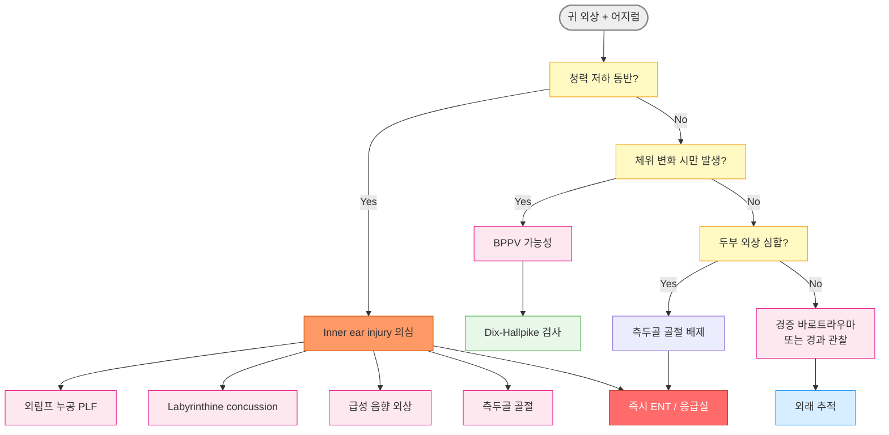
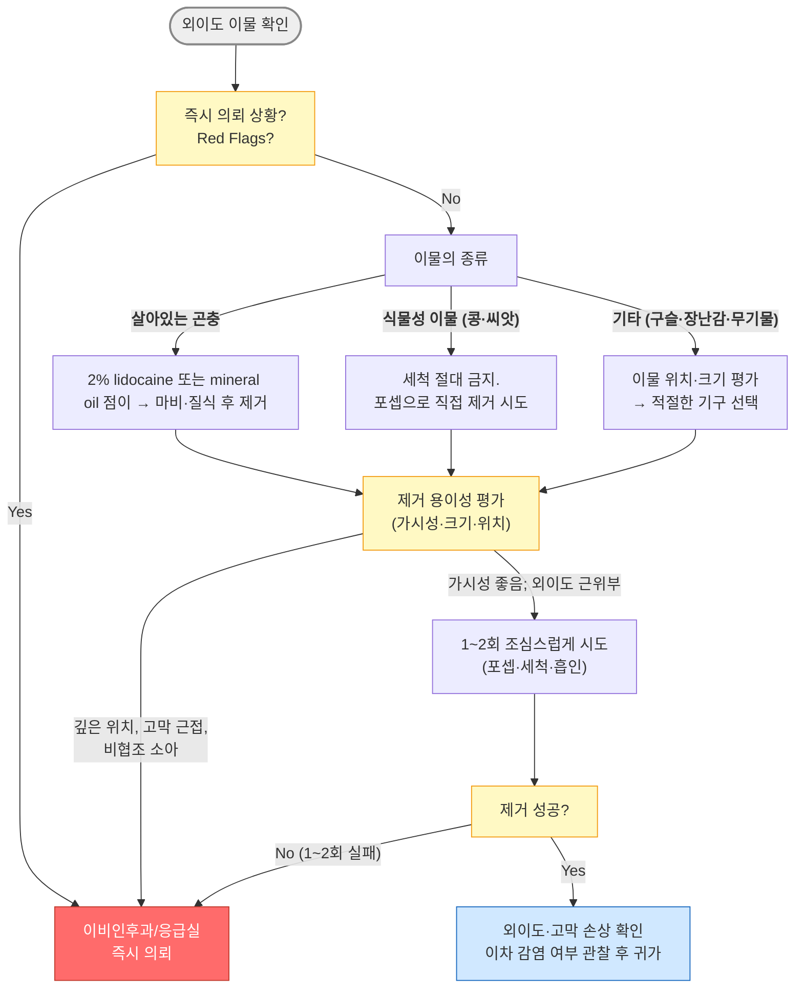
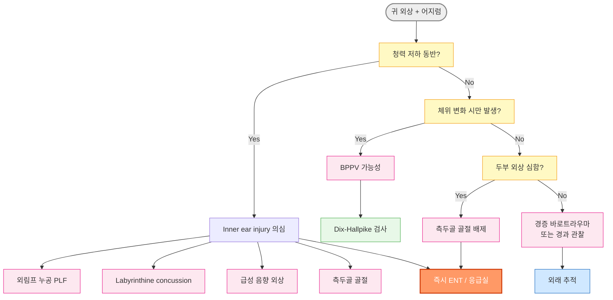

# 귀 손상 Ear Injury

***

### <mark style="color:orange;">귀 손상 처치 - 절대 하면 안 되는 것</mark>

<table><thead><tr><th width="339.5555419921875">금지 행위</th><th>이유</th></tr></thead><tbody><tr><td>원판(단추형) 배터리에 세척(irrigation) 시행</td><td>습기가 전기 화학 반응을 가속시켜 조직 괴사 급속 진행</td></tr><tr><td>고막 천공에 aminoglycoside 점이제 사용</td><td>내이 직접 노출 → 비가역적 감각신경성 난청</td></tr><tr><td>이물 제거 3회 이상 반복 시도</td><td>외이도 부종 악화 → 이후 제거 더 어려워짐</td></tr><tr><td>이개혈종 흡인 후 bolster 고정 생략</td><td>dead space 잔존 → 높은 재발률 → cauliflower ear</td></tr><tr><td>바로 트라우마 시 forceful Valsalva 반복</td><td>중이 과압 → 외림프 누공·고막 천공 위험</td></tr></tbody></table>

### <mark style="color:orange;">폭행·사고 관련 의심 시  기록</mark>

* 혈종의 범위, 주변 피부 손상, 혈흔 상태 등 초진 소견을 상세히 기록하고 필요 시 사진 촬영 보관 (법적 분쟁 대비)
* 다음 상황에서는 초진 시 아래 항목을 반드시 의무 기록에 기재하고 가능하면 사진 촬영·보관 (법적 분쟁 대비 초진 기록)
  * 폭행·가정 폭력 의심 : 혈종 위치·범위, 주변 피부 손상, 혈흔 상태, 내원 경위 및 설명의 일치성
  * 아동 이물 : 이물의 종류·위치, 보호자 진술, 반대쪽 귀·코 동반 이물 여부
  * 직업성 소음성 난청 (NIHL) : 작업 환경·노출 기간·보호구 사용 여부, 기저 청력 검사 결과
  * 단추형 배터리 손상 : 발견 시각, 배터리 종류·크기, 응급실 이송 시각, 조직 손상
  * 다이빙·잠수 사고 : 잠수 깊이·시간, 상승 속도, 감압 절차 준수 여부, 동반 증상 발생 시각
  * 고막 천공 (외상·폭행) : 천공의 위치(사분면: 전상/전하/후상/후하) 및 크기(고막 전체 면적 대비 % 또는 사분면 기술); 혈흔 유무; 이소골 이환 의심 여부
  * 모든 귀 외상 (청력 평가) : 초진 시 음차 검사(Weber/Rinne) 결과 반드시 기록 - 영상 검사·PTA 시행 전이라도 전음성/감각신경성 구별의 법적 근거가 됨

### <mark style="color:orange;">귀 응급 상황 골든타임</mark>&#x20;

<table><thead><tr><th width="174">상황</th><th width="115">골든타임</th><th width="166">지연 시 결과</th><th width="211">핵심 주의</th></tr></thead><tbody><tr><td><strong>원판(단추형) 배터리</strong></td><td><strong>1시간 이내</strong></td><td>액화 괴사·조직 천공</td><td>절대 세척 금지, 즉시 응급실</td></tr><tr><td><strong>이개혈종</strong></td><td><strong>24시간 이내</strong></td><td>연골 섬유화 → cauliflower ear</td><td>흡인 후 반드시 압박 고정</td></tr><tr><td><strong>폭발음·급성 음향 외상</strong></td><td><strong>48시간 이내</strong></td><td>청력 회복 불가 (스테로이드 창 마감)</td><td>소음 환경 즉시 이탈</td></tr><tr><td><strong>외상성 고막 천공</strong></td><td><strong>24시간 이내</strong></td><td>2차 세균 감염·중이염</td><td>건조 유지, 귀 후비기 금지</td></tr></tbody></table>

***

### <mark style="color:orange;">어지럼증 동반 귀 외상 응급 감별</mark>

1. 소리가 갑자기 안 들립니까?
2. 귀에서 피가 났습니까?
3. 얼굴 한쪽이 마비된 느낌이 있습니까?
4. 코를 풀거나 힘줄 때 어지럼이 더 심해집니까?
5. 머리를 특정 방향으로 돌릴 때만 빙글 돕니까?

| 진단                          | 대표 병력                           | 핵심 증상              | 청력 변화             | 특징적 단서                                  | 응급도        |
| --------------------------- | ------------------------------- | ------------------ | ----------------- | --------------------------------------- | ---------- |
| **외림프 누공 (PLF)**            | 다이빙, 바로트라우마, blast, slap injury | vertigo + 오심 + 불균형 | 있음 (SNHL 흔함)      | Valsalva·압력 시 악화                        | 즉시 의뢰      |
| **Labyrinthine concussion** | 둔기 두부 외상, 폭행, 낙상                | dizziness + 불균형    | 있음 (SNHL 가능)      | TM 정상 가능                                | 즉시 의뢰      |
| **측두골 골절**                  | 주요 두부 외상                        | vertigo + 출혈       | 흔함                | facial palsy, Battle sign, hemotympanum | 즉시 의뢰      |
| **외상성 고막 천공 (단순)**          | slap injury, 면봉                 | 일시적 어지럼 가능         | 경미한 conductive HL | 통증 → 출혈                                 | 외래 가능      |
| **귀 압력 손상 (mild)**          | 비행 하강, 다이빙                      | 이충만감 + 경미한 어지럼     | 경미                | popping sensation                       | 경과 관찰      |
| **급성 음향 외상**                | 폭발음, 사격                         | 이명 + 어지럼           | 있음                | 이경 검사 정상 가능                             | 조기 steroid |
| **외상 후 BPPV**               | 두부 외상 후 수일                      | 체위 변화 시 회전성 어지럼    | 없음                | Dix-Hallpike 양성                         | 외래 가능      |
| **CSF leak**                | 두개골 외상                          | 어지럼 + 맑은 이루        | 다양                | halo sign 양성                            | 즉시 의뢰      |

***



<p align="center"><strong>어지럼증 동반 귀 외상 감별 알고리듬</strong></p>

***

## ■ 귓바퀴 외상 Auricle Trauma

## <mark style="color:green;">이개혈종 Otohematoma</mark>

* 귓바퀴 연골막과 연골 사이에 혈액이 고인 상태; 둔상·마찰에 의해 발생
* 스포츠(권투·레슬링·유도·럭비) 또는 귀 외상 후 흔함
* 합병증 : 치료하지 않으면 섬유화·연골 괴사 → 영구적 변형(cauliflower ear) 발생

### <mark style="color:$danger;">🚩 Red Flags!</mark>

<mark style="color:$danger;">**즉각 의뢰**</mark>

* 혈종 흡인 후 재발이 반복되는 경우 (연골 손상 또는 혈관 이상 의심)
* 연골 괴사·감염(연골막염) 징후 : 극심한 통증, 발열, 귀 전체 발적·부종·열감

<mark style="color:$warning;">**당일 또는 조기 재평가**</mark>

* 혈종이 크거나(직경 >1 cm) 딱딱하게 굳기 시작한 경우 → 절개 배농 고려
* 흡인 후 24\~48시간 내 재발한 경우 → 압박 고정 드레싱 재시행 또는 절개 배농

<mark style="color:$info;">**외래 추적**</mark>

* 흡인·압박 후 48\~72시간 내 추적 확인 (재발 여부)
* 스포츠 복귀 시 귓바퀴 보호대(headgear) 착용 권고

### <mark style="background-color:$warning;">Management</mark>

* 단순 흡인만으로는 재발률이 90\~100%에 달함. 흡인 후 반드시 bolster 드레싱 또는 관통 봉합으로 연골-연골막을 밀착시켜 dead space를 제거하는 것이 cauliflower ear 예방의 핵심임

**단계별 치료 절차**

1. 흡인 : 18\~20G 주사기로 혈종 내용물 완전 흡인; 발생 후 가능한 한 빨리 시행할수록 예후 양호
2. 압박 고정 : 흡인 후 즉시 볼스터 드레싱 또는 관통 봉합(through-and-through mattress suture)으로 연골-연골막 밀착; 거즈 또는 dental roll을 귀 앞뒤로 대고 봉합하는 bolster 방식이 가장 안정적
3. 압박 유지 : 연골막과 연골이 완전히 유착될 때까지 7\~10일간 유지 - 조기 제거 시 재발 흔함; 압박 불충분 시 재발률 매우 높음
4. 재평가 : 48\~72시간 후 재발 여부 확인; 재발 또는 혈종이 크고 굳기 시작한 경우 → 절개 배농으로 전환

**항생제**

* 감염 징후 없으면 불필요; 절개 배농 후 연골 노출이 있거나 면역저하 환자에서는 예방적 항생제를 고려할 수 있으나 routine 투여는 권고되지 않음; anti-pseudomonal 제제 선택에 대해서도 합의되지 않음 (☞ [외이염](047_-otitis-externa.md))

**흡인 vs 절개 배농**

* 발생 48시간 이내이고 혈종이 작고 연성(fluctuant)이면 흡인(needle aspiration)을 시도할 수 있으나, 다음 중 하나라도 해당되면 절개 배농(incision and drainage)이 더 적절함
  * 발생 후 48시간 이상 경과, 응고되어 단단한 혈종, 혈종이 크거나 재발성

## <mark style="color:green;">동상 Frostbite</mark>

(☞ [냉 손상](../230_/208_-cold-injury.md#frostbite))

***

## ■ 귀 이물 Foreign Body in the Ear

### <mark style="color:$danger;">🚩 Red Flags!</mark>

<mark style="color:$danger;">**즉각 의뢰**</mark> - <mark style="color:$danger;">즉시 제거 필요</mark>

* 원판(단추형) 배터리
* 바늘, 깨진 유리 조각 등 날카로운 물질 (제거 시도 중 이차 손상 위험)
* 구역·구토, 안진, 심한 어지럼, 심한 통증, 외이도 부종, 청력 급감 - 외이도·중이·내이 손상 의심

<mark style="color:$warning;">**당일 또는 조기 재평가·의뢰**</mark>

* 1\~2회 제거 시도 실패 또는 제거 시도 실패 전력 - 반복 시도는 이차 손상·부종 악화
* 이물 제거 후 고막·외이도 손상이 확인되는 경우
* 비협조 소아

<mark style="color:$info;">**외래 추적**</mark>

* 이물 제거 후 외이도 손상·이차 감염 여부 확인
* 소아에서 반대쪽 귀·코의 이물 동반 여부 반드시 확인

## <mark style="color:green;">Pinna 이물</mark>

* 주요 원인 : 귀걸이 부속의 매몰
* 증상 : 발적, 통증, 부종, 고름
* 검사 : 필요시 X선
* 합병증 : 연골 감염, 흉터

### <mark style="background-color:$warning;">Management</mark>

* 제거 (필요시 국소 마취하에 시술)
* 감염 동반 시 항생제 투여

## <mark style="color:green;">외이도 이물</mark>

* 주요 원인 : 구슬, 작은 돌, 휴지, 작은 장난감, 음식(팝콘 알갱이), 곤충
* 반대쪽 귀 및 코의 이물 여부 함께 확인
* 제거 후 고막·외이도 손상 여부 확인
* 즉시 제거 필요 이물 : 원판 배터리(<4시간), 살아 있는 곤충, 귀 조직에 박힌 이물

### <mark style="background-color:$warning;">Management</mark>

* 작고 보이는 경우 : 포셉으로 제거 (☞ [보험기준](https://www.hira.or.kr/rc/insu/insuadtcrtr/InsuAdtCrtrPopup.do?mtgHmeDd=20190628\&sno=3\&mtgMtrRegSno=0007))
* 작고 고막 손상이 없는 경우 : 세척
* 접착제(cyanoacrylate adhesive) : 외이도에 접촉하지 않도록 주의하면서 이물과 접촉 60초 유지 후 제거
* 점이 항생제 : 외이도 손상 시 외이염에 사용되는 점이액 적용 (☞ [외이염](047_-otitis-externa.md))
* 1\~2회 시도 후 실패하면 추가 시도를 중단하고 의뢰 - 반복 시도는 외이도 부종을 악화시켜 이후 제거를 더 어렵게 만듦

**원판(단추형) 배터리**

* 전기 분해로 수산화칼륨(KOH) 등 강알칼리성 물질이 누출되어 액화 괴사를 일으키며, 수 시간 내 심각한 조직 괴사·천공 발생 가능
* 특히 lithium coin battery (CR2032 등, ≥20㎜, 3V)는 전류가 강하여 조직 손상이 수십 분 내에도 발생할 수 있어 가장 위험
* 절대 세척(irrigation) 금지 - 습기가 닿으면 전기 화학 반응이 가속화됨
* 증상이 없어도 즉각 대응 - 관찰·대기 금지
* 발견 즉시 금식(NPO) 상태로 응급실 이송 (소아에서 수면 마취 하 제거가 필요한 경우 대비); 가급적 1시간 이내 제거

**살아 있는 곤충**&#x20;

* 2% lidocaine 점이 또는 mineral oil로 마비·질식시킨 후 제거
  * lidocaine 점이는 mineral oil보다 빠르게 곤충을 마비시키고 통증 완화에도 효과적
  * 고막 천공 의심 시 mineral oil 우선 사용; lidocaine 및 alcohol은 사용 금기 (lidocaine·alcohol 모두 이독성 및 심한 통증 위험)
  * lidocaine이나mineral oil을 즉시 구할 수 없는 경우, 알코올 적신 솜을 외이도 입구에 위치하여 벌레를 마취하는 방법이 시도되기도 하나 근거는 확립되지 않음

#### <mark style="color:$primary;">세척</mark>

* 대상 : 작은 무기물, 곤충
* 금기 : 고막 천공, 식물 소재 이물(콩 등 - 수분 흡수로 팽창), 원판 배터리
* 방법 : 앉아서 고개를 30\~90° 뒤로 젖히거나 이환된 귀를 위쪽으로 향하게 누움 \
  → 살아 있는 곤충은 죽임 \
  → 체온 수준의 멸균수(생리식염수)를 14\~16G  플라스틱 카테터/20\~50 ㎖ 주사기에 담고 팁을 외이도 안쪽 1\~1.5 ㎝에 위치시키고 외이도 후상부를 향하여 분사 \
  → 이물이 제거될 때까지 반복 → 입구로 나온 이물을 집어냄

### <mark style="color:orange;">외이도 이물 - 관리 알고리듬</mark>



<p align="center"><strong>외이도 이물 처치 알고리듬</strong></p>

***

## <mark style="color:purple;">처방례 — Pinna 이물</mark>

> **처방례 1. Pinna 이물 — 2차 감염 동반**
>
> ```
> 에스로반 연고 10 g/tube   소량   bid   (국소 도포)
> 팔렉신 500 ㎎/C           3C    #3    × 5~7d
> ```
>
> _✽이물 제거 후 국소 mupirocin 연고 도포. 연골막염 진행 시(심한 통증·발열·전체 귀 발적) 즉시 의뢰 — 연골막염은 fluoroquinolone 경구제 또는 IV 항생제 필요_

***

### <mark style="color:$success;">핵심 복약 지도 — 귀 이물</mark>

> **이물 제거 후 귀 관리**
>
> * 이물 제거 후 외이도 손상이 있는 경우 점이용 항생제를 처방받을 수 있습니다. 약병을 체온으로 데운 후 처방된 방울 수를 점이하고 5\~10분간 자세를 유지하십시오.
> * 이물 제거 후 1\~2일간은 귀에 물이 들어가지 않도록 주의하십시오.
> * 제거 후에도 통증·분비물·청력 감소가 지속되면 재내원하십시오.

***

### <mark style="color:blue;">환자 안내서 — 귀 이물</mark>


**귀에 이물이 들어갔을 때**

귀에 이물(벌레, 구슬, 작은 장난감, 씨앗 등)이 들어가면 당황스럽지만, 당황하여 서두르다 더 심각한 손상이 생기는 경우가 많습니다. 가장 중요한 원칙은 '섣불리 건드리지 말고 즉시 병원에 오는 것'입니다.


#### <mark style="color:$primary;">🚫 귀에 이물이 들어갔을 때 절대 하지 말아야 할 것</mark>

* **면봉·핀셋·머리핀으로 밀거나 파내지 마십시오.** 이물이 더 깊이 들어가거나 고막이 뚫릴 수 있습니다.
* **귀를 손가락으로 후비지 마십시오.** 외이도 점막에 상처가 생겨 감염 위험이 높아집니다.
* **콩·씨앗·나무 조각 등 식물성 이물에 물을 넣지 마십시오.** 물을 흡수하여 크게 부풀어 오르면 제거가 훨씬 어려워집니다.
* **원판(단추형) 배터리가 들어간 경우** **즉시 응급실**로 가십시오. 물기가 닿으면 반응이 빨라지므로 **절대 세척하지 말고**, 1시간 이내에 제거해야 귀 조직 괴사를 막을 수 있습니다.
* **1\~2회 이상 스스로 제거를 시도하지 마십시오.** 반복 시도는 외이도를 붓게 만들어 병원에서의 제거를 더 어렵게 합니다.

#### <mark style="color:$primary;">이럴 때는 즉시 병원(응급실)을 방문하세요</mark>

* 원판(단추형) 배터리가 들어간 경우 — **즉시 응급실**
* 귀에서 피가 나거나 극심한 통증이 있을 때
* 어지럼증, 구역·구토가 동반될 때
* 살아있는 벌레가 들어가 심한 통증·소음이 느껴질 때 (억지로 빼려 하지 말고 즉시 내원)

***

## ■ 외상성 고막 천공 Traumatic TM Perforation

### <mark style="color:$danger;">🚩 Red Flags!</mark>

<mark style="color:$danger;">**즉각 의뢰**</mark>

* 중등도 이상(≥40 ㏈)의 청력 손실 또는 감각 신경성 난청 소견
* 48시간 이상 지속되는 어지럼·안진 (내이 손상 의심)
* CSF 유출 의심 (두부 외상 동반 시)
* 가장자리(marginal) 손상, 이소골 이환, cholesteatoma 동반

<mark style="color:$warning;">**당일 또는 조기 재평가·의뢰**</mark>

* 지속되는 이명 (이소골 손상 또는 내이 손상 가능성)
* 고막 천공이 ≥6주 경과 후에도 자연 치유되지 않는 경우
* 이루 발생 - 2차 세균 감염 시작 의심

<mark style="color:$info;">**외래 추적**</mark>

* 4\~6주 후 고막 회복 확인
* 회복되지 않으면 고막성형술 의뢰 고려

## <mark style="color:green;">증상 및 경과</mark>

* 증상 : 급성 통증(빠르게 감소), 혈성 분비물, 이명, 경증 전음성 난청
* 경과 : 충격에 의해 찢어진 경우 합병증 없으면 수일\~수 주 내 자연 치유; central 손상이 가장자리 손상보다 자연 치유율 높음
* 자연 치유율 저하 인자 : 가장자리 손상, 후상부 손상(이소골 이환 가능성), 이물에 의한 손상
* 면봉·귀이개 등 이물에 의한 직접 찔림 손상은 기압 손상(폭발음·귀 때리기)에 비해 이차 감염 및 영구 천공 위험이 높음 - 오염된 이물이 외이도 세균을 중이로 직접 유입시킬 수 있음

## <mark style="color:green;">검사</mark>

* 감각 신경성 난청 동반 여부 확인 필수

### <mark style="color:orange;">Tuning Fork를 이용한 청력 감별</mark>

<table><thead><tr><th width="166"></th><th width="200">Weber lateralization</th><th width="220">Rinne test</th></tr></thead><tbody><tr><td><strong>전음성 난청</strong></td><td></td><td></td></tr><tr><td>　건측</td><td></td><td>정상 (AC>BC)</td></tr><tr><td>　환측</td><td>병변 측(환측)으로 편위</td><td>비정상 (BC>AC)</td></tr><tr><td><strong>감각 신경성 난청</strong></td><td></td><td></td></tr><tr><td>　건측</td><td>건측(정상 측)으로 편위</td><td>정상 (AC>BC)</td></tr><tr><td>　환측</td><td></td><td>정상 (AC>BC)</td></tr></tbody></table>

_AC=air conduction, BC=bone conduction_

_<mark style="color:$info;">✽감각 신경성 난청이 확인되면 내이 손상을 의미하므로 즉시 이비인후과 의뢰</mark>_

***

## <mark style="background-color:$warning;">Management - 외상성 고막 천공</mark>

### <mark style="color:orange;">치료 원칙</mark>

* 건조 상태 유지 : 물이 들어가지 않도록 - 수영 금지, 세발·샤워 시 귀마개 또는 바셀린 솜 사용
* 혈병 보존 : 외이도 내 blood clot을 떼거나 씻어내지 않는다 (자연 치유 지지대 역할)
* 면봉 금지 : 외이도 조작은 2차 감염 및 추가 손상 위험
* 감염 징후가 없는 경우 약물 치료는 불필요, 감염 징후가 있는 경우 이에 따른 관리/치료
* 4\~6주 추적 관찰

**금지 사항**

* 수영·잠수 (고막 완전 회복 시까지)
* 귀 후비기·면봉 사용
* 코 세게 풀기 (한 번에 양쪽 동시); Valsalva 조작 금지 - 고막 치유 방해 및 중이 감염 유도 위험
* 귀에 물 넣기 (세척·irrigation 금지)
* 외이도 내 흡인(suction) 금지 - 2차 손상 및 청력 악화 위험

**권고 사항**

* 머리 감을 때 바셀린 솜 또는 귀마개로 귀 막기
* 감기·상기도감염 예방 (이관을 통한 2차 감염 차단)
* 외이도 내 혈병(혈딱지) 그대로 보존 - 자연 치유 지지대 역할

### <mark style="color:orange;">경구 항생제</mark>

* 합병증 또는 동반 질환(예: 중이염)이 없는 경우 불필요
* 2차 세균 감염 징후(발열, 화농성 이루) 발생 시 항생제 투여

### <mark style="color:orange;">국소 항생제 (점이용제)</mark>

* 화농성 이루 등 2차 세균 감염 의심 시 고려
* 습윤 환경 유지로 치유 촉진 효과 기대 - 꼭 필요한 경우 외에는 사용하지 않음
* 고막 천공 시 점이용제 원칙
  * aminoglycoside 계열(gentamicin, tobramycin, neomycin)은 천공을 통해 내이로 유입될 경우 감각신경성 난청을 유발하므로 절대 금기
  * 고막 천공 상태에서는 이독성이 없는 fluoroquinolone 점이제를 우선 선택함
* ofloxacin 0.3% : 5 drops bid × 7\~10d <mark style="color:blue;">\[타리비드]</mark>
* ciprofloxacin 0.3% : 5 drops bid × 7\~10d <mark style="color:blue;">\[시프레닛]</mark>
* 점이 후 10분간 이욕 유지 (☞ [외이염](047_-otitis-externa.md#undefined-7))

### <mark style="color:orange;">고막성형술 (Tympanoplasty)</mark>

* 외상성 고막 천공의 80% 이상은 자연 치유됨
* 발생 후 수 주\~3개월이 경과하여도 자연 치유되지 않으면 이비인후과 의뢰
* 종이 패치법(paper patch myringoplasty), 지방 이식 고막 성형술 : 자연 치유 촉진을 위해 조기 시행 가능한 선택적 옵션, 필요 시 조기 의뢰
* 폭행·사고 관련 의심 시 천공의 형태(방사형·불규칙형), 혈흔 범위, 이물 유무 등 초진 소견 상세 기록 및 사진 보관 (☞ Documentation pearls)

***

### <mark style="color:red;">질병코드 - 외상성 고막 천공</mark>

H72 고막의 천공

***

## <mark style="color:purple;">처방례 - 외상성 고막 천공</mark>

> **처방례 1. 외상성 고막 천공 — 이루 없음 (단순 관찰)**
>
> ```
> (약물 처방 없음 — 건조 유지 및 경과 관찰)
> ```
>
> _✽혈병 보존, 귀에 물 들어가지 않도록 지도. 4\~6주 후 고막 회복 확인. 수영·잠수 금지_

> **처방례 2. 외상성 고막 천공 — 화농성 이루 동반 (2차 감염)**
>
> ```
> 타리비드 이용액 5 ㎖/병   5 drops   bid   이욕  × 7~10d
> 타이레놀 이알 650 ㎎/T     1T         q8h        × 3d (통증 시)
> ```
>
> _✽고막 천공 시 aminoglycoside(겐타마이신, 토브라마이신) 절대 금기 — fluoroquinolone만 사용. 점이 전 약병을 따뜻하게 데울 것. 발열·통증 악화 시 재내원_

***

### <mark style="color:$success;">핵심 복약 지도 — 외상성 고막 천공</mark>

> **귀 점이약 올바른 사용법**
>
> * **약병을 먼저 따뜻하게 하십시오.** 겨드랑이에 1분, 또는 바지 앞주머니에 5분 넣어두면 체온에 가깝게 데워집니다. 차가운 약이 들어가면 어지럼증이 생길 수 있습니다.
> * 아픈 귀를 위로 향하게 눕거나 머리를 기울이고 처방된 방울 수를 점이하십시오.
> * 귓바퀴를 부드럽게 당겨 약이 귀 안 깊이 들어가도록 하고, **10분간 그 자세를 유지**한 후 일어나 흘러나오는 약액을 닦습니다.
> * **면봉으로 귀 안을 닦지 마십시오.**

> **귀를 건조하게 유지하는 방법**
>
> * 고막이 아물 때까지(보통 4\~6주) **절대 물이 들어가지 않도록** 하십시오.
> * 세발·샤워 시 귀마개를 사용하거나 바셀린(petroleum jelly)을 묻힌 솜으로 귀를 막으십시오.
> * **수영과 잠수는 고막이 완전히 회복될 때까지 금지합니다.**
> * 귀 안에 고인 피딱지(혈병)를 면봉이나 손가락으로 떼지 마십시오 — 자연 치유를 돕는 중요한 역할을 합니다.

> **언제 즉시 병원을 방문해야 하나요?**
>
> * 귀에서 고름 같은 분비물이 나오거나 통증·발열이 생기는 경우
> * 어지럼증이 48시간 이상 지속되는 경우
> * 소리가 갑자기 잘 안 들리거나 이명이 심해지는 경우
> * 4\~6주가 지나도 귀가 완전히 회복되지 않는 느낌이 드는 경우

***

### <mark style="color:blue;">환자 안내서 — 외상성 고막 천공</mark>


**고막에 구멍이 생겼어요**

귀를 세게 맞거나, 면봉을 깊이 넣거나, 갑작스러운 압력 변화(귀 때리기, 폭발음) 등으로 고막(鼓膜)이 찢어진 상태입니다. 처음에는 통증과 출혈이 있지만 빠르게 줄어듭니다. 대부분 4\~8주 안에 저절로 아뭅니다. 가장 중요한 것은 **귀를 건조하게 유지**하는 것입니다.


#### <mark style="color:$primary;">어떤 증상이 생기나요?</mark>

* 귀 통증 (처음에 심하다가 빠르게 감소)
* 귀에서 약간의 피 또는 분비물
* 귀가 먹먹하거나 소리가 울려 들림
* 이명 (삐 소리, 윙윙거리는 소리)

#### <mark style="color:$primary;">치료 중 꼭 지켜야 할 것</mark>

* **귀에 물이 절대 들어가면 안 됩니다.** 고막 구멍으로 세균이 들어가 중이염이 생길 수 있습니다.
  * 세발·샤워 시 귀마개 또는 바셀린 솜 사용
  * 수영·잠수는 고막이 완전히 나을 때까지 금지
* **면봉으로 귀 안을 후비지 마십시오.** 귀 안에 피딱지가 있어도 그대로 두십시오 — 고막이 붙는 것을 도와줍니다.
* **코를 세게 풀지 마십시오.** 한 번에 한쪽씩 부드럽게 푸십시오.
* 비행기 탑승은 가능하면 회복 후까지 미루십시오. 불가피하면 껌을 씹거나 하품을 자주 하십시오.

#### <mark style="color:$primary;">경과는 어떻게 되나요?</mark>

* 대부분 **4\~8주 안에 저절로** 아뭅니다.
* 고막이 다 나으면 청력도 거의 완전히 회복됩니다.
* 3개월이 지나도 낫지 않으면 수술(고막성형술)로 복원할 수 있습니다.

#### <mark style="color:$primary;">이럴 때는 즉시 병원을 방문하세요</mark>

* 귀에서 고름이 나오거나 통증·발열이 생길 때
* 어지럼증이 이틀 이상 지속될 때
* 소리가 갑자기 크게 안 들릴 때

***

## ■ 귀의 압력 손상 Ear Barotrauma

## <mark style="color:green;">일반 사항</mark>

* 원인 : 비행(하강 시), 다이빙, 갑작스러운 강한 소음, 폭발
* 기전 : 이관(Eustachian tube) 기능 부전으로 중이 압력 균형 실패 → 고막·중이 손상
* 증상 : 귀의 압박감·통증, 청력 손실, 이명, 어지럼, 출혈
* 경과 : 대부분 자연 치유
* 강한 압력에 노출 시 Audiometry 시행

### <mark style="color:$danger;">🚩 Red Flags!</mark>

<mark style="color:$danger;">**즉각 의뢰**</mark>

* 감각 신경성 난청 또는 중등도(≥40 ㏈) 이상 청력 손실 → 외림프 누공 의심
* 지속적인 어지럼·안진 → 내이 손상 또는 외림프 누공 의심
* 다이빙·중이 압력 손상 후 청력 손실 + 어지럼 동반 → 외림프 누공(perilymphatic fistula) 의심

<mark style="color:$warning;">**당일 또는 조기 재평가**</mark>

* 증상이 48\~72시간 이상 지속되거나 악화
* 고막 천공 발생 (☞ [외상성 고막 천공](049_-ear-injury.md#외상성-고막-천공-traumatic-tm-perforation))

<mark style="color:$info;">**외래 추적**</mark>

* 반복 발생 → 알레르기비염, 만성 부비동염 등원인 질환 치료
* 잦은 비행이 불가피한 경우 → ventilating tube 삽입 고려

***

## <mark style="background-color:$warning;">Management - 귀 압력 손상</mark>

* 어지럼증, 난청이 동반되지 않는 압력 손상 시 진통제, Autoinflation, Decongestant 투여 → 수일 내 호전 여부 확인
* 어지럼증 또는 난청 동반 시 의뢰

### <mark style="color:orange;">예방</mark>

* 비행기 하강 중 : 자주 하품, 삼킴 동작(껌·사탕·물 마심), autoinflation (Valsalva maneuver)
* URI·비염 활성기에는 다이빙·잠수 금지
* 잠수 시 : 천천히 하강하며 귀 압력 균형 확인

### <mark style="color:orange;">약물 치료</mark>

**비내 울혈 제거제** (이관 개방 유도)

* 압력 발생 30분 전 비공당 1회 분무; ≤4일/월 사용 제한 (반동성 부종 주의)
* xylometazoline <mark style="color:blue;">\[오트리빈]</mark>
* oxymetazoline <mark style="color:blue;">\[레스피비엔]</mark>

**경구 울혈 제거제**

* 압력 발생 1\~수 시간 전 복용
* pseudoephedrine 60 ㎎ <mark style="color:blue;">\[슈다페드]</mark>
* 지속되는 경우 pseudoephedrine 60 ㎎ prn (단기간 사용, 최대 3\~5일) + autoinflation 병행


**pseudoephedrine 투여 금기 및 주의**

다음에 해당하는 환자에서는 투여를 피하거나 각별히 주의:\
• 조절되지 않는 고혈압 (uncontrolled HTN)\
• 관상동맥질환 (CAD) / 부정맥\
• 전립선비대증 (BPH)\
• 폐쇄각 녹내장 (closed-angle glaucoma)\
• 갑상선기능항진증 (hyperthyroidism)


**진통제**

* acetaminophen : 650\~1,000 ㎎ q6h <mark style="color:blue;">\[타이레놀]</mark>
* ibuprofen : 400 ㎎ q6h <mark style="color:blue;">\[부루펜]</mark>

### <mark style="color:orange;">수술</mark>

* Myringotomy : 심한 이통, 청력 저하가 지속되는 경우 고려
* Ventilating tube 삽입 : 잦은 비행이 불가피한 경우 반복 발생 시 고려

***

### <mark style="color:red;">질병코드 - 귀 압력 손상</mark>

T70.0 이염성 압력 손상

***

## <mark style="color:purple;">처방례 - 귀 압력 손상</mark>

> **처방례 1. 비행기 탑승 전 예방 (URI 또는 비염 동반)**
>
> ```
> 오트리빈 0.1% 비강 스프레이   1 puff/비공   탑승 30분 전
> 슈다페드 60 ㎎/T              1T            탑승 1시간 전
> ```
>
> _✽비내 울혈 제거제는 반동성 비충혈 예방을 위해 4일/월 이내로 사용. URI 심한 경우 탑승 연기 권고_

> **처방례 2. 다이빙·비행 후 이통·이충만감 지속**
>
> ```
> 슈다페드 60 ㎎/T   1T   qid   × 3~5d
> 부루펜 200 ㎎/T    6T   #3    × 3~5d
> ```
>
> _✽autoinflation(Valsalva maneuver) 병행 지도. 어지럼·난청 동반 시 즉시 재내원 (외림프 누공 배제 필요)_

***

### <mark style="color:$success;">핵심 복약 지도 — 귀 압력 손상</mark>

> **비내 스프레이 올바른 사용법**
>
> * 비내 울혈 제거제(오트리빈 등)는 **비행기 탑승 30분 전**에 각 비공에 1회씩 분무하십시오.
> * 한 달에 4일 이상 사용하지 마십시오. 오래 사용하면 오히려 코막힘이 더 심해질 수 있습니다.
> * 경구 슈다페드는 탑승 1시간 전에 복용하면 효과가 좋습니다.

> **Valsalva maneuver (이압 균형 조작법)**
>
> * 코를 손가락으로 막고, 입을 다문 채로 숨을 내쉬듯 힘을 주십시오 (귀가 뻥 뚫리는 느낌).
> * 너무 세게 힘을 주면 오히려 고막 손상이 생길 수 있으니 부드럽게 반복하십시오.
> * 비행기 하강 시 껌을 씹거나 물을 삼키는 것도 같은 효과가 있습니다.

> **언제 즉시 병원을 방문해야 하나요?**
>
> * 어지럼증이 이틀 이상 지속되거나 걷기 어려운 경우
> * 소리가 갑자기 잘 안 들리거나 이명이 심해지는 경우
> * 귀에서 출혈이나 분비물이 나오는 경우

***

### <mark style="color:blue;">환자 안내서 — 귀 압력 손상</mark>


**비행기나 다이빙 후 귀가 아파요**

귀와 코를 연결하는 이관(耳管)이 갑작스러운 기압 변화에 적응하지 못할 때 발생합니다. 비행기 착륙 시 또는 잠수 후 하강할 때 흔히 생깁니다. 대부분 저절로 회복되지만, 어지럼증이나 청력 저하가 동반되면 병원을 방문해야 합니다.


#### <mark style="color:$primary;">어떤 증상이 생기나요?</mark>

* 귀가 먹먹하거나 꽉 막힌 느낌
* 귀 통증
* 소리가 울려 들리거나 잘 안 들림
* 이명

#### <mark style="color:$primary;">스스로 할 수 있는 방법</mark>

* **하품하기, 삼킴 동작** : 껌을 씹거나 물을 마시면 이관이 열립니다.
* **Valsalva 조작** : 코를 막고 입을 다문 채로 살살 힘을 주면 귀가 뚫립니다. 단, 너무 세게 하지 마십시오.
* **비행기 탑승 전** 코막힘이 심하면 비강 스프레이(오트리빈 등)를 탑승 30분 전에 뿌리면 도움이 됩니다.

#### <mark style="color:$primary;">이럴 때는 즉시 병원을 방문하세요</mark>

* 어지럼증이 이틀 이상 지속될 때
* 소리가 갑자기 크게 안 들릴 때
* 귀에서 출혈이나 분비물이 나올 때

***

## ■ 소음 외상 Acoustic Trauma

## <mark style="color:green;">일반 사항</mark>

* 강한 소리에 노출되어 발생하는 청력 손상 (소음 유발성 청력 손실, NIHL)
* 85\~140 ㏈(록 콘서트, 공장 소음) : 일시적 청력 감소(특히 4 ㎑ 영역), 이명; 지속 노출 시 영구 손상
* 갑작스러운 >140 ㏈(폭음, 사격) : 짧은 노출에서도 영구 손상 가능
* 1일 허용 최대 평균 노출 수준 : 85 ㏈-8시간 / 88 ㏈-4시간 / 91 ㏈-2시간 / 94 ㏈-60분 / 97 ㏈-30분 / 100 ㏈-15분
  * 소음 노출 3 ㏈ 증가마다 허용 노출 시간이 절반으로 감소 (OSHA 기준)
* 강한 소음에 노출 시 Audiometry 시행

### <mark style="color:$danger;">🚩 Red Flags!</mark>

<mark style="color:$danger;">**즉각 의뢰**</mark> <mark style="color:$danger;">- 급성 음향 외상</mark>

* 갑작스러운 폭발음·사격 후 즉각적인 중등도 이상 청력 손실
* 감각 신경성 난청 + 지속되는 어지럼 → 내이 손상 의심
* 이명이 72시간 이상 지속되면서 청력 저하 동반

<mark style="color:$warning;">**당일 또는 조기 재평가**</mark>

* 급성 음향 외상 후 24\~48시간 이내
* 청력 회복 여부 추적 필요

<mark style="color:$info;">**외래 추적**</mark>

* 직업적 소음 노출자 → 정기 청력 검사(산업안전보건법 기준: 소음 작업 시 연 1회)
* 이명 지속 시 의뢰

***

## <mark style="background-color:$warning;">Management - 소음 외상</mark>

* 급성 청력 저하가 없는 경증/일시적 소음 외상은 소음을 회피하면서 관찰

### <mark style="color:orange;">치료</mark>

* 급성 음향 외상 : 발생 후 가능한 한 빨리(이상적으로 24\~48시간 이내) 고용량 steroid 투여 - 치료 창(window)을 놓치지 않는 것이 중요
  * prednisolone 1 ㎎/㎏/d(최대 60 ㎎/d) × 7\~14d <mark style="color:blue;">\[소론도]</mark> → 이후 tapering
  * 고용량 steroid의 급성 NIHL 효과는 입증되어 있으나, 72시간 이후에는 효과가 불확실함
  * 경구 steroid가 불가하거나(당뇨·소화성 궤양 등) 반응이 불충분한 경우, 또는 severe acute acoustic trauma에서는 intratympanic steroid injection을 이비인후과와 협의하여 rescue therapy로 고려할 수 있음
* 가능한 한 조기에 순음청력검사(PTA)를 시행하여 baseline 청력 확보; 직업성 소음 노출자 또는 반복 노출 환자에서 추후 추적 비교를 위해 특히 중요
* PTA 정상이나 소음 속 어음 구별 어려움 호소 시 → 소음 속 어음 분별력(speech-in-noise) 검사 고려 (숨겨진 난청 배제)
* 음량 최소화 : 소음원에서 즉시 벗어나기
* 만성 소음 노출 : 근본적 원인 제거(작업 환경 개선); 청력 보호구 착용

### <mark style="color:orange;">예방</mark>

* 85 ㏈ 이상 환경에서 귀마개·청력 보호구 착용
* 이어폰·헤드폰 : 최대 볼륨의 60% 이하, 60분 사용 후 휴식 (60-60 rule)
* 콘서트·공연 관람 시 귀마개 사용 권고

***

### <mark style="color:red;">질병코드 - 소음 외상</mark>

H83.3 내이의 소음 효과 (소음 유발성 청력 손실)

***

## <mark style="color:purple;">처방례 - 소음 외상</mark>

> **처방례 1. 급성 음향 외상 — 고용량 Steroid (24\~48시간 이내)**
>
> ```
> 소론도 5 ㎎/T   12T   #2   × 5d → 이후 매 2~3일마다 2T씩 감량
> ```
>
> _✽prednisolone 60 ㎎/d로 시작하여 총 10\~14일간 투여 후 tapering. 발생 72시간 이후에는 효과 불확실 — 치료 창을 강조하여 설명. 당뇨·위궤양·고혈압 병력 확인 필수_

> **처방례 2. 급성 음향 외상 — 경증, 일시적 청력 감소**
>
> ```
> (즉시 소음 환경에서 벗어나게 하고 경과 관찰)
> 소론도 5 ㎎/T   8T   #2   × 3~5d (중등도 이상 시 고려)
> ```
>
> _✽경증 일시적 청력 감소(TTS)는 24\~48시간 내 자연 회복 가능. 72시간 이상 지속되면 이비인후과 의뢰_

***

### <mark style="color:$success;">핵심 복약 지도 — 소음 외상</mark>

> **스테로이드(소론도) 복용 안내**
>
> * **처방 기간을 끝까지 복용하십시오.** 스테로이드는 갑자기 중단하면 안 됩니다 — 의사의 지시에 따라 용량을 단계적으로 줄여야 합니다.
> * **식사 직후 복용**하십시오. 공복에 복용하면 속이 쓰릴 수 있습니다.
> * 복용 중 당뇨가 있으신 경우 혈당이 올라갈 수 있으니 혈당 모니터링을 더 자주 하십시오.
> * 복용 중 얼굴이 붓거나, 불면, 기분 변화 등이 생기면 의사에게 알리십시오.

> **귀를 보호하는 방법**
>
> * **이어폰·헤드폰은 최대 볼륨의 60% 이하로, 한 번에 60분 이상 연속 사용하지 마십시오** (60-60 규칙).
> * 콘서트·공연 등 시끄러운 환경에서는 귀마개를 착용하십시오.
> * 공장·건설 현장 등 소음 작업 환경에서는 반드시 청력 보호구를 착용하십시오.

> **언제 즉시 병원을 방문해야 하나요?**
>
> * 소리가 잘 안 들리는 상태가 24시간 이상 지속되는 경우
> * 이명(삐 소리, 윙윙거리는 소리)이 3일 이상 지속되는 경우
> * 어지럼증이 동반되는 경우

***

### <mark style="color:blue;">환자 안내서 — 소음 외상</mark>


**큰 소리에 귀가 손상될 수 있어요**

공연장·공장·폭발음 등 큰 소리에 노출되면 내이(달팽이관)의 청각 세포가 손상됩니다. 일시적인 경우 수 시간\~수 일 내 회복되지만, 반복 노출이나 매우 큰 소음은 영구적인 청력 손실을 일으킬 수 있습니다. **한 번 손상된 청각 세포는 재생되지 않습니다.**


#### <mark style="color:$primary;">어떤 증상이 생기나요?</mark>

* 소리가 먹먹하거나 잘 안 들림 (특히 높은 음역)
* 귀에서 삐 소리 또는 윙윙거리는 소리 (이명)
* 소리가 울려 들리는 느낌

#### <mark style="color:$primary;">치료는 어떻게 하나요?</mark>

* **즉시 소음 환경에서 벗어나는 것**이 가장 중요합니다.
* 증상이 심하거나 지속되면 스테로이드 약물 치료를 빠른 시간 안에 받아야 합니다 — **발생 후 24\~48시간이 치료의 골든 타임**입니다.

#### <mark style="color:$primary;">귀를 지키는 생활 습관</mark>

* 이어폰 볼륨은 최대의 60% 이하로, 60분마다 휴식을 취하십시오.
* 시끄러운 환경에서는 귀마개를 착용하십시오.
* 정기적으로 청력 검사를 받으십시오 (특히 직업적 소음 노출자).


**💡 '정상 청력 검사'를 받았어도 안심하지 마세요**

표준 청력 검사(순음청력검사)가 정상으로 나왔더라도, **시끄러운 환경(회식 자리, 파티, 식당 등)에서 말소리를 알아듣기 어렵거나 대화 내용을 자주 되묻는다면** '숨겨진 난청(청각 시냅스병증, cochlear synaptopathy)'일 수 있습니다. 청각 세포는 정상이나 내이 신경 시냅스가 손상되어 조용한 환경의 청력 검사에서는 정상처럼 보이지만 소음 속 어음 분별력(speech-in-noise discrimination)이 저하됩니다. 이 경우 정밀 청력 검사가 필요하므로 이비인후과에 알리십시오.



**💬 이명(삐 소리)이 생겼다면 — 대부분 일시적입니다**

소음 노출 후 생기는 이명은 약 **90% 이상**에서 48\~72시간 내에 저절로 줄어듭니다. 귀의 신경 세포가 과도한 자극에서 회복되는 과정입니다. 단, 72시간이 지나도 지속되거나 청력 감소가 동반된다면 반드시 진료를 받으십시오.


#### <mark style="color:$primary;">이럴 때는 즉시 병원을 방문하세요</mark>

* 소리가 안 들리는 상태가 하루 이상 지속될 때
* 이명이 3일 이상 지속될 때
* 어지럼증이 동반될 때

***

## <mark style="color:red;">귀 응급상황 골든타임 Quick Reference</mark>

<table><thead><tr><th width="174">상황</th><th width="115">골든타임</th><th width="166">지연 시 결과</th><th width="211">핵심 주의</th></tr></thead><tbody><tr><td><strong>원판(단추형) 배터리</strong></td><td><strong>1시간 이내</strong></td><td>액화 괴사·조직 천공</td><td>절대 세척 금지, 즉시 응급실</td></tr><tr><td><strong>이개혈종</strong></td><td><strong>24시간 이내</strong></td><td>연골 섬유화 → cauliflower ear</td><td>흡인 후 반드시 압박 고정</td></tr><tr><td><strong>폭발음·급성 음향 외상</strong></td><td><strong>48시간 이내</strong></td><td>청력 회복 불가 (스테로이드 창 마감)</td><td>소음 환경 즉시 이탈</td></tr><tr><td><strong>외상성 고막 천공</strong></td><td><strong>24시간 이내</strong></td><td>2차 세균 감염·중이염</td><td>건조 유지, 귀 후비기 금지</td></tr></tbody></table>

***

## ■ 어지럼증 동반 귀 외상 응급 감별

### <mark style="color:$danger;">🔍 빠른 감별 질문</mark>

1. 소리가 갑자기 안 들립니까?
2. 귀에서 피가 났습니까?
3. 얼굴 한쪽이 마비된 느낌이 있습니까?
4. 코를 풀거나 힘줄 때 어지럼이 더 심해집니까?
5. 머리를 특정 방향으로 돌릴 때만 빙글 돕니까?

<table><thead><tr><th width="170">진단</th><th width="160">대표 병력</th><th width="160">핵심 증상</th><th width="110">청력 변화</th><th width="150">특징적 단서</th><th>응급도</th></tr></thead><tbody><tr><td><strong>외림프 누공 (PLF)</strong></td><td>다이빙, 바로트라우마, blast, slap injury</td><td>vertigo + 오심 + 불균형</td><td>있음 (SNHL 흔함)</td><td>Valsalva·압력 시 악화</td><td>🔴 즉시 ENT</td></tr><tr><td><strong>Labyrinthine concussion</strong></td><td>둔기 두부 외상, 폭행, 낙상</td><td>dizziness + 불균형</td><td>있음 (SNHL 가능)</td><td>TM 정상 가능</td><td>🔴 즉시 ENT</td></tr><tr><td><strong>측두골 골절</strong></td><td>주요 두부 외상</td><td>vertigo + 출혈</td><td>흔함</td><td>facial palsy, Battle sign, hemotympanum</td><td>🔴 응급실</td></tr><tr><td><strong>외상성 고막 천공 (단순)</strong></td><td>slap injury, 면봉</td><td>일시적 어지럼 가능</td><td>경미한 conductive HL</td><td>통증 → 출혈</td><td>🟡 외래 가능</td></tr><tr><td><strong>귀 압력 손상 (mild)</strong></td><td>비행 하강, 다이빙</td><td>이충만감 + 경미한 어지럼</td><td>경미</td><td>popping sensation</td><td>🟡 경과 관찰</td></tr><tr><td><strong>급성 음향 외상</strong></td><td>폭발음, 사격</td><td>이명 + 어지럼</td><td>있음</td><td>이경 검사 정상 가능</td><td>🔴 조기 steroid</td></tr><tr><td><strong>외상 후 BPPV</strong></td><td>두부 외상 후 수일</td><td>체위 변화 시 회전성 어지럼</td><td>없음</td><td>Dix-Hallpike 양성</td><td>🟡 외래 가능</td></tr><tr><td><strong>CSF leak</strong></td><td>두개골 외상</td><td>어지럼 + 맑은 이루</td><td>다양</td><td>halo sign 양성</td><td>🔴 응급실</td></tr></tbody></table>

***



<p align="center"><strong>어지럼증 동반 귀 외상 감별 알고리듬</strong></p>

***

### <mark style="color:red;">질병코드 - 전체</mark>

H61.11 귓바퀴의 혈종

T33.0 머리의 표재성 동상

T16 귀의 이물

H72 고막의 천공

T70.0 이염성 압력 손상

H83.3 내이의 소음 효과 (소음 유발성 청력 손실)
