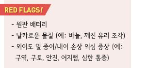
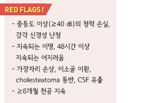
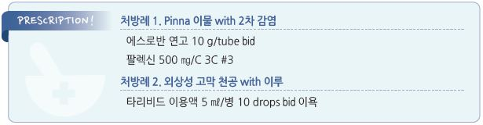

# 귀 손상 Ear Injury


### ■ 귓바퀴 외상 Auricle Trauma

## 이개혈종 (Otohematoma)

* 합병증 : 치료되지 않으면 연골 괴사 및 변형 발생(cauliflower ear)

### 치료

* 즉시 흡인(주사기 이용) 및 압박
* 혈종이 크거나 재발한 경우 : 흡인 또는 절개 배농 및 압박 고정 드레싱

## 동상 (Frostbite)

```
(☞ p.1086)
```

### ■ 귀 이물 Foreign Body in the Ear

## Pinna 이물

* 주요 원인 : 귀걸이 부속의 매몰
* 증상 : 발적, 통증, 부종, 고름
* 검사 : 간혹 X선 검사 필요
* 합병증 : 연골 감염, 흉터

### 치료

* 제거(필요시 국소 마취하에 시술)
* 필요시 항생제 투여 (☞ p.901)

## 외이도 이물

* 주요 원인 : 구슬, 작은 돌, 휴지, 작은 장난감, 음식(예: 팝콘 알갱이), 곤충
* 반대쪽 귀 및 코의 이물 여부를 함께 확인
* 제거 후 고막 및 외이도 손상 여부를 확인
* 즉시 제거가 필요한 이물 : 원판 배터리(＜4시간), 살아 있는 곤충, 귀 조직에 박혀 있는 이물

### 치료

* 작고 보이는 경우 : 포셉으로 제거
* 작고 고막 손상이 없는 경우 : 세척
* 살아 있는 곤충 : 1% lidocaine 또는 mineral oil로 죽인 후 제거; 고막 천공 시 소독용 알코올 사용
*   접착제(cyanoacrylate adhesive) : 접착제가 외이도에 접촉하지 않도록 주의하면서 접착제가 굳을 때까지(60초) 이물과

    접촉 유지
* 점이 항생제 : 외이도 손상 시 외이염에 사용되는 점이액 적용 (☞ p.215)

#### 세척

* 대상 : 작은 무기물, 곤충
* 금기 : 고막 천공, 식물 소재 이물(예: 콩), 원판 배터리
*   방법 : 앉아서 고개를 30\~90°뒤로 젖히거나 이환된 귀를 위쪽으로 향하게 하여 누움(흘러나오는 세척액에 대비하여

    수건 등을 귀/머리 밑에 받침) → 살아 있는 곤충은 죽임 → 체온 수준의 멸균수 또는 식염수를 20\~50 ㎖ 주사기에 채우고

    주사기의 14~~16-G 플라스틱 카테터를 외이도 안쪽 1~~1.5 ㎝에 위치시킴 → 외이도의 후상부를 향하여 세척액 분사

    → 이물이 제거될 때까지 반복, 입구로 나온 이물을 집어 냄

#### \[보험기준] 외이도 이물제거술(자557) (2019-06-28)

가. 감자 또는 기타 기구 사용으로 당일 제거가 가능한 이구전색은 ‘자557가(복잡한 것)’로 산정

나. 당일 제거가 곤란하거나, 마취 또는 약물 주입을 요하는 외이도의 골부 및 고막 주변에 완전폐쇄로 50분 이상 제거하는

```
경우에는 당일 제거하더라도 ‘자557나(극히 복잡한 것)’으로 산정
```

* 외이도이물 또는 이구전색제거에 있어서 간단한 것은 기본 진료료에 포함

### ■ 외상성 고막 천공 Traumatic TM Perforation

### 증상

* 급성 통증(빠르게 감소), 혈성 분비물, 이명, 경증 난청

### 경과

*   충격에 의해 찢어진 경우 : 합병증이 없으면 보통 수일\~수 주 내

    자연 치유
* central 손상 시 보다 잘 자연 치유됨
*   가장자리 손상, 후상부 손상(이소골 이환 가능성), 이물에 의한

    손상 시 자연 치유율 저하

### 검사

* 감각 신경성 난청 검사 시행

#### Tuning fork를 이용한 감별

```

```

### 치료

* 건조 상태 유지, 물이 들어가지 않도록 주의. 예) 수영 금지, 세발 시 귀마개
* 외이도 내측의 blood clot 등을 떼거나 씻어내서는 안 됨

#### 경구 항생제

* 합병증 또는 동반된 질환(예: 중이염)이 없는 경우에는 필요 없음

#### 국소 항생제

* 화농성 이루 발생 등 2차적 세균 감염에 대하여 고려
* 약간의 치유를 돕는 습윤 환경 유지 효과가 있으나 꼭 필요한 경우 외에는 사용하지 않음
* fluoroquinolone계 점이액 : ciprofloxacin 0.3% [시프레닛](../%EB%B9%84%EB%B3%B4%ED%97%98/), ofloxacin 0.3% \[타리비드]
* 1회 6\~10방울 떨어뜨림, 1일 2회 점이, 점이 후 10분간 이욕 (☞ p.215)

#### 고막성형술

* 발생 수 주 뒤에도 치유되지 않으면 고려

### ■ 귀의 압력 손상 Ear Barotrauma

* 원인 : 비행(하강 시), 다이빙, 갑작스런 강한 소음
* 증상 : 귀의 압박감, 통증, 청력 손실, 이명, 어지럼, 출혈
* 경과 : 대부분 자연 치유
* 의뢰 : 지속되는 어지럼 또는 난청

### 예방 및 치료

* 비행기 하강 중 자주 하품, 삼킴 동작(예: 껌, 사탕, 물 마심), autoinflation(Valsalva maneuver)
*   비행 시 eustachian tube 개방을 유도하기 위하여 국소/경구 코 울혈 제거제, 항히스타민제 사용

    •비내 울혈 제거제 : 압력 발생 30분 전 비공 당 1회 분무 (비보험); ≤4일/월로 사용 제한; xylometazoline \[오트리빈],

    oxymetazoline \[레스피비엔]

    •경구제 : 압력 발생 1\~수 시간 전 복용; pseudoephedrine 60 ㎎ \[슈다페드]
* 진통제 : 통증에 대하여 필요시 투여
* ventilating tube 삽입 : 자주 비행기 여행을 해야 하는 사람에서 반복적 발생 시 고려
* URI 또는 코 알레르기가 있을 때는 잠수를 피함
* 잠수 시 천천히 하강
* 지속되는 경우 코 울혈 제거제 투여(pseudoephedrine 60 ㎎ qid) 및 autoinflation 시행
* myringotomy : 심한 귀의 통증, 청력 저하 시 고려

## 소음 외상 (Acoustic Trauma)

* 강한 소리에 노출되어 발생하는 청력 손상
* 85\~140 ㏈(예: 록 콘서트) : 일시적 청력 감소(특히 4 ㎑ 영역), 이명; 지속 노출 시 영구적 손상 발생
* 갑작스런 ＞140 ㏈의 소음(예: 폭음, 사격) : 짧은 노출에서도 영구적 손상 발생 가능
*   1일 허용 최대 평균 노출 수준(음량 크기-노출 시간) : 85 ㏈-8시간, 88 ㏈-4시간, 91 ㏈-2시간, 94 ㏈-60분, 97 ㏈-30분,

    100 ㏈-15분

### 치료

* 급성 소음 외상에 대하여 고용량 steroid 1\~2주: prednisolone 60 ㎎/d \[소론도]
* 음량 최소화

> **질병코드** H61.11 귓바퀴의 혈종

T33.0 머리의 표재성 동상

T16 귀의 이물

H72 고막의 천공

T70.0 이염성 압력손상

H83.3 내이의 소음효과(소음유발청력소실)


