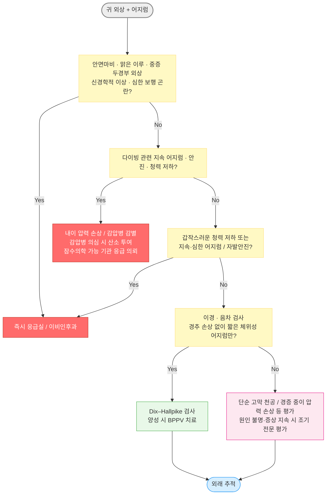
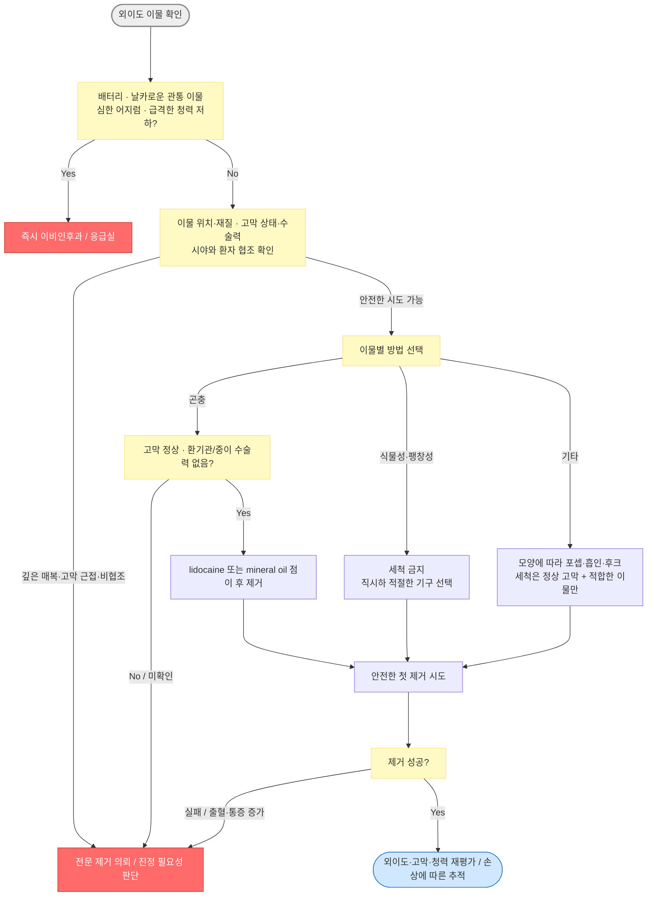

# 귀 손상 Ear Injury

***

### <mark style="color:orange;">귀 손상 처치 - 절대 하면 안 되는 것</mark>

<table><thead><tr><th width="339.5555419921875">금지 행위</th><th>이유</th></tr></thead><tbody><tr><td>원판(단추형) 배터리에 세척(irrigation) 시행</td><td>습기가 전기 화학 반응을 가속시켜 조직 괴사 급속 진행</td></tr><tr><td>고막 천공에 aminoglycoside 점이제 사용</td><td>내이 직접 노출 → 비가역적 감각신경성 난청</td></tr><tr><td>고막 상태·수술력을 확인하지 않은 채 세척 또는 곤충 제거용 액체 점이</td><td>천공 시 중이 감염, 심한 어지럼 유발</td></tr><tr><td>식물성 이물(콩·씨앗)에 세척</td><td>수분 흡수로 팽창 → 제거 더 어려워짐</td></tr><tr><td>이물 제거 실패 후 무리한 반복 시도 (특히 소아는 첫 시도 실패 후 의뢰)</td><td>외이도 부종 악화 → 이후 제거 더 어려워짐</td></tr><tr><td>이개혈종 배액 후 압박 고정·quilting 봉합 등 dead space 제거 생략</td><td>dead space 잔존 → 높은 재발률 → cauliflower ear</td></tr><tr><td>귀 압력 손상 시 forceful Valsalva 반복</td><td>중이 과압 → 외림프 누공·고막 천공 위험</td></tr></tbody></table>

### <mark style="color:orange;">폭행·사고 관련 의심 시 기록</mark>

* 다음 상황에서는 초진 시 아래 항목을 반드시 의무 기록에 기재하고 가능하면 사진 촬영·보관 (법적 분쟁 대비 초진 기록)
  * 폭행·가정 폭력 의심 : 혈종 위치·범위, 주변 피부 손상, 혈흔 상태, 내원 경위 및 설명의 일치성
  * 아동 이물 : 이물의 종류·위치, 보호자 진술, 반대쪽 귀·코 동반 이물 여부
  * 직업성 소음성 난청 (NIHL) : 작업 환경·노출 기간·보호구 사용 여부, 기저 청력 검사 결과
  * 단추형 배터리 손상 : 발견 시각, 배터리 종류·크기, 응급실 이송 시각, 조직 손상
  * 다이빙·잠수 사고 : 잠수 깊이·시간, 상승 속도, 감압 절차 준수 여부, 동반 증상 발생 시각
  * 고막 천공 (외상·폭행) : 천공의 위치(사분면: 전상/전하/후상/후하) 및 크기(고막 전체 면적 대비 % 또는 사분면 기술), 천공의 형태(방사형·불규칙형); 혈흔 유무; 이소골 이환 의심 여부
  * 귀 외상 (청력 평가) : 초진 시 음차 검사(Weber/Rinne) 결과를 기록 - 확정 진단 도구는 아니나, 영상 검사·PTA 시행 전 전음성/감각신경성 방향성을 파악하는 초진 소견으로서 추후 법적 분쟁 시 근거자료가 될 수 있음

### <mark style="color:orange;">귀 응급 상황 권장 대응 시점</mark>&#x20;


아래 시간은 **절대적 cutoff가 아니라 권장 목표 시점**임. 이 시간을 넘겼다고 처치가 무의미해지는 것은 아니며, 핵심은 "가능한 한 지연 없이" 대응하는 것임.


<table><thead><tr><th width="174">상황</th><th width="140">권장 목표 시점</th><th width="166">지연 시 결과</th><th width="211">핵심 주의</th></tr></thead><tbody><tr><td><strong>원판(단추형) 배터리</strong></td><td><strong>즉시</strong></td><td>액화 괴사·조직 천공</td><td>절대 세척 금지, 즉시 응급실</td></tr><tr><td><strong>외림프 누공·내이 감압병 의심</strong></td><td><strong>즉시</strong></td><td>영구 감각신경성 난청·평형 장애</td><td>다이빙 후에는 잠수의학·이비인후과 응급 평가; 감압병 의심 시 산소 투여, 재압치료 여부는 전문가 결정</td></tr><tr><td><strong>이개혈종</strong></td><td><strong>당일 가능한 조기</strong> (수일 지연하지 않음; 오래된 혈종도 전문 평가)</td><td>연골 섬유화 → cauliflower ear</td><td>배액 후 압박 고정 또는 quilting 봉합</td></tr><tr><td><strong>폭발음·급성 음향 외상</strong></td><td><strong>가능한 조기</strong> (이상적으로 24~48시간 이내; 근거 수준 제한적)</td><td>청력 회복 가능성 저하</td><td>소음 환경 즉시 이탈</td></tr><tr><td><strong>외상성 고막 천공</strong></td><td><strong>가능한 조기</strong> (건조 관리 즉시 시작)</td><td>2차 세균 감염·중이염</td><td>건조 유지, 귀 후비기 금지</td></tr></tbody></table>

***

### <mark style="color:orange;">어지럼증 동반 귀 외상 응급 감별</mark>

#### <mark style="color:$primary;">문진 핵심 질문</mark>

1. 소리가 갑자기 안 들립니까? (내이 손상)
2. 귀에서 피가 났습니까? (고막 천공, 측두골 골절)
3. 얼굴 한쪽이 마비된 느낌이 있습니까? (측두골 골절)
4. 코를 풀거나 힘줄 때 어지럼이 더 심해집니까? (외림프 누공)
5. 머리를 특정 방향으로 돌릴 때만 빙빙 돕니까? (외상 후 BPPV)

<table><thead><tr><th width="150">진단</th><th width="150">대표 병력</th><th width="140">핵심 증상</th><th width="140">청력 변화</th><th width="190">특징적 단서</th><th>응급도</th></tr></thead><tbody><tr><td><strong>외림프 누공 (PLF)</strong></td><td>다이빙, 압력 손상, blast, slap injury</td><td>vertigo + 오심 + 불균형</td><td>다양 (SNHL 가능; 청력 정상이어도 배제 불가)</td><td>Valsalva·압력 시 악화</td><td>즉시 의뢰</td></tr><tr><td><strong>Labyrinthine concussion</strong></td><td>둔기 두부 외상, 폭행, 낙상</td><td>dizziness + 불균형</td><td>다양 (SNHL 가능)</td><td>영상·이경 검사상 뚜렷한 구조 손상 없이도 발생 가능</td><td>즉시 의뢰</td></tr><tr><td><strong>측두골 골절</strong></td><td>주요 두부 외상</td><td>vertigo + 출혈</td><td>흔함 (이낭 비침범형: 주로 전음성 / 이낭 침범형: 감각신경성)</td><td>facial palsy, Battle sign, hemotympanum</td><td>즉시 의뢰</td></tr><tr><td><strong>CSF leak</strong></td><td>두개골 외상</td><td>어지럼 + 맑은 이루</td><td>다양</td><td>halo sign(특이도 낮음); 확진은 β2-transferrin</td><td>즉시 의뢰</td></tr><tr><td><strong>내이 감압병 (Inner-ear DCS)</strong></td><td>다이빙(특히 상승 중·직후)</td><td>vertigo ± SNHL</td><td>다양 (청력 정상 가능)</td><td>잠수 프로파일 이상(급상승·감압 절차 미준수); PLF와 감별 어려움</td><td>즉시 의뢰 (HBOT)</td></tr><tr><td><strong>경추 손상·추골동맥 박리 / 뇌손상 (중추성)</strong></td><td>두경부 외상</td><td>어지럼 + 경부통·신경학적 이상</td><td>없음</td><td>경부통, 보행 곤란, 운동·감각 이상; 경추·혈관 손상 평가 우선</td><td>즉시 의뢰</td></tr><tr><td><strong>급성 음향 외상</strong></td><td>폭발음, 사격</td><td>이명 + 청력 저하 (어지럼 드묾, blast 동반 시 가능)</td><td>있음 (SNHL)</td><td>이경 검사 정상 가능</td><td>당일 청력검사·ENT 평가; 스테로이드 적응증 판단</td></tr><tr><td><strong>외상성 고막 천공 (단순)</strong></td><td>slap injury, 면봉</td><td>짧은 어지럼 가능; 지속·심한 어지럼은 내이 손상 평가</td><td>경미한 conductive HL</td><td>통증 → 출혈</td><td>외래 가능</td></tr><tr><td><strong>귀 압력 손상 (mild)</strong></td><td>비행 하강, 다이빙</td><td>이충만감 + 경미한 어지럼</td><td>경미 (전음성)</td><td>popping sensation</td><td>경과 관찰</td></tr><tr><td><strong>외상 후 BPPV</strong></td><td>두부 외상 후 수일</td><td>체위 변화 시 회전성 어지럼</td><td>없음</td><td>경추 손상 배제 후 Dix–Hallpike 양성</td><td>외래 가능</td></tr></tbody></table>

***


```mermaid
flowchart TD
    A([귀 외상 + 어지럼]) ---> R["안면마비 · 맑은 이루 · 중증 두경부 외상<br>신경학적 이상 · 심한 보행 곤란?"]
    R --->|Yes| ER[즉시 응급실 / 이비인후과]
    R --->|No| D["다이빙 관련 지속 어지럼 · 안진 · 청력 저하?"]
    D --->|Yes| Dive["내이 압력 손상 / 감압병 감별<br>감압병 의심 시 산소 투여<br>잠수의학 가능 기관 응급 의뢰"]
    D --->|No| B["갑작스러운 청력 저하 또는<br>지속·심한 어지럼 / 자발안진?"]
    B --->|Yes| ER
    B --->|No| E["이경 · 음차 검사<br>경추 손상 없이 짧은 체위성 어지럼만?"]
    E --->|Yes| G["Dix–Hallpike 검사<br>양성 시 BPPV 치료"]
    E --->|No| H["단순 고막 천공 / 경증 중이 압력 손상 등 평가<br>원인 불명·증상 지속 시 조기 전문 평가"]
    H ---> K([외래 추적])
    G ---> K

    style A fill:#eeeeee,stroke:#888888,stroke-width:2px
    style ER fill:#ff6b6b,stroke:#c0392b,color:#fff
    style Dive fill:#ff6b6b,stroke:#c0392b,color:#fff
    style G fill:#e8f8e8,stroke:#4caf50
    style K fill:#d6eeff,stroke:#2196f3
    classDef yellow fill:#fff9c4,stroke:#ffe082
    class R,D,B,E yellow
    classDef pink fill:#fde8f0,stroke:#e91e8c
    class H pink
```

<p align="center"><strong>어지럼증 동반 귀 외상 감별 알고리듬</strong></p>

_✽음차 검사는 선별 검사로, 정상 소견만으로 내이 손상·감압병을 배제하지 못함. HINTS는 자발안진을 동반한 급성 전정증후군에서 훈련된 검사자만 시행하며, 두경부 외상에서는 경추·혈관 손상 평가를 우선함. 경추 손상 의심 시 head impulse·Dix–Hallpike 등 목 움직임을 유발하는 검사는 시행하지 않음._

***

## ■ 귓바퀴 외상 Auricle Trauma

## <mark style="color:green;">이개혈종 Otohematoma</mark>

* 귓바퀴 연골막과 연골 사이에 혈액이 고인 상태; 둔상·마찰에 의해 발생
* 스포츠(권투·레슬링·유도·럭비) 또는 귀 외상 후 흔함
* 합병증 : 치료하지 않으면 섬유화·연골 괴사 → 영구적 변형(cauliflower ear) 발생

### <mark style="color:$danger;">🚩 Red Flags!</mark>

<mark style="color:$danger;">**즉각 조치**</mark>

* 극심한 통증, 발열, 귀 전체 발적·부종·열감  `연골막염`  `이개 농양`

<mark style="color:$warning;">**당일 평가**</mark>

* 크거나(＞2 ㎝) 단단하게 굳기 시작한 혈종  `조직화 혈종`
* 배액·압박 후 재발 또는 반복 재발  `연골 손상`  `압박 고정 실패`

<mark style="color:$info;">**외래 추적**</mark>

* 배액·고정 후 안정적인 경과  `24～48시간 재평가`

### <mark style="background-color:$warning;">Management</mark>

* 혈종은 당일 가능한 한 조기에 배액함. 단순 흡인만으로는 재발이 자주 발생하므로, 배액 후 bolster 드레싱 또는 관통 quilting/mattress 봉합으로 연골막-연골 사이 dead space를 제거함

**단계별 치료 절차**

1. 배액 : 초기의 작은 연성(fluctuant) 혈종은 18～20G 주사기로 흡인할 수 있음. 크거나 응고된 혈종·재발성 혈종은 절개 배액이 더 적절하며, 숙련된 시술이 어렵다면 당일 이비인후과 의뢰
2. 고정 : 배액 직후 bolster 드레싱 또는 관통 quilting 봉합 시행. 과도한 압박으로 피부 혈류가 저하되지 않도록 확인
3. 고정 유지 : bolster는 보통 5～7일 유지하며, 술식·상처 상태에 따라 기간 조정. 임의 조기 제거는 피함
4. 재평가 : 24～48시간 내 재축적·감염·압박에 의한 피부 손상 확인; 필요시 수일간 추가 추적. 재발하면 이비인후과에서 재배액·고정 방법 재평가
5. 스포츠 복귀 : 접촉 스포츠는 적어도 약 2주간 회피하고 혈종·상처가 회복된 뒤 의료진 확인 후 복귀. 귓바퀴 보호대(headgear) 착용 권고

**항생제**

* 감염이 없는 단순 이개혈종에서 예방적 경구 항생제를 일률적으로 투여할 근거는 부족함. 흡인 또는 절개 배액 여부만으로 항생제 필요성을 결정하지 않음
* 오염·개방창·연골 노출·면역저하 등 고위험 상황에서는 예방적 항생제를 선택적으로 고려하며, 약제·기간은 상처 특성과 전문과 판단에 따름
* 녹농균 위험이 높은 연골부 피어싱 관련 감염에서는 항녹농균 치료를 고려함. 소아의 amoxicillin-clavulanate는 피부·구강 상재균을 대상으로 한 선택이며, 녹농균 치료제로 대체할 수 없음
* 연골막염·농양은 예방적 투약과 구분하여 즉시 이비인후과 평가; 배농·배양 및 경구 또는 IV 항생제 판단 (☞ [외이염](047_-otitis-externa.md))
* 경구 fluoroquinolone 처방 시 건병증·건파열 등 이상반응을 설명함. 건 통증·부종 발생 시 약 복용과 운동을 중단하고 즉시 연락하도록 지도

**흡인 vs 절개 배액**

* 발생 초기(대략 48시간 이내)이고 작고 연성인 혈종은 흡인을 고려할 수 있음. 시간·크기만으로 결정하지 않고 응고 여부와 시술 가능성을 함께 평가
* 크거나(＞2 ㎝), 응고되어 단단하거나 재발성인 혈종은 절개 배액 고려
* 수일 경과한 혈종도 배액 가능성이 있으나, 약 7일 이상 경과하거나 조직화·변형이 있으면 이비인후과에서 치료 방법 결정. '7일까지 기다려도 됨'을 의미하지 않음
* bolster와 quilting 봉합은 모두 선택 가능. 2026년 소규모 후향적 비교연구는 quilting의 유용성을 뒷받침하지만, 한 술식의 우월성이 확정된 것은 아님 [Laryngoscope 2026]

***

## <mark style="color:red;">질병코드 - 이개혈종</mark>

* H61.11 귓바퀴의 혈종 Hematoma of pinna

***

## <mark style="color:purple;">처방례 - 이개혈종</mark>

> **처방례 1. 단순 이개혈종 배액·고정 후 (감염 없음)**
>
> ```
> (예방적 항생제 일률 처방 없음 - 배액·고정 및 24～48시간 내 재평가)
> ```
>
> _✽오염·개방창·면역저하 등 고위험 상황에서는 예방적 항생제를 개별 결정. 소아 amoxicillin-clavulanate는 녹농균을 커버하지 않으므로, 연골막염·농양 의심 시 전문과 치료 필요_

> **처방례 2. 연골막염 의심 (극심한 통증·발열·귀 전체 발적)**
>
> ```
> (즉시 이비인후과 의뢰 - 경구 fluoroquinolone 또는 IV 항생제 필요할 수 있음)
> ```
>
> _✽연골 괴사로 진행 시 영구적 변형 위험이 크므로 지체 없이 의뢰_

***

### <mark style="color:$success;">핵심 복약 지도 - 이개혈종</mark>

> **압박 고정(bolster) 관리 방법**
>
> * **처방된 기간(보통 5～7일, 상태에 따라 조정) 동안 압박 드레싱을 임의로 제거하지 마십시오.** 조기에 제거하면 재발률이 크게 높아집니다.
> * 드레싱이 흠뻑 젖거나 심한 통증·발열이 생기면 즉시 재내원하십시오.
> * 절개 배농 후 항생제를 처방받은 경우 처방 기간을 끝까지 복용하십시오.
> * 항생제(씨프로바이 등) 복용 중 발목·종아리 등 힘줄 부위의 통증·부종이 생기면 **약 복용과 운동을 중단하고 즉시 의료진에게 연락하십시오.**

> **스포츠 복귀 안내**
>
> * 접촉 스포츠는 적어도 약 2주간 피하고, 혈종·상처가 회복된 뒤 의료진의 확인을 받고 복귀하십시오.
> * 재발 방지를 위해 복귀 시 귓바퀴 보호대(headgear) 착용을 권고합니다.

> **언제 다시 병원을 방문해야 하나요?**
>
> * 압박 고정 중 또는 제거 후 귀가 다시 부풀어 오르는 경우 (재발)
> * 극심한 통증, 발열, 귀 전체가 붉게 붓는 경우 (연골막염 의심) - 즉시 내원

***

## <mark style="color:blue;">환자 안내서 - 이개혈종</mark>


**귀에 피가 고였어요 (이개혈종)**

권투·레슬링·유도 등 귀에 반복적인 충격이 가해지는 운동이나 외상 후, 귓바퀴 연골과 그 위를 덮은 막(연골막) 사이에 피가 고이는 상태입니다. 제때 치료하지 않으면 연골이 오그라들어 귀 모양이 영구적으로 변할 수 있습니다(일명 '만두귀', cauliflower ear).


#### <mark style="color:$primary;">치료는 어떻게 하나요?</mark>

* 병원에서 **주사기로 고인 피를 뽑아내거나(흡인) 절개하여 배출**시킵니다.
* 이후 **압박 붕대(볼스터) 또는 귀 조직을 밀착시키는 봉합**으로 피가 다시 고일 공간을 없앱니다. 볼스터는 보통 5～7일 유지하되 상태에 따라 조정합니다.
* 치료 후 **24～48시간 내 재진**하여 피가 다시 고이지 않는지 확인합니다. 접촉 스포츠는 적어도 약 2주간 피하고 의료진 확인 후 복귀합니다.

#### <mark style="color:$primary;">치료 중 꼭 지켜야 할 것</mark>

* **압박 붕대를 스스로 풀거나 만지지 마십시오.**
* 다시 부풀어 오르거나 통증·발열이 심해지면 바로 병원에 오십시오.
* 같은 운동을 계속한다면 **귓바퀴 보호대(headgear)**를 착용하여 재발을 예방하십시오.

#### <mark style="color:$primary;">이럴 때는 즉시 병원을 방문하세요</mark>

* 치료 후 귀가 다시 부풀어 오를 때
* 귀 전체가 심하게 붓고 붉어지며 열이 날 때
* 참기 힘든 통증이 생길 때

***

## <mark style="color:green;">이개 열상 Auricular Laceration</mark>

* 귓바퀴 연골은 혈관이 없어 덮고 있는 피부·연골막에서 영양을 공급받으므로, 연골이 노출된 채 방치되면 연골막염·연골 괴사로 진행할 수 있음
* 원인 : 날카로운 물체에 의한 열상, 둔상, 사람·동물 물림, 귀걸이에 의한 귓불 찢김
* 열상과 함께 피하 혈종이 생기면 이개혈종과 같은 원칙으로 관리 (☞ 이개혈종)

### <mark style="color:$danger;">🚩 Red Flags!</mark>

<mark style="color:$danger;">**즉각 조치**</mark>

* 귓바퀴의 절단 또는 광범위한 결손  `이개 절단`
* 광범위한 연골 손상·결손을 동반한 복합 열상  `복합 이개 열상`

<mark style="color:$warning;">**당일 평가**</mark>

* 사람·동물 물림에 의한 열상  `물림 손상`
* 외이도까지 침범한 열상  `외이도 협착 위험`
* 열상 부위의 피하 혈종  `이개혈종`
* 봉합 후 발적·부종·통증이 점점 심해짐  `상처 감염`  `연골막염`

<mark style="color:$info;">**외래 추적**</mark>

* 단순 열상 봉합 후 안정적인 경과  `24～48시간 상처 확인`

### <mark style="background-color:$warning;">Management</mark>

* 마취 : 1% lidocaine으로 국소 침윤 또는 이개 블록(ring block); 혈류가 보존된 일반적인 열상에서는 epinephrine 혼합 사용 가능. 절단·허혈 또는 혈류가 불확실한 피판은 전문과와 판단
* 세척 : 생리식염수로 충분히 세척, 괴사 조직만 최소한으로 제거
* 봉합 원칙
  * 노출된 연골은 반드시 피부로 완전히 덮음 - 피부가 부족하면 노출된 연골 가장자리를 소량 절제한 뒤 덮을 수 있음
  * 연골이 분리된 경우 흡수사(5-0)로 연골막을 포함하여 봉합하고, 연골을 직접 관통하는 봉합은 피함
  * 피부는 6-0 비흡수사로 봉합하며, 이륜(helix) 테두리 등 해부학적 경계를 먼저 맞춤
  * 피부 봉합사는 5일 내외에 제거
* 봉합 후 피하 혈종 예방을 위해 가벼운 압박 드레싱 적용; 24～48시간 내 혈종·감염·피부 혈류 확인
* 항생제
  * 단순 피부 열상은 불필요
  * 연골 노출만으로 예방적 항생제를 일률 투여할 근거는 부족함. 심한 오염·압궤·괴사 조직·면역저하 등 고위험 상황에서 선택적으로 고려 [AAST 2024]
  * 피어싱 관련 연골막염의 녹농균 위험을 모든 외상성 열상에 동일하게 적용하지 않음; 감염 의심 시 배양·배농 및 항생제 판단
  * 물림 손상은 amoxicillin-clavulanate (☞ [물림](../230_/204_-bites.md))
* 물림·오염·감염된 상처는 일차 봉합 여부를 세척·오염 정도·조직 생존성에 따라 결정; 필요시 지연 봉합·전문과 협진
* 동물 물림은 광견병 노출 위험 평가 (☞ [물림](../230_/204_-bites.md))
* 파상풍 예방접종 상태 확인 (☞ [상처 관리](../230_/202_-wound-care.md))
* 절단된 경우 : 절단편을 생리식염수에 적신 거즈로 싸서 비닐봉지에 넣고, 얼음물이 담긴 용기에 담아(얼음 직접 접촉 금지) 즉시 이송
* 귀걸이에 의한 귓불 찢김 : 급성기에는 일차 봉합, 오래되어 상피화된 경우 성형외과·이비인후과에 의뢰

***

## <mark style="color:red;">질병코드 - 이개 열상</mark>

* S01.3 귀의 열린상처 Open wound of ear

***

## <mark style="color:purple;">처방례 - 이개 열상</mark>

> **처방례 1. 단순 이개 열상 봉합 후 (감염·고위험 오염 없음)**
>
> ```
> (예방적 항생제 일률 처방 없음 - 압박 드레싱 및 24～48시간 내 상처 확인)
> ```
>
> _✽연골 노출만으로 ciprofloxacin을 자동 처방하지 않음. 심한 오염·압궤·면역저하 등에서는 전문과와 예방적 항생제 개별 결정_

> **처방례 2. 사람·동물 물림에 의한 열상 (성인)**
>
> ```
> 오구멘틴 625 ㎎/T   1T   tid   × 3~5d
> ```
>
> _✽감염이 없는 고위험 물림 손상의 예방적 투약 예시(3～5일); 감염이 이미 있으면 치료 기간·배농 필요성을 별도 판단. Pasteurella, Eikenella, 혐기균 등 커버. 연골 손상 동반 시 이비인후과 협진, 파상풍·광견병 위험 평가_

***

### <mark style="color:$success;">핵심 복약 지도 - 이개 열상</mark>

> **봉합 부위 관리**
>
> * 압박 드레싱은 지시받은 기간 동안 유지하십시오.
> * 상처는 지시받은 방법으로 관리하십시오. 압박 드레싱을 임의로 제거하거나 젖게 하지 말고, 상처 세척 시점은 재진 때 확인하십시오.
> * 봉합 부위를 베개로 누르지 않도록 반대쪽으로 누워 주무십시오.
> * 실밥은 보통 5일 전후에 제거합니다.

> **언제 다시 병원을 방문해야 하나요?**
>
> * 귀가 점점 붓고 붉어지거나 통증이 심해지는 경우 (감염·연골막염 의심)
> * 상처 아래가 부풀어 오르는 경우 (혈종)

***

## <mark style="color:blue;">환자 안내서 - 이개 열상</mark>


**귓바퀴가 찢어졌어요**

귓바퀴는 얇은 피부 아래에 연골이 있는 구조입니다. 연골은 피부를 통해 영양을 받기 때문에, 찢어진 상처는 연골이 드러나지 않도록 잘 덮어 꿰매는 것이 중요합니다.


#### <mark style="color:$primary;">치료 중 꼭 지켜야 할 것</mark>

* **압박 붕대를 스스로 풀지 마십시오.** 상처 아래에 피가 고이는 것을 막아 줍니다.
* 상처를 긁거나 만지지 말고, 잘 때 다친 귀가 눌리지 않게 하십시오.
* 항생제를 처방받았다면 끝까지 복용하십시오.

#### <mark style="color:$primary;">이럴 때는 즉시 병원을 방문하세요</mark>

* 귀가 점점 붓고 붉어지며 열이 날 때
* 상처 아래가 다시 부풀어 오를 때
* 참기 힘든 통증이 생길 때

***

## <mark style="color:green;">동상 Frostbite</mark>

(☞ [냉 손상](../230_/208_-cold-injury.md#frostbite))

***

## ■ 귀 이물 Foreign Body in the Ear

### <mark style="color:$danger;">🚩 Red Flags!</mark>

<mark style="color:$danger;">**즉각 조치**</mark>

* 원판(단추형) 배터리  `알칼리 액화 괴사`
* 바늘, 깨진 유리 조각 등 날카로운 이물  `외이도·고막 관통 손상`
* 구역·구토, 안진, 심한 어지럼, 청력 급감  `중이·내이 손상`
* 심한 통증, 외이도 부종  `외이도 손상`

<mark style="color:$warning;">**당일 평가**</mark>

* 첫 제거 시도 실패(특히 소아) 또는 이전 제거 시도 실패 전력  `외이도 부종 악화`
* 이물 제거 후 확인된 고막·외이도 손상  `외상성 고막 천공`  `외이도 열상`
* 비협조 소아  `제거 중 이차 손상 위험`

<mark style="color:$info;">**외래 추적**</mark>

* 이물 제거 후 통증·분비물 지속  `이차 감염`  `외이염`
* 소아 귀 이물  `반대쪽 귀·코 동반 이물`

## <mark style="color:green;">Pinna 이물</mark>

* 주요 원인 : 귀걸이 부속의 매몰
* 증상 : 발적, 통증, 부종, 고름
* 검사 : 필요시 X선
* 합병증 : 연골 감염, 흉터

### <mark style="background-color:$warning;">Management</mark>

* 제거 (필요시 국소 마취하에 시술)
* 감염 동반 시 항생제 투여 - 연골부(귀 윗부분) 피어싱 감염은 Pseudomonas 비중이 높아 fluoroquinolone 고려

## <mark style="color:green;">외이도 이물</mark>

* 주요 원인 : 구슬, 작은 돌, 휴지, 작은 장난감, 음식(팝콘 알갱이), 곤충
* 반대쪽 귀 및 코의 이물 여부 함께 확인
* 제거 후 고막·외이도 손상 여부 확인
* 즉시 제거 필요 이물 : 원판(단추형) 배터리, 살아 있는 곤충, 귀 조직에 박힌 이물

### <mark style="background-color:$warning;">Management</mark>

* 제거 전 이물의 위치·모양·재질, 고막 상태, 환기관·중이 수술력, 협조 가능성 및 기존 손상을 확인하고 가능한 청력 평가 기록
* 부드럽고 잡을 수 있는 불규칙한 이물(휴지·솜 등) : 직시하 포셉 제거 (☞ [보험기준](https://www.hira.or.kr/rc/insu/insuadtcrtr/InsuAdtCrtrPopup.do?mtgHmeDd=20190628&sno=3&mtgMtrRegSno=0007))
* 매끈한 구슬·둥근 이물 : 포셉으로 밀어 넣지 않음. 위치·공간에 따라 흡인 또는 후크 선택; 고막 근처·깊은 매복·제거 공간 부족 시 전문과 의뢰
* 세척 : 고막이 정상이고 느슨한 작은 무기물 또는 죽은 곤충 등 적합한 이물에서만 시행; 금기 조건은 아래 참조
* 접착제(cyanoacrylate adhesive) : 충분한 시야·공간과 협조가 확보된 경우 숙련된 시술자가 선택적으로 사용. 외이도 피부·고막 접촉 위험이 있어 비협조 소아·깊은 이물에는 피함
* 첫 시도가 성공 가능성이 가장 높으므로 준비·기구 선택을 충분히 함. 특히 소아는 첫 시도 실패 후 의뢰; 통증 증가·출혈·갑작스러운 움직임이 있으면 즉시 중단. 성인도 무리한 반복 시도는 피함
* 제거 후 외이도·고막·청력 재평가. 경미한 자극만으로 예방적 점이 항생제를 일률 사용하지 않음. 의미 있는 피부 열상·감염에서는 고막 상태에 맞는 점이제 고려; 천공이 있거나 의심되면 비이독성 ofloxacin 단일제 우선 (☞ [외이염](047_-otitis-externa.md))

**원판(단추형) 배터리**

* 조직(습기)을 통해 전류가 흐르면서 음극에 수산화 이온이 생성되어 강알칼리 환경·액화 괴사를 일으킴; 압박 손상도 기여
* 크기·배터리 종류·증상 유무와 관계없이 즉시 제거 대상. 작은 배터리도 안전하지 않음
* 세척·액체 점이 금지. 제거가 즉시 안전하게 가능하지 않으면 응급실·이비인후과로 지체 없이 이송
* 진정·전신마취 가능성에 대비해 금식하되, 금식 시간 확보를 위해 제거·이송을 지연하지 않음
* 제거 후에도 잔류 알칼리·조직 손상으로 지연 합병증이 발생할 수 있어 전문과에서 외이도·고막 손상 및 후속 추적 결정 [Queensland Health 2025]

**살아 있는 곤충**

* 고막이 정상이고 환기관·중이 수술력이 없는 경우 2% lidocaine 또는 mineral oil 점이로 움직임을 멈춘 뒤 제거; lidocaine은 통증 완화에도 도움이 됨
* 고막 천공·환기관·중이 수술력이 있거나 고막 상태를 확인하기 어려우면 임의 액체 점이를 피하고 전문 제거 의뢰. 천공 의심 시 mineral oil을 안전한 예외로 권하지 않음
* alcohol 점이 또는 알코올 적신 솜 사용은 표준 처치로 권하지 않음

#### <mark style="color:$primary;">세척</mark>

* 대상 : 느슨한 작은 무기물, 죽은 곤충 등; 이물 뒤로 액체가 통과하고 배출될 공간이 있어야 함
* 금기 : 고막 천공·고막 상태 미확인, 환기관·중이 수술력, 식물성·팽창성 이물(콩·씨앗·흡수성 소재), 원판 배터리·자석, 날카롭거나 깊게 매복된 이물
* 방법 : 머리를 안정시키고 외이도를 펴서 시야 확보 → 체온 정도의 생리식염수 또는 미온수를 플라스틱 카테터/주사기로 외이도 후상부 벽을 따라 낮은 압력으로 주입
  * 팁은 직시하에 얕게 위치시키고, 정해진 깊이로 밀어 넣거나 외이도를 밀폐하지 않음. 고막을 직접 향하지 않도록 하며 액체가 자유롭게 배출되는지 확인
  * 통증·출혈·어지럼 또는 제거 실패 시 중단하고 재평가·의뢰; 제거될 때까지 무리하게 반복하지 않음

### <mark style="color:orange;">외이도 이물 - 관리 알고리듬</mark>


```mermaid
flowchart TD
    Start([외이도 이물 확인]) ---> Red["배터리 · 날카로운 관통 이물<br>심한 어지럼 · 급격한 청력 저하?"]
    Red --->|Yes| Urgent[즉시 이비인후과 / 응급실]
    Red --->|No| Assess["이물 위치·재질 · 고막 상태·수술력<br>시야와 환자 협조 확인"]
    Assess --->|"깊은 매복·고막 근접·비협조"| Refer[전문 제거 의뢰 / 진정 필요성 판단]
    Assess --->|"안전한 시도 가능"| Type[이물별 방법 선택]
    Type --->|곤충| TM["고막 정상 · 환기관/중이 수술력 없음?"]
    TM --->|No / 미확인| Refer
    TM --->|Yes| Insect["lidocaine 또는 mineral oil 점이 후 제거"]
    Type --->|식물성·팽창성| Organic["세척 금지<br>직시하 적절한 기구 선택"]
    Type --->|기타| Other["모양에 따라 포셉·흡인·후크<br>세척은 정상 고막 + 적합한 이물만"]
    Insect ---> Attempt[안전한 첫 제거 시도]
    Organic ---> Attempt
    Other ---> Attempt
    Attempt ---> Result[제거 성공?]
    Result --->|"실패 / 출혈·통증 증가"| Refer
    Result --->|Yes| Done([외이도·고막·청력 재평가 / 손상에 따른 추적])

    style Start fill:#eeeeee,stroke:#888888,stroke-width:2px
    classDef yellow fill:#fff9c4,stroke:#ffe082
    class Red,Assess,Type,TM,Result yellow
    style Urgent fill:#ff6b6b,stroke:#c0392b,color:#fff
    style Refer fill:#ff6b6b,stroke:#c0392b,color:#fff
    style Done fill:#d0e8ff,stroke:#1a6abf
```

<p align="center"><strong>외이도 이물 처치 알고리듬</strong></p>

***

## <mark style="color:purple;">처방례 - Pinna 이물</mark>

> **처방례 1. 귓불의 매몰 이물 제거 후 피부 감염 동반 (성인, 연골막염 없음)**
>
> ```
> 에스로반 연고 10 g/tube   소량   bid   (국소 도포)
> 팔렉신 500 ㎎/C           3C    #3    × 5~7d
> ```
>
> _✽이물 제거 후 국소 mupirocin 연고 도포. 연골부 피어싱 감염은 Pseudomonas 비중이 높아 cephalexin이 부적절할 수 있음 - fluoroquinolone 고려. 연골막염 진행 시(심한 통증·발열·전체 귀 발적) 즉시 의뢰 - 연골막염은 fluoroquinolone 경구제 또는 IV 항생제 필요_

***

### <mark style="color:$success;">핵심 복약 지도 - 귀 이물</mark>

> **이물 제거 후 귀 관리**
>
> * 이물 제거 후 외이도 손상이 있는 경우 점이용 항생제를 처방받을 수 있습니다. 약병을 손으로 잡아 체온에 가깝게 데운 후 처방된 방울 수를 점이하고, 약제별로 지시받은 시간 동안 자세를 유지하십시오(ofloxacin은 약 10분).
> * 제거 후 피부·고막 손상이 있으면 의료진이 회복을 확인할 때까지 귀를 건조하게 유지하십시오. 손상 없이 제거되었다면 특별한 약물·추적이 필요하지 않을 수 있습니다.
> * 제거 후에도 통증·분비물·청력 감소가 지속되면 재내원하십시오.

***

## <mark style="color:blue;">환자 안내서 - 귀 이물</mark>


**귀에 이물이 들어갔을 때**

귀에 이물(벌레, 구슬, 작은 장난감, 씨앗 등)이 들어가면 당황스럽지만, 당황하여 서두르다 더 심각한 손상이 생기는 경우가 많습니다. 가장 중요한 원칙은 '섣불리 건드리지 말고 즉시 병원에 오는 것'입니다.


#### <mark style="color:$primary;">🚫 귀에 이물이 들어갔을 때 절대 하지 말아야 할 것</mark>

* **면봉·핀셋·머리핀으로 밀거나 파내지 마십시오.** 이물이 더 깊이 들어가거나 고막이 뚫릴 수 있습니다.
* **귀를 손가락으로 후비지 마십시오.** 외이도 피부에 상처가 생겨 감염 위험이 높아집니다.
* **콩·씨앗·나무 조각 등 식물성 이물에 물을 넣지 마십시오.** 물을 흡수하여 크게 부풀어 오르면 제거가 훨씬 어려워집니다.
* **원판(단추형) 배터리가 들어간 경우** **즉시 응급실**로 가십시오. 물기가 닿으면 반응이 빨라지므로 **절대 세척하지 말고**, 바로 응급실에서 제거해야 귀 조직 괴사를 막을 수 있습니다.
* **스스로 꺼내려고 시도하지 마십시오.** 반복 시도는 외이도를 붓게 만들어 병원에서의 제거를 더 어렵게 합니다.

#### <mark style="color:$primary;">이럴 때는 즉시 병원(응급실)을 방문하세요</mark>

* 원판(단추형) 배터리가 들어간 경우 - **즉시 응급실**
* 귀에서 피가 나거나 극심한 통증이 있을 때
* 어지럼증, 구역·구토가 동반될 때
* 살아 있는 벌레가 들어가 심한 통증·소음이 느껴질 때 (억지로 빼려 하지 말고 즉시 내원)

***

## ■ 외상성 고막 천공 Traumatic TM Perforation

### <mark style="color:$danger;">🚩 Red Flags!</mark>

<mark style="color:$danger;">**즉각 조치**</mark>

* 갑작스러운 감각신경성 난청 또는 현저한 청력 감소(음차 검사 정상만으로 배제하지 않음)  `내이 손상`  `외림프 누공`
* 지속되거나 심한 어지럼·안진  `외림프 누공`  `등골 아탈구`
* 면봉·귀이개 등에 직접 찔린 후 어지럼·청력 저하  `등골 아탈구`  `외림프 누공`
* 안면마비  `측두골 골절`
* 두부 외상 후 맑은 이루  `CSF 이루`

<mark style="color:$warning;">**당일 평가**</mark>

* 큰 천공, 가장자리(marginal) 또는 후상부 천공  `이소골 손상`  `진주종 위험`
* 청력 저하를 동반하거나 심한 지속 이명  `이소골 손상`  `내이 손상`
* 이루 발생  `2차 세균 감염`

<mark style="color:$info;">**외래 추적**</mark>

* 4\~6주 재평가 시 크기 감소·회복 소견 없음  `자연 치유 지연`
* 2\~3개월 경과 후에도 자연 치유되지 않음  `영구 천공`

## <mark style="color:green;">증상 및 경과</mark>

* 증상 : 급성 통증(빠르게 감소), 혈성 분비물, 이명, 경증 전음성 난청
* 경과 : 충격에 의해 찢어진 경우 합병증 없으면 수일\~수 주 내 자연 치유; central 손상이 가장자리 손상보다 자연 치유율 높음
* 자연 치유율 저하 인자 : 가장자리 손상, 후상부 손상(이소골 이환 가능성), 이물에 의한 손상
* 면봉·귀이개 등 이물에 의한 직접 찔림 손상은 기압 손상(폭발음·귀 때리기)에 비해 이차 감염 및 영구 천공 위험이 높음 - 오염된 이물이 외이도 세균을 중이로 직접 유입시킬 수 있음

## <mark style="color:green;">검사</mark>

* 감각 신경성 난청 동반 여부 확인 필수

### <mark style="color:orange;">Tuning Fork를 이용한 청력 감별</mark>

<table><thead><tr><th width="166"></th><th width="200">Weber lateralization</th><th width="220">Rinne test</th></tr></thead><tbody><tr><td><strong>전음성 난청</strong></td><td></td><td></td></tr><tr><td>　건측</td><td></td><td>정상 (AC＞BC)</td></tr><tr><td>　환측</td><td>병변 측(환측)으로 편위</td><td>비정상 (BC＞AC)</td></tr><tr><td><strong>감각 신경성 난청</strong></td><td></td><td></td></tr><tr><td>　건측</td><td>건측(정상 측)으로 편위</td><td>정상 (AC＞BC)</td></tr><tr><td>　환측</td><td></td><td>정상 (AC＞BC)</td></tr></tbody></table>

_AC=air conduction, BC=bone conduction; 512 ㎐ 음차 사용. 고도의 일측 감각신경성 난청에서는 반대쪽 귀가 소리를 감지하여 Rinne 위음성(BC＞AC)이 나올 수 있음_

_<mark style="color:$info;">✽감각 신경성 난청이 확인되면 내이 손상을 의미하므로 즉시 이비인후과 의뢰</mark>_

***

## <mark style="background-color:$warning;">Management - 외상성 고막 천공</mark>

### <mark style="color:orange;">치료 원칙</mark>

* 건조 상태 유지 : 물이 들어가지 않도록 - 수영 금지, 세발·샤워 시 귀마개 또는 바셀린 솜 사용
* 혈병 : 환자가 임의로 떼거나 씻어내지 않도록 함. 관찰을 가리는 혈액·혈병은 숙련된 의료진이 직시하에 저압으로 조심스럽게 제거할 수 있음
* 면봉 금지 : 외이도 조작은 2차 감염 및 추가 손상 위험
* 감염 징후가 없고 오염도 없는 단순 천공은 약물 치료 불필요. 오염 손상·감염은 아래 국소 항생제 원칙에 따름
* 4～6주 시점에 고막 회복 확인; 큰 천공·의미 있는 청력 저하·감염은 더 일찍 평가
* 가능하면 초기 및 회복 후 순음청력검사 시행. 고막이 닫혀도 난청이 지속되면 이소골·내이 손상 평가

**금지 사항**

* 수영·잠수 (고막 완전 회복 시까지)
* 귀 후비기·면봉 사용
* 코 세게 풀기 (한 번에 양쪽 동시); Valsalva 조작 금지 - 고막 치유 방해 및 중이 감염 유도 위험
* 귀에 물 넣기 (세척·irrigation 금지)
* 강한 흡인·고막 주변의 무리한 조작 및 공기압 이경 검사 피함; 필요한 저압 흡인은 숙련된 의료진이 직시하에 시행

**권고 사항**

* 머리 감을 때 바셀린 솜 또는 귀마개로 귀 막기
* 감기·상기도감염 예방 (이관을 통한 2차 감염 차단)
* 외이도 내 혈병(혈딱지)을 환자가 임의로 떼지 않음; 필요한 제거는 의료진이 판단

### <mark style="color:orange;">경구 항생제</mark>

* 합병증 또는 동반 질환(예: 중이염)이 없는 경우 불필요
* 단순 화농성 이루는 비이독성 국소 항생제만으로 치료 가능한 경우가 많음
* 경구 항생제는 동반 중이염의 임상 양상, 전신증상, 주변 조직 감염·확산 또는 국소치료 실패 등을 평가해 결정; 이루만으로 자동 추가하지 않음

### <mark style="color:orange;">국소 항생제 (점이용제)</mark>

* 화농성 이루 등 2차 감염 시, 또는 오염 손상(물속 손상, 오염된 이물에 의한 찔림)에서 예방적으로 fluoroquinolone 점이제 고려; 그 외에는 불필요
* 고막 천공 시 점이용제 원칙
  * aminoglycoside 계열(gentamicin, tobramycin, neomycin)은 천공을 통해 내이로 유입될 경우 감각신경성 난청을 유발하므로 절대 금기
  * 고막 천공 상태에서는 이독성이 없는 fluoroquinolone 점이제를 우선 선택함
* ofloxacin 0.3% : 성인 1회 6～10 drops bid, 점이 후 약 10분간 이욕 <mark style="color:blue;">\[에펙신이용액]</mark>
  * 화농성 이루·오염 손상의 처방 예시는 7～10일이며, 경과에 따라 조정. 국내 허가 적응증은 중이염·외이염으로, 비감염성 외상성 천공의 오염 예방 사용은 허가 외 사용에 해당함
* ciprofloxacin + fluocinolone <mark style="color:blue;">\[세트락살플러스]</mark>는 급성 외이염(7세 이상) 허가 제제이나, 고막 천공·중이염에서 안전성·유효성 미확립으로 이 챕터의 일반적인 대체 처방으로 제시하지 않음. ofloxacin을 사용할 수 없다면 이비인후과와 대체 약제 결정
* 약제별 점이법을 구분함: ofloxacin은 약 10분간 이욕; 세트락살플러스의 외이염 허가 점이법은 약 30초 자세 유지 (☞ [외이염](047_-otitis-externa.md))

### <mark style="color:orange;">고막성형술 (Tympanoplasty)</mark>

* 외상성 고막 천공의 80% 이상은 자연 치유됨
* 4\~6주 시점에 1차 재평가하고, 크기가 줄지 않거나 회복 소견이 없으면 계속 관찰하되 **2\~3개월이 지나도 자연 치유되지 않으면** 이비인후과에 의뢰하여 수술적 치료를 고려
* 종이 패치법(paper patch myringoplasty), 지방 이식 고막 성형술 : 자연 치유 촉진을 위해 조기 시행 가능한 선택적 옵션, 필요시 조기 의뢰
* 폭행·사고 관련 의심 시 천공의 형태(방사형·불규칙형), 혈흔 범위, 이물 유무 등 초진 소견 상세 기록 및 사진 보관 (☞ 폭행·사고 관련 의심 시 기록)

***

## <mark style="color:red;">질병코드 - 외상성 고막 천공</mark>

* S09.2 고막의 외상성 파열 Traumatic rupture of ear drum

***

## <mark style="color:purple;">처방례 - 외상성 고막 천공</mark>

> **처방례 1. 외상성 고막 천공 - 이루 없음 (단순 관찰)**
>
> ```
> (약물 처방 없음 - 건조 유지 및 경과 관찰)
> ```
>
> _✽혈병 보존, 귀에 물 들어가지 않도록 지도. 4\~6주 후 고막 회복 확인. 수영·잠수 금지_

> **처방례 2. 외상성 고막 천공 - 화농성 이루 동반 (2차 감염) 또는 오염 손상**
>
> ```
> 에펙신이용액 5 ㎖/병    6~10 drops   bid   이욕 10분   × 7~10d
> 타이레놀 이알 650 ㎎/T     1T           q8h               × 3d (통증 시)
> ```
>
> _✽성인 처방 예시. 감염 치료는 중이염·외이염 허가 범위와 임상 양상을 확인하며, 비감염성 오염 손상의 예방 투여는 허가 외 사용. 고막 천공 시 aminoglycoside·이독성 점이제 피함; 비이독성 fluoroquinolone 단일제 우선. 약병을 손으로 잡아 체온에 가깝게 데우고, 발열·통증 악화 시 재내원_

***

### <mark style="color:$success;">핵심 복약 지도 - 외상성 고막 천공</mark>

> **귀 점이약 올바른 사용법**
>
> * **약병을 먼저 따뜻하게 하십시오.** 손으로 1～2분 잡아 체온에 가깝게 데우십시오. 뜨거운 물·전자레인지로 가열하지 마십시오. 차가운 약이 들어가면 어지럼증이 생길 수 있습니다.
> * 아픈 귀를 위로 향하게 눕거나 머리를 기울이고 처방된 방울 수를 점이하십시오.
> * 귓바퀴를 부드럽게 당겨 약이 귀 안 깊이 들어가도록 하고, **10분간 그 자세를 유지**한 후 일어나 흘러나오는 약액을 닦습니다.
> * **면봉으로 귀 안을 닦지 마십시오.**

> **귀를 건조하게 유지하는 방법**
>
> * 고막이 아물 때까지(보통 4\~6주) **절대 물이 들어가지 않도록** 하십시오.
> * 세발·샤워 시 귀마개를 사용하거나 바셀린(petroleum jelly)을 묻힌 솜으로 귀를 막으십시오.
> * **수영과 잠수는 고막이 완전히 회복될 때까지 금지합니다.**
> * 귀 안에 고인 피딱지(혈병)를 면봉이나 손가락으로 떼지 마십시오. 필요한 제거는 의료진이 판단합니다.

> **언제 즉시 병원을 방문해야 하나요?**
>
> * 귀에서 고름 같은 분비물이 나오거나 통증·발열이 생기는 경우
> * 어지럼증이 지속되거나 심해지는 경우
> * 소리가 갑자기 잘 안 들리거나 이명이 심해지는 경우
> * 얼굴 한쪽이 마비되는 경우
> * 4\~6주가 지나도 귀가 완전히 회복되지 않는 느낌이 드는 경우

***

## <mark style="color:blue;">환자 안내서 - 외상성 고막 천공</mark>


**고막에 구멍이 생겼어요**

귀를 세게 맞거나, 면봉을 깊이 넣거나, 갑작스러운 압력 변화(귀 때리기, 폭발음) 등으로 고막(鼓膜)이 찢어진 상태입니다. 처음에는 통증과 출혈이 있지만 빠르게 줄어듭니다. 대부분 4\~8주 안에 저절로 아뭅니다. 가장 중요한 것은 **귀를 건조하게 유지**하는 것입니다.


#### <mark style="color:$primary;">어떤 증상이 생기나요?</mark>

* 귀 통증 (처음에 심하다가 빠르게 감소)
* 귀에서 약간의 피 또는 분비물
* 귀가 먹먹하거나 소리가 울려 들림
* 이명 (삐 소리, 윙윙거리는 소리)

#### <mark style="color:$primary;">치료 중 꼭 지켜야 할 것</mark>

* **귀에 물이 절대 들어가면 안 됩니다.** 고막 구멍으로 세균이 들어가 중이염이 생길 수 있습니다.
  * 세발·샤워 시 귀마개 또는 바셀린 솜 사용
  * 수영·잠수는 고막이 완전히 나을 때까지 금지
* **면봉으로 귀 안을 후비지 마십시오.** 귀 안에 피딱지가 있어도 스스로 떼지 마십시오. 필요한 제거는 의료진이 판단합니다.
* **코를 세게 풀거나 귀에 압력을 주는 행동(코 막고 힘주기 등)을 피하십시오.** 코가 막히면 한쪽씩 아주 약하게 푸십시오.
* 비행기 탑승은 대개 가능합니다. 다만 감기·코막힘이 심하면 의사와 상의하십시오.

#### <mark style="color:$primary;">경과는 어떻게 되나요?</mark>

* 대부분 **4\~8주 안에 저절로** 아뭅니다.
* 단순 천공에서는 고막이 아물면서 청력도 회복되는 경우가 많습니다. 고막이 닫혀도 잘 안 들리면 청력검사와 추가 평가가 필요합니다.
* 4\~6주 시점에 병원에서 회복 상태를 확인하며, 2\~3개월이 지나도 낫지 않으면 수술(고막성형술)로 복원할 수 있습니다.

#### <mark style="color:$primary;">이럴 때는 즉시 병원을 방문하세요</mark>

* 귀에서 고름이 나오거나 통증·발열이 생길 때
* 어지럼증이 계속되거나 심해질 때
* 소리가 갑자기 크게 안 들릴 때
* 얼굴 한쪽이 마비될 때

***

## ■ 귀의 압력 손상 Ear Barotrauma

## <mark style="color:green;">일반 사항</mark>

* 원인 : 비행(특히 하강 시), 다이빙, 폭발(blast), 고압산소치료
* 기전 : 이관(Eustachian tube) 기능 부전으로 중이 압력 균형 실패 → 고막·중이 손상
* 분류
  * 외이 압력 손상 : 귀마개·꽉 끼는 후드로 외이도가 밀폐된 상태에서 잠수
  * 중이 압력 손상 : 가장 흔함; 고막 함몰·출혈·천공, 중이 삼출
  * 내이 압력 손상 : 무리한 Valsalva 등으로 정원창·난원창 파열 → 외림프 누공, 감각신경성 난청·어지럼
* 증상 : 귀의 압박감·통증, 청력 손실, 이명, 어지럼, 출혈
* 경과 : 경증 중이 압력 손상은 대개 자연 치유; 내이 손상·감압병 의심 시 응급 평가
* 강한 압력에 노출 후 청력 저하가 있으면 순음청력검사(PTA) 시행

### <mark style="color:orange;">이경 소견 등급 - Teed 분류 (변형)</mark>

<table><thead><tr><th width="100">등급</th><th width="330">이경 소견</th><th>관리 방향</th></tr></thead><tbody><tr><td>0</td><td>증상은 있으나 고막 소견 정상</td><td>보존적 치료</td></tr><tr><td>1</td><td>고막 함몰, 추골 자루 주변 발적</td><td>보존적 치료</td></tr><tr><td>2</td><td>1등급 + 고막 내 경미한 출혈</td><td>보존적 치료, 수일 내 재평가</td></tr><tr><td>3</td><td>고막 전체의 광범위한 출혈</td><td>보존적 치료, 조기 재평가</td></tr><tr><td>4</td><td>중이 내 혈액·삼출액 (고막 뒤로 어둡게 비침, 팽윤)</td><td>조기 재평가; 청력 저하 시 PTA</td></tr><tr><td>5</td><td>고막 천공</td><td>☞ 외상성 고막 천공</td></tr></tbody></table>

_어느 등급이든 갑작스러운 감각신경성 난청, 지속·심한 어지럼·안진이 있으면 내이 손상·감압병을 평가하고 즉시 의뢰. 이경 소견 정상만으로 배제하지 못함._

### <mark style="color:$danger;">🚩 Red Flags!</mark>

<mark style="color:$danger;">**즉각 조치**</mark>

* 갑작스러운 감각신경성 난청 또는 현저한 청력 감소, 특히 어지럼 동반  `외림프 누공`  `내이 압력 손상`
* 지속적인 어지럼·안진  `내이 압력 손상`  `외림프 누공`
* 다이빙 상승 중·직후 발생한 청력 손실·어지럼  `내이 감압병`  `내이 압력 손상`

<mark style="color:$warning;">**당일 평가**</mark>

* 증상이 48\~72시간 이상 지속되거나 악화  `중이 삼출`  `고막 손상`
* 고막 천공 (☞ [외상성 고막 천공](049_-ear-injury.md#외상성-고막-천공-traumatic-tm-perforation))  `외상성 고막 천공`

<mark style="color:$info;">**외래 추적**</mark>

* 반복 발생  `알레르기비염`  `만성 부비동염`  `귀인두관기능부전`

***

## <mark style="background-color:$warning;">Management - 귀 압력 손상</mark>

* 경증 중이 압력 손상은 추가 압력 노출을 피하고 진통제·건조 관리 시행; 코막힘이 있으면 금기 확인 후 울혈 제거제 단기간 고려
* 하품·삼킴 등 부드러운 동작을 우선함. 손상 후 반복 Valsalva를 일률 권하지 않으며, 통증·어지럼·갑작스러운 난청·천공 의심 시 압력 조작 중단
* 갑작스러운 청력 저하 또는 지속·심한 어지럼·안진·보행 곤란은 즉시 의뢰. 경미한 청력 저하도 조기 PTA·이비인후과 평가로 전음성/감각신경성 감별
* 반복 발생 시 알레르기비염, 만성 부비동염 등 원인 질환 치료


**다이빙 후 청력 저하·어지럼 - 내이 압력 손상 vs 내이 감압병**

* 내이 압력 손상 : 주로 **하강 중** 이압 평형이 잘 안 되거나 무리한 Valsalva 후 발생
* 내이 감압병 : 대개 **상승 중·상승 후(수면 도달 후)** 발생하며 깊고 긴 잠수·기체 변경·급상승 등과 관련. 감압 절차를 준수했거나 청력 저하가 없어도 배제되지 않음

두 질환은 임상적으로 구분이 어려우며 함께 발생할 수도 있음. 잠수 프로파일(깊이·시간·사용 기체·상승 속도·감압 절차)과 이압 평형 실패 여부를 확인하되 이송을 지연하지 않음. 감압병이 의심되면 가능한 최고 농도의 산소(가능하면 100%)를 투여하며 잠수의학·고압산소치료 가능 기관으로 응급 의뢰함. 내이 압력 손상이 유력한 경우 추가 압력 변화가 해로울 수 있으므로, 재압치료 여부는 잠수의학 전문가·이비인후과가 결정함. 힘주기·코 세게 풀기·재잠수는 피함


### <mark style="color:orange;">예방</mark>

* 비행기 하강 중 : 자주 하품·삼킴(껌·사탕·물 마심); 필요시 통증이 없는 범위에서 부드러운 이압 평형. 강한 Valsalva 반복은 피함
* URI·비염 활성기에는 다이빙·잠수 금지
* 잠수 시 : 천천히 하강하며 초기에 부드럽게 이압 평형. 통증·평형 실패 시 하강 중단, 해결되지 않으면 안전하게 잠수 종료
* 손상 후 잠수 복귀는 고막·중이 회복과 이관 기능을 의료진이 확인한 뒤 결정

### <mark style="color:orange;">약물 치료</mark>

**경구 울혈 제거제**

* 성인에서 탑승 30분 전 pseudoephedrine 120 ㎎ 복용 시 이통 감소 근거가 있음 [Ann Emerg Med 1994]; 소아에서는 효과가 입증되지 않음 [Arch Pediatr Adolesc Med 1999]
* pseudoephedrine 60 ㎎ 2T, 탑승 30분\~1시간 전 1회 <mark style="color:blue;">\[슈다페드]</mark> (국내 허가 1회량은 60 ㎎으로, 120 ㎎ 1회 복용은 허가 외 용량)
* 코막힘 동반 시 pseudoephedrine 30～60 ㎎, 1일 3～4회 범위에서 필요시 단기간(예: 3～5일) 사용; 최소 4시간 간격, 최대 240 ㎎/일. 압력 손상 자체의 회복 효과는 확립되지 않음

**비강 울혈 제거제** (이관 개방 유도)

* 비강 분무 단독의 예방 효과는 불확실함 [Am J Emerg Med 1998]; 코막힘이 동반된 경우 보조적으로 사용
* 압력 발생 30분 전 비공당 1회 분무; 반동성 비충혈 예방을 위해 연속 사용은 3일 이내
* xylometazoline <mark style="color:blue;">\[오트리빈]</mark>
* oxymetazoline <mark style="color:blue;">\[레스피비엔]</mark> (6세 미만 금기; 1주 이상 사용 권장되지 않음)


**pseudoephedrine 투여 금기 및 주의**

**투여 금기 (국내 슈다페드 허가사항)**

* 고혈압을 포함한 심혈관질환, 심한 관동맥질환
* 갑상샘기능항진증, 당뇨병, 수유부
* MAO 억제제 투여 중 또는 중단 후 2주 이내
* 중증 신장애, 크롬친화세포종, 폐쇄각녹내장
* 다른 교감신경흥분제 또는 베타차단제 투여 중
* 약 성분·교감신경흥분성 아민류 과민반응 및 허가상 유당 관련 유전성 대사질환

**신중 투여**

* 전립선비대증·방광 기능이상, 디기탈리스제제 투여
* 안압 상승, 중증 간부전, 신장애, 임신, 고령자, 비만, 갑상샘 질환

_✽갑작스러운 심한 두통·시각장애·혼돈·경련 등이 발생하면 즉시 중단하고 응급 평가(PRES/RCVS 가능)._



**진통제**

* acetaminophen 즉방형 : 500～1,000 ㎎ q6～8h prn, 성인 최대 4,000 ㎎/일(고령·간질환·음주 등에서는 감량); 650 ㎎ 서방형은 q8h로 제형별 용법 구분 <mark style="color:blue;">\[타이레놀]</mark>
* ibuprofen : 400 ㎎ q6h <mark style="color:blue;">\[부루펜]</mark>

### <mark style="color:orange;">수술</mark>

* myringotomy : 심한 이통, 청력 저하가 지속되는 경우 고려
* ventilating tube 삽입 : 잦은 비행이 불가피한 경우 반복 발생 시 고려

***

## <mark style="color:red;">질병코드 - 귀 압력 손상</mark>

* T70.0 이염성 압력손상 Otitic barotrauma

***

## <mark style="color:purple;">처방례 - 귀 압력 손상</mark>

> **처방례 1. 비행 관련 반복 이통의 예방 (성인, 금기 없음; 코막힘 동반 시 보조 스프레이)**
>
> ```
> 슈다페드 60 ㎎/T              2T            탑승 30분~1시간 전
> 오트리빈 0.1% 비강 스프레이   1 puff/비공   탑승 30분 전
> ```
>
> _✽pseudoephedrine 120 ㎎ 1회 복용은 허가 외 용량. 비강 울혈 제거제는 반동성 비충혈 예방을 위해 연속 3일 이내로 사용. URI 심한 경우 탑승 연기 권고. 소아에서는 울혈 제거제의 예방 효과가 입증되지 않음_

> **처방례 2. 다이빙·비행 후 경증 중이 압력 손상 (내이 손상·천공 배제, 코막힘 동반)**
>
> ```
> 슈다페드 60 ㎎/T   1T   tid~qid prn   × 3~5d
> 부루펜 200 ㎎/T    6T   #3    × 3~5d
> ```
>
> _✽슈다페드는 코막힘 완화를 위한 선택적 처방이며 최소 4시간 간격·최대 240 ㎎/일, 투여 금기 확인. 하품·삼킴을 우선하고 반복 Valsalva는 일률 권하지 않음. 지속·심한 어지럼·안진·갑작스러운 난청 시 즉시 전문 평가_

***

### <mark style="color:$success;">핵심 복약 지도 - 귀 압력 손상</mark>

> **비내 스프레이 올바른 사용법**
>
> * 비내 울혈 제거제(오트리빈 등)는 **비행기 탑승 30분 전**에 각 비공에 1회씩 분무하십시오.
> * 3일 넘게 연속으로 사용하지 마십시오. 오래 사용하면 오히려 코막힘이 더 심해질 수 있습니다.
> * 경구 슈다페드는 탑승 30분\~1시간 전에 복용하십시오.

> **이압 균형 조작법 (예방 단계와 손상 후를 구분)**
>
> * 비행 중 예방에는 하품·삼킴을 먼저 하고, 필요한 경우에만 코를 막고 아주 부드럽게 숨을 내쉬어 압력을 맞추십시오.
> * 통증·어지럼·갑작스러운 청력 저하가 생기거나 고막 천공이 의심되면 중단하십시오. 이미 손상된 귀에 반복해서 힘을 주지 마십시오.
> * 비행기 하강 시 껌을 씹거나 물을 삼키는 것도 같은 효과가 있습니다.

> **언제 즉시 병원을 방문해야 하나요?**
>
> * 어지럼증이 지속되거나 심하고, 안진·구토·걷기 어려움이 동반되는 경우 - 기다리지 말고 즉시 평가
> * 소리가 갑자기 잘 안 들리거나 이명이 심해지는 경우
> * 귀에서 출혈이나 분비물이 나오는 경우

***

## <mark style="color:blue;">환자 안내서 - 귀 압력 손상</mark>


**비행기나 다이빙 후 귀가 아파요**

귀와 코를 연결하는 이관(耳管)이 갑작스러운 기압 변화에 적응하지 못할 때 발생합니다. 비행기 착륙 시 또는 잠수하여 내려갈 때 흔히 생깁니다. 대부분 저절로 회복되지만, 어지럼증이나 청력 저하가 동반되면 병원을 방문해야 합니다.


#### <mark style="color:$primary;">어떤 증상이 생기나요?</mark>

* 귀가 먹먹하거나 꽉 막힌 느낌
* 귀 통증
* 소리가 울려 들리거나 잘 안 들림
* 이명

#### <mark style="color:$primary;">스스로 할 수 있는 방법</mark>

* **하품하기, 삼킴 동작** : 껌을 씹거나 물을 마시면 이관이 열립니다.
* **압력 조작 주의** : 비행 중 예방에는 부드러운 이압 평형이 도움이 될 수 있지만, 이미 귀가 손상되었거나 통증·어지럼·갑작스러운 난청·고막 천공이 있으면 코를 막고 힘주는 동작을 중단하십시오.
* **비행기 탑승 전** 코막힘이 심하면 비강 스프레이(오트리빈 등)를 탑승 30분 전에 뿌리면 도움이 됩니다.

#### <mark style="color:$primary;">이럴 때는 즉시 병원을 방문하세요</mark>

* 어지럼증이 지속되거나 심하고, 눈이 떨리거나 구토·보행 곤란이 동반될 때 - 기다리지 말고 즉시 평가
* 소리가 갑자기 크게 안 들릴 때
* 귀에서 출혈이나 분비물이 나올 때
* 다이빙 후 물 밖으로 나온 뒤에 어지럼·청력 저하가 생길 때 - **즉시 응급실**

***

## ■ 소음 외상 Acoustic Trauma

## <mark style="color:green;">일반 사항</mark>

* 강한 소리에 노출되어 발생하는 청력 손상. 급성 음향 외상과 반복·장기 노출에 의한 소음성 난청(NIHL)을 구분함
* 손상 위험은 강도·노출 시간·반복 노출·충격성 여부와 보호구 사용에 따라 달라짐. 일시적 또는 영구적 역치 상승·이명 가능; 고주파 청력 저하가 흔함
* 폭발음·사격 같은 충격소음은 짧은 노출에서도 영구 손상 가능. 140 ㏈를 영구 손상의 절대 경계로 사용하지 않음
* NIOSH 직업성 소음의 권고 노출한계(절대 안전시간은 아님) : 85 dB(A)-8시간 / 88 dB(A)-4시간 / 91 dB(A)-2시간 / 94 dB(A)-60분 / 97 dB(A)-30분 / 100 dB(A)-15분
  * 소음 노출 3 ㏈ 증가마다 허용 노출 시간이 절반으로 감소 (NIOSH 권고 기준)
  * 국내 산업안전보건법 노출기준은 90 dB(A) 8시간이며, 5 ㏈ 증가마다 허용 시간이 절반으로 감소함
* 강한 소음에 노출 후 청력 저하가 있으면 순음청력검사(PTA) 시행

### <mark style="color:$danger;">🚩 Red Flags!</mark>

<mark style="color:$danger;">**즉각 조치**</mark>

* 폭발음·사격 직후 현저하거나 갑작스러운 청력 감소  `급성 음향 외상`
* 감각 신경성 난청 + 지속되는 어지럼  `내이 손상`  `외림프 누공`

<mark style="color:$warning;">**당일 평가**</mark>

* 큰 소음·폭발 후 새로 생긴 청력 저하·지속되는 먹먹함  `급성 음향 외상`  `조기 청력검사`
* 폭발 후 새로 생긴 이명, 또는 청력 저하를 동반한 이명  `급성 음향 외상`

<mark style="color:$info;">**외래 추적**</mark>

* 청력 저하 없이 지속되는 이명  `소음성 이명`
* 직업적·반복 소음 노출  `소음성 난청(NIHL)`

***

## <mark style="background-color:$warning;">Management - 소음 외상</mark>

* 즉시 소음 환경에서 벗어나고 추가 소음·사격 노출을 피함. 청력 저하·폭발 후 이명이 있으면 가능한 한 조기에 PTA·이비인후과 평가
* 증상의 주관적 경증만으로 일시적 역치 상승(TTS)을 확정하지 않음. 관찰 여부는 청력검사와 증상에 따라 결정하며, 24～72시간을 반드시 기다리는 기준으로 사용하지 않음

### <mark style="color:orange;">치료</mark>

* 급성 음향 외상 : 조기 청력검사로 손상 정도를 평가하고 이비인후과와 스테로이드 적응증 판단. 조기 치료가 유리하다는 관찰연구가 있으나, 24～48시간 또는 72시간을 절대적인 치료 cutoff로 사용하지 않음
  * prednisolone 1 ㎎/㎏/d(최대 60 ㎎/d), 1일 1회 아침 × 7～10d <mark style="color:blue;">\[소론도]</mark>를 고려할 수 있음. JTS 2025의 prednisone 60 ㎎/d × 10d 예시에 동등 용량의 국내 prednisolone을 적용한 요법이며, 급성 음향 외상 치료는 허가 외 사용
  * 단기 요법 후 감량을 일률적으로 요구하지 않음. JTS 2025는 위 10일 요법의 의무적 감량 요구를 삭제했으며, ESE/Endocrine Society 2024는 일반적으로 3～4주 미만 투여에서 부신억제 예방 목적의 감량이 불필요하다고 권고. 기존 장기·반복 스테로이드 사용 등은 개별 판단
  * 스테로이드의 효과 근거는 제한적이며 모든 이명·먹먹함에 자동 투여하지 않음. 당뇨·소화성 궤양·고혈압·감염 등 위험을 확인하고 유익성/위험성 평가
  * 검사 접근이 지연되어 PTA 전에 스테로이드를 시작한 경우에도 당일 PTA·이비인후과 의뢰 병행
  * 경구제가 부적절하거나 반응이 불충분하면 고실 내 스테로이드를 전문과와 협의. JTS 2025는 청력 저하 발생 후 2～6주에 고실 내 주입을 구제치료로 제시함
  * 중증 손상에서는 고압산소치료(HBOT) 병용도 전문과에서 선택적으로 고려; 효과·시점·접근성은 개별 판단
* 가능한 한 조기에 PTA로 초기 청력 확보. JTS 2025는 연속 3개 주파수에서 ＞25 ㏈ 역치 상승을 고용량 스테로이드 고려 기준 중 하나로 제시하며, 절대 역치와 기존 청력을 함께 해석함
* 치료 종료 후 약 2주 이내 및 필요시 6개월 시점에 청력 재평가; 지속되는 난청·이명은 청각 재활·전문 치료 연계
* PTA 정상이나 소음 속 어음 구별이 어려우면 speech-in-noise 검사 등으로 기능적 청취 어려움 평가. 이 검사만으로 '숨겨진 난청'·청각 시냅스병증을 확진하거나 배제하지 못함
* 음량 최소화 : 소음원에서 즉시 벗어나기
* 만성 소음 노출 : 근본적 원인 제거(작업 환경 개선); 청력 보호구 착용
* 직업적 소음 노출자 : 특수건강진단(배치 후 12개월 이내 첫 검진, 이후 24개월 주기)

### <mark style="color:orange;">예방</mark>

* 85 ㏈ 이상 환경에서 귀마개·청력 보호구 착용
* 이어폰·헤드폰 : 최대 볼륨의 60% 이하·60분마다 휴식(60–60 rule)은 실용적 팁이며, 기기별 실제 음량 차이로 안전을 보장하지 않음
* WHO의 성인 개인 청취 기준은 평균 80 ㏈에서 주 40시간의 누적 노출량. 음량이 높아지면 허용 시간이 짧아지므로 기기의 음량·노출량 경고 기능과 조용한 휴식을 활용 [WHO 2026]
* 콘서트·공연 관람 시 귀마개 사용 권고

***

## <mark style="color:red;">질병코드 - 소음 외상</mark>

* H83.3 내이의 소음 효과 Noise effects on inner ear

***

## <mark style="color:purple;">처방례 - 소음 외상</mark>

> **처방례 1. 급성 음향 외상 - 청력검사·전문 평가 후 스테로이드 적응증 있음 (성인 ≥60 ㎏ 예시)**
>
> ```
> 소론도 5 ㎎/T   12T   qd 아침 식후   × 10d
> ```
>
> _✽prednisolone 60 ㎎/d × 10d의 허가 외 사용 예시. 60 ㎏ 미만은 1 ㎎/㎏/d(최대 60 ㎎/d) 범위에서 개별 결정. 단기 요법의 감량은 필수가 아니며 기존 장기·반복 투여 이력 등 고려. 청력검사·당일 이비인후과 평가를 병행하고 당뇨·궤양·고혈압·감염 위험 확인. 지연 내원해도 치료 가능성을 평가함_

> **처방례 2. 청력검사·진찰 후 관찰이 적절한 경증 소음 노출**
>
> ```
> (약물 처방 없음 - 추가 소음 회피, 증상에 따른 청력 재평가)
> ```
>
> _✽청력검사 전 주관적인 경증만으로 TTS라고 확정하거나 24～72시간 대기시키지 않음. 청력 감소·폭발 후 이명은 조기 검사, 악화·어지럼·안진 동반 시 즉시 재평가_

***

### <mark style="color:$success;">핵심 복약 지도 - 소음 외상</mark>

> **스테로이드(소론도) 복용 안내**
>
> * **처방된 일정대로 복용하고 임의로 용량·기간을 변경하지 마십시오.** 짧은 요법에서는 감량 없이 종료할 수 있으며, 감량이 필요한지는 기존 복용 이력과 상태에 따라 의사가 결정합니다.
> * **하루 한 번 아침 식사 직후 복용**하십시오. 공복에 복용하면 속이 쓰릴 수 있고, 저녁에 복용하면 잠들기 어려울 수 있습니다.
> * 복용 중 당뇨가 있으신 경우 혈당이 올라갈 수 있으니 혈당 모니터링을 더 자주 하십시오.
> * 복용 중 얼굴이 붓거나, 불면, 기분 변화 등이 생기면 의사에게 알리십시오.

> **귀를 보호하는 방법**
>
> * **이어폰·헤드폰은 낮은 음량으로 듣고 60분마다 휴식하십시오.** 최대 볼륨 60%는 참고 팁이며, 실제 음량과 누적 노출량 경고도 확인하십시오. 손상 직후에는 이어폰·큰 소음 노출을 피하십시오.
> * 콘서트·공연 등 시끄러운 환경에서는 귀마개를 착용하십시오.
> * 공장·건설 현장 등 소음 작업 환경에서는 반드시 청력 보호구를 착용하십시오.

> **언제 즉시 병원을 방문해야 하나요?**
>
> * 큰 소음 후 소리가 갑자기 잘 안 들리는 경우 - 기다리지 말고 즉시 알리십시오
> * 폭발 후 새로 생긴 이명, 또는 청력 저하를 동반하는 이명 - 당일 평가
> * 어지럼증이 동반되는 경우

***

## <mark style="color:blue;">환자 안내서 - 소음 외상</mark>


**큰 소리에 귀가 손상될 수 있어요**

공연장·공장·폭발음 등 큰 소리에 노출되면 내이(달팽이관)의 청각 세포가 손상됩니다. 일시적인 경우 수 시간\~수 일 내 회복되지만, 반복 노출이나 매우 큰 소음은 영구적인 청력 손실을 일으킬 수 있습니다. **한 번 손상된 청각 세포는 재생되지 않습니다.**


#### <mark style="color:$primary;">어떤 증상이 생기나요?</mark>

* 소리가 먹먹하거나 잘 안 들림 (특히 높은 음역)
* 귀에서 삐 소리 또는 윙윙거리는 소리 (이명)
* 소리가 울려 들리는 느낌

#### <mark style="color:$primary;">치료는 어떻게 하나요?</mark>

* **즉시 소음 환경에서 벗어나는 것**이 가장 중요합니다.
* 갑작스러운 청력 저하나 폭발 후 이명이 있으면 **가능한 한 빨리 청력검사와 진료**를 받으십시오. 검사 결과에 따라 스테로이드 치료를 고려합니다. 조기 치료가 유리하지만, 시간이 지났다고 평가·치료를 포기하지 마십시오.

#### <mark style="color:$primary;">귀를 지키는 생활 습관</mark>

* 이어폰은 낮은 음량으로 듣고 60분마다 휴식하십시오. 최대 볼륨 60%는 참고 기준이며, 실제 음량·누적 노출량 경고를 확인하십시오.
* 시끄러운 환경에서는 귀마개를 착용하십시오.
* 정기적으로 청력 검사를 받으십시오 (특히 직업적 소음 노출자).


**💡 '정상 청력 검사'를 받았어도 안심하지 마세요**

표준 청력검사가 정상이어도 **시끄러운 환경에서 말소리를 알아듣기 어렵거나 대화 내용을 자주 되묻는다면** 이비인후과에 알리십시오. 고주파 청력·청각 처리·인지 등 여러 요인이 관련될 수 있으며, 소음 속 말소리 듣기 검사 등으로 어려움을 평가할 수 있습니다. '숨겨진 난청' 또는 청각 시냅스병증은 연구 중인 개념으로, 이 증상이나 한 가지 검사만으로 신경 시냅스 손상을 확진·배제할 수는 없습니다.



**💬 소음 후 이명(삐 소리)이 생겼다면**

소음 노출 후 이명은 시간이 지나며 줄어들 수 있지만, 영구적인 청력 손상이 동반될 수도 있습니다. **청력 감소·먹먹함·어지럼이 있거나 폭발 후 새로 생긴 이명이면 기다리지 말고 평가**받으십시오. 청력 저하 없이도 이명이 지속되거나 일상생활에 지장을 주면 진료를 받으십시오.


#### <mark style="color:$primary;">이럴 때는 즉시 병원을 방문하세요</mark>

* 큰 소음 후 소리가 갑자기 잘 안 들릴 때 - 기다리지 말고 즉시 평가
* 폭발 후 새로 생긴 이명 또는 청력 저하를 동반한 이명 - 당일 평가
* 어지럼증이 동반될 때

***

## <mark style="color:red;">질병코드 - 전체</mark>

* H61.11 귓바퀴의 혈종 Hematoma of pinna
* S01.3 귀의 열린상처 Open wound of ear
* T33.0 머리의 표재성 동상 Superficial frostbite of head
* T16 귀의 이물 Foreign body in ear
* S09.2 고막의 외상성 파열 Traumatic rupture of ear drum
* T70.0 이염성 압력손상 Otitic barotrauma
* H83.3 내이의 소음 효과 Noise effects on inner ear


***

### <mark style="color:orange;">주요 참고 근거</mark>

* [Joint Trauma System. Aural Blast Injury/Acoustic Trauma and Hearing Loss. 14 August 2025, CPG ID 05, v1.1](https://jts.health.mil/assets/docs/cpgs/Aural_Blast_Injury_Acoustic_Trauma_and_Hearing_Loss_14_Aug_2025_ID05_v1.1.pdf) — 군 폭발·음향 외상 지침으로, 민간 1차 진료에서는 환자 상태·국내 허가·전문과 판단에 맞춰 적용
* [Queensland Health. Foreign body in the ear — Emergency management in children. Version 4.0, September 2025](https://www.childrens.health.qld.gov.au/for-health-professionals/queensland-paediatric-emergency-care-qpec/queensland-paediatric-clinical-guidelines/foreign-body-ear)
* [Appelbaum RD, et al. Antibiotic prophylaxis in injury: AAST Critical Care Committee clinical consensus document. Trauma Surg Acute Care Open. 2024;9:e001304](https://pmc.ncbi.nlm.nih.gov/articles/PMC11149135/) — 성인 외상 지침; 소아에 그대로 외삽하지 않음
* [Cheng CF, et al. Management of Auricular Hematoma With Bolster Versus Quilting: A Retrospective Cohort Study. Laryngoscope. Published online 11 June 2026](https://doi.org/10.1002/lary.70680) — 소규모 후향적 연구로 술식 우월성 확정 근거는 아님
* [Managing Auricular Hematoma: An Emergency Medicine Narrative Review. J Emerg Med. 2025;69:62–75](https://doi.org/10.1016/j.jemermed.2024.08.021)
* [ESE/Endocrine Society. Glucocorticoid-Induced Adrenal Insufficiency Guideline. 2024](https://www.endocrine.org/clinical-practice-guidelines/glucocorticoid-induced-adrenal-insufficiency)
* [SAEM. GRACE-3: Acute Dizziness and Vertigo. 2023](https://www.saem.org/publications/grace/grace-3) — HINTS의 검사자 훈련·적용 대상 확인
* [MSD Manual Professional. Traumatic Perforation of the Tympanic Membrane. Updated June 2026](https://www.msdmanuals.com/professional/ear-nose-and-throat-disorders/middle-ear-and-tympanic-membrane-disorders/traumatic-perforation-of-the-tympanic-membrane)
* [WHO. Deafness and hearing loss: Safe listening. 6 March 2026](https://www.who.int/news-room/questions-and-answers/item/deafness-and-hearing-loss-safe-listening)
* 국내 의약품 허가사항(약학정보원 수록): [에펙신이용액](https://health.kr/searchDrug/result_drug.asp?drug_cd=A11A0341A0014), [슈다페드정](https://health.kr/searchDrug/result_drug.asp?drug_cd=A11A0500A0112), [세트락살플러스점이액](https://health.kr/searchDrug/result_drug.asp?drug_cd=A11AOOOOO7764)
