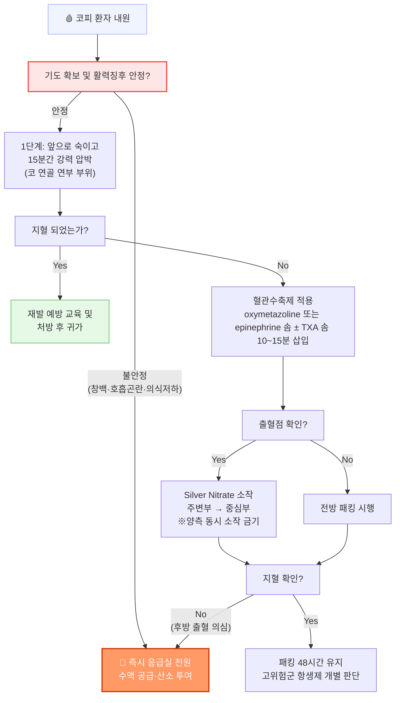

# 코피 Epistaxis

## <mark style="color:green;">일반 사항</mark>

* 흔한 출혈 부위 : **Kiesselbach's plexus** (전방 출혈, 90\~95%) — 비중격 전하방, 4개 혈관이 문합하는 부위
* 후방 출혈 : 비강 후방 Woodruff's plexus 기원; 고령·고혈압·동맥경화와 연관; 전방 패킹에 반응하지 않으며 출혈량이 많고 기도 위협 가능
* 흔한 연령 : 소아(＜15세), 고령층(＞70세); 사춘기 이후 성인 중간층에서 첫 발생 시 종양·출혈 질환 배제 필요
* ✽고혈압은 코피의 직접 원인이 아니나 출혈 지속 시간을 연장시킬 수 있음

## <mark style="color:green;">원인 및 위험 인자</mark>

### <mark style="color:orange;">국소 원인</mark>

* **외상** : 코 후빔(가장 흔함), 코 문지름, 강하게 코 풀기, 이물질, 스포츠 부상
* **점막 건조·자극** : 찬 건조 공기(겨울), 흡연, 중앙 집중식 난방
* **염증** : 알레르기·바이러스 비염, 부비동염
* **구조적 이상** : 비중격 만곡, 비용종, 비강 내 종양
* **의인성** : 비내 스테로이드 분무 시 비중격 직접 분사 (방향 오류)

### <mark style="color:orange;">전신 원인</mark>

* **항혈소판제** : aspirin, clopidogrel, NSAID
* **항응고제** : warfarin, NOAC(apixaban, rivaroxaban, dabigatran), enoxaparin, heparin
* **출혈 질환** : 혈소판 감소증(thrombocytopenia), Von Willebrand disease, 혈우병
* **전신 질환** : 간경변증, 신부전/요독증, 백혈병, 알코올 남용
* **허브·보완제** : 생강, 은행, 인삼 (혈소판 기능 억제)
* ✽**NOAC(직접 경구 항응고제) 복용자 주의** : apixaban, rivaroxaban, dabigatran 복용 고령 환자가 급증하고 있음. NOAC은 warfarin과 달리 INR로 모니터링이 안 되며, 기존 지혈법에 반응이 불량할 수 있음. 지혈 확인 후에도 재출혈 위험이 높으므로 \*\*압박 시간을 연장(최소 20분)\*\*하고, 반복 출혈 또는 지혈 불량 시 **즉시 상급병원 전원**이 원칙. Reversal agent(프락스바인드/idarucizumab, 안덱사/andexanet alfa)는 현실적으로 상급종합병원 응급실에서만 구비되어 있으므로, **일차 의원에서는 투약 중단 후 신속 전원**에 집중한다
* ✽**항응고제·항혈소판제 재개 시점** : 출혈 원인 및 혈전 위험도에 따라 개별 판단이 원칙; 일반적으로 경증 출혈·지혈 확인 후 **24시간**, 고위험군(심방세동·인공판막·DVT 등)은 **처방의와 협의 후 48\~72시간** 내 재개 권장 — 임의 중단 연장은 혈전 위험을 높이므로 반드시 처방의에게 확인

***

### <mark style="color:$danger;">🚩 Red Flags!</mark>

<mark style="color:$danger;">**즉각 의뢰/응급실**</mark>

* 적절한 압박에도 불구하고 **≥20\~30분 출혈 지속**
* **후방 출혈 의심** : 양측 anterior packing에도 출혈 감소 없음, 인후로 혈액 흘러내림
* **호흡 곤란, 기도 위협**, 흉통, 창백, 어지럼, 의식 혼탁 (혈역학적 불안정)
* **최근 코 외상·수술** 후 출혈, 코 종양 병력

<mark style="color:$warning;">**당일 또는 조기 재평가·의뢰**</mark>

* **＜2세** 또는 **사춘기 이후 처음** 시작된 코피 — 출혈 질환·종양 배제 필요; ✽2세 미만 영아의 코피는 매우 드물어 **비강 내 이물질** 또는 **아동 학대(신체 외상)** 가능성을 반드시 염두에 두어야 함
* 쉽게 멍듦, 다른 부위 출혈 동반, 치아 발치 후 지혈 지연 (출혈 질환 의심)
* 출혈 가족력
* 양쪽 코에서 동시 발생
* 항응고제·항혈소판제 복용 중 반복 출혈

<mark style="color:$info;">**외래 추적**</mark>

* 지혈 후 1\~2주 내 재발 여부 확인
* 반복 출혈 환자에서 원인 질환(비염·혈압·응고 이상) 관리
* 비내 스테로이드 분무 방향 재교육

***

## <mark style="color:green;">진단</mark>

### <mark style="color:orange;">검사</mark>

* **단순 전방 출혈** : 일반적으로 검사 불필요
* **아래 상황에서 고려** : 반복 출혈, Red Flags 해당, 출혈량 다량, 항응고제 복용
  * CBC, PT/INR, aPTT, 혈소판 수
  * 간·신기능 (기저 질환 의심 시)
  * 비강 내시경 (출혈 부위 확인, 종양 배제)
  * CT (외상·종양 의심 시)

### <mark style="color:orange;">전방 vs 후방 출혈 감별</mark>

<table data-header-hidden><thead><tr><th width="142"></th><th></th><th></th></tr></thead><tbody><tr><td></td><td><strong>전방 출혈 (Anterior)</strong></td><td><strong>후방 출혈 (Posterior)</strong></td></tr><tr><td>출혈 부위</td><td>Kiesselbach's plexus</td><td>Woodruff's plexus</td></tr><tr><td>빈도</td><td>90~95%</td><td>5~10%</td></tr><tr><td>연령</td><td>소아·청소년</td><td>고령(>50세)</td></tr><tr><td>출혈 방향</td><td>전방(콧구멍으로)</td><td>후방(인후로 넘어감)</td></tr><tr><td>혈역학적 영향</td><td>경미</td><td>다량, 흡인 위험</td></tr><tr><td>처치</td><td>압박·소작·전방 패킹</td><td>후방 패킹, 즉시 의뢰</td></tr></tbody></table>

***

## <mark style="background-color:$warning;">Management</mark>

### <mark style="color:orange;">단계별 지혈 처치</mark>

**1단계 — 즉시 처치 (First Aid)**

* 앉은 자세에서 머리를 약간 앞으로 숙임 (뒤로 젖히면 혈액이 인후로 넘어가 흡인 위험)
* 코 연골부(bony-cartilaginous junction 바로 아래)를 **엄지·검지로 10\~15분간 지속 압박**
* 구강 호흡 유도; 혈액은 뱉도록 지시 (삼키면 구역·구토 유발)

**2단계 — 국소 혈관수축제 적용**

* **oxymetazoline** 0.05% 비강 분무 또는 솜에 적셔 비강 내 적용 <mark style="color:blue;">\[레스피비엔, 오트리빈]</mark>
* **epinephrine** 1:1,000 솜 적용 — 단기 강력 혈관 수축; 혈압 상승·빈맥 주의
* ✽혈관수축제 단독으로 전방 출혈의 약 65%에서 지혈 가능

**2.5단계 — 국소 Tranexamic Acid (TXA) 적용**

* **적응** : 압박·혈관수축제에도 출혈이 지속되는 경우; 항응고제 복용자에서 패킹 전 시도
* **방법** : TXA 500 ㎎/5 ㎖ 앰플을 거즈 또는 솜에 적셔 출혈 부위에 **10\~15분간 삽입**
* ✽ NoPAC trial(2021) 등에서 packed gauze 대비 우월성은 확인되지 않았으나, 비침습적이고 항응고제 복용자·패킹 회피를 원하는 환자에서 여전히 유용한 옵션으로 간주됨
* ✽ 국내 TXA 앰플(트란사민 250 ㎎/5 ㎖, 500 ㎎/10 ㎖) 활용 가능; 전신 흡수량이 미미하므로 혈전색전증 우려는 낮음 <mark style="color:blue;">\[트란사민]</mark>

**3단계 — 소작 (Cautery)**

* 출혈점이 시각적으로 확인되는 경우 1차 치료법으로 적용
* **Silver nitrate 소작 시술 순서** :
  1. **전처치** : lidocaine 4% + epinephrine 1:1,000 혼합액(또는 각각 단독)을 솜에 적셔 비강 내 **5\~10분간 유치** — 통증 조절 및 혈관 수축으로 출혈 감소·시야 확보 극대화
  2. 솜 제거 후 출혈 부위를 건조
  3. **출혈점 주변부(정상 점막)에서 중심부(출혈점)로** 접근 — 중심부 직접 접촉 시 소작이 불충분하고 점막 손상 범위가 커짐
  4. silver nitrate stick을 5\~10초간 가볍게 접촉; 회백색 소작 흔적 확인
* **전기 소작** : 출혈량 많거나 silver nitrate 실패 시

> ⚠️ **양측 비중격 동시 소작 절대 금기**\
> 비중격은 양측 점막에서 혈액 공급을 받는다. 양측 대칭 부위를 동시에 소작하면 **비중격 혈관 공급이 양측에서 차단**되어 허혈성 괴사 → 비중격 천공이 발생할 수 있다. 양측 출혈 시 한 번에 한쪽만 시행하고, 반대쪽은 **최소 4\~6주 후** 시행한다.

**4단계 — 비강 패킹 (Nasal Packing)**

압박·소작에도 출혈이 지속될 때 시행

* **전방 패킹**
  * Petrolatum 거즈 : 비강 바닥부터 층층이 쌓아 올림
  * Absorbable packing (항응고제 복용자·출혈 질환 선호) : gelatin sponge <mark style="color:blue;">\[Surgifoam]</mark>, oxidized cellulose <mark style="color:blue;">\[Surgicel]</mark>, polymer foam <mark style="color:blue;">\[Merocel]</mark>
  * 지혈 후 **48시간 유지** 후 제거
  * ✽**Merocel 등 비흡수성 패킹 제거 시 주의** : 건조 상태에서 제거하면 혈전이 함께 떨어져 재출혈을 유발할 수 있음. 제거 직전 **생리식염수 또는 항생제 연고를 충분히 주입하여 충분히 윤활**시킨 후 부드럽게 제거한다
* **후방 패킹** : 전방 패킹 실패 시; 즉시 이비인후과 의뢰 + 입원; Foley 카테터(12\~14Fr) 또는 상업용 후방 패킹 사용

> ⚠️ **비강 패킹 항생제 예방 투여**\
> Toxic shock syndrome(TSS) 예방 목적으로 패킹 유지 기간 동안 항생제 투여가 관행적으로 시행되어 왔으나, **현재 근거는 불충분**하며 가이드라인에서 일률 권고하지 않음. 48시간 이내 제거 시 항생제 생략 가능; 패킹 장기화 또는 면역저하자에서는 개별 판단.

**5단계 — 수술 및 중재적 시술**

* **동맥 결찰(Ligation)** : 전방사골동맥, 내악동맥 결찰; 보존적 치료 실패 시
* **동맥 색전술(Embolization)** : 수술 고위험군에서 선호; 내악동맥·안면동맥 색전; 성공률 약 80\~90%
* ✽ 반복 출혈·혈관 이형성증(HHT) 환자에서 bevacizumab 국소 도포 또는 점막하 주사가 최근 주목받고 있음 (전문가 의뢰 영역)

### <mark style="color:orange;">코피 처치 알고리듬</mark>



<p align="center"><strong>코피 처치 알고리듬</strong></p>

***

### <mark style="color:orange;">기저 원인별 관리</mark>

<table><thead><tr><th width="228">원인</th><th>관리 방법</th></tr></thead><tbody><tr><td>항혈소판제 (aspirin, clopidogrel, NSAID)</td><td>가능 시 중단 (영향 최대 7~10일 지속); 필요 시 혈소판 수혈; 심혈관 적응증 시 중단 전 처방의 협진</td></tr><tr><td>항응고제 — warfarin</td><td>중단 + INR 확인; INR >3.0이면 Vit K(경구/IV) 투여; 다량 출혈 시 FFP 또는 4-factor PCC 고려</td></tr><tr><td>항응고제 — NOAC</td><td>투약 중단 후 신속 상급병원 전원이 일차 의원 원칙; reversal agent(idarucizumab, andexanet alfa)는 상급병원 응급실에서 평가; 재개는 지혈 확인 후 24~72시간(혈전 위험도에 따라 처방의 협의)</td></tr><tr><td>혈소판 감소증</td><td>혈소판 수혈 (혈소판 &#x3C;50,000/μL 또는 지혈 실패 시)</td></tr><tr><td>Von Willebrand disease</td><td>desmopressin(DDAVP) 투여; factor VIII replacement 고려</td></tr><tr><td>혈우병</td><td>해당 factor replacement</td></tr><tr><td>간경변증</td><td>PT/INR 모니터링; FFP 투여 고려</td></tr><tr><td>신부전·요독증</td><td>desmopressin 투여; 혈액 투석 고려</td></tr><tr><td>허브·보완제 (생강·은행·인삼)</td><td>투여 중단</td></tr></tbody></table>

***

## <mark style="color:green;">예방</mark>

* **점막 보습** : 식염수 비강 세척 **1일 2\~3회**; 바셀린 또는 mupirocin 연고(성냥 머리 크기)를 비강 외측벽(nasal alar 내측)에 **1일 2\~3회(아침·저녁·취침 전)** 도포 <mark style="color:blue;">\[에스로반]</mark>; 실내 습도 40\~60% 유지 (가습기 사용)
* **코 손상 회피** : 코 후비기 금지, 코 세게 풀기 금지
* **비내 스테로이드 올바른 분무법** : 분무구를 비중격이 아닌 \*\*외측 비강벽(눈 바깥쪽 방향)\*\*을 향하도록 기울여 분사 — 비중격 직접 접촉 시 점막 위축·출혈 유발
* **생활 습관** : 격렬한 운동·과로 수일간 제한, 뜨겁거나 매운 음식 회피, 금연
* **비염 관리** : 알레르기 비염 치료 — 코 후빔·비강 충혈 감소

***

### <mark style="color:red;">질병코드</mark>

R04.0 코피

***

## <mark style="color:purple;">처방례</mark>

> **처방례 1. 단순 전방 출혈 — 압박 지혈 후 점막 보습**
>
> ```
> 에스로반 연고 5 g/tube   소량   qd   (비강 외측벽 도포)
> ```
>
> _✽성냥 머리 크기로 비강 외측벽 내측에 도포. 비중격에 직접 바르지 않도록 교육. 식염수 비강 세척 1일 2회 병행_

> **처방례 2. 전방 출혈 지속 — 국소 TXA 적용 (압박·혈관수축제 후에도 출혈 지속)**
>
> ```
> 트란사민 주사액 250 ㎎/5 ㎖   1앰플   (거즈에 적셔 비강 내 10~15분 삽입)
> ```
>
> _✽전신 투여 아님 — 국소 도포 목적. 항응고제 복용자·패킹을 피하고자 하는 환자에서 우선 시도. 솜 또는 거즈에 충분히 적신 후 삽입하고 10\~15분 후 제거. 지혈 불충분 시 패킹으로 전환_

> **처방례 3. 전방 출혈 — 혈관수축제 처방 (반복 출혈, 재발 예방)**
>
> ```
> 레스피비엔 0.05% 비강 스프레이   2 puffs/비공   bid   × 3~5d
> ```
>
> _✽출혈 재발 방지 목적으로 3\~5일 단기 사용. 반동성 비충혈 예방을 위해 5일 이상 연속 사용 금지_

> **처방례 4. 비강 패킹 후 — 패킹 유지 기간 항생제 (개별 판단)**
>
> ```
> 오구멘틴 듀오 625 ㎎/T   1T   #2   × 2~3d  (패킹 제거 시까지)
> ```
>
> _✽근거 불충분하여 일률 투여는 권고되지 않음. 면역저하자, 48시간 이상 패킹 유지, 당뇨 등 고위험군에서 개별 판단. 패킹 유지 기간에만 투여하고 제거 즉시 중단. ✽375 ㎎ 제형 사용 시에는 2T #3(1일 3회)으로 처방_

> **처방례 5. 출혈 경향 동반 — warfarin 과다 항응고 (INR 3.0\~5.0, 출혈 경증)**
>
> ```
> 비타민 K1 (피토나디온) 10 ㎎/㎖ 주사액   1앰플   경구 복용 (오프라벨)
> ```
>
> _✽국내에서 경구용 Vit K1 정제(phytonadione)는 처방이 어려운 경우가 많음 — 주사액(10 ㎎/㎖)을 경구로 복용시키는 오프라벨 방식이 현실적으로 사용됨; INR >5.0 또는 출혈 다량 시 즉시 응급 의뢰. Vit K 투여 후 24시간에 INR 재확인. NOAC 복용자는 Vit K 효과 없음 — 상급병원 전원_

***

### <mark style="color:$success;">핵심 복약 지도</mark>

> **코피가 났을 때 올바른 응급 처치**
>
> * **머리를 앞으로 약간 숙이십시오.** 뒤로 젖히면 피가 목으로 넘어가 구역질이나 구토를 일으킬 수 있습니다.
> * \*\*코의 물렁한 부분(연골 부위)\*\*을 엄지와 검지로 꽉 쥐고 **10\~15분간 쉬지 않고** 압박하십시오. 중간에 확인하면 혈전이 떨어져 다시 출혈이 시작됩니다.
> * 입으로 호흡하고, 넘어온 피는 삼키지 말고 뱉으십시오.
> * 코를 풀거나 후비지 마십시오.
> * 15분 압박에도 멈추지 않으면 즉시 병원을 방문하십시오.

> **비강 점막 보습제(바셀린·에스로반) 사용법**
>
> * 연고를 콧구멍 안에 깊숙이 넣지 마십시오. **콧구멍 입구에 소량을 짜 넣고, 콧날개를 바깥에서 가볍게 문질러 안쪽 벽으로 퍼뜨리는 것이 가장 안전한 방법**입니다. 면봉을 깊숙이 삽입하면 오히려 점막에 상처를 낼 수 있습니다.
> * 하루 2\~3회(아침·저녁·자기 전) 규칙적으로 바르십시오. 특히 **취침 전 도포**가 야간·새벽 코피 예방에 가장 효과적입니다.
> * 비중격(코 가운데 칸막이)에 직접 바르지 마십시오 — 자극이 될 수 있습니다.
> * 식염수 비강 세척 후 도포하면 보습 효과가 더욱 좋습니다.

> **비내 스테로이드 스프레이 올바른 사용법**
>
> * 분무구를 **눈 바깥쪽 방향**(비강 외측벽)으로 향하게 하고 분사하십시오. 코 가운데 칸막이(비중격) 방향으로 분사하면 점막이 얇아지고 코피가 생길 수 있습니다.
> * 분무 후 코를 세게 풀지 마십시오.

> **언제 즉시 병원을 방문해야 하나요?**
>
> * 15분 이상 압박해도 출혈이 멈추지 않을 때
> * 피가 목 뒤로 계속 넘어올 때
> * 어지럼증, 창백함, 호흡 곤란이 동반될 때
> * 항응고제(와파린, 자렐토, 엘리퀴스 등)를 복용 중일 때
> * 코피가 자주 반복될 때 (월 2회 이상)

***

### <mark style="color:blue;">환자 안내서</mark>


**코피(비출혈)란 무엇인가요?**

코피는 코 안쪽 점막의 혈관이 터져 출혈이 생기는 상태입니다. 대부분은 코 입구 근처의 혈관이 풍부한 부위(Kiesselbach's plexus)에서 발생하며, 올바른 방법으로 압박하면 대부분 10\~15분 내에 멈춥니다. 드물게 코 안 깊은 부위에서 출혈이 생기면 혈액이 목으로 넘어가 처치가 더 어렵고 병원 치료가 필요합니다.


#### <mark style="color:$primary;">코피가 났을 때 — 올바른 응급 처치</mark>


**🚫 하지 말아야 할 것**

* 머리를 뒤로 젖히기 — 피가 목으로 넘어가 구역·구토·흡인 위험
* 휴지를 코에 꽉 채워 넣기 — 제거 시 혈전이 떨어져 재출혈 유발
* 중간에 확인하느라 손을 떼기 — 혈전 형성 방해
* 코를 세게 풀기 — 혈전 제거로 재출혈



**✅ 올바른 처치 순서**

1. **앉아서 머리를 약간 앞으로 숙입니다.**
2. **코의 물렁한 부분을 엄지·검지로 꽉 쥐고 10\~15분간 쉬지 않고 압박합니다.**
3. 입으로 호흡하고, 넘어온 피는 뱉습니다 (삼키지 마세요).
4. 냉찜질(얼음 팩)을 콧등에 올려두면 추가로 도움이 됩니다.
5. **15분 후에도 멈추지 않으면 즉시 병원을 방문하세요.**


#### <mark style="color:$primary;">코피가 자주 나는 이유는 무엇인가요?</mark>

* 가장 흔한 원인은 **코를 자주 후비거나, 세게 코를 푸는 습관**입니다.
* **겨울철 건조한 공기**도 코 점막을 약하게 만들어 코피를 일으킵니다.
* 아스피린, 와파린, 혈액 희석제를 복용 중이라면 작은 자극에도 코피가 쉽게 납니다.
* 알레르기 비염으로 코 점막이 자주 붓고 충혈되어 있으면 혈관이 터지기 쉽습니다.

#### <mark style="color:$primary;">코피 예방을 위한 생활 습관</mark>

* **코 후비는 습관을 줄이십시오.** 코가 건조하면 점막이 약해져 혈관이 쉽게 터집니다.
* **코는 한 번에 한쪽씩 부드럽게 푸십시오.**
* **식염수 비강 세척**을 하루 1\~2회 시행하면 점막 보습에 효과적입니다.
* 코가 자주 마른다면 자기 전 **바셀린 연고를 콧구멍 안쪽 외측 벽**에 소량 바르십시오.
* **실내 습도를 40\~60%로 유지**하십시오 (가습기 사용).
* 비내 스테로이드 스프레이를 사용 중이라면 **눈 바깥쪽 방향**으로 분사하십시오.
* 코피 후 수일간은 **격렬한 운동, 뜨겁거나 매운 음식, 음주, 흡연을 피하십시오.**

#### <mark style="color:$primary;">이럴 때는 즉시 병원을 방문하세요</mark>

* 15분 이상 압박해도 출혈이 멈추지 않을 때
* **목 뒤로 피가 계속 넘어오거나** 피를 자꾸 삼키게 될 때
* **평소보다 얼굴이 창백해지거나, 어지럽거나, 앉아 있기 힘들 때** (혈액 손실 의심)
* 호흡이 곤란하거나 가슴이 답답할 때
* 혈액 희석제(와파린, 자렐토, 엘리퀴스 등)를 복용 중일 때
* 코피가 한 달에 2회 이상 반복될 때
* 어린 아이(2세 미만)에서 코피가 날 때

***


**🩺 코피 예방 3계명**

**① 손톱을 짧게 깎으세요** — 특히 소아에서 코 후비기는 가장 흔한 코피 원인입니다. 손톱이 짧으면 점막 손상을 줄일 수 있습니다.

**② 자기 전 비강 연고를 바르세요** — 취침 전 콧구멍 입구에 바셀린 또는 보습 연고를 소량 도포하면 야간·아침 코피를 크게 줄여줍니다.

**③ 지혈 후 24시간은 코를 절대 풀지 마세요** — 새로 형성된 혈전이 떨어져 재출혈이 생깁니다. '킁킁'거리는 것도 피하시고, 재채기는 입을 열고 하십시오.

