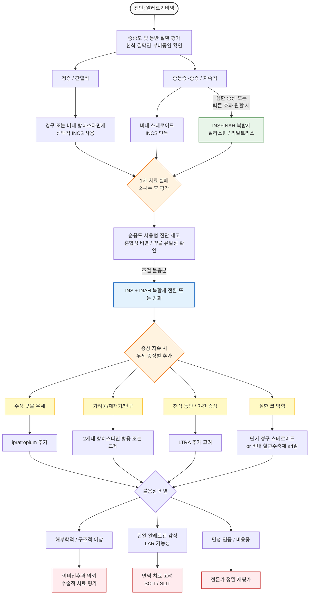

# 알레르기비염 Allergic Rhinitis

## <mark style="color:green;">일반 사항</mark>

* 특정 알레르겐에 감작된 사람에서 알레르겐이 비강 점막에 노출된 후 IgE 매개 면역 반응에 의해 발생하는 코의 염증 반응; 콧물, 코막힘, 재채기, 코가려움증이 특징
* 유병률 : 성인의 10\~30%, 소아의 \~40%; 국내 성인 유병률은 최근 약 20% 수준으로 추정
* 발생 연령 : 평균 8\~12세; 1세 이전에는 aeroallergen sensitization이 발생하지 않음
* ✽알레르기비염은 삶의 질, 수면, 학업·직업 수행 능력에 유의미한 영향을 미치며 천식, 부비동염, 중이염 등과 밀접하게 연관됨

## <mark style="color:green;">분류</mark>

### <mark style="color:orange;">기간</mark>

* **간헐적** : 증상 기간 ＜4일/주 또는 ＜4주/episode; 흔히 실외 항원(꽃가루) 관련
* **지속적** : 증상 기간 ≥4일/주 및 ≥4주/episode; 흔히 실내 항원(집먼지진드기, 동물 털) 관련

### <mark style="color:orange;">중증도</mark>

* **경증** : 증상은 있으나 일상생활·수면에 장애가 없으며 괴롭지 않은 상태
* **중등증\~중증** : 일상생활(직장, 학업, 운동)과 수면에 장애가 있으며 괴로운 상태

### <mark style="color:orange;">기타 분류</mark>

* **Seasonal** : 계절적 항원에 반응하여 매년 같은 시기에 발생
* **Perennial** : 1년 내내 발생; 주로 실내 항원(집먼지진드기, 동물 비듬·털) 관련
* **Local allergic rhinitis (LAR)** : 전신 감작(피부단자검사 음성, 혈중 특이 IgE 정상)은 없으나 비강 점막 내에서만 항원 특이 IgE가 국소 생성되어 eosinophil 매개 염증이 발생하는 상태; 임상 양상은 AR과 구별하기 어려움 — 치료 반응 불충분 시 반드시 감별 고려; 확진은 비강 유발 검사(Nasal Provocation Test, NPT) 양성으로 이루어지며 알레르기내과·이비인후과 의뢰 필요; ✽코 세척액 내 특이 IgE 측정이 진단 보조 수단으로 연구되고 있으나 아직 임상 표준화 단계는 아님
* **혼합성 비염(Mixed Rhinitis)** : AR과 비-알레르기성 비염(NAR)이 혼재된 형태; 전체 비염 환자의 약 34\~50%를 차지하는 것으로 추정됨; 알레르겐 노출뿐 아니라 온도·습도 변화·자극 물질에도 반응 — 치료 반응이 불완전할 때 반드시 고려; 비내 steroid + 비내 항히스타민 병용이 필요한 경우 많음

## <mark style="color:green;">원인 및 위험 인자</mark>

### <mark style="color:orange;">알레르겐</mark>

* **실외(계절성)** : 봄 — 나무 꽃가루; 여름 — 꽃, 풀; 가을 — 돼지풀, 쑥, 곰팡이
* **실내(통년성)** : 집먼지진드기 배설물, 애완동물 비듬·털, 바퀴벌레 단백질, 곰팡이 포자

### <mark style="color:orange;">위험 인자</mark>

* 아토피·습진·천식 등 다른 알레르기 질환 보유
* 알레르기 가족력(특히 부모 모두 해당)
* 흡연 노출(특히 출생 후 첫 1년간 모성 흡연)
* 항생제 조기 사용; 고형 음식·알레르겐 식품에 대한 조기·반복 노출; 실내 알레르겐 노출

### <mark style="color:orange;">약물 관련 비염 (Drug-induced Rhinitis) 및 노인성 비염</mark>

* **약물 관련 비염** — 다음 약제들이 비염 증상을 유발·악화시킬 수 있음; 고령 다약제 복용 환자에서 특히 주의; 치료 실패 또는 비전형 증상 시 복용 중인 약물 목록 전수 확인 권고
  * **① Rhinitis Medicamentosa (협의)** : 비내 혈관수축제(oxymetazoline, xylometazoline 등) 5일 이상 연속 사용 시 반동성 비충혈 발생 — 가장 흔한 원인; 중단이 치료이나 일시적 악화로 순응도가 낮음
  * **② 기타 약물에 의한 비강 증상** :
    * **항고혈압제** : beta-blocker (비충혈·코 막힘), ACE 억제제 (콧물·비강 자극), methyldopa, reserpine, hydralazine
    * **아스피린·NSAIDs** : 아스피린 과민성 비염(AERD) — 비용종·천식 동반 3중 연관; NSAID-exacerbated respiratory disease (NERD = AERD, formerly Samter's triad)
    * **Alpha-blocker** (전립선 비대증 치료제) : tamsulosin 등 — 비강 혈관 확장으로 코 막힘 유발 가능
    * **기타** : 경구 피임약, phosphodiesterase-5 억제제 (sildenafil 등)
* **노인성 비염** — 고령에서 알레르기 감작 없이 발생하는 비-알레르기성 비염; 콧물이 주 증상(특히 식사 중 gustatory rhinitis); 점막 위축·건조성 비염 동반 흔함; 항히스타민제보다 비내 ipratropium이 더 효과적
* ✽치료 실패 또는 비전형 증상 시 복용 중인 약물 목록 전수 확인 권고

### <mark style="color:orange;">병태생리</mark>

* 알레르겐 → antigen-presenting cells → T-cell 활성화 → cytokine → B-lymphocyte·eosinophil 작용
* B-lymphocyte → IgE → mast cell·basophil 감작·탈과립 → histamine 방출 → 가려움·재채기·분비 증가 **[early-phase response, 수 분~1시간]**
* Eosinophil → IL-5 → 독성 물질 → 점막 손상 → 코 막힘 **[late-phase reaction, 수 시간 후]**

***

### <mark style="color:red;">🚩 Red Flags!</mark>

<mark style="color:red;">**즉각 의뢰/이비인후과**</mark>

* **한쪽에만 반복**되는 증상 — 비강 내 종양(반전성 유두종 포함, 특히 고령 남성), 이물질, 비중격 천공 배제
* **출혈성 분비물** 동반 또는 **지속되는 편측 안면 통증** — 악성 종양 또는 진균성 부비동염 의심
* **안와·두개 합병증** 의심 증상 : 안구 돌출, 시력 저하, 심한 두통, 발열 — 급성 합병성 부비동염

<mark style="color:orange;">**당일 또는 조기 재평가·의뢰**</mark>

* **표준 치료에도 불구하고 호전되지 않는 경우** — 진단 재고, 비강 내시경 필요
* **재발성 부비동염·중이염** 등 심각한 합병증이 반복 발생
* **약물에 반응하지 않는 하비갑개 비대증** — 수술 적응증 평가 필요
* 비중격 또는 bony pyramid의 **해부학적 변이**가 증상 원인으로 의심

<mark style="color:blue;">**외래 추적**</mark>

* 치료 시작 2\~4주 후 반응 평가; 비내 steroid는 효과 발현까지 2주 이상 소요
* 지속적 AR 환자에서 알레르겐 동정(피부단자검사 또는 혈청 특이 IgE) 및 면역 치료 고려 시점 재평가
* 천식, 부비동염, 결막염 등 동반 질환 관리

***

## <mark style="color:green;">임상 양상</mark>

* **코 증상** : 코 가려움, 재채기, 콧물(묽은 수양성\~점성), 코 막힘, 후비루
* **코 징후** : 점막 부종, 창백 또는 홍반성 점막, 비갑개 비대, 비용종
* **코 외 증상** : 구강 호흡, 기침, 눈·인두 가려움, 눈물, 코골이, 수면 장애, 피로, 두통
* **동반 질환** : 비부비동염, 아토피·습진·두드러기, 천식, 알레르기성 결막염, 중이염
* ✽지속적 비염 환자는 적응되어 증상을 과소 보고하는 경향이 있음 — 능동적 문진 필요

### <mark style="color:orange;">AR vs 비-알레르기비염(non-AR) 감별</mark>

<table><thead><tr><th width="158">임상 특징</th><th>AR</th><th>non-AR</th></tr></thead><tbody><tr><td>악화 요인</td><td>알레르기 항원 노출; 계절 영향 있음</td><td>지속; 온도·습도·냄새·매연, 바이러스 감염</td></tr><tr><td>알레르기 가족력</td><td>흔함</td><td>적음</td></tr><tr><td>코 가려움</td><td>흔함</td><td>적음</td></tr><tr><td>재채기</td><td>현저함</td><td>적음</td></tr><tr><td>콧물</td><td>흔함</td><td>적음</td></tr><tr><td>후비루</td><td>적음</td><td>현저함</td></tr><tr><td>코 점막 소견</td><td>창백·부종</td><td>발적</td></tr><tr><td>기타</td><td></td><td>두통, 후각 감퇴, 부비동염 동반 多</td></tr></tbody></table>

***

## <mark style="color:green;">진단</mark>

* 증상·병력·신체 검진 및 치료 반응으로 임상 진단

### <mark style="color:orange;">AR vs 부비동염 vs 비용종 감별</mark>

<table><thead><tr><th width="160">핵심 포인트</th><th width="190">알레르기비염</th><th width="190">급성/만성 부비동염</th><th>비용종</th></tr></thead><tbody><tr><td>대표 증상</td><td>재채기, 맑은 콧물, 코가려움, 코막힘</td><td>코막힘, 농성 콧물, 안면 통증/압박감</td><td>지속적 코막힘, 후각 저하</td></tr><tr><td>콧물 성상</td><td>맑고 수양성</td><td>누렇고 끈적한 purulent</td><td>많지 않거나 후비루</td></tr><tr><td>재채기</td><td>매우 흔함</td><td>드묾</td><td>드묾</td></tr><tr><td>코/눈 가려움</td><td>매우 특징적</td><td>거의 없음</td><td>없음</td></tr><tr><td>눈 증상</td><td>결막 가려움·눈물·충혈 흔함</td><td>드묾</td><td>없음</td></tr><tr><td>후각 저하</td><td>경미하거나 없음</td><td>가능</td><td>매우 흔함 (중요)</td></tr><tr><td>안면 통증</td><td>드묾</td><td>대표적</td><td>거의 없음</td></tr><tr><td>발열</td><td>없음</td><td>급성 세균성에서 가능</td><td>없음</td></tr><tr><td>증상 패턴</td><td>계절성/노출 관련, 반복적</td><td>감기 후 악화, 지속적</td><td>서서히 진행, 만성</td></tr><tr><td>악화 요인</td><td>꽃가루, 집먼지, 동물털</td><td>URI 이후, 치과질환</td><td>천식, NERD 동반</td></tr><tr><td>비내시경/진찰</td><td><strong>창백(Pale)</strong>하고 부종 있는 점막</td><td>충혈(Hyperemic), 농성 분비물</td><td>창백하고 반투명한 종물</td></tr><tr><td>편측 증상</td><td>드묾</td><td>가능</td><td>편측이면 🚩 red flag</td></tr><tr><td>반응 좋은 치료</td><td>INCS, 항히스타민제</td><td>생리식염수 + INCS ± 항생제</td><td>INCS ± 경구 스테로이드</td></tr><tr><td>Specialist 의뢰</td><td>불응성/면역치료 고려</td><td>반복 재발/합병증 의심</td><td>ENT 평가 거의 필요</td></tr></tbody></table>

### <mark style="color:orange;">검사</mark>

* **Routine Lab** : 일반적으로 정상; 혈청 총 IgE는 환자의 약 1/3에서만 상승(비특이적)
* **피부단자검사(Skin-prick test)** : 민감도 높고 다수 알레르겐 동시 평가 가능; 항히스타민제 복용 중 또는 피부 질환(아토피, 피부묘기증) 시 시행 불가
  * 식품 알레르겐 : 3개월 영아부터; 흡입 알레르겐 : 2\~4세부터 양성 가능
* **혈청 특이 IgE 검사** : 약물·피부 상태에 무관하게 시행 가능; 항원 수 한정, 피부단자검사보다 민감도 낮음; 피부단자검사 시행 어려운 경우 대안
* ✽AR 확진 목적으로 aeroallergen 피부단자검사 또는 IgE 검사 권고 \[AAAAI]
* **코 내시경·영상 검사** : 비전형 증상, 치료 무반응, 비용종·종양 의심 시

***

## <mark style="background-color:yellow;">Management</mark>

### <mark style="color:orange;">치료 원칙</mark>

* **알레르겐 회피 + 비강 세척 + 약물 치료** 의 3요소 병행
* **비내 corticosteroid가 1차 선택제** — 모든 코 증상(재채기·콧물·코막힘·가려움)에 가장 우수한 효과
  * Seasonal AR : 비내 steroid ± 비내 또는 경구 항히스타민
  * Perennial AR : 비내 steroid ± 비내 항히스타민
* **중등증 이상에서는 초기부터 INS+INAH 복합제 우선 고려** — 단계적 step-up(단일제 추가)보다 초기부터 복합제를 선택하면 삶의 질 개선 속도가 유의미하게 빠름 (MUSE trial 등 RCT 근거); 기존 단일제 사용 환자가 증상 조절에 실패한 경우도 복합제로 전환 권고 \[최신 ARIA 권고 경향]; <mark style="color:blue;">\[딜라스틴 나잘]</mark>(fluticasone p.+azelastine), <mark style="color:blue;">\[리알트리스 나잘스프레이 액]</mark>(mometasone+olopatadine); ✽두 제제 모두 보험 급여 기준이 변경될 수 있으므로 처방 시점에 확인 필요
* 알레르겐(꽃가루) 유행 **2주 전부터** 예방적 약물 치료 시작 시 증상 감소 효과
* **Step-down 전략** : 증상이 잘 조절된 상태가 4주 이상 지속되면 약물 강도를 한 단계 낮춤 — 복합제 → 단일제, 또는 분무 횟수 절반, 또는 간헐적 사용으로 전환 고려; "언제까지 써야 하나요?" 질문에 미리 기준을 제시하면 순응도 향상

**🔍 알레르기비염 치료 실패 TOP 7 — 반드시 확인하세요**

1. **약물 순응도 불량** — 비내 스테로이드 효과는 2주 후부터; 조기 중단이 가장 흔한 실패 원인
2. **분무 사용법 오류** — 비중격 방향 분사, 고개 과도하게 뒤로 젖힘, sniffing 너무 강함, 불규칙 사용
3. **혼합성 비염(Mixed Rhinitis)** — AR+NAR 혼재; 단일제 효과 불충분 → INS+INAH 복합제 필요
4. **약물 유발성 비염** — 복용 중인 약물 전수 확인 (beta-blocker, ACE억제제, NSAIDs, 비내 혈관수축제)
5. **해부학적 이상** — 비중격 만곡, 비용종, 하비갑개 비대; 이비인후과 의뢰
6. **진단 오류** — Local allergic rhinitis(LAR), 만성 부비동염, 혈관운동성 비염 재평가
7. **수면무호흡증** — 코 막힘으로 오인; 수면 장애·주간 졸음 동반 시 의심


### <mark style="color:orange;">중증도별 치료 방침</mark>

<table><thead><tr><th width="200">중증도</th><th width="260">1차 선택</th><th>비고 및 추가 옵션</th></tr></thead><tbody><tr><td>경증, 간헐적</td><td>• 경구 항히스타민제(OAH)<br>• 비내 항히스타민제(INAH)<br>• 비내 스테로이드(INCS) 중 선택</td><td>코 막힘이 주 증상이면 INCS 우선; 안구 증상 동반 시 경구 항히스타민 선호</td></tr><tr><td>경증~중등증, 지속적</td><td>• INCS<br>• 또는 INCS + OAH/INAH 병용</td><td>콧물 지속 시 비내 ipratropium 추가; 코 막힘 심하면 단기 비내 혈관수축제 (≤4일)</td></tr><tr><td>중등증~중증</td><td>• INCS 또는<br>• INCS+INAH 복합제 <mark style="color:blue;">\[딜라스틴 나잘]</mark> <mark style="color:blue;">\[리알트리스 나잘스프레이 액]</mark></td><td>빠른 증상 조절이 필요하거나 단일제 실패 시 복합제 우선; 수성 콧물 지속 시 ipratropium 추가</td></tr><tr><td>중증, 지속적 (불응성)</td><td>• INCS+INAH 복합제 우선<br>• 조절 불충분 시 아래 추가 고려</td><td>• 심한 코 막힘 : 경구 스테로이드 short burst (5~7일, specialist setting) or 비내 혈관수축제 단기<br>• 천식 동반·NERD·야간 증상 : LTRA 선택적 추가¹<br>• 증상 지속 : 면역 요법 평가<br>• 구조적 이상 : 이비인후과 의뢰</td></tr></tbody></table>

_1) LTRA(montelukast 등)는 routine 중증 옵션이 아님. 천식 동반, NERD, 야간 증상, 운동 유발 증상이 있는 경우 선택적으로 추가 고려. FDA 박스형 경고(신경정신계 부작용) 고려하여 처방 전 위험-이익 충분히 논의_

### <mark style="color:orange;">알레르기비염 치료 알고리듬</mark>



***

## <mark style="color:green;">비-약물 치료</mark>

### <mark style="color:orange;">알레르겐 회피</mark>

* 금연; 알레르겐 회피는 증상 완화에 효과적이나 완전한 회피는 현실적으로 어려움
* 환경 조절 효과 발현까지 수 주\~수개월 소요

<table><thead><tr><th width="200">구분</th><th>내용</th></tr></thead><tbody><tr><td>집먼지진드기에 대한 조치¹</td><td>• 알레르겐 불투과 천으로 매트리스, 베개, 이불을 감쌈<br>• 카펫 및 부드러운 가구에 대한 진드기 살균제 사용</td></tr><tr><td>꽃가루 회피 조치²</td><td>• 꽃가루가 많을 때 야외 활동 제한 (이른 아침, 이른 저녁, 풀 베는 동안)<br>• 집과 차에서 창문을 닫고 지내기<br>• 꽃가루 노출 후 샤워/세척<br>• 환경 지수가 나쁠 때 야외 세탁물 건조 회피</td></tr></tbody></table>

_1) 권고 수준 Grade A(충분한 근거). 2) 권고 수준 Grade D(전문가 의견)_

<p align="center"><em><mark style="color:blue;">Ref. BSACI guideline for the diagnosis and management of allergic and non-allergic rhinitis. 2017.</mark></em></p>

### <mark style="color:orange;">비강 세척</mark>

* **효과** : 비강 내 점액·알레르겐·자극 물질 제거, sinus passage 습윤화, 섬모 운동 향상
* **방법** : 고개를 옆으로 뉘이고 위쪽 코에 따뜻한 등장성 생리식염수 **>100 ㎖**를 주입하여 아래쪽 코로 흘러나오게 함; 1일 1\~2회 시행
  * 세척액 제조 : 3분간 끓여 식힌 물 250 ㎖ + 소금 ½\~1 heaping teaspoon (3.5\~7 g); 1주일 경과한 세척액은 폐기
  * 기구 : 30 ㎖ 주사기, 플라스틱 squeeze 병, Neti pot; 2\~3주마다 교체·소독
* ✽AR에서는 등장성 식염수 스프레이 방식과 대용량 관류(irrigation) 모두 사용 가능하며, 환자 순응도 및 선호도에 따라 선택; 만성 부비동염(CRS)에서는 고용량 관류가 선호됨; 일부 대한천식알레르기학회 자료에서는 스프레이 방식을 제시하였으나, 방식 간 우열보다는 꾸준한 시행 여부가 더 중요
* ✽자일리톨 함유 비강 세척액(예: Xlear)과 히알루론산 첨가 세척액이 점막 수분 유지 및 항균 효과로 주목받고 있으나, 현재 AR에서의 임상적 이득은 소규모 연구 수준으로 근거가 확립되지 않음 — 일반 생리식염수로 충분

***

## <mark style="color:green;">약물 치료</mark>

* 지속 유지 치료가 간헐적 치료보다 증상 조절에 효과적; 환자 특성에 따라 결정
* ✽매일 사용이 필요시 사용보다 증상 개선에 더 효과적이나 삶의 질 점수는 유사
* ✽비내 분무제는 한 가지만 사용하고 나머지는 경구제 선택, 또는 복합 분무제 선택

### <mark style="color:orange;">알레르기비염 치료제 효과 비교</mark>

<table><thead><tr><th width="160">치료 제제</th><th width="70"></th><th width="70">재채기</th><th width="70">콧물</th><th width="70">코 막힘</th><th width="80">코가려움</th><th width="80">안구 증상</th></tr></thead><tbody><tr><td>steroid</td><td>비내</td><td>+++</td><td>+++</td><td>++</td><td>++</td><td>++</td></tr><tr><td>항히스타민</td><td>비내</td><td>++</td><td>++</td><td>++¹</td><td>++</td><td>-</td></tr><tr><td></td><td>경구</td><td>++</td><td>++</td><td>+</td><td>+++</td><td>++</td></tr><tr><td></td><td>점안</td><td>-</td><td>-</td><td>-</td><td>-</td><td>+++</td></tr><tr><td>코 울혈 제거제</td><td>비내</td><td>-</td><td>-</td><td>++++</td><td>-</td><td>-</td></tr><tr><td></td><td>경구</td><td>-</td><td>-</td><td>+</td><td>-</td><td>-</td></tr><tr><td>Cromolyn</td><td>비내</td><td>+</td><td>+</td><td>+</td><td>+</td><td>-</td></tr><tr><td></td><td>점안</td><td>-</td><td>-</td><td>-</td><td>-</td><td>++</td></tr><tr><td>항콜린제</td><td>비내</td><td>-</td><td>++</td><td>-</td><td>-</td><td>-</td></tr><tr><td>항류코트리엔</td><td>경구</td><td>-</td><td>+</td><td>++</td><td>-</td><td>++</td></tr><tr><td>식염수 코 세척</td><td></td><td>-</td><td>+</td><td>+</td><td>-</td><td>-</td></tr><tr><td>면역 치료</td><td></td><td>+</td><td>+</td><td>+</td><td>-</td><td>+</td></tr><tr><td>비내 steroid+비내 항히스타민</td><td></td><td>+++</td><td>+++</td><td>+++</td><td>+++</td><td>+++</td></tr></tbody></table>

_1) 비내 azelastine 등 최신 INAH는 코 막힘에 대해 경구 항히스타민제보다 우월하다는 연구 다수; 경구 항히스타민제 단독 대비 우위_

<p align="center"><em><mark style="color:blue;">Ref. Treatment of Allergic Rhinitis. AFP 2010;81(12):1440–46. / BSACI guideline 2017.</mark></em></p>

### <mark style="color:orange;">Steroid</mark>

#### 비내용 제제

* **기전** : 비강 점막 염증 세포에 작용 → IgE 관련 히스타민 분비 억제
* **대상** : 코의 모든 증상; 가장 우수한 효과
* **효과 발현** : 분무 후 **수 시간(3\~5시간) 이내에 효과가 시작**되며; 염증이 완전히 가라앉아 최대 효과에 도달하기까지는 **2주 이상** 매일 사용 필요; 치료 기간 중 50% 이상 투여해야 유의미한 효과
  * ✽환자 복약 지도 포인트 : "첫날부터 조금씩 효과가 시작되지만, 최대 효과를 보려면 2주가 걸립니다"라고 설명하면 초기 포기를 방지할 수 있음
* 증상 완화에 따라 1주 간격으로 점진적 감량; 또는 4\~8주 매일 사용 후 분무 빈도를 반으로 줄여 유지
* 임상적으로 큰 효과 차이는 없으나, 일부 메타분석에서 fluticasone furoate / fluticasone propionate가 증상 조절 측면에서 다소 우수할 가능성이 제시됨; 전신 흡수율·국소 자극·환자 선호도는 제제마다 상이
* ✽**소아·임산부 처방 시 전신 흡수율이 핵심 선택 기준** : budesonide(>10%)는 상대적으로 전신 영향 가능성이 높으므로, 소아 장기 처방 및 임산부에서는 mometasone furoate / fluticasone furoate(<0.1%)를 우선 선택; ciclesonide(<0.1%)도 선택지; triamcinolone, beclomethasone은 흡수율 데이터 불충분
* 임신 중 사용 가능 (Category B/C); **mometasone, fluticasone** 임신 중 선호
* **국소 부작용** : 코·목 자극, 코피, 코 마름, 쓴맛, 칸디다 증식(드묾)
* **전신 부작용** : 유의미한 전신 영향 없음; 소아 장기 사용 시 최종 신장에 미치는 영향은 없는 것으로 알려져 있으나 성장 모니터링 권고
* **상호작용** : fluticasone — 강한 CYP3A4 저해제(예: itraconazole)와 상호작용 가능

<table><thead><tr><th width="279">성분명 [상품명]</th><th width="130">성인 용량*</th><th width="120">소아 용량*</th><th width="80">최소 연령</th><th width="90">전신 흡수율</th></tr></thead><tbody><tr><td>ciclesonide <mark style="color:blue;">[옴나리스 나잘]</mark></td><td>2회 puffs qd</td><td>-</td><td>6세</td><td>&lt;0.1%</td></tr><tr><td>mometasone f. <mark style="color:blue;">[나조넥스 나잘]</mark></td><td>1~2회 puffs qd</td><td>1회 puff qd</td><td>2세</td><td>&lt;0.1%</td></tr><tr><td>fluticasone f. <mark style="color:blue;">[아바미스 나잘]</mark></td><td>1~2회 puffs qd</td><td>1회 puff qd</td><td>2세</td><td>&lt;1%</td></tr><tr><td>fluticasone p. <mark style="color:blue;">[후릭소나제 코악]</mark></td><td>2회 puffs qd~bid</td><td>1~2회 puffs qd</td><td>4세</td><td>&lt;2%</td></tr><tr><td>beclomethasone <mark style="color:blue;">[리노클레닐 비액]</mark></td><td>2회 puffs qd</td><td>-</td><td>-</td><td>-</td></tr><tr><td>budesonide <mark style="color:blue;">[나리타 정비액]</mark></td><td>1~2회 puffs bid</td><td>1회 puff bid</td><td>6세</td><td>&gt;10%</td></tr><tr><td>triamcinolone <mark style="color:blue;">[나자코트 비액]</mark></td><td>1~2회 puffs qd</td><td>1~2회 puffs qd</td><td>2세</td><td>-</td></tr></tbody></table>

_\*비공 당 분무 횟수_\
※ 복합제 : fluticasone-azelastine — 비공 당 1 puff bid <mark style="color:blue;">\[딜라스틴 나잘]</mark>; olopatadine-mometasone furoate — 비공 당 2 puffs bid <mark style="color:blue;">\[리알트리스 나잘스프레이 액]</mark>

#### 경구제

* **대상** : 다른 치료로 조절되지 않는 심한 코/눈 증상
* **용법** : 단기 사용 (5\~7일 이내); 처음 2\~3일 중간 용량 후 저용량 유지 가능
  * 중간 이하 용량(prednisolone ≤30 ㎎/d)으로 ＜2주 단기 투여 후 중단 시 tapering 불필요
* prednisolone : 5\~60 ㎎/d <mark style="color:blue;">\[소론도]</mark>
* methylprednisolone : 4\~48 ㎎/d <mark style="color:blue;">\[메치론]</mark>

#### 주사제

* 다른 제형보다 우월하다는 근거 부족; 경구제 대비 mineralocorticoid 영향 크고 작용 시간 길어 **권고하지 않음**

### <mark style="color:orange;">항히스타민제</mark>

#### 비내용 제제

* 경구 항히스타민제 대비 동등 이상 효과; 비내 스테로이드보다 효과 적고 부작용 多
* **대상** : 간헐적·계절적 AR; 비-알레르기성 혈관운동성 비염; 중증 AR에서 비내 steroid와 병용
* **효과 발현** : 분무 15\~30분 내 시작, 약 4시간 지속
* **부작용** : 쓴맛, 국소 자극, 코피, 두통
* azelastine : 비공 당 1\~2 puffs bid <mark style="color:blue;">\[아젭틴 비액]</mark>

#### 경구제

* **대상** : 콧물·재채기·가려움·눈물·안구 충혈 (✽코 막힘에는 효과 적음)
* 알레르겐 노출 전 사용 시 노출 **2\~5시간 전** 투여
* 2세대 제제 우선 선택 — 졸음·항콜린 부작용 적거나 없음
* non-AR 콧물에는 1세대 제제가 항콜린 작용으로 더 효과적
* ✽항히스타민제 증량 또는 동일 계열 병용은 효과 상승 없이 부작용 증가 → 비내 steroid 등 다른 약제 병용 권고
* cetirizine : 일부 졸음; 5\~10 ㎎ qd <mark style="color:blue;">\[지르텍]</mark>
* levocetirizine : 대부분 non-sedating; 5 ㎎ qd <mark style="color:blue;">\[씨잘]</mark>
* fexofenadine : non-sedating; 120 ㎎ qd <mark style="color:blue;">\[알레그라]</mark>
* loratadine : 10 ㎎ qd <mark style="color:blue;">\[클라리틴]</mark>
* desloratadine : 5 ㎎ qd <mark style="color:blue;">\[에리우스]</mark>
* olopatadine : 5 ㎎ bid <mark style="color:blue;">\[알레락]</mark>

### <mark style="color:orange;">α-Adrenergic Agonist (코 울혈 제거제)</mark>

#### 비내용 제제

* **기전** : 교감 신경 항진 → 코 점막 혈관 수축
* **대상** : 심한 코 막힘; 코 막힘에 가장 강력하나 부작용으로 사용 제한
* **부작용** : rebound rhinitis(반동성 비충혈), 고혈압
* **사용 제한** : 1일 2회 이내, ≤4일/월; 소아에서 권고하지 않음 (비보험)
* phenylephrine <mark style="color:blue;">\[시네프린]</mark>, naphazoline+chlorpheniramine <mark style="color:blue;">\[나리스타]</mark>, xylometazoline <mark style="color:blue;">\[오트리빈]</mark>, oxymetazoline <mark style="color:blue;">\[레스피비엔]</mark>

#### 경구제

* **부작용** : 불면, 식욕 부진, 불안정, 두근거림, 혈압 상승, 진전, 어지럼, 두통, 소변 저류
* 고령·부정맥·CVD·조절되지 않는 고혈압·배뇨 장애·녹내장·갑상선항진증 환자에서 **주의**
* pseudoephedrine : 30\~60 ㎎ tid\~qid <mark style="color:blue;">\[슈다페드]</mark>
* phenylephrine : pseudoephedrine보다 효과 적고 10 ㎎에서 유효 근거 부족

### <mark style="color:orange;">항콜린제, 비내</mark>

* **기전** : 부교감 신경 억제 → 코 점막 mucus production 감소
* **대상** : 콧물 증상(✽코 막힘·재채기에는 효과 적음); 혈관운동성 비염·gustatory rhinitis에 유용
* 비내 steroid 병용 시 효과 상승; 비내 steroid에도 지속되는 콧물에 추가 고려
* **부작용** : 코·입마름, 국소 자극, 코 막힘, 코피, 두통
* ipratropium : 비공 당 1 puff bid\~tid <mark style="color:blue;">\[리노벤트]</mark>

### <mark style="color:orange;">Cromolyn, 비내</mark>

* **기전** : mast cell 안정화 → 히스타민 등 염증 매개체 방출 감소
* **효과** : AR 전반적 증상에 약간의 효과; 항히스타민제보다 효과 적음
* **효과 발현** : 4\~7일째 시작, 수 주 후 최대 효과
* 간헐적 AR(예: 꽃가루) 예방적 사용 — 증상 발생 전부터, 알레르겐 노출 **30분 전** 투여
* **부작용** : 코피, 국소 자극, 재채기
* 용법 : 3\~6회/d (반감기 짧음) → 2\~3주 후 감량

### <mark style="color:orange;">항류코트리엔제 (Leukotriene Modifier)</mark>


⚠️ **FDA 박스형 경고 — Montelukast 신경정신계 이상반응**

불안, 우울, 수면 장애, 공격성, 자살 충동 등 신경정신계 부작용이 보고됨. **소아·청소년, 불안·우울 병력 환자에서 특히 주의.** 경증 AR에서 routine first-line으로 사용하지 않으며, 처방 전 반드시 위험-이익을 환자(또는 보호자)와 충분히 논의할 것.


* **기전** : 알레르겐에 대한 초기·지연성 염증 반응 억제
* **효과** : 경구 항히스타민제 대비 동등 이하; 지속적 AR 효과는 논란
  * 천식 동반 시 특히 유용 (one airway, one disease 개념)
  * **코 막힘이 주된 증상**인 환자에서 항히스타민제보다 코 막힘 개선 효과가 우수할 수 있음 (항류코트리엔 효과 비교표 참조)
* **병용** : 비내 steroid 또는 2세대 항히스타민제와 병용 시 단독보다 효과적이라는 보고 있으나 상승 효과는 불확실
* **보험 기준** : 다른 약물 치료 실패 후 고려
* **부작용** : 간 효소·빌리루빈 수치 상승, 불안, 우울; ✽**FDA 블랙박스 경고** — 자살 충동 등 정신 건강 부작용 위험; 처방 시 위험-이익 충분히 논의 필요
* montelukast : 10 ㎎ qd 저녁 <mark style="color:blue;">\[싱귤레어]</mark>
* zafirlukast : warfarin 대사 억제; 20 ㎎ bid 공복 복용
* pranlukast : 225 ㎎ bid <mark style="color:blue;">\[오논]</mark>
* petasites (버터버) : 8 ㎎ bid <mark style="color:blue;">\[코살린]</mark> — 약한 근거

### <mark style="color:orange;">Anti-IgE 항체</mark>

* **기전** : 순환 IgE와 결합 → mast cell·basophil 활성화 차단
* **대상** : 혈청 IgE 상승, steroid 및 LABA로 조절되지 않는 중증 지속성 알레르기성 천식 동반
* omalizumab : 150\~300 ㎎ 4주마다 SC <mark style="color:blue;">\[졸레어 주]</mark> (보험 주의)
* ✽중증 만성 두드러기 동반 시에도 적응 확대

### <mark style="color:orange;">면역 요법</mark>

* **효과** : AR 장기적 증상 완화·예방 효과 입증; 원인 알레르겐에 대한 면역 내성 유도
  * ✽**Allergic March 차단 효과** : 소아에서 조기 면역 치료는 비염 → 천식으로의 진행을 억제하는 질환 수식(disease modification) 효과가 입증됨 — 약물로 증상은 조절되나 중단 시 반복 재발하는 소아에서 특히 중요한 적응증
* **적극 고려할 상황** : ① 약물 치료에도 증상이 지속되는 경우, ② 순응도 양호에도 조절 불충분, ③ 비교적 젊은 환자(장기 disease modification 기대), ④ HDM·꽃가루 등 단일 알레르겐이 명확히 동정된 경우, ⑤ 스테로이드 장기 사용을 피하고 싶은 경우, ⑥ 천식 동반 또는 천식으로 진행 예방이 필요한 경우
* **대상** : 다른 치료에 반응하지 않거나 부작용으로 다른 치료 적용이 어려운 환자; 단일 알레르겐 감작 시 최적
* **치료 기간** : 3\~5년; 중단 후에도 수년간 효과 지속
* **투여 방법** : 피하주사 (SCIT), 설하 (SLIT), 비강
* **부작용** : 드물게(0.5%) anaphylaxis; SCIT 투여 후 30분간 관찰 필요
* ✽\[히스토불린] : histamine dihydrochloride 0.15 ㎍, human IgG 12 ㎎; 개별 항원 특화 제제 아님; 일부 환자에서 효과 (비보험)

### <mark style="color:orange;">기타</mark>

* probiotics, prebiotics, synbiotics, 침 : 일부 소규모 연구에서 효과; 입증 근거 부족

***

## <mark style="color:green;">임신·수유 중 치료</mark>

### <mark style="color:orange;">임신 중</mark>

* 비-약물 치료(비강 세척) 우선 선택
* 임신 첫 12주는 가급적 약물 치료 회피
* 필요 시 안전성 등급 B 경구 항히스타민제 : chlorpheniramine, loratadine, cetirizine, levocetirizine
* 비내 steroid : **mometasone furoate, fluticasone furoate** 선호 (전신 흡수율 <0.1%로 최저); ✽역사적으로 안전성 데이터가 가장 풍부한 성분은 budesonide(FDA Category B)이므로 기존에 budesonide를 사용하던 환자에서 임신 중 유지도 합리적
* montelukast : 동물 실험 안전성 입증; 임신 중 사용 고려 가능

### <mark style="color:orange;">수유 중</mark>

* 1세대·2세대 경구 항히스타민제 : 안전 (1세대는 신생아 졸음 유발 가능, 주의)
* 비내 steroid : 안전

***

## <mark style="color:green;">펌프식 스테로이드 코 분무제 사용법</mark>


**⚠️ 비내 분무 실수 TOP 5 — 치료 실패의 상당수가 technique 문제**

1. **고개를 뒤로 젖힘** — 약이 목으로 넘어가 쓴맛 심해지고 순응도 저하; 고개는 15~30도 **숙여야** 함
2. **비중격 방향으로 분사** — 코피·점막 손상 원인; 반드시 외측(눈 바깥쪽) 방향으로 기울일 것
3. **분무 후 너무 세게 sniffing** — 약이 뒤로 흘러 흡수 감소; 천천히 들이마심
4. **불규칙 사용 또는 증상 있을 때만 사용** — 유지 사용이 간헐적 사용보다 효과 우수
5. **며칠 내에 포기** — 최대 효과 발현까지 2주 이상 소요; 초기 효과 미약해도 중단하지 말 것


1. 약 사용 전 코를 먼저 푼다.
2. 마개를 벗기고 용기를 흔든다. 처음 사용 시 미세 안개가 나올 때까지 허공에 수회 분무한다.
3. **고개를 약간 숙인다** — 발등을 바라보는 느낌으로 15\~30도 아래를 향하게 함. 고개를 뒤로 젖히면 약이 목으로 넘어가 쓴맛(특히 azelastine 복합제)이 심해지고 순응도가 낮아짐. 숨을 천천히 내쉰다.
4. 흡입구를 한쪽 비강에 삽입, **비중격이 아닌 비강 외측(눈 바깥쪽) 방향**을 향하도록 기울인다.
   * ✽**Cross-hand technique** : 오른쪽 코는 왼손으로, 왼쪽 코는 오른손으로 잡으면 자연스럽게 외측 벽을 향하게 됨
5. 코로 숨을 천천히 들이마시기 시작함과 동시에 펌프를 누른다. 반대쪽 코는 막는다.
6. 분무 후 5초간 숨을 멈추고 입으로 천천히 내쉰다.
7. 흘러내리는 약물은 휴지로 닦는다.
8. 반대쪽 코에도 동일 방법으로 반복한다.
9. 분무 후 **15분간 코를 풀지 않는다.**

✽처음에는 찡한 느낌이 있을 수 있으나 문제없음

<figure><figcaption></figcaption></figure>

***

### <mark style="color:red;">질병코드</mark>

J30.1 꽃가루에 의한 알레르기비염\
J30.2 기타 계절성 알레르기비염\
J30.3 기타 알레르기비염\
J30.4 상세불명의 알레르기비염

***

## <mark style="color:purple;">처방례</mark>

> **처방례 1. 경증, 간헐적 — 경구 항히스타민 단독**
>
> ```
> 알레그라 120 ㎎/T   1T   qd 식전
> ```
>
> _✽fexofenadine은 non-sedating으로 업무·운전 지장 없음. 알레르겐 노출 2~5시간 전 복용 시 예방 효과 극대화. 코 막힘이 주 증상이면 슈다페드 60 ㎎ 병용 고려_

> **처방례 2. 경증, 간헐적 — 항히스타민 + 코 울혈 제거제 병용**
>
> ```
> 알레락 5 ㎎/T   2T   #2
> 슈다페드 60 ㎎/T   1T   #2
> ```
>
> _✽olopatadine은 안구 증상에도 효과적. 슈다페드는 불면·혈압 상승 부작용 주의; 고령·고혈압·전립선 비대 환자에서 사용 제한_

> **처방례 3. 경증~중등증, 지속적 — 비내 steroid 단독**
>
> ```
> 아바미스 나잘 스프레이   각 비강 2 puffs   qd   (증상 조절 후 1 puff qd로 감량)
> ```
>
> _✽첫날부터 효과가 시작되지만 최대 효과까지 2주 이상 소요됨을 환자에게 설명. 꽃가루 시즌 2주 전부터 시작 권고. Cross-hand technique(오른쪽 코→왼손, 왼쪽 코→오른손) 교육 필수_

> **처방례 4. 중등증, 지속적 — 비내 steroid + 경구 항히스타민**
>
> ```
> 아바미스 나잘 스프레이   각 비강 1 puff   qd
> 씨잘 5 ㎎/T   1T   qd 저녁
> ```
>
> _✽levocetirizine은 졸음이 적어 저녁 복용으로 야간 수면 개선 효과도 기대. 비내 steroid는 최소 4주 이상 지속 사용_

> **처방례 4-1. 중등증 이상, 빠른 조절이 필요한 경우 — INS+INAH 복합제**
>
> ```
> 딜라스틴 나잘   각 비강 1 puff   bid
> ```
>
> _✽fluticasone propionate + azelastine 복합제. 단일제 순차 추가보다 증상 조절 속도가 빠름. 중등증 이상에서 초기부터 1차 선택 가능 [최신 ARIA 권고 경향]. 쓴맛 부작용 주의; 분무 후 즉시 고개를 숙이면 감소_

> **처방례 5. 중등증, 지속적 — 비내 스프레이 사용 곤란 환자**
>
> ```
> 클라리틴 10 ㎎/T   1T   qd 저녁
> 싱귤레어 10 ㎎/T   1T   qd 저녁
> ```
>
> _✽montelukast 처방 시 정신 건강 부작용(불안, 우울, 자살 충동) 위험을 환자에게 설명하고 동의 확인. 천식 동반 시 특히 유용_

> **처방례 6. 중증, 급성 악화 — 단기 경구 steroid + 비내 steroid**
>
> ```
> 소론도 5 ㎎/T   6T   #3   × 3일 → 2T qd 아침   × 2일
> 아바미스 나잘 스프레이   각 비강 2 puffs   qd
> 알레그라 120 ㎎/T   1T   qd 식전
> ```
>
> _✽경구 steroid는 5~7일 단기 사용. ≤2주 단기 투여 시 tapering 불필요. 증상 완화 후 비내 steroid로 유지_

> **처방례 7. 천식 동반**
>
> ```
> 아바미스 나잘 스프레이   각 비강 1 puff   qd
> 싱귤레어 10 ㎎/T   1T   qd 저녁
> ```
>
> _✽'one airway, one disease' 개념 — 알레르기비염과 천식을 동시 치료. montelukast는 상하기도 모두에 효과적_

***

### <mark style="color:green;">핵심 복약 지도</mark>

> **비내 스테로이드 스프레이를 처방받으셨습니다**
>
> * 분무 후 수 시간 이내부터 효과가 시작됩니다. 하지만 염증이 완전히 가라앉아 **최대 효과를 보려면 2주**가 걸립니다. 며칠 만에 포기하지 말고 꾸준히 사용하세요.
> * **오른쪽 코는 왼손으로, 왼쪽 코는 오른손으로** 뿌리세요(Cross-hand technique). 이렇게 하면 분무구가 자연스럽게 **코 가운데 칸막이(비중격)가 아닌 눈 바깥쪽**을 향하게 됩니다. 비중격 방향으로 분사하면 코피나 점막 손상이 생길 수 있습니다.
> * **고개는 발등을 보듯 15\~30도 숙이고** 뿌리세요. 고개를 뒤로 젖히면 약이 목으로 넘어가 쓴맛이 심해집니다.
> * 분무 후 15분간은 코를 풀지 마세요.
> * 꽃가루 시즌에는 유행 **2주 전부터** 미리 시작하면 증상 예방 효과가 훨씬 좋습니다.
> * 코·목이 찡하거나 쓴맛이 날 수 있으나 일반적으로 해롭지 않습니다.

> **항히스타민제를 처방받으셨습니다**
>
> * 알레르겐 노출이 예상되면 **노출 2\~5시간 전**에 미리 복용하면 예방 효과가 큽니다.
> * 2세대 항히스타민제(씨잘, 알레그라, 클라리틴 등)는 졸음이 거의 없어 낮 활동에도 사용 가능합니다.
> * 코 막힘 증상에는 항히스타민제 단독으로는 효과가 제한적입니다. 코 막힘이 심하면 함께 처방된 다른 약을 사용하세요.
> * 효과가 부족할 때 같은 종류의 항히스타민제를 두 가지 함께 복용하면 효과는 늘지 않고 부작용만 증가하므로 임의 병용하지 마세요.

> **싱귤레어(montelukast)를 처방받으셨습니다**
>
> * 저녁에 복용하세요.
> * 드물지만 **불안, 우울감, 수면 장애, 악몽** 등의 정신 건강 부작용이 보고되어 있습니다. 이러한 증상이 생기면 즉시 의사에게 알려주세요.
> * 소아에게 처방된 경우, 보호자께서는 **아이의 성격 변화, 공격성 증가, 악몽, 이유 없는 울음** 유무를 주의 깊게 살펴보시고 이상이 있으면 바로 내원하세요.
> * 천식이 함께 있는 경우 상·하기도를 동시에 치료하는 효과가 있습니다.

> **비강 세척(코 세척)을 권장합니다**
>
> * 생리식염수로 코 안을 씻어내면 알레르겐·점액을 제거하고 점막을 촉촉하게 유지해줍니다.
> * **한쪽에 100 ㎖ 이상**, 하루 1\~2회 시행하세요.
> * 세척액은 끓인 물을 식혀 사용하고, **1주일 이상 된 세척액은 버리세요.**
> * 세척 기구는 2\~3주마다 교체하거나 소독하세요.

> **언제 다시 방문해야 하나요?**
>
> * 치료 2\~4주 후에도 증상이 전혀 개선되지 않을 때
> * 한쪽에서만 증상이 지속되거나, 코피가 반복될 때
> * 숨쉬기 힘들거나 코골이·수면 장애가 심해질 때
> * 항히스타민제·싱귤레어 복용 후 이상한 기분 변화나 우울감이 생길 때

> **오늘 코 증상이 얼마나 괴로우신가요? (TNSS)**
>
> 아래 4가지 증상을 각각 0\~3점으로 표시해 주세요 (0=없음, 1=가벼움, 2=중간, 3=심함)
>
> | 증상 | 점수 |
> |------|------|
> | 재채기 | 0 / 1 / 2 / 3 |
> | 콧물 | 0 / 1 / 2 / 3 |
> | 코 막힘 | 0 / 1 / 2 / 3 |
> | 코 가려움 | 0 / 1 / 2 / 3 |
> | **합계 (최대 12점)** | |
>
> _✽TNSS(Total Nasal Symptom Score) 4점 이하: 경증, 5~8점: 중등증, 9점 이상: 중증. 첫 방문과 추적 방문 시 비교하면 치료 효과를 객관적으로 평가할 수 있습니다._
>
> _✽**VAS(Visual Analogue Scale)** : ARIA Next-generation 가이드라인에서는 0~10cm 선 위에 현재 증상 정도를 표시하는 VAS를 TNSS와 병행하도록 권장. 스마트폰 앱(예: **MASK-air**)을 활용한 실시간 일상 자가 모니터링도 적극 권장됨._

***

### <mark style="color:blue;">환자 안내서</mark>


**알레르기비염이란 무엇인가요?**

알레르기비염은 꽃가루, 집먼지진드기, 동물 털 등 특정 물질(알레르겐)에 코 점막이 과민 반응하여 생기는 만성 염증 질환입니다. 재채기, 맑은 콧물, 코 막힘, 코·눈 가려움이 주 증상이며, 적절히 치료하면 일상생활에 지장 없이 관리할 수 있습니다.


#### <mark style="color:blue;">왜 알레르기비염이 생기나요?</mark>


**흔한 원인 알레르겐**

* **집먼지진드기** : 침구·카펫·소파에 서식; 통년성 증상
* **꽃가루** : 봄(나무), 여름(풀), 가을(돼지풀·쑥); 계절성 증상
* **동물 털·비듬** : 고양이·개 등 반려동물
* **곰팡이 포자** : 욕실·지하실·장마철


#### <mark style="color:blue;">일상에서 알레르겐을 줄이는 방법</mark>


**집먼지진드기 관리**

* 침구(매트리스·베개·이불)를 알레르겐 차단 커버로 감싸세요.
* 침구는 60℃ 이상 뜨거운 물로 주 1회 세탁하세요.
* 카펫·봉제 인형은 가급적 없애거나 줄이세요.
* 실내 습도를 50% 이하로 유지하세요 (진드기는 고습도에서 번식).



**꽃가루 시즌 관리**

* 꽃가루 지수가 높은 날 이른 아침·이른 저녁 외출을 피하세요.
* 외출 시 마스크·선글라스를 착용하고, 귀가 후 바로 샤워하세요.
* 창문을 닫고 에어컨(필터 관리)을 이용하세요.
* 야외에서 빨래를 널지 마세요.


#### <mark style="color:blue;">알레르기비염 치료에 대해 꼭 아세요</mark>


**자주 오해하는 것들**

* **"비내 스테로이드는 습관성이 생긴다"** — 사실이 아닙니다. 비내 스테로이드는 코 안에서만 작용하며 전신 부작용이 없고 내성도 생기지 않습니다.
* **"항히스타민제만 먹으면 된다"** — 코 막힘에는 항히스타민제가 잘 듣지 않습니다. 비내 스테로이드가 코 막힘을 포함한 모든 증상에 가장 효과적입니다.
* **"약을 며칠 써도 안 들으면 다른 약으로 바꿔야 한다"** — 비내 스테로이드는 첫날부터 조금씩 효과가 시작되지만, **최대 효과는 2주**가 지나야 나타납니다. 꾸준히 사용하는 것이 중요합니다.


#### <mark style="color:blue;">코 스프레이 제대로 뿌리는 방법</mark>


**Cross-hand technique (교차 손 기법)**

* **오른쪽 코 → 왼손**으로, **왼쪽 코 → 오른손**으로 뿌리세요.
* 이렇게 하면 분무구가 자연스럽게 코 가운데 칸막이(비중격)를 피해 **바깥쪽 벽**을 향하게 됩니다.
* 비중격에 직접 뿌리면 코피나 점막 손상이 생길 수 있습니다.


#### <mark style="color:blue;">꽃가루 알레르기가 있다면 이것도 알아두세요 — 구강 알레르기 증후군(OAS)</mark>


**꽃가루 알레르기가 있는 분 중 일부는 특정 과일·채소를 먹을 때 입술·혀·입 안이 가렵거나 따끔한 증상을 경험합니다.**

* 봄철 나무 꽃가루 알레르기 : 사과, 배, 복숭아, 자두, 키위, 셀러리 등
* 가을철 돼지풀 알레르기 : 멜론, 수박, 바나나, 오이 등

이는 꽃가루 단백질과 과일·채소 단백질의 구조가 유사해서 생기는 교차 반응입니다. 가열 조리하면 증상이 없어지는 경우가 많습니다. **입술이나 목이 붓거나, 숨쉬기 힘든 증상이 동반되면** 즉시 응급실을 방문하세요.


#### <mark style="color:blue;">이럴 때는 병원을 방문하세요</mark>

* 치료 중에도 증상이 4주 이상 전혀 개선되지 않을 때
* **한쪽 코에서만** 증상이 지속되거나 출혈이 동반될 때
* 숨 쉬기 힘들거나 **가슴이 쌕쌕거리는 소리**가 날 때 (천식 동반 의심)
* 수면 장애·집중력 저하·피로가 심하게 동반될 때

***


**🌿 알레르기비염 관리 3원칙**

**① 알레르겐을 줄이세요** — 완전 회피는 어렵지만, 집먼지진드기·꽃가루 노출을 줄이는 것만으로도 증상이 눈에 띄게 좋아집니다.

**② 비내 스테로이드는 꾸준히** — 증상이 없어져도 시즌에는 계속 사용하세요. 효과를 보려면 최소 2주 이상 규칙적으로 사용해야 합니다.

**③ 코 세척을 생활화하세요** — 하루 1\~2회 생리식염수 코 세척은 약 없이도 증상을 상당히 완화시킬 수 있는 안전하고 효과적인 방법입니다.

