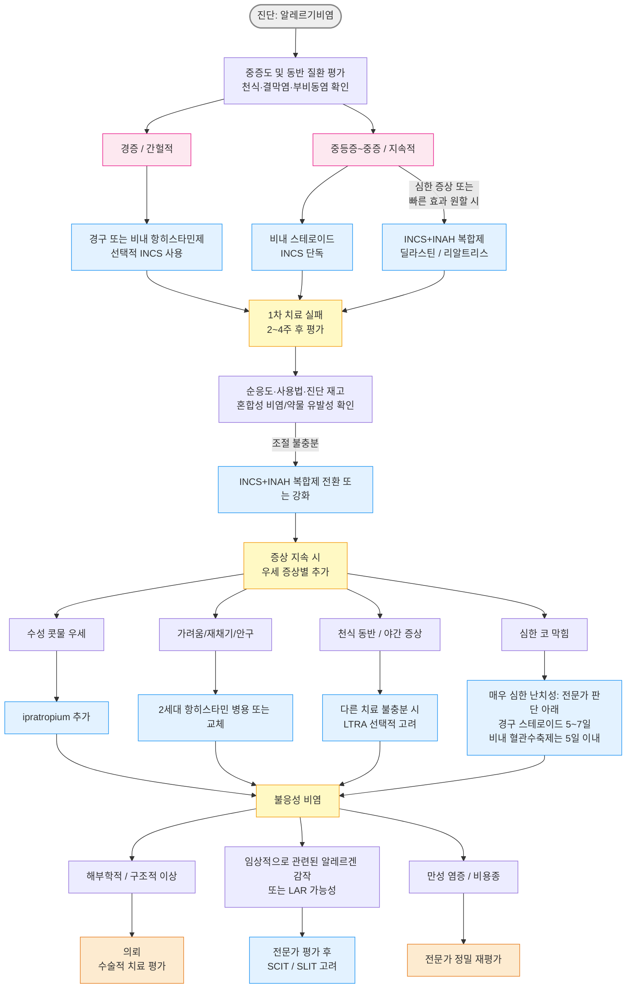
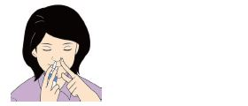

# 알레르기비염 Allergic Rhinitis (AR)

## <mark style="color:green;">일반 사항</mark>

* 특정 알레르겐에 감작된 사람에서 알레르겐이 비강 점막에 노출된 후 IgE 매개 면역 반응에 의해 발생하는 코의 염증 반응; 콧물, 코막힘, 재채기, 코가려움증이 특징
* 유병률 : 성인의 10\~30%, 소아의 \~40%; 국내 성인 유병률은 최근 약 20% 수준으로 추정
* 소아·청소년기에 흔히 시작하지만 어느 연령에서나 발생할 수 있으며, 영아에서도 흡입 알레르겐 감작이 가능함
* 알레르기비염은 삶의 질, 수면, 학업·직업 수행 능력에 유의미한 영향을 미치며 천식, 부비동염, 중이염 등과 밀접하게 연관됨

## <mark style="color:green;">분류</mark>

#### <mark style="color:$primary;">기간</mark>

* **간헐적** : 증상 기간 ＜4일/주 또는 연속 ＜4주; 흔히 실외 항원(꽃가루) 관련
* **지속적** : 증상 기간 ≥4일/주 및 연속 ≥4주; 흔히 실내 항원(집먼지진드기, 동물 털) 관련

#### <mark style="color:$primary;">중증도</mark>

* **경증** : 수면 장애, 일상생활·운동·여가 활동 장애, 직장·학교 수행 장애가 없고 증상이 괴롭지 않은 상태
* **중등증\~중증** : 수면 장애, 일상생활·운동·여가 활동 장애, 직장·학교 수행 장애, 괴로운 증상 중 **하나 이상**이 있는 상태

### <mark style="color:orange;">기타 분류</mark>

* **Seasonal** : 계절적 항원에 반응하여 매년 같은 시기에 발생
* **Perennial** : 1년 내내 발생; 주로 실내 항원(집먼지진드기, 동물 비듬·털) 관련
* **Local allergic rhinitis (LAR)** : 전신 감작(피부단자검사 음성, 혈중 특이 IgE 정상)은 없으나 비강 점막 내에서만 항원 특이 IgE가 국소 생성되어 eosinophil 매개 염증이 발생하는 상태
  * 임상 양상은 AR과 구별하기 어려움 - 치료 반응 불충분 시 반드시 감별 고려
  * 비강 유발 검사(Nasal Provocation Test, NPT) 양성으로 확진
  * 코 세척액 내 특이 IgE 측정이 진단 보조 수단으로 연구되고 있으나 아직 임상 표준화 단계는 아님
  * 증상 치료는 일반 AR과 유사하게 시행. NPT로 임상적으로 관련된 원인 알레르겐이 확인되고 일반 치료에 불충분한 일부 환자에서는 전문가가 알레르겐 면역요법(AIT)을 고려할 수 있으나, 근거는 특정 알레르겐과 소규모 연구에 제한됨(Rondón et al., Allergy 2018)
* **혼합성 비염(Mixed Rhinitis)** : AR과 비-알레르기성 비염(NAR)이 혼재된 형태; 전체 비염 환자의 약 34\~50%를 차지하는 것으로 추정
  * 알레르겐 노출뿐 아니라 온도·습도 변화·자극 물질에도 반응 - 치료 반응이 불완전할 때 반드시 고려
  * INCS+INAH 병용이 필요한 경우 많음

## <mark style="color:green;">원인 및 위험 인자</mark>

#### <mark style="color:$primary;">알레르겐</mark>

* **실외(계절성)** : 봄- 나무 꽃가루; 여름 - 꽃, 풀; 가을 - 돼지풀, 쑥, 곰팡이
* **실내(통년성)** : 집먼지진드기 배설물, 애완동물 비듬·털, 바퀴벌레 단백질, 곰팡이 포자

#### <mark style="color:$primary;">위험 인자</mark>

* 아토피·습진·천식 등 다른 알레르기 질환 보유
* 알레르기 가족력(특히 부모 모두 해당)
* 흡연 노출(특히 출생 후 첫 1년간 모성 흡연)
* 대기오염 및 일부 실내 알레르겐 노출; 영유아기 항생제 사용 등은 관찰연구에서 연관성이 보고되었으나 인과관계는 확정되지 않음

#### <mark style="color:$primary;">병태생리</mark>

* 알레르겐 → antigen-presenting cells → T-cell 활성화 → cytokine → B-lymphocyte·eosinophil 작용
* B-lymphocyte → IgE → mast cell·basophil 감작·탈과립 → histamine 방출 → 가려움·재채기·분비 증가; 수 분\~1시간 **\[early-phase response]**
* Eosinophil → IL-5 → 독성 물질 → 점막 손상 → 코 막힘; 수 시간 후 **\[late-phase reaction]**

#### <mark style="color:$primary;">약물 관련 비염 (Drug-induced Rhinitis)</mark>&#x20;

* **Rhinitis Medicamentosa**&#x20;
  * 약물 관련 비염의 가장 흔한 원인
  * 비내 혈관수축제(oxymetazoline, xylometazoline 등)를 5일 이상 연속 사용 시 반동성 비충혈 발생&#x20;
  * 중단이 치료이나 일시적 악화로 순응도가 낮음
* **기타 약물에 의한 비강 증상**
  * **항고혈압제** : beta-blocker (비충혈·코 막힘), ACE 억제제 (콧물·비강 자극), methyldopa, reserpine, hydralazine
  * **아스피린·NSAIDs** : 아스피린 또는 NSAIDs에 대한과민성 비염(NERD/AERD)
* **Alpha-blocker** : 주로 전립선 비대증 치료에 사용되는 tamsulosin 등에 의한 비강 혈관 확장으로 코 막힘 유발 가능
* **기타** : 경구 피임약, phosphodiesterase-5 억제제 (sildenafil 등)
* 고령 다약제 복용 환자에서 특히 주의; 치료 실패 또는 비전형 증상 시 복용 중인 약물 목록 전수 확인 권고


**NERD / AERD** (NSAID or Aspirin-exacerbated respiratory disease)

* 아스피린 또는 NSAIDs를 복용한 후 기도 과민 반응이 유발되는 증후군으로 다음 3가지 질환이 함께 나타남(구 Samter's triad); ⓵  만성 비부비동염 + 비용종 (코 막힘, 후각 저하), ⓶ 천식 (기관지 과민), ⓷ 아스피린/NSAID 과민반응 (복용 후 수분\~수 시간 내 코 막힘, 천명, 호흡곤란 발생)
* 기전 : COX-1 억제 → 아라키돈산이 lipoxygenase 경로로 쏠림 → cysteinyl leukotriene 과잉 생산 → 비강 점막과 기관지의 강력한 염증·수축 반응 유발; LTRA가 치료에 유효
* 유병률이 낮지 않음 (천식 환자의 약 10\~20%, 비용종 환자에서 더 높음)
* COX-1 억제 계열 전체가 위험; 선택적 COX-2 억제제(예: celecoxib)는 대부분 내약되지만 드문 반응이 가능하므로, 특히 중증 천식·과거 중증 반응 환자에서는 전문가 감독하 투여 또는 내약성 확인을 고려
* acetaminophen은 비교적 안전하나 고용량(＞1g)에서 발생 가능
* 비용종 환자나 천식 환자 내원 시 아스피린이나 소염 진통제 복용 후 코 막힘이 심해지거나 숨이 찬적이 있는지 확인


## <mark style="color:green;">임상 양상</mark>

* **코 증상** : 코 가려움, 재채기, 콧물(묽은 수양성\~점성), 코 막힘, 후비루
* **코 징후** : 점막 부종, 창백 또는 홍반성 점막, 비갑개 비대, 비용종
* **코 외 증상** : 구강 호흡, 기침, 눈·인두 가려움, 눈물, 코골이, 수면 장애, 피로, 두통
* **동반 질환** : 비부비동염, 아토피·습진·두드러기, 천식, 알레르기성 결막염, 중이염

### <mark style="color:$danger;">🚩 Red Flags!</mark>

<mark style="color:$danger;">**즉각 조치 또는 의뢰**</mark>

* **안와·두개내 합병증** 의심 : 안구 돌출, 시력 저하, 복시·안구운동 장애, 의식 변화, 수막자극징후, 심한 두통과 전신 독성 소견 → 급성 합병성 부비동염 등 응급 평가
* 면역저하 환자에서 심한 안면 통증, 발열, 검은 가피·괴사 등 **침습성 진균성 비부비동염** 의심 소견

<mark style="color:$warning;">**당일 또는 조기 의뢰**</mark>

* **지속되는 편측 코막힘·혈성 분비물·반복 코피·편측 안면 통증** → 비강 내 종양, 이물질, 비중격 병변 등 감별을 위한 이비인후과 평가
* 재발성 비부비동염·중이염 등 합병증이 반복 발생

<mark style="color:$info;">**외래 추적 / 추가 평가 계획 - 즉각 위험 낮으나 호전 없으면 의뢰**</mark>

* 치료 시작 2\~4주 후 반응 평가; INCS는 수 시간\~수일 내 효과가 시작되지만 최대 효과에는 수일\~2주 이상 필요. 적절한 치료에도 호전되지 않으면 순응도·분무법·진단을 재고하고 필요 시 비강 내시경 또는 전문의 의뢰
* 지속적 AR 환자에서 알레르겐 동정(피부단자검사 또는 혈청 특이 IgE) 및 면역 치료 고려 시점 재평가
* 약물에 반응하지 않는 하비갑개 비대, 비중격 만곡 등 구조적 원인이 의심되면 이비인후과 의뢰
* 천식, 비부비동염, 결막염 등 동반 질환 관리

## <mark style="color:green;">진단</mark>

* 증상·병력·신체 검진 및 치료 반응으로 임상 진단
* 지속적 비염 환자는 적응되어 증상을 과소 보고하는 경향이 있음 - 능동적 문진 필요

### <mark style="color:orange;">AR vs 비-알레르기비염(non-AR) 감별</mark>

<table><thead><tr><th width="142">임상 특징</th><th width="272">AR</th><th>non-AR</th></tr></thead><tbody><tr><td>악화 요인</td><td>관련 알레르겐 노출; 계절 영향 가능</td><td>온도·습도 변화, 냄새·매연·자극 물질, 음식, 약물 등</td></tr><tr><td>알레르기 가족력</td><td>흔함</td><td>상대적으로 적음</td></tr><tr><td>코·눈 가려움</td><td>특징적</td><td>드묾</td></tr><tr><td>재채기</td><td>흔함</td><td>가능하나 덜 특징적</td></tr><tr><td>콧물·후비루</td><td>수양성 콧물 흔함; 후비루 가능</td><td>콧물·후비루 모두 흔할 수 있음</td></tr><tr><td>검사</td><td>임상적으로 관련된 피부단자검사 또는 혈청 특이 IgE 양성</td><td>전신 감작 검사 음성; LAR는 비강 유발 검사로 감별</td></tr><tr><td>코 점막 소견</td><td>창백·부종이 흔하나 비특이적</td><td>정상·발적·부종 등 다양하며 단독 감별 불가</td></tr></tbody></table>

### <mark style="color:orange;">AR vs 부비동염 vs 비용종 감별</mark>

<table><thead><tr><th width="160">핵심 포인트</th><th width="190">알레르기비염</th><th width="190">급성/만성 비부비동염</th><th>비용종 동반 만성 비부비동염</th></tr></thead><tbody><tr><td>대표 증상</td><td>재채기, 맑은 콧물, 코가려움, 코막힘</td><td>코막힘·분비물과 안면 통증/압박감 또는 후각 저하</td><td>지속적 코막힘, 후각 저하</td></tr><tr><td>콧물 성상</td><td>맑고 수양성</td><td>점액성·농성 가능; 색만으로 세균성 여부 판단 불가</td><td>콧물·후비루 가능</td></tr><tr><td>재채기·가려움</td><td>흔하고 특징적</td><td>비전형적</td><td>비전형적</td></tr><tr><td>눈 증상</td><td>결막 가려움·눈물·충혈 흔함</td><td>알레르기 동반 시 가능</td><td>알레르기 동반 시 가능</td></tr><tr><td>후각 저하</td><td>코막힘이 심하면 가능</td><td>가능</td><td>매우 흔함</td></tr><tr><td>안면 통증·발열</td><td>비전형적</td><td>급성 비부비동염에서 가능; 만성에서는 가변적</td><td>통증·발열은 비전형적이며 다른 원인 평가</td></tr><tr><td>증상 패턴</td><td>계절성/노출 관련, 반복적</td><td>급성은 감기 후 악화 가능; 만성은 ≥12주</td><td>서서히 진행하는 만성 경과</td></tr><tr><td>비내시경/진찰</td><td>창백·부종 점막이 흔하나 비특이적</td><td>중비도 농성 분비물·점막 부종 등</td><td>양측성의 창백하고 반투명한 종물</td></tr><tr><td>편측 증상</td><td>드묾</td><td>치성 원인·종양·이물 등 감별</td><td>편측 종물은 종양 등 감별 필요</td></tr><tr><td>주요 치료</td><td>INCS, 항히스타민제</td><td>비강 세척·INCS; 항생제는 세균성 기준 충족 시</td><td>INCS 중심; 중증·불응 시 이비인후과 평가</td></tr></tbody></table>

### <mark style="color:orange;">검사</mark>

* **Routine Lab** : 일반적으로 정상; 혈청 총 IgE는 환자의 약 1/3에서만 상승(비특이적)
* **알레르겐 감작 검사 적응증** : 임상 진단이 불확실하거나 경험적 치료에 반응하지 않는 경우, 원인 알레르겐 확인 및 면역 치료를 고려하는 경우 시행; 병력과 일치하는 감작만 임상적으로 의미 있게 해석
* **피부단자검사(Skin-prick test)** : 민감도가 높고 다수의 흡입 알레르겐을 동시에 평가 가능; 항히스타민제를 적절한 기간 중단한 뒤 시행하며, 중단하기 어렵거나 광범위한 피부질환·피부묘기증이 있으면 혈청 특이 IgE 검사를 고려
* **혈청 특이 IgE 검사** : 항히스타민제와 피부 상태의 영향을 받지 않으며, 성능은 알레르겐·검사법에 따라 달라 피부단자검사보다 일률적으로 열등하다고 볼 수 없음
* 식품 알레르기 병력이 없는 환자에서 식품 알레르겐 검사는 알레르기비염의 routine 평가로 시행하지 않음; 검사 가능 연령에 절대적 하한은 없으나 연령과 노출력에 따라 해석
* **코 내시경·영상 검사** : 비전형 증상, 치료 무반응, 비용종·종양 의심 시

### <mark style="color:orange;">증상 중증도 및 추적 평가</mark>

**오늘 코 증상이 얼마나 괴로우신가요? (TNSS)**

아래 4가지 증상을 각각 0\~3점으로 표시(0=없음, 1=가벼움, 2=중간, 3=심함)

<table><thead><tr><th>증상</th><th>점수</th></tr></thead><tbody><tr><td>재채기</td><td>0 / 1 / 2 / 3</td></tr><tr><td>콧물</td><td>0 / 1 / 2 / 3</td></tr><tr><td>코 막힘</td><td>0 / 1 / 2 / 3</td></tr><tr><td>코 가려움</td><td>0 / 1 / 2 / 3</td></tr><tr><td><strong>합계 (최대 12점)</strong></td><td></td></tr></tbody></table>

_✽TNSS(Total Nasal Symptom Score) 0\~4점: 경증, 5\~8점: 중등증, 9\~12점: 중증으로 편의상 구분할 수 있으며, 첫 방문과 추적 방문의 변화를 비교하는 데 유용. 다만 수면·일상 기능·학교·직장 수행과 증상의 괴로움에 기반한 ARIA 중증도 분류를 대체하지 않음_

_✽**VAS(Visual Analogue Scale)** : ARIA에서는 0\~10 cm VAS를 증상 조절 평가에 활용. 스마트폰 앱(예: **MASK-air**) 같은 디지털 도구도 일상 자가 모니터링에 활용 가능_

***

## <mark style="background-color:$warning;">Management</mark>

### <mark style="color:orange;">치료 원칙</mark>

* **알레르겐 회피 + 비강 세척 + 약물 치료** 의 3요소 병행
* **지속성 또는 중등증\~중증에서는 비내 스테로이드(intranasal corticosteroid, INCS)가 우선 선택제** - 모든 코 증상(재채기·콧물·코막힘·가려움)에 가장 우수한 효과
  * Seasonal AR : INCS ± 비내 H1 항히스타민제(intranasal H1-antihistamine, INAH) 또는 경구 항히스타민제
  * Perennial AR : INCS ± INAH
* **중등증 이상에서는 INCS+INAH 고정 복합제를 초기 선택지로 고려** - 단일요법으로 충분한 개선이 어려울 것으로 예상되거나 빠른 효과가 필요한 경우, 또는 단일제 사용에도 조절되지 않는 경우 고려
  * 복합제 : <mark style="color:blue;">\[딜라스틴 나잘]</mark>(fluticasone p.+azelastine), <mark style="color:blue;">\[리알트리스 나잘스프레이 액]</mark>(mometasone+olopatadine) (보험 주의)
  * ARIA-EAACI 2024\~2025에서는 INCS 단독보다 고정 복합제를 조건부 권고함(계절성 AR: 중등도 근거, 통년성 AR: 매우 낮은 근거); 성인 계절성 AR에서는 azelastine+fluticasone을 olopatadine+mometasone보다 조건부 우선하나, 소아·청소년에서는 두 복합제 중 하나를 특별히 우선할 근거가 부족함
* 꽃가루 유발 AR에서 매년 반복적으로 악화되고 예방 치료를 원하는 경우 꽃가루 비산 1\~2주 전부터 약물 치료 시작을 고려할 수 있음(조건부 권고, 매우 낮은 근거)
* **Step-down 전략** : 증상이 잘 조절된 상태가 4주 이상 지속되면 약물 강도를 한 단계 낮춤&#x20;
  * 복합제 → 단일제, 또는 분무 횟수 절반, 또는 간헐적 사용으로 전환 고려
  * "언제까지 써야 하나요?" 질문에 미리 기준을 제시하면 순응도 향상


<mark style="color:red;">**알레르기비염 치료 실패 원인들**</mark>

* **약물 순응도 불량** : 비내 스테로이드는 수 시간\~수일 내 효과가 시작되지만 최대 효과에는 수일\~2주 이상 필요; 조기 중단이 흔한 실패 원인
* **분무 사용법 오류** : 비중격 방향 분사, 고개를 과도하게 뒤로 젖힘, sniffing 너무 강함, 불규칙 사용
* **혼합성 비염(Mixed Rhinitis)** : AR+NAR 혼재; 단일제 효과 불충분 → INCS+INAH 복합제 필요
* **약물 유발성 비염** : 복용 중인 약물 전수 확인 (beta-blocker, ACE억제제, NSAIDs, 비내 혈관수축제)
* **해부학적 이상** : 비중격 만곡, 비용종, 하비갑개 비대 → 의뢰
* **진단 오류** : Local allergic rhinitis(LAR), 만성 부비동염, 혈관운동성 비염 재평가
* **수면무호흡증** : 코 막힘으로 오인; 수면 장애·주간 졸음 동반 시 의심


### <mark style="color:orange;">중증도별 치료 방침</mark>

<table><thead><tr><th width="123">중증도</th><th width="268">1차 선택</th><th>비고 및 추가 옵션</th></tr></thead><tbody><tr><td>경증, <br>간헐적</td><td>• 경구 항히스타민제(OAH)<br>• 비내 항히스타민제(INAH)<br>• 비내 스테로이드(INCS) 중 선택</td><td>코 막힘이 주 증상이면 INCS 우선; 안구 증상을 함께 조절하려면 OAH 고려</td></tr><tr><td>경증~중등증, <br>지속적</td><td>• INCS 우선<br>• 필요 시 OAH 추가 또는 INCS+INAH 고정 복합제로 전환</td><td>수성 콧물 지속 시 비내 ipratropium 추가; 심한 코 막힘에는 비내 혈관수축제를 예외적으로 5일 이내 사용</td></tr><tr><td>중등증~중증</td><td>• INCS 또는<br>• INCS+INAH 고정 복합제 <mark style="color:blue;">\[딜라스틴 나잘]</mark> <mark style="color:blue;">\[리알트리스 나잘스프레이 액]</mark></td><td>단일요법으로 충분한 개선이 어렵거나 빠른 조절이 필요하면 복합제 고려; 수성 콧물 지속 시 ipratropium 추가</td></tr><tr><td>중증, 지속적 <br>(불응성)</td><td>• INCS+INAH 고정 복합제<br>• 순응도·분무법·진단 재평가</td><td>• 매우 심하거나 난치성인 경우에만 전문가 판단 아래 경구 스테로이드 5~7일을 예외적으로 고려<br>• 천식 동반·NERD 등 특정 상황에서 LTRA 선택적 추가¹<br>• 증상 지속 : 면역 요법 평가<br>• 구조적 이상 : 이비인후과 의뢰</td></tr></tbody></table>

_1) LTRA(montelukast 등)는 routine 중증 옵션이 아님. 다른 치료로 조절되지 않고 경구 치료를 강하게 선호하거나 천식·NERD가 동반된 경우 선택적으로 고려. OAH+LTRA의 routine 병용은 권고하지 않으며, FDA 박스형 경고(신경정신계 부작용)를 고려하여 처방 전 위험-이익을 충분히 논의_

***


```mermaid
graph TD
    %% 초기 평가 및 분류
    Start([진단: 알레르기비염]) --> Assess[중증도 및 동반 질환 평가<br/>천식·결막염·부비동염 확인]

    Assess --> Mild[경증 / 간헐적]
    Assess --> ModSev[중등증~중증 / 지속적]

    %% 경증 치료 경로
    Mild --> AH[경구 또는 비내 항히스타민제<br/>선택적 INCS 사용]

    %% 중등증-중증 치료 경로
    ModSev --> INCS0[비내 스테로이드<br/>INCS 단독]
    ModSev --> |심한 증상 또는<br/>빠른 효과 원할 시| Combo0[INCS+INAH 복합제<br/>딜라스틴 / 리알트리스]

    %% 1차 치료 실패 시 공통 경로
    AH --> Fail1
    INCS0 --> Fail1
    Combo0 --> Fail1

    Fail1[1차 치료 실패<br/>2~4주 후 평가] --> Check1[순응도·사용법·진단 재고<br/>혼합성 비염/약물 유발성 확인]

    Check1 --> |조절 불충분| Combine[INCS+INAH 복합제 전환 또는 강화]

    %% 세부 증상별 추가 전략
    Combine --> Fail2[증상 지속 시<br/>우세 증상별 추가]

    Fail2 --> Symptom1[수성 콧물 우세]
    Fail2 --> Symptom2[가려움/재채기/안구]
    Fail2 --> Symptom3[천식 동반 / 야간 증상]
    Fail2 --> Symptom4[심한 코 막힘]

    Symptom1 --> Tx1[ipratropium 추가]
    Symptom2 --> Tx2[2세대 항히스타민 병용 또는 교체]
    Symptom3 --> Tx3[다른 치료 불충분 시<br/>LTRA 선택적 고려]
    Symptom4 --> Tx4[매우 심한 난치성: 전문가 판단 아래<br/>경구 스테로이드 5~7일<br/>비내 혈관수축제는 5일 이내]

    %% 최종 단계 및 의뢰
    Tx1 --> Fail3[불응성 비염]
    Tx2 --> Fail3
    Tx3 --> Fail3
    Tx4 --> Fail3

    Fail3 --> Cause1[해부학적 / 구조적 이상]
    Fail3 --> Cause2[임상적으로 관련된 알레르겐 감작<br/>또는 LAR 가능성]
    Fail3 --> Cause3[만성 염증 / 비용종]

    Cause1 --> Final1[의뢰<br/>수술적 치료 평가]
    Cause2 --> Final2[전문가 평가 후<br/>SCIT / SLIT 고려]
    Cause3 --> Final3[전문가 정밀 재평가]

    style Start fill:#eeeeee,stroke:#888888,stroke-width:2px
    classDef yellow fill:#fff9c4,stroke:#f39c12
    class Fail1 yellow
    class Fail2 yellow
    class Fail3 yellow
    classDef sky fill:#e3f2ff,stroke:#2196f3
    class INCS0 sky
    class Combine sky
    class Tx1 sky
    class Tx2 sky
    class Tx3 sky
    class Tx4 sky
    class AH sky
    class Combo0 sky
    class Final2 sky
    classDef orange fill:#fdebd0,stroke:#e67e22
    class Final1 orange
    class Final3 orange
    classDef pink fill:#fde8f0,stroke:#e91e8c
    class Mild pink
    class ModSev pink

```

<p align="center"><strong>알레르기비염 관리 알고리듬</strong></p>

***

## <mark style="color:green;">비-약물 치료 및 예방</mark>

### <mark style="color:orange;">알레르겐 회피</mark>

* 금연; 병력과 감작 검사에서 임상적 관련성이 확인된 알레르겐을 중심으로 노출 감소 조치를 시행하되, 단일 환경 조치의 효과는 제한적이고 완전한 회피는 현실적으로 어려움
* 환경 조절 효과 발현까지 수 주\~수개월 소요

<table><thead><tr><th width="208">구분</th><th>내용</th></tr></thead><tbody><tr><td>집먼지진드기에 대한 조치¹⁾</td><td>• 알레르겐 불투과 천으로 매트리스, 베개, 이불을 감쌈<br>• 카펫 및 부드러운 가구에 대한 진드기 살균제 사용</td></tr><tr><td>꽃가루 회피 조치²⁾</td><td>• 꽃가루가 많을 때 야외 활동 제한 (이른 아침, 이른 저녁, 풀 베는 동안)<br>• 집과 차에서 창문을 닫고 지내기<br>• 꽃가루 노출 후 샤워/세척<br>• 환경 지수가 나쁠 때 야외 세탁물 건조 회피</td></tr></tbody></table>

_1) 집먼지진드기 차단 커버 등 단일 조치만으로는 임상 효과가 제한적이므로 여러 환경 조치를 함께 적용. 2) 꽃가루 회피 조치의 근거는 주로 관찰연구와 전문가 의견_

<p align="center"><em><mark style="color:$info;">Ref. BSACI guideline for the diagnosis and management of allergic and non-allergic rhinitis. 2017.</mark></em></p>

### <mark style="color:orange;">비강 세척</mark>

* 기대효과 : 비강 내 점액·알레르겐·자극 물질 제거, sinus passage 습윤화, 섬모 운동 향상
* 방법 : 고개를 옆으로 기울이고 위쪽 코에 미지근한 등장성 생리식염수를 주입하여 아래쪽 코로 흘러나오게 함; 스프레이 또는 대용량 관류를 환자 선호와 순응도에 따라 1일 1\~2회 시행
  * 세척액 : 시판 비강세척용 분말을 제품 설명서대로 증류수·멸균수 또는 3분간 끓여 식힌 물에 희석하는 방법을 우선 권고. 직접 등장성 식염수를 조제하려면 물 250 ㎖에 염화나트륨 약 2.25 g이 필요하며, 자극을 줄이기 위해 검증된 소금·중탄산염 혼합법을 사용할 수 있음
  * 보관 : 가능하면 사용 직전에 조제하고 남은 세척액은 버림; 불가피하게 보관할 때는 깨끗한 밀폐 용기에 냉장 보관하고 24시간 이내 사용
  * 기구 : 30 ㎖ 주사기, squeeze 병, Neti pot 등을 사용할 수 있음; 매 사용 후 제품 설명서에 따라 세척하고 완전히 건조하며, 교체 주기는 제품 설명서에 따름
* AR에서는 등장성 식염수 스프레이 방식과 대용량 관류(irrigation) 모두 사용 가능하며, 환자 순응도 및 선호도에 따라 선택; 만성 부비동염(CRS)에서는 고용량 관류가 선호됨; 일부 대한천식알레르기학회 자료에서는 스프레이 방식을 제시하였으나, 방식 간 우열보다는 꾸준한 시행 여부가 더 중요
* 자일리톨 함유 비강 세척액(예: Xlear)과 히알루론산 첨가 세척액이 점막 수분 유지 및 항균 효과로 주목받고 있으나, 현재 AR에서의 임상적 이득은 소규모 연구 수준으로 근거가 확립되지 않음 - 일반 생리식염수로 충분

## <mark style="color:green;">약물 치료</mark>

* 지속성 또는 중등증\~중증 AR에서는 규칙적 유지 치료가 일반적으로 효과적이며, 경증·간헐적 증상에서는 환자 특성과 제제에 따라 필요 시 사용을 고려
* 서로 다른 기전의 비내 제제 병용이 필요한 경우 INCS+INAH 고정 복합제 또는 우세 증상에 따른 INCS+ipratropium 등을 선택; 같은 계열 제제를 중복 사용하지 않도록 확인

#### <mark style="color:$primary;">알레르기비염 치료제 효과 비교</mark>

<table><thead><tr><th width="160">치료 제제</th><th width="70"></th><th width="70">재채기</th><th width="70">콧물</th><th width="70">코 막힘</th><th width="80">코가려움</th><th width="80">안구 증상</th></tr></thead><tbody><tr><td>steroid</td><td>비내</td><td>+++</td><td>+++</td><td>+++</td><td>+++</td><td>++</td></tr><tr><td>항히스타민</td><td>비내</td><td>++</td><td>++</td><td>++¹</td><td>++</td><td>+</td></tr><tr><td></td><td>경구</td><td>++</td><td>++</td><td>+</td><td>++</td><td>++</td></tr><tr><td></td><td>점안</td><td>-</td><td>-</td><td>-</td><td>-</td><td>+++</td></tr><tr><td>코 울혈 제거제</td><td>비내</td><td>-</td><td>-</td><td>++++</td><td>-</td><td>-</td></tr><tr><td></td><td>경구</td><td>-</td><td>-</td><td>+</td><td>-</td><td>-</td></tr><tr><td>Cromolyn</td><td>비내</td><td>+</td><td>+</td><td>+</td><td>+</td><td>-</td></tr><tr><td></td><td>점안</td><td>-</td><td>-</td><td>-</td><td>-</td><td>++</td></tr><tr><td>항콜린제</td><td>비내</td><td>-</td><td>++</td><td>-</td><td>-</td><td>-</td></tr><tr><td>항류코트리엔</td><td>경구</td><td>+</td><td>+</td><td>+</td><td>+</td><td>+</td></tr><tr><td>식염수 코 세척</td><td></td><td>-</td><td>+</td><td>+</td><td>-</td><td>-</td></tr><tr><td>면역 치료</td><td></td><td>장기적 감소</td><td>장기적 감소</td><td>장기적 감소</td><td>장기적 감소</td><td>장기적 감소</td></tr><tr><td>INCS+INAH</td><td>비내</td><td>+++</td><td>+++</td><td>+++</td><td>+++</td><td>+++</td></tr></tbody></table>

_1) 비내 azelastine 등 최신 INAH는 코 막힘에 대해 경구 항히스타민제보다 우월하다는 연구 다수; 경구 항히스타민제 단독 대비 우위_

<p align="center"><em><mark style="color:$info;">효과 표시는 최신 권고와 기존 비교 자료를 종합한 상대적·개략적 비교이며 환자별 반응은 다를 수 있음. Ref. ARIA-EAACI 2024\~2025 Part I·II.</mark></em></p>

### <mark style="color:orange;">Steroid</mark>

#### <mark style="color:$primary;">비내용 제제</mark>

* 기전 : 비강 점막 염증 세포에 작용 → IgE 관련 히스타민 분비 억제
* 대상 : 코의 모든 증상; 가장 우수한 효과
* 효과 발현 : 분무 후 수 시간\~수일 내 효과가 시작되며, 최대 효과에 도달하기까지 수일\~2주 이상 규칙적 사용 필요
  * 환자 복약 지도 포인트 : "첫날부터 조금씩 효과가 시작되지만, 최대 효과를 보려면 2주가 걸린다"고 설명하면 초기 포기를 방지할 수 있음
* 증상이 안정되면 허가된 용량 범위에서 최저 유효 용량으로 감량하거나 환자별 노출 양상에 따라 사용 빈도 조절
* 임상적으로 큰 효과 차이는 없으나, 일부 메타분석에서 fluticasone 제제가 증상 조절 측면에서 다소 우수할 가능성이 제시됨; 전신 흡수율·국소 자극·환자 선호도는 제제마다 상이
* 국소 부작용 : 코·목 자극, 코피, 코 마름, 쓴맛, 칸디다 증식(드묾)
* 전신 부작용 : 권장 용량에서 전신 부작용 위험은 매우 낮으나 0은 아님; 낮은 전신 흡수율만으로 성장 영향을 완전히 배제할 수 없으므로 소아 장기 사용 시 최저 유효 용량을 사용하고 성장 모니터링 고려
* 상호작용 : fluticasone은 ritonavir·cobicistat, itraconazole 등 강한 CYP3A4 저해제와 병용 시 전신 corticosteroid 부작용 위험 증가

<table><thead><tr><th width="279">성분명 [상품명]</th><th width="130">성인 용량*</th><th width="120">소아 용량*</th><th width="80">최소 연령</th><th width="90">전신 흡수율</th></tr></thead><tbody><tr><td>ciclesonide <mark style="color:blue;">[옴나리스 나잘]</mark></td><td>2회 puffs qd</td><td>-</td><td>6세</td><td>&#x3C;0.1%</td></tr><tr><td>mometasone f. <mark style="color:blue;">[나조넥스 나잘]</mark></td><td>1~2회 puffs qd</td><td>1회 puff qd</td><td>2세</td><td>&#x3C;0.1%</td></tr><tr><td>fluticasone f. <mark style="color:blue;">[아바미스 나잘]</mark></td><td>1~2회 puffs qd</td><td>1회 puff qd</td><td>2세</td><td>&#x3C;1%</td></tr><tr><td>fluticasone p. <mark style="color:blue;">[후릭소나제 코악]</mark></td><td>2회 puffs qd~bid</td><td>1~2회 puffs qd</td><td>4세</td><td>&#x3C;2%</td></tr><tr><td>beclomethasone <mark style="color:blue;">[리노클레닐 비액]</mark></td><td>2회 puffs qd</td><td>-</td><td>-</td><td>-</td></tr><tr><td>budesonide <mark style="color:blue;">[나리타 정비액]</mark></td><td>1~2회 puffs bid</td><td>1회 puff bid</td><td>6세</td><td>＞10%</td></tr><tr><td>triamcinolone <mark style="color:blue;">[나자코트 비액]</mark></td><td>1~2회 puffs qd</td><td>1~2회 puffs qd</td><td>2세</td><td>-</td></tr></tbody></table>

_\*비공 당 분무 횟수_\
※ **연령·용량 및 국내 허가·유통 상태는 최신 제품별 허가사항을 확인.** 복합제 : fluticasone-azelastine - 비공 당 1 puff bid <mark style="color:blue;">\[딜라스틴 나잘]</mark>; olopatadine-mometasone furoate - 비공 당 2 puffs bid <mark style="color:blue;">\[리알트리스 나잘스프레이 액]</mark>

#### <mark style="color:$primary;">경구제</mark>

* 대상 : 적절한 비내 치료 등으로도 조절되지 않는 **매우 심하거나 난치성인 AR**에서 예외적으로 고려(조건부 권고, 매우 낮은 근거)
* 용법 : 5\~7일의 짧은 기간 사용; 중간 이하 용량(prednisolone ≤30 ㎎/d)으로 ＜2주 투여한 경우 일반적으로 tapering 불필요
* prednisolone : 5\~60 ㎎/d <mark style="color:blue;">\[소론도]</mark>
* methylprednisolone : 4\~48 ㎎/d <mark style="color:blue;">\[메치론]</mark>

#### <mark style="color:$primary;">주사제</mark>

* 지속시간이 길어 부작용 발생 시 중단할 수 없고 국소 조직 위축·부신 억제·고혈당 등 전신·국소 위험이 있어 depot 주사 corticosteroid는 권고하지 않음

### <mark style="color:orange;">항히스타민제</mark>

#### <mark style="color:$primary;">비내용 제제</mark>

* 경구 항히스타민제보다 코 증상 개선이 우수할 수 있으나 쓴맛·국소 자극 등으로 선호도와 순응도가 낮을 수 있음; INCS와 비교하면 INCS를 조건부 우선하되 빠른 효과·steroid 기피·INCS 관련 코피 등에서는 INAH 고려
* 대상 : 간헐적·계절적 AR; 비-알레르기성 혈관운동성 비염; 중증 AR에서 INCS와 병용
* 효과 발현 : 분무 15\~30분 내 시작; 지속시간은 제제에 따라 다르며 azelastine은 통상 bid 사용
* 부작용 : 쓴맛, 국소 자극, 코피, 두통
* azelastine : 비공 당 1\~2 puffs bid <mark style="color:blue;">\[아젭틴 비액]</mark>

#### <mark style="color:$primary;">경구제</mark>

* 대상 : 콧물·재채기·가려움·눈물·안구 충혈 (✽코 막힘에는 효과 적음)
* 알레르겐 노출 전 예방적으로 사용할 때는 제제별 약동학과 허가 용법에 따라 미리 투여
* 2세대 제제 우선 선택 - 졸음·항콜린 부작용 적거나 없음
* 1세대 제제는 진정·인지 및 항콜린 부작용 때문에 AR에서는 권고하지 않음; 난치성 non-AR 후비루에 보조적으로 고려한다는 의견이 있으나 근거가 부족하고 위험-이익을 개별 평가
* 항히스타민제 증량 또는 동일 계열 병용은 효과 상승 없이 부작용 증가 → 효과부족 시 INCS 등 다른 약제 병용 권고
* cetirizine : 일부 졸음; 5\~10 ㎎ qd <mark style="color:blue;">\[지르텍]</mark>
* levocetirizine : 일부에서 졸음 가능; 5 ㎎ qd <mark style="color:blue;">\[씨잘]</mark>
* fexofenadine : 진정 가능성이 매우 낮음; 120 ㎎ qd <mark style="color:blue;">\[알레그라]</mark>
* loratadine : 10 ㎎ qd <mark style="color:blue;">\[클라리틴]</mark>
* desloratadine : 5 ㎎ qd <mark style="color:blue;">\[에리우스]</mark>
* olopatadine : 5 ㎎ bid <mark style="color:blue;">\[알레락]</mark>

### <mark style="color:orange;">α-Adrenergic Agonist (코 울혈 제거제)</mark>

#### <mark style="color:$primary;">비내용 제제</mark>

* 기전 : 교감 신경 항진 → 코 점막 혈관 수축
* 대상 : 심한 코 막힘; 코 막힘에 가장 강력하나 부작용으로 사용 제한
* 부작용 : rebound rhinitis(반동성 비충혈), 고혈압
* 사용 제한 : 심한 코 막힘의 단기 완화가 꼭 필요한 경우 1일 2회 이내, 연속 5일 이내(가능하면 더 짧게); 임신부·12세 미만 소아·고령자에서는 피함 (비급여)
* phenylephrine <mark style="color:blue;">\[시네프린]</mark>, naphazoline+chlorpheniramine <mark style="color:blue;">\[나리스타]</mark>, xylometazoline <mark style="color:blue;">\[오트리빈]</mark>, oxymetazoline <mark style="color:blue;">\[레스피비엔]</mark>

#### <mark style="color:$primary;">경구제</mark>

* 부작용 : 불면, 식욕 부진, 불안정, 두근거림, 혈압 상승, 진전, 어지럼, 두통, 소변 저류
* 고령·부정맥·CVD·조절되지 않는 고혈압·배뇨 장애·녹내장·갑상선항진증 환자에서 **주의**
* 심한 코 막힘에서 금기·주의사항을 확인한 뒤 예외적으로 단기간 사용하며, 규칙적인 장기 병용은 피함
* pseudoephedrine : 30\~60 ㎎ tid\~qid <mark style="color:blue;">\[슈다페드]</mark>
* phenylephrine : 경구 10 ㎎은 비충혈 개선 효과가 입증되지 않아 routine 사용하지 않음. FDA는 유효성 부족을 근거로 OTC monograph에서 제외하는 제안 명령을 발표했으며, 최종 행정명령 여부는 추후 확인

### <mark style="color:orange;">항콜린제, 비내</mark>

* 기전 : 부교감 신경 억제 → 코 점막 mucus production 감소
* 대상 : 콧물 증상 (✽코 막힘·재채기에는 효과 적음); 혈관운동성 비염·gustatory rhinitis에 유용
* INCS 병용 시 효과 상승; INCS에도 지속되는 수성 콧물에 선택적으로 추가 고려
* 부작용 : 코·입마름, 국소 자극, 코 막힘, 코피, 두통
* ipratropium : 비공 당 1 puff bid\~tid <mark style="color:blue;">\[리노벤트]</mark>

### <mark style="color:orange;">Cromolyn, 비내</mark>

* 기전 : mast cell 안정화 → 히스타민 등 염증 매개체 방출 감소
* 효과 : AR 전반적 증상에 약간의 효과; 항히스타민제보다 효과 적음
* 효과 발현 : 4\~7일째 시작, 수 주 후 최대 효과
* 간헐적 AR(예: 꽃가루) 예방적 사용 - 증상 발생 전부터, 알레르겐 노출 30분 전 투여
* 부작용 : 코피, 국소 자극, 재채기
* 용법 : 3\~6회/d (반감기 짧음) → 2\~3주 후 감량

### <mark style="color:orange;">항류코트리엔제 (Leukotriene Modifier)</mark>

* 기전 : 알레르겐에 대한 초기·지연성 염증 반응 억제
* 효과 : 경구 항히스타민제보다 우선하지 않으며, 치료하지 않은 AR에서 routine 1차 치료로 권고하지 않음
  * 다른 치료로 조절되지 않고 경구 치료를 강하게 선호하거나 천식·NERD가 동반된 경우 선택적으로 고려
* 병용 : OAH+LTRA는 OAH 단독보다 임상적으로 의미 있는 추가 이득이 없고 안전성 우려와 비용이 증가하므로 routine 병용하지 않음
* 보험 기준 : 다른 약물 치료 실패 후 고려
* 부작용 : 간 효소·빌리루빈 수치 상승, 불안, 우울;&#x20;
  *   **Montelukast 신경정신계 이상반응 (FDA 경고)**

      불안, 우울, 수면 장애, 공격성, 자살 충동 등 신경정신계 부작용이 보고됨. **소아·청소년, 불안·우울 병력 환자에서 특히 주의.** 경증 AR에서 routine first-line으로 사용하지 않으며, 처방 전 반드시 위험-이익을 환자(또는 보호자)와 충분히 논의할 것
* montelukast : 10 ㎎ qd 저녁 <mark style="color:blue;">\[싱귤레어]</mark>
* pranlukast : 225 ㎎ bid <mark style="color:blue;">\[오논]</mark>

### <mark style="color:orange;">Anti-IgE 항체</mark>

* 기전 : 순환 IgE와 결합 → mast cell·basophil 활성화 차단
* **알레르기비염 자체에는 국내 허가 적응증이 없으므로 AR 치료제로 사용하지 않음**
* omalizumab <mark style="color:blue;">\[졸레어프리필드시린지주]</mark>은 동반 중증 지속성 알레르기성 천식, 비용종 동반 만성 비부비동염 또는 만성 자발성 두드러기의 각 허가 적응증에 따라 전문가가 사용
  * 알레르기성 천식과 비용종 동반 만성 비부비동염에서는 치료 전 혈청 총 IgE와 체중에 따라 75\~600 ㎎을 2주 또는 4주 간격으로 SC 투여; 급여 기준 별도 확인

### <mark style="color:orange;">기타 생물학적 제제</mark>

* dupilumab 등은 **알레르기비염 자체의 치료제가 아님**. 동반된 중증 천식 또는 비용종 동반 만성 비부비동염이 각각의 국내 허가 적응증을 충족할 때 전문가가 사용하며, 최신 허가·급여 기준을 별도 확인

### <mark style="color:orange;">면역 요법</mark>

* 효과 : AR 증상·약물 사용을 장기적으로 감소시키고 원인 알레르겐에 대한 면역 내성을 유도하는 질환 조절 치료
  * **천식 발생 예방 근거의 범위** : 잔디 또는 자작나무 꽃가루 유발 중등증\~중증 AR 소아·청소년에서 3년간 SCIT 또는 SLIT를 시행하면 치료 종료 후 약 2년까지 천식 발생 위험을 낮출 수 있음; 이를 모든 알레르겐·모든 소아 AR에 일반화하지 않음
* 적극 고려할 상황 : ⓵ 약물 치료와 노출 감소에도 증상이 지속되는 경우, ⓶ 약물 부작용 또는 장기 약물 치료를 원하지 않는 경우, ⓷ 장기 질환 조절 효과를 원하는 경우, ⓸ 병력과 검사에서 HDM·꽃가루 등 임상적으로 관련된 알레르겐이 확인된 경우
* 대상 : 다른 치료에 반응하지 않거나 부작용으로 적용이 어려운 환자; 다중 감작 자체는 배제 기준이 아니며 임상적으로 관련된 알레르겐을 선택
* 치료 기간 : 3\~5년; 중단 후에도 수년간 효과 지속
* 투여 방법 : 피하주사(SCIT), 설하(SLIT)
* 안전 : 조절되지 않거나 중증인 천식에서는 시작하지 않음; SCIT는 전신 알레르기 반응·anaphylaxis 위험이 있어 투여 후 최소 30분간 관찰

 ✽<mark style="color:blue;">\[히스토불린]</mark>은 알레르겐 특이 면역요법이 아니며, AR에 대한 효과 근거가 제한적이므로 표준 면역요법을 대체하지 않음 (비급여)

### <mark style="color:orange;">기타</mark>

* probiotics, prebiotics, synbiotics, 침 : 일부 소규모 연구에서 효과; 입증 근거 부족
* petasites(버터버) : LTRA가 아닌 식물 추출물이며, 근거 부족과 pyrrolizidine alkaloid 오염·간독성 우려 때문에 routine 사용하지 않음

***

## <mark style="color:green;">임신·수유 중 치료</mark>

### <mark style="color:orange;">임신 중</mark>

* 비-약물 치료(비강 세척) 우선 선택
* 증상이 임상적으로 의미 있으면 임신 초기에도 위험-이익을 평가하여 비교적 안전성이 확립된 국소 치료를 사용할 수 있음; FDA의 과거 A/B/C/D/X 임신 등급은 현재 사용하지 않음
* 필요 시 경구 항히스타민제는 loratadine 또는 cetirizine을 우선 고려; 진정성 제제가 필요하면 chlorpheniramine을 선택할 수 있음
* INCS : 임신 안전성 자료가 가장 풍부한 budesonide를 우선 고려하며, 기존에 효과적으로 사용하던 mometasone 또는 fluticasone 유지도 합리적; triamcinolone은 2016년 코호트에서 1삼분기 노출과 선천성 호흡기계 결함의 연관 신호가 보고되었으나 증례 수가 적고 우연 가능성을 배제할 수 없어 우선 선택하지 않음(Bérard et al., J Allergy Clin Immunol 2016)
* 경구·비내 코 울혈 제거제는 특히 임신 1삼분기에 피하고, 이후에도 이득이 위험보다 큰 예외적 상황에서만 단기간 고려
* montelukast : 주로 천식 연구에서 비교적 안심할 수 있는 관찰 자료가 있으나 AR만을 위해 새로 시작하기보다, 기존 치료로 조절되지 않거나 동반 천식의 적응증이 있을 때 개별 판단
* 알레르겐 면역요법은 임신 중 새로 시작하지 않음; 임신 전부터 안정적인 유지 용량으로 시행 중이면 증량하지 않고 전문가 판단 아래 지속 가능

### <mark style="color:orange;">수유 중</mark>

* 경구 항히스타민제 : cetirizine·loratadine 등 비진정성 2세대 제제를 우선; 1세대 제제는 영아 졸음과 모유량 감소 가능성이 있어 최소 유효 용량으로 단기간 사용하고 영아를 관찰
* INCS : 전신 흡수가 적어 일반적으로 사용 가능
* pseudoephedrine은 특히 수유 초기 또는 모유량이 부족한 경우 모유 분비를 감소시킬 수 있어 피하거나 신중히 사용

***

### <mark style="color:orange;">펌프식 스테로이드 코 분무제 사용법</mark>

1. 약 사용 전 코를 먼저 푼다.
2. 마개를 벗기고 용기를 흔든다. 처음 사용 시 미세 안개가 나올 때까지 허공에 수회 분무한다.
3. 고개를 약간 숙인다 - 발등을 바라보는 느낌으로 15\~30º 아래를 향하게 함. 고개를 뒤로 젖히면 약이 목으로 넘어가 쓴맛(특히 azelastine 복합제)이 심해지고 순응도가 낮아짐. 숨을 천천히 내쉰다.
4. 흡입구를 한쪽 비강에 삽입, 비중격이 아닌 비강 외측(눈 바깥쪽) 방향을 향하도록 기울인다.
   * Cross-hand technique : 오른쪽 코는 왼손으로, 왼쪽 코는 오른손으로 잡으면 자연스럽게 외측 벽을 향하게 됨
5. 코로 숨을 천천히 들이마시기 시작함과 동시에 펌프를 누른다. 반대쪽 코는 막는다.
6. 분무 후 5초간 숨을 멈추고 입으로 천천히 내쉰다.
7. 흘러내리는 약물은 휴지로 닦는다.
8. 반대쪽 코에도 동일 방법으로 반복한다.
9. 분무 후 15분간 코를 풀지 않는다.

✽처음에는 찡한 느낌이 있을 수 있으나 문제없음

<figure><figcaption></figcaption></figure>


**비내 분무 오류의 주요 원인** (치료 실패의 상당수가 technique 문제임)

1. **고개를 뒤로 젖힘** - 약이 목으로 넘어가 쓴맛 심해지고 순응도 저하
2. **비중격 방향으로 분사** - 코피·점막 손상 원인
3. **분무 후 너무 세게 sniffing** - 약이 뒤로 흘러 흡수 감소
4. **불규칙 사용 또는 증상 있을 때만 사용** - 유지 사용이 간헐적 사용보다 효과 우수
5. **며칠 내에 포기** - 최대 효과 발현까지 2주 이상 소요; 초기 효과 미약해도 중단하지 말 것


***

### <mark style="color:red;">질병코드</mark>

J30.1 꽃가루에 의한 알레르기비염\
J30.2 기타 계절성 알레르기비염\
J30.3 기타 알레르기비염\
J30.4 상세불명의 알레르기비염

***

## <mark style="color:purple;">처방례</mark>

> **처방례 1. 경증, 간헐적 - 경구 항히스타민 단독**
>
> ```
> 알레그라 120 ㎎/T   1T   qd 식전
> ```
>
> _✽fexofenadine은 진정 가능성이 매우 낮지만 첫 복용 후 개인 반응을 확인. 예상되는 알레르겐 노출 전에 복용하면 예방에 도움이 될 수 있음. 코 막힘이 심하면 INCS를 우선 고려하고, pseudoephedrine은 금기·주의사항을 확인한 뒤 예외적으로 단기간 사용_

> **처방례 2. 경증, 간헐적 - 심한 코 막힘의 선택적 단기 병용**
>
> ```
> 알레락 5 ㎎/T   2T   #2
> 슈다페드 60 ㎎/T   1T   #2
> ```
>
> _✽olopatadine은 안구 증상에도 효과적. 슈다페드는 심한 코 막힘이 있을 때 5일 이내 단기간만 사용하고, 불면·혈압 상승에 주의; 고령·고혈압·전립선 비대 환자에서는 피하거나 신중히 사용_

> **처방례 3. 경증\~중등증, 지속적 - INCS 단독**
>
> ```
> 아바미스 나잘 스프레이   각 비강 2 puffs   qd   (증상 조절 후 1 puff qd로 감량)
> ```
>
> _✽첫날부터 효과가 시작되지만 최대 효과까지 2주 이상 소요될 수 있음을 환자에게 설명. 매년 반복되는 꽃가루 알레르기라면 시즌 1\~2주 전부터 시작을 고려. Cross-hand technique(오른쪽 코→왼손, 왼쪽 코→오른손) 교육 필수_

> **처방례 4. 중등증, 지속적 - INCS + 경구 항히스타민**
>
> ```
> 아바미스 나잘 스프레이   각 비강 1 puff   qd
> 씨잘 5 ㎎/T   1T   qd 저녁
> ```
>
> _✽levocetirizine은 일부 환자에서 졸음이 생길 수 있으므로 첫 복용 후 운전·기계조작에 주의. OAH 추가는 안구 증상 등 환자별 이득을 고려하고, 효과가 부족하면 INCS+INAH 고정 복합제로 전환 가능_

> **처방례 5. 중등증 이상, 빠른 조절이 필요한 경우 - INCS+INAH 복합제**
>
> ```
> 딜라스틴 나잘   각 비강 1 puff   bid
> ```
>
> _✽fluticasone propionate + azelastine 복합제. 단일요법으로 충분한 개선이 어렵거나 빠른 효과가 필요한 경우 초기부터 고려 가능. INCS 단독보다 조건부 권고이며 근거 확실성은 계절성 AR에서 중등도, 통년성 AR에서 매우 낮음. 쓴맛을 줄이려면 고개를 약간 숙이고 약하게 들이마심_

> **처방례 6. 중등증, 지속적 - 비내 스프레이 사용 곤란 환자의 경구 치료**
>
> ```
> 클라리틴 10 ㎎/T   1T   qd 저녁
> ```
>
> _✽경구 2세대 항히스타민제를 우선 사용. 다른 치료로 조절되지 않고 경구 치료를 강하게 선호하거나 천식·NERD가 동반된 경우 montelukast 추가를 선택적으로 고려할 수 있으나, OAH+LTRA routine 병용은 권고하지 않음. 처방 시 신경정신계 부작용 위험을 설명_

> **처방례 7. 매우 심하거나 난치성인 경우 - 단기 경구 steroid + INCS**
>
> ```
> 소론도 5 ㎎/T   6T   #1   qd 아침   × 5일
> 아바미스 나잘 스프레이   각 비강 2 puffs   qd
> 알레그라 120 ㎎/T   1T   qd 식전
> ```
>
> _✽적절한 비내 치료에도 조절되지 않는 매우 심하거나 난치성인 경우에만 예외적으로 사용. 경구 steroid는 5\~7일 단기 사용하며 이 처방에서는 tapering 불필요. 증상 완화 후 INCS로 유지_

> **처방례 8. 천식 동반 알레르기비염의 비염 치료**
>
> ```
> 아바미스 나잘 스프레이   각 비강 1 puff   qd
> 싱귤레어 10 ㎎/T   1T   qd 저녁
> ```
>
> _✽montelukast는 천식이 동반된 일부 환자에서 비염 증상에도 도움이 될 수 있으나 신경정신계 부작용을 고려. 이 처방은 동반 천식 자체의 치료를 대체하지 않으며, 천식은 진단·중증도에 따라 ICS를 포함한 흡입 치료로 별도 관리_

***

### <mark style="color:green;">핵심 복약 지도</mark>

> **비내 스테로이드 스프레이를 처방받으셨습니다**
>
> * 분무 후 수 시간 이내부터 효과가 시작됩니다. 하지만 염증이 완전히 가라앉아 **최대 효과를 보려면 2주**가 걸립니다. 며칠 만에 포기하지 말고 꾸준히 사용하세요.
> * **오른쪽 코는 왼손으로, 왼쪽 코는 오른손으로** 뿌리세요(Cross-hand technique). 이렇게 하면 분무구가 자연스럽게 **코 가운데 칸막이(비중격)가 아닌 눈 바깥쪽**을 향하게 됩니다. 비중격 방향으로 분사하면 코피나 점막 손상이 생길 수 있습니다.
> * **고개는 발등을 보듯 15\~30도 숙이고** 뿌리세요. 고개를 뒤로 젖히면 약이 목으로 넘어가 쓴맛이 심해집니다.
> * 분무 후 15분간은 코를 풀지 마세요.
> * 꽃가루 시즌에는 유행 **1\~2주 전부터** 미리 시작하면 증상 감소에 도움이 될 수 있습니다.
> * 코·목이 찡하거나 쓴맛이 날 수 있으나 일반적으로 해롭지 않습니다.

> **항히스타민제를 처방받으셨습니다**
>
> * 알레르겐 노출이 예상되면 제품별 복용법에 따라 미리 복용하는 것이 도움이 될 수 있습니다.
> * 2세대 항히스타민제는 1세대보다 졸음이 적지만 씨잘·지르텍 등은 졸음을 유발할 수 있습니다. 처음 복용한 뒤 개인 반응을 확인하고 졸리면 운전이나 기계조작을 피하세요.
> * 코 막힘 증상에는 항히스타민제 단독으로는 효과가 제한적입니다. 코 막힘이 심하면 함께 처방된 다른 약을 사용하세요.
> * 효과가 부족할 때 같은 종류의 항히스타민제를 두 가지 함께 복용하면 효과는 늘지 않고 부작용만 증가하므로 임의 병용하지 마세요.

> **싱귤레어(montelukast)를 처방받으셨습니다**
>
> * 저녁에 복용하세요.
> * 드물지만 **불안, 우울감, 수면 장애, 악몽** 등의 정신 건강 부작용이 보고되어 있습니다. 이러한 증상이 생기면 즉시 의사에게 알려주세요.
> * 소아에게 처방된 경우, 보호자께서는 **아이의 성격 변화, 공격성 증가, 악몽, 이유 없는 울음** 유무를 주의 깊게 살펴보시고 이상이 있으면 바로 내원하세요.
> * 천식이 함께 있는 일부 환자에서 비염 증상에도 도움이 될 수 있으나, 천식의 흡입 스테로이드 치료를 대신하지는 않습니다.

> **비강 세척(코 세척)을 권장합니다**
>
> * 생리식염수로 코 안을 씻어내면 알레르겐·점액을 제거하고 점막을 촉촉하게 유지해줍니다.
> * 스프레이 또는 대용량 관류 방식 중 편한 방법을 하루 1\~2회 시행하세요.
> * 시판 비강세척용 분말을 증류수·멸균수 또는 3분간 끓여 식힌 물에 제품 설명서대로 희석하세요. 수돗물을 그대로 사용하지 마세요.
> * 가능하면 사용할 때마다 새로 만들고 남은 세척액은 버리세요. 보관이 필요하면 깨끗한 밀폐 용기에 냉장하고 24시간 이내 사용하세요.
> * 세척 기구는 매번 사용한 뒤 제품 설명서에 따라 씻고 완전히 말리세요.

> **언제 다시 방문해야 하나요?**
>
> * 치료 2\~4주 후에도 증상이 전혀 개선되지 않을 때
> * 한쪽에서만 증상이 지속되거나, 코피가 반복될 때
> * 숨쉬기 힘들거나 코골이·수면 장애가 심해질 때
> * 항히스타민제·싱귤레어 복용 후 이상한 기분 변화나 우울감이 생길 때

***

### <mark style="color:blue;">환자 안내서</mark>


**알레르기비염이란 무엇인가요?**

알레르기비염은 꽃가루, 집먼지진드기, 동물 털 등 특정 물질(알레르겐)에 코 점막이 과민 반응하여 생기는 만성 염증 질환입니다. 재채기, 맑은 콧물, 코 막힘, 코·눈 가려움이 주 증상이며, 적절히 치료하면 일상생활에 지장 없이 관리할 수 있습니다.


#### <mark style="color:blue;">왜 알레르기비염이 생기나요?</mark>


**흔한 원인 알레르겐**

* **집먼지진드기** : 침구·카펫·소파에 서식; 통년성 증상
* **꽃가루** : 봄(나무), 여름(풀), 가을(돼지풀·쑥); 계절성 증상
* **동물 털·비듬** : 고양이·개 등 반려동물
* **곰팡이 포자** : 욕실·지하실·장마철


#### <mark style="color:blue;">일상에서 알레르겐을 줄이는 방법</mark>


**집먼지진드기 관리**

* 침구(매트리스·베개·이불)를 알레르겐 차단 커버로 감싸세요.
* 침구는 60℃ 이상 뜨거운 물로 주 1회 세탁하세요.
* 카펫·봉제 인형은 가급적 없애거나 줄이세요.
* 실내 습도를 50% 이하로 유지하세요 (진드기는 고습도에서 번식).



**꽃가루 시즌 관리**

* 꽃가루 지수가 높은 날 이른 아침·이른 저녁 외출을 피하세요.
* 외출 시 마스크·선글라스를 착용하고, 귀가 후 바로 샤워하세요.
* 창문을 닫고 에어컨(필터 관리)을 이용하세요.
* 야외에서 빨래를 널지 마세요.


#### <mark style="color:blue;">알레르기비염 치료에 대해 꼭 아세요</mark>


**자주 오해하는 것들**

* **"비내 스테로이드는 습관성이 생긴다"** - 사실이 아닙니다. 권장 용량에서는 주로 코 안에서 작용하여 전신 부작용 위험이 매우 낮고 내성도 생기지 않습니다.
* **"항히스타민제만 먹으면 된다"** - 코 막힘에는 항히스타민제가 잘 듣지 않습니다. 비내 스테로이드가 코 막힘을 포함한 모든 증상에 가장 효과적입니다.
* **"약을 며칠 써도 안 들으면 다른 약으로 바꿔야 한다"** - 비내 스테로이드는 첫날부터 조금씩 효과가 시작되지만, **최대 효과는 2주**가 지나야 나타납니다. 꾸준히 사용하는 것이 중요합니다.


#### <mark style="color:blue;">코 스프레이 제대로 뿌리는 방법</mark>


**Cross-hand technique (교차 손 기법)**

* **오른쪽 코 → 왼손**으로, **왼쪽 코 → 오른손**으로 뿌리세요.
* 이렇게 하면 분무구가 자연스럽게 코 가운데 칸막이(비중격)를 피해 **바깥쪽 벽**을 향하게 됩니다.
* 비중격에 직접 뿌리면 코피나 점막 손상이 생길 수 있습니다.


#### <mark style="color:blue;">꽃가루 알레르기가 있다면 이것도 알아두세요 - 구강 알레르기 증후군(OAS)</mark>


**꽃가루 알레르기가 있는 분 중 일부는 특정 과일·채소를 먹을 때 입술·혀·입 안이 가렵거나 따끔한 증상을 경험합니다.**

* 봄철 나무 꽃가루 알레르기 : 사과, 배, 복숭아, 자두, 키위, 셀러리 등
* 가을철 돼지풀 알레르기 : 멜론, 수박, 바나나, 오이 등

이는 꽃가루 단백질과 과일·채소 단백질의 구조가 유사해서 생기는 교차 반응입니다. 가열 조리하면 증상이 없어지는 경우가 많습니다. **입술이나 목이 붓거나, 숨쉬기 힘든 증상이 동반되면** 즉시 응급실을 방문하세요.


#### <mark style="color:blue;">이럴 때는 병원을 방문하세요</mark>

* 치료 중에도 증상이 4주 이상 전혀 개선되지 않을 때
* **한쪽 코에서만** 증상이 지속되거나 출혈이 동반될 때
* 숨 쉬기 힘들거나 **가슴이 쌕쌕거리는 소리**가 날 때 (천식 동반 의심)
* 수면 장애·집중력 저하·피로가 심하게 동반될 때

***


**🌿 알레르기비염 관리 3원칙**

**① 알레르겐을 줄이세요** - 완전 회피는 어렵지만, 자신에게 관련된 집먼지진드기·꽃가루 등의 노출을 여러 방법으로 줄이면 증상 조절에 도움이 될 수 있습니다.

**② 비내 스테로이드는 꾸준히** - 증상은 첫날부터 조금씩 좋아질 수 있지만 최대 효과에는 2주 이상 걸릴 수 있습니다. 의사가 안내한 기간과 용법에 따라 규칙적으로 사용하세요.

**③ 코 세척을 생활화하세요** - 올바른 물과 세척액을 사용한 하루 1\~2회 생리식염수 코 세척은 증상 완화에 도움이 되는 안전한 보조요법입니다.

