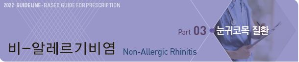
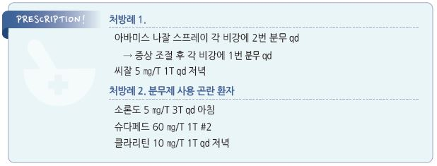

# 비-알레르기비염 Non-Allergic Rhinitis



## 일반 사항

* IgE에 매개되지 않은 코점막의 염증
* 비-감염성 비-알레르기비염 기전 : nociceptor 자극 → 부교감 신경 자극 → 점액 분비, 혈관 확장

### 원인

* 감염, 자극 or 강한 냄새/연기(예: 담배, 향수, 방향제, 매연), 온도 변화, 알코올, 약물, 임신

### 정상 nasal reflex

* postural reflex : supine position 시 앉아 있을 때보다 코 막힘 증가, 옆으로 누웠을 때 아래쪽 코막힘 증가
* crutch reflex : 겨드랑이가 압박되면 동측의 코 막힘 발생
* hot & cold cutaneous temperature reflex : 열 또는 추위에 피부 노출 시 재채기 발생
* visible & infrared light reflex : 밝은 빛에 노출 시 재채기 발생
* bronchonasal reflex : 찬 공기 등에 의한 코 자극 시 기관지 수축
* ovulatory rhinitis : peri-ovulatory period에 코 막힘 증가

### 알레르기비염(AR)과의 임상적 감별

* 눈/코/인두 가려움 또는 재채기가 현저하지 않음 (☞ p.241)
* 코 막힘 및 후비루가 AR보다 현저함
* 감염성 비염 외에는 계절 요인이 적음

## 종류

### 감염성 비염 (Infectious Rhinitis)

*   증상 : 보통 목 증상(인후통, 가려움) → 코 증상(코 막힘, 콧물, 재채기) → 기침 순으로 진행

    •AR에 비하여 증상이 서서히 발생, 전신 증상 동반 가능
* 원인 : 바이러스(대부분), 세균
* 기전 : 코 점막 부종, 섬모 운동 장애, 부비강 배출구 폐쇄/점액 정체, O2 tension 저하
* 치료 (☞ p.256, p.283)

### 혈관운동성 비염 (Vasomotor Rhinitis)

* 증상 : 코 막힘, 콧물; 간혹 가려움, 재채기; 계절적 변화 또는 눈 증상은 없음
* 기전 : vidian nerve의 과민 → 분비, 점막 부종 및 재채기 증가
*   관련 인자 : 온도 변화(덥거나 찬 공기), 운동, 자극(예: 냄새, 연기, 먼지), 습도, 음주, 뜨겁거나 매운 음식, 고령

    •특별한 항원 또는 감염과 관련 없음
* 치료 : 비내 steroid, 비내 항히스타민제

### Nonallergic rhinitis with eosinophilia syndrome (NARES)

* 증상 : 재채기, 물 같은 콧물, 코 막힘, 코 가려움; 알레르기/혈관운동성 비염보다 심한 증상
* 원인 : 불확실
* 관련 인자 : non-IgE-mediated asthma, aspirin intolerance
* 진단 : skin-prick test(-) & 혈청 특이 IgE Ab(-) 환자에서의 코 분비물 eosinophil ≥20%
* 치료 : 비내 steroid, 항히스타민제

### 미각 비염 (Gustatory Rhinitis)

* 증상 : 식사(특히 뜨겁거나 매운 음식) 시 코 막힘, 콧물
* 치료 : 식사 전 비내 항콜린제 분무

### 위축성 비염 (Atrophic Rhinitis)

* 증상 : 만성 코 막힘, 점막 건조, 딱지, 악취; 비정상적으로 넓은 비강, squamous metaplsia
* 원인 : glandular cell atrophy
* 관련 인자 : 노화, 세균 증식(K. ozaenae ), 반복적인 코/부비강 수술
* 치료 : 매일 비강 세척, 연고제 도포(필요시 항생제 연고 사용)

### 직업성 비염 (Occupational Rhinitis)

*   증상 : 코 막힘, 콧물; 알레르기 및 비-알레르기성 특성이 모두 있음

    •근무지에서 증상이 발생하고 근무지를 떠나면 호전
*   원인 : 근무지의 알레르겐 또는 자극 물질. 예) 식품 가공업- 음식물 단백질, 구두 제조업- 접착제, 화학 공장- 암모니아,

    마트- 세정제/향수/찬 공기

### 호르몬성 비염 (Hormonal Rhinitis)

* 증상 : 코 막힘, 콧물
* 원인 : 임신(특히 임신 말기\~출산 후 2주), 월경 기간, 경구 피임약, 갑상선저하증

### 약물 유발성 비염 (Drug-induced Rhinitis)

* 증상 : 코 막힘, 콧물
*   원인 : ACEI, α/β-차단제, reserpine, guanethidine, phentolamine, aspirin, NSAID, chlorpromazine, amitriptyline,

    alprazolam, PDE5i, 경구 피임제
* 원인 약물 중단 후 수 주 내 회복

### 약물 반동성 비염 (Rhinitis Medicamentosa)

* 증상 : 심한 코 막힘
* 원인 : 비내 울혈 제거제 반복 사용

### 해부학적 비염 (Anatomic Rhinitis)

* 보통 편측 발생

***

## Management

### 치료 방침

* 유발 인자/유발 약물 회피
* 비강 세척 (☞ p.243)
* 약물 치료 : 대부분의 경우 비내 steroid가 1차 선택제

### 치료제 선택

```

```

> **질병코드** J30.0 혈관운동성 비염

J31.0 만성 비염


