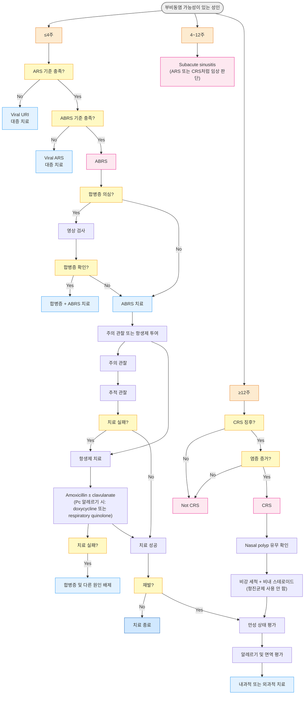

# 비부비동염 Rhinosinusitis, 부비동염 Sinusitis

## <mark style="color:green;">일반 사항</mark>

* **비부비동염(Rhinosinusitis)** : 비강(nasal cavity) 및 부비강(paranasal sinus)에 염증이 동반된 상태; 부비동염은 거의 항상 코 점막 염증을 동반하므로 비부비동염이라는 용어를 사용
* **Uncomplicated rhinosinusitis** : 비부비동 범위 밖으로 염증이 확장되지 않은 비부비동염 - 연조직·신경학적·안과적 이환 없음
* 바이러스에 의한 비부비동염은 보통 7\~10일 내 자연 호전

### <mark style="color:orange;">분류</mark>

* Acute rhinosinusitis (ARS) : ＜4주
* Subacute rhinosinusitis : 4\~12주
* Chronic rhinosinusitis (CRS) : ＞12주
* Recurrent acute rhinosinusitis (RARS) : 반복 발생, ≥4회/년; 각 episode 사이 무증상
* Acute bacterial rhinosinusitis (ABRS) : ARS(＜4주) 중 bacterial criteria 충족
  1. ≥10일 지속 without improvement
  2. severe onset (≥39℃ + 농성 비루 3\~4일 이상)
  3. double worsening 중 하나 이상 해당; RARS는 ≥7일 episode ≥3회/년

## <mark style="color:green;">원인</mark>

#### <mark style="color:$primary;">기전</mark>

* Sinus mucosa 염증(neutrophil 유입, cytokine 방출) 및 부종 → sinus mucosa surface 손상, mucociliary clearance 장애, sinus ostia(ostiomeatal complex) 폐쇄

#### <mark style="color:$primary;">원인균</mark>

* **바이러스** (대부분) : rhinovirus, adenovirus, influenza virus, parainfluenza virus
* **세균** (Viral URI 중 약 0.5\~2%에서 ABRS로 진행) : _Streptococcus pneumoniae_, _Haemophilus influenzae_, _Moraxella catarrhalis_
  * _S. aureu&#x73;_&#xB294; uncomplicated community ABRS의 routine pathogen이 아님 - CRS, 수술 후 상태, 의료 관련 감염, 면역 저하 시 고려
  * 최근 _H. influenzae_ 비율 증가 추세 - β-lactamase 생성 내성주 고려 필요
* **곰팡이** : 면역 저하자에서 주로 발생; _Aspergillus_ spp., _Mucor_ spp.

#### <mark style="color:$primary;">위험 인자</mark>

* **감기** (비부비동염의 대부분은 감기 관련 바이러스에 의해 발생), 기타 비염
* **구조적 이상** : 비중격 만곡, 비용종, 아데노이드 비대, choanal atresia, 비강 내 이물질, 비강/부비강 종양
* **섬모 기능 장애** : Kartagener's syndrome, 흡연, 코 울혈 제거제 남용
* **전신 질환** : 조절되지 않는 당뇨병, 백혈구 감소, 스테로이드 장기 사용, GERD, sarcoidosis, Wegener's granulomatosis(EGPA), cystic fibrosis
* **치과 질환** : 상악 치아의 치근단 감염이 상악동염의 원인이 될 수 있음 (치성 부비동염)

### <mark style="color:$danger;">🚩 Red Flags!</mark>

<mark style="color:$danger;">**즉각 의뢰/응급실**</mark>

* 안와 부종·발적, 안구 돌출, 안구 운동 장애, 복시, 시력 저하 → 안와 침범 (안와 봉와직염/농양)
* 지속되는 고열(≥39℃) + 심한 두통, 수막 자극 증상(경부 강직·Kernig 징후), 의식 변화 → 두개 내 합병증 (뇌수막염·경막하/경막외 농양·해면정맥동 혈전증)
* 고열, 심한 전신 쇠약, 패혈증 징후 → 중독성 외모(toxic appearance)

<mark style="color:$warning;">**당일 또는 조기 재평가·의뢰**</mark>

* 편측 증상 지속 : 편측 코 막힘·편측 출혈·편측 분비물이 치료에 반응하지 않거나 지속 → 종양
* 적절한 항생제 치료(1차 및 2차) 후에도 반응하지 않음
* 면역 저하자 (조절되지 않는 당뇨, 장기 이식, HIV, 스테로이드 장기 복용) → 침습성 진균성 비부비동염
* 수술 적응증 (중증 비용종, mucocele/mucopyocele, 폐쇄성 종양) 의심
* 원내 감염 또는 복합 문제 (간/신 장애, 항생제 과민반응)
* RARS를 동반한 CRS 악화

## <mark style="color:green;">임상 양상 및 진단</mark>

#### <mark style="color:$primary;">비부비동염 추정 기준 (Maxillary Sinusitis 기준)</mark>

* 주증상 ≥2개, 또는 주증상 1개 + 부증상 ≥2개
  * 주증상 **:** ⓵ 화농성 전방 비루(purulent anterior nasal drainage), ⓶ 화농성 후비루, ⓷ 코 막힘, ⓸ 얼굴 울혈감·충만감, ⓹ 얼굴 통증·압박감 (단독으로는 진단 요소 불가), ⓺ 후각 저하, ⓻ 발열 (급성인 경우만)
  * 부증상 : ⓵ 두통, ⓶ 귀의 통증·압박·충만감, ⓷ 입냄새, ⓸ 치통, ⓹ 기침, ⓺ 발열(모든 경우), ⓻ 피로감

#### <mark style="color:$primary;">세균 감염(ABRS) 진단 기준</mark>

* 다음 중 하나 이상 해당 시 ABRS 의심
  1. 농성 콧물·코 막힘·안면 압통 등 ARS 증상이 호전 없이 ≥10일 지속
  2. 발병 초기부터 최소 3\~4일 연속 심한 증상 지속 : 발열(≥39℃) + 농성 콧물 + 얼굴 통증
  3. 초기 증상 호전 후 10일 내 증상 재악화('double worsening') - 통상 바이러스 감염 후 5\~6일째 일시 호전되었다가 다시 악화되는 이봉성(二峯性) 양상


**초록색 콧물 ≠ 세균 감염**\
콧물 색깔로 바이러스/세균을 감별할 수 없음. 초록색 농성 분비물은 호중구의 myeloperoxidase에 의한 것으로 바이러스 감염에서도 흔히 나타남; 10일 기준과 임상 중증도로 세균 감염 여부를 판단해야 함


#### <mark style="color:$primary;">ABRS 진단 및 항생제 투여 결정 가이드</mark>

<table><thead><tr><th width="119">질문 항목</th><th width="370">상태 확인</th><th>권고 사항</th></tr></thead><tbody><tr><td><strong>증상 기간</strong></td><td>10일 미만이며 호전 중</td><td>항생제 불필요; 주의 관찰</td></tr><tr><td><strong>증상 기간</strong></td><td>10일 이상 지속 또는 악화 중</td><td>항생제 치료 고려*</td></tr><tr><td><strong>발열</strong></td><td>발병 초기부터 3~4일간 ≥39℃ 지속 + 농성 비루</td><td>즉시 항생제 치료 고려*</td></tr><tr><td><strong>경과 양상</strong></td><td>호전 후 10일 내 급격히 재악화 = Double Worsening</td><td>항생제 치료 고려*</td></tr><tr><td><strong>Red Flags</strong></td><td>안와 부종, 심한 두통, 의식 변화</td><td>즉각 의뢰/응급실</td></tr></tbody></table>

_\*지속, 중증, double worsening의 세 가지 양상 중 하나 이상 해당 시 ABRS로 판단하여 항생제 투여를 고려 (항생제 오남용 방지를 위한 IDSA·AAO-HNS의 권고 기준)_

#### <mark style="color:$primary;">소아 ABRS 진단 기준</mark>

* 소아는 성인보다 ARS 발생 빈도가 높으며 (연간 6\~8회의 바이러스 상기도 감염 중 \~\~5\~\~\~10%가 ABRS로 진행), 진단 기준이 성인과 일부 다름
* 소아 ABRS 세균 감염 강력 시사 소견
  1. 72시간(3일) 이상 지속되는 고열(≥39℃) + 농성 비루 (성인의 3\~4일 기준보다 짧게 적용)
  2. 10일 이상 호전 없는 지속 증상 (성인과 동일)
  3. Double worsening
* 소아 항생제 투여 기간 : 10\~14일 (성인 5\~10일보다 길게)
* 소아에서는 amoxicillin/clavulanate가 amoxicillin 단독보다 우선 고려되는 경우가 많음 (내성 _H. influenzae_, _M. catarrhalis_ 빈도가 성인보다 높음)

#### <mark style="color:$primary;">부위별 부비동염 특징</mark>

<table><thead><tr><th width="170">부위</th><th>특징적 증상</th></tr></thead><tbody><tr><td>Maxillary sinusitis</td><td>협부·치아 통증/압박감; 전두부 두통 동반 가능</td></tr><tr><td>Ethmoidal sinusitis</td><td>눈 사이 내안각 부위 통증/압박감, 안와로 방사; maxillary sinusitis에 동반 발생이 흔함</td></tr><tr><td>Frontal sinusitis</td><td>전두부 통증/압통; 눈썹 내측 끝 아래 orbital roof 촉지 시 통증 유발</td></tr><tr><td>Sphenoidal sinusitis</td><td>머리 중앙/vertex 두통; pansinusitis 시 발생; 진단 지연 시 두개내 합병증 위험</td></tr></tbody></table>

#### <mark style="color:$primary;">증상에 따른 감별</mark>

**코 분비물**

* 편측 발생 → 비부비동염 가능성 낮음; 이물질·종양·치성 부비동염 고려
* 색깔 : 맑음·노란색·초록색 모두 바이러스/세균 감염에서 나타날 수 있음 - 색깔만으로 원인 감별 불가
* 혈흔 동반 : 편측(종양·이물·코 후빔), 양측(육아종증·출혈 경향·코 후빔)

**코 막힘**

* 편측 → 비중격 만곡, 이물, 폴립, 종양
* 양측 → 비염, 폴립, S자 비중격 만곡
* 교대 발생 → 비염

**후각 저하**

* 일시적·경증 → 알레르기비염, 바이러스 감염
* 간헐적 → 점막 질환, 폴립, 비부비동염
* 지속 → 심한 폴립, 종양, 아연 결핍, 약물 반응
* 점차 악화 → Parkinson's disease, Alzheimer's dementia

**통증**

* 분비물·후각 저하 동반 → 비부비동염
* 다른 코 증상 없이 통증만 → 비부비동염 가능성 낮음; 편두통·삼차신경통·측두하악관절 장애 고려

### <mark style="color:orange;">검사</mark>

* 합병증이 발생하지 않는 한 바이러스·세균 감별을 위한 일상적 검사는 불필요
* Sinus 배양 검사 : 항생제 치료 실패 시 고려
* Sinus X선 : 거의 도움이 되지 않으며 합병증 없는 비부비동염에서 권고하지 않음
* CT : 치료 실패(4\~12주 이상 증상 지속), 합병증 의심, 수술 전 해부학적 평가 시 시행; 약물 치료 4\~6주 후 시행 권고
* MRI : 액체·염증·종양 감별에 유리; 두개 내·안와 합병증 의심 시
* 비강 내시경 : 치료 실패 또는 CRS에서 구조적 원인 확인

***

## <mark style="background-color:$warning;">Management - 급성 비부비동염</mark>

### <mark style="color:orange;">치료 방침</mark>

* 대부분 대증 치료로 회복 - 항생제는 선택적 적용
  * 항생제는 단지 5%의 환자에서만 증상 기간을 단축시키며, 부작용 발생은 위약의 약 2배
  * 증상 발생 후 10일 미만이고 경증이면 주의 관찰 - ABRS 기준(≥10일 지속·severe onset·double worsening) 충족 시 항생제 투여 고려
* 대증 치료 : 진통제, 비내 스테로이드, 식염수 비강 세척
* 동반 질환 치료 : 알레르기비염, 당뇨
* 합병증 없이 치료된 비부비동염에 대한 추가 평가는 불필요

### <mark style="color:orange;">비강 세척 (Nasal Saline Irrigation)</mark>

* 대증 치료의 핵심 - 점막 보습·점액 배출 촉진·자극 물질 제거
* 등장성 생리식염수(0.9%) : 일반적 유지 세척; 자극 없이 장기 사용 가능
* 고장성 식염수(hypertonic saline, 2\~3%) : 단기 사용
  * 삼투압 효과로 점막 부종 완화. 등장성 대비 증상 완화 및 점액 배출 효과 우월 <mark style="color:blue;">\[페스 비강분무액]</mark>
  * 자극감(작열감·재채기)이 있으며 장기 사용 시 섬모 기능 억제 유발 우려
  * 코 막힘이 심한 초기 2\~3일간 고장성 식염수 사용 후 등장성으로 전환
* 세척 방법 (☞ [알레르기비염](051_-allergic-rhinitis.md#undefined-18))

### <mark style="color:orange;">코 울혈 제거제 (Decongestants)</mark>

* 경구 : 코 막힘에 약간의 효과
  * pseudoephedrine : 30\~60 ㎎ #3\~4; 고혈압·전립선비대증·갑상선항진증 주의 <mark style="color:blue;">\[슈다페드]</mark>
* 비내 : 강력한 혈관 수축 효과; 반동성 비충혈 예방을 위해 연속 사용 [≤4일 제한](052_-non-allergic-rhinitis.md#rhinitis-medicamentosa) (비급여)
  * phenylephrine <mark style="color:blue;">\[시네프린]</mark>, naphazoline/chlorpheniramine 복합제 <mark style="color:blue;">\[나리스타]</mark>, xylometazoline <mark style="color:blue;">\[오트리빈]</mark>, oxymetazoline <mark style="color:blue;">\[레스피비엔]</mark>

### <mark style="color:orange;">스테로이드 (Steroids)</mark>

* 비내 스테로이드 : 알레르기비염 동반 시 유효; ABRS에서도 증상 완화에 도움; ＞12세에서 고용량 고려
  * budesonide <mark style="color:blue;">\[나리타점비액]</mark>, mometasone <mark style="color:blue;">\[나조넥스나잘]</mark> (☞ [알레르기비염](051_-allergic-rhinitis.md#steroid))
* 경구 스테로이드 : ABRS에서 routine 사용은 권장하지 않음
  * 심한 안면 통증·심한 점막 부종이 있고 전문의 지시 하에 단기(≤3일) 제한적 고려
  * prednisolone 20\~30 ㎎/d 단기; CRS 악화 시 치료 기준은 CRS 섹션 참조 <mark style="color:blue;">\[소론도]</mark>

### <mark style="color:orange;">항히스타민제</mark>

* 효과 : 비부비동염 자체에 대한 효과는 입증 안 됨; 점액 점도 증가 및 점막 건조로 악영향 가능
* 알레르기 증상 심하게 동반 시에만 고려 (☞ [알레르기비염](051_-allergic-rhinitis.md#undefined-24))
  * cetirizine 10 ㎎ qd <mark style="color:blue;">\[지르텍]</mark>, fexofenadine 120 ㎎ qd <mark style="color:blue;">\[알레그라]</mark>, loratadine 10 ㎎ qd <mark style="color:blue;">\[클라리틴]</mark>
  * 비내 : azelastine 비공 당 2번 분무 bid <mark style="color:blue;">\[아젭틴비액]</mark>

### <mark style="color:orange;">진통제</mark>

* 통증 정도에 따라 선택; 간헐적 투여보다 지속 사용이 효과적
  * ibuprofen 400\~800 ㎎ tid <mark style="color:blue;">\[부루펜]</mark>
  * acetaminophen 650\~1,300 ㎎ tid <mark style="color:blue;">\[타이레놀]</mark>
  * tramadol 100 ㎎ bid\~qid <mark style="color:blue;">\[트리돌]</mark>; tramadol/acetaminophen <mark style="color:blue;">\[울트라셋]</mark>

### <mark style="color:orange;">점액용해제 (Mucolytics)</mark>

* 점막 섬모 기능 회복 기대; 효과 명확히 입증되지 않음
  * guaifenesin 200 ㎎ bid\~qid <mark style="color:blue;">\[코데닝]</mark>
  * ambroxol 30 ㎎/T tid <mark style="color:blue;">\[뮤코펙트]</mark>

### <mark style="color:orange;">항생제</mark>

* 대부분 항생제 투여 불필요 - ABRS 기준 충족 시 선택적 적용
* macrolide(azithromycin, clarithromycin), TMP/SMX, 2/3세대 세파계 : 내성 가능성으로 경험적 치료로는 권장하지 않음
* 투여 기간 : 성인 5일 (합병증 없는 경증\~중등증 ABRS - 최신 가이드라인은 5일 요법이 10일과 동등 효과임을 강조하며 기간 단축 권고); 7\~10일 고려 상황 - 중증 또는 합병증 위험군, ≥65세, 최근 1달 내 항생제 복용력; 소아 10\~14일
* 투여 시작 2\~3일 후 악화 또는 3\~5일 내 호전 없으면 변경 고려
* Doxycycline의 위상 상향 (IDSA) : Penicillin 알레르기 환자에서 doxycycline이 1차 대체제로 권고 등급이 높아짐 (기존 fluoroquinolone 우선에서 doxycycline과 동등 또는 우선으로 조정); 내성률이 낮고 혐기성균 커버 가능; 200 ㎎ 1일 후 100 ㎎ qd ×4일 (총 5일)

#### 내성 위험군

* ＜2세 또는 ＞65세, 보호시설/보육시설 생활자
* 최근 1달 내 항생제 복용, 최근 5일 내 입원 병력
* 동반 질환, 면역 저하

#### 항생제 선택

<table><thead><tr><th width="149">구분</th><th width="204">약물</th><th>용량</th></tr></thead><tbody><tr><td>Preferred <br>first-line</td><td>amoxicillin/clavulanate <mark style="color:blue;">[오구멘틴]</mark></td><td>500 ㎎ tid 또는 875 ㎎ bid</td></tr><tr><td>저위험군 대안</td><td>amoxicillin <mark style="color:blue;">[파목신]</mark></td><td>500~875 ㎎ bid</td></tr><tr><td>대체제</td><td>cefpodoxime <mark style="color:blue;">[바난]</mark></td><td>200 ㎎ bid</td></tr><tr><td>대체제</td><td>cefdinir <mark style="color:blue;">[옴니세프]</mark></td><td>300 ㎎ bid 또는 600 ㎎ qd</td></tr><tr><td>대체제</td><td>cefuroxime <mark style="color:blue;">[진네트]</mark></td><td>250~500 ㎎ bid</td></tr><tr><td>Pc 알레르기 1차</td><td>doxycycline <mark style="color:blue;">[독시사이클린]</mark></td><td>200 ㎎ 1일 후 100 ㎎ qd ×4일</td></tr><tr><td>Pc 알레르기 대체</td><td>levofloxacin <mark style="color:blue;">[크라비트]</mark></td><td>500 ㎎ qd</td></tr><tr><td>Pc 알레르기 대체</td><td>moxifloxacin <mark style="color:blue;">[아벨록스]</mark></td><td>400 ㎎ qd</td></tr></tbody></table>

> **IDSA·AAO-HNS·EPOS** : amoxicillin/clavulanate를 preferred first-line으로 권고 - β-lactamase 생성 _H. influenzae_, _M. catarrhalis_ 내성 증가 반영\
> **대한감염학회** (2017) : amoxicillin 단독도 1차 선택에 포함 - 국내 내성률이 상대적으로 낮은 경우 경증\~중등도 저위험군에서 고려 가능

> **NICE 지침** (2017)\
> ≤10일 증상에는 항생제 미사용 원칙. ＞10일 호전 없는 경우 세균 감염 가능성에 따라 처방. 1차 : phenoxymethylpenicillin (Pc VK) 500 ㎎ qid ×5d; 대체 : doxycycline 200 ㎎ 1일 후 100 ㎎ qd ×4d, clarithromycin 500 ㎎ bid ×5d; 임신부 : erythromycin 500\~1,000 ㎎ bid ×5d; 2차 또는 고위험군 : amoxicillin/clavulanate 500/125 ㎎ tid ×5d

### <mark style="color:orange;">치료 실패 시 조치</mark>

* Partial response (호전은 되었으나 완전 회복 안 됨) : 10\~14일간 추가/교체 항생제 치료
* Poor response (3\~5일 1차 항생제에 거의 반응 없음) : 광범위 항생제 또는 내성균 대응 항생제
* 치료 순응도 확인, 비약물 치료 강화
* 기저 위험 인자(알레르기·비용종·종양·면역 저하·구조적 이상) 상세 평가
* 배양 검사/감수성 검사 고려
* CT 미시행 환자에서 부비강 CT 고려

***

## ■ 만성 비부비동염 (CRS)

## <mark style="color:green;">일반 사항</mark>

* 비부비동염의 객관적 증거 + 주요 증상(안면 통증/압박감, 후각 저하, 콧물, 코 막힘) 중≥2가지, ＞12주 지속
  * EPOS (2020) : 성인 CRS 진단 시 코 막힘 또는 콧물(전방 비루·후비루) 중 하나는 반드시 포함되어야 함 - 안면 통증·후각 저하만 있고 비루·코 막힘이 없으면 CRS 진단 불충분; 후각 저하의 진단적 비중은 더욱 강조됨
* CRS는 감염보다 염증 질환으로 이해; 반복되는 감염에 의한 점막 섬모 손상과 관련
* 모든 치료에도 완치가 어렵고 재발이 흔함; 치료 불응 시 의뢰


**안면 통증·후각 저하만 있고 코 막힘·비루가 전혀 없는 경우**에는 비부비동염보다 삼차신경통·편두통·안면 통증 증후군을 먼저 감별. 비부비동염 치료(항생제·비내 스테로이드) 시도 전에 신경학적 원인을 우선 평가


#### <mark style="color:$primary;">CRS 아형 분류 (최신 지견)</mark>

* **CRS without nasal polyps (CRSsNP)** : 호중구 우위 염증; Th1 편향; 비내 스테로이드·항생제 치료에 비교적 잘 반응
* **CRS with nasal polyps (CRSwNP)** : 호산구 우위 염증; Th2/IL-4/IL-5/IL-13 편향; 스테로이드 의존성; 재발 잦음
  * CRSwNP + 천식 + aspirin 과민증 (= [AERD](051_-allergic-rhinitis.md#drug-induced-rhinitis)) - 일반 스테로이드 치료에 반응 불량; 전문 의뢰 필요

### <mark style="color:orange;">위험 인자</mark>

* 고령, 면역 저하, 알레르기, 환경 자극/오염 지속 노출
* 해부학적 이상, mucociliary 기능 저하(cystic fibrosis, primary ciliary dyskinesia)
* 반복적인 상기도 감염, 전신 질환(당뇨병, eosinophilic granulomatosis, sarcoidosis)
* 최근 항생제 사용, 부비동 수술 후유증

## <mark style="color:green;">진단</mark>

* 알레르기비염 (☞ [알레르기비염](051_-allergic-rhinitis.md))
* 비알레르기비염 (☞ [비알레르기비염](052_-non-allergic-rhinitis.md))
* 2차성 비염 : 임신, 갑상선저하증
* 구조적 이상 : 비용종, 이물, 비중격 만곡, 편도/아데노이드 비대
* 편두통, 안면 통증 증후군(facial pain syndrome)
* 치성 부비동염 (Odontogenic Sinusitis)

#### <mark style="color:$primary;">치성 부비동염 (Odontogenic Sinusitis)</mark>

* 상악동 바닥과 상악 후방 치아(제1·2대구치, 제2소구치)의 치근이 매우 근접하거나 상악동 내로 돌출되어, 치근단 감염·치주염·임플란트 시술 합병증 등이 상악동염으로 직접 파급될 수 있음
* 최근 임플란트 및 상악 치과 시술 증가로 치성 상악동염 비율이 높아지는 추세 - 일부 연구에서 상악동염의 25\~40%가 치성 원인으로 보고

**임상 단서**

* 편측성 상악동염 (양측성이면 치성 가능성 낮음)
* 악취를 동반한 농성 비루(foul-smelling purulent discharge) - 구강 혐기성균(_Fusobacterium_, _Prevotella_ 등) 감염의 특징
* 비강 내시경 소견 : 중비도(middle meatus)의 국소적인 농(mucopus) - 일반 바이러스성 비부비동염에 비해 편측 중비도에 국한된 농이 특징적
* 상악 치아 통증·최근 발치/임플란트 시술 병력
* 항생제만으로 일시 호전 후 반복 재발 - 치과적 원인이 해결되지 않으면 항생제 종료 후 수 주 내 재발하는 패턴이 특징적; 이 패턴이 반복되면 치성 원인을 적극 의심

**진단**

* 치과용 panoramic X선 또는 CT (치근단 병변·상악동 바닥 침범 확인)

**치료**

* 원인 치아 치료(근관 치료, 발치, 임플란트 제거) 없이는 항생제만으로 완치가 어려움; 혐기성균 커버를 위해 amoxicillin/clavulanate 또는 metronidazole 병용 권장
* 치과 협진. 필요 시 이비인후과+구강악안면외과 협진

### <mark style="color:orange;">검사</mark>

* CT (민감도 excellent) : 약물 치료 4\~6주 후 시행; 구조적 원인·수술 적응증 평가
* 비강 내시경 (good) : 비용종·배농 위치·점막 상태 직접 확인
* Anterior rhinoscopy (fair)
* 알레르기 검사 : 동반 여부 확인


합병증 없는 ARS에는 CT 촬영 불필요

* uncomplicated ARS/ABRS에서는 CT 검사는 보류
* CT 적응 : 치료 실패(4\~6주 이상 증상 지속), 합병증 의심(안와 침범·두개내 파급), 수술 전 해부학적 평가
* 급성기에는 CT상 점막 비후·기액층(air-fluid level)이 정상에서도 흔히 관찰되어 위양성 높음


***

## <mark style="background-color:$warning;">Management - 만성 비부비동염</mark>

### <mark style="color:orange;">치료 방침</mark>

#### <mark style="color:$primary;">BSACI 지침</mark>

* **Grade A** : 식염수 비강 세척, 비내 스테로이드, 경구 항히스타민제(알레르기 환자), 장기(\~12주) 경구 항생제
* **Grade C** : 단기(\~2주) 경구 항생제, 점액용해제, 세균 분해물 <mark style="color:blue;">\[브롱코박솜]</mark>
* **Grade D** (전문가 의견) : 알레르겐 회피, 국소 항생제, 경구 스테로이드, 코 울혈 제거제, 전신/국소 항진균제, PPI, 면역 치료

## <mark style="color:green;">약물 치료</mark>

### <mark style="color:orange;">**항생제**</mark>

* 만성 비부비동염에서 항생제는 근거 불충분
* 사용 시 3개월 내 사용하지 않은 제제 또는 배양 검사에 따라 선택
* amoxicillin/clavulanate : 500 ㎎ tid 또는 875 ㎎ bid; 소아 45 ㎎/㎏/d #2 <mark style="color:blue;">\[오구멘틴]</mark>
* clindamycin : 300 ㎎ qid 또는 450 ㎎ tid; 소아 20\~40 ㎎/㎏/d #3\~4 <mark style="color:blue;">\[훌그램]</mark>
* moxifloxacin : 400 ㎎ qd <mark style="color:blue;">\[아벨록스]</mark>
* metronidazole <mark style="color:blue;">\[후라시닐]</mark> + 아래 중 하나 : cefuroxime <mark style="color:blue;">\[진네트]</mark>, cefdinir <mark style="color:blue;">\[옴니세프]</mark>, cefpodoxime <mark style="color:blue;">\[바난]</mark>, levofloxacin <mark style="color:blue;">\[크라비트]</mark>, azithromycin <mark style="color:blue;">\[지스로맥스]</mark>, clarithromycin <mark style="color:blue;">\[클래리시드]</mark>, TMP-SMX <mark style="color:blue;">\[셉트린]</mark>
* ✽ CRS에서의 저용량 장기 macrolide : azithromycin 또는 clarithromycin 저용량 8\~12주 사용이 일부 CRSsNP 환자에서 점막 염증 억제 효과 — 일본·유럽 지침에서 호산구 비증가형 CRS에 권고

**Delayed Antibiotic Prescription (지연 처방)**

* ABRS 기준 충족 시에도 경증이고 follow-up이 가능한 환자에서 즉각 항생제 대신 지연 처방 전략 적용 가능
* 방법 : 오늘 항생제를 처방하되 48\~72시간 내 증상 악화 또는 호전 없으면 복용 시작하도록 안내
* 불필요한 항생제 사용을 30\~40% 줄이면서 치료 만족도를 유지할 수 있음. 국내 외래 환경에서는 환자에게 복용 기준을 명확히 설명하는 것이 핵심

### <mark style="color:orange;">스테로이드</mark>

#### <mark style="color:$primary;">**비내 스테로이드**</mark>

* CRS의 핵심 장기 유지 치료 (☞ [알레르기비염](051_-allergic-rhinitis.md#steroid))

**스테로이드 비강 세척** (Off-label, 비보험)

* 일반 비내 스프레이는 비강 전방부에만 도달하고 부비동 내부까지 충분히 전달되지 않음. 심한CRS 환자, 특히 CRSwNP 또는 FESS 후 환자에서는 비내 스테로이드 비강 세척이 부비동 내 도달률을 크게 높일 수 있음
* 방법 : budesonide 0.5 ㎎/2 ㎖ <mark style="color:blue;">\[나리타점비액]</mark> <mark style="color:blue;">\[풀미코트 레스퓰]</mark>을 생리식염수 240 ㎖에 혼합하여 1일 1\~2회 비강 세척 - 세척 후 코를 풀지 않고 고개를 앞으로 숙여 용액이 부비동에 잔류하도록 유도
* 전신 흡수량은 미미하나 장기 고용량 사용 시 HPA 억제 주의; 6개월 이상 장기 사용 시 안압 측정 및 비점막 상태 확인 권장 - 녹내장 병력 또는 안압 상승 위험이 있는 환자에서는 안과 협진 고려

#### <mark style="color:$primary;">경구 스테로이드</mark>

* 단기적 증상 완화 효과; 장기적 이익 없음
* 심한 증상에 단기 사용(＜3주) : prednisolone 40 ㎎/d ×5d → 20 ㎎/d ×5d <mark style="color:blue;">\[소론도]</mark>

### <mark style="color:orange;">생물학적 제제 (Biologics)</mark>

* CRSwNP 전문 치료
* 적응 대상 : ⓵ 기존 비내 스테로이드·경구 스테로이드 치료에 불응하는 CRSwNP, ⓶ 기능적 내시경 수술(FESS) 후에도 재발·재수술이 잦은 환자, ⓷ 동반 천식·AERD 환자
* dupilumab : IL-4Rα 차단 → IL-4·IL-13 동시 억제; 2023년 국내 급여 적용 (CRSwNP에서 비내 스테로이드 불충분 반응, 비용종 수술 후 등 엄격한 기준 충족 시); 300 ㎎ SC q2w <mark style="color:blue;">\[듀픽센트]</mark>
* 기타 : mepolizumab(IL-5 차단), omalizumab(IgE 차단); 동반 천식·알레르기 표현형에 따라 선택
* 일차진료에서의 역할 : 생물학적 제제 처방 자체는 이비인후과·알레르기내과 전문 의뢰 영역. 일차 의원에서는 아래 기준 해당 시 적극적으로 의뢰
  1. 비내 스테로이드 3개월 이상 사용에도 비용종 지속·후각 소실 지속
  2. FESS 후 1년 내 재발 또는 잦은 재수술 병력
  3. CRSwNP + 조절되지 않는 천식 동반

### <mark style="color:orange;">치료 실패 시 조치</mark>

* aspirin-exacerbated respiratory disease, allergic fungal rhinosinusitis 고려
* 부비강 CT/MRI 및 배양 검사
* 비내 스테로이드 및 식염수 비강 세척 지속
* 경구 항생제 교체 (배양 결과 따라)
* 천식 등 동반 질환 치료
* 수술 치료(FESS) 고려, 이비인후과 의뢰

#### <mark style="color:$primary;">ABRS vs 편두통 감별</mark>

* 외래에서 가장 흔히 오진되는 조합 - "이마·눈 주위 두통 = 부비동염"으로 착각하기 쉬움

<table><thead><tr><th width="200">소견</th><th width="180">ABRS</th><th>편두통</th></tr></thead><tbody><tr><td>앞으로 숙일 때 통증 악화</td><td>가능</td><td>매우 흔함</td></tr><tr><td>농성 분비물</td><td>흔함</td><td>드묾</td></tr><tr><td>후각 저하</td><td>흔함</td><td>드묾</td></tr><tr><td>광과민증(photophobia)</td><td>드묾</td><td>매우 흔함</td></tr><tr><td>오심·구토</td><td>드묾</td><td>흔함</td></tr><tr><td>박동성 두통</td><td>드묾</td><td>흔함</td></tr><tr><td>10일 기준 충족</td><td>해당</td><td>해당 안 됨</td></tr></tbody></table>

※ 코 증상(농성 비루·후각 저하) 없이 두통·안면 통증만 있는 경우 ABRS 가능성 낮음. 이때는 편두통·삼차신경통을 우선 고려

#### <mark style="color:$primary;">비부비동염 주요 진단 Error</mark>

* 편두통을 부비동염으로 오진 : 코 증상 없는 두통 → 편두통 우선 고려
* 편측 증상에서 종양 놓침 : 편측 막힘·출혈·분비물 → 영상 검사 및 의뢰
* 치성 부비동염 간과 : 편측 상악동염 + 악취 비루 → 치과 파노라마
* 초록색 콧물 = 세균 감염으로 단정 : 색깔로 감별 불가 — 10일 기준과 중증도 판단
* CRS에 반복 단기 항생제 : CRS는 감염이 아닌 염증 질환 — 비내 스테로이드 장기 유지가 핵심
* 합병증 없는 ARS에 CT 남용 : 치료 실패·합병증 의심 시에만 CT
* ABRS 기준 미충족 시 항생제 처방 : 10일 기준·severe onset·double worsening 확인 후 처방
* 알레르기비염을 반복 부비동염으로 오인 : 맑은 비루·재채기·양측 코막힘 → 알레르기 검사
* Aspirin 과민 + 비용종에서 NSAID 처방 : AERD/NERD - aspirin/NSAID 금기, 의뢰
* 면역 저하자 ARS에서 진균 감염 간과 : 당뇨·이식·HIV → 침습성 진균성 비부비동염 배제

***

### <mark style="color:orange;">비부비동염 관리 알고리듬</mark>



<p align="center"><strong>비부비동염 관리 알고리듬</strong><br><em>Ref. AAO/HNSF Clinical Practice Guideline: Adult Sinusitis, 2015</em></p>

***

### <mark style="color:red;">질병코드</mark>

J01 급성 부비동염\
J32 만성 부비동염

***

## <mark style="color:purple;">처방례</mark>

> **처방례 1. 바이러스성 ARS — 대증 치료**
>
> ```
> <mark style="color:blue;">[코데닝]</mark> 200 ㎎/T   2T   #3   (졸음 주의)
> <mark style="color:blue;">[맥시부펜 이알]</mark> 300 ㎎/T   3T   #3   (통증 시)
> <mark style="color:blue;">[아바미스]</mark> 나잘 스프레이   각 비강 2 puffs   qd
> ```
>
> _✽ 항생제 처방은 불필요. 비내 스테로이드는 점막 부종 완화·증상 기간 단축에 도움. 7\~10일 후에도 증상 호전 없으면 재방문 안내. 식염수 비강 세척 1일 2회 병행 권장_

> **처방례 2. ABRS — 항생제 1차 (경증\~중등도)**
>
> ```
> <mark style="color:blue;">[파목신]</mark> 500 ㎎/T   2T   bid   × 5~7일
> <mark style="color:blue;">[뮤코펙트]</mark> 30 ㎎/T   1T   tid
> <mark style="color:blue;">[맥시부펜 이알]</mark> 300 ㎎/T   3T   #3   (통증/발열 시)
> <mark style="color:blue;">[아바미스]</mark> 나잘 스프레이   각 비강 2 puffs   qd
> ```
>
> _✽ amoxicillin 단독은 내성 위험군이 아닌 경증_~~_중등도 ABRS의 1차 선택. 투여 2_~~_3일 후 악화 또는 3\~5일 내 호전 없으면 amoxicillin/clavulanate로 교체_

> **처방례 3. ABRS — 항생제 1차 (중등도\~중증, 내성 위험군)**
>
> ```
> <mark style="color:blue;">[오구멘틴]</mark> 625 ㎎/T   1T   #3   × 5~7일   (또는 875 ㎎ bid)
> <mark style="color:blue;">[뮤코펙트]</mark> 30 ㎎/T   1T   tid
> <mark style="color:blue;">[맥시부펜 이알]</mark> 300 ㎎/T   3T   #3
> <mark style="color:blue;">[아바미스]</mark> 나잘 스프레이   각 비강 2 puffs   qd
> ```
>
> _✽ amoxicillin/clavulanate 우선 선택 적응 : 최근 1달 내 항생제 사용, 치료 실패 병력, 중증 증상(≥39℃), frontal/sphenoidal sinusitis, ≥65세, 기저 질환. ✽ 875 ㎎ 제형 bid 처방 시 위장 부작용 감소, 순응도 향상_

> **처방례 4. ABRS — Pc 알레르기 (1차 대체)**
>
> ```
> <mark style="color:blue;">[독시사이클린]</mark> 100 ㎎/T   2T   qd   × 1일 (로딩)
>                          1T   qd   × 4일
>   (총 5일; 또는 100 ㎎ bid × 5일로 단순화 가능)
> <mark style="color:blue;">[뮤코펙트]</mark> 30 ㎎/T   1T   tid
> <mark style="color:blue;">[맥시부펜 이알]</mark> 300 ㎎/T   3T   #3
> ```
>
> _✽ IDSA 최신 기준에서 Pc 알레르기 시 doxycycline이 fluoroquinolone과 동등한 1차 대체제로 권고됨. 혐기성균 커버 가능, 내성률 낮음. 식도 자극 예방을 위해 충분한 물과 함께 복용하고 복용 후 30분간 눕지 않도록 교육. **유제품·칼슘제·제산제·철분제와 함께 복용하면 킬레이트 형성으로 흡수율이 저하**되므로 복용 1\~2시간 전후로 간격을 두도록 안내. 임신부·8세 미만 소아 금기._
>
> _✽ Fluoroquinolone 대체가 필요한 경우 (1차 치료 실패, 중증, 고위험군) :_
>
> ```
> <mark style="color:blue;">[크라비트]</mark> 500 ㎎/T   1T   qd   × 5~7일
> ```
>
> _✽ tendon rupture·QT 연장·혈당 이상 등 부작용 교육 필요_

> **처방례 5. 알레르기비염 동반 ABRS**
>
> ```
> <mark style="color:blue;">[오구멘틴]</mark> 625 ㎎/T   1T   #3   × 5~7일
> <mark style="color:blue;">[아바미스]</mark> 나잘 스프레이   각 비강 2 puffs   qd
> <mark style="color:blue;">[씨잘]</mark> 5 ㎎/T   1T   qd   저녁
> <mark style="color:blue;">[뮤코펙트]</mark> 30 ㎎/T   1T   tid
> ```
>
> _✽ 알레르기비염이 기저 원인인 경우 비내 스테로이드와 항히스타민제 병용이 재발 예방에 중요. 알레르기 치료는 항생제 종료 후에도 지속_

> **처방례 6. 만성 비부비동염 — 기본 유지 치료**
>
> ```
> <mark style="color:blue;">[아바미스]</mark> 나잘 스프레이   각 비강 2 puffs   qd   (장기 유지)
> <mark style="color:blue;">[소론도]</mark> 5 ㎎/T   8T   qd   아침   × 5일 후 4T × 5일   (증상 심할 때 단기)
> <mark style="color:blue;">[뮤코펙트]</mark> 30 ㎎/T   1T   tid
> ```
>
> _✽ CRS의 핵심은 비내 스테로이드 장기 유지 + 식염수 비강 세척. 경구 스테로이드는 심한 증상 악화 시 단기(3주 미만) 사용에 한정. 4\~6주 치료 후에도 반응 없으면 부비강 CT 및 이비인후과 의뢰_

***

### <mark style="color:$success;">핵심 복약 지도</mark>

> **항생제 처방 시 환자 안내**
>
> * 증상이 나아지더라도 **처방된 기간까지 끝까지 복용**하십시오. 임의 중단 시 내성균이 생길 수 있습니다.
> * 복용 후 **2\~3일이 지나도 증상이 악화**되거나 **3\~5일이 지나도 호전이 없으면** 병원에 다시 방문하십시오.
> * 오구멘틴(아목시실린/클라불란산)은 식사 중 또는 식사 직후에 복용하면 **위장 부작용(메스꺼움·설사)을 줄일 수 있습니다.**
> * 항생제 복용 중 피부 발진, 두드러기, 호흡 곤란이 생기면 즉시 복용을 중단하고 병원을 방문하십시오.

> **비내 스테로이드 스프레이 올바른 사용법**
>
> * 분무구를 눈 바깥쪽 방향(비강 외측벽)으로 향하게 하고 분사하십시오 — 비중격을 향해 분사하면 코피가 생길 수 있습니다.
> * 효과가 나타나기까지 **2\~4주**가 걸립니다. 증상이 바로 나아지지 않아도 꾸준히 사용하십시오.
> * 분무 후 코를 세게 풀지 마십시오.

> **식염수 비강 세척 방법**
>
> * 세척은 하루 **1\~2회**, 약 240 ㎖(1컵)의 생리식염수를 사용합니다.
> * 고개를 **45도 앞으로 숙이고** 한쪽 비공에 세척액을 넣으면 반대쪽으로 흘러나옵니다.
> * 세척 후 코를 세게 풀지 마시고 부드럽게 풀어 주십시오.
> * 세척 용기는 사용 후 깨끗이 씻고 완전히 건조시켜 보관하십시오 — 세균 오염 방지.

> **언제 즉시 병원을 방문해야 하나요?**
>
> * 눈 주위가 붓거나 빨개지고, 눈 움직임이 불편하거나 시력이 흐려질 때
> * 극심한 두통, 목이 뻣뻣해지거나, 빛에 눈이 심하게 부실 때
> * 39℃ 이상의 고열이 지속될 때
> * 항생제를 복용 중인데도 증상이 오히려 나빠질 때

***

### <mark style="color:blue;">환자 안내서</mark>


**부비동염(비부비동염)이란 무엇인가요?**

부비동(코 주변의 빈 공간)과 코 점막에 염증이 생긴 상태입니다. 대부분은 감기 바이러스에 의해 발생하며, 10명 중 1~~2명만 세균에 의한 감염으로 진행합니다. 세균 감염이 아닌 경우 항생제는 효과가 없으며, 대부분 7~~14일 내에 저절로 호전됩니다.


#### <mark style="color:$primary;">항생제가 꼭 필요한가요?</mark>


**💊 항생제에 대한 흔한 오해**

* **"콧물이 초록색이니까 항생제가 필요하다"** — 사실이 아닙니다. 초록색 콧물은 바이러스 감염에서도 흔하며, 색깔만으로 항생제 필요 여부를 판단할 수 없습니다.
* **"항생제를 빨리 쓸수록 빨리 낫는다"** — 연구에 따르면 세균 감염이 없는 경우 항생제는 회복 기간을 단축시키지 않으며, 오히려 부작용(위장장애·설사·내성균)이 발생할 수 있습니다.
* 의사는 **10일 기준과 증상의 중증도**를 보고 항생제 필요 여부를 판단합니다.


#### <mark style="color:$primary;">집에서 할 수 있는 관리법</mark>


**✅ 증상 완화에 효과적인 방법**

1. **식염수 비강 세척** : 하루 1~~2회 생리식염수로 코를 세척하면 점막이 촉촉해지고 분비물 배출에 효과적입니다. 코 막힘이 매우 심한 초기 2~~3일은 고장성 식염수(약국에서 구입 가능한 하이토닉 세척액 등)를 사용하면 삼투압 효과로 점막 부종을 더 빠르게 줄일 수 있습니다. 단, 자극감이 있으므로 증상이 심할 때만 짧게 사용하고, 이후에는 일반 생리식염수로 전환하십시오.
2. **충분한 수분 섭취** : 하루 6\~8잔의 물을 드시면 점액이 묽어져 배출이 쉬워집니다.
3. **습도 유지** : 실내 습도를 40\~60%로 유지하십시오. 가습기나 따뜻한 샤워 증기도 도움이 됩니다.
4. **온찜질** : 얼굴(코·눈 주위)에 따뜻한 수건을 대면 통증과 압박감이 완화됩니다.
5. **머리 높이기** : 취침 시 베개를 높이면 부비강 배출이 쉬워지고 코 막힘이 완화됩니다.
6. **진통제** : 두통이나 안면 통증이 있을 때 이부프로펜이나 타이레놀을 복용하십시오.


#### <mark style="color:$primary;">이럴 때는 즉시 병원을 방문하세요</mark>

* **눈 주위가 붓거나** 눈 움직임이 불편하거나 시력이 변할 때
* **극심한 두통**과 함께 목이 뻣뻣하거나 빛에 눈이 심하게 부실 때
* **39℃ 이상의 고열**이 지속될 때
* 항생제 복용 중에도 **증상이 오히려 나빠질 때**
* 증상이 **10일 이상** 호전 없이 지속될 때

***


**🩺 부비동염 관리 3원칙**

**① 대부분은 저절로 낫습니다** — 감기 후 발생한 부비동염의 90% 이상은 항생제 없이도 2주 내에 좋아집니다. 충분한 휴식과 수분 섭취가 가장 중요합니다.

**② 식염수 비강 세척을 꾸준히 하세요** — 약보다 효과적일 수 있는 가장 기본적인 치료입니다. 하루 1\~2회 규칙적으로 시행하십시오.

**③ 증상이 10일 이상 지속되거나 갑자기 나빠지면 병원을 방문하세요** — 세균 감염으로 진행했거나 합병증이 생겼을 수 있습니다.

