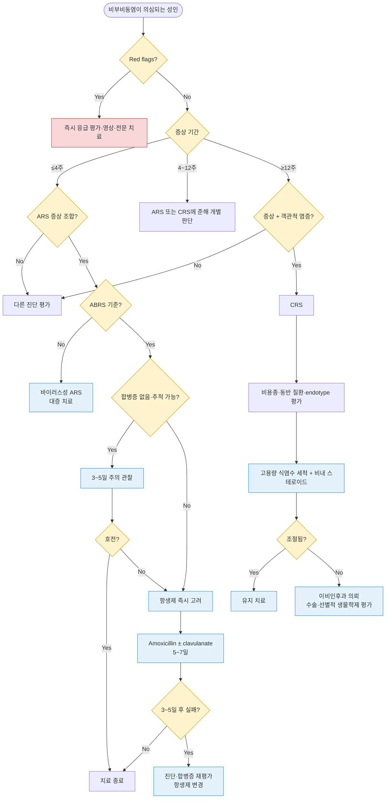

# 비부비동염 Rhinosinusitis, 부비동염 Sinusitis

## <mark style="color:green;">일반 사항</mark>

* **비부비동염(Rhinosinusitis)** : 비강(nasal cavity) 및 부비강(paranasal sinus)에 염증이 동반된 상태; 부비동염은 거의 항상 코 점막 염증을 동반하므로 비부비동염이라는 용어를 사용
* **Uncomplicated rhinosinusitis** : 비부비동 범위 밖으로 염증이 확장되지 않은 비부비동염 - 연조직·신경학적·안과적 이환 없음
* 바이러스성 비부비동염은 보통 발병 3일 전후 가장 심하고 이후 호전하여 10\~14일 내 회복

### <mark style="color:orange;">분류</mark>

* Acute rhinosinusitis (ARS) : ≤4주
* Subacute rhinosinusitis : ＞4주, ＜12주; ARS 또는 CRS에 준해 임상적으로 개별 판단
* Chronic rhinosinusitis (CRS) : ≥12주
* Recurrent acute rhinosinusitis (RARS) : 반복 발생, ≥4회/년; 각 episode 사이 무증상
* Acute bacterial rhinosinusitis (ABRS) : ARS(＜4주) 중 bacterial criteria 충족
  1. ≥10일 지속 without improvement
  2. severe onset (≥39℃ + 농성 비루 3\~4일 이상)
  3. double worsening 중 하나 이상 해당

## <mark style="color:green;">원인</mark>

#### <mark style="color:$primary;">기전</mark>

* Sinus mucosa 염증(neutrophil 유입, cytokine 방출) 및 부종 → sinus mucosa surface 손상, mucociliary clearance 장애, sinus ostia(ostiomeatal complex) 폐쇄

#### <mark style="color:$primary;">원인균</mark>

* **바이러스** (대부분) : rhinovirus, adenovirus, influenza virus, parainfluenza virus
* **세균** (Viral URI 중 약 0.5\~2%에서 ABRS로 진행) : _Streptococcus pneumoniae_, _Haemophilus influenzae_, _Moraxella catarrhalis_
  * _S. aureus_는 uncomplicated community ABRS의 routine pathogen이 아님 - CRS, 수술 후 상태, 의료 관련 감염, 면역 저하 시 고려
  * 최근 _H. influenzae_ 비율 증가 추세 - β-lactamase 생성 내성주 고려 필요
* **곰팡이**
  * 침습성 진균성 비부비동염 : 주로 조절되지 않는 당뇨병·호중구감소·장기 이식 등 면역 저하자에서 발생; _Aspergillus_ spp., Mucorales 등
  * 비침습성 fungal ball 및 allergic fungal rhinosinusitis는 면역정상자에서도 발생 가능

#### <mark style="color:$primary;">위험 인자</mark>

* **감기** (비부비동염의 대부분은 감기 관련 바이러스에 의해 발생), 기타 비염
* **구조적 이상** : 비중격 만곡, 비용종, 아데노이드 비대, choanal atresia, 비강 내 이물질, 비강/부비강 종양
* **섬모 기능 장애** : Kartagener's syndrome, 흡연, 코 울혈 제거제 남용
* **전신 질환** : 조절되지 않는 당뇨병, 백혈구 감소, 스테로이드 장기 사용, GERD, sarcoidosis, granulomatosis with polyangiitis(GPA), eosinophilic granulomatosis with polyangiitis(EGPA), cystic fibrosis
* **치과 질환** : 상악 치아의 치근단 감염이 상악동염의 원인이 될 수 있음 (치성 부비동염)

### <mark style="color:$danger;">🚩 Red Flags!</mark>

<mark style="color:$danger;">**즉각 의뢰/응급실**</mark>

* 안와 부종·발적, 안구 돌출, 안구 운동 장애, 복시, 시력 저하 → 안와 침범 (안와 봉와직염/농양)
* 지속되는 고열(≥39℃) + 심한 두통, 수막 자극 증상(경부 강직·Kernig 징후), 의식 변화 → 두개 내 합병증 (뇌수막염·경막하/경막외 농양·해면정맥동 혈전증)
* 고열, 심한 전신 쇠약, 패혈증 징후 → 중독성 외모(toxic appearance)
* 당뇨병·면역 저하자에서 급속히 진행하는 편측 안면통·부종, 비점막 창백/괴사·검은 가피, 뇌신경마비 → 급성 침습성 진균성 비부비동염

<mark style="color:$warning;">**당일 평가·의뢰**</mark>

* 안와 주위 통증·부종이 있으나 시력 저하·안구 운동 장애 등 명확한 합병증 소견은 아직 없음
* 면역 저하자에서 새로 발생한 비부비동염 증상 또는 통상적 치료에 반응하지 않는 편측 안면통
* 적절한 항생제 치료 3\~5일 후 악화하거나 전혀 호전되지 않음
* Mucocele/mucopyocele가 의심되면서 급성 안와 주위 부종·통증 또는 신경학적 증상이 동반

<mark style="color:$info;">**조기 외래 평가·추적**</mark>

* 편측 코 막힘·출혈·악취성 분비물이 지속되거나 치료에 반응하지 않음 → 종양·이물·치성 부비동염 감별
* 연 4회 이상 반복되고 발작 사이에는 무증상 → RARS 평가
* 12주 이상 지속되는 코 막힘·비루·후각 저하 → CRS 객관적 확진
* 큰 폐쇄성 비용종, 합병증이 없는 mucocele 또는 수술이 필요할 수 있는 구조적 병변 의심

## <mark style="color:green;">임상 양상 및 진단</mark>

#### <mark style="color:$primary;">급성 비부비동염 임상 진단</mark>

* 성인 ARS : **농성 비루(전방 또는 후방)와 코 막힘 또는 안면 통증·압박감 중 하나 이상**이 동반되고 증상 기간이 4주 이내
* 후각 저하·발열·두통·치통·기침·피로감 등은 진단을 보조하지만 단독으로 ARS를 진단하지 않음
* 다른 코 증상 없이 안면 통증·두통만 있으면 편두통·삼차신경통·측두하악관절 장애를 우선 감별

#### <mark style="color:$primary;">세균 감염(ABRS) 진단 기준</mark>

* 다음 중 하나 이상 해당 시 ABRS 의심
  1. 농성 콧물·코 막힘·안면 압통 등 ARS 증상이 호전 없이 ≥10일 지속
  2. 발병 초기부터 최소 3\~4일 연속 심한 증상 지속 : 발열(≥39℃) + 농성 콧물 + 얼굴 통증
  3. 초기 증상 호전 후 다시 악화('double worsening') - 새 발열·두통 또는 비루 증가 등이 나타나는 이봉성(二峯性) 양상


AAO-HNSF 2025의 핵심 진단 기준은 **10일 이상 호전 없음** 또는 **초기 호전 후 재악화**이다. 발병 초기 ≥39℃ 고열과 농성 비루/안면통이 3\~4일 지속되는 severe onset은 IDSA 기준이며, 세균 감염 가능성과 즉시 항생제 치료 필요성을 높이는 임상 단서로 함께 사용할 수 있다.



**초록색 콧물 ≠ 세균 감염**\
콧물 색깔로 바이러스/세균을 감별할 수 없음. 초록색 농성 분비물은 호중구의 myeloperoxidase에 의한 것으로 바이러스 감염에서도 흔히 나타남; 10일 기준과 임상 중증도로 세균 감염 여부를 판단해야 함


#### <mark style="color:$primary;">ABRS 진단 및 항생제 투여 결정 가이드</mark>

<table><thead><tr><th width="119">질문 항목</th><th width="370">상태 확인</th><th>권고 사항</th></tr></thead><tbody><tr><td><strong>증상 기간</strong></td><td>10일 미만이며 호전 중</td><td>항생제 불필요; 대증 치료</td></tr><tr><td><strong>ABRS, 합병증 없음</strong></td><td>10일 이상 호전 없음 또는 double worsening</td><td>추적이 보장되면 우선 3~5일 주의 관찰</td></tr><tr><td><strong>중증/고위험</strong></td><td>≥39℃ 고열과 농성 비루·심한 안면통 3~4일, 면역 저하 등</td><td>즉시 항생제 치료를 개별적으로 고려</td></tr><tr><td><strong>관찰 중 실패</strong></td><td>진단 후 3~5일 내 호전 없음 또는 언제든 악화</td><td>항생제 시작</td></tr><tr><td><strong>Red Flags</strong></td><td>안와 부종, 안구 운동 장애, 시력 변화, 의식 변화</td><td>즉각 의뢰/응급실</td></tr></tbody></table>

_✽ 합병증 없는 성인 ABRS에서는 추적 관찰이 보장될 때 항생제 없이 3~5일 관찰하는 것이 2025 AAO-HNSF의 기본 권고이다._

#### <mark style="color:$primary;">소아 ABRS 진단 기준</mark>

* 소아는 성인보다 바이러스 상기도 감염이 빈번하며 일부가 ABRS로 진행; 진단 기준이 성인과 일부 다름
* 소아 ABRS 세균 감염 강력 시사 소견
  1. 72시간(3일) 이상 지속되는 고열(≥39℃) + 농성 비루 (성인의 3\~4일 기준보다 짧게 적용)
  2. 10일 이상 호전 없는 지속 증상 (성인과 동일)
  3. Double worsening
* severe onset 또는 worsening course이면 항생제를 투여하고, 10일 이상 지속되지만 중증이 아닌 경우에는 추적이 가능하면 3일간 추가 관찰 가능
* 소아 항생제 투여 기간 : 일반적으로 10\~14일 또는 증상 소실 후 7일까지 개별화
* amoxicillin 또는 amoxicillin/clavulanate가 1차 선택; 내성 위험·중증도에 따라 clavulanate 포함 여부와 용량 결정

#### <mark style="color:$primary;">부위별 부비동염 특징</mark>

<table><thead><tr><th width="170">부위</th><th>특징적 증상</th></tr></thead><tbody><tr><td>Maxillary sinusitis</td><td>협부·치아 통증/압박감; 전두부 두통 동반 가능</td></tr><tr><td>Ethmoidal sinusitis</td><td>눈 사이 내안각 부위 통증/압박감, 안와로 방사; maxillary sinusitis에 동반 발생이 흔함</td></tr><tr><td>Frontal sinusitis</td><td>전두부 통증/압통; 눈썹 내측 끝 아래 orbital roof 촉지 시 통증 유발</td></tr><tr><td>Sphenoidal sinusitis</td><td>머리 중앙/vertex 두통; pansinusitis 시 발생; 진단 지연 시 두개내 합병증 위험</td></tr></tbody></table>

※ 통증 위치만으로 침범 부비동을 정확히 판별할 수 없으며, 위 소견은 가능성을 시사할 뿐 진단 기준이 아니다.

#### <mark style="color:$primary;">증상에 따른 감별</mark>

**코 분비물**

* 편측 발생 → 비부비동염 가능성 낮음; 이물질·종양·치성 부비동염 고려
* 색깔 : 맑음·노란색·초록색 모두 바이러스/세균 감염에서 나타날 수 있음 - 색깔만으로 원인 감별 불가
* 혈흔 동반 : 편측(종양·이물·코 후빔), 양측(육아종증·출혈 경향·코 후빔)

**코 막힘**

* 편측 → 비중격 만곡, 이물, 폴립, 종양
* 양측 → 비염, 폴립, S자 비중격 만곡
* 교대 발생 → 비염

**후각 저하**

* 일시적·경증 → 알레르기비염, 바이러스 감염
* 간헐적 → 점막 질환, 폴립, 비부비동염
* 지속 → 심한 폴립, 종양, 아연 결핍, 약물 반응
* 점차 악화 → Parkinson's disease, Alzheimer's dementia

**통증**

* 분비물·후각 저하 동반 → 비부비동염
* 다른 코 증상 없이 통증만 → 비부비동염 가능성 낮음; 편두통·삼차신경통·측두하악관절 장애 고려

### <mark style="color:orange;">검사</mark>

* 합병증이 발생하지 않는 한 바이러스·세균 감별을 위한 일상적 검사는 불필요
* 배양 검사 : 항생제 치료 실패·면역 저하·비전형적 감염 시 고려. Blind nasal/nasopharyngeal swab은 원인균 예측에 부적절하며, 필요 시 부비동 천자 또는 내시경 유도 중비도 배양 시행
* Sinus X선 : 거의 도움이 되지 않으며 합병증 없는 비부비동염에서 권고하지 않음
* CT : 합병증 의심, CRS 객관적 확진, 치료 불응 원인 평가, 수술 전 해부학적 평가 시 시행. 합병증 없는 ARS/ABRS에서는 시행하지 않음
* MRI : 액체·염증·종양 감별에 유리; 두개 내·안와 합병증 의심 시
* 비강 내시경 : 치료 실패 또는 CRS에서 구조적 원인 확인

***

## <mark style="background-color:$warning;">Management - 급성 비부비동염</mark>

### <mark style="color:orange;">치료 방침</mark>

* 대부분 대증 치료로 회복 - 항생제는 선택적 적용
  * 임상적으로 진단한 uncomplicated ABRS에서도 자연 회복이 흔하며 항생제의 추가 이득은 작고 부작용은 증가
  * ABRS 기준을 충족해도 합병증이 없고 추적이 보장되면 진단 후 3\~5일간 항생제 없이 관찰하는 것이 기본 원칙
  * 관찰 중 언제든 악화하거나 3\~5일 내 호전되지 않으면 항생제 시작; 중증·면역 저하·합병증 위험군은 즉시 치료를 개별적으로 고려
* 대증 치료 : 진통제, 비내 스테로이드, 식염수 비강 세척
* 동반 질환 치료 : 알레르기비염, 당뇨
* 합병증 없이 치료된 비부비동염에 대한 추가 평가는 불필요

### <mark style="color:orange;">비강 세척 (Nasal Saline Irrigation)</mark>

* 점막 보습·점액 배출 촉진·자극 물질 제거에 도움; ARS에서는 효과가 크지 않고 연구 결과가 혼재하지만 부작용이 적어 선택 가능
* 등장성 생리식염수(0.9%) : 일반적 유지 세척; 자극 없이 장기 사용 가능
* 고장성 식염수(hypertonic saline, 2\~3%) : 일부 연구에서 등장성보다 증상 개선이 컸으나 결과가 일관되지 않으며 작열감·자극감이 더 흔함; 환자 선호와 내약성에 따라 선택
* 고용량 세척에는 **증류수·멸균수 또는 끓였다가 식힌 물**만 사용하고, 수돗물을 그대로 사용하지 않음
* 세척 방법 (☞ [알레르기비염](051_-allergic-rhinitis.md#undefined-18))

### <mark style="color:orange;">코 울혈 제거제 (Decongestants)</mark>

* 경구 : 코 막힘에 약간의 효과
  * pseudoephedrine : 30\~60 ㎎ #3\~4; 고혈압·전립선비대증·갑상선항진증 주의 <mark style="color:blue;">\[슈다페드]</mark>
* 비내 : 강력한 혈관 수축 효과; 반동성 비충혈 예방을 위해 연속 사용 [3일 이내](052_-non-allergic-rhinitis.md#rhinitis-medicamentosa)를 원칙으로 하고 최대 3\~5일을 넘기지 않음 (비급여)
  * phenylephrine <mark style="color:blue;">\[시네프린]</mark>, naphazoline/chlorpheniramine 복합제 <mark style="color:blue;">\[나리스타]</mark>, xylometazoline <mark style="color:blue;">\[오트리빈]</mark>, oxymetazoline <mark style="color:blue;">\[레스피비엔]</mark>

### <mark style="color:orange;">스테로이드 (Steroids)</mark>

* 비내 스테로이드 : 알레르기비염 동반 시 유효; ABRS에서도 증상 완화에 도움; ＞12세에서 고용량 고려
  * budesonide <mark style="color:blue;">\[나리타점비액]</mark>, mometasone <mark style="color:blue;">\[나조넥스나잘]</mark> (☞ [알레르기비염](051_-allergic-rhinitis.md#steroid))
* 경구 스테로이드 : ABRS에서 routine 사용은 권장하지 않음
  * 단독요법은 효과가 없고 항생제 병용 시 단기 증상 완화 가능성이 보고되었으나 근거의 확실성이 낮음; 합병증 없는 ABRS에 통상 처방하지 않음

### <mark style="color:orange;">항히스타민제</mark>

* 효과 : 비부비동염 자체에 대한 효과는 입증 안 됨; 점액 점도 증가 및 점막 건조로 악영향 가능
* 알레르기 증상 심하게 동반 시에만 고려 (☞ [알레르기비염](051_-allergic-rhinitis.md#undefined-24))
  * cetirizine 10 ㎎ qd <mark style="color:blue;">\[지르텍]</mark>, fexofenadine 120 ㎎ qd <mark style="color:blue;">\[알레그라]</mark>, loratadine 10 ㎎ qd <mark style="color:blue;">\[클라리틴]</mark>
  * 비내 : azelastine 비공 당 2번 분무 bid <mark style="color:blue;">\[아젭틴비액]</mark>

### <mark style="color:orange;">진통제</mark>

* 통증·발열 시 필요에 따라 비마약성 진통제 선택
  * ibuprofen 200\~400 ㎎ q6\~8h prn; 위장관·신장·심혈관 위험과 항응고제 병용 여부 확인 <mark style="color:blue;">\[부루펜]</mark>
  * acetaminophen 500\~1,000 ㎎ q6\~8h prn; 일반적으로 최대 3,000 ㎎/d, 간질환·과음 환자는 감량 <mark style="color:blue;">\[타이레놀]</mark>
* Tramadol 등 opioid는 단순 비부비동염 통증에 routine으로 사용하지 않음

### <mark style="color:orange;">점액용해제 (Mucolytics)</mark>

* Guaifenesin·ambroxol 등은 비부비동염 증상 완화 효과가 명확히 입증되지 않아 routine 사용을 권고하지 않음
* <mark style="color:blue;">\[코데닝]</mark>은 guaifenesin 단일제가 아니라 dihydrocodeine·dl-methylephedrine·chlorpheniramine을 포함한 복합 진해거담제이므로 단순 비부비동염의 점액용해제로 분류하지 않음

### <mark style="color:orange;">항생제</mark>

* 대부분 항생제 투여 불필요 - ABRS 기준 충족 시 선택적 적용
* macrolide(azithromycin, clarithromycin), TMP/SMX는 내성 때문에 초기 경험적 치료로 권장하지 않음
* 투여 기간 : 합병증 없는 대부분의 성인 5\~7일; 중증이거나 5\~7일 후에도 증상이 남아 있으면 임상 경과에 따라 개별화
* 적절한 항생제 투여 후 3\~5일 내 호전되지 않거나 언제든 악화하면 진단·합병증을 재평가한 뒤 ABRS가 맞으면 항생제 변경

#### 내성 위험군

* ＞65세, 최근 입원, 최근 1개월 내 항생제 사용
* 중등도 이상·장기화된 증상, frontal/sphenoidal sinusitis, RARS
* 당뇨병 및 심장·간·신장질환, 면역 저하

#### 항생제 선택

<table><thead><tr><th width="149">구분</th><th width="204">약물</th><th>성인 용량·기간</th></tr></thead><tbody><tr><td>저위험군 1차</td><td>amoxicillin <mark style="color:blue;">[파목신]</mark></td><td>500 ㎎ tid 또는 875 ㎎ bid ×5~7일</td></tr><tr><td>내성·중증 위험군 1차</td><td>amoxicillin/clavulanate <mark style="color:blue;">[오구멘틴]</mark></td><td>500/125 ㎎ tid 또는 875/125 ㎎ bid ×5~7일</td></tr><tr><td>Type I Pc 알레르기</td><td>doxycycline <mark style="color:blue;">[독시사이클린]</mark></td><td>100 ㎎ bid 또는 200 ㎎ qd ×5~7일</td></tr><tr><td>Non-type I Pc 알레르기</td><td>cefpodoxime <mark style="color:blue;">[바난]</mark> 또는 cefixime</td><td>cefpodoxime 200 ㎎ bid 또는 cefixime 400 ㎎ qd ×5~7일; 필요 시 clindamycin 450 ㎎ tid 병용을 전문적으로 고려</td></tr><tr><td>다른 대안이 없는 경우</td><td>levofloxacin <mark style="color:blue;">[크라비트]</mark> 또는 moxifloxacin <mark style="color:blue;">[아벨록스]</mark></td><td>levofloxacin 500 ㎎ qd 또는 moxifloxacin 400 ㎎ qd ×5~7일</td></tr></tbody></table>

> **AAO-HNSF 2025** : amoxicillin 단독 또는 amoxicillin/clavulanate를 1차로 5\~7일 사용. 건강한 경증\~중등도 저위험군에서는 amoxicillin 단독을 고려하고, β-lactamase 생성균·중증·고위험군에서는 amoxicillin/clavulanate를 우선 고려\
> **대한감염학회** (2017) : amoxicillin 단독도 1차 선택에 포함

> **NICE 지침** (2017)\
> ≤10일 증상에는 항생제 미사용 원칙. ＞10일 호전 없는 경우 세균 감염 가능성에 따라 처방. 1차 : phenoxymethylpenicillin (Pc VK) 500 ㎎ qid ×5d; 대체 : doxycycline 200 ㎎ 1일 후 100 ㎎ qd ×4d, clarithromycin 500 ㎎ bid ×5d; 임신부 : erythromycin 500\~1,000 ㎎ bid ×5d; 2차 또는 고위험군 : amoxicillin/clavulanate 500/125 ㎎ tid ×5d

#### <mark style="color:$primary;">주의 관찰 및 지연 처방</mark>

* 합병증 없는 성인 ABRS에서 추적이 보장되면 진단 후 3\~5일간 항생제 없이 대증 치료하며 관찰
* 지연 처방을 사용할 경우 “언제든 악화하거나 3\~5일 내 호전하지 않으면 복용을 시작하고 의료진에게 알릴 것”을 명확히 안내
* 중증 감염, 면역 저하, 합병증 의심 또는 다른 세균 감염이 동반된 경우에는 주의 관찰의 대상이 아님

### <mark style="color:orange;">치료 실패 시 조치</mark>

* 항생제 시작 후 3\~5일 내 호전되지 않거나 언제든 악화하면 재평가
* 복약 순응도와 ABRS 진단을 재확인하고 편두통·치성 감염·알레르기비염·종양 등 다른 원인 및 안와/두개내 합병증 배제
* ABRS가 확인되면 초기 약제의 항균 범위를 고려하여 항생제 변경; amoxicillin 사용 중 실패하면 amoxicillin/clavulanate 등으로 변경 고려
* 반복 실패·면역 저하·비전형적 경과에서는 내시경 유도 배양 및 감수성 검사, CT, 이비인후과 의뢰 고려
* 증상이 서서히 호전 중이라는 이유만으로 항생제를 10\~14일 자동 연장하지 않음

***

## ■ 만성 비부비동염 (CRS)

## <mark style="color:green;">일반 사항</mark>

* 주요 증상(코 막힘, 전방 비루/후비루, 안면 통증·압박감, 후각 저하) 중 2가지 이상이 12주 이상 지속되고, 비강 내시경·전비경 또는 CT에서 비부비동 염증의 객관적 증거가 확인되는 질환
  * EPOS (2020) : 코 막힘 또는 비루 중 하나는 반드시 포함. 안면 통증·후각 저하만 있고 비루·코 막힘이 없으면 CRS 진단 불충분
* CRS는 단순한 반복 감염이 아니라 다양한 표현형과 endotype을 가진 만성 염증 질환
* 장기 조절이 필요한 경우가 많고 일부 표현형은 재발이 흔함; 충분한 1차 치료에도 조절되지 않으면 의뢰


**안면 통증·후각 저하만 있고 코 막힘·비루가 전혀 없는 경우**에는 비부비동염보다 삼차신경통·편두통·안면 통증 증후군을 먼저 감별. 비부비동염 치료(항생제·비내 스테로이드) 시도 전에 신경학적 원인을 우선 평가


#### <mark style="color:$primary;">CRS 아형 분류 (최신 지견)</mark>

* 임상 표현형 : **CRS without nasal polyps (CRSsNP)**와 **CRS with nasal polyps (CRSwNP)**
* EPOS 2020 분류 : primary/secondary → localized/diffuse → type 2/non-type 2 염증으로 세분
* CRSwNP에서는 type 2 염증(호산구, IL-4/IL-5/IL-13)이 흔하지만 모든 환자에게 동일하지 않고, CRSsNP도 type 2 염증을 보일 수 있으므로 비용종 유무만으로 endotype을 단정하지 않음
  * CRSwNP + 천식 + COX-1 억제제 과민반응이면 [AERD/NERD](051_-allergic-rhinitis.md#drug-induced-rhinitis) 고려; 전문 의뢰

### <mark style="color:orange;">위험 인자</mark>

* 고령, 면역 저하, 알레르기, 환경 자극/오염 지속 노출
* 해부학적 이상, mucociliary 기능 저하(cystic fibrosis, primary ciliary dyskinesia)
* 반복적인 상기도 감염, 전신 질환(당뇨병, eosinophilic granulomatosis with polyangiitis, sarcoidosis)
* 이전 부비동 수술, 치과 감염·시술

## <mark style="color:green;">진단</mark>

* 증상 : 코 막힘·비루·안면 통증/압박감·후각 저하 중 2개 이상, 12주 이상; 코 막힘 또는 비루 중 하나는 필수
* 객관적 염증 증거 : 전비경/비강 내시경의 비용종·중비도 부종·농성 분비물 또는 CT의 부비동 점막 염증
* 비용종 유무를 확인하고 천식, cystic fibrosis, 면역 결핍, 원발성 섬모운동 이상, AERD 등 치료를 변경하는 동반 질환 평가

#### <mark style="color:$primary;">감별 진단</mark>

* 알레르기비염 (☞ [알레르기비염](051_-allergic-rhinitis.md))
* 비알레르기비염 (☞ [비알레르기비염](052_-non-allergic-rhinitis.md))
* 2차성 비염 : 임신, 갑상선저하증
* 구조적 이상 : 비용종, 이물, 비중격 만곡, 편도/아데노이드 비대
* 편두통, 안면 통증 증후군(facial pain syndrome)
* 치성 부비동염 (Odontogenic Sinusitis)

#### <mark style="color:$primary;">치성 부비동염 (Odontogenic Sinusitis)</mark>

* 상악동 바닥과 상악 후방 치아(제1·2대구치, 제2소구치)의 치근이 매우 근접하거나 상악동 내로 돌출되어, 치근단 감염·치주염·임플란트 시술 합병증 등이 상악동염으로 직접 파급될 수 있음
* 최근 임플란트 및 상악 치과 시술 증가로 치성 상악동염 비율이 높아지는 추세 - 일부 연구에서 상악동염의 25\~40%가 치성 원인으로 보고

**임상 단서**

* 편측성 상악동염이 가장 흔하지만 양측성도 가능
* 악취를 동반한 농성 비루(foul-smelling purulent discharge) - 구강 혐기성균(_Fusobacterium_, _Prevotella_ 등) 감염의 특징
* 비강 내시경 소견 : 중비도(middle meatus)의 국소적인 농(mucopus) - 일반 바이러스성 비부비동염에 비해 편측 중비도에 국한된 농이 특징적
* 상악 치아 통증·최근 발치/임플란트 시술 병력
* 항생제만으로 일시 호전 후 반복 재발 - 치과적 원인이 해결되지 않으면 항생제 종료 후 수 주 내 재발하는 패턴이 특징적; 이 패턴이 반복되면 치성 원인을 적극 의심

**진단**

* 치과용 panoramic X선은 선별에 사용할 수 있으나 치근단 병변을 놓칠 수 있음; dental CT/CBCT 또는 부비동 CT로 치근단 병변·상악동 바닥 침범 평가

**치료**

* 원인 치아 치료(근관 치료, 발치, 임플란트 관련 처치) 없이는 항생제만으로 완치가 어려움
* 전신 증상·급성 감염 등 항생제 적응이 있으면 amoxicillin/clavulanate 등 구강 혐기성균을 포함하는 약제를 고려; metronidazole의 일률적 추가 병용은 권장하지 않고 배양·중증도·치과 처치 계획에 따라 결정
* 치과 협진. 필요 시 이비인후과+구강악안면외과 협진

### <mark style="color:orange;">검사</mark>

* CT : CRS 객관적 확진이 필요하거나 치료 불응 원인·구조적 이상·수술 적응증을 평가할 때 시행; 항생제 선행치료는 필수조건이 아님
* 비강 내시경 : 비용종·배농 위치·점막 상태 직접 확인
* 전비경 : 제한적이나 비용종·농성 분비물·점막 부종 확인 가능
* 알레르기·면역 검사 : 병력상 동반 알레르기 또는 면역 결핍이 의심될 때 선택적으로 시행


합병증 없는 ARS에는 CT 촬영 불필요

* uncomplicated ARS/ABRS에서는 CT 검사는 보류
* CT 적응 : 합병증 의심(안와 침범·두개내 파급), CRS 객관적 확진·치료 불응 원인 평가, 수술 전 해부학적 평가
* 급성기에는 CT상 점막 비후·기액층(air-fluid level)이 정상에서도 흔히 관찰되어 위양성 높음


***

## <mark style="background-color:$warning;">Management - 만성 비부비동염</mark>

### <mark style="color:orange;">치료 방침</mark>

* 모든 CRS의 기본 치료는 고용량 식염수 비강 세척과 비내 스테로이드
* 알레르기비염·천식·AERD 등 동반 질환을 함께 치료하고, 비용종 유무 및 type 2 염증 가능성에 따라 치료를 단계화
* 급성 악화나 치성 감염이 없는 안정된 CRS에 항생제를 routine으로 처방하거나 CT·수술 전 필수 선행치료로 요구하지 않음
* 일반 CRS에 국소 또는 전신 항진균제를 사용하지 않음; 급성 침습성 진균성 비부비동염과 allergic fungal rhinosinusitis는 별도 전문 치료 영역

## <mark style="color:green;">약물 치료</mark>

### <mark style="color:orange;">**항생제**</mark>

* 안정된 CRS에 경험적 항생제를 routine으로 사용하지 않음
* 급성 세균성 악화, 치성 부비동염, 안와/두개내 합병증 등 감염이 명확한 상황에서만 임상 양상과 배양 결과에 따라 선택
* 저용량 장기 macrolide는 일부 non-type 2/저호산구성 CRSsNP에서 면역조절 목적으로 연구되었으나 효과가 불확실하고 내성·QT 연장 등 위해가 있어 전문의가 선별적으로 고려

### <mark style="color:orange;">스테로이드</mark>

#### <mark style="color:$primary;">**비내 스테로이드**</mark>

* CRS의 핵심 장기 유지 치료 (☞ [알레르기비염](051_-allergic-rhinitis.md#steroid))

**스테로이드 비강 세척** (Off-label, 비급여)

* 심한 CRS, 특히 FESS 후 일반 비내 스프레이로 조절되지 않는 환자에서 부비동 내 약물 전달을 높이기 위해 전문의가 선택적으로 고려
* 방법의 예 : budesonide 흡입용 현탁액 0.5 ㎎/2 ㎖ <mark style="color:blue;">\[풀미코트 레스퓰]</mark>을 생리식염수 약 240 ㎖에 혼합하여 1일 1\~2회 비강 세척
* <mark style="color:blue;">\[나리타점비액]</mark> 등 비강분무제는 위 용량의 세척용 ampule이 아니므로 혼합 세척 제품으로 표기하지 않음
* 장기 고용량 사용 시 드물게 HPA axis·안압에 영향을 줄 수 있으므로 총 스테로이드 노출, 녹내장 위험, 반복 경구 스테로이드 사용 등을 고려하여 개별 모니터링

#### <mark style="color:$primary;">경구 스테로이드</mark>

* 주로 심한 CRSwNP에서 비용종·코 막힘·후각 저하를 단기간 개선하지만 효과는 일시적이고 반복 사용의 전신 위해가 누적
* CRSsNP를 포함한 모든 CRS의 기본 치료로 사용하지 않으며, 전문의 판단하에 가능한 짧은 기간·최소 유효용량으로 제한
* 처방 전 당뇨병·골다공증·녹내장·감염·정신과적 부작용 위험과 최근 전신 스테로이드 누적 사용량 확인

### <mark style="color:orange;">생물학적 제제 (Biologics)</mark>

* CRSwNP 전문 치료
* 수술 후에도 조절되지 않는 양측 CRSwNP 또는 수술이 부적합한 환자에서 다음 요소를 종합하여 고려 : type 2 염증(EPOS/EUFOREA 2023 혈중 호산구 ≥150/㎕ 등), 반복적인 전신 스테로이드 필요/금기, 현저한 삶의 질 저하, 유의한 후각 소실, 동반 천식
* dupilumab : IL-4Rα 차단 → IL-4·IL-13 동시 억제; 성인 CRSwNP 추가 유지 치료로 2021년 국내 허가, 2026년 9월 현재 이 적응증은 건강보험 비급여; 300 ㎎ SC q2w <mark style="color:blue;">\[듀픽센트]</mark>
* 기타 : mepolizumab(IL-5 차단), omalizumab(IgE 차단) 등; 국내 CRSwNP 적응증과 급여 여부는 제품별 최신 허가사항 확인
* CRSsNP에는 생물학적 제제를 routine으로 사용하지 않음
* 일차진료에서의 역할 : 생물학적 제제 처방 자체는 이비인후과·알레르기내과 전문 의뢰 영역. 일차 의원에서는 아래 기준 해당 시 적극적으로 의뢰
  1. 충분한 비내 스테로이드·비강 세척에도 큰 양측 비용종과 후각 소실이 지속
  2. 적절한 FESS 후 재발하거나 반복적인 전신 스테로이드·재수술이 필요
  3. CRSwNP와 조절되지 않는 천식 또는 AERD가 동반

### <mark style="color:orange;">치료 실패 시 조치</mark>

* aspirin-exacerbated respiratory disease, allergic fungal rhinosinusitis 고려
* 필요 시 부비동 CT·비강 내시경; 종양·진균성 질환·두개내 합병증이 의심될 때 MRI 고려
* 비내 스테로이드 및 식염수 비강 세척 지속
* 급성 세균성 악화가 객관적으로 의심될 때만 내시경 유도 배양 및 항생제 고려
* 천식 등 동반 질환 치료
* 수술 치료(FESS) 고려, 이비인후과 의뢰

#### <mark style="color:$primary;">ABRS vs 편두통 감별</mark>

* 외래에서 가장 흔히 오진되는 조합 - "이마·눈 주위 두통 = 부비동염"으로 착각하기 쉬움

<table><thead><tr><th width="200">소견</th><th width="180">ABRS</th><th>편두통</th></tr></thead><tbody><tr><td>앞으로 숙일 때 통증 악화</td><td>가능</td><td>매우 흔함</td></tr><tr><td>농성 분비물</td><td>흔함</td><td>드묾</td></tr><tr><td>후각 저하</td><td>흔함</td><td>드묾</td></tr><tr><td>광과민증(photophobia)</td><td>드묾</td><td>매우 흔함</td></tr><tr><td>오심·구토</td><td>드묾</td><td>흔함</td></tr><tr><td>박동성 두통</td><td>드묾</td><td>흔함</td></tr><tr><td>10일 기준 충족</td><td>해당</td><td>해당 안 됨</td></tr></tbody></table>

※ 코 증상(농성 비루·후각 저하) 없이 두통·안면 통증만 있는 경우 ABRS 가능성 낮음. 이때는 편두통·삼차신경통을 우선 고려

#### <mark style="color:$primary;">비부비동염 주요 진단 Error</mark>

* 편두통을 부비동염으로 오진 : 코 증상 없는 두통 → 편두통 우선 고려
* 편측 증상에서 종양 놓침 : 편측 막힘·출혈·분비물 → 영상 검사 및 의뢰
* 치성 부비동염 간과 : 편측 상악동염 + 악취 비루 → 치과 평가 및 dental CT/CBCT 또는 부비동 CT 고려
* 초록색 콧물 = 세균 감염으로 단정 : 색깔로 감별 불가 - 10일 기준과 중증도 판단
* CRS에 반복 단기 항생제 : CRS는 감염이 아닌 염증 질환 - 비내 스테로이드 장기 유지가 핵심
* 합병증 없는 ARS에 CT 남용 : 치료 실패·합병증 의심 시에만 CT
* ABRS 기준 미충족 시 항생제 처방 : 10일 기준·severe onset·double worsening 확인 후 처방
* 알레르기비염을 반복 부비동염으로 오인 : 맑은 비루·재채기·양측 코막힘 → 알레르기 검사
* Aspirin 과민 + 비용종에서 비선택적 COX-1 억제 NSAID 처방 : AERD/NERD에서는 회피하고, 진통제 대안·aspirin 탈감작 여부는 전문적으로 평가
* 면역 저하자 ARS에서 진균 감염 간과 : 당뇨·이식·HIV → 침습성 진균성 비부비동염 배제

***

### <mark style="color:orange;">비부비동염 관리 알고리듬</mark>


```mermaid
graph TD
    Start([비부비동염이 의심되는 성인]) --> Red{Red flags?}
    Red -- Yes --> ER[즉시 응급 평가·영상·전문 치료]
    Red -- No --> Duration{증상 기간}

    Duration -- "≤4주" --> ARS{ARS 증상 조합?}
    ARS -- No --> Alt[다른 진단 평가]
    ARS -- Yes --> ABRS{ABRS 기준?}
    ABRS -- No --> Viral[바이러스성 ARS<br/>대증 치료]
    ABRS -- Yes --> Risk{합병증 없음·추적 가능?}
    Risk -- Yes --> Watch[3~5일 주의 관찰]
    Risk -- No --> Antibiotic[항생제 즉시 고려]
    Watch --> Improve{호전?}
    Improve -- Yes --> End[치료 종료]
    Improve -- No --> Antibiotic
    Antibiotic --> First["Amoxicillin ± clavulanate<br/>5~7일"]
    First --> Fail{3~5일 후 실패?}
    Fail -- No --> End
    Fail -- Yes --> Reassess[진단·합병증 재평가<br/>항생제 변경]

    Duration -- "4~12주" --> Subacute[ARS 또는 CRS에 준해 개별 판단]
    Duration -- "≥12주" --> CRScheck{증상 + 객관적 염증?}
    CRScheck -- No --> Alt
    CRScheck -- Yes --> CRS[CRS]
    CRS --> Phenotype[비용종·동반 질환·endotype 평가]
    Phenotype --> Basic[고용량 식염수 세척 + 비내 스테로이드]
    Basic --> Control{조절됨?}
    Control -- Yes --> Maintain[유지 치료]
    Control -- No --> Refer[이비인후과 의뢰<br/>수술·선별적 생물학제 평가]

    classDef danger fill:#f8d7da,stroke:#c0392b
    class ER danger
    classDef decision fill:#fff3cd,stroke:#d39e00
    class Red,Duration,ARS,ABRS,Risk,Improve,Fail,CRScheck,Control decision
    classDef treatment fill:#e3f2fd,stroke:#1e88e5
    class Viral,Watch,Antibiotic,First,Reassess,Basic,Maintain,Refer treatment
```

<p align="center"><strong>비부비동염 관리 알고리듬</strong><br><em>Ref. AAO-HNSF Clinical Practice Guideline: Adult Sinusitis Update, 2025</em></p>

***

### <mark style="color:red;">질병코드</mark>

J01 급성 부비동염\
J32 만성 부비동염

***

## <mark style="color:purple;">처방례</mark>

> **처방례 1. 바이러스성 ARS - 대증 치료**
>
> ```
> [타이레놀정] 500 ㎎/T   1~2T   #3   (통증/발열 시; 최대 6T/d)
> [아바미스] 나잘 스프레이   각 비강 2 puffs   qd
> ```
>
> _✽ 항생제 처방은 불필요. 비내 스테로이드는 증상 완화에 제한적으로 도움이 될 수 있으며 필수 처방은 아님. 10일 이상 호전되지 않거나 호전 후 다시 악화하면 재방문 안내. 식염수 비강 세척 병행 가능_

> **처방례 2. ABRS - 항생제 1차 (경증\~중등도)**
>
> ```
> [파목신] 500 ㎎/T   1T   tid   × 5~7일
> [타이레놀정] 500 ㎎/T   1~2T   #3   (통증/발열 시; 최대 6T/d)
> [아바미스] 나잘 스프레이   각 비강 2 puffs   qd
> ```
>
> _✽ 합병증 없는 저위험 성인 ABRS에서 3~5일 주의 관찰 후 호전하지 않거나 악화하여 항생제를 시작하는 경우의 처방례. Amoxicillin 단독은 내성 위험군이 아닌 경증~중등도 ABRS의 1차 선택. 투여 3~5일 후 호전 없거나 언제든 악화하면 재평가 후 amoxicillin/clavulanate 등으로 변경_

> **처방례 3. ABRS - 항생제 1차 (중등도\~중증, 내성 위험군)**
>
> ```
> [오구멘틴] 625 ㎎/T   1T   #3   × 5~7일
> [타이레놀정] 500 ㎎/T   1~2T   #3   (통증/발열 시; 최대 6T/d)
> [아바미스] 나잘 스프레이   각 비강 2 puffs   qd
> ```
>
> _✽ Amoxicillin/clavulanate 우선 고려 : 최근 1개월 내 항생제 사용·입원, 치료 실패 병력, 중증 또는 장기화된 증상, frontal/sphenoidal sinusitis, ≥65세, 면역 저하·중요 동반 질환. 875/125 ㎎ 제형은 1T bid로 사용할 수 있음._

> **처방례 4. ABRS - Pc 알레르기 (1차 대체)**
>
> ```
> [독시사이클린] 100 ㎎/T   1T   bid   × 5~7일
> [타이레놀정] 500 ㎎/T   1~2T   #3   (통증/발열 시; 최대 6T/d)
> ```
>
> _✽ Type I penicillin 알레르기가 확인된 성인의 대체 처방례. 식도 자극 예방을 위해 충분한 물과 함께 복용하고 30분간 눕지 않도록 교육. **칼슘·마그네슘·알루미늄 함유 제산제 및 철분제와 간격**을 두며 임신부와 8세 미만 소아의 단순 ABRS에는 사용하지 않음._
>
> _✽ Fluoroquinolone 대체가 필요한 경우 (1차 치료 실패, 중증, 고위험군) :_
>
> ```
> [크라비트] 500 ㎎/T   1T   qd   × 5~7일
> ```
>
> _✽ 다른 적절한 대안이 없는 경우에만 사용. Tendon rupture, 말초신경병증·중추신경계 이상, QT 연장, 혈당 이상, 대동맥류/박리 위험과 C. difficile 감염 가능성을 고려._

> **처방례 5. 알레르기비염 동반 ABRS**
>
> ```
> [오구멘틴] 625 ㎎/T   1T   #3   × 5~7일
> [아바미스] 나잘 스프레이   각 비강 2 puffs   qd
> [씨잘] 5 ㎎/T   1T   qd   저녁
> ```
>
> _✽ 알레르기비염이 기저 원인인 경우 비내 스테로이드와 항히스타민제 병용이 재발 예방에 중요. 알레르기 치료는 항생제 종료 후에도 지속_

> **처방례 6. 만성 비부비동염 - 기본 유지 치료**
>
> ```
> [아바미스] 나잘 스프레이   각 비강 2 puffs   qd   (장기 유지)
> ```
>
> _✽ CRS의 기본 치료는 비내 스테로이드 장기 유지 + 고용량 식염수 비강 세척. 경구 스테로이드는 모든 CRS의 기본 처방이 아니며, 심한 CRSwNP에서 전문의 판단하에 제한적으로 사용. 충분한 치료에도 반응 없으면 객관적 진단을 재확인하고 부비동 CT 및 이비인후과 의뢰 고려._

***

### <mark style="color:$success;">핵심 복약 지도</mark>

> **항생제 처방 시 환자 안내**
>
> * 증상이 나아지더라도 처방된 용량과 기간을 임의로 줄이거나 늘리지 말고 **처방대로 복용**하십시오.
> * 복용 중 언제든 증상이 악화되거나 **3\~5일이 지나도 호전이 없으면** 병원에 다시 방문하십시오.
> * 오구멘틴(아목시실린/클라불란산)은 식사 중 또는 식사 직후에 복용하면 **위장 부작용(메스꺼움·설사)을 줄일 수 있습니다.**
> * 항생제 복용 중 피부 발진, 두드러기, 호흡 곤란이 생기면 즉시 복용을 중단하고 병원을 방문하십시오.

> **비내 스테로이드 스프레이 올바른 사용법**
>
> * 분무구를 눈 바깥쪽 방향(비강 외측벽)으로 향하게 하고 분사하십시오 - 비중격을 향해 분사하면 코피가 생길 수 있습니다.
> * 일부 증상은 며칠 내 좋아질 수 있지만 충분한 효과에는 **2\~4주**가 걸릴 수 있습니다. 의사가 장기 사용을 지시한 경우 꾸준히 사용하십시오.
> * 분무 후 코를 세게 풀지 마십시오.

> **식염수 비강 세척 방법**
>
> * 세척은 하루 **1\~2회**, 약 240 ㎖(1컵)의 생리식염수를 사용합니다.
> * 세척액을 만들 때는 **증류수·멸균수 또는 끓였다가 식힌 물**만 사용하십시오. 수돗물을 그대로 사용하면 안 됩니다.
> * 고개를 **45도 앞으로 숙이고** 한쪽 비공에 세척액을 넣으면 반대쪽으로 흘러나옵니다.
> * 세척 후 코를 세게 풀지 마시고 부드럽게 풀어 주십시오.
> * 세척 용기는 사용 후 깨끗이 씻고 완전히 건조시켜 보관하십시오 - 세균 오염 방지.

> **언제 즉시 병원을 방문해야 하나요?**
>
> * 눈 주위가 붓거나 빨개지고, 눈 움직임이 불편하거나 시력이 흐려질 때
> * 극심한 두통, 목이 뻣뻣해지거나, 빛에 눈이 심하게 부실 때
> * 39℃ 이상의 고열과 함께 심한 전신 쇠약·의식 변화 또는 심한 두통이 있을 때
> * 항생제를 복용 중인데도 눈·신경 증상이 새로 생기거나 전신 상태가 빠르게 나빠질 때

***

### <mark style="color:blue;">환자 안내서</mark>


**부비동염(비부비동염)이란 무엇인가요?**

부비동(코 주변의 빈 공간)과 코 점막에 염증이 생긴 상태입니다. 대부분은 감기 바이러스에 의해 발생하며, 성인 감기 환자 100명 중 약 1~2명에서 세균성 비부비동염으로 진행합니다. 세균 감염이 아닌 경우 항생제는 효과가 없으며, 대부분 7~14일 내에 저절로 호전됩니다.


#### <mark style="color:$primary;">항생제가 꼭 필요한가요?</mark>


**💊 항생제에 대한 흔한 오해**

* **"콧물이 초록색이니까 항생제가 필요하다"** - 사실이 아닙니다. 초록색 콧물은 바이러스 감염에서도 흔하며, 색깔만으로 항생제 필요 여부를 판단할 수 없습니다.
* **"항생제를 빨리 쓸수록 빨리 낫는다"** - 연구에 따르면 세균 감염이 없는 경우 항생제는 회복 기간을 단축시키지 않으며, 오히려 부작용(위장장애·설사·내성균)이 발생할 수 있습니다.
* 의사는 **10일 기준과 증상의 중증도**를 보고 항생제 필요 여부를 판단합니다.


#### <mark style="color:$primary;">집에서 할 수 있는 관리법</mark>


**✅ 증상 완화에 효과적인 방법**

1. **식염수 비강 세척** : 하루 1~2회 세척하면 점막 보습과 분비물 배출에 도움이 될 수 있습니다. 등장성 또는 고장성 식염수를 사용할 수 있지만 고장성은 작열감·자극감이 더 흔합니다. 세척액은 반드시 **증류수·멸균수 또는 끓였다가 식힌 물**로 만들고 수돗물을 그대로 사용하지 마십시오.
2. **충분한 수분 섭취** : 하루 6\~8잔의 물을 드시면 점액이 묽어져 배출이 쉬워집니다.
3. **습도 유지** : 실내 습도를 40\~60%로 유지하십시오. 가습기나 따뜻한 샤워 증기도 도움이 됩니다.
4. **온찜질** : 얼굴(코·눈 주위)에 따뜻한 수건을 대면 통증과 압박감이 완화됩니다.
5. **머리 높이기** : 취침 시 베개를 높이면 부비강 배출이 쉬워지고 코 막힘이 완화됩니다.
6. **진통제** : 두통이나 안면 통증이 있을 때 이부프로펜이나 타이레놀을 복용하십시오.


#### <mark style="color:$primary;">이럴 때는 즉시 병원을 방문하세요</mark>

* **눈 주위가 붓거나** 눈 움직임이 불편하거나 시력이 변할 때
* **극심한 두통**과 함께 목이 뻣뻣하거나 빛에 눈이 심하게 부실 때
* **39℃ 이상의 고열**과 함께 심한 전신 쇠약·의식 변화 또는 심한 두통이 있을 때
* 항생제 복용 중 눈·신경 증상이 새로 생기거나 **전신 상태가 빠르게 나빠질 때**
* 증상이 **10일 이상** 호전 없이 지속되면 응급상황은 아니지만 세균성 비부비동염 여부를 평가받으십시오.

***


**🩺 부비동염 관리 3원칙**

**① 대부분은 저절로 낫습니다** - 감기 후 발생한 비부비동염의 대부분은 항생제 없이도 약 2주 내에 좋아집니다. 충분히 쉬고 증상에 맞게 관리하십시오.

**② 식염수 비강 세척을 올바르게 하세요** - 점막 보습과 분비물 배출에 도움이 되는 기본적인 보조 치료입니다. 증상이 있는 동안 하루 1\~2회 시행할 수 있으며 안전한 물을 사용하십시오.

**③ 증상이 10일 이상 지속되거나 갑자기 나빠지면 병원을 방문하세요** - 세균 감염으로 진행했거나 합병증이 생겼을 수 있습니다.

