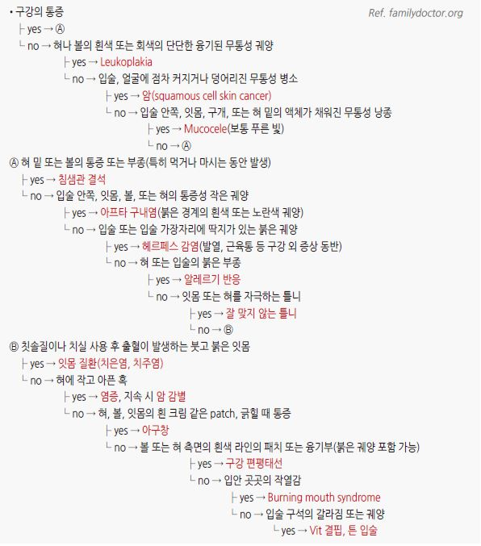

# 구내염 Stomatitis

## <mark style="color:green;">일반 사항</mark>

* 입술, 잇몸, 혀, 볼, 구강 천정/바닥 등 입안 구조물 점막의 염증
* 보통 붉게 부어오름, 간혹 궤양 또는 출혈 발생
* 국소 손상/자극에 의해 발생; 간혹 전신 질환의 증상으로 발생
* 일차 진료에서 흔히 접하는 아형 : 외상성 궤양, 아프타 궤양(재발성 아프타성 구내염), 헤르페스 잇몸구내염, 치은염; 드물게 베체트병·PFAPA 증후군 등 전신 질환과 관련

## <mark style="color:green;">원인 및 위험 인자</mark>

* 외상, 흡연
* 알레르기 : 음식, 약물, 접촉
* 영양 결핍 : Vit B6(angular stomatitis), Vit B12, folate, Zn, Mg, Vit C, 철분
* 감염 : 바이러스(herpetic stomatitis, herpangina, 수족구병), 세균(성홍열)
* 자가면역 질환 : 크론병, Behçet Dz, SLE, 셀리악병, erythema multiforme
* 혈액 질환 : leukemia, cyclic neutropenia
* 호르몬 변화 : 월경, 임신
* 스트레스, 불안
* 화학 요법, 방사선 치료
* 약물 : methotrexate, NSAID, phenobarbital, alendronate, β-차단제 등

## <mark style="color:green;">임상 양상 및 질환별 특징</mark>

### <mark style="color:orange;">증상/병력에 따른 구강 문제의 감별</mark>

* 구강의 통증성 작은 궤양 + 손/발의 구진성 발진 → 수족구병
* 구강(주로 연구개, 구강인두)의 통증성 작은 궤양, 피부 병변 없음 → 헤르판지나
* 혀의 작은 통증성 돌출 → 유두 염증 (매운 음식, 뜨거운 음식에 의한 자극)
* 알칼리/산/aspirin/뜨거운 음식 점막 접촉 병력 + 통증 → 화학적/열성 화상



### <mark style="color:$danger;">🚩 Red Flags!</mark>

<mark style="color:$danger;">**즉각 조치 또는 의뢰**</mark>

* 호흡 곤란/연하 곤란 동반 → 기도 확보 우선; 심한 점막 부종, Stevens-Johnson 증후군 의심 시 응급 의뢰
* 광범위 수포성 점막 병변 + 발열 + 결막/피부 침범 → Stevens-Johnson / TEN 의심
* 심한 탈수(특히 소아·고령자의 헤르페스 잇몸구내염으로 경구 섭취 불가)

<mark style="color:$warning;">**당일 또는 조기 의뢰**</mark>

* 치유되지 않는 단일 궤양 ＞2주 → 구강암 감별 위한 구강외과/이비인후과 의뢰
* 구강 궤양 + 생식기 궤양/포도막염/피부 병변 → 베체트병 감별 위한 류마티스내과 의뢰
* 면역 저하자(HIV, 항암치료 중, 고용량 스테로이드 복용)에서 발생한 광범위 또는 심한 구내염
* 5세 이하 소아의 주기성 발열 + 아프타 궤양 + 인두염 + 경부 림프절병증 → PFAPA 의심 시 소아과 의뢰

<mark style="color:$info;">**외래 추적 / 추가 평가 계획**</mark> <mark style="color:$info;">- 즉각 위험 낮으나 호전 없으면 의뢰</mark>

* 빈번한 재발(≥3회/년)의 아프타 궤양 → 영양 결핍(철분·B12·엽산), 위장관 질환(크론병, 셀리악병) 감별 검사
* 치은염이 수 주\~수개월 지속 → 치과 의뢰(치주염 이행 예방)
* 국소 치료 4\~6주 이후에도 호전 없는 재발성 아프타 궤양 → 전신 치료 고려 또는 전문의 의뢰

## <mark style="color:green;">외상성 구강 궤양 (Traumatic Oral Ulcer)</mark>

* 원인 : 치아에 의한 볼 점막이나 혀의 손상, 뜨거운 음식에 의한 구강 화상, 잘못 맞는 틀니/교정기
* 경과 : 대부분 자연 치유; 궤양이 발생하지 않으면 2\~3일 내 통증 소실
* 치료 : 원인 제거 + 아프타 구내염에 준한 대증 치료

## <mark style="color:green;">아프타 궤양 (Aphthous Ulcer)</mark>

### <mark style="color:orange;">일반 사항</mark>

* 볼 및 입술 안쪽 점막, 혀의 심한 통증을 동반하는 회색빛 기저의 단일 또는 다발성 둥근 궤양
* 동의어 : aphthous stomatitis, canker sore, 재발성 아프타성 구내염(RAS)
* 경과 : 작은 궤양(2\~10 ㎜) — 7\~10일, 큰 궤양(＞10 ㎜) — 10\~30일 내 자연 치유
* 신체 다른 부위 궤양 병소 여부를 확인하는 것이 필요 (Behçet Dz 등 감별)

### <mark style="color:orange;">원인 및 위험 인자</mark>

#### <mark style="color:$primary;">병인 기전</mark>

* 정확한 원인은 불명; 여러 요소가 복합적으로 관여
* 스트레스 관련 salivary cortisol 증가, multiple HLA Ag 연관, cell-mediated immunity 이상

#### <mark style="color:$primary;">위험 인자</mark>

* 유전
* 국소 외상 : 치아, 틀니, 칫솔
* 특정 음식(음식 과민)
* 스트레스, 불안, 늦은 수면(밤 11시 이후)
* 내분비 변화 : 월경
* 영양 결핍 : 철분, 아연, Vit B(엽산 등)
* 약물 : NSAID, β-차단제, alendronate, methotrexate
* 동반 질환 : homocysteinemia, neutropenia, 빈혈, 면역 반응 이상, 알레르기, IBD, Behçet 병

### <mark style="color:orange;">임상 양상</mark>

* 짧은(2\~48시간) 전구기(작열감/가려움) 후 통증성 궤양 발생 (보통 ＜10 ㎜)
* 홍반 → 구진 → 뚜렷한 붉은 경계를 가진 둥근 타원형 궤양; 궤양 표면은 균질한 미색 위막
* 매운/뜨거운/신 음식, 탄수화물 음식/음료 등 자극적 음식 섭취 시 심한 증상
* 호발 부위 : 볼, 입술, 혀 아랫면, 연구개 점막\
  ✽잇몸, 경구개, 혓바닥에는 발생하지 않음 (→ 잇몸·경구개 병변은 헤르페스 감별)
* 2차 감염 시 발열, 궤양 주변부 부종 증가, 농성 분비물, 경부 림프절병증

### <mark style="color:orange;">진단</mark>

* 임상 진단; 검사는 보통 필요 없음
* 재발 빈발 또는 비전형 경과 시 혈액 검사 : CBC, ferritin, 엽산, Vit B12
* 조직/배양 검사 : 치유되지 않는 궤양(＞2주), 비전형 진행 시 고려

### <mark style="color:orange;">PFAPA 증후군</mark>

* Periodic Fever, Aphthous stomatitis, Pharyngitis, Adenitis의 복합 증상이 발생하는 증후군
* 증상 : 규칙적인 발열, 인후통, 구강 궤양, 경부 림프절 부종
* 보통 ＜5세에 발생, 청소년까지 일정 간격으로 재발; 5일 정도 지속
* 원인 : 불명; 면역 관련 추정
* 치료
  * 자연 치유
  * 약물 : steroid(해열 목적), cimetidine(예방 목적)
  * 난치성의 경우 편도절제술 고려

## <mark style="color:green;">헤르페스 잇몸구내염 (Herpes Gingivostomatitis)</mark>

### <mark style="color:orange;">원인</mark>

* HSV-1(대부분), HSV-2(일부) (☞ [헤르페스 바이러스 감염](%ED%97%A4%EB%A5%B4%ED%8E%98%EC%8A%A4-%EA%B0%90%EC%97%BC.md))

### <mark style="color:orange;">초감염</mark>

* 보통 어린 아이에서 발생
* 잠복기 : 2\~12일
* 경과 : 10\~14일(1\~3주) 후 자연 치유; 림프절병증은 수 주 동안 지속될 수 있음
* 사춘기에 발생하는 경우 잇몸 구내염보다 인두염, 편도염 증상이 두드러질 수 있음\
  ✽사슬알균 감염과 증상이 비슷하지만 보다 오래 지속
* 무증상 또는 비특이적 바이러스 감염과 구별하기 어려울 수 있음
* 초감염 부위를 지배하는 sensory neuron 내 잠복

### <mark style="color:orange;">임상 양상</mark>

#### <mark style="color:$primary;">구강 증상</mark>

* 통증, 가려움, 작열감
* 다발성 통증성 수포 → 빠르게 파열 → 궤양
* 호발 부위 : 잇몸, 입술의 피부-점막 접합부, 혀, 볼 점막, 연구개
* 궤양 : 황회색 막으로 덮인 얕은 궤양(1\~3 ㎜), 수포 발생 수일 내 발생

#### <mark style="color:$primary;">구강 외 증상</mark>

* 발열(2\~7일 지속), 두통, 근육통, 경부 림프절병증

### <mark style="color:orange;">재발성 아프타성 구내염 vs 헤르페스성 구내염 감별</mark>

<table><thead><tr><th width="160">감별점</th><th width="260">재발성 아프타성 구내염</th><th>헤르페스성 구내염</th></tr></thead><tbody><tr><td>호발 연령</td><td>청소년\~성인</td><td>소아(초감염), 성인(재발)</td></tr><tr><td>초기 병변</td><td>궤양 (수포 단계 없음)</td><td>다발성 수포 → 파열 후 궤양</td></tr><tr><td>호발 부위</td><td>볼, 입술 안쪽, 혀 아랫면, 연구개 (비각화 점막)</td><td>잇몸, 경구개, 입술 피부-점막 접합부 (각화 점막 포함)</td></tr><tr><td>전신 증상</td><td>드물다</td><td>초감염 시 발열·림프절병증 흔함</td></tr><tr><td>전염성</td><td>없음</td><td>있음 (수포기)</td></tr><tr><td>치료</td><td>국소 스테로이드, 대증 치료</td><td>증상 24\~48시간 내 항바이러스제; 스테로이드 금기</td></tr></tbody></table>

## <mark style="color:green;">베체트병 (Behçet Dz)</mark>

* 구강 아프타 궤양, 생식기 궤양, 포도막염, 피부 병변을 특징으로 하는 만성·재발성·염증성 질환
* 간헐적 대칭적 oligoarthritis 발생(40\~70%)
* 호발 연령 : 20\~40세
* 원인 : 불명

### <mark style="color:orange;">증상 및 진단</mark>

구강 내 궤양이 1년 동안 ≥3번 재발하며 다음 4가지 중 ≥2개 해당 시 진단 :

⓵ 반복적인 생식기 궤양

⓶ 눈의 병소 : uveitis, retinal vasculitis

⓷ 사춘기 이후 steroid로 치료되지 않는 피부 병변 : erythema nodosum, pseudofolliculitis, papulopustular lesion, acneiform nodule

⓸ pathergy test 양성 : forearm과 back에 식염수 0.1 ㎖를 주입하거나 소독된 바늘로 찌르고 24\~48시간 후에 지름 ＞2 ㎜의 구진 또는 농포 형성

✽확진을 위한 실험실 검사 방법은 없음; 의심 시 류마티스내과 의뢰

## <mark style="color:green;">치은염 (Gingivitis)</mark>

### <mark style="color:orange;">원인</mark>

* 부적절한 plaque 제거
* 호르몬 변화 : 임신, 월경, 폐경
* 알레르기, 영양 결핍, 만성 소모성 질환
* 약물 : 경구 피임제, 니코틴(혈관 수축), CCB
* 영양 결핍 : Vit C, Vit B12, coenzyme Q10

### <mark style="color:orange;">위험 인자</mark>

* 불결한 구강 위생(예: 부적절한 칫솔질), 흡연
* 부정 교합, 치열 이상, 틀니/교정기 착용, 생치
* 입원, 호흡기 질환(예: 천식), RA, 면역 저하(예: 조절되지 않는 당뇨병, HIV 감염)
* 구강 호흡, 입마름
* 스트레스

### <mark style="color:orange;">임상 양상</mark>

* 잇몸 부종, 통증, 압통, 발적
* 칫솔질 또는 식사 시 잇몸 출혈
* 구취
* 지속되면(수 주\~수년) 보다 심각한 상태인 치주염(periodontitis)으로 이행

***

## <mark style="background-color:$warning;">Management</mark>

### <mark style="color:orange;">치료 방침</mark>

* 대부분 특별한 치료 없이 대증 치료로 자연 치유
* 대증 치료 : 국소 마취제, 국소/전신 진통제, 해열제
* 좋은 영양 섭취, 좋은 구강 위생, 외상 주의
* 아형별 치료 전략 상이 — 특히 헤르페스성은 스테로이드 금기(바이러스 전파 촉진)

## <mark style="color:green;">비-약물 치료</mark>

* 금연
* 유동식, 차가운 음식/음료 섭취(예: 아이스크림), 얼음 물고 있기
* 피할 음식 : 자극적 음식(매운맛·신맛·뜨거운 것), 단단한/거친 음식(스낵, 견과류)
* 치과 문제 치료 - 날카로운 치아 모서리, 맞지 않는 틀니 교정
* 구강 위생 개선 : 올바른 칫솔질, 치실 사용\
  ✽치실의 효과에 대하여 논란이 있음
* 가글 또는 린스 (일부 연구에서 치유 촉진, 재발 예방)
  * tetracycline, aloe, chlorhexidine <mark style="color:blue;">\[헥사메딘 액]</mark> : 1일 4회 (보험 2회 인정)
  * 따뜻한 생리 식염수 린스 : 1일 2회
  * 알코올 함유 구강 린스 제품의 장기 사용은 구강암 발생 위험 증가 가능 — 장기 사용 지양
* 혀 백태 관리 (암 환자·완화 의료)
  * 부드러운 칫솔이나 적신 거즈로 자주 닦기
  * 베이킹소다 가글 : 온수 1컵 + 소금 ½ tsp + 베이킹소다 ½ tsp, 1일 4회 (식후 및 취침 시)
  * 파인애플 씹기 (단백 분해 효소 bromelain 포함)\
    ✽대한가정의학회 '일차진료의를 위한 호스피스·완화의료 진료 매뉴얼' 인용

### <mark style="color:orange;">영양 요법</mark>

* 일부에서 효과
* 과일·채소, Vit C, coenzyme Q10, bilberry(월귤나무 열매)
* 피할 음식 : 설탕 함유 식품

## <mark style="color:green;">약물 치료</mark>

### <mark style="color:orange;">아프타 궤양</mark>

* 특별한 확립된 치료 약제 없음; 구강 외용제는 대부분 비보험

#### <mark style="color:$primary;">국소 Steroid</mark>

* 효과 : 항염, 통증 완화, 치유 촉진
* 치유될 때까지(보통 \~2주) 식후 및 취침 시 적용
* triamcinolone 0.1% 연고 qid <mark style="color:blue;">\[오라메디]</mark>; 0.025 ㎎ 정제 bid 병소에 붙임 <mark style="color:blue;">\[아프타치]</mark>
* fluocinonide 0.05% gel
* dexamethasone 0.01% 액 5 ㎖ 2\~3분간 구강 린스 후 뱉음 (식후 및 취침 시)
* 잘 낫지 않는 경우 고역가 고려 : clobetasol propionate 0.05%, halobetasol propionate 0.05%\
  ✽구강 칸디다증 발생 주의

#### <mark style="color:$primary;">국소 마취제</mark>

* 1일 3\~4회 도포, 특히 식사 전 도포 시 통증 완화에 유용
* lidocaine <mark style="color:blue;">\[카미스타드-엔]</mark> (≥12세 허가)
* benzocaine <mark style="color:blue;">\[허리케인 겔]</mark>
* xylocaine

#### <mark style="color:$primary;">국소 면역 조절제</mark>

* 효과 : 증상 완화, 치유 촉진
* amlexanox 5% qid

#### <mark style="color:$primary;">점막 보호제</mark>

* 일부 연구에서 약간의 증상 완화 및 점막 재생 효과
* sucralfate 액 5\~10 ㎖ 1\~2분 린스 qid <mark style="color:blue;">\[아루사루민]</mark>
* rebamipide 100 ㎎ tid <mark style="color:blue;">\[무코스타]</mark>
* 제산제 겔 + diphenhydramine 액(2.5 ㎎/㎖) 1:1 혼합 : 2시간마다 또는 필요시 5 ㎖ 린스
* bismuth subsalicylate rinse

#### <mark style="color:$primary;">경구 Steroid</mark>

* 국소제로 치료되지 않는 심한 증상에 단기 적용
* 경구제 치료 후 국소제로 이행
* prednisolone 30\~60 ㎎/d × 1주 & tapering <mark style="color:blue;">\[소론도]</mark>

#### <mark style="color:$primary;">기타</mark>

* diclofenac 7.4% 액 15 ㎖ bid\~tid <mark style="color:blue;">\[아프니벤큐 액]</mark>
* colchicine 0.2\~0.5 ㎎/d <mark style="color:blue;">\[콜킨]</mark> — 재발 빈도 감소; 부작용 주의
* Vit B12 : 일부 연구에서 예방 효과
* policresulen <mark style="color:blue;">\[알보칠]</mark> : 신경 소작을 통한 일시적 증상 완화\
  ✽병소 및 주변 조직에 화학적 손상을 일으켜 오히려 회복을 지연시킬 수 있음 — 일상적 사용 권장되지 않음
* propolis : 일부 소규모 연구에서 유효
* 구강 내 살균 가글
  * benzydamine hydrochloride 액 15 ㎖ 4시간마다 가글 <mark style="color:blue;">\[탄툼 액]</mark> (자극감 강한 경우 물과 1:1 희석)
  * chlorhexidine 0.2% 액 10 ㎖로 1일 2회 1분간 가글 <mark style="color:blue;">\[헥사메딘 액]</mark>
* cimetidine : 재발하는 환자에서 유지 요법 고려

### <mark style="color:orange;">헤르페스 잇몸구내염</mark>

* 대부분의 성인에서는 증상이 가볍고 짧은 경과로 중재가 필요하지 않음
* 면역저하자에서는 증상이 심하고 빈번하게 재발할 수 있음
* steroid는 바이러스의 전파를 촉진시키므로 금기

#### <mark style="color:$primary;">항바이러스제</mark>

* 증상 시작 24\~48시간 이내 치료를 시작할 때만 효과; 수포가 터진 후에는 효과 없음
* 초감염(특히 소아 중증) : acyclovir 15 ㎎/㎏ (최대 200 ㎎) 5회/일 × 7일
* 성인 재발성 구순 포진 : acyclovir 400 ㎎ tid × 5일, 또는 valacyclovir 2 g bid × 1일(단기 고용량)
* 면역 저하자에서 심한 경우 : 정주용 acyclovir 고려, 전문의 의뢰

### <mark style="color:orange;">베체트병</mark>

* 구강 병소에 대해 아프타 궤양에 준한 국소 치료
  * triamcinolone 0.1% 연고 qid <mark style="color:blue;">\[오라메디]</mark>; 0.025 ㎎ 정제 bid 병소 부착 <mark style="color:blue;">\[아프타치]</mark>
  * sucralfate 5\~10 ㎖ 1\~2분 린스 qid <mark style="color:blue;">\[아루사루민]</mark>
* 전신 치료 (류마티스내과 협진)
  * colchicine 1\~2 ㎎/d <mark style="color:blue;">\[콜킨]</mark>
  * azathioprine, thalidomide, IFN-α or TNF-α inhibitors, apremilast, ustekinumab

### <mark style="color:orange;">치은염</mark>

* 구강 위생 개선이 근본 치료 — 치과 치석 제거
* triamcinolone 0.1% 연고 qid <mark style="color:blue;">\[오라메디]</mark>
* 항생제 : Vincent Dz, ulcerative gingivitis 등 특별한 경우에 고려

### <mark style="color:orange;">외상성 구강 궤양</mark>

* 원인 제거 (날카로운 치아·틀니 교정)
* 궤양 발생 시 아프타 구내염과 같은 치료

***

### <mark style="color:red;">질병코드</mark>

B00.2 헤르페스바이러스 치은구내염 및 인두편도염

B08.4 발진을 동반한 엔테로바이러스소수포구내염

K05 치은염 및 치주질환

K12 구내염 및 관련 병변

M35.2 베체트병

***

## <mark style="color:purple;">처방례</mark>

> **처방례 1. 아프타 궤양 — 경증**
>
> ```
> 오라메디 연고 5 g/tube     소량 병소 도포 qid × 1주
> 카미스타드-엔 겔 10 g/tube  통증 시 식사 20분 전 도포
> ```
>
> _✽triamcinolone 국소 연고가 1차 선택. 식후 및 취침 시 적용. 2주 이상 사용 시 구강 칸디다증 주의. 식사 전 국소 마취제로 섭취 통증 완화_

> **처방례 2. 아프타 궤양 — 중등도/다발성**
>
> ```
> 아프타치 0.025 mg/T     1T 병소 부착 bid
> 탄툼 액 120 mL/병         15 mL 4시간마다 가글
> 아루사루민 현탁액 20 mL/포  5~10 mL 1~2분 린스 qid
> ```
>
> _✽다발성·심한 통증일 때 부착형 triamcinolone + 항염·살균 가글 + 점막 보호제 병용. 가글제는 자극감 있으면 물과 1:1 희석_

> **처방례 3. 아프타 궤양 — 국소제 실패/심한 중증**
>
> ```
> 소론도 5 mg/T           30~60 mg/d × 5~7일 후 tapering
> 오라메디 연고 5 g/tube    소량 병소 도포 qid
> ```
>
> _✽국소 치료 2주 이후에도 호전 없는 광범위 또는 심한 궤양에 한해 단기 경구 스테로이드. tapering 완료 후에도 국소 치료 유지. 반복 재발 시 혈액 검사(CBC·ferritin·엽산·B12)로 영양 결핍 감별_

> **처방례 4. 재발성 아프타 궤양 — 유지 요법**
>
> ```
> 콜킨 0.6 mg/T   1T qd~bid  (장기)
> ```
>
> _✽연 3회 이상 재발하는 환자에서 colchicine 0.2\~0.5 ㎎/d 또는 0.6 ㎎ qd\~bid로 유지. 설사·근병증 부작용 모니터링. cimetidine도 유지 요법으로 고려 가능_

> **처방례 5. 헤르페스 잇몸구내염 — 성인 초감염/재발**
>
> ```
> 조비락스 400 mg/T    1T tid × 5일    (증상 시작 48시간 이내)
> 카미스타드-엔 겔      통증 시 식사 전 도포
> 타이레놀 500 mg/T    1T q6h prn       발열·통증
> ```
>
> _✽증상 발현 48시간 이내 투여 시에만 효과. 면역 저하자·중증은 valacyclovir 고려 또는 전문의 의뢰. **스테로이드 금기** (바이러스 전파 촉진)_

> **처방례 6. 치은염**
>
> ```
> 헥사메딘 가글액 100 mL/병   10 mL 1일 2회 1분간 가글 (보험)
> 오라메디 연고               소량 잇몸 도포 qid
> ```
>
> _✽구강 위생 개선과 치과 치석 제거가 근본 치료. chlorhexidine 가글은 보험 2회/일 인정 (100 ㎖ 한도). 항생제는 Vincent Dz 등 특수 상황에서만_

***

### <mark style="color:$success;">핵심 복약 지도</mark>

> **국소 스테로이드 연고 (오라메디 등) 바르는 법**
>
> * 식사 후 입안을 깨끗이 헹구고 거즈나 면봉으로 병소 부위를 가볍게 닦아 물기를 제거한 뒤 **소량**을 병소에 직접 도포하십시오.
> * 1일 4회(식후 3회 및 취침 전 1회) 적용이 원칙입니다. 도포 후 30분간 음식·음료 섭취를 피하면 약물이 더 오래 병소에 머뭅니다.
> * **보통 2주를 넘기지 마십시오.** 장기 사용 시 입안 곰팡이(칸디다증)가 생길 수 있습니다. 혀나 볼 점막에 하얀 막이 생기면 사용을 중단하고 내원하십시오.

> **부착형 정제 (아프타치) 사용법**
>
> * 병소에 잘 붙도록 **손을 깨끗이 씻은 뒤** 정제의 한쪽 면(접착 면)을 궤양에 가볍게 누르고 30초 정도 고정하십시오. 타액으로 서서히 녹으며 수 시간 지속됩니다.
> * 정제가 붙어 있는 동안 과도한 혀 움직임이나 뜨거운 음료 섭취는 피하십시오.

> **국소 마취 겔 (카미스타드-엔, 허리케인 겔) 사용법**
>
> * 식사 20\~30분 전 병소에 **소량** 도포하면 식사 시 통증이 완화됩니다.
> * 혀가 마비되는 느낌이 들 수 있으므로 **삼킴에 주의**하십시오. 도포 후 깨물기 사고가 생길 수 있으니 식사 중 주의가 필요합니다.
> * 12세 미만 소아에는 lidocaine 제제 사용을 피하십시오(허가 사항).

> **가글제 (헥사메딘·탄툼 액) 사용법**
>
> * 각 제품 권장 용량을 **삼키지 말고** 입안에서 1\~2분 머금은 후 뱉으십시오.
> * 가글 전후 30분은 양치나 음식·음료를 피하십시오. 효과가 감소합니다.
> * 헥사메딘(chlorhexidine) 장기 사용 시 일시적 치아·혀 착색이 생길 수 있습니다. 사용 중단 후 대부분 회복됩니다.
> * 탄툼 액이 너무 자극적이면 같은 양의 물과 1:1로 희석하여 사용하십시오.

> **경구 스테로이드·콜킨 복용 시 주의**
>
> * **임의로 중단하지 마십시오.** prednisolone은 의사가 정한 일정에 따라 서서히 줄여야 합니다.
> * 콜킨 복용 중 심한 설사, 근육통·근력 저하, 손발 저림이 생기면 즉시 내원하십시오.

> **항바이러스제 (조비락스 등) 복용 시**
>
> * **증상이 시작된 후 48시간 이내**에 복용을 시작해야 효과가 있습니다. 수포가 이미 터진 이후에는 효과가 제한적입니다.
> * 충분한 물과 함께 복용하십시오. 신장 기능이 저하된 경우 의료진에게 알리십시오.

> **언제 다시 병원을 방문해야 하나요?**
>
> * 2주 이상 낫지 않는 단일 궤양 — **즉시 내원** (구강암 감별 필요)
> * 입안 궤양이 심해 **물도 삼키기 어려운** 경우 — 탈수 예방 필요
> * 구강 궤양과 함께 **생식기 궤양, 눈의 충혈·시력 저하, 피부 발진**이 동반되는 경우 — 베체트병 감별
> * **고열 + 광범위 수포 + 피부·눈 병변** 동반 — 즉시 응급실
> * 구강 궤양이 1년에 3회 이상 반복되는 경우 — 원인 감별 필요

***

### <mark style="color:blue;">환자 안내서</mark>


**구내염, 대부분 저절로 낫지만 관리는 필요합니다**

입안 염증(구내염)은 대부분 1\~2주 안에 저절로 낫습니다. 그동안 통증을 줄이고 재발을 예방하는 관리가 중요합니다. 다만 2주가 지나도 낫지 않거나, 자주 재발하거나, 다른 부위(눈·생식기·피부)에도 병변이 생기면 반드시 진료를 받으셔야 합니다.


#### <mark style="color:$primary;">왜 구내염이 생기나요?</mark>

* **외상**: 무심코 볼을 씹거나, 딱딱한 음식에 긁히거나, 맞지 않는 틀니가 점막을 자극하면 궤양이 생깁니다.
* **아프타 궤양 (가장 흔함)**: 스트레스, 수면 부족, 월경, 영양 결핍(철분·비타민 B12·엽산) 등 여러 요인이 겹쳐 면역 반응이 과해지면서 생기는 것으로 알려져 있습니다.
* **바이러스 감염 (헤르페스)**: 주로 소아에서 처음 감염되며, 수포가 먼저 생기고 터진 뒤 궤양이 됩니다. 성인에서는 피로·스트레스·감기 등으로 재발할 수 있습니다.
* **전신 질환의 일부**: 베체트병(눈·생식기 궤양 동반), 크론병, 셀리악병 등에서 구내염이 반복될 수 있습니다.

#### <mark style="color:$primary;">일상에서 어떻게 관리하나요?</mark>

* **자극적인 음식을 피하십시오.** 매운 것, 신 것, 뜨거운 것, 단단하고 거친 것(스낵·견과류)은 통증을 악화시킵니다. 미지근하거나 차가운 유동식이 좋습니다.
* **구강 위생을 유지하십시오.** 부드러운 칫솔로 조심스럽게 양치하고, 식후에 따뜻한 소금물(물 1컵 + 소금 ½ 작은술)로 가볍게 헹구면 도움이 됩니다.
* **충분히 자고 스트레스를 관리하십시오.** 특히 밤 11시 이후 늦게 자는 습관은 재발과 관련이 있다고 알려져 있습니다.
* **금연하십시오.** 담배 연기는 점막 회복을 늦춥니다.
* **영양을 골고루 섭취하십시오.** 철분, 아연, 비타민 B군, 엽산이 부족하면 재발이 잦아집니다.

#### <mark style="color:$primary;">바르는 약·가글은 어떻게 쓰나요?</mark>

* **바르는 연고**는 식사 후 입안을 헹구고 물기를 제거한 뒤 병소에 **소량만** 발라 주십시오. 1일 4회(식후 및 취침 전) 쓰시되, **2주를 넘기지 마십시오**.
* **식사 전**에 통증이 심하면 국소 마취 겔을 소량 바르면 식사가 편해집니다. 혀가 마비된 듯한 느낌이 날 수 있으니 깨물지 않도록 주의하십시오.
* **가글**은 삼키지 말고 입안에 1\~2분 머금은 후 뱉으십시오. 가글 후 30분은 양치나 음식·음료를 피하면 효과가 오래갑니다.

#### <mark style="color:$primary;">헤르페스 구내염은 전염되나요?</mark>

* 수포 단계에서는 **타액이나 직접 접촉을 통해 전염**될 수 있습니다. 물컵·수저·수건을 공유하지 마시고, 키스나 구강 접촉은 병변이 완전히 아물 때까지 피하십시오.
* 어린이에게 처음 감염되면 고열과 심한 통증으로 먹지 못할 수 있습니다. 탈수 예방을 위해 차가운 유동식을 자주 조금씩 주시고, 증상이 심하면 조기 진료를 받으시길 권합니다.
* 한 번 감염되면 바이러스가 신경에 잠복해 있다가 피로·스트레스·햇빛 등으로 재발할 수 있습니다. 완치는 어렵지만 재발 관리는 가능합니다.

#### <mark style="color:$primary;">이럴 때는 꼭 병원을 방문하세요</mark>

* 한 군데의 궤양이 **2주가 지나도 낫지 않는** 경우 — 구강암 감별이 필요합니다
* 궤양이 너무 심해 **물을 삼키기도 어려운** 경우 — 탈수 예방이 필요합니다
* **눈의 충혈, 시력 저하, 생식기 궤양, 피부 발진** 등이 함께 나타나는 경우 — 베체트병 감별이 필요합니다
* **고열과 함께 광범위한 수포**, 눈·피부에도 병변이 생기는 경우 — 즉시 응급실
* 1년에 **3회 이상 반복적으로 재발**하는 경우 — 영양 결핍 등 원인 감별이 필요합니다
* **면역력이 떨어진 상태**(항암 치료 중, 고용량 스테로이드 복용 중, HIV 등)에서 구내염이 생긴 경우

***

#### <mark style="color:$primary;">\[보험기준] 가글 용제 (품명: 헥사메딘가글액 등) (2018-12-01)</mark>

* 허가 적응증 : 보철(의치)에 의한 염증, 아구창 등의 구강 내 칸디다 감염증, 치은염, 인두염, 아프타성구내염에 의한 염증의 완화, 치근막 수술 후 살균 소독
  * 인정 용량 : 100 ㎖
  * 인정 용량을 초과한 경우 : 초과한 용량의 약값 전액을 환자가 부담토록 함
