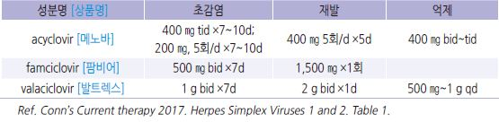
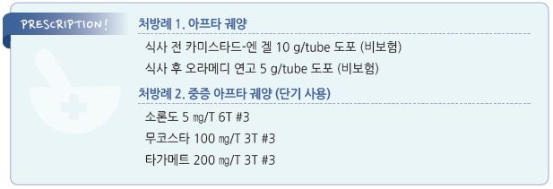

# 구내염 Stomatitis


## 일반 사항

* 입술, 잇몸, 혀, 볼, 구강 천정/바닥 등 입안 구조물 점막의 염증
* 보통 붉게 부어오름, 간혹 궤양 또는 출혈 발생
* 국소 손상/자극에 의해 발생; 간혹 전신 질환의 증상으로 발생

## 원인 및 위험 인자

* 외상, 흡연
* 알레르기 : 음식, 약물, 접촉
* 영양실조, 영양 결핍 : Vit B6(angular stomatitis), Vit B12, folate, Zn, Mg, Vit C, 철분
* 감염 : 바이러스(herpetic stomatitis, herpangina, 수족구병), 세균(성홍열)
* 자가면역 질환 : 크론병, Behçet Dz, SLE, 셀리악병, erythema multiforme
* 암 : leukemia, cyclic neutropenia
* 호르몬 변화 : 월경, 임신, 월경통
* 스트레스, 불안
* 화학요법, 방사선 치료, 약물(예: methotrexate, NSAID, phenobarbital)

## 질환별 특징

```

```

## 증상/병력에 따른 구강 문제의 감별

* 구강의 통증성 작은 궤양, 손 또는 발의 구진성 발진 → 수족구병
* 구강(주로 연구개, 구강인두)의 통증성 작은 궤양, 피부 병변 없음 → 헤르판지나
* 혀의 작은 통증성 돌출 → 유두 염증 (매운 음식, 뜨거운 음식에 의한 자극)
*   알칼리/산/aspirin/뜨거운 음식 점막 접촉 병력, 통증 → 화상

    

## 외상성 구강 궤양 (Traumatic Oral Ulcer)

### 일반 사항

* 원인 : 치아에 의한 볼 점막이나 혀의 손상, 뜨거운 음식에 의한 구강 화상
* 경과 : 대부분 자연 치유; 궤양이 발생하지 않으면 2\~3일 내 통증 소실

## 아프타 궤양 (Aphthous Ulcer)

### 일반 사항

* 볼 및 입술 안쪽 점막, 혀의 심한 통증을 동반하는 회색빛 기저의 단일 또는 다발성 둥근 궤양
* 동의어 : aphthous stomatitis, canker sore
* 경과 : 작은 궤양(2~~10 ㎜)- 7~~10일, 큰 궤양(＞10 ㎜)- 10\~30일 내 자연 치유
* 신체 다른 부위 궤양 병소 여부를 확인하는 것이 필요(Behçet Dz 등 감별)

### 원인 및 기전

* 정확한 원인은 모름; 여러 요소가 복합적으로 관여
* 스트레스 관련 salivary cortisol 증가, multiple HLA Ag, cell-mediated immunity

### 위험 인자

* 유전
* 국소 외상 : 치아, 틀니, 칫솔
* 특정 음식(음식 과민)
* 스트레스, 불안, 늦은 수면(밤 11시 이후)
* 내분비 변화 : 월경
* 영양 결핍 : 철분, 아연, Vit B(엽산 등)
* 약물 : NSAID, β-차단제, alendronate, methotrexate
* homocysteinemia, neutropenia, 빈혈, 면역 반응 이상, 알레르기, IBD, Behçet 병

### 임상 양상

* 짧은(2\~48시간) 전구기(작열감/가려움) 후 통증성 궤양 발생 (보통 ＜10 ㎜)
* 홍반 → 구진 → 뚜렷한 붉은 경계를 가진 둥근 타원형 궤양; 궤양 표면은 균질한 미색 위막
* 매운/뜨거운/신 음식, 탄수화물 음식/음료 등 자극적 음식 섭취 시 심한 증상
* 호발 부위 : 볼, 입술, 혀 아랫면, 연구개 점막 (✽잇몸, 경구개, 혓바닥에는 발생하지 않음)
* 2차 감염 시 발열, 궤양 주변부 부종 증가, 농성 분비물, 경부 림프절병증

### 진단

* 검사는 보통 필요 없음
* 혈액 검사 : CBC, ferritin, 엽산, Vit B12
* 조직/배양 검사 : 치유되지 않는 궤양, 비전형 진행 시 고려

### PFAPA syndrome

* Periodic Fever, Aphthous stomatitis, Pharyngitis, Adenitis의 복합 증상이 발생하는 증후군
* 증상 : 규칙적인 발열, 인후통, 구강 궤양, 경부 림프절 부종
* 보통 ＜5세에 발생, 청소년까지 일정 간격으로 재발; 5일 정도 지속
* 원인 : 불명; 면역 관련 추정
*   치료 : 자연 치유

    •약물 : steroid(해열 목적), cimetidine(예방 목적)

    •편도절제술

## 헤르페스 잇몸구내염 (Herpes Gingivostomatitis)

### 원인

* HSV-1(대부분), HSV-2(일부) (☞ p.958)

### 초감염

* 보통 어린 아이에서 발생
* 잠복기 : 2\~12일
* 경과 : 10~~14일(1~~3주) 후 자연 치유; 림프절병증은 수 주 동안 지속될 수 있음
* 사춘기에 발생하는 경우 잇몸 구내염보다 인두염, 편도염 증상이 두드러질 수 있음

> ✽사슬알균 감염과 증상이 비슷하지만 보다 오래 지속

* 무증상 또는 비특이적 바이러스 감염과 구별하기 어려울 수 있음
* 초감염 부위를 지배하는 sensory neuron 내 잠복

### 임상 양상

#### 구강 증상

* 통증, 가려움, 작열감
* 다발성 통증성 수포 → 빠르게 파열 → 궤양
* 호발 부위 : 잇몸, 입술의 피부-점막 접합부, 혀, 볼 점막, 연구개
* 궤양 : 황회색 막으로 덮인 얕은 궤양(1\~3 ㎜). 수포 발생 수일 내 발생

#### 구강 외 증상

* 발열(2\~7일 지속), 두통, 근육통, 경부 림프절병증

### 재발성 아프타성 및 헤르페스성 구내염의 감별

```

```

## 베체트병 (Behçet Dz)

*   구강 아프타 궤양, 생식기 궤양, 포도막염, 피부 병변을 특징으로하는 만성, 재발성, 염증성 질환;

    간헐적 대칭적 oligoarthritis 발생(40\~70%)
* 호발 연령 : 20\~40세

## 원인

* 불명

### 증상 및 진단

*   구강 내 궤양이 1년 동안 ≥3번 재발하며 다음 4가지 중 ≥2개 해당

    ① 반복적인 생식기 궤양

    ② 눈의 병소(uveitis, retinal vasculitis)

    ③ 사춘기 이후 steroid로 치료되지 않는 피부 병변 : erythema nodosum, pseudofolliculitis, papulopustular lesion,

    acneiform nodule

    ④ pathergy test 양성 : forearm과 back에 식염수 0.1 ㎖를 주입하거나 소독된 바늘로 찌르고 24\~48시간 후에 지름 ＞2 ㎜의

    구진 또는 농포 형성

※ 확진을 위한 실험실 검사 방법은 없음

## 치은염 (Gingivitis)

### 원인

* 부적절한 plaque 제거
* 호르몬 변화 : 임신, 월경, 폐경
* 알레르기, 영양 결핍, 만성 소모성 질환
* 약물 : 경구 피임제, 니코틴(혈관 수축), CCB
* 영양 결핍 : Vit C, Vit B12, coenzyme Q10

### 위험 인자

* 불결한 구강 위생(예: 부적절한 칫솔질), 흡연
* 부정 교합, 치열 이상, 틀니/교정기 착용, 생치
* 입원, 호흡기 질환(예: 천식), RA, 면역 저하(예: 조절되지 않는 당뇨병, HIV 감염)
* 구강 호흡, 입마름
* 스트레스

### 임상 양상

* 잇몸 부종, 통증, 압통, 발적
* 칫솔질 또는 식사 시 잇몸 출혈
* 구취
* 지속되면(수 주\~수년) 보다 심각한 상태인 치주염(periodontitis)으로 이행

***

## Management

### 치료 방침

* 대부분 특별한 치료 방법 없음
* 대증 치료 : 국소 마취제, 국소/전신 진통제, 해열제
* 좋은 영양 섭취, 좋은 구강 위생, 외상 주의

## 생활 요법

* 금연
* 유동식, 차가운 음식/음료 섭취(예: 아이스크림), 얼음 물고 있기
* 피할 음식 : 자극적 음식, 단단한/거친 음식(예: 스낵, 견과류)
* 치과 문제 치료
* 구강 위생 개선: 올바른 칫솔질, 치실 사용 (✽치실의 효과에 대하여 논란이 있음)
*   가글 또는 린스 : 일부 연구에서 치유 촉진, 재발 예방

    •tetracycline, aloe, chlorhexidine \[헥사메딘 액] : 1일 4회(보험 2회 인정) (보험기준 ☞ p.269)

    •따듯한 생리 식염수 린스 : 1일 2회

    •알코올 함유 구강 린스 제품의 장기 사용은 구강암 발생 위험을 증가시킬 수 있음
*   혀에 백태가 끼어 있으면 부드러운 칫솔이나 적신 거즈로 자주 닦고 베이킹소다를 탄 물(온수 1컵에 소금 1/2 teaspoon

    * 베이킹 소다1/2 ts)로 1일 4회(식후 및 취침 시) 가글; 파인애플(✽단백분해효소인 브로멜린이 포함되어 있음)을 씹어

    먹게 하는 것도 효과가 있음 \[대한가정의학회 ‘일차진료의를 위한 호스피스·완화의료 진료 매뉴얼’]

#### 영양 요법

* 일부에서 효과
* 과일/채소, Vit C, coenzyme Q10, bilberry(월귤나무 열매)
* 피할 음식 : 설탕 함유 식품

## 약물 치료

### 아프타 궤양

* 특별한 치료 약제 없음 (구강 외용제는 대부분 비보험)

#### 국소 Steroid

* 효과 : 항염, 통증 완화, 치유 촉진
* 치유될 때까지(보통 \~2주) 식후 및 취침 시 적용
* triamcinolone : 0.1% 연고 qid \[오라메디], 0.025 ㎎ 정제 bid 병소에 붙임 \[아프타치]
* fluocinonide : 0.05% gel
* dexamethasone : 0.01% 액 5 ㎖ 2\~3분간 구강 린스 후 뱉음, 식후 및 취침 시 시행
* 잘 낫지 않는 경우 고역가 고려 : clobetasol propionate 0.05%, halobetasol propionate 0.05%; 구강 칸디다증 발생 주의

#### 국소 마취제

* 1일 3\~4회 도포, 특히 식사 전 도포 시 통증 완화에 유용
* lidocaine \[카미스타드-엔]\(≥12세 허가), benzocaine \[허리케인 겔], xylocaine

#### 국소 면역 조절제

* 효과 : 증상 완화, 치유 촉진
* amlexanox 5% qid

#### 점막 치료제

* 효과 : 일부 연구에서 약간의 증상 완화 및 점막 재생 효과
* sucralfate 액 : 5~~10 ㎖ 1~~2분 린스 qid \[아루사루민]
* rebamipide : 100 ㎎ tid \[무코스타]
* 제산제 겔 + diphenhydramine 액(2.5 ㎎/㎖) 1:1 혼합 : 2시간마다 또는 필요시 5 ㎖ 린스
* bismuth subsalicylate rinse

#### 경구 Steroid

* 국소제로 치료되지 않는 심한 증상에 단기 적용
* 경구제 치료 후 국소제 적용
* prednisolone : 30\~60 ㎎/d ×1주 & tapering \[소론도]

#### 기타

* diclofenac \[아프니벤큐 액]\(7.4% 액 15 ㎖ bid\~tid)
* colchicine : 재발 빈도를 줄임. 부작용 주의; 0.2\~0.5 ㎎/d \[콜킨]
* Vit B12 : 일부 연구에서 예방 효과
*   policresulen : 신경 소작을 통한 일시적 증상 완화; 병소 및 주변 조직에 손상을 일으키므로 회복을 지연시킬 수 있음

    \[알보칠]
* propolis : 일부 소규모 연구에서 유효
*   구강 내 살균 : benzydamine hydrochloride 액 15 ㎖ 4시간마다 가글(자극감이 강한 경우 물과 1:1 희석 사용) \[탄툼 액]

    또는 chlorhexidine 0.2% 액 10 ㎖로 1일 2회 1분간 가글 \[헥사메딘 액]
* cimetidine : 재발하는 환자에서 유지 요법

### 헤르페스 잇몸구내염

* 대부분의 성인에서는 증상이 가볍고 짧은 경과로 중재가 필요하지 않음
* 면역저하자에서는 증상이 심하고 빈번하게 재발할 수 있음
* steroid는 바이러스의 전파를 촉진시키므로 금기

#### 항바이러스제

*   증상 시작 24\~48시간 이내 치료를 시작할 때만 효과가 있으며, 수포가 터진 후에는 효과 없음

    

### Behçet 병

* triamcinolone : 0.1% 연고 qid \[오라메디], 0.025 ㎎ 정제 bid \[아프타치]\(병소에 붙임)
* sucralfate : 5~~10 ㎖ 1~~2분 린스 qid \[아루사루민]
* colchicine : 1\~2 ㎎/d \[콜킨]
* azathioprine, thalidomide, IFN-α or TNF-α inhibitors, apremilast, ustekinumab

### 치은염

* triamcinolone : 0.1% 연고 qid \[오라메디]
* 항생제 : Vincent Dz, ulcerative gingivitis 등 특별한 경우에 고려

### 외상성 구강 궤양

* 궤양 발생 시 아프타 구내염과 같은 치료

> **질병코드** B00.2 헤르페스바이러스 치은구내염 및 인두편도염

B08.4 발진을 동반한 엔테로바이러스소수포구내염

K05 치은염 및 치주질환

K12 구내염 및 관련 병변

M35.2 베체트병



#### \[보험기준] 가글 용제 (품명: 헥사메딘가글액 등) (2018-12-01)

*   허가 적응증 : 보철(의치)에 의한 염증, 아구창 등의 구강 내 칸디다 감염증, 치은염, 인두염, 아프타성구내염에 의한

    염증의 완화, 치근막 수술 후 살균 소독

    ① 인정 용량: 100 ㎖

    ② 인정 용량을 초과한 경우: 초과한 용량의 약값 전액을 환자가 부담토록 함
