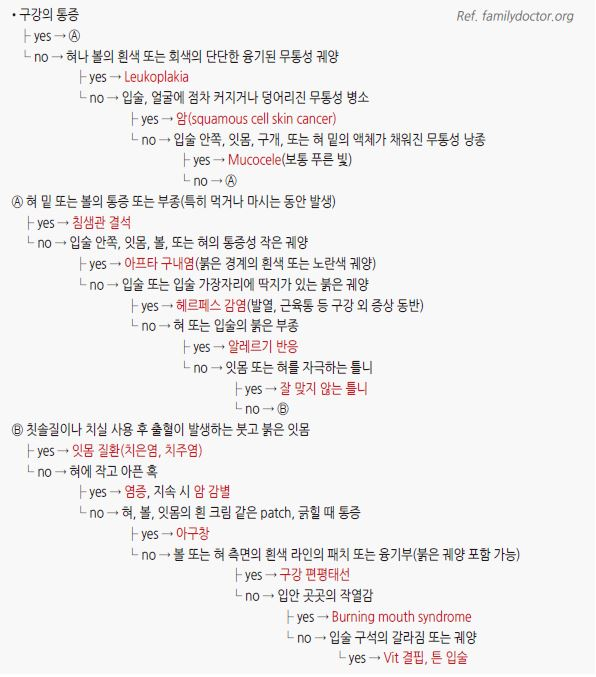
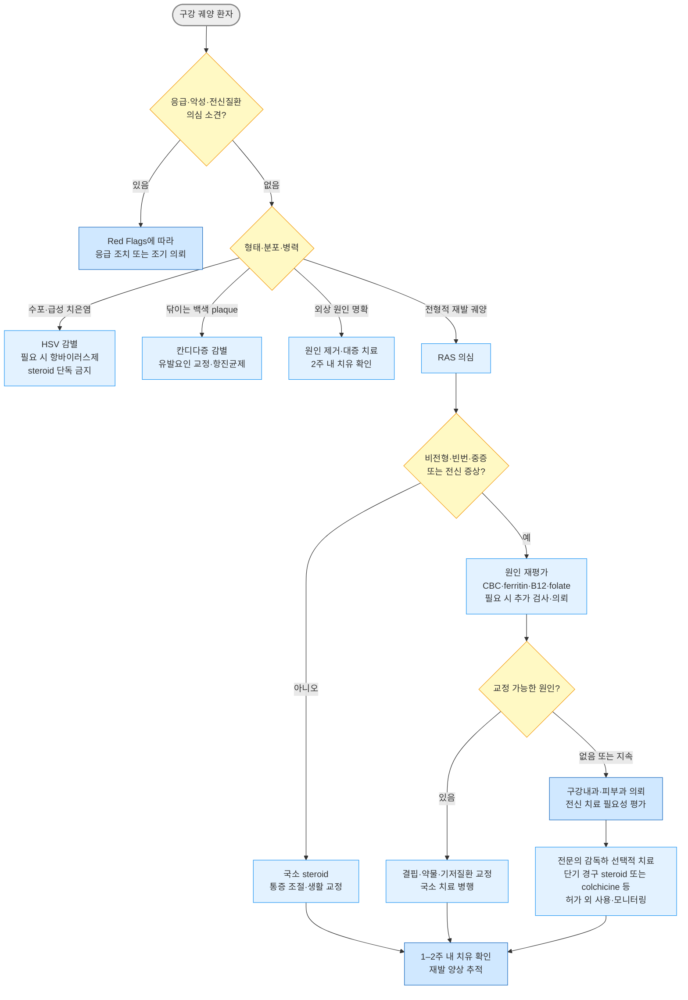

# 구내염 Stomatitis

## <mark style="color:green;">일반 사항</mark>

* 입술, 잇몸, 혀, 볼, 구강 천정/바닥 등 입안 구조물 점막의 염증
* 보통 붉게 부어오름, 간혹 궤양 또는 출혈 발생
* 국소 손상/자극에 의해 발생; 간혹 전신 질환의 증상으로 발생
* 일차 진료에서 흔히 접하는 아형 : 외상성 궤양, 아프타 궤양(재발성 아프타성 구내염), 헤르페스 잇몸구내염, 치은염; 드물게 베체트병·PFAPA 증후군 등 전신 질환과 관련

## <mark style="color:green;">원인 및 위험 인자</mark>

* 외상, 구강 건조, 불량한 구강 위생, 흡연·음주(구강암 및 여러 구강 병변의 위험인자; 재발성 아프타 궤양과의 직접적 연관성은 일관되지 않음)
* 알레르기 : 음식, 약물, 접촉
* 영양 결핍 : 철분, Vit B12, folate, Zn; Vit B2(riboflavin) 결핍은 주로 구각염과 관련
* 감염 : 바이러스(herpetic stomatitis, herpangina, 수족구병), 세균(성홍열)
* 전신·면역매개 질환 : 크론병, 베체트병, SLE, 셀리악병, 구강 편평태선, 천포창/점막 유천포창, erythema multiforme
* 혈액 질환 : leukemia, cyclic neutropenia
* 호르몬 변화 : 월경, 임신
* 스트레스, 불안
* 화학 요법, 방사선 치료
* 약물
  * 잘 알려진 원인 : methotrexate, 항암화학요법제, nicorandil, 경구 bisphosphonate의 부적절한 복용·점막 접촉, immune checkpoint inhibitor, mTOR 억제제(everolimus 등 - 아프타성 궤양과 유사한 mIAS 유발)
  * 관련 보고(case report/관찰 수준) : NSAID, β-차단제, phenobarbital

### <mark style="color:$danger;">🚩 Red Flags!</mark>

<mark style="color:$danger;">**Tier 1 - 즉각 응급 조치 및 이송, 필요시 119 호출**</mark>

* 호흡 곤란/연하 곤란 동반 → 기도 확보 우선; 심한 점막 부종, Stevens-Johnson 증후군 의심 시 응급 의뢰
* 광범위 수포성 점막 병변 + 발열 + 결막/피부 침범 → Stevens-Johnson / TEN 의심\
  ✽Erythema multiforme : 입술의 출혈성 가피(hemorrhagic crust) + 동심원성 target lesion이 특징; 재발성이며 HSV 감염 후 발생 가능
* 심한 탈수(특히 소아·고령자의 헤르페스 잇몸구내염으로 경구 섭취 불가)
* methotrexate 복용 중 새로 발생한 광범위·중증 구내염, 발열, 출혈 또는 멍 → 과량/매일 복용 오류·골수억제 가능; 다음 투여를 보류하고 CBC·혈소판·신기능·간기능을 긴급 확인

<mark style="color:$warning;">**Tier 2 - 당일~수일 내 평가**</mark>

* 기간과 관계없이 induration, rolled/everted edge, 쉽게 출혈하는 적색·백색반, 경부 림프절병증, 감각 저하, 진행성 연하곤란 또는 체중 감소 동반 → 구강암 배제를 위해 구강악안면외과/구강내과 또는 이비인후과 신속 의뢰
* 원인 불명의 단일 궤양이 2주 이상 지속 → 조기 전문 평가; 3주 이상 지속되면 구강암 신속 의뢰 및 생검 고려\
  ✽위험인자 없이 전형적인 소아프타가 뚜렷하게 호전 중이면 단기 추적할 수 있으나 완전 치유를 확인
* 구강 궤양 + 생식기 궤양/피부 병변 → 베체트병 감별을 위한 류마티스내과 의뢰
* 구강 궤양 + 통증·눈부심·시력 저하를 동반한 눈 충혈 → 포도막염 가능; 당일 안과 평가
* 면역 저하자(HIV, 항암치료 중, 고용량 스테로이드 복용)에서 발생한 광범위 또는 심한 구내염
* 소아의 주기성 발열 + 아프타 궤양 + 인두염 + 경부 림프절병증(대개 5세 이전 시작하나 이후 발병도 가능) → PFAPA 의심 시 소아과 의뢰
* 반복되는 수포·미란, 박리성 치은염 또는 눈·피부 병변 → 구강 편평태선, 천포창, 점막 유천포창, RIME 등 감별을 위해 조기 의뢰

<mark style="color:$info;">**Tier 3 - 외래 추적 관찰**</mark>

* 빈번한 재발(예: ≥3회/년), 성인에서 새로 시작, 병변의 중증도·빈도 증가 → 영양 결핍(철분·B12·엽산) 및 임상 양상에 따른 전신질환 감별
* 치은염이 수 주\~수개월 지속 → 치과 의뢰(치주염 이행 예방)
* 적절한 국소 치료에도 재발이 지속되거나 major/herpetiform aphthosis, 거의 연속적인 궤양 → 구강내과·피부과 의뢰 후 전신 치료 고려

## <mark style="color:green;">임상 양상 및 질환별 특징</mark>

### <mark style="color:orange;">증상/병력에 따른 구강 문제의 감별</mark>

* 혀의 작은 통증성 돌출 → 유두 염증 (매운 음식, 뜨거운 음식에 의한 자극)
* 알칼리/산/aspirin/뜨거운 음식 점막 접촉 병력 + 통증 → 화학적/열성 화상

**구강 궤양**

* 구강의 통증성 작은 궤양 + 손/발의 구진성 발진 → 수족구병
* 구강(주로 연구개, 구강인두)의 통증성 작은 궤양, 피부 병변 없음 → 헤르판지나
* 수포 병력 있음 + 각화 점막(잇몸·경구개)의 국한성 재발 병변 → 재발성 구강 내 HSV 의심; 초감염은 각화·비각화 점막 모두 침범 가능하며 급성 미만성 치은염·발열이 단서 → 항바이러스제 고려; steroid 단독 금지
* 흰색 plaque + 닦이면 벗겨짐 → 칸디다증 → 항진균제
* 위 2가지 아님 + 비각화 점막 + 재발 반복 → 아프타 궤양 → 아래 알고리듬 적용



### <mark style="color:orange;">구강 병변 감별 진단</mark>

<table><thead><tr><th>질환</th><th>초기 병변</th><th>특징적 소견</th><th>호발 부위</th><th>통증</th><th>경과</th><th>감별 포인트</th></tr></thead><tbody><tr><td>아프타 궤양</td><td>바로 궤양</td><td>황백색 바닥, 붉은 경계, 둥글고 뚜렷함</td><td>비각화 점막(볼, 입술 안쪽, 혀 아랫면)</td><td>매우 심함</td><td>소아프타는 1–2주 내 자연 치유, 재발 반복</td><td>수포 없음, 비각화 점막, 국소 steroid 반응</td></tr><tr><td>헤르페스(HSV)</td><td>수포 → 궤양</td><td>군집된 소수포, 파열 후 얕은 궤양; 초감염은 급성 미만성 치은염</td><td>재발성 구강 내 HSV는 주로 각화 점막; 초감염은 구강 전반</td><td>심함</td><td>1–2주; 초감염 시 발열·림프절병증</td><td>수포 병력, 전염성; 초감염과 재발의 분포가 다름</td></tr><tr><td>구강 칸디다증</td><td>흰색 plaque</td><td>닦아내면 벗겨지고 그 아래 발적·미란</td><td>혀, 볼 점막, 구개</td><td>화끈거림</td><td>항진균 치료에 반응</td><td>흡입 steroid, 당뇨병, 항생제, 틀니 등 위험인자 확인</td></tr><tr><td>구강 편평태선(OLP)</td><td>레이스 모양 흰 병변</td><td>양측성 망상형 흰 선조(Wickham striae), 만성 경과</td><td>양측 볼 점막</td><td>미란형은 심함</td><td>만성, 수개월–수년</td><td>구강 잠재적 악성 질환; 미란·경결·지속 궤양은 생검</td></tr><tr><td>백반증/홍반증</td><td>흰색 또는 붉은 판</td><td>닦이지 않음, 불규칙 경계</td><td>혀 측면, 구강저</td><td>초기 무통증</td><td>지속·악화</td><td>특히 홍반증은 신속 의뢰·생검 고려</td></tr><tr><td>구강암(SCC)</td><td>궤양/종괴</td><td>경결, 말린 듯 솟은 경계, 쉽게 출혈</td><td>혀 측면, 구강저, 잇몸</td><td>초기 무통 → 진행 시 통증</td><td>지속 악화</td><td>2주 이상 비치유 또는 의심 소견·경부 림프절병증 → 신속 의뢰</td></tr><tr><td>약물 유발 궤양</td><td>궤양</td><td>약물 시작·증량 후 발생, 비전형적 위치 가능</td><td>다양</td><td>다양</td><td>원인 교정 후 호전</td><td>nicorandil, bisphosphonate 점막 접촉, methotrexate, ICI, mTOR 억제제 확인</td></tr><tr><td>베체트병</td><td>아프타 유사 궤양</td><td>반복성 구강·생식기 궤양</td><td>비각화 점막</td><td>심함</td><td>반복 재발</td><td>포도막염, 피부·혈관·신경 병변 확인</td></tr><tr><td>SJS/TEN·RIME</td><td>미란/수포</td><td>광범위·다발성 점막 침범; SJS/TEN은 피부 병변 동반</td><td>광범위</td><td>심함</td><td>급성 악화</td><td>발열, 결막·생식기·피부 침범 → 응급 평가</td></tr></tbody></table>


**구강 칸디다증(아구창)** : 외래에서 아프타 궤양과 가장 자주 혼동되는 질환; steroid 흡입제 사용, 당뇨, 항생제 복용, 고령, 틀니 착용자에서 호발. 흰색 반점/막이 특징이나 닦아내면 벗겨지며 그 아래 발적이 남음(아프타 궤양은 닦이지 않는 궤양). 항진균제(fluconazole 또는 nystatin)에 빠르게 반응

**재발성 아프타 궤양 + 복통/설사/체중 감소** 동반 시 → 크론병, 셀리악병, neutropenia 감별 검사 시행 (CBC, 철분/B12/엽산, 필요 시 의뢰)

**구강 편평태선(OLP) - 미란형(Erosive OLP) 주의** : OLP는 구강 잠재적 악성 질환이며 악성 전환의 절대 위험은 낮지만, 미란·홍반형과 혀 병변, 흡연·음주가 동반되면 위험이 상대적으로 높음. 구강내과에서 대개 6\~12개월 간격으로 추적하되, 지속 궤양·경결·융기·출혈 등 변화가 있으면 조기 생검


## <mark style="color:green;">외상성 구강 궤양 (Traumatic Oral Ulcer)</mark>

* 원인 : 치아에 의한 볼 점막이나 혀의 손상, 뜨거운 음식에 의한 구강 화상, 잘못 맞는 틀니/교정기
* 경과 : 대부분 자연 치유; 궤양이 발생하지 않으면 2\~3일 내 통증 소실
* 치료 : 원인 제거 + 아프타 구내염에 준한 대증 치료

## <mark style="color:green;">아프타 궤양 (Aphthous Ulcer)</mark>

### <mark style="color:orange;">일반 사항</mark>

* 볼 및 입술 안쪽 점막, 혀의 심한 통증을 동반하는 회색빛 기저의 단일 또는 다발성 둥근 궤양
* 동의어 : aphthous stomatitis, canker sore, 재발성 아프타성 구내염(RAS)
*   경과 및 임상 아형

    <table><thead><tr><th width="134">아형</th><th width="80">빈도</th><th width="110">크기</th><th width="154">경과</th><th>특징</th></tr></thead><tbody><tr><td>Minor<br>(소아프타)</td><td>＞80%</td><td>＜10 ㎜</td><td>7~14일, 흉터 없이 치유</td><td>가장 흔한 형태</td></tr><tr><td>Major<br>(대아프타)</td><td>~15%</td><td>＞10 ㎜</td><td>수 주~수개월, 흉터(scarring) 가능</td><td>깊고 불규칙한 경계; 베체트병·크론병 감별 필요</td></tr><tr><td>Herpetiform<br>(포진형)</td><td>~5%</td><td>1–3 ㎜,<br>수십 개 군집</td><td>1~2주</td><td>HSV와 무관하나 형태 유사; 합쳐져 큰 궤양 형성 가능</td></tr></tbody></table>
* 신체 다른 부위의 궤양·눈·피부 병변 여부를 확인(베체트병 등 감별)

### <mark style="color:orange;">원인</mark>

* 정확한 원인은 불명; 여러 요소가 복합적으로 관여
* 스트레스 관련 salivary cortisol 증가, multiple HLA Ag 연관, cell-mediated immunity 이상

#### <mark style="color:$primary;">위험 인자</mark>

* 유전
* 국소 외상 : 치아, 틀니, 칫솔
* 특정 음식(음식 과민)
* 스트레스, 불안, 수면 부족/불규칙한 수면
* 내분비 변화 : 월경
* 영양 결핍 : 철분, 아연, Vit B(엽산 등)
* 약물 : NSAID, β-차단제, alendronate, methotrexate
* 동반 질환 : homocysteinemia, neutropenia, 빈혈, 면역 반응 이상, 알레르기, IBD, Behçet 병

### <mark style="color:orange;">임상 양상</mark>

* 짧은(2\~48시간) 전구기(작열감/가려움) 후 통증성 궤양 발생 (보통 ＜10 ㎜)
* 홍반 → 구진 → 뚜렷한 붉은 경계를 가진 둥근 타원형 궤양; 궤양 표면은 균질한 미색 위막
* 매운/뜨거운/신 음식 등 자극적 음식 섭취 시 심한 증상
* 호발 부위 : 볼, 입술 안쪽, 혀 아랫면, 구강저, 연구개 등 비각화 점막\
  ✽부착 치은과 경구개에는 드물어 이 부위의 국한성 재발 병변은 HSV 등을 감별. 혀 등쪽에도 드물게 발생할 수 있어 위치만으로 배제하지 않음
* 전형적인 RAS에서 세균성 2차 감염은 흔하지 않음. 발열·농성 분비물·현저한 림프절병증이 있으면 HSV, 장바이러스 감염, PFAPA, 호중구감소증, 괴사성 치은염 등 다른 진단을 재평가

### <mark style="color:orange;">진단</mark>

* 임상 진단; 검사는 보통 필요 없음
* 재발 빈발 또는 비전형 경과 시 혈액 검사 : CBC, ferritin, 엽산, Vit B12

**검사 제외 대상 (저위험)**

* 연 ≤2\~3회, 소형(minor) 궤양, 1\~2주 내 완전 회복, 전신 증상 없음
* 검사 없이 대증 치료 + 생활 교정

**검사(Work-up) 대상** - 다음 중 하나라도 해당 시

* 빈번한 재발(예: 연 ≥3회), 크거나 심한 통증·다발성, 거의 연속적인 병변, 2주 이상 미치유
* 성인에서 새로 시작된 경우, 전신 증상 동반, 치료 반응 불량

**1차 기본 검사**

* CBC (± differential), ferritin, Vit B12, folate\
  → 결핍 확인 시 4–8주 보충 후 재평가
  * 정상 혈중 농도에서의 경험적 Vit B12 보충도 일부 연구에서 효과가 보고되었으나 근거가 제한적이므로 routine 투여보다 식이·결핍·흡수장애를 평가하여 개별 결정
* 임상 양상에 따라 ESR/CRP, 셀리악병 혈청검사(tTG-IgA + total IgA), HIV 검사 등을 선택하고 복통·설사·체중 감소, 생식기·눈·피부 병변이 있으면 관련 전문과 의뢰
* 성접촉력·면역저하·여행/노출력이 있는 단일 무통성 또는 비전형 궤양에서는 매독, 결핵, 심부 진균감염 등 감염성 원인을 선택적으로 평가

**조직·미생물 검사**

* 원인 불명 궤양이 2주 이상 지속되거나 비전형적으로 진행하면 전문 평가; 3주 이상 지속되거나 악성 의심 소견이 있으면 생검 고려
* 감염이 의심되면 병변 PCR(HSV 등), 진균검사 또는 배양을 임상 상황에 따라 선택; 생검과 배양의 적응증을 구분

### <mark style="color:orange;">PFAPA 증후군</mark>

* Periodic Fever, Aphthous stomatitis, Pharyngitis, Adenitis의 복합 증상이 발생하는 증후군
* 증상 : 규칙적인 발열, 인후통, 구강 궤양, 경부 림프절 부종
* 대개 5세 이전 시작하지만 이후 소아에서도 발생 가능; 청소년기까지 일정 간격으로 재발하며 발작은 보통 3\~6일 지속
  * 성인에서도 드물게 발생 가능 (adult-onset PFAPA); 진단 지연이 흔함
* 원인 : 불명; 면역 관련 추정
* 치료
  * 성장하면서 자연 소실되는 경우가 많으므로 발작 빈도·중증도와 삶의 질을 고려하여 개별화
  * 발작 중단 : 발열 시작 시 단회 경구 steroid가 효과적이나 다음 발작까지의 간격을 단축할 수 있음
  * 예방 : 발작이 잦으면 colchicine 또는 cimetidine을 선택적으로 고려
  * 빈번한 발작·현저한 삶의 질 저하 또는 약물 치료 불충분 시 편도절제술 고려

## <mark style="color:green;">헤르페스 잇몸구내염 (Herpes Gingivostomatitis)</mark>

### <mark style="color:orange;">원인</mark>

* HSV-1(대부분), HSV-2(일부) (☞ [헤르페스 바이러스 감염](%ED%97%A4%EB%A5%B4%ED%8E%98%EC%8A%A4-%EA%B0%90%EC%97%BC.md))

### <mark style="color:orange;">초감염</mark>

* 보통 어린 아이에서 발생
* 잠복기 : 2\~12일
* 경과 : 10\~14일(1\~3주) 후 자연 치유; 림프절병증은 수 주 동안 지속될 수 있음
* 사춘기에 발생하는 경우 잇몸 구내염보다 인두염, 편도염 증상이 두드러질 수 있음
  * 사슬알균 감염과 증상이 비슷하지만 보다 오래 지속
* 무증상 또는 비특이적 바이러스 감염과 구별하기 어려울 수 있음
* 초감염 부위를 지배하는 sensory neuron 내 잠복

### <mark style="color:orange;">임상 양상</mark>

#### <mark style="color:$primary;">구강 증상</mark>

* 통증, 가려움, 작열감
* 다발성 통증성 수포 → 빠르게 파열 → 궤양
* 호발 부위 : 초감염은 잇몸을 포함한 각화·비각화 점막 전반; 재발성 구강 내 HSV는 주로 부착 치은·경구개 등 각화 점막
* 궤양 : 황회색 막으로 덮인 얕은 궤양(1\~3 ㎜), 수포 발생 수일 내 발생

#### <mark style="color:$primary;">구강 외 증상</mark>

* 발열(2\~7일 지속), 두통, 근육통, 경부 림프절병증

#### <mark style="color:$primary;">재발성 아프타성 구내염 vs 헤르페스성 구내염 감별</mark>

<table><thead><tr><th width="113">감별점</th><th width="249">재발성 아프타성 구내염</th><th>헤르페스성 구내염</th></tr></thead><tbody><tr><td>호발 연령</td><td>소아·청소년기에 시작하여 성인기까지 재발 가능</td><td>초감염은 소아에서 흔하나 모든 연령에서 가능</td></tr><tr><td>초기 병변</td><td>궤양(임상적으로 뚜렷한 수포 단계 없음)</td><td>다발성 수포 → 빠르게 파열 후 궤양</td></tr><tr><td>호발 부위</td><td>볼, 입술 안쪽, 혀 아랫면, 구강저, 연구개(주로 비각화 점막)</td><td>초감염은 구강 전반과 잇몸; 재발성 구강 내 HSV는 주로 부착 치은·경구개</td></tr><tr><td>치은염</td><td>전형적이지 않음</td><td>초감염에서 통증성 급성 미만성 치은염이 특징적</td></tr><tr><td>전신 증상</td><td>드묾</td><td>초감염 시 발열·림프절병증 흔함</td></tr><tr><td>전염성</td><td>없음</td><td>병변이 완전히 아물 때까지 직접 접촉 주의; 무증상 바이러스 배출도 가능</td></tr><tr><td>치료</td><td>국소 steroid, 대증 치료</td><td>중증도와 발병 시점을 고려한 항바이러스제; 항바이러스제 없이 steroid 단독 사용 금지</td></tr></tbody></table>

## <mark style="color:green;">베체트병 (Behçet Disease)</mark>

* 구강 아프타 궤양, 생식기 궤양, 포도막염, 피부 병변을 특징으로 하는 만성·재발성·염증성 질환
* 간헐적 대칭적 oligoarthritis 발생(40\~70%)
* 호발 연령 : 20\~40세
* 원인 : 불명

### <mark style="color:orange;">증상 및 진단</mark>

* **ICBD 분류기준** (International Criteria for Behçet's Disease)\
  ✽임상 진단을 보조하는 분류기준이며, 점수만으로 확진하거나 다른 원인을 배제하지 않음
  * 구강 궤양 2점 + 생식기 궤양 2점 + 안 병변 2점 + 피부 병변 1점 + 신경계 1점 + 혈관 병변 1점 + pathergy(선택) 1점
  * 판정 : 총점 ≥4점이면 ICBD 분류기준 충족(ISG 기준보다 민감도 높음)
* **ISG 분류기준** (International Study Group, 1990)
  * 구강 내 궤양이 1년 동안 ≥3번 재발하며 다음 4가지 중 ≥2개 해당 시 ISG 분류기준 충족
  1. 반복적인 생식기 궤양
  2. 눈의 병소 : anterior/posterior uveitis, cells in vitreous (세극등 검사), retinal vasculitis
  3. 피부 병변 : erythema nodosum, pseudofolliculitis, papulopustular lesion 또는 steroid를 복용하지 않는 사춘기 이후 환자에서 의사가 관찰한 acneiform nodule
  4. pathergy test 양성 : 전완부 피부를 멸균 바늘로 찌른 뒤 24\~48시간 후 구진 또는 농포 형성
* 확진을 위한 실험실 검사 방법은 없음; 의심 시 의뢰 고려

## <mark style="color:green;">치은염 (Gingivitis)</mark>

### <mark style="color:orange;">원인</mark>

* 치태(plaque)가 주원인; 임신·사춘기·월경 등 호르몬 변화와 당뇨병 등은 치태에 대한 염증 반응을 증폭할 수 있음
* 약물 : CCB, phenytoin, cyclosporine 등은 치은 비대를 유발하여 치태 축적을 악화할 수 있음
* 영양 결핍 : 중증 Vit C 결핍 등은 치은 출혈·염증의 감별 원인

#### <mark style="color:$primary;">위험 인자</mark>

* 불결한 구강 위생(예: 부적절한 칫솔질), 흡연
* 부정 교합, 치열 이상, 틀니/교정기 착용, 맹출 중인 치아
* 면역 저하(예: 조절되지 않는 당뇨병, HIV 감염)
* 구강 호흡, 입마름
* 스트레스

### <mark style="color:orange;">임상 양상</mark>

* 잇몸 부종, 통증, 압통, 발적
* 칫솔질 또는 식사 시 잇몸 출혈
* 구취
* 치은염은 가역적이며 모든 환자가 치주염으로 진행하는 것은 아니지만, 지속적인 치태와 숙주 위험인자가 있으면 치주염 발생 위험이 증가

***


```mermaid
flowchart TD
    A([구강 궤양 환자]) --> PRE{응급·악성·전신질환<br/>의심 소견?}
    PRE --> |있음| RF[Red Flags에 따라<br/>응급 조치 또는 조기 의뢰]
    PRE --> |없음| DIFF{형태·분포·병력}
    DIFF --> |수포·급성 치은염| HSV[HSV 감별<br/>필요 시 항바이러스제<br/>steroid 단독 금지]
    DIFF --> |닦이는 백색 plaque| CAND[칸디다증 감별<br/>유발요인 교정·항진균제]
    DIFF --> |외상 원인 명확| TRAUMA[원인 제거·대증 치료<br/>2주 내 치유 확인]
    DIFF --> |전형적 재발 궤양| RAS[RAS 의심]

    RAS --> SEV{비전형·빈번·중증<br/>또는 전신 증상?}
    SEV --> |아니오| LOCAL[국소 steroid<br/>통증 조절·생활 교정]
    SEV --> |예| WORK[원인 재평가<br/>CBC·ferritin·B12·folate<br/>필요 시 추가 검사·의뢰]
    WORK --> CAUSE{교정 가능한 원인?}
    CAUSE --> |있음| CORRECT[결핍·약물·기저질환 교정<br/>국소 치료 병행]
    CAUSE --> |없음 또는 지속| REFER[구강내과·피부과 의뢰<br/>전신 치료 필요성 평가]
    REFER --> SYSTEMIC[전문의 감독하 선택적 치료<br/>단기 경구 steroid 또는 colchicine 등<br/>허가 외 사용·모니터링]
    LOCAL --> FOLLOW[1–2주 내 치유 확인<br/>재발 양상 추적]
    CORRECT --> FOLLOW
    SYSTEMIC --> FOLLOW

style A fill:#eeeeee,stroke:#888888,stroke-width:2px
classDef yellow fill:#fff9c4,stroke:#f39c12
class PRE,DIFF,SEV,CAUSE yellow
classDef sky fill:#e3f2ff,stroke:#2196f3
class HSV,CAND,TRAUMA,RAS,LOCAL,WORK,CORRECT,SYSTEMIC sky
classDef blue fill:#d0e8ff,stroke:#1a6abf
class RF,REFER,FOLLOW blue
```

<p align="center"><strong>구강 궤양 감별 및 재발성 아프타 궤양(RAS) 진단·치료 알고리듬</strong></p>

<p align="center"><em><mark style="color:$info;">Ref. 본문 근거를 바탕으로 저자 작성, 2026</mark></em></p>

***

## <mark style="background-color:$warning;">Management</mark>

### <mark style="color:orange;">치료 방침</mark>

* 대부분 특별한 치료 없이 대증 치료로 자연 치유
* 대증 치료 : 국소 마취제, 국소/전신 진통제, 해열제
* 좋은 영양 섭취, 좋은 구강 위생, 외상 주의
* 아형별 치료 전략 상이 - 헤르페스성에서는 항바이러스제 없이 steroid 단독 사용 금지

## <mark style="color:green;">비-약물 치료</mark>

* 금연
* 유동식, 차가운 음식/음료 섭취(예: 아이스크림), 얼음 물고 있기
* 피할 음식 : 자극적 음식(매운맛·신맛·뜨거운 것), 단단한/거친 음식(스낵, 견과류)
* 치과 문제 치료 - 날카로운 치아 모서리, 맞지 않는 틀니 교정
* 구강 위생 개선 : 부드러운 칫솔을 이용한 칫솔질과 치간 청소; 병변을 직접 자극하지 않도록 주의
* 가글 또는 린스
  * chlorhexidine 0.12% <mark style="color:blue;">\[헥사메딘 액]</mark> : 1회 15 ㎖, 1일 2회 약 1분간 가글 후 뱉음\
    ✽치태 억제·구강 위생 보조 목적. RAS의 통증·치유기간을 줄이는 효과는 제한적이며 장기간 연속 사용하지 않음
  * 따뜻한 생리 식염수 린스 : 1일 2회
  * 알코올 함유 구강 린스의 장기 사용은 점막 건조·자극을 악화시킬 수 있어 반복성 구내염 환자에서 비권장
* 혀 백태 관리 (암 환자·완화 의료; 대한가정의학회 '일차진료의를 위한 호스피스·완화의료 진료 매뉴얼' 인용)
  * 부드러운 칫솔이나 적신 거즈로 자주 닦기
  * 베이킹소다 가글 : 온수 1컵 + 소금 ½ tsp + 베이킹소다 ½ tsp, 1일 4회 (식후 및 취침 시)

### <mark style="color:orange;">영양 요법</mark>

* 균형 잡힌 식사를 권고하고 검사로 확인된 철분·Vit B12·엽산·아연 결핍은 교정
* 결핍이 확인되지 않은 Vit C·복합비타민, bilberry, coenzyme Q10, propolis 등의 routine 예방 효과는 확립되지 않음
* 특정 음식이 반복적으로 병변을 유발하면 음식 일지로 연관성을 확인한 뒤 제한; 모든 환자에게 설탕·특정 식품을 일률적으로 제한할 근거는 부족

## <mark style="color:green;">약물 치료</mark>

### <mark style="color:orange;">아프타 궤양</mark>

* 완치 또는 재발을 확실히 예방하는 약제는 없으며, 목표는 통증·치유기간·재발 부담 감소; 국소 steroid가 증상 치료의 중심

#### <mark style="color:$primary;">국소 Steroid</mark>

* 효과 : 항염, 통증 완화, 치유 촉진
* 치유될 때까지(보통 \~2주) 식후 및 취침 시 적용
* triamcinolone : 0.1% 연고 1일 1\~수회 <mark style="color:blue;">\[오라메디]</mark>; 0.025 ㎎ 부착정 1일 1\~2회 <mark style="color:blue;">\[아프타치]</mark>
* 다발성 병변에서는 dexamethasone 0.01% 액 5 ㎖를 2\~3분간 구강 린스 후 뱉는 방법 등을 고려할 수 있으나 구강점막 사용 및 조제·제품별 허가사항 확인
* 난치성 병변에서 fluocinonide 0.05%, clobetasol propionate 0.05% 등 고역가 국소제를 고려할 수 있으나 구강점막 사용은 허가 외이며 구강내과·피부과 감독 권장
  * 구강 칸디다증 발생 주의

#### <mark style="color:$primary;">국소 Calcineurin 억제제 (off-label)</mark>

* steroid 반응 불량의 난치성 RAS 또는 OLP에서 제한적으로 고려
* tacrolimus 0.1% 연고, pimecrolimus 1% 크림 : 구강 적응증 비허가; 감염·악성 병변을 배제하고 전문의 감독하 사용

#### <mark style="color:$primary;">국소 마취제</mark>

* 병소에 소량을 제한적으로 도포. 식사 전 사용 시 삼킴 장애·혀나 볼 깨물림에 주의
* 카밀레화틴크/lidocaine <mark style="color:blue;">\[카미스타드-엔]</mark> : 12세 이상에서 1회 약 0.5 cm, 1일 3회; 임부·수유부 금기 등 제품 허가사항 확인
* benzocaine <mark style="color:blue;">\[허리케인 겔]</mark> : 치과용 표면마취제; methemoglobinemia 위험 때문에 24개월 미만 금기이며 최소량 사용
* lidocaine 점액성 액제 등은 제형·농도별 허가사항을 확인하고 광범위 도포·삼킴을 피함

#### <mark style="color:$primary;">국소 면역 조절제</mark>

* 효과 : 증상 완화, 치유 촉진
* amlexanox : 5% qid - 국내 미판매 (해외 처방 시 고려)

#### <mark style="color:$primary;">점막 보호제</mark>

* 일부 연구에서 약간의 증상 완화 및 점막 재생 효과
* sucralfate 액 : 점막 보호 기전; RAS에서 근거가 일관되지 않으며 구강 린스는 허가 외 사용. 5\~10 ㎖를 1\~2분 린스 후 뱉는 방법을 선택적으로 고려 <mark style="color:blue;">\[아루사루민]</mark>
* rebamipide : 일본 중심의 제한적 자료가 있으며 RAS 치료는 허가 외 사용; routine 권고하지 않음
* 제산제+diphenhydramine 혼합액 등 이른바 magic mouthwash는 조성·안정성·효과가 일정하지 않고 전신 흡수 위험이 있어 routine 처방하지 않음

#### <mark style="color:$primary;">경구 Steroid</mark>

* 국소제로 치료되지 않는 심한 증상에 단기 적용
* 경구제 치료 후 국소제로 이행
* prednisolone 상당량 10\~30 ㎎/d의 단기 투여를 예로 고려할 수 있으나 RAS 치료는 허가 외 사용이며 감염·악성·전신질환을 재평가한 뒤 개별화 <mark style="color:blue;">\[소론도]</mark>\
  ✽5\~7일의 단회 단기 투여는 대개 tapering이 필요하지 않으나, 최근 반복 투여·장기 복용·기저질환에 따라 개별 결정

#### <mark style="color:$primary;">기타</mark>

* diclofenac : 7.4% 액 15 ㎖ bid\~tid <mark style="color:blue;">\[아프니벤큐 액]</mark>
* colchicine : 국소 치료에 반응하지 않는 빈번하고 중증인 RAS에서 전문의 감독하 고려하는 허가 외 전신치료; 0.6 ㎎ qd로 시작하여 필요 시 bid <mark style="color:blue;">\[콜킨]</mark>\
  ✽시작 전 CBC·신기능·간기능 확인 및 투여 초기에 재검. 설사·호중구감소증·간효소 상승·근병증과 CYP3A4/P-gp 억제제(clarithromycin, azole계 항진균제, cyclosporine 등) 상호작용 주의
* Vit B12 : 결핍 시 보충; 정상 수치에서의 예방 효과는 제한된 연구에 근거하므로 개별 결정
* 국소 소염·진통제 : benzydamine hydrochloride 액 1회 15 ㎖, 1일 2\~3회 가글 <mark style="color:blue;">\[탄툼 액]</mark>; 자극감이 강하면 소량의 물로 희석하며 의사의 감독 없이 7일 이상 연속 사용하지 않음
* 살균 가글 : chlorhexidine 0.12% 액 1회 15 ㎖, 1일 2회 약 1분간 가글 <mark style="color:blue;">\[헥사메딘 액]</mark>; 장기간 연속 사용하지 않음


**알보칠(policresulen) 무분별한 자가 사용 주의** : 고농도 용액을 넓게 바르거나 반복 사용하면 병소 주변 정상 점막까지 화학적 손상을 입혀 회복을 지연시킬 수 있음. RAS의 routine 1차 치료로 권하지 않으며, 사용할 경우 제품 허가사항에 따라 병소에만 정확히 적용


### <mark style="color:orange;">헤르페스 잇몸구내염</mark>

* 면역 정상 소아의 경증 초감염과 성인의 경증 재발은 지지요법만으로 호전될 수 있으나, 초감염·첫 임상 발현은 재발보다 심하고 오래갈 수 있음
* 면역 저하자에서는 증상이 심하고 빈번하게 재발할 수 있음
* 활동성 HSV 병변에서 항바이러스제 없이 steroid 단독 사용 금지 : 항바이러스제 병용 상황에서의 steroid는 전문의 판단에 따름

#### <mark style="color:$primary;">항바이러스제</mark>

* 재발성 병변은 전구기 또는 24시간 이내 시작할수록 효과가 좋음. 중증 초감염 또는 면역 저하자에서는 병변이 진행한 뒤라도 투여 고려
* 소아 중증 초감염 : 증상 시작 72시간 이내라면 acyclovir 15 ㎎/㎏/회(최대 200 ㎎/회) 1일 5회 × 7일을 고려; 탈수·신기능에 주의하고 제품별 허가사항 확인
* 성인 초감염/첫 임상 발현 : acyclovir 400 ㎎ tid 또는 valacyclovir 500 ㎎ bid × 7\~10일을 예로 고려; 임상 반응과 신기능에 따라 조절
* 성인 재발성 구순포진 : acyclovir 400 ㎎ tid × 5일 또는 valacyclovir 2 g bid × 1일; 재발성 구순포진 요법을 초감염 잇몸구내염에 적용하지 않음
* 면역 저하자에서 심한 경우 : 정주용 acyclovir 고려, 전문의 의뢰

### <mark style="color:orange;">구강 칸디다증</mark>

* 유발요인 교정 : 흡입 steroid 사용 후 물로 헹구기, 항생제 필요성 재검토, 구강 건조·당뇨병 관리, 의치의 매일 세척·야간 제거
* 경증 : nystatin 현탁액 등 국소 항진균제를 7\~14일 사용 고려; 제품별 허가사항·국내 가용성 확인
* 중등도 이상, 광범위 병변 또는 국소 치료 실패 : fluconazole 100\~200 ㎎ qd × 7\~14일 고려; 약물 상호작용, 간기능, 임신 가능성 확인
* 면역 저하자, 반복·난치성 감염, 연하통·흉통 동반 시 HIV 등 기저 면역저하와 식도 칸디다증을 평가하고 조기 의뢰

### <mark style="color:orange;">베체트병</mark>

* 구강 병소에 대해 아프타 궤양에 준한 국소 치료
  * triamcinolone : 0.1% 연고 qid <mark style="color:blue;">\[오라메디]</mark>; 0.025 ㎎ 정제 bid 병소 부착 <mark style="color:blue;">\[아프타치]</mark>
  * sucralfate : 5\~10 ㎖ 1\~2분 린스 qid <mark style="color:blue;">\[아루사루민]</mark>
* 전신 치료 (류마티스내과 협진)
  * colchicine : 특히 반복성 생식기 궤양·결절홍반 등 점막피부 병변의 예방에 고려; 용량·모니터링은 신·간기능과 병용약에 따라 개별화 <mark style="color:blue;">\[콜킨]</mark>
  * apremilast는 구강 궤양에 근거가 있으며, azathioprine, thalidomide, IFN-α, TNF-α 억제제 등은 장기 침범과 중증도에 따라 전문의가 선택\
    ✽단순 RAS에서 colchicine 실패 후 biologic으로 바로 진행하지 않음

### <mark style="color:orange;">치은염</mark>

* 구강 위생 개선이 근본 치료 - 치과 치석 제거
* chlorhexidine 0.12% 가글은 기계적 치태 제거의 단기 보조요법으로 고려
* triamcinolone은 일반적인 plaque-induced gingivitis에 routine 사용하지 않음. 박리성 치은염, OLP 등 면역매개 질환이 의심되면 진단·생검 후 전문의 판단으로 사용
* 괴사성 치은염(과거 Vincent disease) : 조기 치과 의뢰, 조심스러운 debridement와 구강 위생이 핵심; 발열·권태·림프절병증, 연조직 확산 또는 면역저하가 있을 때 전신 항생제 고려

### <mark style="color:orange;">외상성 구강 궤양</mark>

* 원인 제거 (날카로운 치아·틀니 교정)
* 궤양 발생 시 아프타 구내염과 같은 치료

***

### <mark style="color:red;">질병코드</mark>

B00.2 헤르페스바이러스 치은구내염 및 인두편도염

B08.4 발진을 동반한 엔테로바이러스소수포구내염

K05 치은염 및 치주질환

K12 구내염 및 관련 병변\
✽K12.0 재발성 구강 아프타, K12.1 기타 형태의 구내염

M35.2 베체트병

***

## <mark style="color:purple;">처방례</mark>

> **처방례 1. 아프타 궤양 - 경증**
>
> ```
> 오라메디 연고 5 g/tube      소량 병소 도포 qid × 1주
> 카미스타드-엔 겔 10 g/tube  0.5 cm 병소 도포 tid (12세 이상)
> ```
>
> _✽triamcinolone 국소 연고가 1차 선택. 식후 및 취침 시 적용. 2주 이상 사용 시 구강 칸디다증 주의. 식사 전 국소 마취제로 섭취 통증 완화_

> **처방례 2. 아프타 궤양 - 중등도/다발성**
>
> ```
> 아프타치 0.025 ㎎/T        1T 흰색 면을 병소에 부착 bid
> 탄툼 액 120 ㎖/병          15 ㎖ 가글 bid~tid
> ```
>
> _✽다발성·심한 통증일 때 부착형 triamcinolone + 국소 소염·진통 가글을 고려. 탄툼 액은 자극감이 있으면 소량의 물로 희석하고 의사의 감독 없이 7일 이상 연속 사용하지 않음_

> **처방례 3. 아프타 궤양 - 국소제 실패/심한 중증**
>
> ```
> 소론도 5 ㎎/T             10~30 ㎎/d × 5~7일
> 오라메디 연고 5 g/tube    소량 병소 도포 qid
> ```
>
> _✽감염·악성·전신질환을 재평가한 뒤, 광범위하고 섭취를 방해하는 중증 flare에 한해 고려하는 허가 외 치료. 5~7일 단회 치료는 대개 tapering이 필요하지 않으나 최근 반복 투여·장기 복용력에 따라 개별 결정. 반복 재발 시 CBC·ferritin·엽산·B12 등 평가_

> **처방례 4. 국소 치료 불응성 중증 재발성 아프타 궤양 - 전문의 감독하 전신 치료 예**
>
> ```
> 콜킨 0.6 ㎎/T   1T qd, 필요 시 bid로 증량
> ```
>
> _✽단순히 연 3회 이상 재발한다는 이유만으로 시작하지 않음. 거의 연속적인 궤양·major/complex aphthosis 또는 국소 치료 실패 시 고려하는 허가 외 사용. 시작 전 CBC·신기능·간기능 및 병용약을 확인하고 투여 초기에 재검. 설사·호중구감소증·간효소 상승·근병증과 clarithromycin·azole계 항진균제·cyclosporine 등 CYP3A4/P-gp 억제제 병용에 주의_

> **처방례 5. 헤르페스 잇몸구내염 - 성인 초감염/첫 임상 발현**
>
> ```
> 조비락스 400 ㎎/T      1T tid × 7~10일
> 카미스타드-엔 겔       0.5 cm 병소 도포 tid (12세 이상)
> 타이레놀 500 ㎎/T      1T q6h prn       발열·통증
> ```
>
> _✽가능한 조기에 시작하되, 중증 초감염은 병변이 진행된 뒤에도 치료 고려. 신기능에 따라 감량. 재발성 구순포진에는 별도의 단기요법을 적용하며 초감염과 혼용하지 않음. **활동성 HSV 병변에 항바이러스제 없이 steroid 단독 사용 금지**_

> **처방례 6. 치은염**
>
> ```
> 헥사메딘 액 0.12% 100 ㎖/병   15 ㎖ 1일 2회 약 1분간 가글
> ```
>
> _✽구강 위생 개선과 치과 치석 제거가 근본 치료이며 chlorhexidine은 단기간 보조요법. 외래 급여 인정량은 100 ㎖이며 초과분은 전액 본인부담. 일반적인 plaque-induced gingivitis에 오라메디를 routine 처방하지 않음. 괴사성 치은염에서 전신 항생제는 발열·전신 증상·연조직 확산·면역저하 등 선택적 상황에 한함_

***

### <mark style="color:$success;">핵심 복약 지도</mark>

> **국소 스테로이드 연고 (오라메디 등) 바르는 법**
>
> * 식사 후 입안을 깨끗이 헹구고 거즈나 면봉으로 병소 부위를 가볍게 닦아 물기를 제거한 뒤 **소량**을 병소에 직접 도포하십시오.
> * 처방된 횟수에 따라 보통 식후 및 취침 전에 적용합니다. 도포 후 30분간 음식·음료 섭취를 피하면 약물이 더 오래 병소에 머뭅니다.
> * **보통 2주를 넘기지 마십시오.** 장기 사용 시 입안 곰팡이(칸디다증)가 생길 수 있습니다. 혀나 볼 점막에 하얀 막이 생기면 사용을 중단하고 내원하십시오.

> **부착형 정제 (아프타치) 사용법**
>
> * 병소에 잘 붙도록 **손을 깨끗이 씻은 뒤** 흰색 면을 궤양에 대고 약 10초간 가볍게 누르십시오. 반대쪽 담황적색 층은 타액에 의해 없어지고 흰색 층은 젤처럼 변해 약물이 서서히 침투합니다.
> * 정제가 붙어 있는 동안 과도한 혀 움직임이나 뜨거운 음료 섭취는 피하십시오.

> **국소 마취 겔 (카미스타드-엔, 허리케인 겔) 사용법**
>
> * 식사 20\~30분 전 병소에 **소량** 도포하면 식사 시 통증이 완화됩니다.
> * 혀가 마비되는 느낌이 들 수 있으므로 **삼킴에 주의**하십시오. 도포 후 깨물기 사고가 생길 수 있으니 식사 중 주의가 필요합니다.
> * 카미스타드-엔은 12세 미만, 임신부·수유부에게 사용하지 마십시오. Benzocaine 제제는 드물지만 심각한 methemoglobinemia를 일으킬 수 있어 24개월 미만 영아에게 금기이며 청색증·호흡곤란·심한 어지럼이 생기면 즉시 진료받으십시오.

> **가글제 (헥사메딘·탄툼 액) 사용법**
>
> * 각 제품 권장 용량을 **삼키지 말고** 입안에서 1\~2분 머금은 후 뱉으십시오.
> * 특히 헥사메딘은 치약 성분에 의해 효과가 감소할 수 있으므로 양치 후 충분히 헹구고 약 30분 간격을 두어 사용하며, 사용 후 30분간 음식·음료를 피하십시오.
> * 헥사메딘(chlorhexidine) 장기 사용 시 일시적 치아·혀 착색이 생길 수 있습니다. 사용 중단 후 대부분 회복됩니다.
> * 탄툼 액이 너무 자극적이면 소량의 물로 희석할 수 있습니다. 의사의 감독 없이 7일 이상 연속 사용하지 마십시오.

> **경구 스테로이드·콜킨 복용 시 주의**
>
> * Prednisolone은 처방된 기간과 용량을 지키십시오. 5~7일의 단회 치료는 대개 감량하지 않지만, 반복·장기 복용 중이면 의료진이 정한 일정에 따라 줄여야 합니다.
> * 콜킨 복용 중 심한 설사, 근육통·근력 저하, 손발 저림이 생기면 즉시 내원하십시오.

> **항바이러스제 (조비락스 등) 복용 시**
>
> * 재발성 병변은 **수포가 생기기 전 따끔거리거나 열감이 느껴지는 전구 단계**에 시작할수록 효과가 좋습니다. 초감염이 심하면 병변이 진행한 뒤라도 의료진 판단에 따라 치료할 수 있습니다.
> * 충분한 물과 함께 복용하십시오. 신장 기능이 저하된 경우 의료진에게 알리십시오.

> **언제 다시 병원을 방문해야 하나요?**
>
> * 2주 이상 낫지 않는 단일 궤양 - 조기 재평가; 3주 이상 지속되거나 딱딱함·출혈·목의 멍울이 동반되면 **신속 의뢰**
> * 입안 궤양이 심해 **물도 삼키기 어려운** 경우 - 탈수 예방 필요
> * 구강 궤양과 함께 **생식기 궤양, 눈의 충혈·시력 저하, 피부 발진**이 동반되는 경우 - 베체트병 감별
> * **고열 + 광범위 수포 + 피부·눈 병변** 동반 - 즉시 응급실
> * 구강 궤양이 1년에 3회 이상 반복되는 경우 - 원인 감별 필요

***

### <mark style="color:blue;">환자 안내서</mark>


**구내염, 대부분 저절로 낫지만 관리는 필요합니다**

입안 염증(구내염)은 대부분 1\~2주 안에 저절로 낫습니다. 그동안 통증을 줄이고 재발을 예방하는 관리가 중요합니다. 다만 2주가 지나도 낫지 않으면 재평가가 필요하며, 3주 이상 지속되거나 딱딱함·출혈·목의 멍울이 동반되면 구강암 감별을 위해 신속히 전문 진료를 받아야 합니다. 자주 재발하거나 다른 부위(눈·생식기·피부)에도 병변이 생겨도 진료를 받으십시오.


#### <mark style="color:$primary;">왜 구내염이 생기나요?</mark>

* **외상**: 무심코 볼을 씹거나, 딱딱한 음식에 긁히거나, 맞지 않는 틀니가 점막을 자극하면 궤양이 생깁니다.
* **아프타 궤양 (가장 흔함)**: 스트레스, 수면 부족, 월경, 영양 결핍(철분·비타민 B12·엽산) 등 여러 요인이 겹쳐 면역 반응이 과해지면서 생기는 것으로 알려져 있습니다.
* **바이러스 감염 (헤르페스)**: 주로 소아에서 처음 감염되며, 수포가 먼저 생기고 터진 뒤 궤양이 됩니다. 성인에서는 피로·스트레스·감기 등으로 재발할 수 있습니다.
* **전신 질환의 일부**: 베체트병(눈·생식기 궤양 동반), 크론병, 셀리악병 등에서 구내염이 반복될 수 있습니다.

#### <mark style="color:$primary;">일상에서 어떻게 관리하나요?</mark>

* **자극적인 음식을 피하십시오.** 매운 것, 신 것, 뜨거운 것, 단단하고 거친 것(스낵·견과류)은 통증을 악화시킵니다. 미지근하거나 차가운 유동식이 좋습니다.
* **구강 위생을 유지하십시오.** 부드러운 칫솔로 조심스럽게 양치하고, 식후에 따뜻한 소금물(물 1컵 + 소금 ½ 작은술)로 가볍게 헹구면 도움이 됩니다.
* **충분히 자고 스트레스를 관리하십시오.** 수면 부족과 불규칙한 수면은 면역 반응에 영향을 미쳐 재발과 관련이 있습니다.
* **금연하십시오.** 담배 연기는 점막 회복을 늦춥니다.
* **영양을 골고루 섭취하십시오.** 철분, 아연, 비타민 B12, 엽산 결핍이 확인되면 교정이 필요하지만 검사 없이 영양제를 일률적으로 복용할 필요는 없습니다.

#### <mark style="color:$primary;">바르는 약·가글은 어떻게 쓰나요?</mark>

* **바르는 연고**는 식사 후 입안을 헹구고 물기를 제거한 뒤 병소에 **소량만** 바르십시오. 처방된 횟수를 지키고, 별도 지시 없이 **2주를 넘기지 마십시오**.
* **식사 전**에 통증이 심하면 국소 마취 겔을 소량 바르면 식사가 편해집니다. 혀가 마비된 듯한 느낌이 날 수 있으니 깨물지 않도록 주의하십시오.
* **가글**은 삼키지 말고 제품별 지시 시간 동안 입안을 헹군 후 뱉으십시오. 헥사메딘은 양치 후 약 30분 간격을 두고 사용하며, 사용 후 30분간 음식·음료를 피하십시오. 탄툼 액은 자극감이 강하면 소량의 물로 희석할 수 있지만 소아는 연령별 허가사항과 가글 가능 여부를 반드시 확인하십시오.

#### <mark style="color:$primary;">헤르페스 구내염은 전염되나요?</mark>

* 수포·궤양 병변에서는 **타액이나 직접 접촉을 통해 전염**될 수 있습니다. 물컵·수저·수건을 공유하지 마시고, 키스나 구강 접촉은 병변이 완전히 아물 때까지 피하십시오. 병변이 없어도 드물게 바이러스가 배출될 수 있습니다.
* 어린이에게 처음 감염되면 고열과 심한 통증으로 먹지 못할 수 있습니다. 탈수 예방을 위해 차가운 유동식을 자주 조금씩 주시고, 증상이 심하면 조기 진료를 받으시길 권합니다.
* 한 번 감염되면 바이러스가 신경에 잠복해 있다가 피로·스트레스·햇빛 등으로 재발할 수 있습니다. 완치는 어렵지만 재발 관리는 가능합니다.

#### <mark style="color:$primary;">이럴 때는 꼭 병원을 방문하세요</mark>

* 한 군데의 궤양이 **2주가 지나도 낫지 않는** 경우 - 조기 재평가가 필요합니다. 3주 이상 지속되거나 딱딱함·출혈·목의 멍울이 동반되면 신속한 전문 평가가 필요합니다
* 궤양이 너무 심해 **물을 삼키기도 어려운** 경우 - 탈수 예방이 필요합니다
* **눈의 충혈, 시력 저하, 생식기 궤양, 피부 발진** 등이 함께 나타나는 경우 - 베체트병 감별이 필요합니다
* **고열과 함께 광범위한 수포**, 눈·피부에도 병변이 생기는 경우 - 즉시 응급실
* 1년에 **3회 이상 반복적으로 재발**하는 경우 - 영양 결핍 등 원인 감별이 필요합니다
* **면역력이 떨어진 상태**(항암 치료 중, 고용량 스테로이드 복용 중, HIV 등)에서 구내염이 생긴 경우
* Methotrexate 복용 중 심한 구내염과 함께 발열·출혈·멍이 생긴 경우 - 다음 복용을 보류하고 즉시 진료를 받으십시오

***

#### <mark style="color:$primary;">\[보험기준] 가글 용제 (품명: 헥사메딘가글액 등) (2018-12-01)</mark>

* 허가 적응증 : 보철(의치)에 의한 염증, 아구창 등의 구강 내 칸디다 감염증, 치은염, 인두염, 아프타성구내염에 의한 염증의 완화, 치근막 수술 후 살균 소독
  * 인정 용량 : 100 ㎖
  * 인정 용량을 초과한 경우 : 초과한 용량의 약값 전액을 환자가 부담토록 함
