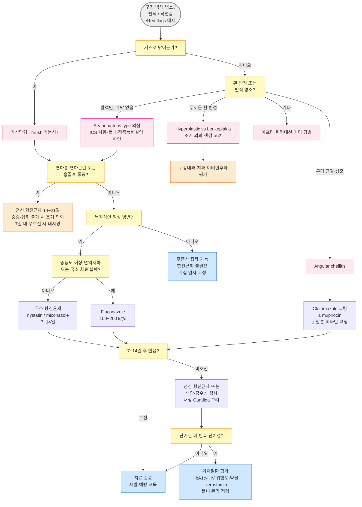

# 입안 칸디다증 Oral Candidiasis

## <mark style="color:green;">일반 사항</mark>

* 구강 점막의 표재성 진균 감염으로, 급성·만성 또는 반복적으로 발생
* 건강한 성인의 약 50%에서 _Candida_ 균이 구강 내 상재하며, 숙주 방어 기전이 손상될 때 발병
* 무증상 구강 집락은 치료하지 않지만, 특징적인 병변이 있는 임상적 구강 칸디다증은 위험 인자 교정과 함께 항진균제 치료가 일반적
* 신체 다른 부위(식도, 생식기, 피부) 칸디다증 동반 가능성 고려
* 재발성인 경우 기저 원인(HIV/AIDS, 당뇨병 조절 불량, 악성 종양 등) 평가 필요
* 치료 후 작열감·통증이 지속되면 burning mouth syndrome 등 다른 원인을, 병변이 지속되면 백반증·구강 암 등을 감별

## <mark style="color:green;">원인 및 위험 인자</mark>

* 원인균 : _Candida albicans_ (대부분); 드물게 _C. glabrata_, _C. tropicalis_, _C. krusei_ (☞ [칸디다 감염](../229_/174_-candida-infection.md))

#### <mark style="color:$primary;">구강 및 국소 인자</mark>

* 흡연, 불량한 구강 위생, 구강 건조증 (xerostomia)
* 틀니 (denture) : 세정 불량, 야간 착용 시 특히 위험 (biofilm 형성이 재발의 핵심 기전)
* 타액 분비 감소 : Sjögren syndrome, 두경부 방사선 치료, 항콜린제 복용
* 철분 결핍, 비타민 B2·B12 결핍 (주로 angular cheilitis와 연관)
* 침 흘림 (drooling) : 노인, Parkinson병 환자에서 구각 습윤 → angular cheilitis 유발

#### <mark style="color:$primary;">약물</mark>

* 광범위 항생제 (정상 구강 상재균 억제 → _Candida_ 과증식)
* 흡입 스테로이드(ICS) : 고용량, 부적절한 흡입법, 흡입 후 구강 세척을 하지 않는 경우 위험 증가; 기기 종류만으로 위험도를 일률적으로 순위화하지 않음
* 전신 스테로이드, 면역억제제, 항암제

#### <mark style="color:$primary;">전신 질환 및 면역 상태</mark>

* 당뇨병 (조절 불량 시), 심한 빈혈
* 악성 종양, 면역 저하 (HIV/AIDS, 장기이식 후)
* 영유아 (면역 체계 미성숙), 노인
  * 신생아 : 분만 시 산도 내 _Candida_에 노출되거나 수유 과정에서 모자 간 균이 공유될 가능성 고려

## <mark style="color:green;">임상 양상</mark>

* 구강의 여러 부위에 각기 다른 형태로 발생 가능

<table><thead><tr><th width="169">형태</th><th width="424">특징</th><th>주요 발생 부위</th></tr></thead><tbody><tr><td><strong>Thrush</strong><br>(위막형)</td><td>흰색 curdlike plaque; 거즈로 닦으면 제거되고 발적·점상출혈 노출</td><td>혀, 볼 점막, 구개</td></tr><tr><td><strong>Erythematous</strong><br>(위축형)</td><td>얇고 beefy한 발적 병소; 백색 위막 없이 발적만 나타나 놓치기 쉬움; 자각 증상 뚜렷한 편<br>정중능형설염(Median Rhomboid Glossitis)은 Candida와 연관될 수 있으나 항상 감염을 의미하지는 않음; 혀 중앙 후방부의 마름모꼴 발적과 유두 소실이 지속되면 다른 병변 감별</td><td>혀 등쪽, 틀니 접촉 점막</td></tr><tr><td><p><strong>Angular cheilitis</strong></p><p>(구각 입술염)</p></td><td>구각의 균열·발적·삼출; 세균 혼합 감염 흔함; 철분·비타민 결핍, drooling 동반 가능</td><td>구각</td></tr><tr><td><p><strong>Hyperplastic form</strong></p><p>(증식형)</p></td><td>흰색 두꺼운 반점; 거즈로 제거 불가; leukoplakia와 외관상 구분하기 어려움; 이형성·악성 전환 가능성이 보고되어 닦이지 않는 지속성 병변은 조직 생검 고려</td><td>볼 점막, 혀</td></tr></tbody></table>

**유발 인자와 임상형 관계**

* 항생제 복용 후 → Thrush (위막형)
* 흡입 스테로이드(구강 세척 불량) → 위막형 또는 erythematous type
* 틀니 (야간 착용, 불량 세정) → Denture stomatitis (위축형, 틀니 접촉 부위)
* 철분/비타민 B2·B12 결핍, drooling → Angular cheilitis
* 만성 흡연, 면역 저하 → Hyperplastic form

### <mark style="color:orange;">아구창 (Thrush)</mark>

* 증상 : 대부분 무증상; 경미한 불편감, 작열감, 쓴맛; 영아에서 보챔·수유 장애 가능
* 진단적 조작 : 거즈로 닦으면 제거되고, 노출된 점막에 발적·점상출혈·따가움 발생
  * 단, 거즈 제거 여부는 절대적 기준이 아님; erythematous type은 위막 없이 발적만, hyperplastic type은 _Candida_ 감염이지만 제거되지 않음 → 비전형적 병소에서는 KOH 또는 조직 생검 고려
* 모유 수유 영아에서 아구창이 반복되고 수유모에게 유두 통증·발적이 있으면 모자를 함께 평가하되, 유두 통증을 칸디다증으로 단정하지 않고 수유 자세·외상·피부염·세균감염 등도 감별

### <mark style="color:$danger;">🚩 Red Flags!</mark>

<mark style="color:$danger;">**즉각 조치 또는 의뢰**</mark>

* 면역 저하자에서 발열·오한, 저혈압 또는 의식 변화가 있고 중심정맥관 등 invasive device 보유 → 침습성 칸디다증을 포함한 패혈증 즉시 평가
* 연하통·연하곤란으로 수분·음식 섭취가 불가능하거나 전신상태가 불량한 경우 → 식도 칸디다증 및 탈수 조기 평가
* 면역 저하자(HIV, 항암 치료 중, 장기이식 수혜자)에서 급격히 악화되는 경우

<mark style="color:$warning;">**당일 또는 조기 의뢰**</mark>

* 연하통·연하곤란 또는 흉골후 통증이 있으나 경구 섭취와 전신상태가 안정적 → 식도 칸디다증 경험적 전신 치료 및 면밀한 추적
* 원인 불명의 면역 저하 상태 의심
* 닦이지 않는 지속성 백색 병변, 경결·궤양·적백색 변화 → chronic hyperplastic candidiasis, leukoplakia, 구강 암 감별 및 조직검사 고려
* 모유 수유 영아의 반복 아구창과 수유모의 지속적 유두 병변·통증 → 모자 동시 평가

<mark style="color:$info;">**외래 추적 / 추가 평가 계획**</mark> <mark style="color:$info;">- 즉각 위험 낮으나 호전 없으면 의뢰</mark>

* 적절한 치료에도 호전되지 않는 경우 → 진단·순응도 재확인 후 배양·균종 동정 및 필요 시 감수성 검사
* 단기간 내 재발하거나 반복적·난치성인 경우 → 틀니, 구강건조, 흡입 steroid 사용법, 최근 항생제, 당뇨병 및 면역저하 위험 재평가

## <mark style="color:green;">진단</mark>

* 대부분 임상 진단; 특징적 병소와 거즈 닦기 조작으로 진단

**추가 검사 및 대상**

* KOH 현미경 검사 : 균사 (pseudohyphae) 또는 포자 확인; atypical 또는 erythematous type에서 유용
* 배양 및 감수성 검사 : 치료 실패, 재발성, 내성 의심 시
* 조직 생검 : Hyperplastic form에서 dysplasia 또는 leukoplakia 감별 시; 닦이지 않는 지속성 백색 병변, 경결·궤양·적백색 변화가 있으면 항진균제 반응만 기다리지 말고 생검 고려


**진단 실수 주의**

* Leukoplakia를 candidiasis로 오진 : 거즈로 제거 여부를 확인하되, 닦이지 않는 병변은 조기 의뢰·생검 고려
* Erythematous type 놓침 : ICS 사용 환자에서 백색 위막 없이 혀 발적만 나타날 수 있음; 정중능형설염은 Candida와 연관될 수 있으나 항상 칸디다 감염은 아님
* Angular cheilitis를 herpes labialis로 오진 : herpes는 수포·딱지, angular cheilitis는 구각 균열·삼출
* 반복 칸디다증에서 기저 요인 미평가 : 단기간 내 재발·난치성 감염 시 당뇨병 위험, HIV 노출 위험과 다른 면역저하 단서를 바탕으로 필요한 검사를 개별화
* Chlorhexidine + nystatin 동시 사용 : chlorhexidine이 nystatin의 활성을 감소시킬 수 있다는 in vitro 근거가 있으므로 동시에 적용하지 않고 최소 2시간 간격 고려


### <mark style="color:orange;">감별 진단</mark>

구강 백색 병소의 3대 감별 비교

<table><thead><tr><th width="170">항목</th><th width="190">구강 칸디다증</th><th width="185">백반증 (Leukoplakia)</th><th>구강 편평 태선</th></tr></thead><tbody><tr><td><strong>거즈로 닦임?</strong></td><td>✅ 닦임(thrush 한정); 증식형은 닦이지 않음</td><td>❌ 안 닦임</td><td>❌ 안 닦임</td></tr><tr><td><strong>표면 모양</strong></td><td>Curd-like, 불균일; erythematous type은 발적만</td><td>균일 또는 불균일한 흰 plaque</td><td>레이스형 Wickham 선조</td></tr><tr><td><strong>기저 점막</strong></td><td>닦으면 발적·점상출혈</td><td>병변 형태에 따라 다양</td><td>홍반·미란 동반 가능</td></tr><tr><td><strong>통증</strong></td><td>±; erythematous type은 통증↑</td><td>대개 없음</td><td>작열감·통증 흔함</td></tr><tr><td><strong>주요 위험 인자</strong></td><td>항생제, steroid, DM, 면역 저하</td><td>흡연, 음주 등</td><td>자가면역, 약물</td></tr><tr><td><strong>전암 가능성</strong></td><td>위막형·홍반형은 전암병변으로 보지 않으나 <strong>만성 증식형은 이형성·악성 전환 가능성이 보고됨</strong></td><td>⚠️ 있음</td><td>⚠️ 일부(특히 erosive)</td></tr><tr><td><strong>진단 방법</strong></td><td>임상 ± KOH; 증식형은 생검 고려</td><td>조직 생검 필요</td><td>조직 생검으로 확진</td></tr><tr><td><strong>치료 반응</strong></td><td>대개 항진균제에 반응</td><td>항진균제만으로 소실되지 않음</td><td>스테로이드 반응</td></tr></tbody></table>

***


```mermaid
flowchart TD
    A([구강 백색 병소 / <br/>발적 / 작열감<br/>•Red flags 배제]) --> B[거즈로 닦이는가?]
    B -- 예 --> C[가성막형 Thrush 가능성↑]
    B -- 아니오 --> D[흰 반점 또는<br/>발적 병소?]
    D -- 두꺼운 흰 반점 --> E[Hyperplastic vs Leukoplakia<br/>조기 의뢰·생검 고려]
    D -- 발적만, 위막 없음 --> H[Erythematous type 의심<br/>ICS 사용·틀니·정중능형설염 확인]
    D -- 구각 균열·삼출 --> G[Angular cheilitis]
    D -- 기타 --> Z[아프타·편평태선·기타 감별]
    C --> I[연하통·연하곤란 또는<br/>흉골후 통증?]
    H --> I
    I -- 예 --> J[전신 항진균제 14~21일<br/>중증·섭취 불가 시 조기 의뢰<br/>7일 내 무호전 시 내시경]
    I -- 아니오 --> K[특징적인 임상 병변?]
    K -- 아니오 --> N[무증상 집락 가능<br/>항진균제 불필요<br/>위험 인자 교정]
    K -- 예 --> O[중등도 이상·면역저하<br/>또는 국소 치료 실패?]
    O -- 아니오 --> P[국소 항진균제<br/>nystatin / miconazole<br/>7~14일]
    O -- 예 --> Q[Fluconazole<br/>100~200 ㎎/d]
    P --> R[7~14일 후 반응?]
    Q --> R
    R -- 호전 --> S[치료 종료<br/>재발 예방 교육]
    R -- 미호전 --> T[전신 항진균제 또는<br/>배양·감수성 검사<br/>내성 Candida 고려]
    T --> U[단기간 내 반복·난치성?]
    U -- 예 --> V[기저질환 평가<br/>HbA1c·HIV 위험도·약물·xerostomia<br/>틀니 관리 점검]
    U -- 아니오 --> S
    G --> W[Clotrimazole 크림<br/>± mupirocin<br/>± 철분·비타민 교정]
    W --> R
    E --> X[구강내과·치과·이비인후과<br/>평가]

style A fill:#eeeeee,stroke:#888888,stroke-width:2px
classDef orange fill:#fdebd0,stroke:#e67e22
class J,X orange
classDef yellow fill:#fff9c4,stroke:#f39c12
class B,D,I,K,O,R,U yellow
classDef blue fill:#d0e8ff,stroke:#1a6abf
class N,S,V blue
classDef pink fill:#fde8f0,stroke:#e91e8c
class G,H,Z,C,E pink
```

<p align="center"><strong>입안 칸디다증 진단 및 치료 알고리듬</strong></p>

<p align="center"><em><mark style="color:$info;">Ref. IDSA Clinical Practice Guideline for Management of Candidiasis, 2016; 처방가이드 편집</mark></em></p>

***

## <mark style="background-color:$warning;">Management</mark>

### <mark style="color:orange;">치료 방침</mark>

* 병변 없이 배양에서만 _Candida_가 검출된 무증상 집락은 면역 상태와 관계없이 일률적으로 치료하지 않음
* 특징적인 구강 병변이 있으면 통증 유무와 관계없이 임상적 구강 칸디다증으로 보고 위험 인자 교정과 항진균제 치료 고려
* 경증, 면역 정상, 식도 증상 없음 → 국소 항진균제
* 중등도 이상, 국소 치료 실패 또는 면역 저하자 → 경구 fluconazole 우선 고려
* 연하통·연하곤란·흉골후 통증 → 식도 칸디다증으로 보고 전신 항진균제 14～21일; 섭취 불가·전신상태 불량 시 조기 의뢰

#### <mark style="color:$primary;">국소 vs 전신 치료 선택 기준</mark>

<table><thead><tr><th width="110"></th><th width="245">국소 항진균제</th><th width="245">구강 전신 치료</th><th>식도 칸디다증</th></tr></thead><tbody><tr><td><strong>대상</strong></td><td>경증, 면역 정상, 식도 증상 없음</td><td>중등도 이상, 면역 저하, 국소 치료 실패</td><td>연하통·연하곤란·흉골후 통증</td></tr><tr><td><strong>약제</strong></td><td>nystatin, miconazole, clotrimazole</td><td>fluconazole 100～200 ㎎/d</td><td>fluconazole 200～400 ㎎/d</td></tr><tr><td><strong>기간</strong></td><td>7～14일</td><td>7～14일</td><td><strong>14～21일</strong></td></tr><tr><td><strong>추적</strong></td><td colspan="2">치료 실패 시 진단·순응도 재확인 후 배양·감수성 검사 고려</td><td>7일 이내 뚜렷한 호전이 없으면 내시경 및 다른 식도염 감별</td></tr></tbody></table>

### <mark style="color:orange;">반복적·난치성 구강 칸디다증 평가</mark>

**Step 1. 가짜 재발 배제** (가장 흔한 원인)

* Nystatin 접촉 시간 부족, 조기 중단
* Chlorhexidine과 nystatin의 동시 사용

**Step 2. 국소 요인 교정**

* 틀니 야간 제거 + 소독 (biofilm 관리)
* ICS 흡입 후 양치 여부 확인
* Xerostomia 교정

**Step 3. 전신 평가**

* 당뇨병 위험 또는 조절 불량이 의심되면 혈당·HbA1c 평가
* HIV 검사 : 노출 위험, 다른 임상 단서 및 환자 동의를 고려하여 시행
* 약물 검토 (항생제, 스테로이드)
* CBC → 호중구감소증 (악성 종양, 항암 치료)
* 드문 원인 : 만성 점막피부 칸디다증(Chronic Mucocutaneous Candidiasis, CMC) - STAT1 gain-of-function, AIRE/APECED, IL-17 경로 이상, CARD9 결함 등과 연관; 소아기부터 피부·구강·손발톱 칸디다증이 지속·반복되면 면역결핍 전문의 의뢰

**Step 4. 균종 확인** (위 단계로 해결 안 될 때)

* 배양·감수성 검사
* 균종명만으로 경험적 고용량 fluconazole을 투여하지 않으며, 감수성 결과와 병용약물·간신기능을 바탕으로 치료 선택
* fluconazole 불응 시 itraconazole oral solution, posaconazole 또는 voriconazole 등을 고려할 수 있으나 반복 난치성·면역저하자는 감염내과 협진 권고

## <mark style="color:green;">비-약물 치료 및 예방</mark>

* 금연
* 구강 위생 개선 : 식사 후 칫솔질; chlorhexidine 가글이 필요한 경우 nystatin과 동시에 적용하지 않고 최소 2시간 간격 고려
* 틀니 관리
  * 취침 시 틀니 제거 - 야간 착용 금지 (biofilm 형성 및 denture stomatitis의 핵심 예방)
  * 틀니 재질과 제조사·치과 지침에 맞는 세정제를 사용; chlorhexidine 밤샘 침지를 모든 틀니에 일률적으로 적용하지 않음(변색·금속 부식 가능)
  * 필요 시 틀니 표면에 nystatin 도포 고려
  * 잘 맞지 않는 틀니는 치과에서 재조정
* 구강 건조증 치료 (☞ [구강건조증](056_-dry-mouth-xerostomia.md))
* 흡입 스테로이드 사용자 :
  * 흡입 후 반드시 양치 및 목 깊숙이 가글 후 뱉어낼 것 (후두 칸디다증 예방 포함)
  * Spacer 사용으로 구강 내 침착 감소
  * 고용량 ICS가 필요한 경우 최소 유효 용량과 흡입법을 정기적으로 재평가
* 혈당 조절 : 당뇨병 환자에서 혈당 조절 개선이 재발 예방에 필수
* 영양 상태 개선 : Angular cheilitis 반복 시 철분, 비타민 B2·B12 결핍 여부 확인 및 보충
* Probiotics : 임상적 유효성, 최적 균주·용량 및 면역저하자에서의 안전성이 확립되지 않아 구강 칸디다증의 routine 치료·예방으로 권고하지 않음

## <mark style="color:green;">약물 치료</mark>

### <mark style="color:orange;">국소 항진균제</mark>

* 약물의 구강 내 접촉 시간이 효과를 결정 (swish & swallow); 단순히 삼키면 효과 현저히 감소
* 적응증 : 임상 병변이 확인된 경증～중등도; 식도 침범 증상이 없는 경우
* 치료 기간 : 통상 7～14일이나 제제별 허가사항을 따르며, 임의로 조기 중단하지 않음

**Miconazole 구강 겔**

* miconazole oral gel : 약 2.5 ㎖ (50 ㎎)를 구강 각 부위에 적용; 식후 가능한 오래 물고 있다가 삼킴; qid ×7d + 호전 후 7d
* 생후 4개월 미만 영아 - 질식 위험으로 사용 금지; 4개월 이상 영아 - 소량(1.25 ㎖)으로 시작
*   Miconazole은 CYP2C9 및 CYP3A4 억제제로 다수의 약물과 상호작용

    * Warfarin : 출혈 위험 증가 (CYP2C9 경로)
    * Sulfonylurea계 혈당강하제 : 저혈당 위험
    * DOACs (rivaroxaban, apixaban 등) : 혈중 농도 상승 → 출혈 위험; 고령 환자에서 특히 주의
    * Quetiapine, 일부 statin : 혈중 농도 상승

    위 약물 복용 환자에서는 nystatin 우선 고려

**Nystatin 현탁액**

* nystatin suspension 100,000 단위/㎖ : 성인 4～6 ㎖를 양측에 나누어 넣고 가능한 오래 머금은 후 삼킴, qid ×7～14d <mark style="color:blue;">\[타로니스타틴]</mark> (비급여)
  * 영아 : 1 ㎖씩 구강 양측에 적용 후 삼킴 × qid
* chlorhexidine 가글과 병용 시 nystatin의 항진균 효과 감소 (in vitro 근거; 임상적 유의성에 일부 논란 있으나 안전을 위해 2시간 간격 권고)
* 제품에 당(糖) 성분이 포함될 수 있으나 **사용 직후 물로 헹구면 점막 접촉 시간이 감소할 수 있으므로 즉시 헹구지 않음**; 사용 후 일정 시간 음식·음료를 피하고 평소 구강 위생으로 충치 위험 관리
* 국내 공급 불안정 사례가 드물지 않음; 재고 부족 시 clotrimazole 트로키 또는 miconazole 겔로 대체

**Clotrimazole**

* 구강 (트로키) : 10 ㎎ 트로키를 20분 동안 천천히 녹여 삼킴; 5회/d ×7\~14d
  * 타액 분비 감소 환자(방사선 치료 후, Sjögren syndrome)에서는 트로키가 충분히 녹지 않아 효과 저하; nystatin 현탁액 대체 고려
* 구각 입술염 : clotrimazole 크림 1% bid\~tid 국소 도포 <mark style="color:blue;">\[카네스텐]</mark>
  * 구각 입술염은 세균 혼합 감염(_S. aureus_)이 흔하므로, 반응 불량 시 mupirocin 또는 fusidic acid 크림 추가 고려
  * 철분·비타민 B2·B12 결핍 동반 시 병행 교정 없이는 재발 반복

### <mark style="color:orange;">전신 항진균제</mark>

* 적응증 : 중등도 이상, 국소 치료 반응 불량, 면역 저하자 또는 식도 침범 의심

**Fluconazole**

* 1차 선택제
* 구강 칸디다증 : fluconazole 100～200 ㎎ PO qd ×7～14d <mark style="color:blue;">\[푸루나졸]</mark>
* 식도 칸디다증 : fluconazole 200～400 ㎎ PO 또는 IV qd ×14～21d - 구강 칸디다증 용법과 구분
* ✽국내 허가사항·급여 인정 범위는 제품과 적응증에 따라 다를 수 있으므로 처방 전 최신 허가사항과 급여기준 확인

**Itraconazole 경구 액제**

* 2차 선택; fluconazole 내성 시
* itraconazole oral solution (swish & swallow 방식) : 200 ㎎/d ×7\~14d
* fluconazole 불응 시 배양·감수성 결과를 바탕으로 고려; 특정 균종명만으로 경험적으로 선택하지 않음
* 공복 흡수 우수; 음식과 함께 복용 시 흡수 감소
* 식도 칸디다증에도 효과적 (IDSA 2016)


_Candida auris_의 내성·의료기관 감염관리와 무증상 집락의 원칙은 174 칸디다 감염 총론 참조.


***

### <mark style="color:red;">질병코드 (KCD)</mark>

B37.0 칸디다구내염

***

## <mark style="color:purple;">처방례</mark>

> **처방례 1. 경증 아구창 - Nystatin 현탁액**
>
> ```
> Nystatin suspension 60 ㎖/병   1회 5 ㎖ (양측 각 2.5 ㎖)   물고 5분 후 삼킴   qid ×14d
> ```
>
> _✽식후 사용하고 가능한 오래 머금은 뒤 삼킴. 사용 직후 물로 헹구거나 음식·음료를 섭취하지 않음. Chlorhexidine 가글과 동시에 사용하지 말고 필요 시 최소 2시간 간격 고려. Warfarin·sulfonylurea·DOAC 복용자에서는 miconazole보다 우선 고려._

> **처방례 2. 경증\~중등도 아구창 - Miconazole 겔**
>
> ```
> Miconazole oral gel 20 ㎎/g   2.5 ㎖   식후 물고 있다가 삼킴   qid ×14d
> ```
>
> _✽ Warfarin·sulfonylurea·DOAC·quetiapine 복용자는 처방례 1(nystatin) 우선 고려. 생후 4개월 미만 영아 사용 금지._

> **처방례 3. 구각 입술염 (Angular cheilitis)**
>
> ```
> Clotrimazole cream 1%   적량   구각 bid~tid 도포 ×14d
> ```
>
> _✽ 세균 혼합 감염 의심 시 mupirocin 크림 병용 또는 교체. 재발 반복 시 철분·비타민 B2·B12 혈중 농도 확인. 틀니 관련 시 틀니 소독 병행 필수._

> **처방례 4. 중등도 이상 또는 국소 치료 실패 - 전신 항진균제**
>
> ```
> Fluconazole 100 ㎎   1정   qd ×7~14d
> ```
>
> _✽구강 칸디다증 권장 범위는 100～200 ㎎/d ×7～14일. 연하통·연하곤란·흉골후 통증이 있으면 식도 칸디다증 용법(200～400 ㎎/d ×14～21일)으로 별도 평가. 치료 실패 시 진단·순응도 재확인 후 배양·감수성 검사 및 필요 시 감염내과 협진._

***

### <mark style="color:$success;">핵심 복약 지도</mark>

> **Nystatin 현탁액 사용법**
>
> 1. 사용 전 반드시 **잘 흔들어** 주세요.
> 2. 처방된 양을 입 안 좌우로 나누어 넣은 후 **최소 5분 이상 물고 계신 후** 삼키세요 - 구강 점막과의 접촉 시간이 효과를 결정합니다. 단순히 삼키면 효과가 현저히 줄어듭니다.
> 3. 식후에 사용하고, 사용 직후에는 물로 헹구거나 음식·음료를 섭취하지 마세요.
> 4. **Chlorhexidine 가글(헥사메딘)과 동시에 사용하면 효과가 감소할 수 있습니다.** 필요하면 최소 2시간 간격을 두세요.
> 5. 증상이 좋아진 후에도 **처방된 기간 전체를 완료**하세요 (재발 방지).

> **Miconazole 구강 겔 사용법**
>
> 1. 식사 후에 적용하고, **최대한 오래 입 안에 물고 있다가** 삼키세요.
> 2. **혈액 희석제(와파린, 리바록사반 등)를 드시는 경우** 반드시 의사에게 알리세요 - 출혈 위험이 증가할 수 있습니다.
> 3. 생후 4개월 미만 영아에게는 절대 사용하지 마세요.

> **Fluconazole (푸루나졸) 복약 안내**
>
> 1. 1일 1회, **같은 시간대**에 복용하세요.
> 2. 간 독성이 드물게 발생할 수 있습니다 - 황달, 진한 소변, 극심한 피로감 발생 시 즉시 내원하세요.
> 3. 다른 약물과의 상호작용이 많으므로, 복용 중인 **모든 약(혈압약, 혈당약 포함)을 의사에게 알려**주세요.

> **흡입 스테로이드 사용자를 위한 안내**
>
> * 흡입 후에는 반드시 물을 입에 담고 **목 깊숙이 가글한 뒤 뱉어내십시오** - 구강뿐 아니라 목 안의 칸디다 예방에도 중요합니다.
> * Spacer(흡입 보조기구)를 사용하면 입 안에 약이 덜 쌓입니다.

> **언제 다시 병원을 방문해야 하나요?**
>
> * 치료 7일 후에도 증상 호전이 없는 경우
> * **삼킬 때 통증이 있거나 흉골 뒤쪽이 쓰리고 아픈 경우** - 즉시 내원 (식도 칸디다증 의심)
> * 발열, 전신 쇠약감이 동반되는 경우 - 즉시 내원
> * 치료 후 단기간 내 다시 생기거나 반복적으로 재발하는 경우

***

### <mark style="color:blue;">환자 안내서</mark>


**입안 칸디다증은 치료 가능한 진균 감염입니다**

건강한 분도 입 안에 칸디다 균이 살고 있습니다. 면역력이 떨어지거나 항생제 복용, 구강 건조, 틀니 문제 등의 상황이 되면 이 균이 과도하게 증식해 증상을 일으킵니다. 대부분 간단한 치료와 생활 교정으로 낫습니다.


#### <mark style="color:$primary;">왜 입안 칸디다증이 생기나요?</mark>

* 항생제를 복용한 후 (정상 세균이 줄면 칸디다가 증식합니다)
* 흡입용 스테로이드 약을 쓰는 분 (흡입 후 양치를 하지 않으면 구강 내 약물 잔류 → 균 성장 촉진)
* 틀니를 사용하는 분 (특히 세정이 불량하거나 밤에도 끼는 경우)
* 당뇨병이 조절되지 않는 분
* 철분이나 비타민이 부족한 분 (특히 구각 병변 반복 시)
* 면역력이 저하된 분

#### <mark style="color:$primary;">일상생활에서 어떻게 관리하나요?</mark>

* **금연**하십시오.
* 식사 후 **칫솔질**을 철저히 하십시오. 처방받은 구강약과 가글액은 동시에 사용하지 않도록 안내받은 간격을 지키십시오.
* 틀니는 **밤에 빼서** 재질에 맞는 방법으로 세정·건조하십시오 - 밤새 틀니를 끼고 있으면 균이 번식하기 쉽습니다.
* 흡입 스테로이드 사용 후에는 **반드시 목 깊숙이 가글 후 뱉어내십시오**.
* 당뇨병이 있으시면 **혈당 관리**에 특히 신경 쓰십시오.

#### <mark style="color:$primary;">약은 어떻게 사용하나요?</mark>

* 처방받은 항진균제(액체 또는 겔)는 입 안에 **충분히 물고 계신 후** 삼키세요 - 단순히 삼키면 효과가 줄어듭니다.
* 증상이 나아도 **처방받은 기간을 끝까지** 사용하세요. 일찍 끊으면 재발합니다.
* Chlorhexidine 가글을 함께 처방받으셨다면 nystatin과 **동시에 사용하지 말고** 안내받은 시간 간격을 지키세요.

#### <mark style="color:$primary;">이럴 때는 즉시 병원을 방문하세요</mark>

* **음식을 삼킬 때 통증이 있거나** 가슴(흉골 뒤쪽)이 쓰리고 아픈 경우
* 발열이나 전신 쇠약감이 동반되는 경우
* 치료를 받아도 2주 안에 호전이 없는 경우
* 흰 반점이 닦아도 지워지지 않거나 점점 커지는 경우
