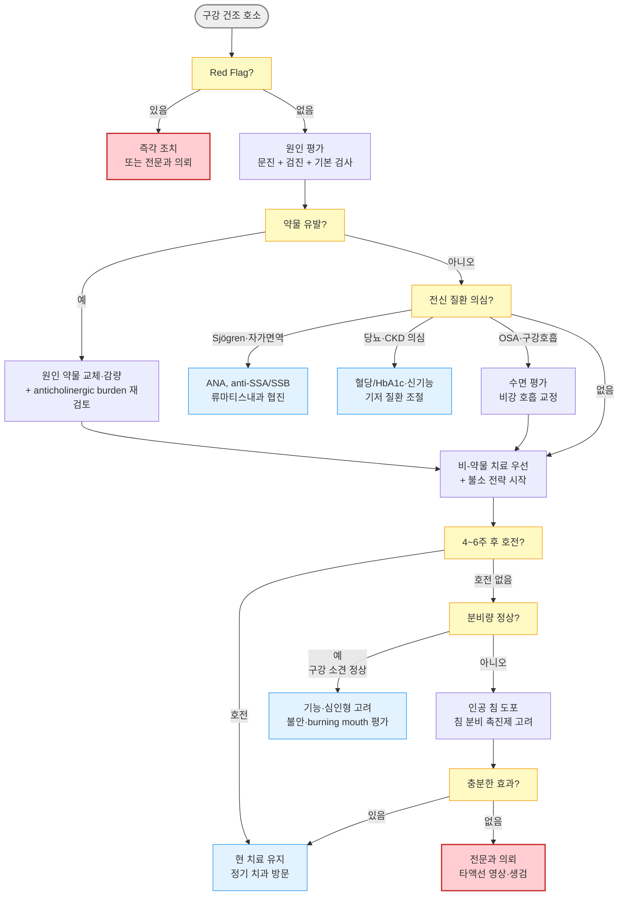

# 입안마름증 (구강건조증) Dry Mouth, Xerostomia

## <mark style="color:green;">일반 사항</mark>

* 침샘의 기능 저하 또는 구강 습윤 유지 장애로 인한 주관적·객관적 구강 건조 증상
* 침의 기능 : 구강 점막 보호, 소화 효소(amylase, lipase) 함유, 항균 작용(lactoferrin, lysozyme, sIgA(분비형 면역글로불린 A), lactoperoxidase), 완충 작용, 발음 보조
* 유병률 : 성인의 약 10\~46%; 노인 및 다약제 복용자에서 높음
* 합병증 : 삼킴곤란, 수면 장애, 구취, 충치(특히 치경부 우식증), 치주 질환, 침샘 결석, 구강 칸디다증, 미각 장애, 영양 섭취 저하
* 두 핵심 개념 : xerostomia (입마름 호소) / hyposalivation (타액 분비 감소) - 증상이 있어도 분비량은 정상일 수 있고, 분비량이 줄어도 증상이 없을 수 있음
  * Xerostomia & 정상 분비량 → 심인성(불안, 공황), 구강 호흡, burning mouth
  * Hyposalivation & 건조감 없음 → 고령, 신경병증, 감각 둔화

## <mark style="color:green;">원인 및 위험 인자</mark>

* 약물이 가장 흔한 원인임

#### <mark style="color:$primary;">전신 질환 및 상태</mark>

* 고령 - 침샘 실질 위축 및 다약제 복용 증가
* 당뇨병 - 다음(多飮), 자율신경병증, 만성 탈수
* Sjögren syndrome (원발성/속발성) - 건조증후군의 대표 원인
* 두경부 방사선 치료, 조혈모세포이식
* 만성 이하선염, 침샘관 폐쇄(결석, 협착)
* 탈수 상태 (수분 섭취 부족, 구토, 설사, 발열)
* 폐쇄성 수면무호흡증(OSA) - 구강 호흡 + CPAP 사용으로 건조 악화
* 파킨슨병 - 자율신경계 기능 이상, 항콜린제 사용
* 만성 신장병(CKD) - 요독증 관련 타액 성분 변화
* C형 간염 (Sjögren-like 건조 증후군 유발 가능)
* IgG4 연관 질환 (IgG4-related disease) - 침샘 실질 침윤·섬유화; 최근 인식 증가
* HIV/AIDS, HTLV-1 - 침샘 림프구 침윤 → Sjögren-like 건조 증후군 유발 가능; HIV 환자 구강 건조 시 면역 상태 평가 병행
* 결핵

#### <mark style="color:$primary;">약물</mark>

* 항콜린제 : oxybutynin, solifenacin, tolterodine, 삼환계 항우울제
* 항히스타민제 (1세대) : chlorpheniramine, hydroxyzine
* 항우울제 : SSRI, SNRI, mirtazapine
* 항정신병약 : clozapine, quetiapine, haloperidol
* 항고혈압제 : α/β-차단제, 칼슘차단제, thiazide·furosemide 이뇨제
* 벤조디아제핀계 : alprazolam, lorazepam 등 - 중추성 기전으로 타액 분비 억제
* 기분안정제 : 리튬 - 직접 침샘 영향; 항부정맥제 disopyramide - 강한 항콜린 작용
* 기타 : isotretinoin, opioid, 항경련제, SGLT-2 억제제 (비교적 새로 알려진 원인)
* 면역항암제 (Immune Checkpoint Inhibitors, ICI) - anti-PD-1/PD-L1, anti-CTLA-4 등; 면역 관련 부작용(irAE)으로 침샘염·건조증 발생 사례 증가; 암 치료 중인 환자에서 반드시 확인


**Anticholinergic Burden (항콜린 부담)** : 개별 약물보다 복용 중인 항콜린성 약물의 누적 부담(cumulative burden)이 중요. 특히 노인에서는 한 가지 약물만으로는 기준에 미치지 않더라도 여러 약물의 조합으로 구강 건조가 발생하거나 악화됨. 증상이 지속될 경우 전체 약물 구성을 재검토하는 처방 최적화가 필요


#### <mark style="color:$primary;">생활 습관 및 환경</mark>

* 흡연, 전자담배(e-cigarette) - 전자담배 에어로졸도 구강 점막 건조·염증 유발, 흡연과 동일 주의 필요
* 과도한 음주
* 코 막힘으로 인한 구강 호흡
* 건조 환경 (에어컨, 온풍기, 겨울 난방, 장거리 비행)
* 알코올 함유 구강 청정액, 향이 강한 치약 사용
* 소금/나트륨 과다 식사, 카페인 과다 섭취

## <mark style="color:green;">임상 양상</mark>

* 구강 건조감, 목마름 - 식사 시 물을 함께 마셔야 삼킬 수 있음
* 씹기·삼키기·발음 어려움
* 미각 변화, 음식 맛 감소
* 구강 점막 : 광택 소실, 창백 또는 충혈, 균열; 혀 균열·유두 소실
* 야간에 갈증으로 수면 중 각성
* 구강 항균력 저하 → 치아 우식증(특히 치경부), 구강 칸디다증, 구취

### <mark style="color:$danger;">🚩 Red Flags!</mark>

<mark style="color:$danger;">**즉각 조치 또는 의뢰**</mark>

* 이하선·악하선 부위 급격한 종창 + 발열 + 개구 장애 → 화농성 침샘염, 침샘 농양, 괴사성 근막염
* 연하 불가·흡인 징후 동반 → 삼킴곤란으로 인한 흡인성 폐렴
* 면역 저하 환자에서 광범위 구강 점막 손상 + 발열 → 기회 감염

<mark style="color:$warning;">**당일 또는 조기 의뢰**</mark>

* 이하선·악하선 부위 단단하고 무통성 종괴 → 침샘 종양&#x20;
* 편측 침샘 종창이 3\~4주 이상 지속 → 림프종(lymphoma)
* 구강 건조 + 안구 건조 + 전신 증상(관절통, 피로감) → Sjögren syndrome
* 구강 칸디다증 동반 - 특히 면역 저하 환자에서 전신 감염 진행 위험
* 두경부 방사선 치료 후 급격한 악화 → 방사선 침샘 손상

<mark style="color:$info;">**외래 추적 / 추가 평가 계획**</mark> <mark style="color:$info;">- 즉각 위험 낮으나 호전 없으면 의뢰</mark>

* 비-약물 치료 4\~6주 후에도 증상 호전 없음
* 원인 약물 교체·조정 후에도 지속되는 건조증
* 반복되는 충치·치주 질환 악화 → 치과 의뢰
* 당뇨 조절 불량과 동반된 구강 건조 지속 → 혈당 관리 강화

## <mark style="color:green;">진단</mark>

* 주로 임상적 진단; 원인 규명이 핵심
* 문진 : 건조감 지속 기간, 야간 음수 습관, 충치 빈도, 안구/질 건조 동반 여부, 약물력, 방사선 치료력

#### <mark style="color:$primary;">문진</mark>&#x20;

**Fox questionnaire 단축형**

* 다음 항목 중 2개 이상 해당 시 구강 건조증 가능성 높음

1. 식사 시 물을 함께 마셔야 음식을 삼키기 편하다
2. 건조한 음식(빵, 과자 등)을 씹기 어렵다
3. 입이 건조하여 말하기 어렵다
4. 야간에 갈증으로 잠에서 깬다

#### <mark style="color:$primary;">구강 검진</mark>

* 구강 점막 광택 소실, 건조·균열, 혀 유두 소실 또는 균열
* 하악 설하 부위 거울 검사 : 소량 침 고임(pooling) 관찰
* Bedside signs of hyposalivation
  * 거울 점착 징후 (mirror sticking sign) : 구강 점막에 치경 거울을 대었을 때 달라붙음
  * 구순 건조 징후 (lipstick sign) : 윗 앞니에 립스틱이 묻어남 (여성 환자)
* 이하선·악하선 촉진 - 종창, 압통, 종괴 여부
* 치아 : 치경부 우식증, 다발성 우식증

#### <mark style="color:$primary;">타액 분비량 측정 (Sialometry)</mark>

* 비자극 전타액 (Unstimulated Whole Saliva, UWS) : 최소 5분 이상 뱉기 (오차 감소 위해 10\~15분 권장) → 정상 ≥ 0.1 ㎖/분
* 자극 타액 (Stimulated Saliva) : 파라핀 왁스 저작 5분 → 정상 ≥ 0.7 ㎖/분
* 1차 진료에서 정밀 측정이 어려운 경우 Bedside signs + Fox 문진으로 대체 가능


**검사 전 처치** : 측정 최소 1\~2시간 전 금식, 흡연 금지, 양치 금지. 측정 직전 격렬한 운동·스트레스 회피. 이를 지키지 않으면 결과 오차가 커질 수 있음.


#### <mark style="color:$primary;">기본 검사 (원인 규명)</mark>

* 혈당 및 HbA1c - 당뇨 동반 여부
* ANA, anti-SSA(Ro), anti-SSB(La) - Sjögren syndrome 의심 시
* CBC, ESR, CRP - 전신 염증·자가면역 평가
* IgG4 - IgG4 연관 질환 의심 시
* 필요 시 : 타액선 초음파 (Salivary Gland Ultrasound/POCUS) - 침샘 생검 전 단계 평가로 활용도 증가; 종괴, 결석, 침샘 실질의 비균질성·저에코 변화(Sjögren 특징적 소견) 확인; 류마티스내과·이비인후과에서 민감도·특이도 높게 평가
* 타액선 신티그래피 - 기능 평가 (필요 시)


**Sjögren syndrome 진단 기준** (2016 ACR/EULAR, 간략 요약)\
⓵ anti-SSA(Ro) 양성 (3점), ⓶ 소구강침샘 생검 focal lymphocytic sialadenitis (3점), ⓷ 비정상적 안구 염색 (1점), ⓸ Schirmer test ≤ 5 ㎜/5분 (1점), ⓹ unstimulated salivary flow ≤ 0.1 ㎖/분 (1점)\
→ 총 4점 이상이면 Sjögren syndrome 진단 기준 충족. 구강 건조와 함께 안구 건조, 피로, 관절통이 동반되면 류마티스내과 의뢰.\
**Schirmer test 주의** : 비특이적이며 위양성/위음성이 있어 단독으로 진단 근거로 삼기 어려움. 안과 협진 시 안구 표면 염색 점수(Ocular Staining Score, OSS)가 더 정밀한 안구 건조 평가 지표임


### <mark style="color:orange;">감별 진단</mark>

* 원인 기반 표현형(phenotype) 분류가 치료 방향을 결정

<table><thead><tr><th width="127">표현형</th><th width="210">주요 단서</th><th width="185">핵심 검사</th><th>우선 조치</th></tr></thead><tbody><tr><td>약물 유발형</td><td>다약제 복용; 신규 약물 투여 후 증상 시작; 항콜린 burden↑</td><td>약물력 검토</td><td>원인 약물 교체·감량; 전체 약물 재설계</td></tr><tr><td>자가면역형 (Sjögren)</td><td>안구 건조 + 관절통 + 피로감; 이하선 종창</td><td>anti-SSA/SSB, ANA</td><td>류마티스내과 의뢰; pilocarpine 적응증</td></tr><tr><td>대사·전신형</td><td>다음·다뇨 (당뇨); 피로 + 부종 (CKD)</td><td>혈당/HbA1c; 신기능</td><td>기저 질환 조절</td></tr><tr><td>폐쇄·구조형</td><td>식사 중 통증·종창 (결석); 편측 지속 종창 (종양·림프종)</td><td>타액선 초음파</td><td>영상 검사; 전문과 의뢰</td></tr><tr><td>기능·심인형</td><td>구강 소견 정상; 분비량 정상; 불안·우울 동반</td><td>Sialometry 정상</td><td>정신건강 평가; burning mouth 감별</td></tr><tr><td>구조적·환경형</td><td>코막힘·코골이; 건조 환경; OSA 의심</td><td>비강 검진; 수면 평가</td><td>비강 호흡 교정; CPAP 최적화</td></tr></tbody></table>

***



<p align="center"><strong>구강건조증 진단 및 치료 알고리듬</strong></p>

<p align="center"><em><mark style="color:$info;">Ref. Villa A et al., Oral Dis 2015; Plemons JM et al., JADA 2014</mark></em></p>

***

## <mark style="background-color:$warning;">Management</mark>

### <mark style="color:orange;">치료  Step</mark>

1. 원인 질환 치료 및 유발 약물 제거·교체&#x20;
2. 비-약물 치료 :  건조 예방 및 구강 습윤 유지 + 침샘 분비 자극 + 구강 위생
3. 인공 침 도포&#x20;
4. 침 분비 촉진제 &#x20;
5. 치과 질환(우식증, 치주 질환) 예방 및 치료

* Sjögren syndrome 등 전신 질환 동반 시 류마티스내과 협진

## <mark style="color:green;">비-약물 치료 & 예방</mark>

#### <mark style="color:$primary;">건조 예방</mark>

* 소량의 물을 자주 마시거나 입을 축임 - 단순 수분 공급만으로 근본적 해결은 어려우나 증상 완화에는 도움
  * 지나친 수분 섭취(특히 야간)는 야뇨를 초래할 수 있음
  * 물로만 과도하게 자주 헹구면 오히려 불편감이 지속될 수 있으므로 인공 침과 병행 권장
* 얼음 물고 있기 : 점막 손상 방지를 위해 거즈에 싸서 적용
* 구강 자극 회피 : 커피, 술, 알코올 함유 구강 청정제, 흡연/니코틴, 향이 강한 치약
* 당분 함유 음식, 산성 음료 회피 : 콜라, 가당 주스, 에너지 드링크
* 입마름 악화 유발 약물 회피 : 항콜린제, 1세대 항히스타민제
* 건조 환경 회피 : 냉/난방 기기(특히 온풍기), 에어컨 장시간 사용, 장거리 비행
* 가습기 사용 (특히 야간 수면 중)
* 구강 호흡 방지를 위한 비강 호흡 관리

#### <mark style="color:$primary;">분비 자극</mark>

* 무설탕 껌 또는 자일리톨 함유 사탕/껌 - 저작 자극으로 타액 분비 촉진, 우식증 예방 부가 효과
  * 자일리톨 ≥ 5 g/일 → 우식증 예방 임상 근거 있음; 1회 1\~2 g씩 식후 씹기 권장
* 감귤, 레몬 조각 (산미에 의한 타액 분비 자극) - 치아 부식 위험으로 장기 사용 제한


**구강건조증 = 진행 중인 치과 응급 상황**\
타액 감소 시 치아 우식증 위험이 일반인 대비 3\~5배 증가. 특히 방사선 치료 후·Sjögren 환자는 수개월 내 다발성 치경부 우식증이 발생할 수 있음. 불소 전략을 증상 치료와 동등한 우선순위로 시작


#### <mark style="color:$primary;">구강 위생 및 우식증 예방 (합병증 예방)</mark>

* 불소 치약 사용 필수
  * 일반 환자 : 불소 1,000\~1,500 ppm 치약 (시판 불소 치약)
  * 고위험군 (방사선 치료 후·Sjögren·다발성 우식증) : 고농도 불소 치약 5,000 ppm 권장 (치과 처방)
  * 야간 취침 전 양치 후 불소 젤(fluoride gel)을 트레이에 담아 20분 적용 (고위험군)
  * 불소 바니시(fluoride varnish) : 치과에서 3\~6개월마다 적용
* 알코올 무함유 구강 청정액 선택
* 중탄산나트륨(Sodium bicarbonate) 세척 : 0.5% 용액으로 식후 헹구기 → 타액의 완충 작용을 보완하여 구강 내 산도 중화, 재광화 촉진 (특히 방사선 치료 후 환자)
* CPP-ACP (Casein Phosphopeptide-Amorphous Calcium Phosphate) 페이스트 : 치아 재광화를 직접 촉진하는 치과 보조제 - 취침 전 치아에 도포 후 헹구지 않음 (국내 제품명 확인 후 치과 의뢰)
* 틀니 착용자 : 야간 취침 시 틀니 제거 후 물에 담가 보관; 구강 내 칸디다증 예방
* Chlorhexidine 구강 청결제 : 고위험 우식증 또는 반복 칸디다증 환자에서 단기(2\~4주) 사용 가능 - 장기 사용 시 치아 착색, 미각 변화 유발
* 6개월마다 정기 치과 방문 권고 (고위험군은 3개월마다)

#### <mark style="color:$primary;">방사선 치료 후 건조증 (Radiation-induced Xerostomia)</mark>

* 두경부 방사선 치료 시 침샘 손상 → 치료 후 수주\~수개월 내 심한 건조증 발생
* IMRT (세기조절방사선치료) 로 치료 계획 시 침샘 노출 선량 최소화로 예방 가능
* Amifostine : 방사선 침샘 손상 예방 목적으로 사용 가능하나 효과 제한적, 부작용(저혈압, 구역) 고려
* 방사선 후 건조증은 가역적 회복이 어렵고 수년간 지속되는 경우 많음 → pilocarpine 적응증(보험 급여 인정)

## <mark style="color:green;">약물 치료</mark>

* 비-약물 치료로 충분하지 않을 때 고려

### <mark style="color:orange;">인공 침 (Artificial Saliva)</mark>

* 침과 유사한 점도·윤활 성분으로 구성된 국소 증상 완화제
* 성분 : carboxymethylcellulose, polyethylene glycol, sorbitol, 전해질(Ca, K, Na, Mg, Cl)
* 일부 제품은 lactoferrin, lysozyme, glucose oxidase 등 항균 효소 함유
* 입술 안쪽, 구강 점막, 혀, 경구개에 1일 1\~2회 도포; 취침 전 도포가 특히 효과적 <mark style="color:blue;">\[제로바 액]</mark>
* 스프레이형, 젤형, 구강 세정형 등 다양한 제형 선택 가능 - 알코올 무함유 제품 권장
* pH 확인 권장 : 일부 인공 침 제품은 보존 목적으로 산성 pH를 띨 수 있음 → 치아 부식 방지를 위해 중성(pH 7.0 근처) 제품 선택 권고

### <mark style="color:orange;">침 분비 촉진제 (Sialagogue)</mark>

* 작용 기전 : muscarinic (M3) 수용체 agonist → 침샘 분비 자극
* 적응증 : 비-약물 치료 및 인공 침으로 불충분한 경우; Sjögren syndrome; 방사선 치료 후 건조증
* 공통 부작용 : 발한, 홍조, 소화불량, 위장 팽만, 설사, 빈뇨, 눈물 분비 증가
* 공통 주의·금기 : 위장관·요로 폐쇄, 조절되지 않는 기관지 천식 (uncontrolled asthma), 갑상선항진증, 폐쇄성 심질환, 심장 부정맥 (cardiac arrhythmia), 저/고혈압, 파킨슨병, 폐쇄각 녹내장 (narrow-angle glaucoma)
* 용법 : 처음 1주일 저용량(1일 1\~2회)으로 시작 후 증량; 식전 30분 복용
* 효과 판정 : 최소 3개월 이상 사용 후 평가

#### <mark style="color:$primary;">pilocarpine</mark>

* M1·M3 비선택적 작용; 반감기 약 1시간으로 하루 여러 번 복용 필요
* 5\~7.5 ㎎ tid\~qid <mark style="color:blue;">\[살라겐]</mark>
* 발한 부작용이 심한 경우 : 취침 직전 복용 회피; 2.5 ㎎으로 분할 감량 후 재증량하는 세밀한 용량 조절로 내약성 개선 가능
* 보험 급여 : Sjögren syndrome, 두경부 방사선 치료 후 건조증 등 인정 기준 확인 필요

#### <mark style="color:$primary;">cevimeline</mark>

* M3 선택성이 더 높아 발한·홍조 부작용 적음; GI 부작용은 pilocarpine보다 많을 수 있음
* 30 ㎎ tid
* 국내 정식 허가 여부 및 입수 가능성 사전 확인 필요

### <mark style="color:orange;">기타</mark>

* rebamipide : 위장 점막 보호제로 주로 사용되나, 점액 분비 촉진 기전을 통해 구강 건조 증상 완화 보고 있음 (off-label); 위염·위궤양 등 허가 상병이 동반된 경우에 한해 고려 - 구강건조증 단독 상병으로는 보험 심사 삭감 가능성 있음

***

### <mark style="color:red;">질병코드</mark>

K11.7 구강건조증

***

## <mark style="color:purple;">처방례</mark>

> **처방례 1. 경증 — 인공 침**
>
> ```
> 제로바 액  15 ㎖/병  1일 1~2회 구강 도포 (취침 전 필수)
> ```
>
> _✽ 비-약물 치료(수분 섭취, 가습, 무설탕 껌, 구강 자극 회피)를 우선 시행. 인공 침은 취침 전 도포가 야간 건조 증상에 특히 효과적. 4\~6주 후 재평가._

> **처방례 2. 중등도 — pilocarpine 추가**
>
> ```
> 제로바 액  15 ㎖/병  1일 2회
> 살라겐정  5 ㎎  1일 3회  식전 30분
>                           (첫 1주는 1일 1~2회로 시작 후 증량)
> ```
>
> _✽ pilocarpine은 처음 1주일 저용량으로 시작하여 부작용(발한, 홍조, 소화불량) 관찰 후 증량. 최소 3개월 복용 후 효과 판정. 보험 급여 기준 사전 확인._

> **처방례 3. Sjögren syndrome 동반 — 류마티스내과 협진 후**
>
> ```
> 살라겐정  5 ㎎  1일 3회  식전 30분
> 제로바 액  15 ㎖/병  1일 2회
> (류마티스내과 처방 병행: hydroxychloroquine 등)
> ```
>
> _✽ Sjögren syndrome에서 pilocarpine은 1차 사용 적응증. 전신 치료는 류마티스내과와 협진. 안구 건조는 안과 협진 및 별도 점안제 필요._

> **처방례 4. 약물 유발성 — 원인 약물 교체 불가 시**
>
> ```
> 제로바 액  15 ㎖/병  1일 2회
> (무설탕 자일리톨 껌: 식후 5분 씹기, 1일 3회)
> ```
>
> _✽ 항콜린제, 항정신병약, 항우울제 등 교체가 어려운 경우 인공 침 + 무설탕 껌으로 증상 관리. 필요 시 pilocarpine 추가 고려. 충치 예방을 위해 6개월마다 정기 치과 방문 권고._

***

### <mark style="color:$success;">핵심 복약 지도</mark>

> **인공 침 (제로바 액 등) 사용법**
>
> 1. **취침 직전** 구강 내 충분히 도포하십시오 — 야간 건조 증상 완화에 가장 효과적입니다.
> 2. 구강 점막, 혀, 입천장, 볼 안쪽에 고루 바르십시오.
> 3. 실제 침을 대체하는 것이 아니라 증상을 완화하는 보조제입니다 — 원인 관리를 병행해야 합니다.
> 4. 알코올 함유 구강 청정액과 병용 시 건조가 더 심해질 수 있으니 피하십시오.

> **고농도 불소 치약 (5,000 ppm) 사용 지침** (치과 처방 시)
>
> 1. 취침 전 양치 후 소량을 치아 전체에 얇게 도포하십시오.
> 2. **사용 후 30분간은 물로 헹구거나 음식·음료를 섭취하지 마십시오** — 불소가 치아 표면에 충분히 흡수되어야 효과가 최대화됩니다.
> 3. 삼키지 않도록 주의하십시오 (소량 잔여물은 큰 문제 없으나 어린이·과량 삼킴 주의).

> **피로카르핀 (살라겐) 복약 지도**
>
> 1. **식사 30분 전**에 복용하십시오 — 식사 중 침 분비를 증가시켜 삼킴이 수월해집니다.
> 2. 처음 1주일은 하루 1\~2회로 시작하고, 부작용이 없으면 하루 3회로 늘립니다.
> 3. **땀이 많이 나거나 얼굴이 달아오르는 것**은 흔한 부작용입니다 — 복용 후 30\~60분에 나타나며, **발한으로 인한 탈수를 막기 위해 복용 후 충분한 수분(물 1\~2잔)을 보충하십시오.**
> 4. 발한 부작용이 심할 경우 취침 직전 복용을 피하고, 용량을 2.5 ㎎으로 줄여 재시도할 수 있으니 의사와 상의하십시오.
> 5. 소화불량, 설사, 빈뇨가 생길 수 있습니다. 심하면 담당 의사에게 알려주십시오.
> 6. 효과가 나타나는 데 수 주가 걸릴 수 있으며, **최소 3개월 이상** 복용 후 효과를 판정합니다.
> 7. 다음의 경우에는 즉시 복용을 중단하고 내원하십시오 — 심한 두근거림, 호흡 곤란, 갑작스러운 심한 발한·어지러움

> **언제 다시 병원을 방문해야 하나요?**
>
> * 비-약물 치료로 4\~6주 이내에 호전이 없는 경우
> * 이하선(귀 앞) 또는 악하선(턱 아래) 부위에 갑자기 통증이나 종창이 생긴 경우 — 조기 내원
> * 구강 점막에 흰 반점이나 하얀 막이 생긴 경우 (구강 칸디다증 의심)
> * 충치나 잇몸 질환이 반복·악화되는 경우 — 치과 방문 병행

***

### <mark style="color:blue;">환자 안내서</mark>


**구강건조증 — 침 분비가 줄어 입이 마르는 증상입니다**

침은 단순히 입을 촉촉하게 하는 것 이상으로 음식 소화, 충치 예방, 구강 세균 억제 등 중요한 역할을 합니다. 침 분비가 줄면 씹기·삼키기가 불편하고, 충치·잇몸 질환의 위험이 높아질 수 있습니다.


#### <mark style="color:$primary;">왜 입이 마르나요?</mark>

* 가장 흔한 원인은 **복용 중인 약물**입니다 — 알레르기 약, 방광약, 혈압약, 정신과 약 등 여러 약물이 침 분비를 줄일 수 있습니다.
* **나이가 들면서** 침샘 기능이 자연스럽게 감소합니다.
* **당뇨병, 쇼그렌증후군** 등 전신 질환이 원인이 될 수 있습니다.
* **코막힘으로 입으로 숨쉬는 습관**, 건조한 환경, 흡연, 음주도 증상을 악화시킵니다.

#### <mark style="color:$primary;">일상생활에서 어떻게 관리하나요?</mark>

* **물을 조금씩 자주 마시십시오** — 한꺼번에 많이 마시는 것보다 규칙적으로 소량씩 입을 축이는 것이 효과적입니다.
* **무설탕 껌이나 자일리톨 사탕**을 씹으면 침 분비가 자극됩니다.
* **가습기를 사용하십시오** — 특히 잠자리에서 야간 건조를 줄이는 데 도움이 됩니다.
* 커피, 술, 담배는 입 마름을 악화시키므로 **줄이거나 피하십시오**.
* **알코올이 들어있는 구강 청정액은 피하십시오** — 오히려 건조를 심하게 합니다.
* 설탕이 많은 음식과 산성 음료(콜라, 주스)는 충치를 유발하므로 **조심하십시오**.
* 취침 전 처방된 구강 보습제(인공 침)를 입 안 전체에 바르면 야간 건조를 줄일 수 있습니다.

#### <mark style="color:$primary;">약은 어떻게 써야 하나요?</mark>

* 인공 침(제로바 액 등)은 취침 전과 건조할 때 구강 전체에 고루 바르십시오. 실제 침을 대체하는 게 아니라 증상을 완화하는 보조제입니다.
* 피로카르핀(살라겐)은 침샘을 직접 자극하는 약입니다. 식사 30분 전에 복용하면 효과적입니다. 땀이 나고 얼굴이 달아오를 수 있는데, 이는 약의 작용 때문이며 수분 보충으로 관리하십시오. 효과가 나타나려면 수 주가 걸릴 수 있으니 꾸준히 복용하십시오.

#### <mark style="color:$primary;">이럴 때는 즉시 병원을 방문하세요</mark>

* 귀 앞이나 턱 아래 침샘 부위가 **갑자기 붓고 아프면** — 침샘 감염이나 결석일 수 있습니다.
* 입 안에 **흰 반점이나 하얀 막**이 생기면 — 구강 칸디다증(곰팡이 감염)일 수 있습니다.
* 입 마름과 함께 **안구 건조, 관절통, 피로감**이 동반되면 — 쇼그렌증후군 검사가 필요합니다.
