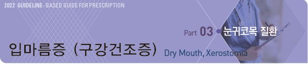
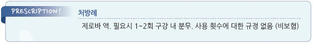

# 입안마름증 (구강건조증) Dry Mouth, Xerostomia

## 일반 사항

* 주관적 또는 객관적으로 증명되는 입마름 증상 또는 징후
* 주관적인 증상은 객관적인 침의 양과 일치하지 않을 수 있음
* 침의 항균 작용 : 항균 물질(lactoperoxidase, IgE Ab) 함유, 세척 작용
* 건조 증상 완화를 위한 sucrose 함유 사탕/음료 섭취가 오히려 증상을 악화시킬 수 있음
* 합병증 : 삼킴곤란, 수면 장애, 구취, 충치, 치주 질환, 침샘 결석, 구강 칸디다증

## 원인 또는 위험 인자

* 고령
* 흡연
* 코 막힘, 구강 호흡
* 치아 질환, 틀니 문제
* (소금기가 많은) 외식/간편식
* (향이 많은) 치약
* (알코올 함유) 구강 청정액
* 약물 : 항콜린제, α/β-차단제, 칼슘차단제, 이뇨제
* 만성 이하선염, 침샘관 폐쇄, 당뇨병, Sjögren syndrome, HIV, 방사선 치료

## 임상 양상

* 침의 양 감소, 점도 증가 - 씹기, 삼키기, 말하기 곤란
* 미각 변화, 음식 맛이 없음 - 거친 음식 섭취 시 구강 점막 손상 및 통증
* 구강 항균력 저하, 치아 우식증, 구강 칸디다증 유발

***

## Management

### 치료 방침

* 건조 예방
* 원인 질환 치료, 유발 약물 제거
* 치과 질환 치료 및 예방
* 분비 자극

## 비-약물 치료

#### 건조 예방

* 규칙적이고 충분한 수분 섭취 또는 자주 입을 축임

•지나친 수분 섭취(특히 야간)는 야뇨를 초래할 수 있음.

•잦은 수분 섭취는 구강의 mucus film을 줄여 증상을 악화시킬 수 있음

* 얼음 물고 있기 : 점막 손상 방지를 위하여 거즈에 싸서 적용
* 구강 자극 회피 : 커피, 술/알코올 함유 구강 청정제, 흡연/니코틴, 향이 강한 치약
* 당분 함유 음식, 산이 많은 음료 회피 : 콜라, 가당 주스, 에너지 드링크
* 입마름 악화 유발 약물 사용 회피 : 항콜린제, 1세대 항히스타민제
* 건조 환경 회피 : 제습기, 냉/난방 기기(특히 온풍기), 비행기
* 가습(특히 야간)
* 구강 호흡 방지를 위한 비강 호흡 관리

#### 분비 자극

* 무설탕 사탕/껌, 자일리톨 함유 사탕/껌
* 감귤, 레몬, 말린 과일 조각

## 약물 치료

* 특별한 치료 약제는 없음
* 다른 방법으로 해결되지 않는 환자에서 고려

#### 인공 침 (Artificial saliva)

* 성분 : carboxymethylcellulose, polyethylene glycol, sorbitol, electrolyte
* 입술 안쪽, 구강 점막, 혀, 경구개 등에 1일 1\~2회 도포(특히 취침 시) [제로바 액](../%EB%B9%84%EB%B3%B4%ED%97%98/)

#### 침 분비 촉진제 (Sialagogue)

* muscarinic agonist
* 부작용 : 발한, 홍조, 소화불량, 위장 팽만, 설사
* 주의/금기 : 위장관/요로 폐쇄, 천식, 갑상선항진증, 폐쇄성 심질환, 심장전도장애, 저혈압/고혈압, 파킨슨병, 녹내장
* 처음 1주일간 저용량으로 하루 한 번 투여 후 증량; 식전 30분 복용
* 반응이 늦게 나타나기 때문에 최소 3개월 시도 후 판정
* pilocarpine : cevimeline보다 반감기가 짧음; 5~~7.5 ㎎ tid~~qid \[살라겐] (보험주의)
* cevimeline : pilocarpine보다 발한/홍조 부작용이 적으나 GI 부작용 많음; 30 ㎎ tid

> **질병코드** K11.7 구강건조증

