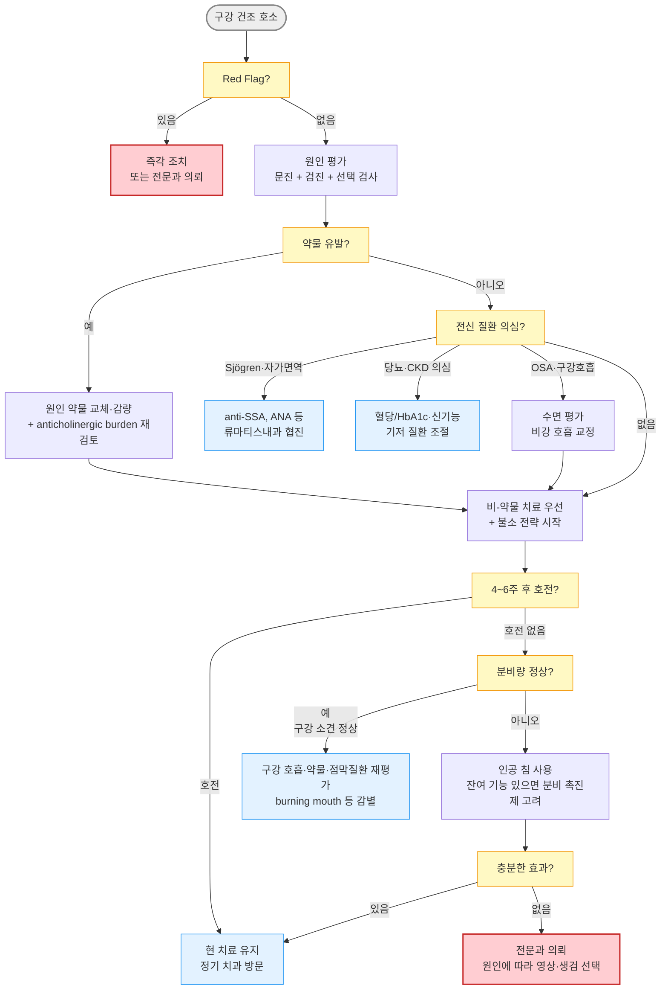

# 입안마름증 (구강건조증) Dry Mouth, Xerostomia

## <mark style="color:green;">일반 사항</mark>

* 구강건조증(xerostomia)은 입이 마르다고 느끼는 **주관적 증상**이며, 타액분비저하(hyposalivation)는 타액 분비량이 객관적으로 감소한 상태임
* 침의 기능 : 구강 점막 보호, 소화 효소(amylase, lipase) 함유, 항균 작용(lactoferrin, lysozyme, sIgA(분비형 면역글로불린 A), lactoperoxidase), 완충 작용, 발음 보조
* 유병률 : 성인의 약 10\~46%; 노인 및 다약제 복용자에서 높음
* 합병증 : 삼킴곤란, 수면 장애, 구취, 충치(특히 치경부 우식증), 치주 질환, 구강 칸디다증, 미각 장애, 영양 섭취 저하
* 두 핵심 개념 : xerostomia (입마름 호소) / hyposalivation (타액 분비 감소) - 증상이 있어도 분비량은 정상일 수 있고, 분비량이 줄어도 증상이 없을 수 있음
  * Xerostomia & 정상 분비량 → 구강 호흡, 타액 성상 변화, 약물, 불안, burning mouth syndrome 등 평가
  * Hyposalivation & 건조감 없음 → 무증상일 수 있으므로 구강 소견과 치과 합병증을 함께 평가

## <mark style="color:green;">원인 및 위험 인자</mark>

* 약물이 가장 흔한 원인임

#### <mark style="color:$primary;">전신 질환 및 상태</mark>

* 고령층 - 구강건조증이 흔하지만 정상 노화 자체보다는 다약제 복용, 만성질환, 탈수 등의 영향이 더 중요
* 당뇨병 - 다음(多飮), 자율신경병증, 만성 탈수
* Sjögren syndrome (원발성/속발성) - 건조증후군의 대표 원인
* 두경부 방사선 치료, 조혈모세포이식 후 만성 이식편대숙주질환(chronic GVHD)
* 만성 이하선염, 침샘관 폐쇄(결석, 협착)
* 탈수 상태 (수분 섭취 부족, 구토, 설사, 발열)
* 폐쇄성 수면무호흡증(OSA) - 구강 호흡 + CPAP 사용으로 건조 악화
* 파킨슨병 - 자율신경계 기능 이상, 항콜린제 사용
* 만성 신장병(CKD) - 요독증 관련 타액 성분 변화
* C형 간염 (Sjögren-like 건조 증후군 유발 가능)
* IgG4 연관 질환 (IgG4-related disease) - 침샘 실질 침윤·섬유화; 최근 인식 증가
* HIV/AIDS, HTLV-1 - 침샘 림프구 침윤 → Sjögren-like 건조 증후군 유발 가능; HIV 환자 구강 건조 시 면역 상태 평가 병행

#### <mark style="color:$primary;">약물</mark>

* 항콜린제 : oxybutynin, solifenacin, tolterodine, 삼환계 항우울제
* 항히스타민제 (1세대) : chlorpheniramine, hydroxyzine
* 항우울제 : SSRI, SNRI, mirtazapine
* 항정신병약 : quetiapine, haloperidol 등; clozapine은 구강건조도 가능하지만 타액과다·침흘림이 더 특징적으로 나타날 수 있음
* 항고혈압제 : α/β-차단제, 칼슘차단제, thiazide·furosemide 이뇨제
* 벤조디아제핀계 : alprazolam, lorazepam 등 - 중추성 기전으로 타액 분비 억제
* 기분안정제 : 리튬 - 직접 침샘 영향; 항부정맥제 disopyramide - 강한 항콜린 작용
* 기타 : isotretinoin, opioid, 항경련제; SGLT-2 억제제는 삼투성 이뇨·체액 감소에 따른 갈증과 건조감에 간접적으로 기여할 수 있음
* 면역관문억제제(Immune Checkpoint Inhibitors, ICI) - anti-PD-1/PD-L1, anti-CTLA-4 등; 면역 관련 부작용(irAE)으로 기존 Sjögren disease와 다른 침샘염·건조증이 갑자기 발생할 수 있음. 특히 투여 초기 수개월에 새로 발생한 심한 건조증은 종양내과와 신속히 협의


**Anticholinergic Burden (항콜린 부담)** : 개별 약물보다 복용 중인 항콜린성 약물의 누적 부담(cumulative burden)이 중요. 특히 노인에서는 한 가지 약물만으로는 기준에 미치지 않더라도 여러 약물의 조합으로 구강 건조가 발생하거나 악화됨. 증상이 지속될 경우 전체 약물 구성을 재검토하는 처방 최적화가 필요


#### <mark style="color:$primary;">생활 습관 및 환경</mark>

* 흡연, 전자담배(e-cigarette) - 전자담배 에어로졸도 구강 점막 건조·염증 유발, 흡연과 동일 주의 필요
* 과도한 음주
* 코 막힘으로 인한 구강 호흡
* 건조 환경 (에어컨, 온풍기, 겨울 난방, 장거리 비행)
* 알코올 함유 구강 청정액, 향이 강한 치약 사용
* 소금/나트륨 과다 식사, 카페인 과다 섭취

## <mark style="color:green;">임상 양상</mark>

* 구강 건조감, 목마름 - 식사 시 물을 함께 마셔야 삼킬 수 있음
* 씹기·삼키기·발음 어려움
* 미각 변화, 음식 맛 감소
* 구강 점막 : 광택 소실, 창백 또는 충혈, 균열; 혀 균열·유두 소실
* 야간에 갈증으로 수면 중 각성
* 구강 항균력 저하 → 치아 우식증(특히 치경부), 구강 칸디다증, 구취

### <mark style="color:$danger;">🚩 Red Flags!</mark>

<mark style="color:$danger;">**즉각 조치 또는 의뢰**</mark>

* 호흡곤란·협착음·침흘림·급성 음성 변화 또는 경부·구강저의 빠른 종창 → 기도 폐쇄·심경부 감염 가능
* 침도 삼키지 못하거나 분비물을 감당하지 못함, 반복 흡인 또는 중증 탈수 → 기도 보호 및 정맥 수액 필요
* 침샘 부위 종창과 함께 패혈증, 농양 또는 괴사성 근막염이 의심됨

<mark style="color:$warning;">**당일 또는 조기 의뢰**</mark>

* 급성 통증성 침샘 종창 + 발열·농성 배액·주변 발적 → 급성 세균성 침샘염; 면역 저하자에서는 당일 평가
* 단단하거나 고정된 무통성 침샘 종괴, 빠르게 커지는 종괴, 안면신경 마비·감각 이상 동반 → 침샘 종양 의심, 신속한 이비인후과 의뢰
* 편측 침샘 종창이 지속 또는 반복됨 → 결석·협착·만성 침샘염·종양 감별; Sjögren disease 환자의 지속성 이하선 종창에서는 림프종 고려
* 광범위 구강 점막 병변·칸디다증과 함께 심한 연하통, 경구 섭취 저하 또는 발열이 동반됨
* ICI 투여 후 새로 발생한 심한 구강건조·침샘 종창 → 종양내과와 신속히 협의

<mark style="color:$info;">**외래 추적 / 추가 평가 계획**</mark> <mark style="color:$info;">- 즉각 위험 낮으나 호전 없으면 의뢰</mark>

* 비-약물 치료 4\~6주 후에도 증상 호전 없음
* 원인 약물 교체·조정 후에도 지속되는 건조증
* 구강 건조 + 안구 건조 + 관절통·피로감·반복 침샘 종창 → Sjögren disease 평가
* 반복되는 충치·치주 질환 악화 → 치과 의뢰
* 당뇨 조절 불량과 동반된 구강 건조 지속 → 혈당 관리 강화

## <mark style="color:green;">진단</mark>

* 주로 임상적 진단; 원인 규명이 핵심
* 문진 : 건조감 지속 기간, 야간 음수 습관, 충치 빈도, 안구/질 건조 동반 여부, 약물력, 방사선 치료력

#### <mark style="color:$primary;">문진</mark>&#x20;

**구강건조 선별 질문**

* 다음 질문 중 하나 이상이 양성이면 약물력·구강검진 및 필요 시 타액 분비량을 추가 평가함. 문진만으로 타액분비저하를 확진하지 않음

1. 식사 시 물을 함께 마셔야 음식을 삼키기 편하다
2. 건조한 음식(빵, 과자 등)을 씹기 어렵다
3. 입이 건조하여 말하기 어렵다
4. 야간에 갈증으로 잠에서 깬다

#### <mark style="color:$primary;">구강 검진</mark>

* 구강 점막 광택 소실, 건조·균열, 혀 유두 소실 또는 균열
* 하악 설하 부위 거울 검사 : 소량 침 고임(pooling) 관찰
* Bedside signs of hyposalivation
  * 거울 점착 징후 (mirror sticking sign) : 구강 점막에 치경 거울을 대었을 때 달라붙음
  * 구순 건조 징후 (lipstick sign) : 윗 앞니에 립스틱이 묻어남 (여성 환자)
* 이하선·악하선 촉진 - 종창, 압통, 종괴 여부
* 치아 : 치경부 우식증, 다발성 우식증

#### <mark style="color:$primary;">타액 분비량 측정 (Sialometry)</mark>

* 비자극 전타액(Unstimulated Whole Saliva, UWS) : 5\~15분간 채취 → **≤ 0.1 ㎖/분이면 타액분비저하**
* 자극 전타액(Stimulated Whole Saliva) : 파라핀 왁스 저작 중 5분간 채취 → **≤ 0.7 ㎖/분이면 타액분비저하**
* 경계값은 측정 조건·일중 변동의 영향을 받으므로 필요 시 같은 조건에서 반복하고 증상·구강 소견과 함께 해석
* 1차 진료에서 정밀 측정이 어려우면 선별 질문과 bedside signs로 저분비 가능성을 평가하되, 필요 시 치과·구강내과에서 객관적 측정


**검사 전 처치** : 측정 최소 1\~2시간 전 금식, 흡연 금지, 양치 금지. 측정 직전 격렬한 운동·스트레스 회피. 이를 지키지 않으면 결과 오차가 커질 수 있음.


#### <mark style="color:$primary;">선택 검사 (원인 규명)</mark>

* 모든 환자에게 일률적으로 혈액검사를 시행하지 않고 병력·진찰에 따라 선택
* 혈당·HbA1c, 신기능·전해질 - 당뇨, 탈수, 신장질환 의심 시
* ANA, anti-SSA(Ro) ± anti-SSB(La), CBC, ESR/CRP, 면역글로불린 - Sjögren disease·자가면역질환 의심 시; anti-SSB 단독 양성은 2016 ACR/EULAR 점수 항목이 아님
* TSH, HCV·HIV 검사 - 임상 단서나 위험 인자가 있을 때
* IgG4 - IgG4 연관 질환이 의심될 때
* 타액선 초음파 - 종괴·결석·협착·반복 종창 평가 및 Sjögren disease의 보조 평가에 유용하나 2016 ACR/EULAR 분류 기준의 정식 항목은 아님
* 타액선 신티그래피·CT/MRI·소타액선 생검 - 의심 원인에 따라 전문과에서 선택


**Sjögren disease 분류 기준** (2016 ACR/EULAR, 간략 요약)\
⓵ anti-SSA(Ro) 양성 (3점), ⓶ 소구강침샘 생검에서 focal lymphocytic sialadenitis 및 focus score ≥ 1/4 ㎟ (3점), ⓷ Ocular Staining Score ≥ 5 또는 van Bijsterveld score ≥ 4 (1점), ⓸ Schirmer test ≤ 5 ㎜/5분 (1점), ⓹ unstimulated whole salivary flow ≤ 0.1 ㎖/분 (1점)\
→ 적용 대상과 제외조건을 확인한 뒤 총 4점 이상이면 **분류 기준**을 충족함. 이는 임상 진단을 대체하지 않으며, 두경부 방사선 치료력, 활동성 HCV 감염, 진행성 HIV, sarcoidosis, amyloidosis, GVHD, IgG4 연관 질환 등에서는 기준을 그대로 적용하지 않음. 구강 건조와 함께 안구 건조, 피로, 관절통 또는 반복 침샘 종창이 동반되면 류마티스내과 의뢰.\
**Schirmer test 주의** : 비특이적이며 위양성/위음성이 있어 단독으로 진단 근거로 삼기 어려움. 안과 협진 시 안구 표면 염색 점수(Ocular Staining Score, OSS)가 더 정밀한 안구 건조 평가 지표임


### <mark style="color:orange;">감별 진단</mark>

* 원인 범주와 잔여 침샘 기능에 따라 치료 방향을 결정

<table><thead><tr><th width="127">원인 범주</th><th width="210">주요 단서</th><th width="185">핵심 평가</th><th>우선 조치</th></tr></thead><tbody><tr><td>약물 유발</td><td>다약제 복용; 신규 약물 투여 후 증상 시작; 항콜린 burden↑</td><td>처방·OTC 약물 검토</td><td>가능하면 원인 약물 교체·감량; 전체 약물 최적화</td></tr><tr><td>자가면역 (Sjögren)</td><td>안구 건조 + 관절통 + 피로감; 반복 이하선 종창</td><td>anti-SSA, ANA 등 선택 검사</td><td>류마티스내과 의뢰; 잔여 침샘 기능이 있으면 pilocarpine 고려</td></tr><tr><td>대사·전신</td><td>다음·다뇨 (당뇨); 탈수; CKD</td><td>혈당/HbA1c; 신기능·전해질</td><td>기저 질환·체액 상태 교정</td></tr><tr><td>폐쇄·구조</td><td>식사 중 통증·종창 (결석); 편측 지속 종창 (종양 등)</td><td>타액선 초음파 ± CT/MRI</td><td>영상 검사; 이비인후과·구강악안면외과 의뢰</td></tr><tr><td>분비량 정상인 구강건조</td><td>구강 소견·분비량 정상</td><td>구강 호흡, 약물, 타액 성상, 점막질환·burning mouth 재평가</td><td>원인별 치료; 필요 시 구강내과·정신건강 평가</td></tr><tr><td>환경·구강 호흡</td><td>코막힘·코골이; 건조 환경; OSA 의심</td><td>비강 검진; 수면 평가</td><td>비강 호흡 교정; 가습 및 CPAP 최적화</td></tr></tbody></table>

***


```mermaid
graph TD
    A([구강 건조 호소]) --> B[Red Flag?]
    B -- 있음 --> C[즉각 조치<br/>또는 전문과 의뢰]
    B -- 없음 --> D[원인 평가<br/>문진 + 검진 + 선택 검사]
    D --> E[약물 유발?]
    E -- 예 --> F[원인 약물 교체·감량<br/>+ anticholinergic burden 재검토]
    E -- 아니오 --> G[전신 질환 의심?]
    G -- Sjögren·자가면역 --> H[anti-SSA, ANA 등<br/>류마티스내과 협진]
    G -- 당뇨·CKD 의심 --> I[혈당/HbA1c·신기능<br/>기저 질환 조절]
    G -- OSA·구강호흡 --> P[수면 평가<br/>비강 호흡 교정]
    G -- 없음 --> J[비-약물 치료 우선<br/>+ 불소 전략 시작]
    F --> J
    P --> J
    J --> K[4~6주 후 호전?]
    K -- 호전 --> M[현 치료 유지<br/>정기 치과 방문]
    K -- 호전 없음 --> Q[분비량 정상?]
    Q -- 예<br/>구강 소견 정상 --> R[구강 호흡·약물·점막질환 재평가<br/>burning mouth 등 감별]
    Q -- 아니오 --> L[인공 침 사용<br/>잔여 기능 있으면 분비 촉진제 고려]
    L --> N[충분한 효과?]
    N -- 있음 --> M
    N -- 없음 --> O[전문과 의뢰<br/>원인에 따라 영상·생검 선택]

    style A fill:#eeeeee,stroke:#888888,stroke-width:2px
    classDef yellow fill:#fff9c4,stroke:#f39c12
    class B,E,G,K,Q,N yellow
    classDef sky fill:#e3f2ff,stroke:#2196f3
    class H,I,R,M sky
    style C fill:#ffcdd2,stroke:#c62828,stroke-width:2px
    style O fill:#ffcdd2,stroke:#c62828,stroke-width:2px
```

<p align="center"><strong>구강건조증 진단 및 치료 알고리듬</strong></p>

<p align="center"><em><mark style="color:$info;">Ref. Price EJ et al., Rheumatology 2025; Hong C et al., Support Care Cancer 2024</mark></em></p>

***

## <mark style="background-color:$warning;">Management</mark>

### <mark style="color:orange;">치료  Step</mark>

1. 원인 질환 치료 및 유발 약물 제거·교체&#x20;
2. 비-약물 치료 :  건조 예방 및 구강 습윤 유지 + 침샘 분비 자극 + 구강 위생
3. 인공 침 사용&#x20;
4. 침 분비 촉진제 &#x20;
5. 치과 질환(우식증, 치주 질환) 예방 및 치료

* Sjögren syndrome 등 전신 질환 동반 시 류마티스내과 협진

## <mark style="color:green;">비-약물 치료 & 예방</mark>

#### <mark style="color:$primary;">건조 예방</mark>

* 소량의 물을 자주 마시거나 입을 축임 - 단순 수분 공급만으로 근본적 해결은 어려우나 증상 완화에는 도움
  * 지나친 수분 섭취(특히 야간)는 야뇨를 초래할 수 있음
* 구강 자극 회피 : 과도한 카페인, 술, 알코올 함유 구강 청정제, 흡연/니코틴, 자극적인 치약
* 당분 함유 음식, 산성 음료 회피 : 콜라, 가당 주스, 에너지 드링크
* 입마름 악화 유발 약물 회피 : 항콜린제, 1세대 항히스타민제
* 건조 환경 회피 : 냉/난방 기기(특히 온풍기), 에어컨 장시간 사용, 장거리 비행
* 가습기 사용 (특히 야간 수면 중)
* 구강 호흡 방지를 위한 비강 호흡 관리

#### <mark style="color:$primary;">분비 자극</mark>

* 무설탕 껌 또는 자일리톨 함유 사탕/껌 - 저작 자극으로 타액 분비 촉진, 우식증 예방 부가 효과
  * 자일리톨은 설탕을 대체하는 용도로 선택하며 특정 1일 용량을 확정적인 우식 예방 기준으로 제시하지 않음
* 산성 사탕·감귤·레몬은 타액을 일시적으로 늘릴 수 있으나 치아 부식 위험이 있어 치아가 있는 환자에서는 routine으로 권하지 않음


**구강건조증은 치과 고위험 상태임**\
타액분비저하가 지속되면 치경부·치근 우식증과 구강 칸디다증이 빠르게 발생할 수 있음. 특히 두경부 방사선 치료 후·Sjögren disease·다발성 우식증 환자는 증상 치료와 동시에 불소 전략과 선제적 치과 관리를 시작


#### <mark style="color:$primary;">구강 위생 및 우식증 예방 (합병증 예방)</mark>

* 불소 치약 사용 필수
  * 일반 환자 : 불소 1,000\~1,500 ppm 치약 (시판 불소 치약)
  * 고위험군 (방사선 치료 후·Sjögren·다발성 우식증) : 고농도 불소 치약 또는 젤(예: 5,000 ppm)을 치과 처방·지도에 따라 사용
  * 불소 젤과 맞춤 트레이의 농도·적용 시간은 제품과 치과 처방에 따르며 일률적으로 20분 적용하지 않음
  * 불소 바니시(fluoride varnish) : 치과에서 3\~6개월마다 적용
* 알코올 무함유 구강 청정액 선택
* 중탄산나트륨(Sodium bicarbonate) 세척 : 필요 시 0.5% 용액으로 헹구어 점막 불편감과 구강 내 산성도를 완화할 수 있으나 불소 치료를 대체하지 않음
* CPP-ACP (Casein Phosphopeptide-Amorphous Calcium Phosphate) 페이스트 : 근거가 제한적인 재광화 보조제이므로 치과 판단에 따라 사용; 우유 단백 알레르기 환자에서는 사용하지 않음
* 틀니 착용자 : 야간에는 틀니를 제거하여 세척·관리하고 보관법은 틀니 재질과 제품 지침에 따름
* Chlorhexidine 구강 청결제 : 구강건조증·우식증·반복 칸디다증의 routine 예방제로 사용하지 않음. 치은염·치주질환 등 명확한 적응증이 있을 때 치과 지시에 따라 단기간 사용; 장기 사용 시 치아 착색·미각 변화 가능
* 6개월마다 정기 치과 방문 권고 (고위험군은 3개월마다)

#### <mark style="color:$primary;">방사선 치료 후 건조증 (Radiation-induced Xerostomia)</mark>

* 두경부 방사선 치료 시 타액 분비는 치료 첫 주부터 감소할 수 있으며 치료 기간과 종료 후 수개월 동안 더 악화될 수 있음; 회복 정도는 조사 범위·선량에 따라 다르고 영구적일 수 있음
* IMRT (세기조절방사선치료) 로 치료 계획 시 침샘 노출 선량 최소화로 예방 가능
* Amifostine : 현대적 방사선 치료에서 예방 효과에 대한 근거가 불충분하고 저혈압·구역 등의 부작용이 있어 routine 사용을 권고하기 어려움
* 방사선 치료 후 건조증은 수년간 지속될 수 있음 → 잔여 침샘 기능이 있으면 pilocarpine 고려(국내 허가 적응증)

## <mark style="color:green;">약물 치료</mark>

* 비-약물 치료로 충분하지 않을 때 고려

### <mark style="color:orange;">인공 침 (Artificial Saliva)</mark>

* 침과 유사한 점도·윤활 성분으로 구성된 국소 증상 완화제
* 성분 : carboxymethylcellulose, polyethylene glycol, sorbitol, 전해질(Ca, K, Na, Mg, Cl)
* 일부 제품은 lactoferrin, lysozyme, glucose oxidase 등 항균 효소 함유
* 증상이 있을 때 구강 점막·혀·입천장에 고루 사용하며, 취침 전 사용은 야간 증상 완화에 도움
* <mark style="color:blue;">\[제로바액 40 ㎖]</mark> : 구강이나 인후에 1\~2초 동안 직접 분무하며, 습기를 유지하는 데 필요한 만큼 또는 의사의 지시에 따라 사용
* 스프레이형, 젤형, 구강 세정형 등 다양한 제형 선택 가능 - 알코올 무함유 제품 권장
* pH 확인 권장 : 일부 인공 침 제품은 보존 목적으로 산성 pH를 띨 수 있음 → 치아 부식 방지를 위해 중성(pH 7.0 근처) 제품 선택 권고

### <mark style="color:orange;">침 분비 촉진제 (Sialagogue)</mark>

* 작용 기전 : muscarinic receptor agonist → 주로 M3 수용체 매개 침샘 분비 자극
* 잔여 침샘 기능이 있는 환자에서 비-약물 치료 및 인공 침으로 불충분할 때 고려
* 국내 pilocarpine 허가 적응증 : Sjögren syndrome 환자의 구강·안구 건조증, 두부암 또는 경부암 방사선요법 후 타액선 기능저하로 인한 구강건조증
* 공통 부작용 : 발한, 홍조, 소화불량, 위장 팽만, 설사, 빈뇨, 눈물 분비 증가
* 금기 : 조절되지 않는 기관지 천식, 약물 과민증, 축동이 바람직하지 않은 급성 홍채염·폐쇄각녹내장 등
* 주의 : 유의한 심혈관질환, 조절된 천식·만성기관지염·COPD, 담석·담도질환, 신결석, 인지·정신질환, 중등도 간장애, β-차단제 병용 등
* 발한 등 부작용을 줄이기 위해 저용량·저빈도로 시작해 증량할 수 있으나, 이는 내약성 개선 전략이며 제품별 허가 용법과 구분하여 적용

#### <mark style="color:$primary;">pilocarpine</mark>

* 비선택적 muscarinic agonist; 반감기가 짧아 하루 여러 번 복용 필요 <mark style="color:blue;">\[살라겐정 5 ㎎]</mark>
* 두부암·경부암 방사선 치료 후 : 초기 5 ㎎ tid; 반응·내약성에 따라 15\~30 ㎎/일(1회 최대 10 ㎎). 유익한 반응 판정을 위해 최소 12주 유지할 수 있음
* Sjögren syndrome : 5 ㎎ qid, 6주간 투여 후 반응 평가
* 발한 부작용이 심하면 용량·복용 횟수 조정 또는 중단을 검토하며, 과도한 발한으로 충분한 수분 섭취가 어려우면 탈수 위험 때문에 진료
* 야간 시야 흐림·암순응 저하가 생길 수 있어 야간 운전과 어두운 곳에서의 위험 작업에 주의
* 건강보험 급여 품목이며 세부 인정 기준은 처방 시점의 기준 확인

#### <mark style="color:$primary;">cevimeline</mark>

* M1·M3 수용체에 상대적으로 높은 친화성을 가지며 일부 자료에서 pilocarpine보다 발한으로 인한 중단이 적었으나 직접 비교 근거는 제한적
* 30 ㎎ tid
* **2026년 9월 현재 국내 허가·유통 품목이 확인되지 않음**; 국내 처방례에 포함하지 않음

### <mark style="color:orange;">기타</mark>

* rebamipide : 구강 건조 증상 개선을 보고한 소규모 연구가 있으나 국내 구강건조증 적응증이 없는 허가 외 사용이고 주요 지침의 표준 치료가 아니므로 routine으로 권고하지 않음

***

### <mark style="color:red;">질병코드</mark>

K11.7 침분비의 장애 Disturbances of salivary secretion

***

## <mark style="color:purple;">처방례</mark>

> **처방례 1. 경증 - 인공 침**
>
> ```
> 제로바액  40 ㎖/병  구강 또는 인후에 1~2초간 직접 분무
>                       구강 내 습기 유지에 필요한 만큼 사용
> ```
>
> _✽ 비-약물 치료(소량씩 수분 섭취, 가습, 무설탕·비산성 껌, 구강 자극 회피)를 함께 시행. 취침 전 사용은 야간 증상 완화에 도움이 될 수 있음. 4\~6주 후 재평가._

> **처방례 2. 두경부 방사선 치료 후 - pilocarpine 추가**
>
> ```
> 제로바액  40 ㎖/병  필요 시 1~2초간 구강 또는 인후에 직접 분무
> 살라겐정  5 ㎎  1일 3회
> ```
>
> _✽ 반응·내약성에 따라 pilocarpine을 15\~30 ㎎/일 범위에서 조절하되 1회 10 ㎎을 넘지 않음. 유익한 반응을 판정하려면 최소 12주 유지가 필요할 수 있음. 발한·홍조·소화불량과 야간 시야 흐림을 확인._

> **처방례 3. Sjögren syndrome 동반 - 류마티스내과 협진 후**
>
> ```
> 살라겐정  5 ㎎  1일 4회
> 제로바액  40 ㎖/병  필요 시 1~2초간 구강 또는 인후에 직접 분무
> ```
>
> _✽ 잔여 침샘 기능이 있는 유의한 구강 건조에서 pilocarpine을 고려하며 6주 후 반응과 내약성을 평가. 전신 치료는 장기 침범과 질병 활성도에 따라 류마티스내과에서 결정하며, hydroxychloroquine을 구강건조 자체의 치료제로 routine 사용하지 않음. 안구 건조는 안과 협진 및 별도 치료 필요._

> **처방례 4. 약물 유발성 - 원인 약물 교체 불가 시**
>
> ```
> 제로바액  40 ㎖/병  필요 시 1~2초간 구강 또는 인후에 직접 분무
> (무설탕·비산성 껌: 필요 시 저작)
> ```
>
> _✽ 항콜린제, 항정신병약, 항우울제 등 교체가 어려운 경우 인공 침과 무설탕·비산성 껌으로 증상 관리. 약물 유발성 구강건조에 대한 pilocarpine 사용은 국내 허가 적응증이 아니므로 routine으로 추가하지 않음. 우식 위험에 따라 3\~6개월 간격으로 치과 추적._

***

### <mark style="color:$success;">핵심 복약 지도</mark>

> **인공 침 (제로바액 등) 사용법**
>
> 1. 제로바액은 구강이나 인후에 **1\~2초 동안 직접 분무**하고, 건조할 때 필요한 만큼 사용하십시오.
> 2. 취침 전에 사용하면 야간 건조 증상 완화에 도움이 될 수 있습니다.
> 3. 실제 침을 대체하는 것이 아니라 증상을 완화하는 보조제입니다 - 원인 관리를 병행해야 합니다.
> 4. 알코올 함유 구강 청정액과 병용 시 건조가 더 심해질 수 있으니 피하십시오.

> **고농도 불소 치약 (5,000 ppm) 사용 지침** (치과 처방 시)
>
> 1. 일반 치약 대신 처방된 양과 횟수대로 이를 닦고 충분히 뱉으십시오.
> 2. 사용 후 헹굼과 음식·음료 제한 시간은 제품 허가사항과 치과 지시에 따르십시오.
> 3. 삼키지 마십시오. 고농도 불소 제품은 어린이의 손이 닿지 않는 곳에 보관하십시오.

> **피로카르핀 (살라겐) 복약 지도**
>
> 1. 적응증에 따라 처방된 횟수대로 일정한 시간에 복용하십시오. 임의로 횟수나 용량을 늘리지 마십시오.
> 2. **땀이 많이 나거나 얼굴이 달아오르는 것**은 흔한 부작용입니다. 적절히 수분을 보충하되, 땀이 지나치게 나서 충분히 마시기 어렵거나 어지러우면 담당 의사에게 알리십시오.
> 3. 소화불량, 설사, 빈뇨가 생길 수 있습니다. 심하면 담당 의사에게 알려주십시오.
> 4. 야간 시야가 흐려질 수 있으므로 밤에 운전하거나 어두운 곳에서 위험한 작업을 할 때 주의하십시오.
> 5. 효과 평가 시점은 원인에 따라 다릅니다. Sjögren syndrome에서는 통상 6주, 방사선 치료 후 건조증에서는 최소 12주가 필요할 수 있습니다.
> 6. 다음의 경우에는 복용을 중단하고 즉시 진료받으십시오 - 호흡 곤란, 심한 두근거림·흉통, 실신 또는 심한 발한·어지러움

> **언제 다시 병원을 방문해야 하나요?**
>
> * 비-약물 치료로 4\~6주 이내에 호전이 없는 경우
> * 이하선(귀 앞) 또는 악하선(턱 아래) 부위에 갑자기 통증이나 종창이 생긴 경우 - 조기 내원
> * 구강 점막에 흰 반점이나 하얀 막이 생긴 경우 (구강 칸디다증 의심)
> * 충치나 잇몸 질환이 반복·악화되는 경우 - 치과 방문 병행

***

### <mark style="color:blue;">환자 안내서</mark>


**구강건조증 - 입이 마르다고 느끼는 증상입니다**

실제로 침이 줄어든 경우도 있지만 침의 양이 정상이어도 구강호흡, 약물, 침 성분 변화 등으로 입마름을 느낄 수 있습니다. 침은 단순히 입을 촉촉하게 하는 것 이상으로 음식 소화, 충치 예방, 구강 세균 억제 등 중요한 역할을 합니다.


#### <mark style="color:$primary;">왜 입이 마르나요?</mark>

* 가장 흔한 원인은 **복용 중인 약물**입니다 - 알레르기 약, 방광약, 혈압약, 정신과 약 등 여러 약물이 침 분비를 줄일 수 있습니다.
* 고령층에서 흔하지만 **나이 자체보다는 복용 약물, 만성질환, 탈수** 등의 영향이 더 중요합니다.
* **당뇨병, 쇼그렌증후군** 등 전신 질환이 원인이 될 수 있습니다.
* **코막힘으로 입으로 숨쉬는 습관**, 건조한 환경, 흡연, 음주도 증상을 악화시킵니다.

#### <mark style="color:$primary;">일상생활에서 어떻게 관리하나요?</mark>

* **물을 조금씩 자주 마시십시오** - 한꺼번에 많이 마시는 것보다 규칙적으로 소량씩 입을 축이는 것이 효과적입니다.
* **무설탕·비산성 껌이나 자일리톨 제품**을 사용하면 남아 있는 침 분비가 자극됩니다.
* **가습기를 사용하십시오** - 특히 잠자리에서 야간 건조를 줄이는 데 도움이 됩니다.
* 커피 등 카페인의 과다 섭취, 술, 담배는 입 마름을 악화시킬 수 있으므로 **줄이거나 피하십시오**.
* **알코올이 들어있는 구강 청정액은 피하십시오** - 오히려 건조를 심하게 합니다.
* 설탕이 많은 음식과 산성 음료(콜라, 주스)는 충치를 유발하므로 **조심하십시오**.
* 취침 전 처방된 구강 보습제(인공 침)를 사용하면 야간 건조를 줄일 수 있습니다.

#### <mark style="color:$primary;">약은 어떻게 써야 하나요?</mark>

* 인공 침(제로바액 등)은 건조할 때 사용하십시오. 제로바액은 입이나 목에 1\~2초 동안 직접 뿌립니다. 실제 침을 완전히 대체하는 것이 아니라 증상을 완화하는 보조제입니다.
* 피로카르핀(살라겐)은 남아 있는 침샘 기능을 자극하는 약입니다. 처방된 횟수대로 복용하십시오. 땀이 나고 얼굴이 달아오를 수 있으며, 심한 발한·어지러움이나 호흡 곤란이 생기면 진료받으십시오. 야간 시야가 흐려질 수 있어 밤 운전에 주의해야 합니다.

#### <mark style="color:$primary;">이럴 때는 병원을 방문하세요</mark>

* 호흡이 어렵거나 침도 삼키기 어렵고 목·턱밑이 빠르게 부으면 **즉시 응급실로 가십시오**.
* 귀 앞이나 턱 아래 침샘 부위가 **갑자기 붓고 아프면서 열이 나면** - 침샘 감염이나 결석일 수 있으므로 당일 진료받으십시오.
* 입 안에 **흰 반점이나 하얀 막**이 생기면 - 구강 칸디다증(곰팡이 감염)일 수 있습니다.
* 입 마름과 함께 **안구 건조, 관절통, 피로감 또는 반복되는 침샘 종창**이 동반되면 - Sjögren disease 검사가 필요합니다.
