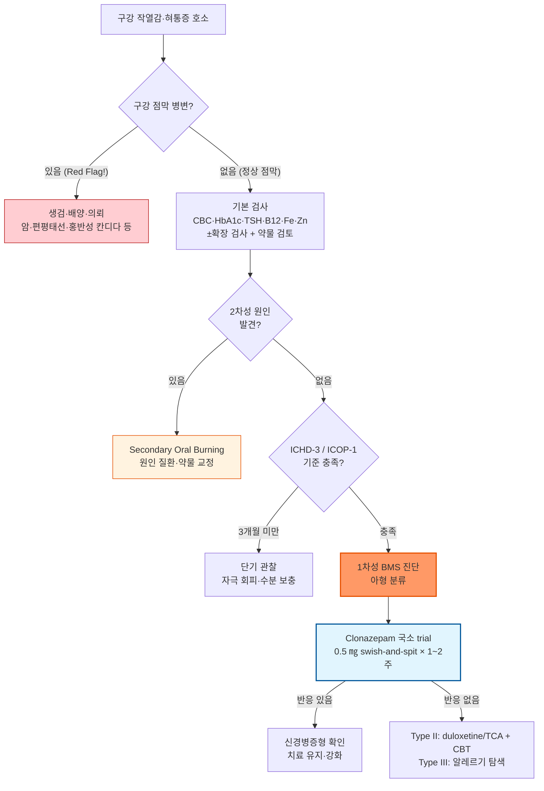

# 혀 통증 Glossodynia, Burning Mouth Syndrome

## <mark style="color:green;">일반 사항</mark>

* 구강 점막의 명확한 기질적 병변 없이 발생하는 만성 구강 내 작열감·통증
* 다른 이름 : glossodynia(혀통증에 국한), stomatodynia, oral dysaesthesia
* 정의 (ICHD-3 2018 / ICOP-1 2020) : 구강 점막에서 매일 2시간 이상, 3개월 이상 지속되며 임상적으로 점막이 정상인 작열감; 혀뿐 아니라 입술·구개·잇몸 등 구강 점막 어디서든 발생 가능
* 증상 : 혀(특히 혀 끝·혀 앞쪽 2/3)에 가장 흔하며, 구개·잇몸·입술로 확산되기도 함; 미각 변화(쓴맛·금속 맛), 입마름 동반 多
* 유병률 : 일반 인구의 0.7\~4.6%; 중년 이후 여성(폐경 전후)에서 현저히 높음(여성 : 남성 = 7 : 1)
* 경과 : 자연 회복 약 1/3, 장기 지속 약 1/3, 악화 약 1/3; 단기 소실 후 재발도 흔함

## <mark style="color:green;">원인 및 분류</mark>

#### <mark style="color:$primary;">1차성(원발성) BMS</mark>&#x20;

* 원인: 대부분 불명  (기질적 원인 없음); 소섬유 신경병증·중추 감작·도파민 기능 변화로 설명
* 아형 : 하루 중 증상 변동 패턴을 기준으로 분류
  * Type I (\~35%) : 기상 시 무증상 → 하루 중 점진적 악화; 추정 기전 - 말초 소섬유 신경병증
  * Type II (\~55%) : 종일 지속, 수면 장애 동반; 중추 감작, 심리적 요소
  * Type III (\~10%) : 간헐적, 증상 없는 날 있음; 접촉 알레르기, 유발 물질

#### <mark style="color:$primary;">2차성(속발성, Secondary Oral Burning)</mark>&#x20;

* 구강 국소·전신 질환, 약물에 의한 구강 작열감
*

## <mark style="color:green;">원인</mark>

*
*

**2차성 BMS 관련 인자**

* 내분비 : 폐경(에스트로겐 감소), 당뇨병, 갑상선 기능저하증
* 영양 결핍 : Vit B군(B1·B2·B6·B12), 엽산, 아연, 철분
* 구강 질환 : 구강 칸디다증, 입마름증(xerostomia), 지도상 혀(geographic tongue), 구강 편평태선
* **GERD / LPR (laryngopharyngeal reflux)** - 위산·pepsin이 구강 점막·혀 신경을 직접 자극; 역류 증상 없는 silent LPR도 포함
* **구강 이상기능 (oral parafunction)** - 혀를 구개에 밀착·비비는 습관(tongue thrusting), 이갈이(bruxism), 혀를 치아에 대고 빠는 음압 습관(tongue sucking/negative pressure); 기계적 자극으로 신경 과민화
* **Post-COVID dysesthesia** - COVID-19 감염 후 구강 감각 이상; long-COVID 신경계 증상의 일환으로 최근 빈도 증가; 드물게 백신 접종 후 보고 사례도 존재 (병력 청취 시 참고)
* 신경병증성 : 대상포진 후 신경통(post-herpetic neuralgia), 삼차신경병증
* 접촉 자극 : 틀니·치과재료(아말감), 치약(SLS 계면활성제), 구강 세정제(알코올), 맵고 뜨거운 음식
* 약물 : ACEI(가장 흔함), 항히스타민제, 항콜린제, 이뇨제; 흡연/니코틴
* 정신·심리 : 불안, 우울, 신체화장애, 암 공포증(cancerphobia)
* 기타 : 방사선 치료 후, 알레르기

## <mark style="color:green;">임상 양상</mark>

* 구강 내 작열감, 따끔거림, 화끈거림 - 혀 끝이 가장 흔하고 입천장·입술·잇몸으로 확산
* 미각 변화 : 쓴맛, 금속 맛, 미각 감소
* 입마름 호소 (실제 타액 분비량은 정상인 경우 多)
* **식사 중 일시적 호전이 특징적** - 미각 자극이 통증 억제; BMS 변별에 유용
* 심리적 동반 : 불안·우울 동반 빈도 높음; 수면 장애 (Type II)
* 구강 점막 : 육안 및 촉진상 정상이어야 함 (병변 확인 시 2차성 원인 탐색)


**⚠️ 입마름 호소 ≠ 타액 감소**

BMS 환자의 상당수가 심한 입마름(subjective xerostomia)을 호소하지만, 실제 타액 분비량(sialometry)은 정상인 경우가 많습니다.\
→ 타액 검사 정상이라는 이유만으로 구강 건조를 배제해서는 안 됩니다.\
→ "주관적 구강 건조 + 객관적 타액 정상"은 BMS에서 흔한 조합입니다.


### <mark style="color:$danger;">🚩 Red Flags!</mark>

<mark style="color:$danger;">**즉각 조치 또는 의뢰**</mark>

* 구강 내 **궤양·백반·홍반 병변**이 2주 이상 지속 - 구강암 배제 필요
* 연하 곤란·연하통 동반 - 인후·식도 악성 병변 가능성
* 급격한 체중 감소 + 구강 증상 - 전신 악성 질환 의심
* **편측성 통증 + 안면 감각 저하·이상 동반** - 삼차신경병증(trigeminal neuropathy) 또는 종양 가능성; MRI 필요\
  ✽발진 없는 대상포진(Zoster sine herpete)도 감각 이상 동반 편측 통증으로 발현 가능

<mark style="color:$warning;">**당일 또는 조기 의뢰**</mark>

* 구강 점막 병변(수포, 미란, 태선양 변화) 동반 - 구강 편평태선, 점막 천포창 감별
* 구강 칸디다증 의심 (백태, 홍반) - 구강내과 또는 이비인후과 의뢰
* 신경학적 이상(안면 감각 저하, 연하 장애) 동반 - 뇌신경 병변 배제

<mark style="color:$info;">**외래 추적 / 추가 평가 계획**</mark> <mark style="color:$info;">- 즉각 위험 낮으나 호전 없으면 의뢰</mark>

* 3개월 이상 치료에도 증상 호전 없는 경우 - 구강내과 또는 신경과 의뢰
* 중등도 이상의 불안·우울 동반 - 정신건강의학과 협진 고려
* ACEI 복용 중 증상 발생 - 약물 변경 후 4\~6주 관찰

## <mark style="color:green;">진단</mark>

### <mark style="color:orange;">진단 기준 \[ICHD-3]</mark>

① 구강의 통증\
② 구강 점막 표면의 작열감\
③ 매일, 하루 ＞2시간, ＞3개월 동안 발생\
④ 감각 검사 포함 구강 점막이 임상적으로 정상\
⑤ 다른 ICHD-3 진단 기준에 해당되지 않음


**진단은 배제 진단(diagnosis of exclusion)**

2차성 원인을 체계적으로 배제한 후 1차성 BMS를 진단합니다. 기본 검사를 먼저 시행하고, 의심 소견이 있을 때만 확장 검사를 추가합니다.\
✽ICOP-1(2020)에서는 2차성을 "Secondary Oral Burning"으로 명명하여 1차성 BMS와 명확히 구분합니다.


### <mark style="color:orange;">검사</mark>

**기본 검사 (모든 환자)**

* 구강 시진 - 점막 색상·병변·칸디다 소견, 틀니 적합도
* 병력 - 하루 변동 패턴(아형 분류), 식사 중 호전 여부, 약물력(특히 ACEI - **복용 시작 시점과 통증 발생의 선후 관계 확인**), 틀니·치과 치료력, COVID-19 감염·백신 접종력
* 혈액 검사 : CBC, FBS(HbA1c), TSH, Vit B12, 엽산, 아연, ferritin

**확장 검사 (의심 소견 있을 때)**

* ANA, anti-SSA/SSB - Sjögren 증후군 의심 시
* Sialometry - 객관적 타액 감소 확인 필요 시
* 구강 진균 배양 - 반복적 칸디다 의심 시
* 알레르기 패치 검사 - Type III(간헐형), 치과 재료 알레르기 의심 시
* 내시경 / 위산 pH 검사 - GERD/LPR 의심 시

### <mark style="color:orange;">Clonazepam 진단적 trial</mark>


**Clonazepam 국소 trial = 진단 + 치료 동시 시도**

0.5 ㎎ swish-and-spit 1\~2주 시행 후:

* **반응 있음** → 신경병증성 기전(말초 또는 중추) 가능성 ↑; 치료 유지
* **반응 없음** → 다른 원인(2차성, 심리적, 알레르기) 재검토; 치료 방향 전환


### <mark style="color:orange;">감별 진단</mark>

**Quick 3-way 감별 (임상 현장용)**

<table><thead><tr><th width="155">구분</th><th width="195">BMS</th><th width="175">Xerostomia</th><th>삼차신경통</th></tr></thead><tbody><tr><td>통증 성격</td><td>타는 듯 지속</td><td>건조·따끔</td><td>전기 쇼크형 발작</td></tr><tr><td>식사 영향</td><td>먹으면 일시 호전 ✔</td><td>먹기 불편(건조)</td><td>씹을 때 유발 가능</td></tr><tr><td>하루 변동</td><td>오후 악화(Type I)</td><td>비교적 일정</td><td>갑작스러운 발작</td></tr><tr><td>타액 분비</td><td>대부분 정상</td><td>객관적으로 감소</td><td>정상</td></tr><tr><td>구강 소견</td><td>정상 (핵심)</td><td>점막 건조·끈적</td><td>정상</td></tr></tbody></table>

**추가 감별**

<table><thead><tr><th width="210">질환</th><th>감별 포인트</th></tr></thead><tbody><tr><td>구강 칸디다증<br>(위막성)</td><td>백태·홍반 병변, 도말 균사 확인</td></tr><tr><td>구강 칸디다증<br>(홍반성) ⚠️</td><td><strong>백태 없이 점막만 붉게 변함</strong> - BMS로 오인 多; 위막이 없어도 도말 검사 반드시 시행</td></tr><tr><td>구강 편평태선</td><td>망상·미란 병변, Wickham 선조</td></tr><tr><td>접촉 구내염</td><td>치과 재료·치약 노출 후 발생, 제거 시 호전</td></tr><tr><td>Sjögren 증후군</td><td>안구건조, 타액선 종대, anti-SSA/SSB 양성</td></tr><tr><td>비정형 안면통</td><td>구강에 국한되지 않는 광범위 안면통; BMS와 중복 가능</td></tr><tr><td>삼차신경병증<br>(Trigeminal Neuropathy)</td><td>편측 지속통 + 감각 저하; 발작성 TN(삼차신경통)과 달리 지속성; BMS와 혼동 주의</td></tr></tbody></table>

***



<p align="center"><strong>혀통증·BMS 진단 및 치료 알고리듬</strong></p>

<p align="center"><em><mark style="color:$info;">Ref. ICHD-3 (2018); Scala et al. Med Oral Patol Oral Cir Bucal 2003; Mínguez-Sanz et al. J Oral Pathol Med 2011</mark></em></p>

***

## <mark style="background-color:yellow;">Management</mark>

### <mark style="color:orange;">치료 방침</mark>

* 2차성 BMS : 원인 질환 치료 또는 유발 약물 변경이 우선; 대부분 해결
* 1차성 BMS : **완치보다 증상 경감 목표**; 비약물 치료와 약물 치료 병행
* 치료 반응에 4\~12주 소요; 충분한 용량·기간 유지 후 평가; 다약제 복합 사용은 최소화

### <mark style="color:orange;">표현형별 치료 선택</mark>

<table><thead><tr><th width="145">표현형</th><th width="225">특징</th><th>1차 선택</th></tr></thead><tbody><tr><td>신경병증형<br>(Type I)</td><td>지속 작열감, 식사 중 호전, 말초 신경병증 소견</td><td>Clonazepam 국소 → gabapentin / pregabalin</td></tr><tr><td>중추형<br>(Type II)</td><td>종일 지속, 수면장애, 불안·우울 동반</td><td>Clonazepam 전신 + duloxetine 또는 TCA + CBT</td></tr><tr><td>알레르기/자극형<br>(Type III)</td><td>간헐적, 유발 물질 있음</td><td>유발 물질 제거 + 패치 검사 + 자극 회피</td></tr><tr><td>복합형<br>(혼재)</td><td>위 표현형 2가지 이상 혼재 (임상에서 흔함)</td><td>표현형별 치료 병용 고려; 다약제 최소화 원칙 유지</td></tr></tbody></table>

## <mark style="color:green;">비-약물 치료 및 예방</mark>

* 충분한 수분 섭취; 얼음 조각·냉수로 일시적 증상 완화
* 자극 회피 : 알코올 함유 구강 세정제, SLS 함유 치약(SLS-free 치약으로 교체), 탄산음료·커피, 맵고 뜨겁고 신 음식
* 틀니 적합도 재평가; 치과 재료 알레르기 의심 시 패치 검사
* 음주·흡연 회피
* **구강 이상기능 교정** : 혀 밀기(tongue thrusting)·치아에 대고 빠는 음압 습관(tongue sucking)·이갈이(bruxism) 교정; 필요 시 이악물기 방지 장치 고려
* GERD/LPR 의심 시 취침 시 머리 높임, 산 자극 음식 제한
* **인지행동치료 (CBT)** : Type II·불안·우울 동반 시 강력 권고; 통증 파국화 교정, 수용 기반 접근; 단독 또는 약물 병행

## <mark style="color:green;">약물 치료</mark>


**1차성 BMS에 충분히 입증된 단일 약제는 없습니다.** 아래 약제들은 제한적 근거 하에 표현형에 맞춰 단계적으로 선택합니다.


### <mark style="color:orange;">Clonazepam (1차 선택)</mark>

* GABA-A 수용체 조절을 통한 중추·말초 통증 억제; 현재 가장 근거 수준이 높은 약제 중 하나

**국소 적용 (swish-and-spit) - Type I 및 진단적 trial 우선**

* clonazepam 0.5 ㎎ 정제 1정을 소량의 물에 녹여 3분간 입 안에 머금었다가 뱉음, tid <mark style="color:blue;">\[리보트릴 0.5 ㎎]</mark>\
  ✽전신 흡수 최소화; 진정 부작용 없어 낮 시간 사용 가능; **진단적 trial 겸용** (반응 여부로 신경병증 기전 확인)

**전신 투여 - Type II (중추형, 수면장애·불안 동반)**

* 0.25\~0.5 ㎎ qd(취침 전) 시작 → 반응에 따라 0.5 ㎎ bid\~tid <mark style="color:blue;">\[리보트릴]</mark>\
  ✽중추 감작 억제에 국소보다 효과적; 졸림·의존성 주의; 고령자 낙상 위험; 장기 투여 후 점진적 감량

### <mark style="color:orange;">Duloxetine - SNRI (중추형·불안·우울 동반)</mark>

* SNRI - 하향 통증 조절(노르에피네프린) + 불안·우울 동반 증상 동시 조절; Type II에 특히 적합
* duloxetine 30 ㎎ qd × 2주 → 60 ㎎ qd <mark style="color:blue;">\[심발타]</mark>\
  ✽구강건조 부작용이 TCA보다 경미; 초기 오심은 2\~3주 후 소실; 중단 시 점진적 감량

### <mark style="color:orange;">TCA (수면장애·하향 통증 조절)</mark>

* 하향 통증 조절 및 수면 개선; duloxetine과 유사 적응증이나 항콜린성 부작용 있음
* amitriptyline 10\~25 ㎎ hs; 또는 nortriptyline 10\~25 ㎎ hs (☞ p.1147)\
  ✽**구강건조 부작용이 기존 입마름 증상 악화 가능** - 증상 모니터링; 고령자 특히 주의

### <mark style="color:orange;">Gabapentin · Pregabalin (신경병증형)</mark>

* 신경병증성 통증 기전; Type I 또는 clonazepam 불내성 시 고려
* gabapentin 100\~300 ㎎ hs 시작, 서서히 증량 (☞ p.13) <mark style="color:blue;">\[뉴론틴]</mark>
* pregabalin 75 ㎎ bid <mark style="color:blue;">\[리리카]</mark>

### <mark style="color:orange;">α-Lipoic acid (보조)</mark>

* 항산화·신경염증 억제 기전; 소섬유 신경병증 측면에 보조적 작용
* 200 ㎎ tid (600 ㎎/day), 최소 2개월 이상 <mark style="color:blue;">\[치옥타시드 600HR]</mark>\
  ✽RCT 간 결과 불일치로 재현성 제한적; 일부 환자에서 효과 보고; 내약성 양호하여 병합 시도 가능

### <mark style="color:orange;">Topical lidocaine (진단적 사용)</mark>

* 국소 도포 후 통증 감소 여부로 말초 신경병증 구성 요소 확인
* 2% lidocaine gel 소량 혀 도포, 단기 진단적 trial\
  ✽장기 치료 목적보다 기전 확인용; 일상 치료제로는 권고하지 않음

### <mark style="color:orange;">Capsaicin (국소, 시험적)</mark>

* TRPV1 수용체 탈감작 기전; 수주 후 탈감작 효과 기대
* **탈감작 프로토콜** : 0.025% 원액을 그대로 사용하면 초기 작열감이 심해 순응도 낮음 → 1:10 희석(0.0025%)부터 시작하여 1\~2주 간격으로 농도 상향\
  ✽국내 구강용 제제 미허가; 시험적 사용에 해당

### <mark style="color:orange;">영양 보충 (결핍 확인 후)</mark>

* Vit B12 결핍 : 1000 ㎍ IM 또는 경구 고용량 보충
* 아연 결핍 : 아연 20\~40 ㎎/day (원소 아연 기준)
* 철분 결핍 : ferritin 50 ng/㎖ 미만 시 철분제 보충 고려 (신경 기능 보전 목적; 일반 빈혈 기준보다 높게 설정)

### <mark style="color:orange;">난치성 BMS (전문의 의뢰 후 고려)</mark>

* **Multi-modal 병합** : gabapentinoid + duloxetine(SNRI) 병용 - 신경병증 + 중추 감작 두 기전을 동시 표적; 단일 약제 실패 시 고려
* Clonazepam 조제 gel - 원내 조제 가능한 환경에서 0.1\~0.5% gel 형태 사용; 표준화된 시판 제품은 없음
* Low-level laser therapy (LLLT) - 일부 소규모 연구에서 신경 조절 효과 보고
* Low-dose naltrexone (LDN) 2.5\~4.5 ㎎ qd - 중추 염증·glial 활성 억제 기전; 초기 근거 단계
* 호르몬 치료 (폐경 여성 선택적) - 에스트로겐 저하 확인 시 부인과 협진


**⚠️ BMS 진단·치료 실수 TOP 7**

1. 구강 점막 병변 놓침 → 구강암 진단 지연
2. 주관적 입마름을 타액 감소로 오인 → 타액 대체제만 처방, BMS 치료 누락
3. **백태 없는 홍반성 칸디다증 간과** → BMS로 오진; 점막이 붉을 때 도말 검사 생략하지 말 것
4. ACEI 복용 시작 시점과 통증 발생 선후관계 확인 안 함
5. 불안·우울 screening 생략 → Type II 치료 실패
6. 6주 미만 단기 투여 후 "효과 없음" 판단 → 최소 8\~12주 유지 필요
7. Clonazepam 국소 사용법 교육 실패 → 삼켜서 전신 부작용 발생


***

### <mark style="color:red;">질병코드</mark>

K14.6 설통 (Glossodynia)

***

## <mark style="color:purple;">처방례</mark>

> **처방례 1.** 1차성 BMS 초기 - 국소 clonazepam + α-lipoic acid (신경병증형)
>
> ```
> 리보트릴 0.5 ㎎/T  1T  tid (swish-and-spit)
> 치옥타시드 600HR 600 ㎎/T  1T  qd
> ```
>
> _✽리보트릴 정제를 소량 물에 녹여 3분간 머금었다가 반드시 뱉도록 안내. 치옥타시드는 최소 2개월 유지 후 평가_

> **처방례 2.** Type II (지속형) - 수면장애·불안 동반, 전신 clonazepam
>
> ```
> 리보트릴 0.5 ㎎/T  1T  취침 시
> 치옥타시드 600HR 600 ㎎/T  1T  qd
> ```
>
> _✽취침 전 전신 투여로 중추 감작 억제 + 수면 개선. 졸림·의존성 주의; 장기 투여 시 점진적 감량 계획 수립_

> **처방례 3.** Type II + 불안·우울 동반 - duloxetine 우선 (TCA 부작용 우려 시)
>
> ```
> 심발타 30 ㎎/캡슐  1캡슐  qd (아침, 2주) → 60 ㎎으로 증량
> 리보트릴 0.5 ㎎/T  1T  취침 시 (필요 시 병합)
> ```
>
> _✽SNRI는 구강건조 부작용이 TCA보다 경미. 초기 오심은 2\~3주 후 소실_

> **처방례 4.** TCA 병합 - 중등도 이상, 처방례 1·2 불충분 시
>
> ```
> 리보트릴 0.5 ㎎/T  1T  취침 시
> 에트라빌 10 ㎎/T  1T  취침 시
> 치옥타시드 600HR 600 ㎎/T  1T  qd
> ```
>
> _✽amitriptyline은 구강건조로 입마름 악화 가능; 소량부터 시작. SLS-free 치약 교체 병행_

***

### <mark style="color:$success;">핵심 복약 지도</mark>

> **리보트릴(clonazepam) 국소 사용법**
>
> * 알약 1정을 물 한 모금(약 5\~10 ㎖)에 녹이십시오
> * 입 안에 **3분간 머금은 뒤 반드시 뱉어 내십시오** - 삼키지 마세요
> * 하루 3번, 식후에 시행하시면 됩니다
> * 뱉어 낼 경우 졸림 등 전신 부작용이 거의 없습니다
> * 삼켜 버리면 졸림·어지럼이 생길 수 있으므로 반드시 뱉는 습관을 들이십시오

> **치옥타시드(α-lipoic acid) 복용 안내**
>
> * 하루 1정을 복용하십시오; **공복에 드시면 흡수가 더 잘 됩니다** (식사 30분 전 권장)\
>   ✽식후 복용도 가능하나 흡수율이 다소 낮아질 수 있습니다
> * 효과가 나타나기까지 **최소 2개월 이상** 복용이 필요합니다 - 단기간에 판단하지 마십시오
> * 모든 환자에게 효과가 확실하지는 않으나 내약성이 좋아 병합 사용이 가능합니다

> **심발타(duloxetine) 복용 안내**
>
> * 처음에는 30 ㎎로 시작하여 2주 후 60 ㎎으로 늘립니다
> * 초기 1\~2주에 오심이 생길 수 있으나 대부분 저절로 나아집니다 - 식후 복용으로 줄일 수 있습니다
> * 효과는 2\~4주 후부터 나타납니다; 임의로 갑자기 중단하지 마십시오

> **전신 clonazepam 복용 시 주의사항**
>
> * 취침 직전에 복용하십시오 - 낮 졸림·집중력 저하를 줄이기 위해서입니다
> * 운전·기계 조작 시 주의가 필요합니다
> * 임의로 갑자기 중단하지 마십시오 - 반드시 의사와 상의하여 서서히 줄여야 합니다
> * 음주는 진정 효과를 크게 강화시키므로 피해 주십시오

> **언제 다시 병원을 방문해야 하나요?**
>
> * 2\~3개월 치료 후에도 증상이 전혀 호전되지 않는 경우
> * 구강 점막에 **하얀 반점, 홍반, 궤양**이 새로 생기거나 2주 이상 지속되는 경우 - 즉시 내원
> * 연하 곤란, 체중 감소가 동반되는 경우 - 즉시 내원
> * **한쪽 얼굴이나 혀의 감각이 달라졌을 때** - 즉시 내원
> * 졸림·균형 장애 등 약물 부작용이 일상생활에 지장을 주는 경우

***

### <mark style="color:blue;">환자 안내서</mark>


**혀통증(구강 작열통, BMS) - 구강에 이상이 없는데 왜 아픈 걸까요?**

혀나 입 안이 타는 듯이 아프고 쓴맛·금속 맛이 나지만, 검사에서 구강 점막이 정상으로 나오는 경우를 '구강 작열통(BMS)'이라고 합니다. **신경이 과민해져 생기는 통증으로, 눈에 보이는 병은 없지만 증상은 실제로 존재합니다.**


#### <mark style="color:$primary;">왜 이런 증상이 생기나요?</mark>

* 구강 내 신경(특히 혀 끝의 미세 신경)이 과민해져 작열감·통증을 느끼게 됩니다
* 폐경 후 여성, 당뇨병 환자, 비타민 B12·아연 부족이 있는 분들에게서 더 흔합니다
* 고혈압약(ACE 억제제) 등 일부 약물이 원인이 되는 경우도 있습니다
* 위산 역류(GERD), 이갈이·혀 밀기 습관, COVID-19 감염 후에도 발생할 수 있습니다
* **음식을 먹는 동안 증상이 일시적으로 나아진다면 BMS의 전형적인 패턴입니다**

#### <mark style="color:$primary;">일상생활에서 어떻게 관리하나요?</mark>

* 🥤 **수분을 충분히 드십시오** - 물을 자주 마시거나 얼음 조각을 물고 있으면 일시적으로 도움이 됩니다
* 🦷 **치약을 교체하십시오** - 거품이 많이 나는 치약(SLS 함유)이 증상을 악화시킬 수 있습니다. 무SLS 치약을 사용해 보세요
* 🚫 **알코올 함유 구강 세정제, 탄산음료, 커피, 맵고 신 음식을 줄이십시오**
* 🚬 **흡연은 증상을 크게 악화시킵니다** - 금연을 권합니다
* 혀를 입천장에 비비거나 누르는 습관, 이 악물기·이갈이가 있다면 교정하십시오
* 틀니를 사용하신다면 치과에서 적합도를 확인받으십시오

#### <mark style="color:$primary;">약은 어떻게 써야 하나요?</mark>

* BMS는 완전히 낫기 어려운 경우가 많지만, 약물로 증상을 크게 줄일 수 있습니다
* 효과가 나타나기까지 **수주\~수개월**이 걸릴 수 있습니다 - 포기하지 마시고 꾸준히 복용하십시오
* 클로나제팜 알약을 물에 녹여 입 안에 머금었다가 뱉는 방법은 전신 부작용 없이 국소적으로 효과를 냅니다 (**반드시 뱉어야 합니다**)

#### <mark style="color:$primary;">이럴 때는 즉시 병원을 방문하세요</mark>

* 입 안에 **하얀 반점, 빨간 반점, 궤양이 2주 이상** 지속될 때
* 음식을 삼키기 어렵거나 목에 이물감이 지속될 때
* 체중이 이유 없이 줄고 있을 때
* **한쪽 얼굴이나 혀의 감각이 달라졌을 때** - 신경 이상 가능성

> 💡 **기억하세요:** 스트레스나 불안이 증상을 악화시킬 수 있습니다. 심리적으로 힘든 부분이 있다면 함께 상담해 주세요. 인지행동치료(CBT)가 통증 관리에 실질적인 도움이 됩니다.
