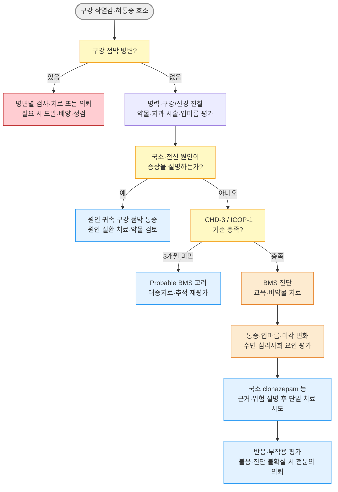

# 혀 통증·구강 작열통 Glossodynia, Burning Mouth Syndrome

## <mark style="color:green;">일반 사항</mark>

* 혀 통증·구강 작열감은 증상이며, 국소·전신 원인을 확인할 수 없고 진단 기준을 충족할 때 구강작열감증후군(Burning Mouth Syndrome, BMS)으로 진단
* BMS : 원인을 설명할 만한 구강 점막 병변이나 국소·전신 질환 없이 발생하는 만성 구강 내 작열감 또는 이상감각
* 과거 명칭 : stomatodynia, glossodynia(혀에 국한된 경우); oral dysaesthesia는 통증 이외의 이상감각까지 포함하는 더 넓은 표현
* 정의 (ICHD-3 2018 / ICOP-1 2020) : 구강 점막에서 매일 2시간 초과, 3개월 초과 지속되는 표재성 작열통; 혀뿐 아니라 입술·구개·잇몸 등 구강 점막 어디서든 발생 가능
* 증상 : 혀(특히 혀 끝·혀 앞쪽 2/3)에 가장 흔하며, 구개·잇몸·입술로 확산되기도 함; 미각 변화(쓴맛·금속 맛), 입마름 동반 多
* 유병률 : 연구 정의와 대상에 따라 일반 인구의 약 0.1\~4.6%; 중년 이후 여성, 특히 폐경 후 여성에서 흔함(보고된 남녀비 약 1 : 3\~1 : 7)
* 경과 : 증상이 일부 호전될 수 있으나 장기 지속이 흔하고 완전한 자연 관해는 드묾(한 후향적 연구에서 5년 이내 약 3%)

## <mark style="color:green;">원인 및 분류</mark>

### <mark style="color:orange;">BMS</mark>

* 국소·전신 원인으로 설명되지 않는 특발성 만성 구강안면 통증; 신경병증성·통각변조성 기전, 내분비 및 심리사회적 요인이 복합적으로 관여하는 것으로 추정
* ICOP-1은 정량감각검사(QST) 시행 시 **체성감각 변화 있음/없음**으로 세분할 수 있음
* 아래 Type I\~III는 증상의 일중 변동을 기술한 고전적 분류로, 병태생리나 약제 선택을 확정하는 분류가 아님

<table><thead><tr><th width="146">고전적 패턴</th><th width="250">증상 양상</th><th>해석</th></tr></thead><tbody><tr><td>Type I</td><td>기상 시 없거나 경미 → 하루 중 점진적 악화</td><td rowspan="3">증상 기술에 참고하되 원인·기전 또는 치료를 직접 결정하지 않음</td></tr><tr><td>Type II</td><td>깨어 있는 동안 거의 지속</td></tr><tr><td>Type III</td><td>간헐적, 증상 없는 날이 있음</td></tr></tbody></table>

### <mark style="color:orange;">원인이 확인된 구강 작열감</mark>

* 구강 국소·전신 질환이나 약물로 설명되는 구강 작열감은 BMS가 아니라 해당 원인에 귀속된 구강 점막 통증으로 분류
* 과거 문헌의 ‘secondary BMS’에 해당하나, ICOP-1에서는 이 용어를 사용하지 않음

**관련 인자**

* 전신 질환 : 당뇨병, 갑상선 질환, 빈혈, Sjögren 증후군 등
* 영양 결핍 : Vit B군(B1·B2·B6·B12), 엽산, 아연, 철분
* 구강 질환 : 구강 칸디다증, 입마름증, 지도상 혀, 구강 편평태선
* 역류 질환 : GERD/LPR와 연관성이 보고되지만 인과관계가 확립된 것은 아님; 전형적 증상이나 위험 인자가 있을 때 평가
* 구강 이상기능(oral parafunction) : 혀를 구개·치아에 누르거나 비비는 습관, 이 악물기·이갈이 등 반복적 기계 자극
* 신경병증 : 대상포진 후 신경통, 외상·치과 시술 후 설신경 또는 삼차신경병증
* 감염 후 이상감각 : COVID-19 감염 후를 포함한 사례가 보고되나 빈도와 인과관계는 불확실
* 접촉 자극 : 틀니·치과 재료(아말감), 치약(SLS 계면활성제), 구강 세정제(알코올), 맵고 뜨거운 음식
* 약물 : ACEI 등 일부 항고혈압제, 항히스타민제, 항콜린제, 이뇨제 등; 약물 시작·증량과 증상 발생의 시간적 관계를 확인
* 기타 : 방사선 치료 후, 접촉 알레르기, 흡연·니코틴
* 불안·우울·수면장애·건강염려는 흔한 동반 질환 또는 통증 증폭 요인이지만, 그 자체만으로 BMS를 배제하거나 원인으로 단정하지 않음

## <mark style="color:green;">임상 양상</mark>

* 구강 내 작열감, 따끔거림, 화끈거림 - 혀 끝이 가장 흔하고 입천장·입술·잇몸으로 확산
* 미각 변화 : 쓴맛, 금속 맛, 미각 감소
* 입마름 호소 - 실제 타액 분비량은 정상인 경우가 많음
* 식사 중 일시적으로 호전되는 경우가 있으나 진단 기준이나 단독 감별 소견은 아님
* 불안·우울·수면 장애 동반 빈도가 높으므로 별도로 평가
* 구강 점막 : 육안 및 촉진상 정상이어야 함 - 병변이 있으면 다른 원인을 평가

### <mark style="color:$danger;">🚩 Red Flags!</mark>

<mark style="color:$danger;">**Tier 1 - 즉각 응급 조치 및 이송, 필요시 119 호출**</mark>

* 급속히 진행하는 혀·구강저 부종, 호흡곤란, 협착음, 침 흘림, 청색증 → 기도폐쇄·아나필락시스; 기도 확보 및 응급 이송
* 고열·독성 외관과 함께 구강저 종창, 혀의 상방 변위, 개구장애, 연하곤란 → 심부경부감염·Ludwig angina
* 새로 발생한 구음장애·편측 마비·의식 변화 등 급성 신경학적 이상 → 뇌졸중 등

<mark style="color:$warning;">**Tier 2 - 당일~수일 내 평가**</mark>

* 지속·진행하는 연하곤란 또는 연하통, 설명되지 않는 체중 감소, 경부 종괴
* 2주 이상 지속되는 궤양·경결·백반·홍반 또는 쉽게 출혈하는 병변 → 악성·전암성 병변 배제를 위한 구강내과·구강악안면외과·이비인후과 평가 및 필요 시 생검
* 편측 혀 통증과 새로 발생한 안면·혀 감각 저하, 뇌신경 이상 → 삼차신경병증·종양 등 평가
* 광범위한 수포·미란, 피부·안구 병변 동반 → 자가면역 수포성 질환 등

<mark style="color:$info;">**Tier 3 -  외래 추적 관찰**</mark>

* 백태·국소 홍반 등 구강 칸디다증 의심 소견 → 위험 인자 확인 및 외래 검사·치료
* 적절한 평가·치료에도 증상이 지속되거나 진단이 불확실함 → 구강내과·구강악안면외과 또는 구강안면통증 전문 진료 의뢰
* 중등도 이상의 불안·우울, 수면장애 또는 현저한 일상기능 저하 → 동반 질환 평가·치료
* 의심 약물의 시작·증량과 증상 발생의 시간적 관련성이 있음 → 처방의와 상의하여 대체 가능성을 검토하고 추적; 임의 중단 금지

## <mark style="color:green;">진단</mark>

### <mark style="color:orange;">진단 기준 \[ICHD-3]</mark>

* 구강 통증이 아래 기준을 충족
* 매일 반복되며 하루 2시간 초과, 3개월 초과 지속
* 작열성이며 구강 점막 표면에서 느낌
* 구강 점막의 외관이 정상이고 감각검사를 포함한 임상 진찰이 정상
* 다른 ICHD-3 진단으로 더 잘 설명되지 않음


**진단은 배제 진단(diagnosis of exclusion)** : 병력·구강 진찰과 임상적으로 필요한 검사를 통해 원인을 설명할 국소·전신 질환을 배제한 후 BMS로 진단. 원인이 확인되면 BMS가 아니라 해당 원인에 귀속된 구강 점막 통증으로 진단한다.\
✽ICOP-1에서는 증상이 3개월 미만이지만 다른 기준을 충족하면 probable BMS로 분류할 수 있으며, QST를 시행한 경우 체성감각 변화 유무를 세분한다.



**2026년 최신 지견** : 기존 ICHD-3·ICOP-1·ICD-11·WCOM 기준을 처음으로 비교 검증한 연구에서 어느 기준도 민감도와 특이도가 모두 높지 않았다. 양측성, 하루 6시간 이상, 3개월 이상을 포함한 수정 ICOP 기준이 제안되었으나 단일 연구의 제안 단계이므로, 추가 검증 전에는 공식 ICHD-3/ICOP-1 기준을 사용한다.


### <mark style="color:orange;">검사</mark>

**기본 평가**

* 병력 : 통증 위치·양측성·성격·강도·지속시간·일중 변동, 미각 변화·입마름, 음식과의 관계, 동반 질환, 약물 시작·증량 시점, 흡연·음주, 틀니·치과 시술·외상력
* 구강 진찰 : 충분한 조명 아래 혀의 배면·측면·복면, 구강저, 협점막, 잇몸, 구개를 시진·촉진; 경결·궤양·백반·홍반·칸디다 소견, 침 분비, 치아·보철물 및 틀니 적합도 확인
* 신경학적 진찰 : 안면·혀의 촉각·통각·온도감각, 뇌신경 이상을 좌우 비교; 이상 소견이 있으면 삼차신경병증 등 별도 진단 평가
* 통증 및 동반 증상 : NRS/VAS로 기준 통증을 기록하고, 필요 시 PHQ-9/GAD-7 또는 PHQ-4로 우울·불안을 선별

**혈액 검사 (병력·진찰과 임상 상황에 따라 선택)**

* CBC, ferritin ± serum iron/TIBC 또는 transferrin saturation
* 공복혈당 또는 HbA1c
* Vit B12, 엽산; 식이·흡수장애 위험 또는 임상적으로 의심될 때 아연 등
* 갑상선 질환이 의심되면 TSH ± free T4

**확장 검사 (의심 질환에 따라)**

* ANA, anti-SSA/SSB - 객관적 입마름·안구건조, 타액선 종대 등 Sjögren 증후군 의심 시
* Sialometry - 객관적 타액 감소 확인 필요 시; 비자극 전타액 ≤0.1 ㎖/min, 자극 전타액 ≤0.7 ㎖/min이면 저하
* 구강 도말·배양 - 임상적으로 칸디다증이 의심되거나 치료 반응이 불분명할 때; Candida 검출만으로 감염을 확진하지 않음
* 알레르기 패치 검사 - 특정 치과 재료·치약·향료 노출 부위와 증상의 관련성이 의심될 때
* 내시경·역류검사 - 전형적 역류 증상, 경고 증상 또는 치료 불응 등 별도 적응증이 있을 때
* 생검 - 2주 이상 지속되는 궤양·경결·백반·홍반, 편평태선·자가면역 수포성 질환 등이 의심될 때 전문의 판단


Clonazepam이나 국소마취제에 대한 반응은 BMS를 확진하거나 말초·중추 신경병증을 구분하는 진단검사가 아니다. 반응 여부만으로 원인을 재분류하지 않는다.


### <mark style="color:orange;">감별 진단</mark>

**BMS, Xerostomia, 삼차신경통 감별**

<table><thead><tr><th width="119">구분</th><th>BMS</th><th>타액분비저하</th><th>삼차신경통</th></tr></thead><tbody><tr><td>통증 성격</td><td>타는 듯 지속</td><td>건조·따끔, 구강 기능 불편</td><td>전기 쇼크형 발작</td></tr><tr><td>식사 영향</td><td>일부에서 일시 호전</td><td>마른 음식 섭취·연하 불편</td><td>씹기·말하기·세수 등으로 유발 가능</td></tr><tr><td>시간 양상</td><td>매일 장시간; 강도 변동</td><td>원인·수분 상태에 따라 변동</td><td>수초\~2분의 반복 발작</td></tr><tr><td>타액 분비</td><td>정상인 경우가 많음</td><td>객관적으로 감소</td><td>정상</td></tr><tr><td>구강 소견</td><td>정상</td><td>건조·끈적한 점막, 치아우식·칸디다증 동반 가능</td><td>정상</td></tr></tbody></table>

**추가 감별**

<table><thead><tr><th width="185">질환</th><th>감별 포인트</th></tr></thead><tbody><tr><td>구강 칸디다증</td><td>닦이는 백색 위막 또는 국소 홍반·유두 위축; 흡입 스테로이드, 항생제, 틀니, 면역저하 등 위험 인자</td></tr><tr><td>구강 편평태선·태선양 병변</td><td>망상성 백색선조, 홍반·미란; 필요 시 생검</td></tr><tr><td>지도상 혀·위축성 설염</td><td>경계가 분명한 이동성 탈유두 병변 또는 매끈하고 붉은 혀; 영양결핍 등 평가</td></tr><tr><td>접촉 구내염</td><td>치과 재료·치약·향료 노출 부위와 증상의 시간적·해부학적 관련성</td></tr><tr><td>Sjögren 증후군</td><td>안구건조, 객관적 타액 감소, 타액선 종대; anti-SSA/SSB 등</td></tr><tr><td>외상성 삼차·설신경병증</td><td>치과 시술·외상 후 편측 지속통과 감각 저하 또는 이질통</td></tr><tr><td>삼차신경통</td><td>삼차신경 분포의 짧은 전기 쇼크형 편측 발작과 유발점</td></tr><tr><td>지속특발안면통</td><td>구강 점막에 국한되지 않고 신경 분포를 따르지 않는 지속성 안면통</td></tr></tbody></table>


***



<p align="center"><strong>혀통증·BMS 진단 및 치료 알고리듬</strong></p>

<p align="center"><em><mark style="color:$info;">Ref. ICHD-3 (2018); ICOP-1 (2020); RDC/BMS beta (2020); El-Rubaiy et al. Cephalalgia 2026</mark></em></p>

***

## <mark style="background-color:yellow;">Management</mark>

### <mark style="color:orange;">치료 방침</mark>

* BMS : 진단과 양성 경과를 설명하고 완치보다 통증·기능·수면·삶의 질 개선을 목표로 공동 의사결정
* 원인이 확인된 구강 작열감 : 해당 질환을 치료하고 의심 약물은 처방의와 대체 가능성을 검토; 원인 치료 후에도 통증이 지속되면 BMS의 병존 여부를 재평가
* 특정 표현형에 따른 표준 치료는 확립되지 않았으며, 한 번에 한 가지 치료를 낮은 용량으로 시작하여 효과와 부작용을 평가
* 약제별 예상 반응 시점이 다르므로 일률적으로 8\~12주를 요구하지 않음; 효과가 없으면 진단·복약 순응도·동반 질환을 재검토하고 불필요한 다약제 병용을 피함

### <mark style="color:orange;">치료 근거 요약</mark>

<table><thead><tr><th width="170">치료</th><th width="180">근거</th><th>임상적 위치</th></tr></thead><tbody><tr><td>Clonazepam<br>(국소 또는 전신)</td><td>2023 네트워크 메타분석에서 위약 대비 통증 감소 가능성, 중등도 확실성; 국소 투여의 직접 RCT 근거가 비교적 많음</td><td>위험·허가 외 사용을 설명한 후 고려; 고령자·낙상 위험 환자 주의</td></tr><tr><td>Pregabalin·photobiomodulation</td><td>효과 신호가 있으나 낮음 또는 매우 낮은 확실성</td><td>초기 치료 불충분 시 개별적으로 고려</td></tr><tr><td>Gabapentin·CBT·capsaicin</td><td>소규모 연구의 제한적 근거</td><td>환자 특성·선호에 따라 보조적으로 고려</td></tr><tr><td>항우울제·α-lipoic acid</td><td>결과 불일치 또는 근거 불충분</td><td>공존 질환 또는 충분한 설명 후 선택적 사용</td></tr></tbody></table>

## <mark style="color:green;">비-약물 치료 및 예방</mark>

* 충분한 수분 섭취; 얼음 조각·냉수로 일시적 증상 완화
* 자극 회피 : 알코올 함유 구강 세정제, SLS 함유 치약(SLS-free 치약으로 교체), 탄산음료·커피, 맵고 뜨겁고 신 음식
* 틀니 적합도 재평가; 치과 재료 알레르기 의심 시 패치 검사
* 음주·흡연 회피
* 구강 이상기능 교정 : 혀 밀기·혀 누르기·이 악물기·이갈이를 인식하고 이완; 임상적 관련성이 분명하면 치과 평가 후 장치·행동치료 고려
* GERD/LPR가 의심되면 별도 진단 기준에 따라 생활요법·치료를 적용
* 인지행동치료(CBT) : 통증 파국화, 불안·우울·수면장애 또는 일상기능 저하가 있을 때 고려; BMS 통증에 대한 근거는 소규모 연구 수준임을 설명

## <mark style="color:green;">약물 치료</mark>

* BMS에 충분히 입증된 단일 약제는 없음
* 아래 약제는 모두 BMS에 대한 국내 허가 적응증이 없는 허가 외 사용; 예상 이득·불확실성·부작용을 설명하고 환자별로 단계적으로 선택

#### <mark style="color:$primary;">Clonazepam</mark>&#x20;

* <mark style="color:blue;">[리보트릴]</mark>; BMS 약물 중 비교적 근거가 많지만 장기 효과·안전성 자료는 제한적
* GABA-A 수용체 조절을 통한 통증 억제 기전으로 추정

**국소 적용 (swish-and-spit)**&#x20;

* 대표 RCT 용법 : 1 ㎎ 정제를 입 안에서 천천히 녹여 침을 통증 부위에 3분간 머금은 뒤 뱉음 × tid, 14일
* 국내 0.5 ㎎ 정제를 물에 녹이는 방법은 위 RCT와 용량·제형·농도가 동일하지 않으므로 표준화된 근거 용법으로 간주하지 않음
* 뱉어도 구강 점막을 통해 전신 흡수될 수 있으므로 졸림·어지럼·운전·낙상·의존 위험을 안내
* 1\~2주 후 통증 변화를 평가할 수 있으나, 반응 여부는 진단이나 신경병증 기전을 확정하지 않음

**전신 투여**&#x20;

* 0.25\~0.5 ㎎ hs 등 최소 용량·단기간 사용을 원칙으로 개별화; 전신 투여가 국소 투여보다 효과적이라는 근거는 없음
* 졸림·인지 저하·균형 장애·호흡억제·의존성, 고령자 낙상 위험; opioid·알코올 등 중추신경 억제제 병용 주의
* 장기 사용은 가급적 피하고, 반복 투여 후 중단할 때는 점진적으로 감량

#### <mark style="color:$primary;">SNRI</mark>

* BMS 자체에 대한 근거는 제한적; 별도로 진단한 우울·불안 또는 다른 신경병증성 통증이 동반될 때 고려 (☞ [항우울제](../231_/213_-antidepressants-and-anxiolytics.md#serotonin-norepinephrine-reuptake-inhibitor-snri))
* duloxetine 30 ㎎ qd 시작 → 내약성과 적응증에 따라 60 ㎎ qd <mark style="color:blue;">[심발타]</mark>; 오심·입마름·불면 또는 졸림, 혈압 상승 등에 주의하고 중단 시 tapering

#### <mark style="color:$primary;">TCA</mark>&#x20;

* BMS 자체에 대한 근거는 불충분하며 통증·수면장애를 고려해 선택적으로 사용
* amitriptyline 10\~25 ㎎ hs <mark style="color:blue;">\[에트라빌]</mark> 또는 nortriptyline <mark style="color:blue;">\[센시발]</mark> 10\~25 ㎎ hs (☞ [통증](../220_/001_-pain.md#tca))
* 항콜린성 입마름·변비·요폐·인지저하와 기립저혈압이 기존 증상 및 낙상 위험을 악화시킬 수 있어 고령자에서 특히 주의

#### <mark style="color:$primary;">Gabapentinoid</mark>&#x20;

* 제한적 근거 하에 clonazepam 불내성·불충분 반응 등에서 고려
* gabapentin 100\~300 ㎎ hs 시작, 서서히 증량 <mark style="color:blue;">[뉴론틴]</mark> (☞ [통증](../220_/001_-pain.md#gabapentinoid-a2d-ligands))
* pregabalin 25\~75 ㎎ hs 또는 bid로 시작하여 개별 증량 <mark style="color:blue;">[리리카]</mark>
* 어지럼·졸림·말초부종·낙상에 주의하고 신기능에 따라 감량

#### <mark style="color:$primary;">α-Lipoic acid</mark>

* 항산화·신경염증 억제 기전
* 600 ㎎/day가 주로 연구되었으나 RCT와 메타분석 결과가 불일치하고 근거의 질이 낮음 <mark style="color:blue;">[치옥타시드 600HR]</mark>
* 충분한 설명 후 선택적으로 단독 시도할 수 있으나 clonazepam과의 일률적 초기 병합은 권하지 않음; 위장관 증상·두통·저혈당 위험 등에 주의

#### <mark style="color:$primary;">Topical lidocaine</mark>

* 2% lidocaine gel을 소량 국소 도포하여 일시적 완화를 시도할 수 있으나 지속 효과 근거는 부족하고 일상적 장기 치료로 권하지 않음
* 반응 여부로 말초 신경병증을 진단하지 않으며, 광범위 사용 시 구강·인두 감각 저하에 따른 교상·흡인 위험에 주의

#### <mark style="color:$primary;">Capsaicin</mark>

* TRPV1 탈감작 기전; 소규모 연구에서 효과 신호가 있으나 초기 작열감·위장관 부작용으로 순응도가 낮음
* 표준화된 구강용 농도·증량법이 확립되지 않았으므로 임의 희석 프로토콜을 일반 처방으로 제시하지 않음
* 국내 구강용 제제 미허가; 전문의 감독하의 시험적 사용에 해당

#### <mark style="color:$primary;">영양 보충</mark>

* 실험실 검사로 해당 성분의 결핍 확인 후 적용
* Vit B12·엽산·철분·아연 등은 결핍 원인과 중증도에 따라 보충; 결핍이 없으면 BMS 치료 목적으로 일률적으로 투여하지 않음
* 철결핍은 ferritin 단일 수치가 아니라 빈혈 여부, transferrin saturation 및 염증 상태를 종합하여 판단하며 BMS만을 위한 ferritin 50 ng/㎖ 치료 역치는 없음
* 원소 아연 20\~40 ㎎/day를 장기간 투여하면 구리결핍이 발생할 수 있어 투여기간과 추적검사를 개별화

### <mark style="color:orange;">난치성 BMS (전문의 의뢰 후 고려)</mark>

* 진단 재검토 : 놓친 점막 질환·타액분비저하·영양결핍·약물·외상성 신경병증, 동반 우울·불안·수면장애 확인
* 구강내과·구강악안면외과 또는 구강안면통증 전문 진료 의뢰; QST 등 전문 검사를 선택적으로 고려
* Photobiomodulation(저출력 레이저) : 효과 신호가 있으나 프로토콜이 표준화되지 않았고 근거 확실성이 낮아 숙련된 기관에서 고려
* Clonazepam 조제 용액·gel : 일부 연구가 있으나 표준화된 국내 시판 구강용 제제는 없음
* Gabapentinoid와 항우울제 병용은 각각의 독립 적응증, 단독 치료 반응과 상호 부작용을 검토한 뒤 제한적으로 고려
* Low-dose naltrexone과 호르몬 치료는 BMS 치료 근거가 불충분하여 일상적으로 권하지 않음; 폐경호르몬요법은 BMS가 아닌 독립적인 폐경 치료 적응증에 따라 결정


**BMS 진단·치료 실수 TOP 7**

1. 구강 점막 병변 놓침 → 구강암 진단 지연
2. 혀 통증·구강 작열감을 모두 BMS로 진단 → 국소·전신 원인 평가 누락
3. 주관적 입마름을 객관적 타액분비저하로 간주하거나, 반대로 홍반성 칸디다증·타액분비저하를 놓침
4. 의심 약물·치과 시술과 증상 발생의 시간적 관계를 확인하지 않음
5. 불안·우울을 원인으로 단정하거나 선별을 생략함 → 공존 질환과 치료 필요성 평가 누락
6. 약제마다 다른 반응 시점과 근거 수준을 고려하지 않고 조기에 중단하거나 효과 없는 다약제를 장기간 병용
7. 국소 clonazepam은 뱉으면 전신 흡수가 없다고 설명 → 졸림·운전·낙상·의존 위험 안내 누락


***

### <mark style="color:red;">질병코드</mark>

K14.6 설통 (Glossodynia)

***

## <mark style="color:purple;">처방례</mark>

> **처방례 1.** BMS - 국소 clonazepam 단기 시험(허가 외 사용)
>
> ```
> 리보트릴 0.5 ㎎/T  2T  tid  × 14일 (구강 국소 적용 후 뱉음)
> ```
>
> _✽대표 RCT 용법에 따라 총 1 ㎎을 입 안에서 천천히 녹여 침을 통증 부위에 3분간 머금은 뒤 반드시 뱉음. 물 5\~10 ㎖에 희석하는 방법과 동일한 근거가 아님. 1\~2주 후 통증과 부작용을 평가하고, 뱉어도 전신 흡수·졸림·의존 가능성이 있음을 설명_

> **처방례 2.** 국소 clonazepam 사용이 어렵고 단기간 전신 투여를 선택한 경우(허가 외 사용)
>
> ```
> 리보트릴 0.5 ㎎/T  0.5\~1T  hs
> ```
>
> _✽국소 투여보다 효과적이라는 근거는 없음. 고령자·수면무호흡·낙상 위험·opioid 또는 다른 진정제 병용 환자는 특히 주의하고 최소 용량·단기간 사용_

> **처방례 3.** 별도로 진단된 우울·불안 또는 신경병증성 통증 동반(허가사항과 환자 상태에 따라)
>
> ```
> 심발타 30 ㎎/캡슐  1캡슐  qd (아침, 2주) → 60 ㎎으로 증량
> ```
>
> _✽BMS만을 위한 표준 1차 처방이 아님. 오심·입마름·혈압·간질환·중단 증후군 등을 확인하고 독립 적응증에 따라 투여_

> **처방례 4.** Gabapentinoid 선택 시(허가 외 사용)
>
> ```
> 뉴론틴 100 ㎎/캡슐  1캡슐  hs
> ```
>
> _✽반응과 내약성에 따라 서서히 증량. 신기능에 따라 감량하고 졸림·어지럼·낙상에 주의_

***

### <mark style="color:$success;">핵심 복약 지도</mark>

> **리보트릴(clonazepam) 국소 사용법**
>
> * 처방받은 총 1 ㎎을 입 안에서 천천히 녹이고, 침을 아픈 부위에 **3분간 머금은 뒤 반드시 뱉어 내십시오**
> * 처방된 기간과 횟수를 지키고 임의로 삼키거나 추가 복용하지 마십시오
> * 뱉더라도 일부가 흡수되어 졸림·어지럼이 생길 수 있습니다. 처음 사용할 때는 운전·기계 조작을 피하고 넘어짐에 주의하십시오
> * 반복 사용하면 의존성이 생길 수 있으므로 임의로 장기간 사용하거나 갑자기 중단하지 마십시오

> **치옥타시드(α-lipoic acid)를 선택적으로 사용하는 경우**
>
> * 하루 1정을 복용하십시오; **공복에 드시면 흡수가 더 잘 됩니다** (식사 30분 전 권장)\
>   ✽식후 복용도 가능하나 흡수율이 다소 낮아질 수 있습니다
> * BMS에 대한 효과는 연구마다 다르며 모든 환자에게 권하는 치료는 아닙니다
> * 위장 불편·두통이 생길 수 있고 당뇨병 약을 사용하는 경우 혈당이 낮아질 수 있으므로 주의하십시오

> **심발타(duloxetine) 복용 안내**
>
> * 의사가 별도로 확인한 우울·불안 또는 신경병증성 통증을 함께 치료하기 위해 선택할 수 있습니다
> * 초기에는 30 ㎎로 시작하고, 증상과 부작용을 확인한 뒤 필요 시 60 ㎎으로 늘립니다
> * 오심·입마름·불면 또는 졸림이 생길 수 있습니다. 임의로 갑자기 중단하지 마십시오

> **전신 clonazepam 복용 시 주의사항**
>
> * 취침 직전에 복용하십시오 - 낮 졸림·집중력 저하를 줄이기 위해서입니다
> * 운전·기계 조작 시 주의가 필요합니다
> * 임의로 갑자기 중단하지 마십시오 - 반드시 의사와 상의하여 서서히 줄여야 합니다
> * 음주는 진정 효과를 크게 강화시키므로 피해 주십시오

> **언제 다시 병원을 방문해야 하나요?**
>
> * 2\~3개월 치료 후에도 증상이 전혀 호전되지 않는 경우
> * 혀나 입안이 빠르게 붓고 숨쉬기 어렵거나 침도 삼키기 힘든 경우 - 즉시 119 호출
> * 구강 점막에 **하얀 반점, 홍반, 단단한 부위 또는 궤양**이 생겨 2주 이상 지속되는 경우 - 수일 이내 진료
> * 지속·진행하는 연하 곤란, 연하통, 경부 종괴 또는 설명되지 않는 체중 감소가 동반되는 경우 - 조기 진료
> * **한쪽 얼굴이나 혀의 감각이 새로 달라졌을 때** - 조기 진료
> * 졸림·균형 장애 등 약물 부작용이 일상생활에 지장을 주는 경우

***

### <mark style="color:blue;">환자 안내서</mark>


**혀통증(구강 작열통, BMS) - 구강에 이상이 없는데 왜 아픈 걸까요?**

혀나 입 안이 타는 듯이 아픈 증상에는 여러 원인이 있습니다. 충분한 진찰과 필요한 검사에서 원인을 찾을 수 없고 증상이 3개월 넘게 지속되면 구강작열감증후군(BMS)으로 진단할 수 있습니다. **눈에 보이는 병변이 없더라도 증상은 실제로 존재하며, 구강 감각을 처리하는 신경계의 변화 등이 복합적으로 관여하는 것으로 생각됩니다.**


#### <mark style="color:$primary;">왜 이런 증상이 생기나요?</mark>

* BMS의 정확한 원인은 알려져 있지 않으며 구강 감각 신경과 통증 조절 체계의 변화가 관여하는 것으로 추정됩니다
* 중년 이후 여성, 특히 폐경 후 여성에서 흔하지만 단순한 여성호르몬 부족으로 단정하지는 않습니다
* 당뇨병, 갑상선 질환, 빈혈·비타민·철분 부족, 입마름, 칸디다증, 일부 약물 등 원인이 확인되면 그 원인을 먼저 치료합니다
* 이 악물기나 혀를 치아·입천장에 반복해서 누르는 습관도 증상과 관련될 수 있습니다
* 음식을 먹는 동안 일시적으로 나아지는 경우가 있지만 이것만으로 BMS를 진단하지는 않습니다

#### <mark style="color:$primary;">일상생활에서 어떻게 관리하나요?</mark>

* 🥤 **수분을 충분히 드십시오** - 물을 자주 마시거나 얼음 조각을 물고 있으면 일시적으로 도움이 됩니다
* 🦷 **치약을 교체하십시오** - 거품이 많이 나는 치약(SLS 함유)이 증상을 악화시킬 수 있습니다. 무SLS 치약을 사용해 보세요
* 🚫 **알코올 함유 구강 세정제, 탄산음료, 커피, 맵고 신 음식을 줄이십시오**
* 🚬 **흡연은 증상을 크게 악화시킵니다** - 금연을 권합니다
* 혀를 입천장에 비비거나 누르는 습관, 이 악물기·이갈이가 있다면 교정하십시오
* 틀니를 사용하신다면 치과에서 적합도를 확인받으십시오

#### <mark style="color:$primary;">약은 어떻게 써야 하나요?</mark>

* BMS는 장기간 지속될 수 있지만 교육·생활조절·인지행동치료 또는 약물로 통증과 생활 불편을 줄일 수 있습니다
* 모든 환자에게 확실한 단일 치료는 없으며, 한 번에 한 가지 치료를 시도하고 정해진 시점에 효과와 부작용을 평가합니다
* 클로나제팜을 입 안에서 녹여 머금었다가 뱉는 치료를 선택할 수 있습니다. **반드시 뱉어야 하지만 일부가 흡수될 수 있으므로 졸림·어지럼·운전·낙상·의존 위험에 주의하십시오**

#### <mark style="color:$primary;">이럴 때는 신속히 진료를 받으세요</mark>

* 혀나 입안이 빠르게 붓고 숨쉬기 어렵거나 침도 삼키기 힘들 때에는 즉시 119에 도움을 요청하십시오
* 입 안에 **하얀 반점, 빨간 반점, 단단한 부위 또는 궤양이 2주 이상** 지속될 때에는 수일 이내 진료를 받으십시오
* 삼키기 어렵거나 아프고, 목에 덩이가 만져지거나 체중이 이유 없이 줄 때에는 조기에 진료를 받으십시오
* **한쪽 얼굴이나 혀의 감각이 새로 달라졌을 때**에는 조기에 진료를 받으십시오

> 💡 **기억하세요:** 스트레스나 불안이 증상을 악화시킬 수 있습니다. 심리적으로 힘든 부분이 있다면 함께 상담해 주세요. 인지행동치료(CBT)가 통증 관리에 실질적인 도움이 됩니다.
