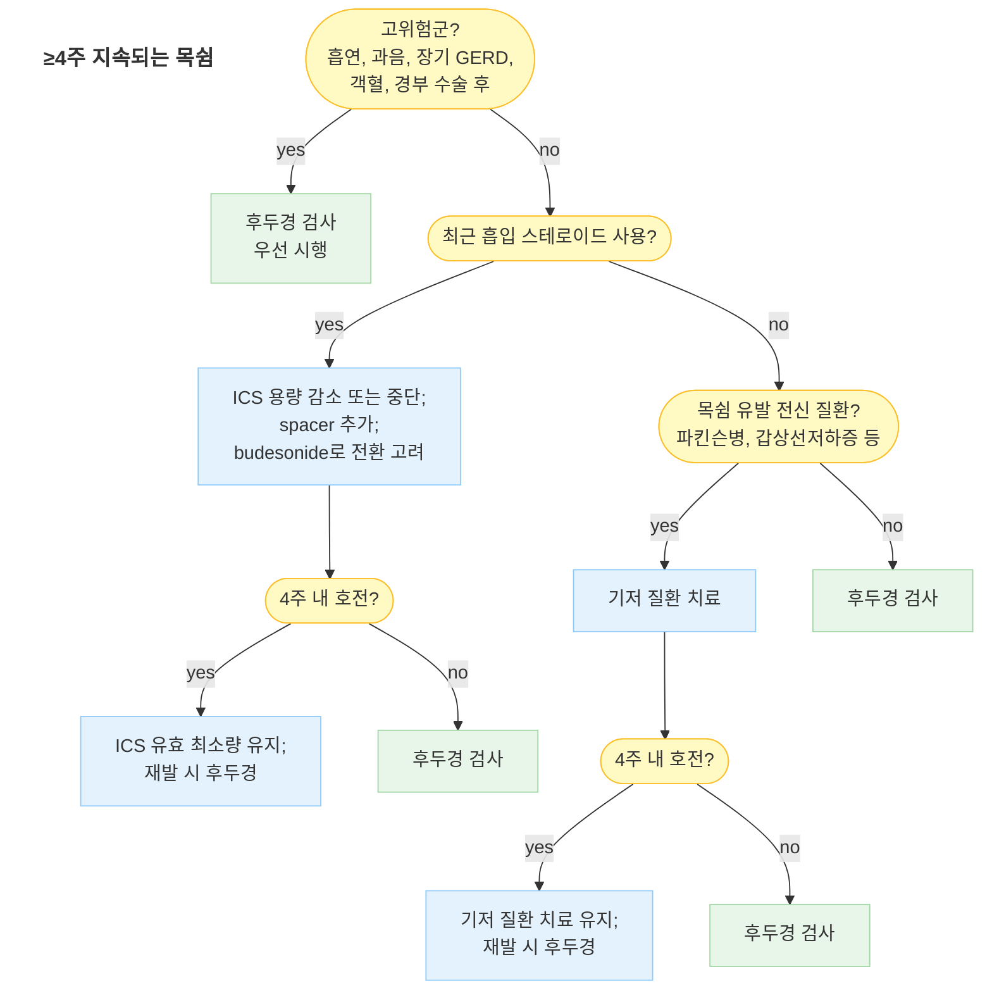

```mermaid
graph TD
    Title[<b>&#60;4주 목쉼</b>]
    style Title fill:none,stroke:none,font-size:18px

    Start([최근 목소리 남용 또는<br/>URI · 알레르기 증상 이력?])

    Start -- yes --> A[Voice rest,<br/>충분한 수분 섭취,<br/>대증 치료]
    Start -- no --> B([최근 위식도 또는<br/>인후두역류 증상?])

    A --> A1([2주 내 호전?])
    A1 -- yes --> A2[대증 치료 유지;<br/>재발 시 후두경]
    A1 -- no --> A1b([고위험군?<br/>흡연·과음·객혈·종괴])
    A1b -- yes --> A3[후두경 검사]
    A1b -- no --> A1c[4주까지 지지요법 &<br/>vocal hygiene 지속]
    A1c --> A1d([4주 내 호전?])
    A1d -- yes --> A2
    A1d -- no --> A3

    B -- yes --> C[생활습관 교정 우선;<br/>증상 지속 시 PPI<br/>선택적 시험 치료]
    B -- no --> D[2주간 지지요법 &<br/>vocal hygiene;<br/>호전 없으면 후두경 고려]

    C --> C1([4주 내 호전?])
    C1 -- yes --> C2[생활습관 교정 유지;<br/>재발 시 후두경]
    C1 -- no --> C3[후두경 검사]

    classDef yellow fill:#FFF9C4,stroke:#FBC02D;
    classDef blue fill:#E3F2FD,stroke:#90CAF9;
    classDef green fill:#E8F5E9,stroke:#A5D6A7;

    class Start,B,A1,A1b,A1d,C1 yellow;
    class A,A2,A1c,C,C2,D blue;
    class A3,C3 green;
```

# 목쉼 (쉰 목소리) Hoarseness (Dysphonia)

## <mark style="color:green;">일반 사항</mark>

* 목소리의 질(quality), 음조(pitch), 음량(loudness), 발성 노력(vocal effort) 등의 변화를 총칭하는 증상; 의학 용어로는 **dysphonia**
* 성대(vocal fold)의 진동 이상 또는 공명·조음 과정의 변화로 발생
* 유병률 : 일생에 한 번 이상 경험하는 비율 약 30%; 직업적 성대 사용자(교사, 가수, 강사, 성직자 등)에서 발생률 현저히 높음
* 일차의료 내원 원인 중 흔한 호소 증상; 대부분 양성 경과이나 악성 종양의 초기 증상일 수 있어 지속 기간 및 위험 인자에 따른 단계적 평가 필요
* **소아** : 출생 직후 또는 영아기부터 목쉼이 있었는지 확인 필수 → 선천성 후두 격막(laryngeal web), 후두연화증(laryngomalacia), 성대 마비(출생 시 외상) 감별; recurrent respiratory papillomatosis(HPV)는 소아에서도 발생하며 진행성 쉰 목소리 + 호흡 곤란 시 의심

#### <mark style="color:$primary;">음성 특성과 시사하는 원인</mark>

<table><thead><tr><th width="175">음성 특성</th><th width="230">시사하는 원인</th><th>비고</th></tr></thead><tbody><tr><td>기식성(breathy) - 바람 새는 소리</td><td>성대 마비, 성대 폴립, 노인성 음성 위축(presbyphonia)</td><td>성대 불완전 폐쇄</td></tr><tr><td>조이는(strained) - 쥐어짜는 소리</td><td>경련성 발성장애, MTD</td><td>내전형이 가장 흔함</td></tr><tr><td>거친/쉰(rough/harsh)</td><td>성대 결절, 성대 부종, 급·만성 후두염</td><td>불규칙 진동</td></tr><tr><td>떨리는(tremulous)</td><td>본태성 진전, 파킨슨병</td><td>신경학적 원인 의심</td></tr><tr><td>저음화</td><td>Reinke's edema, 갑상선저하증, 성대 부종</td><td>흡연 여성에서 Reinke 흔함</td></tr><tr><td>발성 피로(fatigable)</td><td>MTD, 성대 결절 초기, 신경근육 질환</td><td>말할수록 악화</td></tr><tr><td>갑작스런 실성</td><td>성대 출혈(vocal fold hemorrhage)</td><td>소리 지름 직후 발생</td></tr></tbody></table>

***

## <mark style="color:green;">원인</mark>

#### <mark style="color:$primary;">급성 원인</mark>

<table><thead><tr><th width="215">원인</th><th>세부</th></tr></thead><tbody><tr><td>급성 후두염</td><td>바이러스(가장 흔함), 세균 (☞ <a href="../223_/063_-laryngitis.md">후두염</a>)</td></tr><tr><td>성대 출혈(vocal fold hemorrhage)</td><td>목소리 과사용·잘못된 발성, 항응고제 사용; shouting 후 갑작스런 실성 → strict voice rest + 즉시 ENT 의뢰</td></tr><tr><td>후비루</td><td>부비동염, 알레르기 (☞ <a href="053_-rhinosinusitis-sinusitis.md">부비동염</a>)</td></tr><tr><td>위식도역류 / 인후두역류(LPR)</td><td>위산, 인두 자극 (☞ <a href="../224_/081_-gerd.md">위식도역류질환</a>)</td></tr><tr><td>경부 외상 / 기관삽관 후</td><td>직접 외상, 삽관 손상</td></tr><tr><td>갑상선 질환</td><td>갑상선저하증 (☞ <a href="../226_/105_-hypothyroidism.md">갑상선저하증</a>)</td></tr><tr><td>기능성 발성장애</td><td>hysterical aphonia, 심한 스트레스 (☞ <a href="../221_/031_-somatic-symptom-disorder.md">신체증상장애</a>)</td></tr></tbody></table>

#### <mark style="color:$primary;">만성 원인</mark>

<table><thead><tr><th width="215">원인</th><th>세부</th></tr></thead><tbody><tr><td>근긴장성 발성장애 (MTD)</td><td>가장 흔한 기능적 원인; 후두 구조 정상 + 후두 주변근 과긴장; 발성 피로가 특징적; 음성 치료가 1차 치료</td></tr><tr><td>성대 결절(vocal nodule)</td><td>목소리 과사용·잘못된 사용 → 양측성·대칭성; 교사·가수에서 흔함</td></tr><tr><td>성대 폴립(vocal polyp)</td><td>과사용, 흡연, 알레르기 → 편측성이 많음</td></tr><tr><td>Reinke's edema</td><td>흡연(특히 여성)에서 특징적; 저음화 + 거친 목소리; 금연 + 수술이 치료</td></tr><tr><td>노인성 음성 위축(presbyphonia)</td><td>성대 근육 위축 → 기식성 음성·발성 피로; 고령자에서 흔히 간과됨</td></tr><tr><td>만성 후두염</td><td>흡연, 만성 자극, LPR, 바이러스·세균</td></tr><tr><td>악성 종양</td><td>성문암(squamous cell carcinoma), 갑상선암의 되돌이후두신경(RLN) 침범</td></tr><tr><td>Recurrent respiratory papillomatosis</td><td>HPV 6/11형; 소아형 및 성인형</td></tr><tr><td>성대 마비(vocal fold paralysis)</td><td>종양(폐암·식도암·갑상선암), 갑상선·흉부·심장 수술 후 RLN 손상, 뇌경색, 퇴행성 질환</td></tr><tr><td>경련성 발성장애(spasmodic dysphonia)</td><td>국소 근긴장이상증; botulinum toxin이 표준 치료</td></tr></tbody></table>

#### <mark style="color:$primary;">약물 유발 목쉼</mark>

* **흡입 스테로이드(ICS)** : 후두 근육병증(myopathy) + 진균성 후두염 → dysphonia의 흔한 원인; fluticasone에서 budesonide보다 빈번; **ICS는 목쉼의 원인이지 치료제가 아님**
* coumadin, thrombolytics, PDE5 억제제, **항응고제(NOAC 포함)** : 성대 점막하 출혈(vocal fold hemorrhage) 위험 - 갑작스런 실성 발생 시 즉시 ENT 의뢰
* **테스토스테론(남성호르몬) 제제** : 성대 비후 → 여성에서 비가역적 저음화; 최저 유효 용량 사용 및 정기적 음성 모니터링 필요
* bisphosphonate : 화학적 후두염 (직접 점막 자극; 충분한 수분과 함께 복용, 복용 후 30분 이상 눕지 않도록 지도)
* ACE 억제제 : 만성 기침 → 성대 반복 자극
* 항히스타민제, 항콜린제, 이뇨제 : 점막 건조
* 항정신병제 : 후두 근긴장이상증(laryngeal dystonia)

***

## <mark style="color:green;">임상 양상</mark>

* 목소리 변화 : 쉰 소리, 거칠어짐, 기식성(바람 새는 소리), 음조 저하 또는 불안정, 음역 좁아짐, 발성 시 노력 증가
* **발성 피로(vocal fatigue)** : 말을 지속할수록 목소리가 점점 떨어지거나 사라짐 → MTD, 성대 결절 초기, 신경근육 질환에서 특징적
* 동반 증상 : 목 이물감, 기침, 후비루, 연하 시 불편감, 인후통
* **완전 실성증(aphonia)** : 성대 마비, 기능성 발성장애, 중증 후두염, 성대 출혈
* 속삭임은 되는데 발성이 안 됨 → 기능성 발성장애, 성대 마비, 급성 염증 감별

### <mark style="color:$danger;">🚩 Red Flags!</mark>

<mark style="color:$danger;">**즉각 조치 또는 응급 의뢰**</mark> <mark style="color:$danger;">- 기도 위협 또는 즉각적 위해</mark>

* 흡기 시 협착음(stridor) + 호흡 곤란 → 성대 부종·후두개염·기도 폐쇄 의심, 즉각 응급 처치
* shouting 직후 갑작스런 실성 → 성대 출혈 의심; **strict voice rest + 즉시 ENT 의뢰** (음성 사용 시 영구 손상 위험)
* 급성 삼킴 장애 + 흡인 증상(사레, 기침, 발열) → 흡인성 폐렴 위험

<mark style="color:$warning;">**당일 또는 조기 의뢰**</mark>

* 객혈 (hemoptysis) 동반
* 목의 종괴 (경부 림프절 종대 포함)
* 편측 이통 (귀는 정상인데 한쪽 귀 통증) → 후두·하인두 악성 종양의 연관통
* 빠른 진행 또는 삼킴 곤란 동반 → 악성 종양 또는 신경학적 원인 의심
* 갑상선·흉부·심장 수술 또는 경부 방사선 치료 후 발생 → RLN 손상 의심
* 흡인성 폐렴 기왕력 동반 목쉼 → 성대 마비·기능 이상 의심
* 점진적으로 악화되는 발성 피로 + 연하 곤란 → 신경근육 질환(ALS, MG 등) 의심
* 목쉼 + **구음장애(dysarthria)** 또는 **복시(diplopia)** 동반 → 중증근무력증(MG) 또는 뇌줄기 병변 의심; 신경과 협진

<mark style="color:$info;">**외래 추적 / 추가 평가 계획**</mark> <mark style="color:$info;">- 즉각 위험 낮으나 호전 없으면 후두경 검사 의뢰</mark>

* **4주 이상 지속** → 후두경 검사 권고 (실용적 기준)
* 흡연·과음력 있는 환자에서 **2주 이상** 지속 → 조기 후두경 검사
* 6주 이상 지속되는 원인 불명의 목쉼 → 후두암 선별 검사 권고 (국가암정보센터)
* 보존적 치료에 반응 없거나 치료 후 재발 반복 시
* 설명할 수 없는 체중 감소 또는 전신 쇠약 동반

***

## <mark style="color:green;">진단</mark>

### <mark style="color:orange;">검사</mark>

* **후두경 검사(laryngoscopy)** : 목쉼 원인 파악을 위한 일차 시각화 검사
  * \[AAO-HNSF 2018 Strong recommendation] 후두경 없이 만성 목쉼에 경험적 치료를 단독 적용하지 말 것
  * \[AAO-HNSF 2018] 3개월 이상 지속되거나 심각한 기저 질환 의심 시 후두경 검사 권고; 음성 치료 시작 전 시행하여 기질적 병변 여부 확인 필수
  * 고위험군(흡연, heavy alcohol use, 객혈)은 2주 이상 지속 시 조기 검사 권장
* **후두 미세진동 검사(videostroboscopy)** : 성대 점막 파동(mucosal wave)을 스트로보스코픽 광원으로 관찰; 일반 후두경으로 포착되지 않는 초기 점막 병변(조기 성문암, 성대 낭종, 미세 폴립), 성대 결절·폴립의 점막 유연성 평가, 음성 치료 전·후 비교에 유용; 전문 음성 클리닉 의뢰
* **CT / MRI** : 후두경 이상 소견 확인 후 종양 병기·성대 마비 원인 추적 시 고려
* **갑상선 기능 검사** : 저음화, 전신 무력감 동반 시
* **음성 분석(acoustic analysis)** : 전문 음성 클리닉에서 음성 질 정량 평가; MTD·직업적 발성 장애 평가에 유용


✽URI 후 1주간 목쉼이 지속될 수 있으며, 이 경우 경과 관찰이 우선이다.\
✽속삭임은 성대 긴장을 오히려 높이므로 쉰 목소리 회복에 도움이 되지 않는다.


### <mark style="color:orange;">감별 진단</mark>

임상 패턴과 병력을 조합하여 후두경 시행 전 감별 방향 설정에 활용

<table><thead><tr><th width="255">임상 패턴</th><th>우선 감별</th></tr></thead><tbody><tr><td>소리 지름(shouting) 직후 갑작스런 실성</td><td>성대 출혈 → strict voice rest + 즉시 ENT</td></tr><tr><td>기식성 음성 + 기침 약함 + 흡인 경향</td><td>성대 마비, 노인성 음성 위축(presbyphonia)</td></tr><tr><td>조이는/쥐어짜는 소리, 말할 때만 악화</td><td>경련성 발성장애, MTD</td></tr><tr><td>거친 소리 + 음성 남용 병력</td><td>성대 결절, 성대 폴립, 만성 후두염</td></tr><tr><td>저음화 + 흡연 여성</td><td>Reinke's edema, 갑상선저하증</td></tr><tr><td>떨리는 목소리 (리듬적 변화)</td><td>본태성 진전, 파킨슨병</td></tr><tr><td>오래 말할수록 악화되는 발성 피로</td><td>MTD, 성대 결절 초기, 신경근육 질환</td></tr><tr><td>발성 피로 + <b>오후·저녁에 심해지는 일중 변동</b></td><td>중증근무력증(MG) - acetylcholine 수용체 항체 검사, 신경과 협진</td></tr><tr><td>속삭임은 되는데 발성 불가</td><td>기능성(psychogenic) 발성장애</td></tr><tr><td>갑상선·흉부·심장 수술 후 발생</td><td>RLN 손상 → 성대 마비</td></tr><tr><td>ICS 사용 중 발생</td><td>스테로이드 유발 dysphonia</td></tr><tr><td>후두 구조 정상 + 음성 피로·과긴장</td><td>MTD → 음성 치료 의뢰</td></tr></tbody></table>


⚠️ **흔한 진료 실수 (Pitfall)**

* LPR로 과잉 진단 → 불필요한 장기 PPI 처방
* 흡입 스테로이드(ICS)를 목쉼 **치료제**로 추가 처방 → ICS는 목쉼의 원인이지 치료가 아님
* 후두경 없이 경험적 치료만 지속 (AAO-HNSF 2018 Strong recommendation 위반)
* 흡연자·고위험군에서 6주 이상 지연 평가 → 후두암 진단 지연
* 경험적 항생제 사용 → 세균성 후두염은 드물며 근거 없음


***





<p align="center"><strong>목쉼 평가 및 관리 알고리듬</strong></p>

<p align="center"><em><mark style="color:$info;">Ref. Am Fam Physician 2017;96(11). AAO-HNSF Clinical Practice Guideline: Hoarseness (Dysphonia), 2018</mark></em></p>

***

## <mark style="background-color:$warning;">Management</mark>


**치료 원칙**\
⓵ 원인 질환 치료가 최우선\
⓶ 음성 위생(vocal hygiene)은 모든 환자에게 권고\
⓷ 경험적 항생제·경구 스테로이드·PPI는 명확한 적응증 없이 처방하지 않을 것 (AAO-HNSF 2018 Strong recommendation)\
⓸ MTD·성대 결절·기능성 발성장애 → 음성 치료(speech-language therapy)가 1차 치료; 약물로 대체 불가


### <mark style="color:orange;">진단별 치료 요약</mark>

<table><thead><tr><th width="200">진단</th><th width="185">1차 치료</th><th>약물 역할</th></tr></thead><tbody><tr><td>급성 후두염</td><td>Voice rest, 수분</td><td>원칙적으로 약물 불필요; 불가피한 발성 시 단기 경구 스테로이드 고려</td></tr><tr><td>MTD</td><td>음성 치료(1차)</td><td>없음; 불안 동반 시 단기 anxiolytic 드물게 고려</td></tr><tr><td>성대 결절</td><td>음성 치료(1차)</td><td>역류 동반 시 PPI; 수술은 음성 치료 실패 후</td></tr><tr><td>성대 폴립</td><td>수술</td><td>역류 조절 보조</td></tr><tr><td>Reinke's edema</td><td>금연 + 수술</td><td>약물 효과 없음</td></tr><tr><td>LPR / GERD 관련</td><td>생활습관 교정 우선</td><td>PPI 선택적 시험 치료 (8~12주)</td></tr><tr><td>ICS 유발 dysphonia</td><td>ICS 감량·전환·spacer</td><td>추가 스테로이드 투여 금기</td></tr><tr><td>성대 마비</td><td>ENT 의뢰 (injection, medialization)</td><td>근본 치료 없음; 기저 원인 치료</td></tr><tr><td>경련성 발성장애</td><td>Botulinum toxin (표준)</td><td>경구 약물 거의 무효</td></tr><tr><td>Presbyphonia</td><td>음성 치료 + 발성 훈련</td><td>ENT 협진; 필요 시 injection laryngoplasty</td></tr></tbody></table>

***

## <mark style="color:green;">비-약물 치료 및 음성 위생</mark>

**수분 및 환경**

* 하루 1.5~2 ℓ 이상 수분 섭취; 실내 가습 유지 (습도 40~60%)
* 냉·난방 기기(선풍기, 온풍기) 직접 노출 회피; 흡연, 먼지, 화학적 호흡기 자극 물질 회피

**발성 습관**

* 헛기침(throat clearing) 및 과도한 기침 자제 → 성대에 물리적 충격; 대신 물 한 모금 섭취
* 고성, 소리 지름, 속삭임, 크거나 센 웃음 자제
  * ✽속삭임은 성대 긴장을 높이므로 성대 회복에 도움이 되지 않음
* 직업적 성대 사용자 : 증폭 장치(마이크) 적극 사용; 30분 이상 연속 발성 후 충분한 휴식

**식이 및 역류 예방**

* 카페인, 알코올, 탄산음료, 신 음식 회피
* 취침 2~3시간 전 음식 섭취 금지; LPR 예방을 위해 취침 시 상체 약간 높이기

**음성 재활의 원칙 (MTD·직업적 발성 장애·성대 결절)**

* 목표 : 힘을 빼고 숨 먼저 → 통증 시 즉시 중단, 속삭임 금지
* 핵심 훈련 순서 : 횡격막 호흡 → 하품-한숨(yawn-sigh) → 허밍(humming) → 입술 떨기(lip trill) → 스트로우 발성
* 하루 2회, 10~15분, 최소 4주 지속

***

## <mark style="color:green;">약물 치료</mark>


⚠️ **AAO-HNSF 2018 Strong recommendation**\
후두경으로 원인 확인 전, 만성 목쉼에 경험적 항생제·경구 스테로이드 처방을 하지 말 것.\
LPR/GERD 진단 없이 목쉼에만 PPI를 경험적으로 처방하지 말 것.


### <mark style="color:orange;">경구 / IM 스테로이드 (엄격히 제한적 사용)</mark>

직업적 성대 사용자에서 즉각적 발성이 불가피한 경우, 또는 중증 염증성 부종(severe inflammatory edema)에서 단기에 한해 고려; 구조적 병변(특히 성대 출혈) 배제가 전제

* prednisolone 20~40 ㎎/d, 1~3일 단기 (short burst)
* IM dexamethasone 단회 : 빠른 onset이 필요한 경우


⚠️ 금기 : 성대 출혈 의심, 감염성(특히 진균성) 후두염, 진단 불명 상태에서의 반복 사용


### <mark style="color:orange;">PPI (역류 관련 목쉼 - 선택적)</mark>

LPR 또는 GERD가 임상적으로 의심될 때만 시험적 치료; 생활습관 교정이 우선


최근 다수의 RCT(Vaezi 등)에서 LPR에 대한 PPI가 위약과 유의한 차이가 없거나 미미한 것으로 보고됨. heartburn 동반, 아침 목쉼, 만성 throat clearing 등 GERD 증거가 있는 경우에 선택적으로 투여할 것.


* omeprazole 20~40 ㎎ qd~bid; 시험 기간 8~12주
  * ✽"3개월 full-dose 필수"는 구시대 지침; 현재는 GERD 근거 있을 때만 선택적 적용
  * ✽**4주 시험 후 증상 호전이 전혀 없다면 나머지 기간을 채우지 않고 조기 중단 + 후두경 검사 시행** - 과잉 처방 방지
  * (☞ [인후두역류](../223_/062_-laryngopharyngeal-reflux-lpr.md), [위식도역류질환](../224_/081_-gerd.md))

### <mark style="color:orange;">점막 보습 보조 (참고)</mark>

* guaifenesin(거담제) : 기관지 점액 점도 저하와 함께 성대 윤활에 보조적 도움이 될 수 있다는 임상 경험이 있음; 근거는 제한적이나 부작용이 거의 없어 충분한 수분 섭취와 병행하여 선택적으로 고려 가능

### <mark style="color:orange;">ICS 유발 dysphonia 관리</mark>

ICS는 목쉼의 **치료제가 아니라 원인**임. ICS 사용 중 목쉼 발생 시 :

* spacer(보조흡입기) 추가 → 성대 도달 감소
* fluticasone → budesonide <mark style="color:blue;">\[풀미코트 터부헬러]</mark>로 전환 고려 (fluticasone이 budesonide보다 성대 자극·진균성 후두염 빈도 높음)
* 가능하면 용량 감소 또는 중단; 사용 후 입 헹굼 철저히 시행
* 추가 스테로이드 투여는 금기 (악화)

### <mark style="color:orange;">알레르기비염 / 후비루 관련</mark>

* 비강 내 스테로이드 또는 azelastine + fluticasone propionate 복합 비강 스프레이 <mark style="color:blue;">\[리노에바스텔]</mark>
* ✽항히스타민제 단독은 점막 건조로 성대 건조를 악화시킬 수 있으므로 충분한 수분 섭취 병행

### <mark style="color:orange;">Baclofen (선택적, 근거 제한적)</mark>

* baclofen <mark style="color:blue;">\[바크론]</mark> : 1차 치료로 권장되지 않음; 기존 역류 치료에 반응하지 않는 refractory 증상에서 선택적으로 시도 가능 (GABA-B 효현제, 하부식도괄약근 이완 억제 기전)

***

### <mark style="color:red;">질병코드</mark>

R49.0 목쉼 (Hoarseness)

J37.0 만성 후두염

J04.0 급성 후두염

***

## <mark style="color:purple;">처방례</mark>

> **처방례 1. 급성 후두염 / 음성 과사용 (4주 미만, 구조적 병변 배제 후)**
>
> ```
> (약물 없이 voice rest + 충분한 수분 섭취 우선)
> 오엠피 20 ㎎/T  1T  qd  식전 30분  (역류 증상 명확히 동반 시에만)
> ```
>
> _✽대부분의 급성 후두염에서 약물은 불필요하다. 역류 증상이 명확한 경우에만 PPI 병행. 2주 이내 호전 없으면 후두경 검사 의뢰._

> **처방례 2. 직업적 성대 사용자 - 발성이 불가피한 경우 (단기, 1회 한정)**
>
> ```
> 솔루메드롤 40 ㎎/㎖  1 amp  IM  단회
> (또는 prednisolone 0.5~1.0 ㎎/㎏/d  1~3일;
>  예: 체중 60 ㎏ → prednisolone 30~40 ㎎/d)
> ```
>
> _✽즉각적 발성이 반드시 필요한 경우(공연, 중요 강의)에 한해 단 1회 고려. 성대 출혈 의심 시 절대 금기. 반복 사용은 금기. 근본 치료는 음성 치료 의뢰._

> **처방례 3. LPR / GERD 관련 목쉼 (GERD 증거 있는 경우)**
>
> ```
> [PPI]
> 오엠피 20 ㎎/T  1T  bid  식전 30분
> 가나칸 50 ㎎/T  3T  #3
>
> [P-CAB 대안 - 야간 산분비 억제 우수, 복용 시간 무관]
> 케프라잔 40 ㎎/T  1T  qd  (fexuprazan)
> 또는 보시엔티 50 ㎎/T  1T  qd  (tegoprazan)
> ```
>
> _✽생활습관 교정(취침 전 2~3시간 절식, 역류 유발 음식 회피, 상체 거상)을 먼저 시행. 4주 시험 후 호전이 전혀 없다면 조기 중단하고 후두경 검사를 시행할 것 - 증상 호전이 있으면 8~12주 유지. P-CAB은 PPI에 불충분한 반응이거나 복용 편의성이 필요한 경우 대안으로 고려._

> **처방례 4. 알레르기비염 / 후비루 관련 목쉼**
>
> ```
> 리노에바스텔 나잘 스프레이  각 비공 2회  qd 저녁
> ```
>
> _✽알레르기비염 치료로 후비루 감소 → 성대 자극 완화. 항히스타민 성분의 점막 건조 효과에 주의; 수분 섭취를 함께 강조할 것._

> **처방례 5. ICS 유발 dysphonia (budesonide 전환)**
>
> ```
> 풀미코트 터부헬러 200 ㎍/puff  1 puff  bid
> (+ spacer 추가, 사용 후 입 헹굼 지도)
> ```
>
> _✽ICS가 목쉼의 원인인 경우 기존 ICS(특히 fluticasone)에서 budesonide로 전환 + spacer 추가. ICS를 '목쉼 치료제'로 추가 처방하는 것은 금기. 전환 후 4주 내 호전 없으면 후두경 검사._

***

### <mark style="color:$success;">핵심 복약 지도</mark>

> **경구 스테로이드 (prednisolone / dexamethasone)**
>
> 1. 목의 염증과 부기를 빠르게 줄이는 약이나 **반드시 단기(1~3일)만 사용**해야 합니다.
> 2. 반복 사용하면 면역력 저하, 혈당 상승, 골다공증 위험이 있습니다.
> 3. 성대 출혈이 의심되는 경우(소리를 지른 후 갑자기 목소리가 완전히 사라진 경우)에는 절대 복용하지 마시고 즉시 내원하십시오.

> **PPI (오엠피 등, 역류 관련 목쉼)**
>
> 1. 위산이 목까지 역류하여 성대를 자극하는 것을 억제하는 약입니다.
> 2. **식사 30분 전** 복용이 가장 효과적입니다.
> 3. 약만큼이나 생활습관 교정이 중요합니다 - 취침 2~3시간 전 음식을 피하고, 카페인·술·탄산음료·신 음식을 줄이십시오.
> 4. 4주 복용 후에도 목소리가 호전되지 않는다면 담당 의사와 상의하여 후두경 검사 여부를 결정하십시오.

> **흡입 스테로이드 (budesonide 터부헬러) - ICS 전환 사용 시**
>
> 1. 이 흡입제는 **목쉼 치료제가 아니며**, 기관지 질환(천식·COPD) 치료를 위해 사용하는 약입니다.
> 2. 사용 후 반드시 **입을 충분히 헹궈 주십시오. 헹군 물은 삼키지 말고 뱉어내십시오** - 구강·목 진균 감염을 예방합니다.
> 3. 흡입 후에도 목이 계속 쉰다면 담당 의사에게 알려 주십시오.

> **언제 다시 병원을 방문해야 하나요?**
>
> * 2~4주 이상 치료해도 목쉰 소리가 호전되지 않는 경우
> * 숨이 차거나, 음식을 삼키기 어렵거나, 목에 혹이 만져지는 경우 - **즉시 내원**
> * 피가 섞인 가래가 나오는 경우 - **즉시 내원**
> * 소리를 지른 직후 갑자기 목소리가 완전히 사라진 경우 - **즉시 내원** (성대 출혈 의심)
> * 흡연·음주력이 있고 6주 이상 목이 쉰 상태가 지속되는 경우

***

### <mark style="color:blue;">환자 안내서</mark>


**목쉼(쉰 목소리), 왜 생기고 어떻게 관리할까요?**

목쉰 소리는 성대(목소리를 만드는 두 개의 근육 주름)에 이상이 생겼을 때 나타납니다. 대부분은 바이러스 감염이나 목소리 과사용으로 인한 일시적 현상이지만, 4주 이상 지속되거나 흡연·음주력이 있다면 반드시 이비인후과 진찰이 필요합니다.


#### <mark style="color:$primary;">왜 목이 쉬나요?</mark>

* 가장 흔한 원인은 **감기(바이러스 후두염)**와 **목소리 과사용**입니다.
* 위에서 올라오는 위산이 목을 자극하는 **역류(GERD, LPR)**도 흔한 원인입니다.
* 알레르기비염이나 부비동염에 의한 **후비루**(콧물이 목으로 넘어가는 것)가 성대를 자극하기도 합니다.
* 목과 후두 주변 근육이 과도하게 긴장된 **근긴장성 발성장애(MTD)**는 성대 구조 자체는 정상이지만 목소리가 쉽게 피로해집니다 - **약물보다 음성 치료**가 효과적입니다.
* 드물게 성대에 혹이 생기거나(결절, 폴립), 후두암이 원인이 될 수 있으므로 오래 지속되면 반드시 검사를 받아야 합니다.

#### <mark style="color:$primary;">일상에서 어떻게 관리하나요?</mark>

* **수분을 충분히 드십시오** - 하루 1.5~2 ℓ 이상의 물이 성대 점막을 촉촉하게 유지합니다.
* **목을 쉬게 하십시오** - 불필요한 대화를 줄이고, 소리를 지르거나 크게 웃는 것을 삼가십시오.
* **속삭임은 오히려 좋지 않습니다** - 속삭일 때 성대에 더 많은 긴장이 가해집니다.
* **헛기침을 자제하십시오** - 목을 가다듬는 습관은 성대에 반복적 충격을 줍니다. 대신 물을 한 모금 마시십시오.
* **흡연은 성대를 직접 손상시킵니다** - 금연이 가장 중요한 예방법입니다.
* 역류가 원인이라면 취침 2~3시간 전 음식을 피하고, 카페인·술·탄산음료·신 음식을 줄이십시오.

#### <mark style="color:$primary;">목소리 회복을 돕는 간단한 운동 (하루 2회, 10분)</mark>

**힘을 빼고, 숨 먼저. 아프면 즉시 중단하십시오. 속삭임은 금지입니다.**

1. **횡격막 호흡** : 코로 천천히 들이마시고(배가 나옴), 입으로 길게 내쉬기 - 5회
2. **하품-한숨** : 하품하듯 크게 입 벌리고 "하—" 하며 편하게 내쉬기 - 5회
3. **허밍** : 입 다문 상태에서 "음—"; 입술·코 주변이 가볍게 울리면 정상 - 10회
4. **입술 떨기** : "브르르르—" 10초 × 5회
5. **부드러운 말하기** : 짧은 문장을 작고 편하게 - 2~3분

🚫 **금지** : 소리 지르기, 속삭이기, 헛기침 반복, 카페인 과다, 휴식 없는 연속 발성

#### <mark style="color:$primary;">이럴 때는 즉시 병원을 방문하세요</mark>

* **소리를 지른 직후 갑자기 목소리가 완전히 사라진 경우** - 당일 응급
* **숨을 쉴 때 쌕쌕거리거나 숨이 차오를 때** - 응급
* **피가 섞인 가래, 음식 삼키기 어려움, 목에 혹이 만져질 때**
* **4주 이상 목이 쉰 상태가 지속될 때** (특히 흡연자·음주자)
