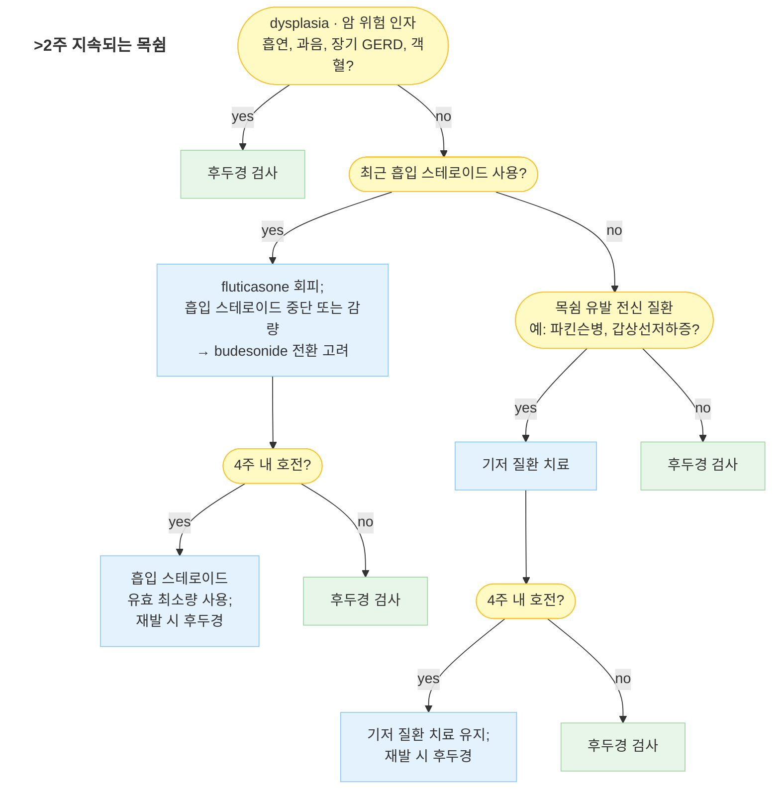

```mermaid
graph TD
    Title[<b>&#60;2주 목쉼</b>]
    style Title fill:none,stroke:none,font-size:18px

    Start([최근 목소리 남용 또는<br/>URI · 알레르기 증상 이력?])

    Start -- yes --> A[Voice rest,<br/>대증 치료]
    Start -- no --> B([최근 위식도 또는<br/>인후두역류 증상?])

    A --> A1([2주 내 호전?])
    A1 -- yes --> A2[대증 치료 유지;<br/>재발 시 후두경]
    A1 -- no --> A3[후두경 검사]

    B -- yes --> C[고용량 PPI<br/>단기 시험 치료]
    B -- no --> D[2주간 지지요법 &<br/>vocal hygiene;<br/>호전 없으면 후두경 고려]

    C --> C1([4주 내 호전?])
    C1 -- yes --> C2[PPI 치료 유지;<br/>재발 시 후두경]
    C1 -- no --> C3[후두경 검사]

    classDef yellow fill:#FFF9C4,stroke:#FBC02D;
    classDef blue fill:#E3F2FD,stroke:#90CAF9;
    classDef green fill:#E8F5E9,stroke:#A5D6A7;

    class Start,B,A1,C1 yellow;
    class A,A2,C,C2,D blue;
    class A3,C3 green;
```

# 목쉼 (쉰 목소리) Hoarseness (Dysphonia)

## <mark style="color:green;">일반 사항</mark>

* 목소리의 질(quality), 음조(pitch), 음량(loudness), 발성 노력(vocal effort) 등의 변화를 총칭하는 증상; 의학 용어로는 **dysphonia**
* 성대(vocal fold)의 진동 이상 또는 공명·조음 과정의 변화로 발생
* 유병률 : 일생에 한 번 이상 경험하는 비율 약 30%; 직업적 성대 사용자(교사, 가수, 강사, 성직자 등)에서 발생률 현저히 높음
* 일차의료 내원 원인 중 흔한 호소 증상; 대부분 양성 경과이나 악성 종양의 초기 증상일 수 있어 지속 기간에 따른 단계적 평가 필요

#### <mark style="color:$primary;">음성의 분류</mark>

<table><thead><tr><th width="160">음성 특성</th><th width="220">주요 원인</th><th>비고</th></tr></thead><tbody><tr><td>기식성(breathy)</td><td>성대 폴립, 성대 마비, 성대 위축</td><td>성대 불완전 폐쇄</td></tr><tr><td>조이는(strained)</td><td>경련성 발성장애(spasmodic dysphonia)</td><td>내전형이 가장 흔함</td></tr><tr><td>거친/쉰(rough/harsh)</td><td>성대 결절, 성대부종, 급·만성 후두염</td><td>불규칙 진동</td></tr><tr><td>떨리는(tremulous)</td><td>본태성 진전, 파킨슨병</td><td>신경학적 원인 의심</td></tr><tr><td>저음화</td><td>갑상선저하증, 안드로겐 과다, 성대 부종</td><td>전신 원인 평가</td></tr><tr><td>음역 축소·피로</td><td>기능성 발성장애, 성대 결절 초기</td><td>직업적 성대 사용자에서 흔함</td></tr></tbody></table>

***

## <mark style="color:green;">원인</mark>

#### <mark style="color:$primary;">급성 원인</mark>

<table><thead><tr><th width="200">원인</th><th>세부</th></tr></thead><tbody><tr><td>급성 후두염</td><td>바이러스(가장 흔함), 세균 (☞ <a href="../223_/063_-laryngitis.md">후두염</a>)</td></tr><tr><td>성대 출혈</td><td>목소리 과사용, 잘못된 발성, 항응고제 사용</td></tr><tr><td>후비루</td><td>부비동염, 알레르기 (☞ <a href="053_-rhinosinusitis-sinusitis.md">부비동염</a>)</td></tr><tr><td>위식도역류 / 인후두역류</td><td>위산, 인두 자극 (☞ <a href="../224_/081_-gerd.md">위식도역류질환</a>)</td></tr><tr><td>경부 외상</td><td>직접 외상, 삽관 후</td></tr><tr><td>갑상선 질환</td><td>갑상선저하증 (☞ <a href="../226_/105_-hypothyroidism.md">갑상선저하증</a>)</td></tr><tr><td>정신적 원인</td><td>기능성 발성장애, hysterical aphonia (☞ <a href="../221_/031_-somatic-symptom-disorder.md">신체증상장애</a>)</td></tr></tbody></table>

#### <mark style="color:$primary;">만성 원인</mark>

<table><thead><tr><th width="200">원인</th><th>세부</th></tr></thead><tbody><tr><td>만성 후두염</td><td>바이러스, 세균, 흡연, 만성 자극</td></tr><tr><td>성대 결절 (vocal nodule)</td><td>목소리 과사용·잘못된 사용 → 양측성, 대칭성</td></tr><tr><td>성대 폴립 (vocal polyp)</td><td>과사용, 흡연, 알레르기 → 편측성이 많음</td></tr><tr><td>악성 종양</td><td>성문암(squamous cell carcinoma), 갑상선암의 되돌이후두신경 침범</td></tr><tr><td>Recurrent respiratory papillomatosis</td><td>HPV 6/11형; 소아형 및 성인형</td></tr><tr><td>성대 마비 (vocal fold paralysis)</td><td>종양(폐암·식도암·갑상선암), 외상, 수술, 뇌경색, 퇴행성 질환</td></tr><tr><td>인후두역류 (LPR)</td><td>만성 위산 자극</td></tr></tbody></table>

#### <mark style="color:$primary;">약물 유발 목쉼</mark>

* coumadin, thrombolytics, PDE5 억제제 : 성대 출혈(vocal fold hematoma)
* bisphosphonate : 화학적 후두염
* ACE 억제제 : 만성 기침 → 성대 자극
* 항히스타민제, 항콜린제, 이뇨제 : 점막 건조
* 항정신병제 : 후두 근긴장이상증(laryngeal dystonia)
* 흡입 스테로이드 : 용량 의존성 점막 자극; 진균성 후두염 — fluticasone에서 특히 빈번, budesonide 전환 권장

***

## <mark style="color:green;">임상 양상</mark>

* 목소리 변화 : 쉰 소리, 거칠어짐, 기식성(바람 새는 소리), 음조 저하 또는 불안정, 음역 좁아짐, 발성 시 노력 증가
* 발성 피로 : 말을 지속할수록 목소리가 점점 떨어지거나 사라짐 → 성대 결절·기능성 발성장애에서 특징적
* 동반 증상 : 목 이물감, 기침, 후비루, 연하 시 불편감, 인후통
* **완전 실성증(aphonia)** : 성대 마비, 기능성 발성장애, 중증 후두염에서 발생 가능
* 성대 출혈 시 : 발성 노력 중 갑작스런 음질 소실 ± 통증 → 즉각 성대 안정 필요

### <mark style="color:$danger;">🚩 Red Flags!</mark>

<mark style="color:$danger;">**즉각 조치 또는 의뢰**</mark> <mark style="color:$danger;">- 기도 위험 또는 급성 생명 위협</mark>

* 흡기 시 협착음(stridor) + 호흡 곤란 → 성대 부종·후두개염·기도 폐쇄 의심, 응급 처치
* 급성 삼킴 장애 + 흡인 의심 (사레, 기침, 발열 동반) → 흡인성 폐렴 위험
* 성대 출혈 후 즉각적 기도 폐쇄 증상

<mark style="color:$warning;">**당일 또는 조기 의뢰**</mark>

* 객혈 (hemoptysis) 동반
* 목의 종괴 (경부 림프절 종대 포함)
* 편측 이통 (귀는 정상인데 한쪽 귀 통증) → 후두·하인두 악성 종양의 연관통
* 빠른 진행 또는 삼킴 곤란 동반 → 악성 종양 또는 신경학적 원인 의심
* 방사선 치료 후 발생 또는 경부 수술·기관삽관 후 발생 → 성대 마비·반흔 손상 의심

<mark style="color:$info;">**외래 추적 / 추가 평가 계획**</mark> <mark style="color:$info;">- 즉각 위험 낮으나 호전 없으면 후두경 검사 의뢰</mark>

* 6주 이상 지속 (기간 중 무증상 상태 없음) → 후두암 선별 검사 권고 (국가암정보센터)
* 흡연 또는 과음력 있는 환자에서 2주 이상 지속
* 보존적 치료 4~6주 후에도 호전 없음
* 설명할 수 없는 체중 감소 또는 전신 쇠약 동반

***

## <mark style="color:green;">진단</mark>

### <mark style="color:orange;">검사</mark>

* **후두경 검사 (laryngoscopy)** : 목쉼 원인의 직접 관찰을 위한 일차 검사
  * 음성 치료 시작 전 반드시 시행하여 기질적 병변 여부 확인
  * \[AAO-HNSF 2018] 3개월 이상 지속되거나 심각한 기저 질환 의심 시 후두경 검사 권고; 후두경을 시행하지 않은 환자에게 경험적 치료를 단독으로 적용하지 않을 것 권고
  * \[국가암정보센터] 6주 이상 지속되는 원인 불명의 목쉰 소리에 대하여 후두암 검사 권고
  * dysplasia 고위험군(흡연, heavy alcohol use, 객혈)은 2주 이상 지속 시 조기 후두경 검사를 권장하는 견해가 있음
* **CT / MRI** : 후두경 소견 이상 확인 후 종양 병기, 성대 마비 원인 추적 시 고려
* **갑상선 기능 검사** : 저음화, 전신 무력감 동반 시
* **음성 분석 (acoustic analysis)** : 전문 음성 클리닉에서 음성 질 정량 평가


✽URI 후 1주간 목쉼이 지속될 수 있으며, 이 경우 경과 관찰이 우선이다.\
✽속삭임은 성대 긴장을 오히려 높이므로 쉰 목소리 회복에 도움이 되지 않는다.


***





<p align="center"><strong>목쉼 평가 및 관리 알고리듬</strong></p>

<p align="center"><em><mark style="color:$info;">Ref. Am Fam Physician 2017;96(11). AAO-HNSF Clinical Practice Guideline: Hoarseness (Dysphonia), 2018</mark></em></p>

***

## <mark style="background-color:$warning;">Management</mark>


**치료 원칙**\
⓵ 원인 질환 치료가 우선\
⓶ 음성 위생(vocal hygiene) 및 음성 치료는 거의 모든 환자에게 권고\
⓷ 명확한 적응증 없이 PPI, 경구 스테로이드, 항생제를 경험적으로 처방하지 않을 것 (AAO-HNSF 2018 Strong recommendation)\
⓸ 성대 결절·기능성 발성장애는 음성 치료(speech-language therapy)가 1차 치료


### <mark style="color:orange;">치료 방침</mark>

* 원인 치료 (후두염 → 보존적, 역류 → PPI, 종양 → 의뢰, 성대 마비 → 원인 추적)
* 음성 치료 (발성법·목 관리법) : 성대 결절, 기능성 발성장애, 직업적 성대 손상에서 1차 치료
* 보톡스 주사 : 경련성 발성장애
* 수술 : 성대 폴립, 성문암, papilloma 등

***

## <mark style="color:green;">비-약물 치료 및 음성 위생</mark>

**수분 및 환경**

* 하루 1.5~2 ℓ 이상 수분 섭취; 실내 가습 유지 (습도 40~60%)
* 냉·난방 기기(특히 선풍기, 온풍기) 직접 노출 회피
* 흡연, 먼지, 화학적 호흡기 자극 물질 회피

**발성 습관**

* 헛기침(throat clearing) 및 과도한 기침 자제 → 성대에 물리적 충격
* 고성, 소리 지름, 속삭임, 크거나 센 웃음 자제
  * ✽속삭임은 성대 긴장을 높이므로 성대 회복에 도움이 되지 않음
* 직업적 성대 사용자 : 증폭 장치(마이크) 사용 권장; 발성 후 충분한 휴식

**식이**

* 후두 분비물 증가 및 성대 건조 유발 음식 회피 : 설탕, 커피, 고지방식, 유제품, 탄산음료
* GERD·LPR 유발 음식 회피 : 과식, 카페인, 음주, 신 음식, 탄산음료
* 취침 2~3시간 전 음식 섭취 금지 (LPR 예방)

**이완 훈련**

* 목·어깨·호흡근 이완 훈련; 횡격막 호흡 연습

***

## <mark style="color:green;">약물 치료</mark>


⚠️ **AAO-HNSF 2018 권고** : 후두경으로 원인 확인 전, 만성 목쉼에 대한 경험적 항생제 또는 경구 스테로이드 처방을 권장하지 않음. PPI도 LPR 또는 GERD가 명확히 의심되는 경우에만 시험적 투여.


### <mark style="color:orange;">흡입 스테로이드 (성대 국소 항염)</mark>

* budesonide 흡입제 <mark style="color:blue;">\[풀미코트 터부헬러]</mark> : 성문 부위 직접 도달 효과; 성대 부종·염증 감소에 활용
  * ✽fluticasone은 성대 자극·진균성 후두염 유발 위험이 높아 회피; budesonide 선택 권장
  * 사용 후 입 헹굼 철저히 시행 (☞ [천식](../223_/071_-asthma.md#inhaled-corticosteroid-ics))

### <mark style="color:orange;">경구 / IM 스테로이드 (제한적 사용)</mark>

* 즉시 목소리가 필요한 직업인(가수, 강사 등)에 한해 단기·단회 고려
* 장기 또는 반복 사용은 금기

### <mark style="color:orange;">PPI (역류 관련 목쉼)</mark>

* 인후두역류(LPR) 또는 GERD가 의심되는 경우 시험적 치료
* omeprazole 40 ㎎ bid 또는 동등 용량 PPI : 최소 3개월 full-strength 투여
  * 단기 치료(<8주)는 효과 불충분; 충분한 기간 유지 필수
  * (☞ [인후두역류](../223_/062_-laryngopharyngeal-reflux-lpr.md), [위식도역류질환](../224_/081_-gerd.md))

### <mark style="color:orange;">근이완제 (기능성 발성장애 / 후두 근긴장이상)</mark>

* baclofen 5 ㎎ tid <mark style="color:blue;">\[바크론]</mark> : GABA-B 효현제; 후두·인두 평활근 이완 → 발성 장애·LPR 연관 증상에 보조적으로 사용

### <mark style="color:orange;">보톡스 주사 (경련성 발성장애)</mark>

* 내전형 경련성 발성장애(adductor spasmodic dysphonia) : 갑상피열근 내 botulinum toxin A 주사 → 전문 기관 의뢰

### <mark style="color:orange;">알레르기성 원인 (후비루 동반)</mark>

* 2세대 항히스타민/항류코트리엔 : azelastine + fluticasone propionate 비강 스프레이 <mark style="color:blue;">\[리노에바스텔]</mark> 등
* ✽항히스타민제 단독은 점막 건조 효과로 성대 건조를 악화시킬 수 있으므로 수분 섭취와 병행

***

### <mark style="color:red;">질병코드</mark>

R49.0 목쉼 (Hoarseness)

J37.0 만성 후두염

J04.0 급성 후두염

***

## <mark style="color:purple;">처방례</mark>

> **처방례 1. 급성 후두염 / 음성 과사용 (2주 미만)**
>
> ```
> 풀미코트 터부헬러 200 ㎍/puff  1 puff  bid
> 바크론 5 ㎎/T  3T  #3
> ```
>
> _✽성대 안정(voice rest)과 충분한 수분 섭취 병행. 2주 이내 호전 없으면 후두경 검사 의뢰._

> **처방례 2. 인후두역류 (LPR) / 위식도역류 관련**
>
> ```
> 오엠피 40 ㎎/T  1T  bid  (보험기준 주의)
> 가나칸 50 ㎎/T  3T  #3
> ```
>
> _✽PPI는 최소 3개월 full-strength 지속 투여. 취침 2~3시간 전 음식 섭취 금지, LPR 식이 관리 병행. 4주 내 호전 없으면 후두경 검사._

> **처방례 3. 알레르기비염 / 후비루 관련 목쉼**
>
> ```
> 리노에바스텔 나잘 스프레이  각 비공 2회  qd 저녁
> 바크론 5 ㎎/T  3T  #3
> ```
>
> _✽알레르기비염 치료로 후비루 감소 → 성대 자극 완화. 점막 건조 예방을 위해 수분 섭취를 강조할 것._

> **처방례 4. 직업적 성대 사용자 (교사, 강사 등) — 단기 발성 회복**
>
> ```
> 풀미코트 터부헬러 200 ㎍/puff  1 puff  bid
> 바크론 5 ㎎/T  3T  #3
> (필요 시 단기 경구 스테로이드 병용 — 당일 발성이 불가피한 경우에 한해 1회)
> ```
>
> _✽경구 스테로이드는 즉각적인 발성이 반드시 필요한 경우(공연·중요 강의)에만 제한적 고려. 반복 사용은 금기. 근본적으로는 발성 습관 교정 및 음성 치료 의뢰._

***

### <mark style="color:$success;">핵심 복약 지도</mark>

> **흡입 스테로이드 (풀미코트 터부헬러)**
>
> 1. 성대 및 기관지 점막의 염증을 줄이는 흡입 약입니다.
> 2. 사용 후 반드시 입을 헹궈 주십시오 — 헹구지 않으면 구강 및 목에 진균(곰팡이) 감염이 생길 수 있습니다.
> 3. 쉰 목소리 자체가 오래 지속되면 효과를 보기 어려우므로, 4주 이상 사용해도 호전이 없으면 이비인후과 전문의 진찰을 받으십시오.

> **바크론 (baclofen, 근이완제)**
>
> 1. 목과 식도 근육의 긴장을 풀어 발성 시 불편감을 줄이는 보조 약입니다.
> 2. 졸음, 어지러움이 나타날 수 있으므로 운전이나 기계 조작에 주의하십시오.
> 3. 갑자기 복용을 중단하지 말고, 담당 의사와 상의하며 용량을 조절하십시오.

> **PPI (오엠피 등, 역류 관련 목쉼)**
>
> 1. 위산이 목에 역류하여 성대를 자극하는 것을 줄이는 약입니다.
> 2. 식사 30분 전에 복용하는 것이 가장 효과적입니다.
> 3. 효과가 나타나는 데 **최소 4~8주, 충분한 효과를 보려면 3개월 이상** 꾸준히 복용해야 합니다 — 증상이 조금 나아졌다고 일찍 중단하면 재발합니다.
> 4. 취침 2~3시간 전에는 음식 섭취를 피하고, 취침 시 상체를 약간 높이는 것도 도움이 됩니다.

> **언제 다시 병원을 방문해야 하나요?**
>
> * 2주 이상 치료해도 목쉰 소리가 호전되지 않는 경우
> * 숨이 차거나, 음식을 삼키기 어렵거나, 목에 혹이 만져지는 경우 — **즉시 내원**
> * 피가 섞인 가래가 나오는 경우 — **즉시 내원**
> * 흡연·음주력이 있고 6주 이상 지속되는 경우 (후두암 선별 검사 필요)

***

### <mark style="color:blue;">환자 안내서</mark>


**목쉼(쉰 목소리), 왜 생기고 어떻게 관리할까요?**

목쉰 소리는 성대(목소리를 만드는 두 개의 근육 주름)에 이상이 생겼을 때 나타납니다. 대부분은 바이러스 감염이나 목소리 과사용으로 인한 일시적인 현상이지만, 6주 이상 지속된다면 반드시 이비인후과 진찰이 필요합니다.


#### <mark style="color:$primary;">왜 목이 쉬나요?</mark>

* 가장 흔한 원인은 **감기(바이러스 후두염)**와 **목소리 과사용**입니다.
* 위에서 올라오는 위산이 목을 자극하는 **역류(GERD, LPR)**도 흔한 원인입니다.
* 알레르기비염이나 부비동염에 의한 **후비루(콧물이 목으로 넘어가는 것)**가 성대를 자극하기도 합니다.
* 드물게 성대에 혹이 생기거나(결절, 폴립) 후두암이 원인이 될 수 있으므로, 오래 지속되면 반드시 검사를 받아야 합니다.

#### <mark style="color:$primary;">일상에서 어떻게 관리하나요?</mark>

* **수분을 충분히 드십시오** — 하루 1.5~2 ℓ 이상의 물이 성대 점막을 촉촉하게 유지합니다.
* **목을 쉬게 하십시오** — 불필요한 대화를 줄이고, 소리를 지르거나 크게 웃는 것을 삼가십시오.
* **속삭임은 오히려 좋지 않습니다** — 속삭일 때 성대에 더 많은 긴장이 가해집니다.
* **헛기침을 자제하십시오** — 목을 가다듬는 습관은 성대에 반복적 충격을 줍니다. 대신 물을 한 모금 마시십시오.
* **흡연은 성대를 직접 손상시킵니다** — 금연이 가장 중요한 예방법입니다.
* **역류가 원인이라면** 취침 2~3시간 전 음식을 피하고, 커피·술·탄산음료·신 음식을 줄이십시오.
* 실내 가습기를 사용하고, 선풍기·온풍기 바람이 직접 얼굴에 닿지 않도록 하십시오.

#### <mark style="color:$primary;">약은 어떻게 써야 하나요?</mark>

* 흡입 스테로이드를 처방받으셨다면 **사용 후 반드시 입을 헹궈 주십시오**.
* 역류 관련 약(PPI)은 **식전 30분에 복용**하고, 최소 3개월은 꾸준히 드셔야 효과가 납니다.
* 의사가 처방하지 않은 항생제나 스테로이드를 자의로 복용하는 것은 도움이 되지 않습니다.

#### <mark style="color:$primary;">이럴 때는 즉시 병원을 방문하세요</mark>

* **숨을 쉴 때 쌕쌕거리거나 숨이 차오를 때** — 응급입니다
* **피가 섞인 가래가 나올 때**
* **음식을 삼키기 어려울 때**
* **목에 혹이 만져질 때**
* **6주 이상 목이 쉰 상태가 지속될 때** (특히 흡연자·음주자)
