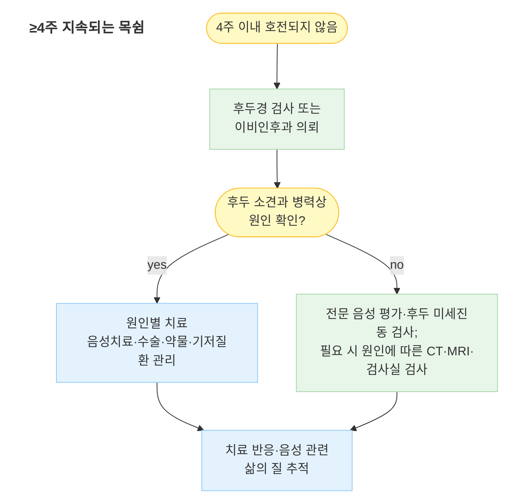

# 목쉼 Hoarseness, Dysphonia

## <mark style="color:green;">일반 사항</mark>

* 발성장애(dysphonia) : 음성의 질(quality), 음조(pitch), 음량(loudness), 발성 노력(vocal effort)의 변화로 의사소통 또는 음성 관련 삶의 질이 저하된 상태; 목쉼(hoarseness)은 이 중 거칠고 쉰 음질을 기술하는 표현
* 주로 성대(vocal fold)의 진동·폐쇄 이상 또는 후두의 기능 이상으로 발생; 조음장애(dysarthria)나 공명장애와는 구분
* 유병률 : 일생에 한 번 이상 경험하는 비율 약 30%; 직업적 성대 사용자(교사, 가수, 강사, 성직자 등)에서 발생률 현저히 높음
* 일차의료 내원 원인 중 흔한 호소 증상; 대부분 양성 경과이나 악성 종양의 초기 증상일 수 있어 지속 기간 및 위험 인자에 따른 단계적 평가 필요
* 소아 : 출생 직후부터 약한 울음·기식성 음성이 있으면 선천성 후두 격막(laryngeal web), 성대 마비 등을 감별; 후두연화증(laryngomalacia)은 목쉼보다 흡기성 협착음(stridor)이 전형적; 재발성 호흡기 유두종증(recurrent respiratory papillomatosis, HPV 6/11)은 진행성 목쉼과 호흡 곤란을 유발할 수 있음

## <mark style="color:green;">원인</mark>

#### <mark style="color:$primary;">급성 원인</mark>

<table><thead><tr><th width="215">원인</th><th>세부</th></tr></thead><tbody><tr><td>급성 후두염</td><td>바이러스가 가장 흔함; 세균성은 드묾 (☞ <a href="../223_/063_-laryngitis.md">후두염</a>)</td></tr><tr><td>성대 출혈</td><td>고성·과도한 발성, 항응고제 사용; 소리를 지르거나 노래한 직후 갑작스런 목소리 변화·실성</td></tr><tr><td>상기도 자극</td><td>알레르기비염·부비동염에 동반된 기침·헛기침·후비루가 발성 증상을 악화할 수 있음 (☞ <a href="053_-rhinosinusitis-sinusitis.md">부비동염</a>)</td></tr><tr><td>경부 외상 / 기관삽관 후</td><td>직접 외상, 삽관에 따른 후두 점막 손상·육아종·성대 운동장애</td></tr><tr><td>기능성 음성장애</td><td>기능성 실성증(functional aphonia), 급성 스트레스 관련 음성 변화 등; 신체증상장애와 동일한 진단은 아님</td></tr></tbody></table>

#### <mark style="color:$primary;">만성 원인</mark>

<table><thead><tr><th width="215">원인</th><th>세부</th></tr></thead><tbody><tr><td>근긴장성 발성장애(MTD)</td><td>흔한 기능적 원인; 일차성 또는 다른 성대 병변에 이차적으로 발생; 후두 주변근 과긴장·발성 피로</td></tr><tr><td>성대 결절(vocal nodule)</td><td>목소리 과사용·잘못된 사용 → 대개 양측성·대칭성; 교사·가수에서 흔함</td></tr><tr><td>성대 폴립(vocal polyp)</td><td>음성 외상, 흡연 등과 연관; 편측성이 많음</td></tr><tr><td>Reinke 부종</td><td>흡연과 강하게 연관; 저음화 + 거친 목소리</td></tr><tr><td>노인성 음성 위축(presbyphonia)</td><td>성대 근육·점막 위축과 성문 폐쇄부전 → 기식성 음성·발성 피로</td></tr><tr><td>만성 후두염</td><td>흡연·흡입 자극 물질, 반복되는 음성 외상, 감염·염증 등</td></tr><tr><td>GERD / LPR 관련</td><td>전형적 역류 증상 또는 객관적 근거와 함께 판단; 목쉼만으로 진단하지 않음 (☞ <a href="../224_/081_-gerd.md">위식도역류질환</a>)</td></tr><tr><td>내분비 질환</td><td>갑상선저하증 등 (☞ <a href="../226_/105_-hypothyroidism.md">갑상선저하증</a>)</td></tr><tr><td>악성 종양</td><td>성문암(대개 편평세포암), 갑상선암·폐암·식도암 등에 의한 되돌이후두신경(RLN) 침범</td></tr><tr><td>재발성 호흡기 유두종증</td><td>HPV 6/11형; 소아형 및 성인형</td></tr><tr><td>성대 마비(vocal fold paralysis)</td><td>종양, 갑상선·흉부·심장 수술 후 RLN 손상, 중추신경계·신경근육 질환; 원인 불명도 있음</td></tr><tr><td>경련성 발성장애(spasmodic dysphonia)</td><td>국소 후두 근긴장이상증</td></tr></tbody></table>

#### <mark style="color:$primary;">약물 유발 목쉼</mark>

* 흡입 스테로이드(ICS) : 용량·흡입기 종류·흡입법과 관련된 후두 침착으로 점막 자극, 성문 폐쇄 이상, 드물게 후두 근육병증·진균성 후두염을 유발할 수 있음; 특정 성분이 일관되게 더 안전하다고 단정하기 어려움
* warfarin·DOAC·혈전용해제 등 : 음성 외상 시 성대 출혈 위험을 높일 수 있음; 갑작스런 심한 목소리 변화·실성 시 즉시 발성을 중단하고 신속히 이비인후과 의뢰
* 테스토스테론·danazol 등 안드로겐성 약물 : 특히 여성에서 저음화 등 음성 변화가 비가역적일 수 있음
* PDE5 억제제·bisphosphonate : 각각 성대 혈종·화학적 후두염이 드물게 보고됨; 인과 근거는 제한적
* ACE 억제제 : 만성 기침 → 성대 반복 자극
* 항히스타민제, 항콜린제, 이뇨제 : 점막 건조
* 항정신병제 : 후두 근긴장이상증(laryngeal dystonia)

## <mark style="color:green;">임상 양상</mark>

* 목소리 변화 : 쉰 소리, 거칠어짐, 기식성(바람 새는 소리), 음조 저하 또는 불안정, 음역 좁아짐, 발성 시 노력 증가
* 발성 피로(vocal fatigue) : 말을 지속할수록 목소리가 점점 떨어지거나 사라짐 → MTD, 성대 결절 초기, 신경근육 질환에서 특징적
* 동반 증상 : 목 이물감, 기침, 후비루, 연하 시 불편감, 인후통
* 완전 실성증(aphonia) : 기능성 실성증, 중증 후두염, 성대 출혈 등; 일측 성대 마비는 대개 기식성·약한 음성으로 나타남
* 속삭임은 되는데 발성이 안 되는 양상은 기능성 음성장애를 시사할 수 있으나 단독 진단 소견은 아님

### <mark style="color:$danger;">🚩 Red Flags!</mark>

<mark style="color:$danger;">**Tier 1 - 즉각 응급 조치 및 이송, 필요시 119 호출**</mark>

* 흡기성 협착음(stridor) + 호흡 곤란·저산소증·청색증·의식 변화 → 후두 부종·후두개염·양측 성대마비·기도 폐쇄 가능
* 침 또는 분비물을 삼키지 못함, 침흘림, 급격히 진행하는 연하곤란과 호흡곤란 → 급성 상기도 폐쇄 위험
* 목쉼과 함께 새로 발생한 편측 마비·안면마비·심한 운동실조·의식 변화 등 급성 신경학적 결손 → 뇌졸중 등 감별

<mark style="color:$warning;">**Tier 2 - 당일~수일 내 평가**</mark>

* 소리를 지르거나 노래한 직후 갑작스런 심한 목소리 변화·실성 → 성대 출혈 의심; 즉시 음성 휴식 후 신속한 후두경 평가
* 객혈·후두 출혈 의심, 경부 종괴·림프절 종대, 설명되지 않는 체중 감소
* 귀 진찰은 정상인데 지속되는 편측 이통 → 후두·하인두 악성 종양의 연관통 가능
* 빠르게 진행하거나 연하통·연하곤란이 동반된 목쉼
* 최근 두경부·갑상선·흉부·심장 수술, 기관삽관 또는 경부 방사선 치료 후 발생 → 성대 손상·RLN 손상 가능
* 반복되는 사레·약한 기침·흡인 또는 흡인성 폐렴이 동반된 목쉼 → 성대 마비·성문 폐쇄부전 가능
* 점진적으로 악화되는 발성 피로 + 연하 곤란 → 신경근육 질환(ALS, MG 등)
* 목쉼 + 구음장애(dysarthria) 또는 복시(diplopia) 동반 → 중증근무력증(MG) 또는 뇌줄기 병변 의심
* 흡연력 또는 직업적 음성 사용자가 지속되거나 업무 수행을 방해하는 목쉼을 호소함

<mark style="color:$info;">**Tier 3 -  외래 추적 관찰**</mark>

* 명확한 상기도감염·일시적 음성 과사용 후 발생하고 위험 소견이 없는 4주 미만의 목쉼 → 상대적 음성 휴식·수분 섭취·자극 회피 후 경과 관찰
* 4주 이내에 호전되지 않거나 악화되면 후두경 검사 또는 이비인후과 의뢰
* 치료 후 반복 재발하거나 원인이 불명확하면 4주 이전이라도 후두경 검사를 고려

## <mark style="color:green;">진단</mark>

### <mark style="color:orange;">검사</mark>

* 후두경 검사(laryngoscopy) : 목쉼 원인 파악을 위한 일차 시각화 검사
  * 4주 이내에 호전되지 않으면 후두경 검사 또는 이비인후과 의뢰; 중대한 원인이 의심되면 기간과 무관하게 조기 시행
  * 후두경 없이 지속성 목쉼에 경험적 치료만 반복하지 말 것
  * 음성 치료 시작 전 시행하여 기질적 병변과 성대 운동장애 여부를 확인하고 결과를 음성치료사에게 전달
  * 최근 두경부·흉부 수술 또는 기관삽관, 경부 종괴, 호흡곤란·stridor, 흡연력, 직업적 음성 사용자는 신속한 후두 평가 고려
* 후두 미세진동 검사(videostroboscopy) : 성대 점막 파동(mucosal wave)과 진동 대칭성을 평가; 일반 후두경으로 원인이 명확하지 않은 미세 점막 병변, 성대 흉터·결절·폴립, 성문 폐쇄부전 평가와 음성 치료 전·후 비교에 유용; 암 확진은 조직검사가 필요
* CT / MRI : 후두경 이상 소견 확인 후 종양 병기·성대 마비 원인 추적 시 고려
* 갑상선 기능 검사 : 저음화, 전신 무력감 동반 시
* 음성 분석(acoustic analysis) : 전문 음성 클리닉에서 음성 질 정량 평가; MTD·직업적 발성 장애 평가에 유용


**상기도감염 후** 목쉼은 대개 1~2주 이내 호전되지만, 위험 소견이 없더라도 4주 이내에 호전되지 않으면 후두경 검사 또는 의뢰\
**발성**은 완전한 침묵보다 무리하지 않는 상대적 음성 휴식이 일반적이며, 힘주어 속삭이지 말고 편안하고 작은 음량으로 짧게 말함


### <mark style="color:orange;">감별</mark>

* 소리 지름(shouting) 직후 갑작스런 실성(aphonia) → 성대 출혈
* 기식성 음성(바람 새는 소리) + 기침 약함 + 흡인 경향 → 성대 불완전 폐쇄 -  성대 마비, 노인성 음성 위축(presbyphonia)
* 조이는/쥐어짜는 소리, 말할 때만 악화 → 경련성 발성장애, MTD
* 거친 소리 + 음성 남용 병력 → 성대 결절, 성대 폴립, 만성 후두염
* 저음화 + 흡연력 → Reinke 부종; 갑상선저하증·성대 부종도 감별
* 떨리는 목소리(리듬적 변화) → 본태성 음성진전; 파킨슨병은 저음량·단조로운 음조가 더 전형적
* 발성 피로, 말할수록 악화 → MTD, 성대 결절 초기, 신경근육 질환
* 발성 피로(fatigable) + 오후·저녁에 심해지는 일중 변동 → 중증근무력증(MG)
* 속삭임은 되는데 발성 불가 → 기능성 음성장애를 시사할 수 있으나 단독 진단 불가
* 갑상선·흉부·심장 수술 후 발생 → RLN 손상 / 성대 마비
* ICS 사용 중 발생 → 스테로이드 유발 dysphonia
* 후두 구조 정상 + 음성 피로·과긴장 → MTD → 음성 치료 의뢰


**흔한 진료 실수 (Pitfall)**

* LPR로 과잉 진단 → 불필요한 장기 PPI 처방
* 흡입 스테로이드(ICS)를 목쉼 치료제로 추가 처방 → ICS는 목쉼의 원인이지 치료가 아님
* 후두경 없이 경험적 치료만 지속&#x20;
* 흡연자·고위험군을 조기 평가하지 않거나, 일반 환자에서 4주를 넘겨 후두경 검사를 지연 → 중대한 후두 질환 진단 지연
* 경험적 항생제 사용 → 세균성 후두염은 드물며 근거 없음


***


```mermaid
graph TD
    Title[<b>&#60;4주 목쉼</b>]
    style Title fill:none,stroke:none,font-size:18px

    Start([Tier 1 응급 소견?])
    Start -- yes --> E[기도 확보·산소 공급 등<br/>응급 조치 후 이송;<br/>필요시 119]
    Start -- no --> R([Tier 2 위험 인자?<br/>출혈·종괴·연하곤란·체중 감소,<br/>흡연, 최근 수술·삽관 등])
    R -- yes --> L[당일~수일 내<br/>후두경 평가]
    R -- no --> A([명확한 상기도감염 또는<br/>일시적 음성 과사용?])
    A -- yes --> S[상대적 음성 휴식,<br/>수분·자극 회피,<br/>원인별 대증 치료]
    A -- no --> O[원인 평가 + 음성 위생;<br/>후두경 조기 고려]
    S --> F([4주 이내 호전?])
    O --> F
    F -- yes --> C[경과 관찰;<br/>재발 시 재평가]
    F -- no --> L2[후두경 검사]

    classDef yellow fill:#FFF9C4,stroke:#FBC02D;
    classDef blue fill:#E3F2FD,stroke:#90CAF9;
    classDef green fill:#E8F5E9,stroke:#A5D6A7;
    classDef red fill:#FFEBEE,stroke:#EF9A9A;

    class Start,R,A,F yellow;
    class S,O,C blue;
    class L,L2 green;
    class E red;
```


```mermaid
graph TD
    Title[<b>≥4주 지속되는 목쉼</b>]
    style Title fill:none,stroke:none,font-size:18px

    Start([4주 이내 호전되지 않음])
    Start --> L[후두경 검사 또는<br/>이비인후과 의뢰]
    L --> Q([후두 소견과 병력상<br/>원인 확인?])
    Q -- yes --> T[원인별 치료<br/>음성치료·수술·약물·기저질환 관리]
    Q -- no --> W[전문 음성 평가·후두 미세진동 검사;<br/>필요 시 원인에 따른 CT·MRI·검사실 검사]
    T --> F[치료 반응·음성 관련<br/>삶의 질 추적]
    W --> F

    classDef yellow fill:#FFF9C4,stroke:#FBC02D;
    classDef blue fill:#E3F2FD,stroke:#90CAF9;
    classDef green fill:#E8F5E9,stroke:#A5D6A7;

    class Start,Q yellow;
    class T,F blue;
    class L,W green;
```

<p align="center"><strong>목쉼 평가 및 관리 알고리듬</strong></p>

<p align="center"><em><mark style="color:$info;">저자 편집; Ref. AAO-HNSF Clinical Practice Guideline: Hoarseness (Dysphonia), Otolaryngol Head Neck Surg 2018;158(1 Suppl):S1–S42; AAO37 Dysphonia: Laryngeal Examination+ (2026)</mark></em></p>

***

## <mark style="background-color:$warning;">Management</mark>

### <mark style="color:orange;">치료 원칙</mark>

* 원인 질환 치료가 최우선
* 기본 음성 위생(vocal hygiene)은 모든 환자에게 권고하되, 지속성 목쉼의 구체적 음성 치료는 후두경 검사 후 원인에 맞춰 시행
* 경험적 항생제·전신 스테로이드·PPI는 명확한 적응증 없이 처방하지 않을 것
* MTD·성대 결절·기능성 음성장애 → 후두경으로 기질적 병변을 평가한 후 음성 치료(speech-language therapy)가 1차 치료; 약물로 대체 불가

### <mark style="color:orange;">진단별 치료 요약</mark>

<table><thead><tr><th width="200">진단</th><th width="185">1차 치료</th><th>약물·시술 역할</th></tr></thead><tbody><tr><td>급성 바이러스 후두염</td><td>상대적 음성 휴식, 수분·자극 회피</td><td>원칙적으로 약물 불필요; 항생제·전신 스테로이드 routine 사용 금지</td></tr><tr><td>MTD</td><td>후두경 평가 후 음성 치료</td><td>특이 약물치료 없음; 동반 질환은 별도 적응증에 따라 치료</td></tr><tr><td>성대 결절</td><td>음성 치료 + 발성 습관 교정</td><td>보존치료 실패 시 수술 고려</td></tr><tr><td>성대 폴립</td><td>음성 치료·관찰 또는 수술을 개별화</td><td>증상성 병변이 보존치료에 반응하지 않으면 수술 고려</td></tr><tr><td>Reinke 부종</td><td>금연·자극 회피</td><td>지속적 음성장애·기도 문제가 있으면 음성 치료 및 수술 고려</td></tr><tr><td>GERD 관련</td><td>일반 GERD 기준에 따른 생활습관 교정</td><td>전형적 GERD 증상 또는 객관적 근거가 있을 때 PPI 등 고려; 고립된 목쉼만으로 처방하지 않음</td></tr><tr><td>ICS 유발 dysphonia</td><td>흡입법·기기 점검, 최저 유효 용량</td><td>pMDI이면 spacer 고려; 천식·COPD 조절을 유지하며 성분·기기 변경 개별화</td></tr><tr><td>성대 마비</td><td>원인 평가 + 음성·연하 평가</td><td>회복 가능성에 따라 음성 치료, 주입 후두성형술, 갑상성형술·재신경화술 등</td></tr><tr><td>경련성 발성장애</td><td>Botulinum toxin 주사</td><td>경구 약물 효과는 제한적</td></tr><tr><td>Presbyphonia</td><td>음성 치료 + 발성 훈련</td><td>의미 있는 성문 폐쇄부전이 있으면 주입 후두성형술 고려</td></tr></tbody></table>

***

## <mark style="color:green;">비-약물 치료 및 음성 위생</mark>

**수분 및 환경**

* 탈수를 피하고 기저질환·수분 제한 지침 범위에서 충분한 수분 섭취; 건조한 환경에서는 적절한 실내 가습 고려
* 냉·난방 기기(선풍기, 온풍기) 직접 노출 회피; 흡연, 먼지, 화학적 호흡기 자극 물질 회피

**발성 습관**

* 헛기침(throat clearing) 및 과도한 기침 자제; 성대에 물리적 충격 대신 물 한 모금 섭취
* 고성·소리 지름·힘주어 속삭이기·과도한 웃음 자제; 편안하고 작은 음량으로 짧게 말함
* 직업적 성대 사용자 : 증폭 장치(마이크)를 사용하고 연속 발성 중 규칙적으로 휴식

**식이 및 역류 예방**

* 전형적 GERD 증상이 있으면 개인적으로 증상을 유발하는 음식·음료와 과음을 줄임
* 야간 역류가 있으면 취침 2\~3시간 전 식사를 피하고 침상 머리 쪽을 높이는 방법 고려

**음성 재활의 원칙(MTD·직업적 발성 장애·성대 결절 등)**

* 음성 치료 전 후두경 검사로 기질적 병변·성대 운동장애를 확인하고 결과를 음성치료사에게 전달
* 하품-한숨(yawn-sigh), 허밍(humming), 입술 떨기(lip trill), 빨대 발성(straw phonation) 등은 진단과 발성 양상에 따라 음성치료사가 개별 처방
* 성대 출혈·급성 손상 가능성이 있는 환자에게 진단 전 자가 발성 운동을 권하지 않음

***

## <mark style="color:green;">약물 치료</mark>


**AAO-HNSF(2018) 권고 :** 후두경으로 원인을 확인하기 전에 목쉼에 항생제·전신 스테로이드를 routine으로 처방하지 말 것.\
고립된 목쉼을 증상만으로 LPR/GERD에 귀속시켜 후두 시각화 없이 역류약을 처방하지 말 것.


#### <mark style="color:$primary;">경구 / IM 스테로이드</mark>&#x20;

* 목쉼 자체에 routine으로 사용하지 않으며, 특히 후두 시각화 전 경험적 처방을 피함
* 직업적 음성 사용자에서 공연 등이 임박한 예외적 상황에도 신속한 후두경 검사로 성대 출혈·감염·구조적 병변을 먼저 배제하고, 제한적인 이익과 전신 부작용 및 증상을 가려 추가 손상을 초래할 위험을 설명한 뒤 전문의 판단으로만 고려
* 성대 출혈 의심, 진균성 후두염 등에서는 사용하지 않으며 진단 불명 상태에서 반복 처방하지 않음
* 특정 용량·IM 요법을 목쉼의 표준 처방으로 권고할 근거는 부족하므로 원인 질환의 적응증·지침에 따름

#### <mark style="color:$primary;">PPI</mark>&#x20;

* 목쉼만 있는 환자는 증상만으로 LPR을 진단하거나 PPI를 경험적으로 처방하지 않음; 4주 이내 호전되지 않으면 PPI 반응을 기다리지 말고 후두경 평가
* heartburn·산 역류 등 전형적 GERD 증상이 함께 있으면 일반 GERD 지침에 따라 PPI 시험 치료를 고려할 수 있음; 전형적 증상 없이 후두 증상만 있으면 필요 시 경험적 PPI보다 객관적 역류검사를 우선 고려
* 지속적인 인후 증상에 대한 무작위시험에서 PPI가 위약보다 우수하지 않았으므로 반응이 없는데 장기 지속하지 않음(Ref. TOPPITS RCT, BMJ 2021; ACG GERD Guideline 2022) (☞ [인후두역류](../223_/062_-laryngopharyngeal-reflux-lpr.md), [위식도역류질환](../224_/081_-gerd.md))

#### <mark style="color:$primary;">ICS 유발 dysphonia 관리</mark>

* ICS는 목쉼의 치료제가 아니라 원인임
* ICS 사용 중 목쉼 발생 시 다음의 조치 고려
  * 흡입법과 순응도를 점검하고 사용 후 입과 목을 물로 헹군 뒤 뱉도록 지도
  * 천식·COPD 조절을 유지하는 최저 유효 용량으로 조정
  * 비-흡기 구동식 pMDI이면 spacer(보조흡입기) 사용 고려; DPI에는 spacer를 연결하지 않음
  * 천식·COPD 조절 상태, 등가 용량과 기기 사용 능력을 고려하여 성분·기기 변경을 개별화; 특정 ICS가 일관되게 더 안전하다고 단정하지 않음
  * 후두 칸디다증·점막 병변·성대 운동 이상을 감별하고, 지속되면 후두경 검사
* ICS를 목쉼 치료 목적으로 추가하거나 호흡기 질환 조절을 고려하지 않고 임의로 중단하지 않음

#### <mark style="color:$primary;">알레르기비염 / 후비루 관련</mark>

* 알레르기비염이 확인되면 비강 내 스테로이드(INCS) 또는 비강 내 항히스타민제(INAH), 필요 시 azelastine + fluticasone propionate 복합 비강 스프레이 <mark style="color:blue;">\[딜라스틴 나잘스프레이]</mark> 등으로 비염 자체를 치료
* 후비루는 목쉼의 단독 확진 원인이 아니며, 기침·헛기침 감소를 통해 성대 자극을 줄이는 보조적 접근임
* 전신 항히스타민제는 일부 환자에서 점막 건조를 악화시킬 수 있음

***

### <mark style="color:red;">질병코드</mark>

R49.0 목쉼 (Hoarseness)

J37.0 만성 후두염

J04.0 급성 후두염

***

## <mark style="color:purple;">처방례</mark>

> **처방례 1. 급성 바이러스 후두염 / 일시적 음성 과사용(4주 미만, 위험 소견 없음)**
>
> ```
> (약물 없이 상대적 음성 휴식 + 수분 섭취 + 흡연·자극 회피)
> ```
>
> _✽대부분의 급성 바이러스 후두염에서 항생제·전신 스테로이드·PPI는 불필요하다. 악화되거나 위험 소견이 발생하면 즉시 재평가하고, 4주 이내 호전되지 않으면 후두경 검사 또는 이비인후과 의뢰._

> **처방례 2. 전형적 GERD 증상이 동반된 목쉼**
>
> ```
> 오엠피 20 ㎎/T  1T  bid  식전 30~60분
> ```
>
> _✽Heartburn·산 역류 등 전형적 GERD 증상이 함께 있고 경고 증상이 없을 때 일반 GERD 지침에 따라 8~12주 시험 치료를 고려할 수 있다. 목쉼만으로 LPR을 진단해 처방하지 않으며, 목쉼이 4주 이내 호전되지 않으면 약물 반응을 더 기다리지 말고 후두경 검사 또는 의뢰. PPI 용량·기간은 GERD 중증도와 허가사항에 따라 개별화._

> **처방례 3. 알레르기비염이 확인되고 비강 증상이 동반된 목쉼**
>
> ```
> 딜라스틴 나잘스프레이  각 비공 1회  bid
> ```
>
> _✽비염 자체의 치료이며 목쉼 치료제로 직접 처방하는 약은 아니다. 사용 전 코를 풀고 고개를 약간 숙인 상태에서 비중격을 피해 바깥쪽 벽을 향해 분무한다. 제품별 허가사항 확인. 목쉼이 지속되면 별도로 후두 평가._

***

### <mark style="color:$success;">핵심 복약 지도</mark>

> **PPI (오엠피 등, 역류 관련 목쉼)**
>
> 1. 목쉼만으로 위산 역류를 단정해 복용하는 약이 아닙니다. 속쓰림·산 역류 등 전형적인 위식도역류 증상이 있을 때 담당 의사의 판단에 따라 사용합니다.
> 2. Omeprazole은 보통 **식사 30~60분 전** 복용합니다.
> 3. 야간 역류가 있으면 취침 2~3시간 전 식사를 피하고, 본인에게 증상을 유발하는 음식·음료와 과음을 줄이십시오.
> 4. 약을 복용 중이더라도 목쉼이 4주 이내 호전되지 않으면 담당 의사와 상의하여 후두경 검사를 받으십시오.

> **흡입 스테로이드(ICS) 사용 중 목쉼이 발생한 경우**
>
> 1. ICS는 목쉼 치료제가 아니라 천식·COPD 조절약이며, 임의로 줄이거나 중단하지 마십시오.
> 2. 사용 후 반드시 입과 목을 물로 헹구고 뱉으십시오.
> 3. 흡입기 사용법을 점검받으십시오. Spacer는 연결 가능한 정량분무식흡입기(pMDI)에만 사용하며, 터부헬러 같은 건조분말흡입기(DPI)에는 연결하지 않습니다.
> 4. 목쉼이 계속되면 담당 의사에게 알려 후두 칸디다증·점막 병변 등을 평가하고, 천식·COPD 조절을 유지하면서 용량·성분·기기 조정을 상의하십시오.

> **언제 다시 병원을 방문해야 하나요?**
>
> * 목쉰 소리가 4주 이내 호전되지 않는 경우
> * 숨을 들이쉴 때 목에서 거친 고음이 나거나 숨이 차고, 침을 삼키기 어렵거나 입술이 파래지는 경우 - **즉시 응급실 방문 또는 119 호출**
> * 피가 섞인 가래, 음식 삼키기 어려움, 목의 종괴, 설명되지 않는 체중 감소가 있는 경우 - **당일~수일 내 평가**
> * 소리를 지르거나 노래한 직후 갑자기 목소리가 심하게 변하거나 사라진 경우 - 즉시 말을 멈추고 **당일~수일 내 이비인후과 평가**
> * 흡연력이 있거나 최근 목·가슴 수술 또는 기관삽관 후 목쉼이 발생한 경우 - 조기 평가

***

### <mark style="color:blue;">환자 안내서</mark>


**목쉼(쉰 목소리), 왜 생기고 어떻게 관리할까요?**

목쉰 소리는 후두 안에서 진동해 소리를 만드는 한 쌍의 성대 점막에 염증·손상이 있거나 성대의 움직임과 진동이 달라졌을 때 나타납니다. 대부분은 바이러스 감염이나 목소리 과사용으로 인한 일시적 현상이지만, 4주 이내 호전되지 않거나 위험 신호가 있으면 후두경으로 성대를 확인해야 합니다.


#### <mark style="color:$primary;">왜 목이 쉬나요?</mark>

* 가장 흔한 원인은 감기(바이러스 후두염)와 **목소리 과사용**입니다.
* 위식도역류가 목쉼과 함께 나타날 수 있지만, **목쉼만으로 위산 역류를 원인이라고 단정할 수는 없습니다.**
* 알레르기비염이나 부비동염에 동반된 후비루·기침·헛기침이 성대를 자극하기도 합니다.
* 목과 후두 주변 근육이 과도하게 긴장된 근긴장성 발성장애(MTD)는 목소리가 쉽게 피로해집니다. 후두경 검사 후 원인에 맞춘 **음성 치료**가 도움이 됩니다.
* 드물게 성대에 혹이 생기거나(결절, 폴립), 후두암이 원인이 될 수 있으므로 오래 지속되면 반드시 검사를 받아야 합니다.

#### <mark style="color:$primary;">일상에서 어떻게 관리하나요?</mark>

* **탈수를 피하십시오** - 다만 심부전·신장질환 등으로 수분 제한을 지시받았다면 그 범위를 따르십시오.
* **목소리를 무리해서 사용하지 마십시오** - 불필요한 대화를 줄이고, 소리를 지르거나 크게 웃는 것을 삼가십시오.
* **연속으로 말하는 것을 삼가**고, 만약 불가피하다면 중간에 자주 물을 마시십시오.
* **힘주어 속삭이지 마십시오** - 꼭 말해야 한다면 편안하고 작은 음량으로 짧게 말하십시오.
* **헛기침을 자제하십시오** - 목을 가다듬는 습관은 성대에 반복적 충격을 줍니다. 대신 물을 한 모금 마시십시오.
* **흡연은 성대를 직접 손상시킵니다** - 금연이 가장 중요한 예방법입니다.
* 속쓰림·산 역류가 있다면 취침 2\~3시간 전 식사를 피하고, 본인에게 증상을 유발하는 음식·음료와 과음을 줄이십시오.

#### <mark style="color:$primary;">음성 운동은 검사 후 안내받으십시오</mark>

허밍, 입술 떨기, 빨대 발성 같은 운동은 일부 음성장애에 도움이 되지만 모든 목쉼에 같은 방법을 적용하지는 않습니다. 지속되는 목쉼은 먼저 후두경 검사를 받고, 필요한 경우 음성치료사에게 본인의 성대 상태에 맞는 방법을 배우십시오. 특히 소리를 지른 뒤 갑자기 목소리가 변한 경우에는 운동하지 말고 즉시 음성 휴식을 하십시오.

🚫 **피할 것** : 소리 지르기, 힘주어 속삭이기, 헛기침 반복, 흡연, 휴식 없는 연속 발성

#### <mark style="color:$primary;">이럴 때는 병원을 방문하세요</mark>

* **숨을 들이쉴 때 목에서 거친 고음이 나거나 숨이 차고, 침을 삼키기 어렵거나 입술이 파래질 때** - 즉시 응급실 방문 또는 119 호출
* **소리를 지르거나 노래한 직후 갑자기 목소리가 심하게 변하거나 사라진 경우** - 즉시 말을 멈추고 당일~수일 내 이비인후과 평가
* **피가 섞인 가래, 음식 삼키기 어려움, 목의 종괴, 설명되지 않는 체중 감소가 있을 때** - 당일~수일 내 평가
* **목쉼이 4주 이내 호전되지 않을 때** - 후두경 검사 또는 이비인후과 의뢰
* **흡연력이 있거나 최근 목·가슴 수술 또는 기관삽관 후 발생했을 때** - 증상 기간과 관계없이 조기 평가
