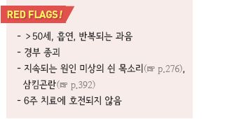
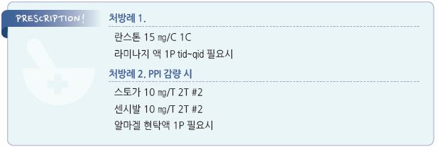

# 인후두역류 Laryngopharyngeal Reflux, LPR

## 일반 사항

*   refluxate(위장에서 역류된 acid, pepsin 등 효소, gas, liquid)가 인후두까지 역류됨으로써 발생하는 larynx 또는

    hypopharynx에서의 증상
*   유병률 : 24시간 dual sensor pH probe 검사상 증상이 있는 사람의 ½\~⅔, 증상이 없는 사람의 ⅓에서

    laryngopharyngeal reflux(LPR)가 관찰됨

> ✽원인과 기전에 대한 논란이 있으며, 알려진 것보다 흔하지 않을 수 있다는 주장이 있음

## 원인 및 기전

### 가설

*   상부 식도 괄약근 이완, 활동 시 복압 증가(예: bending over, Valsalva, exercise)에 의한 역류

    → refluxate의 후두 점막에 대한 직접 자극 또는 refluxate의 식도 자극에 의해 유발된 미주신경과 관련된 후두 반사 발생

    → 기침, 기관지 수축
* laryngeal epithelium은 산과 pepsin의 화학적 손상에 잘 적응하지 못함
* 인후두는 refluxate 제거를 잘 하지 못하므로 산과 pepsin이 오래 머무르며 인후두를 자극함

\*\* 원인에 대한 논란\*\*

* 산의 역류와 후두 증상 사이의 인과 관계를 보여 주는 확실한 증거가 없음
* GERD에 비하여 LPR 증상은 upright position에서 발생함
* 후두가 산에 노출되는 환자의 절반 이상에서 가슴쓰림 등 전형적인 증상이 나타나지 않음
* GERD보다 산에 대한 노출이 적음 (LPR 증상이 있는 환자의 ¾에서는 식도염이 없음)
* 식도 증상이 없는 LPR 증상이 위식도역류에 의한 것인지 모호함

## 임상 양상

* 쉰 목소리 또는 발성 장애 (＞⅔에서 발생)
* 가래가 없는 만성 기침 또는 목 청소 (½에서 발생)
* 가슴쓰림 (⅓에서 발생)
* 인두의 덩어리 느낌, 삼킴곤란
* 코 막힘

## 진단

* 유용한 진단 검사 방법 없음

### 검사

* esophageal pH testing
* 24시간 dual sensor pH probe : 산 역류에 대한 민감도/특이도가 높으나 LPR 증상 발현과 일치하지 않음
* 후두경 검사 : 후두 부종

### 감별

* 후비루(부비동염), 알레르기비염, 비-알레르기비염, 상부 호흡기 감염
* 목구멍 청소 습관, 과도한 음성 사용
* 온도 또는 기후 변화
* 흡연, 음주, 환경 자극

***

## Management

## 비-약물 치료

* 금연, 음주 제한
* 과식을 피함
* 식후 2시간 내 격렬한 운동/활동을 피함
* 취침 전 3시간 내 식사를 피함

#### 피할 음식

* 카페인 (괄약근 이완 작용) : 커피(디카페인 커피 포함), 페퍼민트, 스포츠 드링크
* 산성/매운 음식 (목에 대한 직접 자극) : 과일(특히 귤, 오렌지), 토마토, 잼, 젤리, 바베큐 소스, 샐러드드레싱

## 약물 치료

* 증상이 없는 LPR 환자에 대한 약물 치료는 권고하지 않음
* 산 분비 억제 : PPI, H2-차단제 (☞ p.377); GERD 증상이 없는 LPR 환자에서의 효과 논란

#### PPI

*   용량 : 저용량으로 시작 → 6~~8주 내 효과 없으면 증량 → 6~~8주 내 효과 없으면 중단 (반동 현상을 고려하여 6\~8주간

    tapering)

    •고용량 PPI 진단적 치료 : full strength로 1일 2회(예: omeprazole 40 ㎎ bid) 최소 3개월 투여;

    산 역류 감소 여부와 증상 개선의 정도가 일정하지 않음

    •GERD가 동반되어 있는 경우 GERD 치료 기준을 따름 (☞ p.406)
* 효과가 있는 환자들에서 용량을 줄이면 흔히 재발함
* 효과가 있는 경우 6개월간 치료

> ✽16주 고용량 투여가 위약과 효과 차이가 없었다는 보고가 있음

#### H2-차단제

* PPI 치료에 보조(예: PPI- 아침, H2-차단제- 취침 시) 또는 PPI 중단 시 대체제로 고려

#### 제산제

* 식사(특히 산성 식품) 후 30분 또는 역류가 예상되는 상황(예: 운동 전) (☞ p.376)

#### 기타

* 일부 환자에서 TCA(nortriptyline), 항경련제(gabapentin)가 유효
* PPI 등이 효과가 없을 때 또는 PPI 감량 시 고려
* nortriptyline : 10 ㎎ qd → 효과 없으면 20 ㎎ qd → 효과 없으면 중단 (6\~9주간 tapering) \[센시발]

> **질병코드** K21.0 식도염을 동반한 위-식도역류병

K21.9 식도염을 동반하지 않은 위-식도역류병

