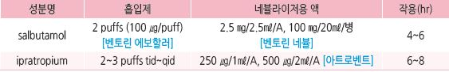

# 만성 기관지염 Chronic Bronchitis

* 2년에 걸쳐 1년에 ≥3개월 거의 매일 기침과 가래 증상이 있는 경우
* 만성적인 공기 흐름의 차단이 있는 경우는 COPD의 한 종류가 됨
* 임상 양상 : 급성 악화 시 가래 증가, 호흡 곤란 발생

***

## Management

### 치료 방침

* 금연, 대증 치료 (☞ p.284)
* COPD에 준하여 관리 (☞ p.360)

### 급성 악화기 치료

* 산소 호흡
* 항생제 (☞ p.293)
* steroid : prednisolone 30\~45 ㎎/d 단기 사용 \[소론도]
* β-작용제 흡입 : salbutamol (☞ p.349)
*   항콜린제 : ipratropium (☞ p.350)

    

> **질병코드** J41 단순성 및 점액화농성 만성 기관지염

J42 상세불명의 만성 기관지염

