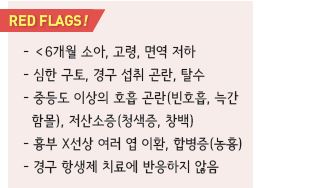
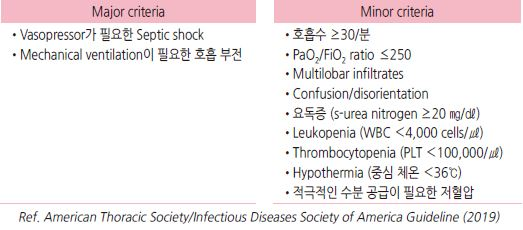
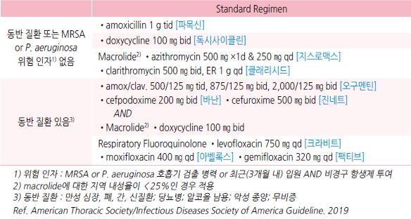
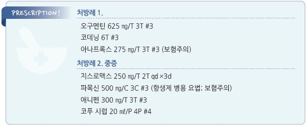

# 폐렴 Pneumonia


## 일반 사항

* 감염 등에 의해 발생하는 terminal bronchiole 이하 폐 실질 조직의 염증성 질환
*   경과 : 보통 상기도 감염 발생 수일 후 발병 → 2주 내 회복

    •적절한 치료 시 건강한 환자의 회복 기간 : 발열/빈호흡-3일, 백혈구 수준-4일, 기침/피로감-2주, 흉부 X선-1달
* 재발성 폐렴 : 영상 검사로 진단된 폐렴이 총 ≥3회 또는 ≥2회/년 발생; 기저 질환 감별을 요함

## 원인

*   바이러스 감염 : 폐렴의 \~40% 차지(소아에서는 \~90% 차지)

    •influenza, adenovirus, parainfluenza, coronavirus/SARS
*   세균 감염

    •typical(세균의 85%) : S. pneumoniae , H. influenzae , S. aureus, GAS, M. catarrhalis

    •atypical(세균의 15%) : Legionella sp., M. pneumoniae , C. pneumoniae
* 기타 : 흡인(이물, 위산), 알레르기, 약물, 방사선 치료

#### 상황별 주요 원인 세균

* 장기 입원, 보호시설 거주자 : 그람음성 균주(예: 녹농균)
* COPD, 흡연 : H. influenzae , P. aeruginosa , Legionella , S. pneumoniae
* 음주 : S. pneumoniae , 혐기성균, 그람음성균, 결핵균
* 젊은 성인, 여름/가을 : M. pneumoniae
* 냉방 노출 : Legionella
* 흡인, 불결한 치아 위생 : 혐기성, mixed flora

### 위험 인자

* 흡연
* 영양 결핍, 면역 저하
* 집단생활
* ＜5세, ＞65세
* 최근(6개월 내) 항생제 치료, 항생제 내성
* 최근 입원(90일 내 ≥2일)
*   기저 질환 : 만성 폐질환(천식, COPD, 기관지확장증), 흡인성 질환(GERD), PPI 장기 복용, 만성 심/신/간 질환, 당뇨병,

    신경계 질환, 알코올 남용, 무비증, 악성 종양

## 임상 양상

*   호흡기 : 기침, 가래, 호흡 곤란, (심호흡 시) 흉부 불편감 또는 통증; crackle, rale, rhonchi, 비대칭 호흡음, egophony,

    타진상 둔탁음
* 소화기 : 구역, 구토, 설사, 복통
*   전신 : 빈맥, 발열, 피로, 두통, 근육통

    •고령에서는 발열 등의 임상 증상이 뚜렷하지 않을 수 있음

### 비전형성 폐렴 (Mycoplasma)

* 마른기침, 가벼운 인두염, 미열, 오한, 설사 등 가벼운 증상으로 시작
* 호흡 곤란은 드묾, 초기에 청진 소견이 뚜렷하지 않음

## 진단

* 임상 소견 또는 영상 검사로 폐렴의 바이러스와 세균 원인을 구별하는 것은 어려움
*   경험적 항생제 치료가 효과적이기 때문에 외래에서의 CAP(지역사회획득 폐렴)의 원인균 감별을 위한 일률적인 실험실

    검사는 권고하지 않음

#### 급성 기침을 가진 성인에서의 폐렴 진단을 위한 Diehr Rule

```

```

#### 중증 CAP(community-acquired pneumonia) 진단 기준

*   주 기준 ≥1개 or 부 기준 ≥3개

    

### 영상 검사

* 임상적으로 폐렴이 의심되는 환자가 치료에 반응하는 경우 영상 검사가 반드시 필요하지는 않음

> ✽임상적 평가의 민감도가 50% 이하이므로 폐렴 의심 시 흉부 X선 검사가 필수라는 견해가 있음

* 50세 이상에서의 mycoplasma 폐렴은 완치 여부 확인을 요함
* consolidation, air bronchogram, effusion 감별
*   F/U X선 검사 대상 : 2~~3일 간의 항생제 치료에 반응 없음, 재발에 대한 치료 4~~6주 후

    •치유 후 pulmonary opacity의 소실에는 6주 이상이 소요됨

    •치유를 입증하기 위한 반복 검사는 일반적으로 필요 없음; 5\~7일 내 회복된 환자에 대하여 회복 여부를 판단하기 위한

    일률적인 흉부 영상 검사는 권고 하지 않음

### 실험실 검사

* 대상 : 중등증 이상의 증상 또는 예상과 다른 진행 시 고려
*   WBC

    •바이러스성 : 정상 or 약간↑, lymphocyte 우세

    •세균성 : 15,000\~40,000/㎣, granulocyte 우세; ＜5,000/㎣이하 시 나쁜 조짐
* CRP : ＞30 ㎎/㎗
*   가래/혈액 그람염색 및 배양 검사 : 민감도와 특이도가 낮고 위양성이 흔함; 외래에서는 권고하지 않음,

    입원 환자에 대하여 항생제 투여 전 시행

    •cavitary opacity가 있으면 fungus 가래 검사 및 Mycobacterium 배양 검사 시행
*   S. pneumoniae & Legionella 소변 Ag : 민감도와 특이도가 가래 검사보다 높음; 중증 (WBC↓, 무비증, 만성 중증 간질환,

    알코올 남용, 흉막 삼출) 및 유행 위험 시 고려
* influenza 검사 : 지역 사회에 influenza가 유행하고 있는 경우 고려
* 중증, 치료 실패 시 기관지경 검사, 유의미한 흉막 삼출액이 있는 경우 thoracentesis 고려

***

## Management

### 치료 방침

* 입원 치료 여부 결정 : 임상적 판단 및 예후에 대한 clinical prediction rule 적용

> ✽ATS에서는 CURB-65보다 PSI 선호

* 충분한 휴식, 영양/수분 섭취
* 항생제 투여

#### 입원 치료 결정을 위한 Clinical rules

\*\* CURB-65 or CRB-65 Criteria\*\*

```

```

\*\* PSI(pneumonia severity index)\*\*

```

```

> ```
>    Ref. PSI/PORT Score 
> ```

## 약물 치료

### 항생제

*   대부분의 폐렴이 바이러스에 의한 것이므로 항생제 투여는 신중하게 결정해야 하지만 급성 질환에서 조기 항생제

    투여가 결과를 향상시킴을 고려해야 함
*   선택 : 환자 위치(외래, 입원, or ICU), 위험 요인, 지역의 항생제 내성 패턴에 따른 경험적 선택

    •최적의 항생제 선택은 원인균에 따른 것이지만 명확한 원인균을 찾는 것이 어려움
*   투여 기간 : 임상 척도들(vital sign, 섭식 능력, 정신 능력)이 안정될 때까지 ≥5일 투여

    
* 재평가 : 항생제 투여 종료 3일 후 재평가, 악화되면 즉시 재평가

#### Mycoplasma pneumoniae/ Chlamydophila pneumoniae

* 1차 선택 : macrolide
* 2차 선택 : fluoroquinolone

#### NICE 지침 (2019)

*   치료 기간 : 5일 (단 미생물학적 검사상 추가 치료가 필요한 경우, 48시간 내 발열, 또는 임상적 불안정 소견\*이 ≥1개 있는

    경우는 예외)

> ```
> *SBP ＜90 ㎜Hg, 심박수 ＞100/분, 호흡수 ＞24/분, SaO2 ＜90% or PaO2 ＜60 ㎜Hg in room air
> ```

\*\* 경증 \*\*(CRB65=0점 or CURB65=0\~1점)

* 1차 선택 : Amox 500 ㎎ tid ×5d
* 대체 (Pc allergy, 비정형 폐렴 시) : doxycycline 200 ㎎ ×1d & 100 ㎎ qd ×4d, clarithromycin 500 ㎎ bid ×5d

\*\* 중등증 \*\*(CRB65=1\~2점 or CURB65=2점)

* 1차 선택 : Amox 500 ㎎ tid ×5d plus \* clarithromycin 500 ㎎ bid ×5d

> ```
> *atypical pathogen이 의심되면 macrolide 추가를 고려
> ```

* 대체 : doxycycline 200 ㎎ ×1d & 100 ㎎ qd ×4d, clarithromycin 500 ㎎ bid ×5d

**중증** (CRB65=3~~4점 or CURB65=3~~5점)

* 48시간 정맥 주사 후 가능하면 경구제로 전환

### 항바이러스제

* oseltamivir, zanamivir, peramivir : influenza 감염 시 고려 (☞ p.314)
* acyclovir : 면역 저하 환자에서의 CMV, HSV 감염 시 고려 \[메노바]
* ribavirin : 부작용/가격 대비 효과 적음; RSV 감염 시 일부 환자에서 고려

### 해열, 진통

* acetaminophen : 650\~1,300 ㎎ tid \[타이레놀]
* ibuprofen : 400\~800 ㎎ tid \[부루펜]

## 치료에 반응하지 않는 폐렴의 원인

*   잘못된 진단 : 울혈성 심부전, 폐색전증, 심근경색, 악성 종양, 사르코이드증, 혈관염(예: 베게너 육아종증), 신부전, 폐출혈,

    폐쇄성 폐렴, 약제 유발성 폐질환, 호산구성 폐렴, 과민성 폐렴
* 환자 요인 : 국소 부위 폐쇄/이물질, 면역 저하, 폐렴 합병증(농흉, 폐렴 주위 삼출액)
* 약제 요인 : 약제 선택/용량/용법 잘못, 약제 이상 반응(약물열), 약물 상호 작용
* 원인균 요인 : 내성균, 병원 내 중복 감염, 흔치 않은 원인균(예: Mycobacterium , Nocardia, 진균, 바이러스, 혐기균)
* 전이성 감염 : 심내막염, 수막염, 관절염, 심낭염, 복막염

## 예방

* 폐렴 및 인플루엔자 예방접종 (☞ p.1122, 1125)
* 금연
* 손 씻기, 건강한 생활 습관(충분한 영양 섭취, 규칙적 운동)

> **질병코드** J12 달리 분류되지 않은 바이러스폐렴

J15 달리 분류되지 않은 세균성 폐렴

J18 상세불명 병원체의 폐렴


