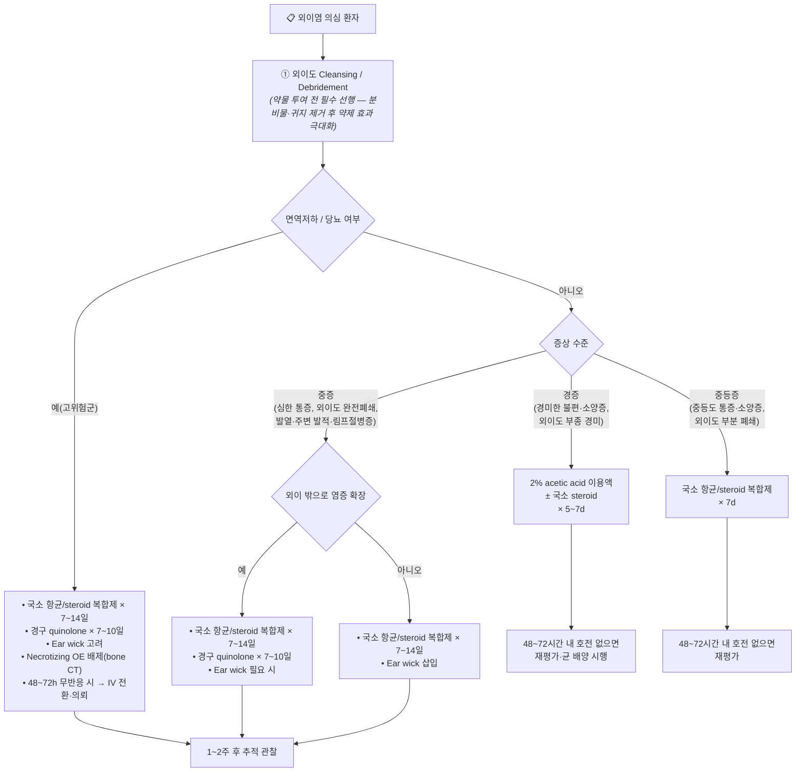

# 외이염 Otitis Externa

## <mark style="color:green;">일반 사항</mark>

* 외이도 또는 귓바퀴의 염증·감염; "swimmer's ear"라고도 불림
* 경과 : 발병 2\~3일째 증상이 가장 심함 → 치료 시작 후 48\~72시간 내 호전 시작; 보통 7\~10일 내 치유

### 분류

* **Acute diffuse OE** : OE의 대부분을 차지; 세균 감염이 원인의 대부분
* **Acute localized OE (Furunculosis)** : 외이도 모낭 감염; S. aureus가 주원인
* **Chronic OE** : 6주 이상 지속 (일부는 3개월 기준을 사용); 소양증·경미한 불편감이 주증상, 통증은 드묾
* **Eczematous OE** : 아토피·건선·SLE·습진 등 피부 질환과 관련; 진균 중복 감염 주의
* **Necrotizing (Malignant) OE** : 심부 조직·측두골로 염증 확대(골수염·봉소염); 즉시 의뢰 필요
* **Otomycosis** : 진균 감염; 항생제 남용 후, 당뇨·면역저하 시 빈발

### <mark style="color:$danger;">🚩 Red Flags!</mark>

<mark style="color:$danger;">**즉각 의뢰 — Necrotizing OE 의심**</mark>

* 당뇨·면역저하자에서 심한 이통 + 치료 무반응
* 외이도 육아조직(granulation tissue), 뼈 노출
* 두개신경 침범 의심 소견 : 안면신경 마비, 연하곤란, 쉰 목소리
* 측두골·두개저 골수염 의심 → 즉시 CT/MRI + 전신 항생제
* 발열 + 주변 봉소염(cellulitis) + 경부 림프절병증

<mark style="color:$warning;">**당일 또는 조기 재평가·의뢰**</mark>

* 적절한 국소 치료 후 48\~72시간 내 호전 없음
* 고막 천공이 의심되거나 확인된 상태
* 외이도가 완전 폐쇄되어 국소 약물 투여가 불가능
* 기저 피부 질환(습진·건선 등)으로 만성 재발하는 경우

<mark style="color:$info;">**외래 추적 / 추가 평가**</mark>

* 2\~4주 내 회복되지 않는 경우 → 균 배양 검사 및 재평가
* 진균 감염 의심(항생제 치료 실패, 흰 솜털 잔재물) → 항진균제로 전환

***

## <mark style="color:green;">원인</mark>

### <mark style="color:orange;">원인균</mark>

* **세균** (98%) : _P. aeruginosa_ (가장 흔함), _S. aureus_ (특히 농양·Furunculosis), 그람(-) 막대균
* **진균** (약 10%) : _Aspergillus niger_ (외이도 내 흑색 점박이 흰 덩어리), _Candida_ ; 항생제 남용 후 빈발
* **바이러스** : Herpes zoster oticus (Ramsay Hunt 증후군) - 외이·귓바퀴 수포, 안면신경 마비 동반 시 고려

### <mark style="color:orange;">위험 인자</mark>

* 높은 습도, 외이도의 물기 (수영, 목욕, 발한) : 피부 저항력 감소 + 세균 증식 조건 형성
* 잦은 귀지 제거·면봉 사용 : 보호막 손상 및 외이도 산성도 저하
* 귀지 매복 : 수분 배출 방해
* 좁거나 구부러진 외이도 : 수분 정체
* 만성 피부염 : 습진, 건선, 지루피부염, 접촉피부염
* 이물 삽입 : 면봉, 보청기, 이어폰
* **Necrotizing OE** 특이 위험 인자 : 당뇨병(특히 혈당 조절 불량), 고령(65세 이상), HIV 감염, 악성 종양, 면역억제제 사용, 방사선 치료 후

***

## <mark style="color:green;">임상 양상</mark>

* 외이 발적·부종·충만감
* **이통** : 특히 귓바퀴(pinna)를 당기거나, 이주(tragus)를 누르거나, 턱을 움직일 때 악화 — OE의 가장 특징적 소견
* **가려움(소양증)** : 세균성 OE에서는 이통이 선행하지만, **진균성 OE에서는 소양증이 이통보다 훨씬 심하거나 먼저 나타나는 경우가 많다** — 세균성과의 중요한 임상 감별 포인트; 만성 OE·습진성 OE에서도 두드러짐
* 외이 분비물 : 맑은 점액성 → 농성(악취)으로 변화; 습진 유발 가능
* 흰색 솜털 부스러기 : 진균 감염 의심
* 경미한 이명·청력 감소 : 외이도 폐쇄에 의한 전음성 난청

### <mark style="color:orange;">외이 이루(otorrhea)의 감별</mark>

<table><thead><tr><th width="82">원인</th><th>진단상 단서</th><th>치료</th></tr></thead><tbody><tr><td>세균성 외이염</td><td>화농성 분비물, 부종·발적, 이통, 최근 외이 물 접촉력·손상력(면봉), 당뇨병</td><td>국소 항균/steroid제 ±경구 항생제, 귀 세척 및 건조 유지, ear wick 고려</td></tr><tr><td>진균성 외이염</td><td>흰색-황백색 습한 분비물 (Aspergillus: 흑점 동반), hyphae 관찰, 항생제 저항성, 당뇨·고령·면역 저하</td><td>debridement + acetic acid 또는 국소 항진균제; 국소 항생제는 금기 (악화 가능)</td></tr><tr><td>피부염</td><td>알레르기·자극성 피부염 병력, 발적·소양증 위주, 분비물 적음</td><td>원인 제거, 국소 steroid; 2차 감염 시 항생제 추가</td></tr><tr><td>이물</td><td>이물 관찰, 이물질 삽입력, 소아·정신지체자</td><td>이물 제거; 감염·출혈 증거 있으면 항생제 이용액</td></tr><tr><td>외이도 손상</td><td>기구(면봉·머리핀) 사용력, 출혈성 이루 또는 손상 관찰</td><td>항생제 이용액; 두부 외상력 있으면 bone CT</td></tr><tr><td>악성(Necrotizing) 외이염</td><td>Pseudomonas 배양 양성, 심한 통증, 외이도 육아조직, 당뇨·고령, 치료 무반응</td><td>즉시 의뢰; Pseudomonas 표적 전신 항생제, bone CT/MRI</td></tr><tr><td>Ramsay Hunt 증후군</td><td>외이·귓바퀴의 수포성 발진, 안면신경 마비, 이통</td><td>즉시 의뢰; 항바이러스제(acyclovir/valacyclovir) + 스테로이드</td></tr><tr><td>종양</td><td>편측 종괴, 외이도 폴립, 치료 무반응의 만성 이루</td><td>bone CT; 이비인후과 의뢰</td></tr></tbody></table>

_<mark style="color:$info;">Ref. Rakel Family Medicine 9th ed. 2016; AAFP Am Fam Physician 2023;107(2):145-151.</mark>_

### <mark style="color:orange;">귀의 연관통 (Referred Otalgia)</mark>

귀 자체 이상 없이 귀 통증이 발생하는 경우 감별 : 치아/턱관절(TMJ), 인두·편도, 부비동, 이하선, 갑상선, 경추, 삼차신경통, 대상포진(Ramsay Hunt 증후군)

***

## <mark style="background-color:$warning;">Management</mark>

### <mark style="color:orange;">치료 방침</mark>

1. **외이도 cleansing** : 국소 약제 투여 전 외이도를 청소하면 효과 증진
2. **대증 치료** : 진통제(통증), 경구 항히스타민제(가려움), 국소 온열 치료
3. **약물 치료** : 국소 acetic acid 또는 항균제 ± steroid; 보통 7\~10일 내 호전
4. **전신 항생제** : 외이 밖으로 염증 확장 또는 면역저하자에 한해 사용; 단순 OE에 경구 항생제 투여는 효과가 제한적이고 항생제 내성을 증가시키므로 권고되지 않음 (AAO-HNSF 가이드라인)
5. **기저 질환 치료** : 피부 질환, 당뇨 혈당 조절 등

### <mark style="color:orange;">외이도 Cleansing</mark>

* 귀지 제거 및 외이도 청소 : 약제 투여 전 선행하면 효과 증진
* 세척 (과산화수소 + 온수) 또는 흡인 ; 흡인·세척보다 포셉/큐렛 등을 이용한 직접 제거가 안전
* **debridement** : 진균 감염 시 필수적으로 선행 (국소 항진균제만으로는 효과 불충분)
* **Ear wick(심지)** : 외이도가 심하게 부어 국소 약제 전달이 어려울 때 삽입; 2\~3일 후 자연 배출되거나 의사가 제거; hydrocellulose 또는 거즈 심지 사용
* 만성 OE : 2주마다 정기 cleansing

***

## <mark style="color:green;">약물 치료</mark>

### <mark style="color:orange;">통증·가려움 관리</mark>

**소염진통제**

* ibuprofen : 400\~800 ㎎ tid <mark style="color:blue;">\[부루펜]</mark>
* acetaminophen : 650\~1,300 ㎎ q6\~8h <mark style="color:blue;">\[타이레놀]</mark>
* ✽통증이 심한 경우 초기 2\~3일 규칙적으로 복용

**항히스타민제** (소양증 주 증상 시)

☞ [항히스타민제](/broken/pages/f6485a975ffa18198c77b45ed3da5abeec95d5ff)

### <mark style="color:orange;">2% Acetic Acid 국소제</mark>

* **작용** : 외이도 산성화 → 세균·진균에 대한 억균 효과
* **적응** : 경증 OE, 진균 OE 1차 치료, 예방
* **금기** : 고막 천공 시 (자극·염증 유발)
* **용법** : 3\~4 drops qid × 5\~7d; 단독 또는 70% 알코올과 2:1 혼합 사용 가능

### <mark style="color:orange;">국소 Steroid</mark>

* **대상** : 습진성 OE, 심한 소양증·부종 동반 감염성 OE
* 염증·통증 완화에 보조적 도움; 항균제와 병용하는 것이 일반적
* hydrocortisone, dexamethasone, triamcinolone 0.1% <mark style="color:blue;">\[트리코트]</mark>

### <mark style="color:orange;">국소 항생제 (점이용제)</mark>

#### 투여 방법 (이욕, 耳浴)

1. 환측을 위로 하여 눕는다.
2. 약병을 손으로 1\~2분 쥐어 체온 수준으로 따듯하게 한다 (냉각된 용액은 현기증 유발 가능).
3. 외이도에 가득 차도록 용액을 점이한다 (보통 4\~10방울, 제제별 상이).
4. 귓바퀴를 부드럽게 움직여 용액이 외이도 깊이 들어가도록 한다.
5. 3\~5분간 누운 자세를 유지한 후 일어나 흘러나오는 용액을 닦는다.

> **✽ 치료 시작 48\~72시간 내 호전 없으면 재평가 필요** (AAO-HNSF 강력 권고)

#### <mark style="color:$primary;">Fluoroquinolone계 ★1차 선택</mark>

* _P. aeruginos&#x61;_&#xC5D0; 대해 다른 국소 항균제보다 우수한 효과
* **저자극, 이독성 없음; 고막 천공 시에도 사용 가능** (FDA 승인 유일)
* ofloxacin 0.3% : 10 drops qd × 7d <mark style="color:blue;">\[타리비드]</mark>
* ciprofloxacin 0.3% : 10 drops qd × 7d <mark style="color:blue;">\[시프레닛]</mark> (비보험)

#### <mark style="color:$primary;">Aminoglycoside계</mark>

* **이독성 있음; 10일 이상 연속 사용 금지; 고막 천공 시 절대 금기**
* ✽시판 점이용 제제 없음 — 점안액 차용 (보험 주의)
* gentamicin 0.3% <mark style="color:blue;">\[오큐겐타]</mark>, tobramycin 0.3% <mark style="color:blue;">\[토브라]</mark>, neomycin

#### <mark style="color:$primary;">국소 항균제/Steroid 복합제</mark>

* 항생제 단독 대비 통증 기간 단축 효과 있음; 중등증 이상 또는 소양증 동반 시 우선 고려
* ciprofloxacin 0.3%/dexamethasone 0.1% 4 drops bid × 7d <mark style="color:blue;">\[실로덱스]</mark>
* ciprofloxacin 0.3%/fluocinolone 0.025% 4 drops tid × 7d <mark style="color:blue;">\[세트락살 플러스]</mark>
* ciprofloxacin 0.2%/hydrocortisone 1% 4 drops bid × 7d <mark style="color:blue;">\[싸이록사신]</mark>
* neomycin/polymyxin-B/hydrocortisone 4 drops qid × 7d — **고막 천공 시 금기**

> ⚠️ **고막 천공 확인 불가 시 원칙** : 고막 상태를 확인할 수 없거나 천공이 의심되는 경우, aminoglycoside 계열 및 neomycin/polymyxin-B 함유 제제는 절대 사용하지 않는다. **고막 확인이 어려운 모든 상황에서는 무조건 fluoroquinolone 단일제(ofloxacin 또는 ciprofloxacin)를 사용한다.** Fluoroquinolone은 고막 천공 상태에서도 이독성이 없으며 FDA 승인을 받은 유일한 계열이다.

### <mark style="color:orange;">전신 항생제</mark>

> **단순 미합병 OE에 전신 항생제는 원칙적으로 사용하지 않는다** — 효과가 국소 치료보다 열등하고 내성 증가 및 재발·지속을 초래할 수 있음 (AAO-HNSF, AAFP 2023 가이드라인)

**적응증** (아래 중 하나 이상 해당 시)

* 염증이 외이 밖으로 확장 : 발열, 주변 연조직염, 경부 림프절병증
* 국소 약물 투여 불가(심한 협착, 환자 순응도 불량)
* 면역저하자(당뇨, HIV, 항암치료 중)

**처방 및 단계별 선택**

* **1단계 — 경구** : ciprofloxacin 500 ㎎ bid × 7d <mark style="color:blue;">\[씨프로바이]</mark> — _P. aeruginosa_ 커버; 합병증 없는 연조직 확장 시 1차
* **보조** : cephalexin 500 ㎎ bid × 7d <mark style="color:blue;">\[팔렉신]</mark> — _S. aureus_ (Furunculosis) 의심 시; 그람(-) 커버 불충분하므로 단독 사용 주의
* **2단계 — 고용량 경구 또는 IV 전환 기준** : 아래 중 하나라도 해당 시 즉시 이비인후과 의뢰 + 입원 고려
  * 경구 ciprofloxacin 48\~72시간 무반응
  * 당뇨 환자에서 혈당 조절 불량(HbA1c ≥9% 또는 입원 중 고혈당) + 골수염 의심
  * Necrotizing OE 확인 또는 의심 : IV ciprofloxacin 또는 IV piperacillin/tazobactam으로 전환; 치료 기간은 보통 6주 이상(골수염 해소 영상 확인까지)

### <mark style="color:orange;">항진균제</mark>

> 진균 OE에서 **국소 항균(항생제) 점이용제는 금기** — 효과 없고 진균 증식을 촉진할 수 있음

**국소** (1차)

* clotrimazole 1% 4 drops qid × 7\~14d <mark style="color:blue;">\[카네스텐 크림]</mark> (점안액 차용 — 보험 주의)
* natamycin 점안액 <mark style="color:blue;">\[나타신]</mark>, nystatin, miconazole, amphotericin B
* ✽시판 점이용 항진균제 없음 — 점안액 또는 크림 차용

**경구** (중증·재발성·국소 치료 실패 시)

* itraconazole 200 ㎎ qd × 1주 <mark style="color:blue;">\[스포라녹스]</mark> ☞ [백선증](/broken/pages/ec9aa636151402b11c93b3cadd33889a457862c8#undefined-10)

***



<p align="center"><strong>외이염 치료 알고리듬</strong><br><em><mark style="color:$info;">Ref. AAO-HNSF Clinical Practice Guideline: Acute OE (Updated). Otolaryngol Head Neck Surg. 2014; AAFP Am Fam Physician 2023;107(2):145-151.</mark></em></p>

***

## <mark style="color:green;">관리 및 예방</mark>

* **건조 유지** : 치료 중 및 치료 완료 후 1\~2주간 외이도 건조 상태 유지
* **물 접촉 회피** : 일반적인 세발 등은 치료 2\~3일 후, 수영은 4\~5일 후 재개; 수영/목욕 시 귀마개 또는 petroleum jelly를 묻힌 솜 사용
* **수영·목욕 후 관리** : 헤어드라이어로 건조(낮은 온도·거리 유지) + 다음 중 택1 점이 : 2% acetic acid, 소독용 알코올 ½ 희석, 식초 ½ 희석, 또는 알코올:식초:증류수=2:1:1 혼합액 3\~4 drops
* **귀지 자가 제거 제한** : 면봉 삽입 금지; 귀지는 자연 배출되도록 두는 것이 원칙
* **보청기·귀마개 관리** : 보청기는 건조제(건조함)로 관리, 귀마개는 사용 후 알코올로 닦음
* **잦은 비누 세척 피함** : 알칼리화로 균 저항력 저하
* 만성 재발성 OE : 2\~3주마다 외래 청소

***

### <mark style="color:red;">질병코드</mark>

H60 외이염

H60.0 외이도 농양

H60.3 만성 외이염

H60.8 기타 외이염 (진균성, 습진성 등)

***

## <mark style="color:purple;">처방례</mark>

> **처방례 1. 세균성 OE — 중등증, 통증 동반**
>
> ```
> 싸이록사신 점이현탁액 5 ㎖/병   4 drops  bid  × 7d
> 타이레놀 이알 650 ㎎/T           1T       q8h  × 5d (통증 시)
> ```
>
> _✽고막 천공 없음을 확인 후 투여. 투여 전 약병을 손으로 1\~2분 따듯하게 할 것. 48\~72시간 내 호전 없으면 재내원_

> **처방례 2. 세균성 OE — 중등증\~중증, 소양증 동반**
>
> ```
> 실로덱스 이용액 5 ㎖/병          4 drops  bid  × 7d
> 부루펜 200 ㎎/T                  6T       #3   × 3~5d
> ```
>
> _✽ciprofloxacin/dexamethasone 복합제 — P. aeruginosa 및 S. aureus 모두 커버. 고막 천공 시에도 fluoroquinolone 성분은 안전하나 전체 혼합 현탁액의 pH 자극 가능성이 있으므로 천공 확인 시 단순 ofloxacin 이용액으로 대체 고려_

> **처방례 3. 진균성 OE**
>
> ```
> 카네스텐 크림 10 g/tube          소량     bid  (보험 주의)
> 스포라녹스 100 ㎎/C              2C       qd   × 7d  (중증·재발성)
> ```
>
> _✽국소 항생제 점이는 금지. 반드시 debridement 선행. 클로트리마졸 크림을 외이도에 조심스럽게 도포. itraconazole은 국소 치료 실패 또는 중증 시 추가_

> **처방례 4. 습진성 OE**
>
> ```
> 트리코트 크림 10 g/tube          소량     bid
> ```
>
> _✽2차 감염 동반 시 국소 항균제 병용. 원인 피부 질환(아토피·건선 등) 동시 관리_

> **처방례 5. 외이 밖으로 염증 확장 (전신 항생제 필요)**
>
> ```
> 타리비드 이용액 5 ㎖/병          10 drops  qd  이욕  × 7~10d
> 씨프로바이 500 ㎎/T              2T        #2  × 7d
> 부루펜 200 ㎎/T                  6T        #3  × 3~5d
> ```
>
> _✽발열·봉소염·림프절병증 동반 시 해당. ciprofloxacin 전신 투여로 P. aeruginosa 커버. 48\~72시간 내 호전 없으면 즉시 이비인후과 의뢰 및 CT_

***

### <mark style="color:$success;">핵심 복약 지도</mark>

> **점이용액 올바른 사용법**
>
> * **약을 먼저 따뜻하게 하십시오.** 차가운 약액이 귀에 들어가면 일시적인 어지럼증이 생길 수 있습니다. 가장 간편한 방법은 **약병을 겨드랑이에 1분간 끼워두거나, 주머니(바지 앞주머니)에 5분간 넣어두는 것**입니다. 손으로 쥐는 것보다 체온에 더 가깝게 데워집니다.
> * 아픈 귀를 위로 향하게 눕거나 머리를 기울이고 처방된 방울 수를 점이하십시오.
> * 귓바퀴를 부드럽게 위아래로 당겨 약이 귀 안 깊이 들어가도록 돕습니다.
> * **3\~5분간 그 자세를 유지**한 후 일어나 흘러나오는 약액을 닦습니다.
> * 1일 1회 제제(ofloxacin, ciprofloxacin)는 매일 같은 시간에 규칙적으로 사용하십시오.
> * **치료 시작 후 48\~72시간 이내에 통증이 나아지기 시작해야 합니다.** 그렇지 않으면 반드시 재내원하십시오.

> **항생제 이용액 사용 주의**
>
> * **고막에 구멍(천공)이 있는 경우** 반드시 의사에게 알리십시오. 일부 점이용 항생제(aminoglycoside 계열: 겐타마이신, 토브라마이신, 네오마이신)는 청력 손상 가능성이 있어 사용 금지입니다. fluoroquinolone 계열(오플록사신, 시프로플록사신)은 고막 천공 시에도 안전하게 사용할 수 있습니다.
> * 증상이 좋아져도 처방 기간을 끝까지 사용하십시오. 임의 중단 시 재발하거나 균이 약에 내성이 생길 수 있습니다.

> **귀를 건조하게 유지하는 방법**
>
> * 치료 중과 치료 완료 후 1\~2주간 귀에 물이 들어가지 않도록 하십시오.
> * 세발 시 귀마개를 사용하거나 petroleum jelly(바셀린)를 묻힌 솜으로 귀를 막으십시오.
> * 수영은 치료 시작 4\~5일 후부터 가능합니다.
> * 수영·샤워 후에는 헤어드라이어를 가장 약한 바람으로, 귀에서 20\~30 cm 거리를 두고 30초간 건조하십시오.
> * **면봉은 절대 사용하지 마십시오.** 귀지를 제거하는 것이 아니라 외이도를 더 손상시키고 귀지를 안쪽으로 밀어 넣습니다.

> **언제 즉시 병원을 방문해야 하나요?**
>
> * 치료 시작 **48\~72시간이 지나도 통증이 전혀 나아지지 않는** 경우
> * 통증이 귀에서 **얼굴·턱·목으로 퍼지거나 발열이 동반**되는 경우
> * **귀 주변 피부가 붉게 부어오르거나 귀 앞뒤 림프절이 만져지는** 경우
> * 안면 마비, 삼킴 곤란, 쉰 목소리 등 **새로운 신경 증상이 생기는** 경우 (즉시 응급실)
> * 당뇨·면역저하 환자에서 외이염이 치료 후에도 **회복되지 않는** 경우

***

### <mark style="color:blue;">환자 안내서</mark>


**외이염(귀의 감염)이란 무엇인가요?**

외이도(귀의 입구에서 고막 사이의 관)가 세균이나 진균에 감염되어 붓고 아픈 상태입니다. 흔히 "swimmer's ear"라고도 불리며, 귀에 물이 자주 들어가거나 면봉으로 자주 후비는 경우에 잘 생깁니다. 고막 바깥의 감염이므로, 적절한 치료를 받으면 대부분 7\~10일 내에 낫습니다.


#### <mark style="color:$primary;">어떤 증상이 생기나요?</mark>

* 귀 통증 — 특히 귓바퀴를 당기거나 귀 입구 돌출부(이주)를 누를 때 심해집니다.
* 귀가 막히거나 가득 찬 느낌, 가려움
* 귀에서 액체(초기엔 맑고, 심해지면 고름 냄새)가 나올 수 있습니다.
* 심해지면 외이도가 부어 청력이 일시적으로 떨어질 수 있습니다.

#### <mark style="color:$primary;">치료는 어떻게 하나요?</mark>

* 점이용액(귀에 떨어뜨리는 약)이 치료의 핵심입니다. 처방된 방법대로 정확히 사용하면 2\~3일 이내에 통증이 줄기 시작합니다.
* **💡 어지럼증 예방 팁** : 차가운 약병을 귀에 바로 사용하면 어지럼증이 생길 수 있습니다. 사용 전에 **약병을 겨드랑이에 1분간 끼워두거나 바지 앞주머니에 5분간 넣어두면** 체온에 가깝게 따뜻해져 훨씬 편하게 쓸 수 있습니다.
* 통증이 심한 초기에는 타이레놀이나 이부프로펜을 함께 복용하면 도움이 됩니다.
* 입을 열거나 씹을 때 아픈 것도 외이염의 증상이며, 치료와 함께 자연히 좋아집니다.

#### <mark style="color:$primary;">치료 중 꼭 지켜야 할 것</mark>

* **귀에 물이 들어가지 않도록** 하십시오. 샤워·세발 시 귀마개나 솜(바셀린 묻힘)으로 귀를 막으세요.
* **면봉은 절대 사용하지 마십시오.** 외이도를 손상시키고 회복을 방해합니다.
* **보청기·이어폰 착용을 치료 기간 중 삼가** 주십시오. 외이도에 압력을 주어 증상이 악화될 수 있습니다.
* 처방된 기간 동안 약을 끝까지 사용하십시오. 증상이 나아졌다고 일찍 중단하면 재발할 수 있습니다.

#### <mark style="color:$primary;">재발 예방을 위한 생활 습관</mark>

* 수영 후에는 헤어드라이어(약한 바람, 귀에서 20\~30 cm 거리)로 귀를 건조하십시오.
* 수영 후 2% 식초(½ 희석) 또는 2% acetic acid 3\~4방울을 점이하는 것이 예방에 효과적입니다.
* 귀지는 스스로 밀어내는 자정 능력이 있습니다. 면봉으로 후비지 말고 자연 배출되도록 두십시오.
* 보청기는 건조 케이스(건조기)에 보관하고, 이어폰·귀마개는 알코올로 닦아 청결히 유지하십시오.
* 당뇨가 있으신 경우 혈당 조절이 외이염 예방에도 중요합니다. 이유 없이 귀가 오래 아프다면 반드시 진료를 받으십시오.

#### <mark style="color:$primary;">이럴 때는 즉시 병원을 방문하세요</mark>

* 치료 시작 후 2\~3일이 지나도 통증이 전혀 줄지 않을 때
* 귀 주변 피부가 붉게 부어오르거나 열이 날 때
* 얼굴 한쪽이 처지거나 마비되는 느낌이 들 때 **(즉시 응급실)**
* 당뇨 또는 면역 저하 상태에서 외이염이 낫지 않을 때
