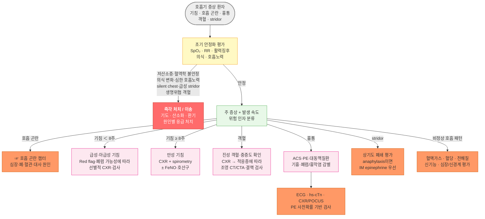

# 호흡기 질환의 임상적 진단

## <mark style="color:green;">초기 평가</mark>

* 호흡기 증상을 주소로 내원한 환자는 먼저 '불안정 vs. 안정'을 판단한 뒤 증상 기반 진단 접근을 시작
* 급성 호흡 곤란·흉통·중증 의심 시에는 SpO₂·호흡수(RR)·활력징후·의식 수준·호흡노력을 즉시 확인하고, 심장 원인이 배제되지 않은 경우 ECG를 추가 (☞ [흉통](../220_/002_-chest-pain.md), [호흡곤란](../220_/007_-dyspnea.md))
* 병력에서는 증상의 발생 속도와 경과, 흡연·전자담배, 직업·환경 노출, 감염 접촉·여행, 흡인 위험, 약물(ACEi·β차단제·진정제 등), 면역억제, 심폐질환 및 혈전색전증 위험 인자를 확인
* 정상 SpO₂나 정상 청진 소견만으로 폐색전증·초기 폐렴·상기도 병변·빈혈·대사성 산증 등 중증 원인을 배제하지 않음

### <mark style="color:$danger;">🚩 Red Flags!</mark>

<mark style="color:$danger;">**즉각 처치 또는 이송**</mark>

* 혈역학적 불안정 또는 심한 호흡부전 + 편측 호흡음 현저한 감소/소실 → 긴장성 기흉 임상적 의심; 영상 때문에 처치를 지연하지 않고 숙련된 의료진이 즉시 감압 후 흉관 삽입
* 한 단어 말하기 어려움, silent/quiet chest, 청색증, 역설 호흡, 심한 보조호흡근 사용, tripod 자세, 의식 저하·혼돈 → 즉각 처치 및 이송 (임박한 호흡부전)
* 보조 산소에도 목표 SpO₂에 도달하지 못하거나 빠르게 악화하는 저산소증 → 즉각 산소화·환기 평가 및 이송
* 신발생 stridor + 호흡 곤란·저산소증·침 흘림·의식 변화 또는 anaphylaxis 의심 → 즉각 기도 평가 및 처치; anaphylaxis이면 IM epinephrine 우선
* 생명위협 객혈 - 기도 유지 곤란, 저산소증, 혈역학적 불안정 또는 지속적 다량 출혈 → 출혈량 수치보다 생리적 영향에 따라 즉각 이송

<mark style="color:$warning;">**당일 긴급 평가**</mark>

* RR ≥ 30회/분 또는 지속적인 빈호흡 + 보조호흡근 사용·호흡근 피로 → 산소화·환기 및 원인 평가; 필요 시 ABGA/VBGA
* PaCO₂ 상승 + pH ＜ 7.35 → 급성 또는 급성-만성 고탄산혈증성 호흡부전 평가; 의식·기도 보호·호흡노력·원인과 초기 치료 반응에 따라 NIV/침습 환기 판단
* 새로 확인된 안정 시 저산소증 또는 기저치보다 의미 있는 SpO₂ 저하, 특히 반복 측정에서도 ≤ 92% → 측정 오류를 배제하고 조기 원인 평가; 필요 시 ABGA
* 진행성 흉막 삼출 + 호흡 곤란 → 배액 필요성과 원인 평가
* 특별한 유발 요인 없는 급성 호흡 곤란 + 빈맥·흉통·실신·저산소증 또는 DVT 징후 → [폐색전증](../220_/007_-dyspnea.md#vs-vs) 사전확률 평가
* 새로 발생한 객혈 + 호흡 곤란, 흉통, 저산소증 또는 전신 상태 악화
* 고령·면역억제 환자에서 빠르게 진행하는 폐렴 또는 전신 상태 악화
* 호흡곤란 없이 발생한 신발생 stridor도 상기도 폐쇄 가능성을 고려하여 긴급 평가

<mark style="color:$info;">**외래 추적 / 추가 평가 계획**</mark> - <mark style="color:$info;">즉각 위험은 낮으나 원인 평가 필요</mark>

* 8주 이상 지속하는 만성 기침 → 흉부 X선 + spirometry(가능하면 기관지확장제 반응); 이용 가능하면 FeNO·말초혈액 호산구 고려
* 안정 상태에서 경계 또는 경도 SpO₂ 저하가 반복되나 즉각 위험이 낮음 → 환자의 평소 수치·기저 질환을 확인하고 필요 시 운동·야간 저산소증 및 ABGA 평가
* 새로 발견된 곤봉지(clubbing) → 폐암·기관지확장증·간질성 폐질환·농흉 등 원인 평가


**곤봉지와 COPD** : COPD 자체는 곤봉지의 전형적 원인이 아님. COPD 환자에서 새로 곤봉지가 발견되면 폐암, 기관지확장증, 간질성 폐질환 등 동반 질환을 우선 의심하고 흉부 영상 검사를 시행


## <mark style="color:green;">감별</mark>

### <mark style="color:orange;">증상 기반 감별</mark>

* 발열 정도와 불균형한 빈호흡 또는 저산소증 → 폐렴·패혈증·폐색전증·대사성 산증 등 감별; 소아·고령에서는 폐렴의 초기 징후일 수 있음
* 새로운 곤봉지 → 폐암·기관지확장증·간질성 폐질환 - COPD의 전형 소견 아님
* 심한 비만 + 주간 졸음 + 코골이 → 폐쇄성 수면무호흡증·비만저환기증후군 선별; 비만저환기증후군은 각성 시 PaCO₂ ≥ 45 ㎜Hg 및 다른 저환기 원인 배제로 진단
* 심한 비만 + 하지 부종 + 경정맥 확장 → 우심부전·폐고혈압·비만저환기증후군에 의한 cor pulmonale·체액 과다
* 호기 연장 + wheezing → 천식·COPD 등 기류제한 시사; barrel chest는 장기간 과팽창의 비특이적 소견이며 초기 기류제한을 의미하지 않음
* 흡기 시 경부 근육 수축 + 역설 호흡 → 상기도 폐쇄 또는 심한 호흡근 피로
* 흡기성 stridor 신발생 → 후두·성문·성문하 협착, 이물, anaphylaxis → 긴급도 평가
* 저산소증이 있으나 호흡 곤란 호소가 적음 → 주관적 증상에 의존하지 않고 SpO₂·호흡수·의식·전신 상태와 원인 질환을 평가
* SpO₂가 유지되어도 빠른 호흡수 → 폐색전증 초기, 대사성 산증, 통증·불안, 패혈증, 임박한 호흡부전 등 감별; 빈호흡 자체를 곧바로 보상성 과호흡으로 단정하지 않음
* 운동 유발 호흡 곤란 → 운동유발 기관지수축(EIB), 심부전, 빈혈, 폐혈관질환, 운동부족; EIB는 증상만으로 진단하지 않고 운동 또는 기관지유발검사로 확인
* 누우면 악화되고 앉으면 호전(orthopnea) → 좌심부전, 횡격막 기능장애, 심한 비만 등
* 앉거나 설 때 호흡 곤란과 SpO₂ 감소(platypnea-orthodeoxia) → 간폐증후군, 폐동정맥기형, 체위에 따라 증가하는 심방중격결손/난원공개존의 우-좌 단락 → 조영 심초음파 등 평가
* Kussmaul 호흡(깊고 규칙적인 과호흡) → DKA, 요독증 등 대사성 산증 - 호흡기 질환 없이 발생 가능

<table><thead><tr><th width="130.4285888671875">주 증상</th><th>주요 감별 질환</th><th>초기 감별 포인트</th></tr></thead><tbody><tr><td><a href="../220_/007_-dyspnea.md">호흡 곤란</a> (dyspnea)</td><td>천식, COPD, 폐색전증, 심부전, 폐렴, 기흉, 빈혈·대사성 산증</td><td>발생 속도, 호흡노력, 체위·운동 영향, SpO₂, 흉통·부종·DVT 징후</td></tr><tr><td><a href="../220_/006_-cough.md">기침</a> (cough)</td><td>급성: 감기·기관지염·폐렴 만성: 천식·호산구성 기도질환·GERD·상기도 질환·ACEi</td><td>기간(&#x3C; 3주 / 3~8주 / ＞ 8주), 야간·운동·직업 노출, 흡연·약물</td></tr><tr><td>혈담·객혈 (hemoptysis)</td><td>기관지확장증, 결핵·감염, 폐암, 폐색전증</td><td>진성 객혈 여부, 기도·산소화·혈역학 영향, 항응고제, 감염·암 위험</td></tr><tr><td><a href="../220_/002_-chest-pain.md">흉통 </a>+ 호흡 악화</td><td>폐색전증, 기흉, 폐렴·흉막염, ACS, 대동맥질환, 심낭염</td><td>흉막성 여부만으로 양분하지 말고 발생 속도, 활력징후, ECG·troponin, PE 위험 평가</td></tr><tr><td>Stridor</td><td>후두·성문 질환, 이물, anaphylaxis, 성문하 협착, 크룹</td><td>발생 속도, 흡기성/양상성, 음성 변화·침 흘림·알레르기·호흡곤란</td></tr><tr><td>비정상 호흡 패턴</td><td>Kussmaul(DKA·요독증), Cheyne-Stokes(심부전·CNS), 역설 호흡(호흡근 피로)</td><td>혈액가스·대사 지표, 의식 수준, 심기능·신경계 확인</td></tr></tbody></table>


**Kussmaul 호흡** : 깊고 규칙적인 과호흡. 대사성 산증(특히 DKA, 요독증)에서 PaCO₂를 낮춰 pH를 보상하는 생리적 반응. 호흡기 소견 없이 빈호흡이 있을 때는 혈당·전해질·신기능과 혈액가스를 확인


### <mark style="color:orange;">호흡기 병변의 물리적 특성에 따른 감별</mark>

* Air / Pleural fluid / Parenchymal-interstitial lesion / Minimal chest finding의 범주는 bedside 감별을 위한 교육적 틀이며 해부학적 진단 분류는 아님
* 타진·성진동·청진 소견은 병변의 크기·위치, 기관지 개방성 및 동반 흉막병변에 따라 달라지므로 단독으로 질환을 확진하거나 배제하지 않음

<table><thead><tr><th width="112">범주</th><th width="158">대표 질환</th><th width="96">타진</th><th width="110">성진동</th><th>청진</th></tr></thead><tbody><tr><td>Air (공기 과잉)</td><td>기흉, 천식 발작, 폐기종</td><td>과다 공명 가능</td><td>감소 가능</td><td>호흡음 감소 또는 wheezing; 기흉은 편측 감소</td></tr><tr><td>Pleural fluid (흉막액)</td><td>흉막삼출, 농흉, 혈흉</td><td>둔탁음</td><td>감소/소실</td><td>호흡음 감소; 삼출 상연에서 egophony 가능</td></tr><tr><td>Parenchymal / interstitial lesion</td><td>폐렴 경화, 폐부종, ILD, 무기폐, 종양</td><td>경화·무기폐는 둔탁 가능; 폐부종·ILD는 흔히 비특이적</td><td>개방 기관지가 있는 경화에서 증가; 폐쇄성 무기폐에서는 감소 가능</td><td>crackle, 기관지 호흡음 또는 감소된 호흡음 - 병변에 따라 다름</td></tr><tr><td>Minimal chest finding (흉부 소견 미미)</td><td>폐색전증, 빈혈, 대사성 산증, 과호흡증후군, 초기 심부전</td><td>정상 가능</td><td>정상 가능</td><td>정상 또는 최소 이상; 중증 질환을 배제하지 못함</td></tr></tbody></table>

### <mark style="color:orange;">질환별 이학적 소견</mark>

<table><thead><tr><th width="90">구분</th><th>기관지 천식 (급성 악화)</th><th>기흉</th><th>흉막 삼출 (대량)</th><th>무기폐</th><th>폐렴 (경화)</th></tr></thead><tbody><tr><td>시진</td><td>호기 연장, 보조호흡근 사용, 과팽창 가능</td><td>환측 흉벽 움직임 감소 가능</td><td>환측 흉벽 지체 가능</td><td>흉벽 지체 가능</td><td>국소 흉벽 지체 가능</td></tr><tr><td>촉진 (성진동)</td><td>정상 또는 감소</td><td>감소/소실</td><td>감소/소실</td><td>폐쇄성은 감소; 개방 기관지·압박성은 증가 가능</td><td>개방 기관지가 유지된 경화에서 증가 가능</td></tr><tr><td>타진</td><td>정상 또는 과다 공명</td><td>과다 공명 가능</td><td>둔탁음</td><td>둔탁음 가능</td><td>둔탁음 가능</td></tr><tr><td>청진</td><td>호기 연장 + wheezing; silent chest는 중증</td><td>편측 호흡음 감소/소실</td><td>호흡음 감소/소실</td><td>호흡음 감소 또는 기관지 호흡음 ± crackle</td><td>기관지 호흡음·crackle·egophony 가능</td></tr><tr><td>기관·종격동 편위</td><td>없음</td><td>긴장성 기흉에서 건측 편위 가능 - 후기 소견</td><td>대량이면 건측 편위 가능</td><td>유의한 용적 감소 시 병변측 편위 가능</td><td>일반적으로 없음</td></tr><tr><td>핵심 포인트</td><td>다른 중증도 지표와 통합</td><td>혈역학적/호흡 불안정이면 긴장성 여부 우선</td><td>흉막강 병변</td><td>용적 감소·기관지 개방성 확인</td><td>임상 + 영상으로 확인</td></tr></tbody></table>


**흉막 마찰음 (Pleural friction rub)** : 흡기·호기 양 시점에 들리는 가죽 문지르는 듯한 거친 음으로 흉막 표면의 염증을 시사. 흉막삼출이 많아져 두 흉막면이 분리되면 소실될 수 있음

**심장성 vs. 폐성 호흡 곤란 감별** : 양측 B-line/crackle, S3 gallop, 경정맥압 상승, 하지 부종은 심부전을 지지하고, 국소 crackle·기관지 호흡음과 발열·객담은 폐렴을 지지하지만 중복될 수 있음. BNP/NT-proBNP는 보조적으로 해석하며, 급성 호흡 곤란에서 BNP ＜ 100 pg/㎖ 또는 NT-proBNP ＜ 300 pg/㎖이면 급성 심부전 가능성이 낮음. 단, 비만·HFpEF에서는 낮게, 고령·심방세동·신기능 저하에서는 높게 측정될 수 있음


## <mark style="color:green;">1차 영상 및 검사</mark>

<table><thead><tr><th width="210">검사</th><th>적응증 및 해석 포인트</th></tr></thead><tbody><tr><td>ECG (심전도)</td><td>급성 호흡 곤란·흉통·빈맥 등에서 부정맥, 허혈, 우심부하 등 평가. Sinus tachycardia나 S₁Q₃T₃는 PE의 비특이적 보조 소견이며 정상 ECG로 PE·ACS를 배제할 수 없음</td></tr><tr><td>흉부 X선</td><td>폐렴·기흉·흉막삼출·폐부종 등 의심 시 기본 영상. 정상 CXR로 폐색전증을 배제할 수 없으며, 정상 CXR에도 폐렴 임상 의심이 높으면 추가 영상 고려</td></tr><tr><td>Spirometry ± 기관지확장제 반응</td><td>안정기 기류제한의 객관적 평가. 천식은 가변적 증상 + 가변적 호기 기류를 확인하고, COPD는 기관지확장제 후 FEV₁/FVC ＜ 0.7의 지속 기류제한을 확인. 급성 중증 호흡곤란에서 강제호기검사로 처치·이송을 지연하지 않음</td></tr><tr><td>ABGA/VBGA</td><td>SpO₂-임상 불일치, 저산소증·환기부전, 산염기 이상 평가. 산소화의 정확한 평가는 ABGA가 필요하며 VBG는 pH·PaCO₂ 선별에 활용 가능</td></tr><tr><td>CBC + CRP / PCT</td><td>감염·염증 및 빈혈의 보조 평가. 단일 CRP/PCT 수치로 세균성·바이러스성 폐렴을 확진·배제하거나 영상으로 확인된 CAP의 초기 항균제 필요성을 결정하지 않음</td></tr><tr><td>D-dimer</td><td>PE 사전확률이 낮거나 중간인 환자에서 배제 목적으로 사용; 50세 이상은 연령보정 절단값 고려. 높은 사전확률에서는 D-dimer보다 즉시 적절한 영상검사</td></tr><tr><td>BNP / NT-proBNP</td><td>심장성 호흡 곤란 감별의 보조 검사. 급성과 비급성 절단값이 다르며 비만·HFpEF·심방세동·연령·신기능을 함께 고려</td></tr><tr><td>High-sensitivity cardiac troponin</td><td>ACS 의심 시 증상 발생 시점과 serial change를 포함하여 해석. PE에서는 심근 손상·위험도 평가에 보조적으로 사용</td></tr><tr><td>CURB-65 / PSI</td><td>진단된 지역사회획득폐렴의 중증도·치료 장소 결정을 돕는 보조도구이며 폐렴 진단검사가 아님 (☞ <a href="068_-pneumonia.md#undefined-5">폐렴</a>)</td></tr></tbody></table>


**6분보행검사 (6MWT)** : 초기 진단보다 안정기 기능 평가·치료 반응·운동 시 산소화 평가에 주로 사용. 보행거리와 SpO₂ 변화는 COPD·ILD·폐고혈압·심부전 등 질환과 검사 목적에 따라 해석하며, 단일 거리 또는 탈포화 절단값을 모든 질환의 보편적 예후 기준으로 사용하지 않음


## <mark style="color:green;">Bedside 검사</mark>

#### <mark style="color:$primary;">ECG (심전도)</mark>

* 급성 호흡 곤란에서 흉통·빈맥·실신·심장질환 가능성이 있으면 SpO₂·활력징후 평가와 함께 조기에 시행
* 부정맥·허혈·우심부하 등 원인 또는 중증도 단서를 제공하지만 정상 ECG로 PE나 ACS를 배제하지 못함

#### <mark style="color:$primary;">Pulse Oximetry (SpO₂)</mark>

* SpO₂는 증상·호흡수·호흡노력·의식·기저 수치 및 경과와 함께 해석하고, 저관류·움직임·센서 위치·손발톱 도료 등 측정 오류를 먼저 확인
* 대부분의 급성 환자에서는 산소가 필요하면 SpO₂ 94~98%를 목표로 적정하되, 급성 고탄산혈증성 호흡부전 위험이 있으면 ABGA 결과가 확인될 때까지 88~92%를 목표로 조절 산소 투여
* 안정 상태에서 반복 확인된 SpO₂ ≤ 88% 또는 PaO₂ ≤ 55 ㎜Hg는 장기산소요법 평가 기준에 해당할 수 있음. 급성 악화 중 한 번 측정한 값만으로 결정하지 않고 안정 후 재평가


**SpO₂ 해석 주의 사항**

**Occult hypoxemia** : 피부색이 짙은 환자에서는 실제 산소포화도보다 높게 표시되어 저산소증을 과소평가할 수 있음. 임상 소견과 불일치하거나 치료 결정에 정확한 산소화가 중요하면 ABGA로 확인

**측정의 한계** : 말초 순환 저하, 움직임, 센서 부착 불량, 손발톱 도료 등은 측정 오차를 일으킬 수 있음. CO 중독에서는 SpO₂가 정상 또는 높게 보일 수 있으므로 의심하면 co-oximetry가 필요. 빈혈에서는 SpO₂가 정상이어도 혈중 산소 함량과 조직 산소 전달이 부족할 수 있음

**고탄산혈증 위험 환자의 산소 투여** : 모든 COPD 환자에게 일률적으로 88~92%를 적용하는 것이 아니라 과거 고탄산혈증성 호흡부전, 중증 COPD, 비만저환기증후군, 신경근육·흉벽 질환 등 위험을 고려. 과도한 산소는 주로 V/Q 불균형 악화와 Haldane effect 등을 통해 PaCO₂를 상승시킬 수 있으므로 산소를 보류하지 말고 조절 투여 후 혈액가스를 재평가


#### <mark style="color:$primary;">POCUS (Point-of-Care Ultrasound)</mark>

* 급성 호흡 곤란에서 흉부 X선·CT와 상호 보완적으로 사용하며 검사자 숙련도와 임상 맥락이 중요
* 2025 ATS CAP 지침은 적절한 임상 숙련도가 있는 의료기관에서 성인 의심 CAP 진단에 lung ultrasound를 흉부 X선의 허용 가능한 대안으로 조건부 권고

<table><thead><tr><th width="201">POCUS 소견</th><th width="190">의미</th><th>대표 질환·주의점</th></tr></thead><tbody><tr><td>A-line (수평 반향선)</td><td>검사 부위의 폐 aeration이 보존된 패턴</td><td>정상, 천식, COPD뿐 아니라 기흉에서도 가능; lung sliding 등과 통합</td></tr><tr><td>다발성 B-line (수직 artifact)</td><td>Interstitial syndrome</td><td>심인성 폐부종, ILD, ARDS, 폐렴 등; 개수만이 아니라 양측성·분포·흉막선·심장 소견 평가</td></tr><tr><td>Lung sliding 소실</td><td>기흉 가능성을 높이는 소견 중 하나</td><td>단독 확진 소견 아님 - 무기폐, 주기관지 삽관, 흉막유착, 중증 폐질환 등에서도 소실 가능</td></tr><tr><td>Lung point</td><td>전형적인 경우 기흉에 매우 특이적</td><td>Pseudo-lung point에 주의하며, lung point가 없다고 기흉을 배제할 수 없음</td></tr><tr><td>Consolidation + air bronchogram</td><td>폐실질 경화</td><td>Dynamic air bronchogram은 폐렴을, static air bronchogram·lung pulse는 무기폐를 더 지지</td></tr><tr><td>흉막액</td><td>무에코 또는 복합성 흉막강 액체</td><td>흉막삼출·농흉·혈흉; 양·격벽·주변 폐실질과 안전한 천자 위치 평가</td></tr></tbody></table>

#### <mark style="color:$primary;">Peak Expiratory Flow (PEF) - 천식 악화 평가</mark>

<table><thead><tr><th width="155">PEF (personal best 또는 예측치 대비)</th><th width="140">GINA 2026 임상 범주</th><th>평가 방향</th></tr></thead><tbody><tr><td>＞70%</td><td>경증 소견에 부합 가능</td><td>말하기·자세·RR·보조호흡근·SpO₂·공기 유입 및 치료 반응과 통합</td></tr><tr><td>50~70%</td><td>중등도 소견</td><td>즉시 기관지확장제 치료 후 조기 재평가; 임상상에 따라 전신 스테로이드·이송 판단</td></tr><tr><td>&#x3C;50%</td><td>중증 또는 생명위협 소견</td><td>치료를 지연하지 말고 즉각 처치·이송; 측정이 불가능할 정도의 중증도 고려</td></tr></tbody></table>


PEF 수치 하나로 천식 악화 중증도를 결정하지 않으며, drowsy/confused, cyanosis, silent/quiet chest는 PEF와 관계없이 생명위협 소견이다. PEF 측정이 즉각 치료나 이송을 지연해서는 안 됨


***

## <mark style="color:green;">호흡기 증상 진단 접근 알고리듬</mark>

<strong>호흡기 증상 초기 진단 접근 알고리듬</strong>

***


**폐색전증(PE) - 정상 청진·CXR의 함정** : 원인 불명의 급성 호흡 곤란·흉통·빈맥·실신·저산소증 또는 DVT 징후가 있으면 먼저 임상 사전확률을 평가. 매우 낮은 위험에서는 적용 가능한 경우 PERC, 낮음·중간 사전확률에서는 고감도 D-dimer(50세 이상은 연령보정 고려), 높은 사전확률에서는 D-dimer를 거치지 않고 CTPA 또는 적절한 대체 영상을 시행. 정상 청진·ECG·흉부 X선으로 PE를 배제할 수 없음 (☞ [호흡 곤란](../220_/007_-dyspnea.md#vs-vs))


***

### <mark style="color:orange;">흔한 진단 오류</mark>

1. COPD 환자에서 곤봉지 무시 → COPD 자체의 전형 소견이 아니므로 폐암·기관지확장증·ILD 등 동반 질환 평가
2. 정상 SpO₂만으로 안심 → 측정 오류·CO 중독·빈혈을 고려하고 RR·의식·호흡노력·전신 상태와 통합; 불일치 시 ABGA/co-oximetry
3. Wheezing을 천식으로 단정 → COPD, 심부전, anaphylaxis, 상기도/중심기도 폐쇄 등 감별
4. 정상 흉부 X선·ECG로 폐색전증 배제 → 사전확률에 따라 PERC·D-dimer·CTPA/V-Q scan 적용
5. PCT ＞ 0.25 ng/㎖를 세균성 폐렴 확진 기준으로 사용 → 임상·영상·미생물검사와 통합하고 단일 수치로 항균제 결정을 하지 않음
6. 폐렴과 무기폐를 기관 편위만으로 구분 → 편위는 유의한 용적 감소 때만 나타날 수 있으며 기관지 개방성·영상·dynamic air bronchogram 등을 함께 평가
7. 모든 COPD 환자에게 산소를 제한 → 저산소증은 즉시 교정하되 고탄산혈증 위험에 따라 목표 범위를 정하고 혈액가스를 재평가
8. 정상 청진으로 중증 호흡기 질환 배제 → PE·초기 폐렴·상기도 병변·천식의 silent chest 등에서는 청진이 정상 또는 미미할 수 있음
