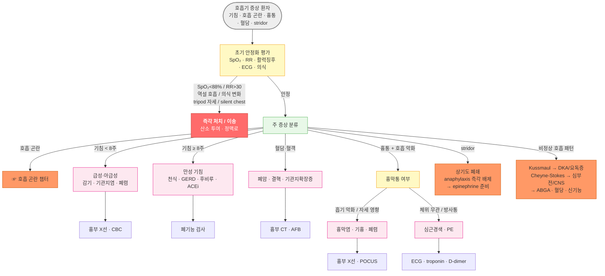

# 호흡기 질환의 임상적 진단

## <mark style="color:green;">초기 평가</mark>

* 호흡기 증상을 주소로 내원한 환자는 '불안정 vs. 안정'을 먼저 판단한 뒤 증상 기반 진단 접근을 시작
* 급성 호흡 곤란·흉통·중증 의심 시에는 SpO₂ · 호흡수(RR) · 활력징후를 즉시 확인하고, 심장 원인이 배제되지 않은 경우 ECG를 추가 (☞ [흉통](../220_/002_-chest-pain.md), [호흡곤란](../220_/007_-dyspnea.md))

### <mark style="color:$danger;">🚩 Red Flags!</mark>

<mark style="color:$danger;">**즉각 처치 또는 이송**</mark>

* 저혈압·빈맥 + 경정맥 확장 + 환측 흉벽 팽창 감소 → 즉시 needle thoracostomy 고려(긴장성 기흉)
* Silent chest (호흡음 소실), 역설 호흡, 한 단어 말하기 어려움, tripod 자세 → 즉각 처치 (임박한 호흡부전)
* PaCO₂ 상승 + pH < 7.35 → 즉각 환기 지원 고려 (환기 부전)
* PaO₂ < 60 ㎜Hg (room air), 또는 보조 산소에도 SpO₂ < 88% 개선 없음 → 즉각 평가 및 이송 (중증 저산소증)
* SpO₂ 저하가 있음에도 환자가 호흡 곤란을 주관적으로 느끼지 못함 → SpO₂ 반드시 측정 확인 (Silent Hypoxia - COVID-19 폐렴, 고령 환자에서 발생)

<mark style="color:$warning;">**당일 또는 조기 의뢰**</mark>

* SpO₂ 유지되나 RR > 25회/분 + 보조호흡근 사용 → ABGA 확인 (보상성 과호흡 - 임박한 호흡부전 전조)
* 진행성 흉막 삼출 + 호흡 곤란 → 배액 여부 평가
* 특별한 유발 요인 없는 급성 호흡 곤란 + 빈맥 + 흉통 → [폐색전증](../220_/007_-dyspnea.md#vs-vs)&#x20;
* 새로 발생한 혈담 + 호흡 곤란 동반
* 고령 / 면역억제 환자의 빠르게 진행하는 폐렴
* 신발생 stridor → 즉각 평가 (상기도 폐쇄, anaphylaxis)

<mark style="color:$info;">**외래 추적 / 추가 평가 계획**</mark> - <mark style="color:$info;">즉각 위험 낮으나 호전 없으면 의뢰</mark>

* 8주 이상 지속 만성 기침 - 원인 미상 시 흉부 X선 + 폐기능 검사
* 안정 시 SpO₂ 88\~93% - 운동·야간 저산소증 추가 평가 고려
* 곤봉지(clubbing) → 폐암 / 기관지확장증 / 간질성 폐질환


**곤봉지와 COPD** : COPD 환자에서 새로 곤봉지가 발견되면 폐암 동반 여부를 우선 의심하고 흉부 영상 검사를 시행한다. 곤봉지의 주요 원인은 폐암, 기관지확장증, 간질성 폐질환, 농흉 등이다.


## <mark style="color:green;">감별</mark>

### <mark style="color:orange;">증상 기반 감별</mark>

* 발열 정도와 불균형한 빠른 호흡 → 폐렴 (특히 소아에서 첫 징후)
* 새로운 곤봉지 → 폐암 / 기관지확장증 / 간질성 폐질환 - COPD의 전형 소견 아님
* 심한 비만 + 주간 졸음 + 코골이 → 폐쇄성 수면무호흡증, 비만 저환기 증후군
* 심한 비만 + 하지 부종 + 경정맥 확장 → 우심부전, restrictive lung disease
* 길어지는 호기음 + barrel chest → 기관지 폐쇄 초기 (천식/COPD)
* 흡기 시 경부 근육 수축 + 역설 호흡 → 상기도 폐쇄 또는 심한 호흡부전
* 흡기성 stridor 신발생 → 후두·성문·성문하 협착, anaphylaxis → 즉각 평가
* 저산소증(SpO₂ ↓) 있으나 호흡 곤란 호소 없음 → Silent Hypoxia (Happy Hypoxia) - COVID-19 폐렴, 고령; SpO₂ 상시 측정 필수
* SpO₂ 유지 + 빠른 호흡수(RR ↑) → 보상성 과호흡 (임박한 호흡부전, PE 초기, 대사성 산증) - ABGA 확인
* 운동 유발 호흡 곤란만 있음 → 운동유발 기관지수축(EIB), 심부전 초기, 빈혈
* 앉을 때만 호흡 곤란 개선 (orthopnea) → 좌심부전, 심낭삼출, 횡격막 마비
* 앉을 때 SpO₂ 감소 (platypnea-orthodeoxia) → 간폐증후군, 심방중격결손(ASD) / 난원공개존(PFO)에 의한 우-좌 단락 → 심초음파 버블 검사
* Kussmaul 호흡 (깊고 규칙적인 과호흡) → DKA, 요독증 등 대사성 산증 - 호흡기 질환 없이 발생

<table><thead><tr><th width="130.4285888671875">주 증상</th><th>주요 감별 질환</th><th>초기 감별 포인트</th></tr></thead><tbody><tr><td><a href="../220_/007_-dyspnea.md">호흡 곤란</a> (dyspnea)</td><td>천식, COPD, 폐색전증, 심부전, 폐렴, 기흉</td><td>발생 속도, 체위 영향, SpO₂, 부종</td></tr><tr><td><a href="../220_/006_-cough.md">기침</a> (cough)</td><td>급성: 감기·기관지염 만성: 천식·GERD·후비루·ACEi</td><td>기간(&#x3C; 3주 / 3~8주 / > 8주), 야간 악화, 유발 요인</td></tr><tr><td>혈담·혈객 (hemoptysis)</td><td>폐암, 결핵, 기관지확장증, 폐색전증</td><td>출혈량, 색깔(선홍/갈색), 동반 발열·체중 감소</td></tr><tr><td><a href="../220_/002_-chest-pain.md">흉통 </a>+  호흡 악화</td><td>흉막염, 기흉, 폐렴, 폐색전증, 심근경색</td><td>흡기 시 악화(흉막통) vs. 체위 무관(심장/혈관)</td></tr><tr><td>Stridor</td><td>후두염, 이물, anaphylaxis, 성문·성문하 협착, 크룹</td><td>흡기성 vs. 호기성, 발생 속도(수초 → 즉각 대응)</td></tr><tr><td>비정상  호흡 패턴</td><td>Kussmaul(DKA), Cheyne-Stokes(심부전/CNS), 역설 호흡(근육 피로)</td><td>대사 지표, 의식 수준, 심기능 확인</td></tr></tbody></table>


**Kussmaul 호흡** : 깊고 규칙적인 과호흡. 대사성 산증(특히 DKA, 요독증)에서 PaCO₂를 낮춰 pH를 보상하는 생리적 반응. 호흡기 질환 없이 빠른 호흡이 있을 때 혈당·신기능 확인 필요.


### <mark style="color:orange;">호흡기 병변의 물리적 특성에 따른 감별</mark>

* 호흡기 질환을 Air / Fluid / Solid / Nothing의 4가지 범주로 접근하여 감별
* Fluid와 Solid 모두 타진에서 둔탁음이지만, 성진동(vocal fremitus)로 분별 - Fluid는 소실, Solid는 증가

<table><thead><tr><th width="107">범주</th><th width="152">대표 질환</th><th width="100">타진</th><th width="120">성진동</th><th width="255">청진</th></tr></thead><tbody><tr><td>Air  (공기 과잉)</td><td>기흉, 천식 발작, 기종</td><td>과다 공명</td><td>↓ (공기 차단)</td><td>호흡음 ↓ 또는 wheezing</td></tr><tr><td>Fluid  (액체 축적)</td><td>흉막삼출, 폐부종</td><td>둔탁음</td><td>↓↓ (액체 차단)</td><td>호흡음 소실 또는 crackle</td></tr><tr><td>Solid  (경화·충전)</td><td>폐렴, 무기폐, 종양</td><td>둔탁음</td><td>↑ (경화 조직 전달)</td><td>기관지 호흡음 + crackle</td></tr><tr><td>Nothing  (혈관·기능)</td><td>폐색전증, 초기 심부전, 과호흡증후군, 빈혈, 대사성 산증(보상성 과호흡)</td><td>정상</td><td>정상</td><td>정상 또는 최소 이상</td></tr></tbody></table>

### <mark style="color:orange;">질환별 이학적 소견</mark>

<table><thead><tr><th width="90">구분</th><th>기관지 천식 (급성 발작)</th><th>기흉 (complete)</th><th>흉막 삼출  (대량)</th><th>무기폐</th><th>폐렴 (경화)</th></tr></thead><tbody><tr><td>시진</td><td>과다 팽창, 보조호흡근 사용</td><td>환측 흉벽 움직임 ↓</td><td>환측 흉벽 지체</td><td>흉벽 지체/고정</td><td>흉벽 지체</td></tr><tr><td>촉진 (성진동)</td><td>흉곽 팽창 감소, 성진동 ↓</td><td>성진동 소실</td><td>성진동 ↓↓ (소실)</td><td>초기 ↓; 완전 시 성진동 변화</td><td>성진동 증가 ↑</td></tr><tr><td>타진</td><td>과다 공명</td><td>과다 공명</td><td>둔탁음</td><td>둔탁음</td><td>둔탁음</td></tr><tr><td>청진</td><td>호기 연장 + wheezing</td><td>호흡음 소실</td><td>호흡음 소실</td><td>기관지 호흡음 ± crackle</td><td>기관지 호흡음 + crackle</td></tr><tr><td>기관 편위</td><td>없음</td><td>건측으로 (away) - 긴장성 시</td><td>건측으로 (away) - 대량 시</td><td>병변측으로 (toward) - 견인</td><td>없음</td></tr><tr><td>핵심 포인트</td><td>"숨 못 내쉰다"</td><td>"공기만 있음 → 소리 없음"</td><td>"물 → 둔탁 + 소리 없음"</td><td>"구조가 병변 쪽으로 당겨짐"</td><td>"solid lung → sound ↑"</td></tr></tbody></table>


**흉막 마찰음 (Pleural friction rub)** : 흉통을 동반한 호흡기 증상에서 흡기·호기 양 시점에 들리는 가죽 문지르는 듯한 거친 음. 흉막 표면의 염증으로 발생하며 **흉막염(pleurisy)** 의 특징적 소견이다. 흉막삼출이 많아지면 오히려 소실될 수 있다.

**심장성 vs. 폐성 호흡 곤란 감별** : 양측 하폐야 crackle + S3 gallop + 하지 부종 → 좌심부전 가능성; 단측 소견 + 발열 + 화농성 객담 → 폐렴. BNP / NT-proBNP 측정이 감별에 유용 (BNP < 100 pg/㎖ → 심부전 가능성 낮음).


## <mark style="color:green;">Bedside 검사</mark>

#### <mark style="color:$primary;">ECG (심전도)</mark>

* SpO₂·활력징후와 동시에 시행
* 폐색전증(S₁Q₃T₃, sinus tachycardia), 심근경색(ST 변화), 부정맥을 신속히 배제

#### <mark style="color:$primary;">Pulse Oximetry (SpO₂)</mark>

<table><thead><tr><th width="108">SpO₂</th><th width="240">임상 의미</th><th>권장 조치</th></tr></thead><tbody><tr><td>≥ 95%</td><td>정상</td><td>임상 증상에 따라 판단</td></tr><tr><td>90–94%</td><td>경도 저산소증; occult hypoxemia 주의 구간</td><td>원인 파악, 산소 투여 고려; 불일치 시 ABGA</td></tr><tr><td>88–89%</td><td>COPD 장기 산소요법 기준 경계</td><td>운동·야간 저산소증 추가 평가</td></tr><tr><td>&#x3C; 88%</td><td>유의한 저산소증</td><td>산소 투여, 즉각 평가 또는 이송</td></tr></tbody></table>


**SpO₂ 해석 주의 사항**

**Occult Hypoxemia** : 피부색이 짙은 환자에서 pulse oximetry는 실제보다 **높게** 측정될 수 있어(저산소증 과소 평가), 특히 90–94% 경계 구간에서 실제 PaO₂가 유의하게 낮을 수 있다. 임상 소견(호흡수 증가, 의식 변화)과 불일치하면 ABGA로 확인한다. 빈혈, 말초 순환 저하, CO 중독, 손발톱 매니큐어에서도 부정확한 측정이 발생한다.

**COPD 산소 투여 목표** : 일반 환자의 목표 SpO₂는 ≥ 95%이지만, COPD (만성 II형 호흡부전) 환자에서는 88\~92% 를 목표로 산소를 투여한다. 과도한 산소 공급은 저산소 호흡 구동(hypoxic drive)을 억제하여 PaCO₂ 상승 및 호흡 억제를 유발할 수 있다.


#### <mark style="color:$primary;">POCUS (Point-of-Care Ultrasound)</mark>

* 흉부 X선보다 빠르고, CT보다 bedside 친화적
* 급성 호흡 곤란의 핵심 패턴

<table><thead><tr><th width="201">POCUS 소견</th><th width="190">의미</th><th>대표 질환</th></tr></thead><tbody><tr><td>A-line (수평 반향선)</td><td>공기로 충전된 정상 폐</td><td>정상, COPD, 천식</td></tr><tr><td>B-line (수직 혜성꼬리)  ≥ 3개/절편</td><td>폐간질 부종</td><td>폐부종, 간질성 폐질환</td></tr><tr><td>Lung sliding 소실</td><td>흉막 사이 공기 차단</td><td>기흉 (민감도 ~90%)</td></tr><tr><td>Lung Point (sliding 소실 ↔정상 경계)</td><td>기흉 확진 소견</td><td>기흉 (특이도 ~100%)</td></tr><tr><td>Consolidation +  air bronchogram</td><td>폐실질 경화</td><td>폐렴, 무기폐</td></tr></tbody></table>

#### <mark style="color:$primary;">Peak Expiratory Flow (PEF) - 천식 발작 평가</mark>

<table><thead><tr><th width="155">PEF (예측치 대비)</th><th width="140">중증도</th><th>처치 방향</th></tr></thead><tbody><tr><td>≥ 80%</td><td>경증</td><td>흡입 속효성 기관지확장제, 외래 추적</td></tr><tr><td>40–79%</td><td>중등도</td><td>반복 흡입 치료, 전신 스테로이드 고려</td></tr><tr><td>&#x3C; 40%</td><td>중증</td><td>즉각 처치, 입원 고려</td></tr></tbody></table>

#### <mark style="color:$primary;">1차 영상 및 검사</mark>

<table><thead><tr><th width="210">검사</th><th>적응증 및 해석 포인트</th></tr></thead><tbody><tr><td>ECG (심전도)</td><td>급성 호흡 곤란의 즉시 시행 검사. PE(S₁Q₃T₃, sinus tachycardia), 심근경색(ST 변화), 부정맥 배제</td></tr><tr><td>흉부 X선</td><td>기본 영상 검사. 단, 정상 CXR ≠ 폐색전증 배제</td></tr><tr><td>ABGA</td><td>SpO₂–임상 불일치, 환기 부전 의심, 산염기 이상(DKA, 요독증) 평가</td></tr><tr><td>CBC + CRP / PCT</td><td>폐렴 vs. 바이러스 감별 (PCT > 0.25 ng/㎖ → 세균성 시사)</td></tr><tr><td>D-dimer</td><td>PE 사전 확률 낮을 때 음성 예측값 활용; 양성 시 CTPA 시행</td></tr><tr><td>BNP / NT-proBNP</td><td>심장성 vs. 폐성 호흡 곤란 감별; BNP &#x3C; 100 pg/㎖ → 심부전 가능성 낮음</td></tr><tr><td>Cardiac isoenzyme · troponin</td><td>흉통 동반 시 심근경색 감별</td></tr><tr><td>CURB-65</td><td>지역사회 획득 폐렴 중증도 평가 (☞ 폐렴 챕터)</td></tr></tbody></table>

**6분보행검사 (6MWT)** :&#x20;

* 초기 진단보다 안정기 기능 평가·치료 반응 모니터링에 주로 사용. COPD·심부전의 예후 지표
* 절대 거리보다 기저치 대비 변화량과 보행 중 SpO₂ 감소(≥ 4%**)** 가 더 중요; < 300 m → 불량한 예후 시사

***

## <mark style="color:green;">호흡기 증상 진단 접근 알고리듬</mark>

<strong>호흡기 증상 초기 진단 접근 알고리듬</strong>


**폐색전증 (PE) - "Nothing" 범주의 함정** : PE는 청진 소견이 정상인 경우가 많아 'Nothing' 범주에 해당하지만 치명적 질환임. 원인 불명의 급성 호흡 곤란·흉통·빈맥이 있으면 임상 사전 확률(Wells score) 산정 → D-dimer → CTPA 순서로 체계적으로 접근. 정상 흉부 X선으로 PE를 배제할 수 없음 (☞ [호흡 곤란](../220_/007_-dyspnea.md#vs-vs))


### <mark style="color:orange;">진단 실수 TOP 5</mark>

**1차 진료에서 빈발하는 호흡기 진단 오류**

1. COPD 환자에서 곤봉지 무시 → 폐암 놓침. COPD ≠ clubbing; 새로 발견되면 흉부 CT 시행
2. SpO₂ 정상 → 안심 → Occult hypoxemia 놓침. 특히 피부색이 짙은 환자나 RR 증가 시 ABGA 확인
3. Wheezing = 천식으로 단정 → 심부전성 cardiac asthma 가능 (BNP / NT-proBNP 확인)
4. 정상 흉부 X선 → 폐색전증 배제 → PE는 CXR 정상인 경우 많음; 임상 의심 시 D-dimer + CTPA
5. 폐렴 vs. 무기폐 혼동 → 무기폐는 구조(기관, 종격동)가 병변측으로 이동; 폐렴은 이동 없음
