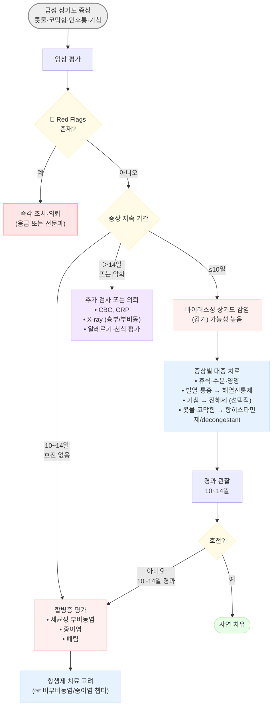
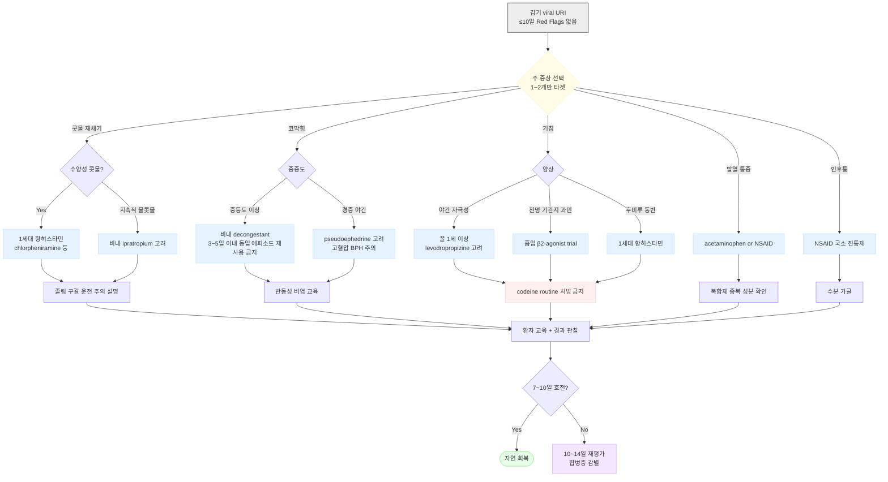

# 감기 Common Cold

## <mark style="color:green;">일반 사항</mark>

* 코, 비강, 인후, 후두 등 상기도에서의 단일 또는 복수의 바이러스 감염에 의해 콧물, 코 막힘, 기침 등을 주증상으로, 두통, 근육통, 발열 등의 전신 증상이 발생하는 질환
* 빈도: 소아 6\~8회/년, 성인 2\~3회/년
* 재감염: 바이러스마다 다양한 혈청형과 변종이 있으며 잠복기가 짧고 항체 수명이 짧아 쉽게 재감염됨
* 균 배출 기간: 감염 후 3(\~5)일째 가장 높으며 2주까지 지속; 증상이 완화되어도 균 배출은 지속될 수 있음
* 경과: 보통 7\~10일 내 자연 치유; \~25%에서 2주까지 지속; 흡연자는 비흡연자의 2배 지속
* 기전: 코와 비인두 점막 상피 세포에 바이러스 감염 및 증식 → 염증 반응 → 증상

## <mark style="color:green;">원인</mark>

### <mark style="color:orange;">원인균</mark>

* rhinovirus: 30\~50% 차지, 100가지 이상의 아형, 잠복기 1\~3일, 봄/가을 유행
* coronavirus (10\~15%; 잠복기 2\~4일), influenza virus (10\~15%; 잠복기 1\~2일), parainfluenza (5%; 2\~4일), RSV (5%; 3\~5일), adenovirus (＜5%; 4\~7일)
* \~40%에서 바이러스가 검출되지 않음 (검사 오류 또는 알려지지 않은 바이러스 감염 가능성)
* 5%에서 세균 (±바이러스) 검출


**COVID-19 이후 변화**: SARS-CoV-2도 감기 유사 증상으로 발현될 수 있으므로 임상적 판단에 포함. 성인 RSV 감염이 COVID-19 이후 증가 추세이며, 바이러스 복합 감염(viral co-infection)도 증가함. 국내에서는 인플루엔자·COVID-19 신속 항원 검사 및 multiplex PCR이 외래에서 용이하게 활용 가능함


### <mark style="color:orange;">전파 경로</mark>

#### <mark style="color:$primary;">코 분비물의 직접 접촉</mark>

* 감기 바이러스에 오염된 손으로 코 또는 눈을 만지면 전염됨 (비루관을 통하여 코로 유입)
* 환자 손의 50%에서 감기 바이러스가 검출됨
* 바이러스는 피부에서 3시간, 일반 환경에서 그 이상 생존
* 코를 통한 미량의 바이러스 유입만으로도 발병 가능

#### <mark style="color:$primary;">비말 및 공기 입자를 통한 감염</mark>

* 접촉 전파가 주요 경로이나 비말 전파도 중요한 역할을 함
* 공기 흡입 감염에는 직접 접촉 대비 약 20배의 균 농도가 필요하므로 순수 공기 전파 비중은 낮음
* 대화·기침·재채기 시 발생하는 단거리(1\~2 m 내) 비말(droplet)을 통한 전파는 임상적으로 유의미함
* influenza virus, SARS-CoV-2는 공기 전파 비중이 상대적으로 높음

### <mark style="color:orange;">위험 인자</mark>

* 소아 : 특히 ＜3세, 위쪽 형제가 있는 경우
* 유아원 등원 : 특히 등원 첫 해에 50% 이상 빈도 증가(12회/년 발병); 학교 입학 후에는 유아원을 다녔던 아동이 감기에 덜 걸림
* 계절 : 주로 초가을\~늦은 봄; 낮은 실내 습도는 비강 점막의 섬모 운동(mucociliary clearance)을 저하시켜 바이러스 침투를 용이하게 함&#x20;
* 흡연, 스트레스, 피로
* 고령 (면역노화; immunosenescence)

### <mark style="color:orange;">노인 특이사항 (Immunosenescence)</mark>

* 고령자에서는 감기 증상이 비전형적으로 발현되는 경우가 많음
  * 발열이 없거나 미미한 경우 많음 → 중증 감염임에도 체온이 정상으로 보일 수 있음
  * 비특이적 증상 (전신 쇠약감, 식욕 저하, 기능 저하, 섬망 등)으로 발현 가능
* 합병증 위험 ↑: 폐렴, 중이염, 심부전 악화 등; 조기 재평가 권장
* 일반 감기 약물 사용 시 부작용 위험 증가: 항히스타민제 → 낙상·섬망; decongestant → 혈압 상승·전립선 증상 악화

## <mark style="color:green;">임상 양상</mark>

* 일반적 경과 : 인후통 또는 목 간지럼 → 1\~3일 후 맑거나 점성의 콧물, 코 막힘, 재채기 → 3\~4일 후 진한 농성의 콧물, 기침 → 자연 치유
* 약물 치료에 의한 전체 이환 기간 단축 효과는 제한적이나, 일부 약물은 증상 완화 및 기능 회복에 도움을 줄 수 있음 (zinc 조기 투여, NSAIDs, ipratropium 등)
* 콧물/코 막힘 : 거의 모든 환자에서 발생; 보통 빨리 호전
* 재채기 : 환자의 ⅔에서 초기에 발생
* 기침: 환자의 ½에서 발생; 보통 코 증상 발생 후 출현; 가벼운 기침은 다른 증상이 호전된 이후에도 2\~3주간 지속될 수 있음
* 목구멍의 통증 또는 자극 (50%), 쉰 소리 (30%), 두통 (25%), malaise (25%)
* 발열: 없거나 첫 1\~3일에 미열
  * influenza virus, RSV, metapneumovirus, adenovirus에서 고열이 보다 흔함
  * 어린 소아 (＜6세)에서는 심하지 않은 감염에서도 고열이 흔함
  * 고령자에서는 발열 없이 발현 가능
* 구토/설사: 흔하지 않음

### <mark style="color:orange;">감염 후 지속 기침 (Post-Infectious Chronic Cough, PICC)</mark>

* **정의**: 급성 상기도 감염 회복 후에도 3\~8주 이상 지속되는 기침
* **기전**: 미주신경 과민성 (vagal hypersensitivity) 및 기침 반사 역치 저하
* **특징**: 자극 유발성 (냉기, 말, 웃음), 야간 악화, 천명 없음
* **치료**:
  * ipratropium 흡입 (1차): 기침 충동 감소
    * ✽ 국내에서 '감기' 상병만으로는 흡입제 보험 삭감 우려가 있음; '기관지 과민성' 또는 '천식 의심' 등의 근거 상병을 병기하거나 비급여로 처방하는 것이 현실적
  * 흡입 스테로이드 (선택적): 기도 과민성 동반 시 단기 사용
  * neuromodulator (refractory): amitriptyline, gabapentin (☞ [기침](../220_/006_-cough.md))
* ✽ PICC는 **아급성 기침 (3\~8주)** 영역으로, 감기의 급성기 (1\~2주)와 구별되는 경과임; 급성기 증상이 사라진 후 기침만 남아 있는 상태에서 적용하며 급성기 진해제 처방과 혼동하지 않도록 주의
* ✽ 3주 이상 지속되면 천식, 알레르기비염, GERD 등과의 감별 필요

### <mark style="color:$danger;">🚩 Red Flags!</mark>

<mark style="color:$danger;">**즉각 조치 또는 이송**</mark>

* 38.5℃ 이상의 고열이 소아에서 3일, 성인에서 5일 이상 지속
* 호흡곤란, 빠른 호흡, 청색증
* 의식 변화, 경련
* 안와 주위 현저한 부종 또는 발적 (안와 봉와직염 의심)
* 소아에서 급격한 침 흘림과 연하곤란 (후두개염 의심)

<mark style="color:$warning;">**당일 또는 조기 의뢰**</mark>

* 귀 통증 또는 청력 저하 동반 (중이염 의심)
* 안면부 통증 또는 이마·뺨 압통 + 증상 10일 이상 지속 (세균성 부비동염 의심)
* 편측의 피가 섞인 악취가 나는 콧물 (코 이물 또는 종양 의심)
* 현저한 목 강직 또는 후두 종창 (심경부감염/편도 주위 농양 의심)

<mark style="color:$info;">**외래 추적 / 추가 평가 계획**</mark> <mark style="color:$info;">- 즉각 위험 낮으나 호전 없으면 의뢰</mark>

* 콧물 또는 기침이 14일 이상 호전 없이 지속
* 기침이 3주 이상 지속 (PICC, 천식, 알레르기비염 등 감별 필요)
* 알레르기비염, 혈관운동성 비염, 약물 비염 등 감별이 필요한 경우
* 흡연자에서 증상 지속 시

## <mark style="color:green;">합병증</mark>

* [중이염](../222_/048_-otitis-media.md): 감기에 걸린 소아의 5\~30%에서 발생; 유아원 등원 시 더 많이 발생
* [비부비동염](../222_/053_-rhinosinusitis-sinusitis.md): 소아 5\~13% (성인 0.5\~2%)에서 발생; 콧물 또는 주간 기침이 10\~14일 호전 없이 지속되거나 안면 통증이 있으면 의심
  * **이중 악화 (double worsening)**: 증상이 호전되다 5\~6일째 다시 심해지며 발열이 동반되는 경우 → 세균성 부비동염 또는 2차 세균성 합병증의 강력한 신호
* [폐렴](068_-pneumonia.md): 세균성 폐렴은 드묾; 고령자·면역저하자에서 위험 증가
* [천식](071_-asthma.md) 악화: 천식 조절이 잘 되고 있는 경우에는 흔하지 않음


감기에 대한 약물 치료로 중이염, 비부비동염, 천식 등의 합병증 발병이나 악화를 예방하지는 못함.


## <mark style="color:green;">진단</mark>

* 임상 진단이 원칙; 실험실/영상 검사는 진단과 치료에 도움이 되지 않음; ＞14일 지속 시 감별을 위해 고려
* 농성 콧물은 상피 세포 및 중성구 유입과 관련된 일반적인 경과이며, 이것으로 세균 감염 또는 비부비동염을 판단할 수 없음

<table><thead><tr><th width="80">항목</th><th width="88">급성 기관지염</th><th width="88">알레르기 비염</th><th width="88">세균성 부비동염</th><th width="75">감기</th><th width="75">독감</th><th width="78">백일해</th><th width="80">인두염</th></tr></thead><tbody><tr><td>발병 양상</td><td>점차</td><td>점차</td><td>점차</td><td>점차</td><td>급속</td><td>점차</td><td>점차</td></tr><tr><td>기침</td><td>지속, dry or wet</td><td>만성, 혼합</td><td>점차, 혼합</td><td>혼합, dry</td><td>dry hacking</td><td>발작, whooping</td><td>드묾</td></tr><tr><td>인후통</td><td>혼합</td><td>가능</td><td>혼합</td><td>혼합</td><td>혼합</td><td>드묾</td><td>현저</td></tr><tr><td>발열</td><td>없거나 미열</td><td>없음</td><td>혼합</td><td>없거나 미열</td><td>고열</td><td>없거나 미열</td><td>V: 미열/B: 고열</td></tr><tr><td>전신 통증</td><td>경증</td><td>없음</td><td>혼합</td><td>경증</td><td>현저</td><td>드묾</td><td>B: 중증</td></tr><tr><td>콧물</td><td>드묾</td><td>현저</td><td>혼합</td><td>혼합</td><td>혼합</td><td>드묾</td><td>혼합</td></tr><tr><td>코막힘</td><td>드묾</td><td>혼합</td><td>혼합</td><td>혼합</td><td>가능</td><td>드묾</td><td>드묾</td></tr><tr><td>재채기</td><td>드묾</td><td>현저</td><td>드묾</td><td>혼합</td><td>드묾</td><td>드묾</td><td>혼합</td></tr><tr><td>두통</td><td>혼합, 경증</td><td>드묾</td><td>혼합</td><td>드묾</td><td>현저</td><td>드묾</td><td>혼합</td></tr><tr><td>호흡곤란</td><td>혼합</td><td>드묾</td><td>드묾</td><td>드묾</td><td>드묾</td><td>혼합</td><td>혼합</td></tr></tbody></table>

V=viral, B=bacterial

<p align="center"><em><mark style="color:$info;">Ref. Treatment of the Common Cold. AFP 2019;100(5)</mark></em></p>

### <mark style="color:orange;">감기 표현형 분류 (Cold Phenotype)</mark>

임상 표현형에 따라 치료 우선순위를 결정하면 불필요한 다제 처방을 줄일 수 있음.

<table><thead><tr><th width="90">표현형</th><th width="190">주요 증상</th><th width="195">치료 우선순위</th><th>유의 사항</th></tr></thead><tbody><tr><td><strong>A형</strong><br>Rhinorrhea dominant</td><td>콧물·재채기 위주, 기침 경미</td><td>1세대 항히스타민제<br>비내 decongestant</td><td>졸음 부작용 안내</td></tr><tr><td><strong>B형</strong><br>Cough dominant</td><td>기침 위주, 코 증상 경미</td><td>진해제 (선택적)<br>꿀 (소아)</td><td>후비루 동반 여부 확인</td></tr><tr><td><strong>C형</strong><br>Systemic/flu-like</td><td>발열·근육통·두통 현저</td><td>해열진통제 (NSAID/acetaminophen)</td><td>인플루엔자 감별; 신속 항원 검사 고려</td></tr><tr><td><strong>D형</strong><br>Post-viral cough (PICC)</td><td>급성기 회복 후 기침 3\~8주 지속</td><td>ipratropium 흡입<br>흡입 스테로이드 (선택)</td><td>아급성 기침 영역 (급성기와 구별); 천식·GERD와 감별 필요</td></tr></tbody></table>

### <mark style="color:orange;">감별 진단</mark>

* 기침 (☞ [기침](../220_/006_-cough.md))
* 편측의 피가 섞인 악취가 나는 콧물 → 코 이물
* ＞14일 지속되는 콧물 또는 기침, 두통 또는 안면부 통증, 안와 주위 부종 → 비부비동염 (☞ [비부비동염](../222_/053_-rhinosinusitis-sinusitis.md))
* 현저한 코 가려움 및 재채기 → 알레르기비염 (☞ [알레르기비염](../222_/051_-allergic-rhinitis.md))
* 자극감, 날씨 변화, 매운 음식 등에 의해 유발 → 혈관운동성 비염
* 코 울혈 제거제 사용력 → 약물 비염
* 콧구멍 주위의 긁은 상처, 점액농성 분비물 → 피부 감염 (Streptococcosis)
* 고열, 급속 발병, 현저한 근육통 → 인플루엔자 의심; 신속 항원 검사 고려

***



<p align="center"><strong>감기 접근 및 치료 알고리듬</strong></p>

<p align="center"><em><mark style="color:$info;">Ref. Treatment of the Common Cold. AFP 2019;100(5); NICE 2023</mark></em></p>

***



<p align="center"><strong>증상별 처방 결정 알고리듬 (Symptom-Driven Decision Tree)</strong></p>

<p align="center"><em><mark style="color:$info;">Ref. Treatment of the Common Cold. AFP 2019;100(5)</mark></em></p>

***

## <mark style="background-color:$warning;">Management</mark>


**최소 처방 원칙 (Minimal Prescription Strategy)**

1. 증상 1\~2개만 타겟으로 처방 (위 Symptom-Driven 알고리듬 참조)
2. 1\~2제 이내로 구성; 효과 근거가 낮고 부작용이 우려되는 경우 사용하지 않음
3. 항생제 사용 금지 (세균성 합병증 확인 시 예외)
4. OTC 자가 치료 가능 항목 (식염수 코 세척, 꿀, 해열진통제 등)은 환자에게 안내



**환자 기대 관리 (Expectation Setting)**\
진료 시 미리 안내하면 항생제 요구를 현저히 줄일 수 있음.

* "3일째가 증상의 최고점입니다. 이후 서서히 나아집니다."
* "콧물이 누렇게 변하는 것은 정상적인 경과이며, 항생제가 필요한 신호가 아닙니다."
* "기침은 다른 증상이 다 나은 후에도 2\~3주까지 지속될 수 있습니다."
* "7\~10일이 지나도 호전이 없으면 다시 오세요."


### <mark style="color:orange;">치료 방침</mark>

* 원칙적으로 대증 치료: 휴식, 적당한 영양 및 수분 섭취
* 항히스타민제, 코 울혈 제거제, 진해제 등의 약물은 효과 근거가 낮으며 심각한 부작용 위험이 있으므로 ＜2세에서 사용을 제한함
* 항생제 및 항바이러스제는 효과가 없으며 세균 합병증이 확인된 경우에만 사용


**⚠️ 임상 Pitfalls - 흔한 오류**

1. **농성 콧물 = 항생제 필요 ❌** - 감기의 정상 경과이며 세균 감염 지표가 아님
2. **5일 이상 감기 → 항생제 ❌** - 세균 감염 의심 기준은 10일 이상 지속 또는 이중 악화(double worsening)
3. **기침 2주 = 폐렴 ❌** - 감기 후 기침은 3주까지 정상; 흉부 X-ray 없이 폐렴 추정 처방 금물; 단, **고령자는 폐렴이어도 기침·발열이 없을 수 있으므로** 전신 쇠약·식욕 저하 등 비특이적 악화 시 흉부 X-ray 적극 시행
4. **발열 없음 = 바이러스성 확실 ❌** - 세균 감염·합병증도 발열 없이 발현 가능 (특히 고령자)
5. **비내 decongestant 장기 사용 ❌** - 3\~5일 초과 시 반동성 비염 유발; 동일 에피소드 재사용 금함
6. **＜2세 진해제·항히스타민제 ❌** - 심각한 부작용 위험; 국내외 지침에서 금지
7. **이중 악화 (double worsening) 간과 ❌** - 증상이 호전되다 5\~6일째 다시 심해지며 발열이 동반되면 단순 감기가 아닌 세균성 부비동염 또는 2차 세균성 폐렴의 강력한 신호; 항생제 처방 적극 고려



**지연 처방 전략 (Delayed Prescription)**\
항생제 필요 여부가 불확실한 경우 (경계성 부비동염 등), 즉시 처방 대신 지연 처방 전략을 고려할 수 있음. 환자에게 처방전을 주되 48\~72시간 내 호전이 없을 때만 사용하도록 안내. 항생제 노출을 20\~40% 줄이며 환자 만족도는 유지됨 (NICE 2023).


## <mark style="color:green;">비-약물 치료 및 예방</mark>

### <mark style="color:orange;">비-약물 치료</mark>

* 충분한 휴식과 수분 섭취
* 공기 가습: 분비물 점도 완화 기대; 일관성 있는 효과는 입증되지 않음
  * 가습기 사용 시 위생 관리 필수; 뜨거운 증기 가습기는 화상 주의; WHO는 뜨거운 증기 가습기 사용 반대
* 식염수 코 세척: bid × 1 wk; 일시적 증상 완화 (☞ [알레르기비염](../222_/051_-allergic-rhinitis.md#undefined-16))
* 꿀: 야간 기침 완화; ≥1세에서 사용 (＜1세 영아 보툴리즘 위험으로 금기); 5\~10 ㎖/회
  * Cochrane 2023 메타분석: 소아에서 야간 기침 빈도 및 기간 감소 효과; 성인에서는 근거 제한적
* 수액 치료: 탈수가 발생하지 않은 한 권고하지 않음; 소아에서 전해질 불균형 위험

### <mark style="color:orange;">예방</mark>

* 손 씻기, 맨손으로 눈/코/입 만지지 않기, 손 소독제 사용
  * ✽ rhinovirus는 non-enveloped 바이러스로 알코올 기반 소독제에 상대적으로 저항성이 있을 수 있음; **비누를 이용한 흐르는 물 손 씻기가 우선 권장됨**
* 감염자와의 접촉 최소화
* 금연 (흡연자는 증상 지속 기간 2배 연장)
* 인플루엔자 예방 접종 (매년 10\~11월; 독감·감기 혼동 감소, 합병증 예방)

## <mark style="color:green;">약물 치료</mark>

(보험기준 ☞ [건강보험심사평가원](https://www.hira.or.kr))

### <mark style="color:orange;">진해제 (Antitussive)</mark>

* 감기 기침에 대하여 **일관된 강력한 효과를 보이는 진해제는 없으나**, 일부 환자에서 증상 완화 목적의 선택적 사용은 가능함
  * codeine: RCT에서 효과 미약; 부작용·의존성 고려 시 일상적 사용 비권고
  * dextromethorphan: mixed evidence
  * levodropropizine: 일부 메타분석에서 긍정적 결과
* 감기에서의 기침은 후비루의 영향이 크므로 코 증상이 심한 시기에 진해제 반응이 적음; 1세대 항히스타민제가 약간의 도움이 됨
* 기도 반응성 증가에 의한 기침 (Virus-induced reactive airway disease)에 대하여 기관지 확장제가 효과 (☞ [보험기준](https://www.hira.or.kr/rc/insu/insuadtcrtr/InsuAdtCrtrPopup.do?mtgHmeDd=20130901\&sno=1\&mtgMtrRegSno=0022))

#### <mark style="color:$primary;">중추성</mark>

**dextromethorphan**

* 기전: 약한 NMDA 수용체 대항제
* 효과: 일부 연구에서 효과; narcotics에 비하여 효과 및 부작용이 적음
* 30 ㎎ tid\~qid (✽환각 작용에 따른 남용으로 단일제는 판매 중지; 복합제로만 시판 <mark style="color:blue;">\[코푸정 에스]</mark>)

**cloperastine**

* 기전/효과: σ1-receptor ligand, GIRK channel blocker, 항히스타민, 항콜린 작용 추정; 불명
* 부작용: 졸림
* <mark style="color:blue;">\[프리비투스]</mark> 8 ㎖/포; 5\~8 ㎖ tid; 2\~4세 2 ㎖ bid

**codeine**

* 기전/효과: 연수 기침 중추 억제 (narcotics)
* 부작용: 졸음, 변비, 소화 장애
* 복합제로 시판: <mark style="color:blue;">\[코푸 시럽]</mark> 20 ㎖/포 tid\~qid, <mark style="color:blue;">\[코데닝]</mark> 6T #3; **＜12세 사용 금지**
  * ✽ 12\~18세에서도 비만, 폐질환, 수면 무호흡증이 있는 경우 호흡 저하 위험으로 신중 투여 또는 금기 (식약처 안전성 서한)
  * ✽ <mark style="color:blue;">\[코푸 시럽]</mark> 10 ㎖ 중: dihydrocodeine 5 ㎎/methylephedrine 13.1 ㎎/chlorpheniramine 1.5 ㎎/ammonium chloride 0.1 g; 20 ㎖ tid\~qid
  * ✽ <mark style="color:blue;">\[코데닝]</mark>: dihydrocodeine 5 ㎎/methylephedrine 17.5 ㎎/chlorpheniramine 1.5 ㎎/guaifenesin 50 ㎎; 6T #3

#### <mark style="color:$primary;">비중추성</mark>

**levodropropizine**

* 기전/효과: 기침 경로의 C-fiber 억제; 일부 메타분석에서 dextromethorphan 대비 동등 이상 효과
* <mark style="color:blue;">\[드로피진]</mark> 60 ㎎/T 또는 10 ㎖/포 tid; 3 ㎎/㎏/d #3; <mark style="color:blue;">\[레보케어 CR]</mark> 90 ㎎/T bid

**ivy leaf 추출물** (hederacoside C)

* 기전/효과: 항경련 작용 (아세틸콜린 유도성 기관지 연축 방지), 항염, 점액 용해
* <mark style="color:blue;">\[푸로스판]</mark> 5\~7.5 ㎖ bid\~tid; 2\~5세 2.5 ㎖ bid

**benzonatate**

* 기전/효과: 미주신경 억제, 뇌간 기침 중추 일부 억제; 효과는 다양하고 예측 불가
* <mark style="color:blue;">\[지콜]</mark> 100, 200 ㎎/C; 3C #3

**theobromine**

* 기전/효과: methylxanthine 유도체; 미주신경 구심 신경 활성 억제
* 부작용: 대용량에서 오심/구토
* <mark style="color:blue;">\[애니코프]</mark> 300 ㎎/C; 2C #2

**β2-agonist**

* 기전/효과: 기도 폐쇄, 기관지 경련이 있는 경우 도움
* 부작용: 떨림, 불안감
* salbutamol <mark style="color:blue;">\[벤토린 에보할러]</mark>
* tulobuterol: 6개월\~3세 미만 0.5 ㎎, 3\~9세 미만 1 ㎎ <mark style="color:blue;">\[호쿠날린 패취]</mark>
* formoterol: 40 ㎍/T 4T #2 <mark style="color:blue;">\[아토크]</mark>
* procaterol: 50 ㎍/T 1T qhs\~bid <mark style="color:blue;">\[메프친]</mark>

**ipratropium**

* 기전/효과: 항콜린 작용; 천식성 기침 및 PICC에 효과
* <mark style="color:blue;">\[아트로벤트 흡입액]</mark> (☞ [보험기준](https://www.hira.or.kr/rc/insu/insuadtcrtr/InsuAdtCrtrPopup.do?mtgHmeDd=20170825\&sno=2\&mtgMtrRegSno=0031))

#### <mark style="color:$primary;">기타</mark>

**amitriptyline**

* 기전/효과: 바이러스 감염 후 미주신경/감각신경 장애와 관련된 기침, PICC
* <mark style="color:blue;">\[에트라빌]</mark> 10 ㎎/T; 1T hs

**항히스타민제** (진해 목적)

* 기전/효과: 진정 및 항콜린 작용; 1세대는 후비루와 인후 불편감을 포함한 급성 기침에 약간의 효과; 2세대는 효과 없음; **임상적 효과는 제한적이며 부작용 대비 선택적 사용 권장** (☞ [항히스타민제](../231_/212_-antihistamines.md))
* chlorpheniramine: 2 ㎎/T 1\~3T bid\~qid; 0.5 ㎎/㎏/d #4 <mark style="color:blue;">\[페니라민]</mark>
* clemastine: 1 ㎎/T 1T bid <mark style="color:blue;">\[마스질]</mark>

**박하, 자일리톨, 기타 사탕/껌**

* 기전/효과: 흡입 또는 물고 있는 동안 인후 민감도 감소
* ≥6세에서 고려 (흡인 위험)

### <mark style="color:orange;">점액 용해제 (Mucolytics)</mark>

* **일반 감기에서는 일률적 사용이 권고되지 않음**; 특히 소아에서는 유의미한 효과가 입증되지 않음
* 일부 연구에서 guaifenesin, bromhexine이 유의미한 효과 보임; 만성 기도 질환 동반 시 보조적 고려 가능

**분류**

* 분비 촉진제 (expectorant): 고장성 식염수 aerosol, guaifenesin, 이온 통로 조절제
* 점액 조절제 (mucoregulator): carbocysteine, 항콜린제, steroid
* 점액 용해제 (mucolytics): N-acetylcysteine, bromhexine, erdosteine, sobrerol, ambroxol
* 점액 활성제 (mucokinetics): 흡입 β2-기관지 확장제, methylxanthine, ambroxol, acebrophylline

| 성분명 <mark style="color:blue;">\[상품명]</mark>                    | 용법                 | 비고        |
| -------------------------------------------------------------- | ------------------ | --------- |
| guaifenesin¹⁾ <mark style="color:blue;">\[코데닝]</mark>          | 2T tid (복합제)       | 약간의 진해 효과 |
| carbocysteine <mark style="color:blue;">\[리나치올]</mark>         | 500 ㎎/C tid        | 점액 조절     |
| acetylcysteine <mark style="color:blue;">\[뮤테란]</mark>         | 200 ㎎/C tid        |           |
| bromhexine <mark style="color:blue;">\[비졸본]</mark>             | 8 ㎎/T 1\\\~2T tid  |           |
| erdosteine <mark style="color:blue;">\[엘도스]</mark>             | 300 ㎎/C bid\\\~tid |           |
| sobrerol <mark style="color:blue;">\[소부날]</mark>               | 200 ㎎/C bid        |           |
| ambroxol <mark style="color:blue;">\[뮤코펙트]</mark>              | 30 ㎎/T tid         | 점액 활성     |
| acebrophylline <mark style="color:blue;">\[설포라제]</mark>        | 100 ㎎/C bid        | 점액 활성     |
| pelargonium sidoides²⁾ <mark style="color:blue;">\[움카민]</mark> | 9 ㎖ 또는 1T tid      | 기전 불명확    |
| coptis rhizome²⁾ <mark style="color:blue;">\[시네츄라]</mark>      | 15 ㎖ tid           | 기전 불명확    |

_1) 약간의 진해 효과를 지님._\
\&#xNAN;_2) 기전 및 효과에 대해 충분히 알려져 있지 않음_

### <mark style="color:orange;">콧물 치료제 (Anti-rhinorrhea)</mark>

* 감기에 의한 콧물은 주로 kinin과 관련되나 이에 효과적인 약제는 없음
* 감기의 코 증상에 대하여 효능이 입증된 약제는 없음 (위약 효과 최대 40%)

#### <mark style="color:$primary;">항히스타민제</mark>

* 감기에서의 콧물은 히스타민보다 kinin·콜린성 자극과 관련되므로, **2세대 항히스타민제 (항알레르기 작용)는 감기 콧물에 효과 없음**
* 1세대: **항콜린(anticholinergic) 작용에 의한 분비물 억제**로 콧물을 25\~30% 감소; 단, 분비물 배출 장애 초래 가능; 임상적 효과는 제한적이며 선택적 사용 권장
* 부작용: 졸음, 입마름, paradoxical hyperactivity, 호흡 저하 (과사용 시)
* chlorpheniramine: 2 ㎎/T 1\~3T bid\~qid; 0.5 ㎎/㎏/d #4 <mark style="color:blue;">\[페니라민]</mark>
* clemastine: 1 ㎎/T 1T bid <mark style="color:blue;">\[마스질]</mark>

#### <mark style="color:$primary;">비내 항콜린제</mark>

* 기전/효과: 항콜린 작용에 의한 약간의 효과
* 부작용: 비점막 자극, 코피
* 효과-부작용을 고려하여 권고하지 않음

### <mark style="color:orange;">코 막힘 치료제 (Decongestant)</mark>

* 기전: 코 막힘 및 콧물 일부는 혈관 확장과 관련

#### <mark style="color:$primary;">비내 울혈 제거제</mark>

* 부작용: 약물 반동성 비염
* 소아에서의 연구는 부족함
* **용법: 3\~5일 이상 연속 사용 금지; 동일 감염 에피소드에서 반복 사용 금함 (반동성 비염 예방)**
* phenylephrine <mark style="color:blue;">\[시네프린]</mark>, naphazoline <mark style="color:blue;">\[나리스타]</mark> (chlorpheniramine 복합), xylometazoline <mark style="color:blue;">\[오트리빈]</mark>, oxymetazoline <mark style="color:blue;">\[레스피비엔]</mark>

#### <mark style="color:$primary;">경구 코 울혈 제거제</mark>

* 효과: 일부 연구에서 약간의 효과; 소아에서의 연구는 부족함
* 약물 반동성 비염 위험 없음; 국소 자극 없음
* 부작용: CNS 자극, 혈압 상승, 가슴 두근거림, 불안, **불면증**, 수면 장애; **안압 상승 (녹내장 환자 주의)**
* **주의: 심혈관계 질환, 고혈압, BPH, 갑상선 질환, 녹내장 환자에서 사용 금지 또는 주의**
* phenylephrine: 10 ㎎ tid\~qid; 복합제 <mark style="color:blue;">\[코미 시럽]</mark>
* pseudoephedrine: 60 ㎎/T ½\~1T tid\~qid <mark style="color:blue;">\[슈다페드]</mark>
  * ✽ 성인 최대 240 ㎎/d; 감기 복합제 (코미 시럽 등)와 pseudoephedrine 단일제 중복 복용 시 과량 투여 주의

#### <mark style="color:$primary;">기타</mark>

* 아로마 oil (menthol, camphor, eucalyptus): 코 밑 도포 시 실제 기류 저항에 대한 변화는 없지만 호흡이 편해진 것처럼 느낌
* 식염수 코 세척: 일시적 증상 완화 (☞ [알레르기비염](../222_/051_-allergic-rhinitis.md#undefined-16))

### <mark style="color:orange;">진통·해열제</mark>

* NSAID 및 acetaminophen 간의 입증된 효과 차이는 없음; NSAIDs는 기능 회복에도 약간 유리
* naproxen: 275 ㎎ tid 또는 500 ㎎ bid <mark style="color:blue;">\[아나프록스, 낙센]</mark> (보험주의)
* ibuprofen: 400 ㎎ tid\~qid <mark style="color:blue;">\[부루펜]</mark>
* acetaminophen: 650\~1,300 ㎎ tid <mark style="color:blue;">\[타이레놀]</mark>


⚠️ **소아에서 aspirin 사용 금지**: 인플루엔자 또는 수두가 의심되는 소아·청소년에서 aspirin 투여 시 라이 증후군(Reye syndrome, 간부전·뇌병증) 위험이 있어 금기. 소아 해열진통제는 acetaminophen 또는 ibuprofen만 사용.



**소아 OTC 감기약 연령 제한**: 현행 지침상 ＜2세에서 진해제·항히스타민제 사용 금지이나, FDA 및 최신 가이드라인은 효과 부족과 부작용 위험을 근거로 **＜4\~6세**에서도 OTC 감기약 사용 자제를 권고하는 추세임.


### <mark style="color:orange;">보완 요법 및 보충제</mark>

#### <mark style="color:$primary;">아연 (zinc)</mark>

* 효과: 바이러스 증식 억제 (실험실 연구); 메타분석 결과 불일치 (Cochrane 2021: inconsistent); **routine recommendation은 아님**
* 증상 발생 24시간 이내 시작 시 이환 기간 단축 가능성 있음
* 시럽 또는 경구 사탕 (lozenge)으로 공급; 부작용: 쓴맛, 구역


⚠️ **아연 비강 내 투여 금기**: zinc 함유 비강 내 스프레이·겔 사용은 영구적 후각 상실(anosmia) 위험이 있어 금기 (FDA 경고). 경구 제형만 사용.


#### <mark style="color:$primary;">비타민 C (vitamin C)</mark>

* 효과: 규칙적 투여 시 증상 중증도 및 유병 기간 소폭 감소; 임상적 의미는 제한적; **routine recommendation은 아님**
* 감기 발생 후 투여를 시작한 경우의 효과는 불확실
* 용법: 1\~2 g/d

#### <mark style="color:$primary;">비타민 D (vitamin D)</mark>

* 결핍 시 상기도 감염 위험 증가 → 결핍 교정에 한하여 의미 있음
* **충분한 비타민 D 상태에서 추가 보충의 감기 예방 효과는 입증되지 않음** (VITAL trial 2022); routine recommendation은 아님

#### <mark style="color:$primary;">Echinacea purpurea</mark>

* 효과: 입증 안 됨
* 용법: 4 ㎖ bid

#### <mark style="color:$primary;">probiotics</mark>

* 일부 소아 연구에서 감기 중증도·유병 기간 감소 보고 있으나 일관성 없음; routine recommendation은 아님

#### <mark style="color:$primary;">마늘</mark>

* 효과: 일부에서 유효; 근거 부족
* allicin 180 ㎎ (마늘 3 g 해당, 약 20쪽)

***

### <mark style="color:red;">질병코드</mark>

J00 급성 비인두염 \[감기]\
J06 다발성 및 상세불명 부위의 급성 상기도감염

***

## <mark style="color:purple;">처방례</mark>

> **처방례 1. 성인 - 기침·콧물 위주 (기본형)**
>
> ```
> 코데닝  6T  #3                    (기침·거담, 졸음 주의)
> 페니라민 2 ㎎/T  6T  #3            (콧물, 졸음 주의)
> 타이레놀 이알 650 ㎎/T  3T  #3  prn
> ```
>
> _✽ 코데닝에 guaifenesin + dihydrocodeine 함유; 운전·음주 주의 안내 필수_

> **처방례 2. 성인 - 기침 심한 경우 (non-narcotic 병합)**
>
> ```
> 드로피진 60 ㎎/T  3T  #3
> 프리비투스  8 ㎖/포  3포  #3
> 페니라민 2 ㎎/T  6T  #3           (졸음 주의)
> 타이레놀 이알 650 ㎎/T  3T  #3  prn
> ```
>
> _✽ levodropropizine + cloperastine으로 다른 기전의 진해 효과 기대; codeine 대비 진정 부작용 최소화_

> **처방례 3. 성인 - 기침 심한 경우 (codeine 복합제)**
>
> ```
> 코푸 시럽  20 ㎖/포  4포  #4       (졸음 주의, ＜12세 금기)
> 애니코프 300 ㎎/C  2C  #2
> 부루펜 200 ㎎/T  4T  #2
> ```
>
> _✽ <mark style="color:blue;">\[코푸 시럽]</mark>: dihydrocodeine + methylephedrine + chlorpheniramine 복합; ＜12세 사용 금지_

> **처방례 4. 소아 - 기침·콧물 (2\~5세, 체중 15 ㎏ 예시)**
>
> ```
> 푸로스판 시럽  2.5 ㎖/회  tid          (ivy leaf 추출물, 거담·진해)
> 프리비투스 시럽  2 ㎖/회  bid           (cloperastine, 졸음 주의)
> 타이레놀 현탁액  10 ㎎/㎏/회  tid  prn   (= 약 150 ㎎/회)
> ```
>
> _✽ 소아는 항상 체중 기반 용량 산정; ＜2세에서 진해제·항히스타민제 사용 금지_

> **처방례 5. 고령자 - 저진정·심혈관 안전 옵션 (65세 이상)**
>
> ```
> 드로피진 60 ㎎/T  3T  #3             (졸음 없음, 낙상 위험 최소)
> 푸로스판 시럽  7.5 ㎖/회  tid          (천연 거담, 부작용 적음)
> 타이레놀 이알 650 ㎎/T  2T  #2  prn   (용량 감량)
> ```
>
> _✽ 고령자에서 1세대 항히스타민제·경구 decongestant는 낙상·섬망·혈압 상승 위험으로 가급적 회피; codeine 함유제 주의 (변비·과진정); acetaminophen 최대 2,000 ㎎/d 감량 권고 (간·신기능 저하 시); **NSAIDs는 고령자에서 신기능 저하·위장관 출혈 위험으로 가급적 회피하고 acetaminophen 우선 사용**_

***

### <mark style="color:$success;">핵심 복약 지도</mark>

* **항히스타민제 (1세대)** - 졸음 부작용이 있으므로 복용 중 운전·기계 조작·음주를 삼가도록 안내; 소아에서 역설적 흥분이 나타나면 즉시 복용 중단; 고령자에서 낙상·섬망 위험 증가
* **비내 코 울혈 제거제** - 3\~5일 이상 연속 사용 금지; 동일 감염 에피소드에서 반복 사용 금함 (반동성 비염 예방)
* **codeine 함유 복합제** - ＜12세에서 사용 금지; 졸음·변비 발생 가능; 음주 금지
* **acetaminophen** - 하루 4,000 ㎎ 초과하지 않도록 안내 (고령자·간질환 시 2,000 ㎎); 다른 감기 복합제와 acetaminophen 중복 성분 반드시 확인
* **경구 decongestant** - 고혈압·심혈관 질환·BPH·갑상선 질환 환자에서 사용 금지 또는 주의
* **항생제는 필요 없음** - 감기는 바이러스 감염이므로 항생제가 효과 없음을 명확히 설명; 농성 콧물·5일 이상 증상만으로는 항생제 적응증이 아님을 안내
* **기침 지속 안내** - 다른 증상이 회복된 이후에도 기침은 2\~3주 지속될 수 있음을 미리 안내; 3주 이상 지속되면 재진 권유

***

### <mark style="color:blue;">환자 안내서</mark>

**감기란?**\
감기는 바이러스가 코와 목을 감염시켜 생기는 질환입니다. 보통 7\~10일이면 저절로 낫습니다. 약을 먹어도 완치 기간을 크게 줄이지는 못하며, 불편한 증상을 완화하는 데 도움이 됩니다.

**감기의 정상적인 경과**

* 1\~3일째: 인후통·목 간지럼 → 콧물·코막힘 시작
* **3일째가 증상이 가장 심한 시기입니다.** 이후 서서히 나아집니다.
* 4\~7일째: 콧물이 누렇게 진해지는 것은 정상 경과입니다. 항생제가 필요한 신호가 아닙니다.
* 기침은 다른 증상이 다 나은 후에도 **2\~3주까지 지속될 수 있습니다.**

**이런 증상이 있으면 바로 병원에 오세요**

* 38.5℃ 이상 고열이 소아 3일, 성인 5일 이상 지속될 때
* 숨쉬기가 힘들거나 숨이 빠를 때
* 귀가 아프거나 갑자기 잘 안 들릴 때
* 눈 주위가 붓거나 빨개질 때
* 2주가 지나도 콧물이나 기침이 낫지 않을 때

**집에서 이렇게 하세요**

* 충분히 쉬고, 물을 자주 마시세요.
* 콧물이 심하면 미지근한 소금물(생리식염수)로 코를 세척해 주세요.
* 발열이나 통증이 있으면 해열진통제(타이레놀, 이부프로펜 등)를 드세요.
* 목이 간지럽거나 기침이 심하면 꿀을 따뜻한 물에 타서 마시면 도움이 됩니다 (만 1세 미만은 금지).
* 가습기를 사용할 경우 매일 깨끗이 씻어 세균이 자라지 않도록 하세요.

**감기를 다른 사람에게 옮기지 않으려면**

* 손을 자주 씻고, 손으로 눈·코·입을 만지지 마세요.
* 기침이나 재채기 시 입을 가리고, 사용한 휴지는 바로 버리세요.
* 증상이 있는 동안에는 가능하면 다른 사람과의 접촉을 줄이세요.

**항생제는 필요하지 않습니다**\
감기는 바이러스가 원인이므로 항생제가 효과 없습니다. 항생제를 불필요하게 복용하면 내성균이 생겨 나중에 꼭 필요할 때 효과가 떨어질 수 있습니다. 담당 의사가 항생제를 처방하지 않았다면, 이것은 정상적인 진료입니다.
