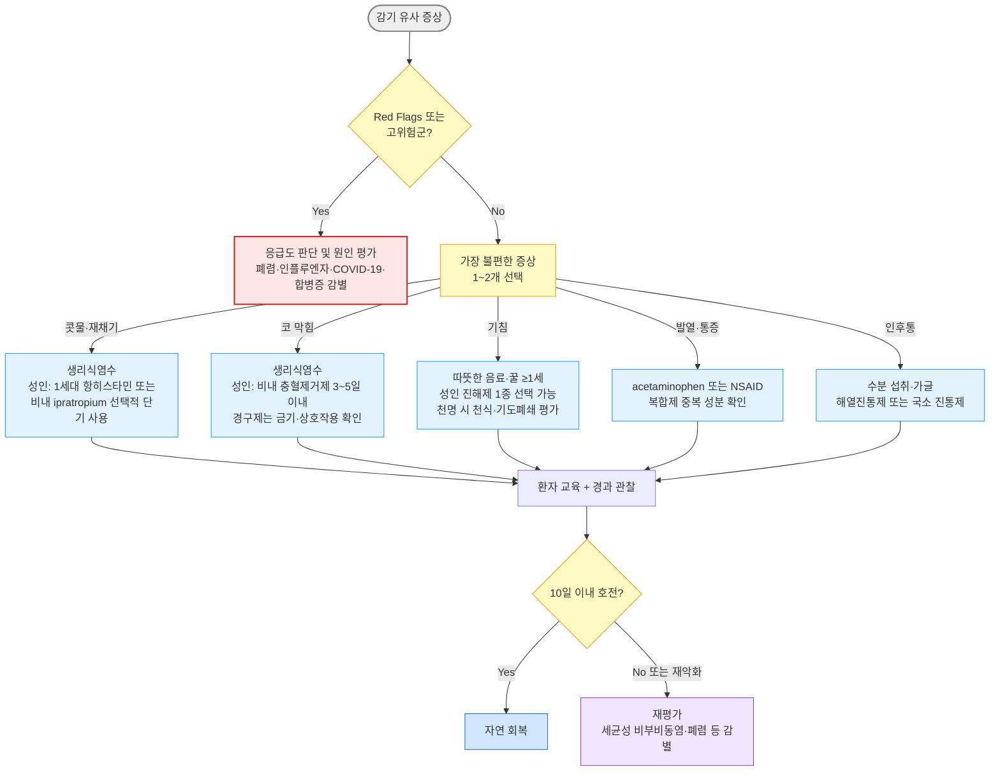

# 감기 Common Cold

## <mark style="color:green;">일반 사항</mark>

* 코, 비강, 인후, 후두 등 상기도에서의 단일 또는 복수의 바이러스 감염에 의해 콧물, 코 막힘, 기침 등을 주증상으로, 두통, 근육통, 발열 등의 전신 증상이 발생하는 질환
* 빈도 : 소아 6\~8회/년, 성인 2\~3회/년
* 재감염 : 바이러스마다 다양한 혈청형과 변종이 있으며 잠복기가 짧고 항체 수명이 짧아 쉽게 재감염됨
* 바이러스 배출 및 전염력 : 대개 증상 발생 전후와 초기 수일에 높지만 바이러스·연령·면역 상태에 따라 다르며, 증상 호전 후에도 바이러스가 검출될 수 있음
* 경과 : 증상은 대개 2\~3일째 가장 심하고 7\~10일 내 자연 호전; 콧물·기침은 2주 이상 지속될 수 있으며 흡연자는 증상이 더 오래 지속될 수 있음
* 기전 : 코와 비인두 점막 상피 세포에 바이러스 감염 및 증식 → 염증 반응 → 증상

## <mark style="color:green;">원인</mark>

### <mark style="color:orange;">원인 바이러스</mark>

* 200종 이상의 바이러스가 감기 증후군을 일으킬 수 있으며 rhinovirus가 가장 흔함
* 계절성 human coronavirus, adenovirus, parainfluenza virus, RSV, human metapneumovirus 등도 감기 유사 증상을 일으킬 수 있음
* 인플루엔자와 SARS-CoV-2 감염은 초기에는 감기처럼 보일 수 있으나, 고위험군에서 조기 진단과 특이 치료가 가능하므로 별도 질환으로 감별
* 호흡기 검체에서 세균이 검출되더라도 집락화일 수 있으므로, 검출 자체가 세균성 감염이나 항생제 적응증을 의미하지 않음


**감기 유사 증상의 감별** : SARS-CoV-2와 인플루엔자도 가벼운 콧물·인후통·기침으로 발현할 수 있음. 유행 상황, 노출력, 발병 양상, 중증화 위험 및 항바이러스 치료 가능성을 고려하여 표적 검사를 시행하며, 단순 감기에 multiplex PCR을 routine으로 시행하지 않음


### <mark style="color:orange;">전파 경로</mark>

* 대화·호흡·기침·재채기에서 발생한 호흡기 입자의 흡입, 눈·코·입 점막으로의 직접 침착, 오염된 손을 통한 자가 접종 등으로 전파
* 전파 경로의 상대적 중요도는 바이러스, 환기, 거리, 체류 시간에 따라 달라지므로 비말과 에어로졸을 1\~2 m 기준으로 엄격히 구분하지 않음
* 밀폐·밀집·밀접 환경과 환기 불량은 호흡기 바이러스 전파 위험을 높임

### <mark style="color:orange;">위험 인자</mark>

* 소아: 특히 ＜3세, 위쪽 형제가 있는 경우
* 유아원 등원 : 특히 등원 첫 해에 50% 이상 빈도 증가(12회/년 발병); 학교 입학 후에는 유아원을 다녔던 아동이 감기에 덜 걸림
* 계절 : 주로 초가을\~늦은 봄; 낮은 실내 습도는 비강 점막의 섬모 운동(mucociliary clearance)을 저하시켜 바이러스 침투를 용이하게 함
* 흡연, 스트레스, 피로
* 고령은 감기 발생 빈도 자체보다 비전형적 발현, 중증화 및 합병증 위험과 관련

### <mark style="color:orange;">노인 특이사항 (Immunosenescence)</mark>

* 고령자에서는 감기 증상이 비전형적으로 발현되는 경우가 많음
  * 발열이 없거나 미미한 경우 많음 → 중증 감염임에도 체온이 정상으로 보일 수 있음
  * 비특이적 증상 (전신 쇠약감, 식욕 저하, 기능 저하, 섬망 등)으로 발현 가능
* 합병증 위험 ↑ : 폐렴, 중이염, 심부전 악화 등; 조기 재평가 권장
* 약물 부작용 위험 증가 : 항히스타민제 → 낙상·섬망; decongestant → 혈압 상승·전립선 증상 악화

## <mark style="color:green;">임상 양상</mark>

* 일반적 경과 : 인후 불편감, 콧물·코 막힘, 재채기, 기침 등이 서서히 나타나며 2\~3일째 가장 심함; 경과 중 콧물이 누렇거나 진해질 수 있으나 그 자체는 세균 감염의 증거가 아님
* 약물 치료는 전체 이환 기간을 크게 단축하지 못하므로 가장 불편한 증상 1\~2개를 대상으로 단기간 사용
* 콧물/코 막힘: 거의 모든 환자에서 발생; 보통 빨리 호전
* 재채기 : 환자의 ⅔에서 초기에 발생
* 기침 : 환자의 ½에서 발생; 보통 코 증상 발생 후 출현; 가벼운 기침은 다른 증상이 호전된 이후에도 2\~3주간 지속될 수 있음
* 목구멍의 통증 또는 자극, 쉰 목소리, 두통, 전신 권태감 등이 동반될 수 있음
* 발열 : 없거나 첫 1\~3일에 미열
  * influenza virus, RSV, metapneumovirus, adenovirus에서 고열이 보다 흔함
  * 어린 소아 (＜6세)에서는 심하지 않은 감염에서도 고열이 흔함
  * 고령자에서는 발열 없이 발현 가능
* 구토/설사 : 흔하지 않음

### <mark style="color:$danger;">🚩 Red Flags!</mark>

<mark style="color:$danger;">**즉각 조치 또는 이송**</mark>

* 심한 호흡곤란, 빠른 호흡, 청색증, 산소포화도 저하
* 의식 변화, 경련, 쇼크 소견
* 심한 두통·목 강직과 의식 변화 또는 신경학적 이상 (중추신경계 감염 의심)
* 안구운동 통증·제한, 복시, 시력 저하, 안구돌출을 동반한 안와 주위 부종·발적 (안와 봉와직염 의심)
* 급격한 침 흘림, 연하곤란, 흡기성 협착음 또는 호흡곤란 (후두개염·심경부감염 의심)
* 생후 3개월 미만 영아에서 38℃ 이상 발열

<mark style="color:$warning;">**당일 또는 조기 의뢰**</mark>

* 탈수, 지속적 구토 또는 경구 섭취 곤란
* 고열이 3\~4일 이상 지속되거나 전신 상태가 뚜렷하게 악화
* 심한 귀 통증·이루 또는 급격한 청력 저하 (중이염 등 평가)
* 심한 일측 인후통, 개구장애, 구개수 편위, 웅얼거리는 음성 (편도주위농양 의심)
* 소아의 편측 악취성 콧물 또는 코 이물 의심; 단, 단추형 전지나 자석이 의심되면 즉시 제거 가능한 응급 진료

<mark style="color:$info;">**외래 추적 / 추가 평가 계획**</mark> <mark style="color:$info;">- 즉각 위험 낮으나 호전 없으면 의뢰</mark>

* 증상이 10일 이상 호전 없이 지속되거나 호전 후 다시 악화 (급성 세균성 비부비동염 등 감별)
* 기침이 3주 이상 지속 (감염 후 기침, 천식, 상기도기침증후군 등 감별); 8주 이상이면 만성 기침으로 평가
* 알레르기비염, 혈관운동성 비염, 약물 비염 등 감별이 필요한 경우
* 흡연자, 면역저하자 또는 만성 심폐질환자에서 증상이 지속되거나 기저질환이 악화

## <mark style="color:green;">합병증</mark>

* [중이염](../222_/048_-otitis-media.md) : 감기에 걸린 소아의 5\~30%에서 발생; 유아원 등원 시 더 많이 발생
* [비부비동염](../222_/053_-rhinosinusitis-sinusitis.md) : 콧물·코 막힘·안면 통증/압박감 등이 10일 이상 호전 없이 지속되거나 호전 후 다시 악화하면 급성 세균성 비부비동염을 의심
  * 이중 악화 (double worsening) : 처음 호전되던 코 증상·기침·발열 등이 다시 악화하는 양상; 발열이 반드시 동반되어야 하는 것은 아님
* [폐렴](068_-pneumonia.md) : 세균성 폐렴은 드묾; 고령자·면역 저하자에서 위험 증가
* [천식](071_-asthma.md) 악화 : 바이러스성 호흡기감염은 흔한 천식 악화 유발 인자


감기에 대한 약물 치료로 중이염, 비부비동염, 천식 등의 합병증 발병이나 악화를 예방하지 못함


## <mark style="color:green;">진단</mark>

* 임상 진단이 원칙
* 합병증 없는 단순 감기에는 routine 실험실·영상 검사가 필요하지 않음
* 인플루엔자·COVID-19 항바이러스 치료 대상, 유행·노출 관리가 필요한 경우 또는 폐렴·세균성 합병증 등 대체 진단이 의심되는 경우에는 결과가 처치에 미치는 영향을 고려하여 표적 검사
* 농성 콧물은 상피 세포 및 중성구 유입과 관련된 일반적인 경과이며, 이것으로 세균 감염 또는 비부비동염을 판단할 수 없음

<table><thead><tr><th width="120">질환</th><th>감별에 도움이 되는 양상</th><th>확인 사항</th></tr></thead><tbody><tr><td>인플루엔자</td><td>갑작스러운 발병, 발열·오한·근육통·두통 등 전신 증상이 현저</td><td>유행 상황, 고위험군, 항바이러스 치료 가능 시 검사 고려</td></tr><tr><td>COVID-19</td><td>감기와 임상적으로 구분되지 않을 수 있음</td><td>유행·노출력, 고위험군, 항바이러스 치료 가능 시 검사 고려</td></tr><tr><td>알레르기비염</td><td>코·눈 가려움, 반복적 재채기, 수양성 콧물; 발열 없음</td><td>계절성·노출 연관성과 반복 경과</td></tr><tr><td>급성 세균성 비부비동염</td><td>10일 이상 무호전 또는 호전 후 재악화; 농성 비루와 코 막힘/안면 통증</td><td>안구·신경학적 합병증 소견</td></tr><tr><td>급성 기관지염</td><td>기침이 주 증상이며 흔히 2\~3주 지속</td><td>폐렴을 시사하는 활력징후·국소 폐 소견 배제</td></tr><tr><td>백일해</td><td>발작적 기침, 흡기성 whoop, 기침 후 구토; 초기에는 감기와 유사</td><td>지속 기간, 접촉력, 예방접종력</td></tr><tr><td>인두염/편도염</td><td>인후통이 주 증상; 기침·콧물 동반 시 바이러스성 가능성이 높음</td><td>GAS 평가 기준 및 필요 시 신속항원검사</td></tr></tbody></table>

<p align="center"><em><mark style="color:$info;">Ref. Treatment of the Common Cold. AFP 2019;100(5); CDC Common Cold 2025</mark></em></p>

### <mark style="color:orange;">증상 중심 치료 선택</mark>

* 공식적인 표현형 분류가 아니라, 가장 불편한 증상 1\~2개를 선택하여 불필요한 다제 처방을 줄이기 위한 실용적 접근


<table><thead><tr><th width="140">주요 증상</th><th width="210">선택적 대증 치료</th><th>유의 사항</th></tr></thead><tbody><tr><td>수양성 콧물·재채기</td><td>성인에서 1세대 항히스타민제 또는 비내 ipratropium 단기 고려</td><td>효과는 제한적; 졸림·항콜린 부작용 또는 비건조·코피 확인</td></tr><tr><td>코 막힘</td><td>생리식염수; 성인에서 비내 충혈제거제 단기 고려</td><td>연속 3\~5일 이내; 고혈압·심혈관질환 등 확인</td></tr><tr><td>기침</td><td>따뜻한 음료, ≥1세에서 꿀; 성인 진해제는 선택적 사용</td><td>효과 근거가 제한적이며 진해제 병용은 피함</td></tr><tr><td>발열·두통·근육통</td><td>acetaminophen 또는 NSAID</td><td>복합 감기약의 중복 성분과 금기 확인</td></tr><tr><td>현저한 전신 증상</td><td>해열진통제와 수분 섭취</td><td>인플루엔자·COVID-19 감별 및 조기 항바이러스 치료 대상 확인</td></tr></tbody></table>

### <mark style="color:orange;">감별 진단</mark>

* 기침 (☞ [기침](../220_/006_-cough.md))
* 편측의 피가 섞인 악취가 나는 콧물 → 코 이물
* 10일 이상 호전 없이 지속되는 농성 비루·코 막힘·안면 통증 또는 호전 후 재악화 → 급성 세균성 비부비동염 (☞ [비부비동염](../222_/053_-rhinosinusitis-sinusitis.md))
* 현저한 코 가려움 및 재채기 → 알레르기비염 (☞ [알레르기비염](../222_/051_-allergic-rhinitis.md))
* 자극감, 날씨 변화, 매운 음식 등에 의해 유발 → 혈관운동성 비염
* 코 울혈 제거제 사용력 → 약물 비염
* 콧구멍 주위의 딱지·미란·압통·농성 분비물 → 비전정염 또는 농가진
* 고열, 급속 발병, 현저한 근육통 → 인플루엔자 의심; 신속 항원 검사 고려

### <mark style="color:orange;">감염 후 기침 (Postinfectious Cough, PIC)</mark>

* 정의 : 급성 호흡기감염 후 3\~8주간 지속되는 아급성 기침; 감기의 급성기와 구별
* 기전 : 감염 후 지속되는 기도 염증·점액 과분비·일시적 기도 과민성과 기침 반사 민감화 등이 관여
* 진단 : 배제 진단으로, 정상 흉부 진찰과 자연 호전 경과를 확인하고 천식, 상기도기침증후군, 위식도역류, ACE 억제제 사용, 백일해 등을 감별
* 치료 : Red Flags가 없으면 자연 경과 설명과 추적 관찰이 기본이며, 흡입 스테로이드·기관지확장제·경구 약물을 routine으로 권고할 근거는 부족
  * 천명 또는 가역적 기류 제한 등 천식성 소견이 있을 때만 해당 질환에 맞춘 표적 치료 고려
  * amitriptyline·gabapentin 등의 neuromodulator는 일반적인 PIC 치료가 아니며, 원인 평가를 마친 난치성 만성 기침에서 전문적 판단하에 고려 (☞ [기침](../220_/006_-cough.md))
* 객혈, 전신 증상, 연하곤란, 심한 호흡곤란, 쉰 목소리 등 Red Flags가 있거나 8주를 넘으면 만성 기침으로 재평가

***


```mermaid
flowchart TD
    A(["감기 유사 증상"]) --> X{"Red Flags 또는<br/>고위험군?"}
    X -->|Yes| E["응급도 판단 및 원인 평가<br/>폐렴·인플루엔자·COVID-19·합병증 감별"]
    X -->|No| B["가장 불편한 증상<br/>1~2개 선택"]

    B -->|콧물·재채기| R["생리식염수<br/>성인: 1세대 항히스타민 또는<br/>비내 ipratropium 선택적 단기 사용"]

    B -->|코 막힘| C["생리식염수<br/>성인: 비내 충혈제거제 3~5일 이내<br/>경구제는 금기·상호작용 확인"]

    B -->|기침| K["따뜻한 음료·꿀 ≥1세<br/>성인 진해제 1종 선택 가능<br/>천명 시 천식·기도폐쇄 평가"]

    B -->|발열·통증| F["acetaminophen 또는 NSAID<br/>복합제 중복 성분 확인"]

    B -->|인후통| S["수분 섭취·가글<br/>해열진통제 또는 국소 진통제"]

    R --> Z["환자 교육 + 경과 관찰"]
    C --> Z
    K --> Z
    F --> Z
    S --> Z

    Z --> Y{"10일 이내 호전?"}
    Y -->|Yes| END["자연 회복"]
    Y -->|No 또는 재악화| RE["재평가<br/>세균성 비부비동염·폐렴 등 감별"]

style A fill:#eeeeee,stroke:#888888,stroke-width:2px
style E fill:#ffe6e6,stroke:#c62828,stroke-width:2px
classDef yellow fill:#fff9c4,stroke:#f39c12
class X,B,Y yellow
classDef sky fill:#e3f2ff,stroke:#2196f3
class R,C,K,F,S sky
style END fill:#d0e8ff,stroke:#1a6abf
style RE fill:#f0e6ff,stroke:#8e44ad
```

<p align="center"><strong>감기 접근 및 치료 알고리듬</strong></p>


***

## <mark style="background-color:$warning;">Management</mark>

### <mark style="color:orange;">치료 방침</mark>

* 원칙적으로 대증 치료 : 휴식, 적절한 영양 및 갈증·손실량에 맞춘 수분 섭취
* 항히스타민제, 코 울혈 제거제, 진해제 등은 효과가 제한적이므로 연령·기저질환·병용약을 확인하고 가장 불편한 증상에만 단기간 사용
* 단순 감기에는 항생제가 효과 없고 일반적인 감기 바이러스를 대상으로 한 특이 항바이러스제도 없음
* 다만 인플루엔자 또는 COVID-19가 의심되고 항바이러스 치료 대상이 될 수 있는 환자는 조기에 검사·평가


**소아 감기약** : ＜2세에서는 충혈제거제 또는 항히스타민제가 포함된 기침·감기약을 사용하지 않음. 2\~6세에서도 효과 부족과 과량·중복 복용 위험 때문에 routine 사용을 피하고, 필요한 경우 연령별 허가사항과 체중을 확인하여 개별 성분을 선택


**최소 처방 원칙**

* 증상 1\~2개만을 타겟으로 처방
* 1\~2제 이내로 구성; 효과 근거가 낮고 부작용이 우려되는 경우 사용하지 않음
* 항생제 사용 금지 (세균성 합병증 확인 시 예외)
* OTC 자가 치료 가능 항목 (식염수 코 세척, 꿀, 해열진통제 등)은 환자에게 안내

**환자 기대 관리** : 진료 시 미리 안내하면 항생제 요구를 현저히 줄일 수 있음

* "3일째가 증상의 최고점입니다. 이후 서서히 나아집니다."
* "콧물이 누렇게 변하는 것은 정상적인 경과이며, 항생제가 필요한 신호가 아닙니다."
* "기침은 다른 증상이 다 나은 후에도 2\~3주까지 지속될 수 있습니다."
* "7\~10일이 지나도 호전이 없으면 다시 오세요."


**임상 Pitfalls - 흔한 오류**

* **농성 콧물 = 항생제 필요 ❌** - 감기의 정상 경과이며 세균 감염 지표가 아님
* **5일 이상 감기 → 항생제 ❌** - 세균 감염 의심 기준은 10일 이상 지속 또는 이중 악화(double worsening)
* **기침 2주 = 폐렴 ❌** - 감기 후 기침은 3주까지 정상; 흉부 X-ray 없이 폐렴 추정 처방 금물; 단, 고령자는 폐렴이어도 기침·발열이 없을 수 있으므로 전신 쇠약·식욕 저하 등 비특이적 악화 시 흉부 X-ray 적극 시행
* **발열 없음 = 바이러스성 확실 ❌** - 세균 감염·합병증도 발열 없이 발현 가능 (특히 고령자)
* **비내 충혈제거제 장기 사용 ❌** - 총 연속 사용기간을 3\~5일 이내로 제한하여 반동성 비염을 예방
* **＜2세 복합 기침·감기약 ❌** - 특히 충혈제거제·항히스타민제 함유 제품은 중대한 부작용 위험 때문에 사용하지 않음
* **이중 악화 간과 ❌** - 처음 호전되던 코 증상·기침·발열 등이 다시 악화하면 세균성 비부비동염, 폐렴 등 합병증을 재평가; 이중 악화만으로 항생제를 자동 처방하지 않음



**지연 처방 전략 (Delayed Prescription)**\
단순 감기에는 항생제를 처방하지 않음. 급성 세균성 비부비동염 등 항생제 적응증 가능성이 있으나 관찰이 안전하고 추적이 보장되는 경우에만 지연 처방을 고려. 시작 조건과 재평가 시점을 명확히 안내해야 하며, 2023 Cochrane 검토에서 항생제 실제 사용률은 즉시 처방 93%, 지연 처방 29%, 무처방 13%였고 환자 만족도는 비슷했음


## <mark style="color:green;">비-약물 치료 및 예방</mark>

### <mark style="color:orange;">비-약물 치료</mark>

* 충분한 휴식과 수분 섭취
* 공기 가습 : 분비물 점도 완화를 기대할 수 있으나 일관된 효과는 입증되지 않음
  * 가습기 사용 시 위생 관리 필수; 뜨거운 증기 흡입은 효과가 불확실하고 화상 위험이 있어 피함
* 식염수 코 분무 또는 세척 : 일시적 증상 완화 가능 (☞ [알레르기비염](../222_/051_-allergic-rhinitis.md#undefined-16))
  * 세척에는 멸균수·증류수 또는 1분 이상 끓였다 식힌 물을 사용하고 기구를 세척·건조; 수돗물을 그대로 사용하지 않음
* 꿀 : 야간 기침 완화; ≥1세에서 사용 (＜1세 영아 보툴리즘 위험으로 금기); 취침 전 2.5\~10 ㎖ 고려
  * 2018 Cochrane 검토와 이후 연구에서 소아의 기침 빈도·중증도 및 수면을 일부 개선할 가능성이 있으나 근거 확실성은 낮음; 성인에서는 근거 제한적
* 수액 치료 : 탈수가 발생하지 않은 한 권고하지 않음; 소아에서 전해질 불균형 위험

### <mark style="color:orange;">예방</mark>

* 손 씻기, 맨손으로 눈/코/입 만지지 않기, 손 소독제 사용
  * rhinovirus는 non-enveloped 바이러스로 알코올 기반 소독제에 상대적으로 저항성이 있을 수 있음; 비누를 이용한 흐르는 물 손 씻기가 우선 권장됨
* 감염자와의 접촉 최소화
* 금연 (흡연자는 증상이 더 오래 지속될 수 있음)
* 증상이 있을 때 마스크 착용, 밀접 접촉 줄이기, 실내 환기 및 기침 예절
* 권고 대상 예방접종 준수 : 인플루엔자 백신은 감기가 아니라 인플루엔자와 그 합병증을 예방; COVID-19·RSV 백신도 해당 권고 대상에서 시행

## <mark style="color:green;">약물 치료</mark>

(보험기준 ☞ [건강보험심사평가원](https://www.hira.or.kr))

### <mark style="color:orange;">진해제 (Antitussive)</mark>

* 감기 기침에 대하여 일관된 강력한 효과를 보이는 진해제는 없으나, 일부 환자에서 증상 완화 목적의 선택적 사용은 가능함
  * codeine/dihydrocodeine : RCT에서 효과가 미약하며 부작용·의존성·호흡 억제 위험을 고려하여 일상적 사용 비권고
  * dextromethorphan : mixed evidence
  * levodropropizine : 일부 메타분석에서 긍정적 결과
* 코 분비물과 상기도 자극이 기침에 관여할 수 있으며, 1세대 항히스타민제는 일부 성인에서 단기간 약간의 도움이 될 수 있음
* 기관지확장제는 단순 감기 기침에 routine으로 사용하지 않으며, 천명·기관지경련 또는 객관적 기류 제한이 확인된 경우 해당 질환에 따라 사용 (☞ [보험기준](https://www.hira.or.kr/rc/insu/insuadtcrtr/InsuAdtCrtrPopup.do?mtgHmeDd=20130901\&sno=1\&mtgMtrRegSno=0022))

#### <mark style="color:$primary;">중추성</mark>

**Dextromethorphan**

* 기전 : 약한 NMDA 수용체 대항제
* 효과 : 일부 연구에서 단기 증상 완화가 보고되었으나 결과가 일관되지 않음; 오피오이드성 진해제보다 호흡 억제·의존 위험은 낮음
* 국내 유통은 주로 복합제이므로 제품별 dextromethorphan 함량과 허가 용법을 확인; 다른 진해제와 중복하지 않음
* MAO 억제제 병용 금기 및 serotonergic 약물 병용 시 serotonin syndrome 위험, 고용량 남용 가능성에 주의

**Levocloperastine**

* 기전/효과 : 중추 및 말초성 비오피오이드 진해 작용; 감기 기침에 대한 근거는 제한적
* 부작용 : 졸림
* <mark style="color:blue;">\[프리비투스]</mark> 성인 5 ㎖ tid; 2\~4세 2 ㎖ bid; 연령·제형별 허가사항 및 현 유통 포장 확인

**오피오이드성 진해제 — dihydrocodeine 복합제**

* 기전/효과 : 연수 기침 중추 억제; 감기 기침에 대한 효과는 제한적이며 routine 사용하지 않음
* 부작용 : 졸음, 변비, 소화 장애
* 복합제로 시판 : <mark style="color:blue;">\[코푸 시럽]</mark> 20 ㎖/포 tid\~qid, <mark style="color:blue;">\[코데닝]</mark> 6T #3; ＜12세 사용 금지
  * 12\~18세에서도 비만, 폐쇄성 수면무호흡증 또는 중증 폐질환 등 호흡 억제 위험이 있는 경우 투여 금지
  * <mark style="color:blue;">\[코푸 시럽]</mark> 10 ㎖ 중 : dihydrocodeine 5 ㎎/methylephedrine 13.1 ㎎/chlorpheniramine 1.5 ㎎/ammonium chloride 0.1 g; 20 ㎖ tid\~qid
  * <mark style="color:blue;">\[코데닝]</mark> : dihydrocodeine 5 ㎎/methylephedrine 17.5 ㎎/chlorpheniramine 1.5 ㎎/guaifenesin 50 ㎎; 6T #3

#### <mark style="color:$primary;">비중추성</mark>

**Levodropropizine**

* 기전/효과 : 기침 경로의 C-fiber 억제; 일부 메타분석에서 dextromethorphan 대비 동등 이상 효과
* <mark style="color:blue;">\[드로피진]</mark> 60 ㎎/T 또는 10 ㎖/포 tid; 3 ㎎/㎏/d #3; <mark style="color:blue;">\[레보케어 CR]</mark> 90 ㎎/T bid
* 부작용 : 졸음, 어지러움, 집중력 저하, 위장관 증상; 드물게 아나필락시스

**Ivy leaf 추출물** (hederacoside C)

* 기전/효과 : 거담·기관지 이완 작용이 제안되어 있으나 급성 감기 기침의 임상 근거는 제한적
* <mark style="color:blue;">\[푸로스판]</mark> 5\~7.5 ㎖ bid\~tid; 2\~5세 2.5 ㎖ bid

**Benzonatate**

* 기전/효과 : 기도·폐·흉막의 신장수용체를 마취하여 기침 반사를 억제; 감기 기침의 효과는 제한적
* <mark style="color:blue;">\[지콜]</mark> 100, 200 ㎎/C; 3C #3
* 캡슐을 씹거나 녹이지 말고 통째로 삼킴; 구강·인두 마취와 흡인 위험 및 소아 우발 복용 독성에 주의

**Theobromine**

* 기전/효과 : methylxanthine 유도체; 미주신경 구심 신경 활성 억제가 제안되었으나 감기 기침에 대한 근거는 제한적이며 routine 사용하지 않음
* 부작용 : 대용량에서 오심/구토
* <mark style="color:blue;">\[애니코프]</mark> 300 ㎎/C; 2C #2

**β2-agonist**

* 단순 감기 기침에는 권고하지 않으며, 천명·기관지경련 또는 객관적 기류 제한이 있는 경우에만 해당 질환에 따라 선택
* 부작용 : 떨림, 불안감
* salbutamol <mark style="color:blue;">\[벤토린 에보할러]</mark> : 속효성 기관지확장제가 필요할 때 제품별 허가 용법 확인
* 경구·경피 β2-agonist 및 LABA를 단순 감기 기침 치료 목적으로 사용하지 않음

**Ipratropium**

* 흡입 ipratropium <mark style="color:blue;">\[아트로벤트 흡입액]</mark>은 단순 감기 또는 일반적인 감염 후 기침의 1차 치료가 아님
* 기관지경련 등 실제 적응 질환이 확인된 경우 허가사항과 보험기준에 따라 사용 (☞ [보험기준](https://www.hira.or.kr/rc/insu/insuadtcrtr/InsuAdtCrtrPopup.do?mtgHmeDd=20170825\&sno=2\&mtgMtrRegSno=0031))

#### <mark style="color:$primary;">기타</mark>

**Amitriptyline**

* 일반적인 감염 후 기침에는 사용하지 않음; 원인 평가를 마친 난치성 만성 기침에서 전문적 판단하에 허가 외 사용을 고려할 수 있음
* <mark style="color:blue;">\[에트라빌]</mark> 10 ㎎/T; 항콜린·진정·심혈관 부작용에 주의

**항히스타민제** (진해 목적)

* 기전/효과 : 진정 및 항콜린 작용; 1세대는 후비루와 인후 불편감을 포함한 급성 기침에 약간의 효과; 2세대는 효과 없음; 임상적 효과는 제한적이며 부작용 대비 선택적 사용 권장 (☞ [항히스타민제](../231_/212_-antihistamines.md))
* chlorpheniramine : 성인 2\~6 ㎎ bid\~qid (최대 24 ㎎/d) <mark style="color:blue;">\[페니라민]</mark>; 소아는 연령별 허가 용법 확인
* clemastine : 1 ㎎/T 1T bid <mark style="color:blue;">\[마스질]</mark>

**박하, 자일리톨, 기타 사탕/껌**

* 기전/효과 : 흡입 또는 물고 있는 동안 인후 민감도 감소
* ≥6세에서 고려 (흡인 위험)

### <mark style="color:orange;">점액 용해제 (Mucolytics)</mark>

* 일반 감기에서는 일률적 사용이 권고되지 않음; 특히 소아에서는 유의미한 효과가 입증되지 않음
* guaifenesin, bromhexine 등 일부 성분의 연구가 있으나 결과와 임상적 유용성이 일관되지 않음; 만성 기도 질환이 동반된 경우에는 감기가 아니라 해당 질환과 객담 양상에 따라 선택

**분류**

* 분비 촉진제 (expectorant) : 고장성 식염수 aerosol, guaifenesin, 이온 통로 조절제
* 점액 조절제 (mucoregulator) : carbocysteine 등
* 점액 용해제 (mucolytics) : N-acetylcysteine, bromhexine, erdosteine, sobrerol, ambroxol
* 점액 활성제 (mucokinetics) : ambroxol, acebrophylline 등

<table data-header-hidden><thead><tr><th width="257"></th><th></th><th></th></tr></thead><tbody><tr><td>성분명 <mark style="color:blue;">[상품명]</mark></td><td>용법</td><td>비고</td></tr><tr><td>guaifenesin¹⁾ <mark style="color:blue;">[코데닝]</mark></td><td>2T tid (복합제)</td><td>단순 감기에서 근거 제한적; chlorpheniramine·dihydrocodeine 등 중복 주의</td></tr><tr><td>carbocysteine <mark style="color:blue;">[리나치올]</mark></td><td>500 ㎎/C tid</td><td>점액 조절</td></tr><tr><td>acetylcysteine <mark style="color:blue;">[뮤테란]</mark></td><td>200 ㎎/C tid</td><td>단순 감기에서 routine 사용하지 않음</td></tr><tr><td>bromhexine <mark style="color:blue;">[비졸본]</mark></td><td>8 ㎎/T 1\~2T tid</td><td>근거 제한적</td></tr><tr><td>erdosteine <mark style="color:blue;">[엘도스]</mark></td><td>300 ㎎/C bid\~tid</td><td>단순 감기에서 routine 사용하지 않음</td></tr><tr><td>sobrerol <mark style="color:blue;">[소부날]</mark></td><td>200 ㎎/C bid</td><td>단순 감기에서 routine 사용하지 않음</td></tr><tr><td>ambroxol <mark style="color:blue;">[뮤코펙트]</mark></td><td>30 ㎎/T tid</td><td>점액 활성; 근거 제한적</td></tr><tr><td>acebrophylline <mark style="color:blue;">[설포라제]</mark></td><td>100 ㎎/C bid</td><td>단순 감기에서 routine 사용하지 않음</td></tr></tbody></table>

_1) 복합제의 전체 성분과 허가 용법을 확인. 위 약제들은 단순 감기의 필수 치료가 아니며 제품별 허가사항·유통 여부 확인._

**생약 제제**

* pelargonium sidoides <mark style="color:blue;">[움카민]</mark> : 급성 호흡기감염 증상 개선 연구가 있으나 제제별 이질성과 비뚤림 위험으로 근거가 제한적
* ivy leaf+황련 추출물 <mark style="color:blue;">[시네츄라]</mark> : coptis rhizome 단일제가 아닌 복합제; 단순 감기에서 routine 사용 근거는 제한적이며 제품별 허가 용법 확인

### <mark style="color:orange;">콧물 치료제 (Anti-rhinorrhea)</mark>

* 감기에 의한 콧물은 주로 kinin과 관련되나 이에 효과적인 약제는 없음
* 대부분의 약제는 효과가 없거나 작고 일시적이므로 증상 부담과 부작용을 비교하여 선택

#### <mark style="color:$primary;">항히스타민제</mark>

* 감기에서의 콧물은 히스타민보다 kinin·콜린성 자극과 관련되므로, 2세대 항히스타민제 (항알레르기 작용)는 감기 콧물에 효과 없음
* 1세대 : 항콜린 작용으로 성인의 콧물을 단기간 일부 줄일 수 있으나 임상적 효과는 작고 부작용이 있어 선택적으로 사용
* 부작용 : 졸음, 입마름, paradoxical hyperactivity, 호흡 저하 (과사용 시)
* chlorpheniramine : 성인 2\~6 ㎎ bid\~qid (최대 24 ㎎/d) <mark style="color:blue;">\[페니라민]</mark>; 소아는 연령별 허가 용법 확인
* clemastine : 1 ㎎/T 1T bid <mark style="color:blue;">\[마스질]</mark>

#### <mark style="color:$primary;">비내 항콜린제</mark>

* 기전/효과 : 수양성 콧물을 줄일 수 있으나 코 막힘에는 효과 없음
* 부작용 : 비점막 자극, 코피
* 성인에서 수양성 비루가 특히 불편한 경우 단기간 선택 가능; 녹내장·전립선비대 등 항콜린제 주의 대상 확인

### <mark style="color:orange;">코 막힘 치료제 (Decongestant)</mark>

* 기전 : 코 막힘 및 콧물 일부는 혈관 확장과 관련

#### <mark style="color:$primary;">비내 울혈 제거제</mark>

* 부작용 : 약물 반동성 비염
* 소아에서의 연구는 부족함
* 총 연속 사용기간을 3\~5일 이내로 제한
* phenylephrine <mark style="color:blue;">\[시네프린]</mark>, naphazoline <mark style="color:blue;">\[나리스타]</mark> (chlorpheniramine 복합), xylometazoline <mark style="color:blue;">\[오트리빈]</mark>, oxymetazoline <mark style="color:blue;">\[레스피비엔]</mark>

#### <mark style="color:$primary;">경구 코 울혈 제거제</mark>

* 효과 : 일부 연구에서 약간의 효과; 소아에서의 연구는 부족함
* 약물 반동성 비염 위험 없음; 국소 자극 없음
* 부작용 : CNS 자극, 혈압 상승, 가슴 두근거림, 불안, 불면증, 수면 장애; 안압 상승 (녹내장 환자 주의)
* 주의 : 심혈관계 질환, 고혈압, 전립선비대, 갑상선 질환, 녹내장 환자에서 가급적 피하거나 신중히 사용
* 경구 phenylephrine은 코 막힘 개선 효과가 입증되지 않아 권고하지 않음
* pseudoephedrine : 60 ㎎/T ½\~1T tid\~qid <mark style="color:blue;">\[슈다페드]</mark>
  * 성인 최대 240 ㎎/d; 복합 감기약과 pseudoephedrine 단일제 중복 복용 시 과량 투여 주의
  * 중증 또는 조절되지 않는 고혈압, 중증 급·만성 신질환/신부전에서는 사용하지 않음; 갑작스럽고 심한 두통, 구토, 혼돈, 경련 또는 시각 이상 발생 시 중단하고 즉시 평가 (PRES·RCVS 가능성)

#### <mark style="color:$primary;">기타</mark>

* 아로마 oil (menthol, camphor, eucalyptus) : 코 밑 도포 시 실제 기류 저항에 대한 변화는 없지만 호흡이 편해진 것처럼 느낌
* 식염수 코 세척 : 일시적 증상 완화 (☞ [알레르기비염](../222_/051_-allergic-rhinitis.md#undefined-16))

### <mark style="color:orange;">진통·해열제</mark>

* acetaminophen 또는 NSAID는 발열·두통·근육통·인후통을 완화하지만 코 증상·기침 또는 전체 이환 기간을 줄이지는 못함
* naproxen : 250\~275 ㎎ bid, 필요 시 단기간 사용 <mark style="color:blue;">\[아나프록스, 낙센]</mark> (보험주의)
* ibuprofen : 200\~400 ㎎ q6\~8h prn <mark style="color:blue;">\[부루펜]</mark>; 성인 일반의약품 자가 복용은 제품별 1일 최대 용량 확인
* acetaminophen : 500\~1,000 ㎎ q6h prn <mark style="color:blue;">\[타이레놀]</mark>; 제품별 1일 최대 용량 및 다른 복합제와의 중복 확인


**소아에서 aspirin 사용 금지** : 인플루엔자 또는 수두가 의심되는 소아·청소년에서 aspirin 투여 시 라이 증후군(Reye syndrome; 간부전·뇌병증) 위험이 있어 금기. Acetaminophen을 사용할 수 있으며, ibuprofen은 생후 6개월 이상에서 탈수·신질환 등 금기를 확인하여 사용


### <mark style="color:orange;">보완 요법 및 보충제</mark>

#### <mark style="color:$primary;">아연 (zinc)</mark>

* 2024 Cochrane 검토에서 경구 아연이 감기 기간을 줄일 가능성이 있었으나 근거 확실성이 낮고 제형·용량 간 이질성이 큼; routine recommendation은 아님
* 경구 사탕(lozenge)·시럽 등으로 투여한 연구가 있으나 표준 용량을 확정할 수 없음; 쓴맛, 구역 등 비중대한 이상반응이 증가할 수 있음
* 장기간 또는 고용량 복용 시 구리 결핍 및 약물 상호작용 위험에 주의


**아연 비강 내 투여 금기** : zinc 함유 비강 내 스프레이·겔 사용은 영구적 후각 상실(anosmia) 위험이 있어 금기 (FDA 경고); 경구 제형만 사용


#### <mark style="color:$primary;">비타민 C (vitamin C)</mark>

* 효과 : 규칙적 투여 시 증상 중증도 및 유병 기간 소폭 감소; 임상적 의미는 제한적; routine recommendation은 아님
* 감기 발생 후 투여를 시작한 경우의 효과는 불확실
* 고용량 routine 투여는 권고하지 않으며 신결석 위험, 철 과부하 등 개인 위험을 고려

#### <mark style="color:$primary;">비타민 D (vitamin D)</mark>

* 비타민 D 결핍과 호흡기감염 위험의 연관성이 보고되었으나 감기 예방을 위한 일률적 보충 근거는 불충분; 결핍이 확인되면 일반적인 결핍 치료 원칙에 따라 교정
* 충분한 비타민 D 상태에서 추가 보충의 감기 예방 효과는 입증되지 않음
* routine recommendation은 아님

#### <mark style="color:$primary;">Echinacea purpurea</mark>

* 예방·치료 효과가 일관되게 입증되지 않았고 제제별 함량 차이가 커 표준 용량을 제시하기 어려움

#### <mark style="color:$primary;">probiotics</mark>

* 일부 연구에서 상기도감염 예방 효과가 보고되었으나 균주·용량별 결과가 일관되지 않아 routine recommendation은 아님

#### <mark style="color:$primary;">마늘</mark>

* 감기 예방·치료 효과를 판단할 근거가 부족하여 routine recommendation은 아님

***

### <mark style="color:red;">질병코드</mark>

J00 급성 비인두염 \[감기]\
J06.9 상세불명의 급성 상기도감염

***

## <mark style="color:purple;">처방례</mark>

> **처방례 1. 성인 - 마른기침이 가장 불편한 경우**
>
> ```
> 드로피진 60 ㎎/T  3T  #3          (졸음·어지러움 주의)
> 타이레놀 이알 650 ㎎/T  3T  #3  prn   (발열·통증이 있을 때만)
> ```
>
> _✽ 진해제는 1종만 선택하며 가래 배출이 필요한 생산성 기침에는 기침 억제의 득실을 평가_

> **처방례 2. 성인 - 수양성 콧물이 가장 불편한 경우**
>
> ```
> 페니라민 2 ㎎/T  3T  #3           (졸음·입마름·운전 주의)
> 타이레놀 이알 650 ㎎/T  3T  #3  prn   (발열·통증이 있을 때만)
> ```
>
> _✽ 2세대 항히스타민제는 감기 콧물에 효과가 없으며, 1세대도 이득이 작으므로 단기간 선택적으로 사용_

> **처방례 3. 성인 - 다른 방법으로 조절되지 않는 심한 기침에 단기 선택**
>
> ```
> 코데닝  6T  #3                    (졸음·변비·호흡 억제 주의)
> ```
>
> _✽ dihydrocodeine + methylephedrine + chlorpheniramine + guaifenesin 복합제. 다른 진해제·항히스타민제·교감신경작용제와 중복하지 않으며, ＜12세 금기; 12\~18세도 비만·폐쇄성 수면무호흡증·중증 폐질환 등 호흡 억제 위험이 있으면 금기_

> **처방례 4. 소아 - 발열·통증 (2\~5세, 체중 15 ㎏ 예시)**
>
> ```
> acetaminophen 현탁액  10~15 ㎎/㎏/회  q4~6h  prn
>                               (= 약 150~225 ㎎/회, 24시간 최대 5회)
> ```
>
> _✽ 제품 농도에 따라 ㎖를 환산. ＜2세에서는 충혈제거제·항히스타민제 함유 기침·감기약을 사용하지 않으며, 2\~6세도 routine 복합 감기약을 피함. ≥1세에서는 취침 전 꿀 2.5\~5 ㎖를 고려할 수 있음._

> **처방례 5. 고령자 - 발열·통증 위주의 최소 처방**
>
> ```
> 타이레놀 이알 650 ㎎/T  2T  #2  prn
> ```
>
> _✽ 고령자에서 1세대 항히스타민제·경구 충혈제거제는 낙상·섬망·요폐·혈압 상승 위험으로 가급적 회피하고, 오피오이드성 진해제도 변비·과진정·호흡 억제에 주의. Acetaminophen은 일반적으로 최대 2,000\~3,000 ㎎/d 범위에서 개별화하며 체중 ＜50 ㎏, 쇠약·영양불량, 간질환 또는 과음이 있으면 2,000 ㎎/d 이하를 고려. NSAIDs는 신기능 저하·위장관 출혈·심부전 위험을 확인._

***

### <mark style="color:$success;">핵심 복약 지도</mark>

* **항히스타민제 (1세대)** - 졸음 부작용이 있으므로 복용 중 운전·기계 조작·음주를 삼가도록 안내; 소아에서 역설적 흥분이 나타나면 즉시 복용 중단; 고령자에서 낙상·섬망 위험 증가
* **비내 코 울혈 제거제** - 총 연속 사용기간을 3\~5일 이내로 제한 (반동성 비염 예방)
* **dihydrocodeine 함유 복합제** - ＜12세에서 사용 금지; 졸음·변비·호흡 억제가 발생할 수 있으므로 음주·운전과 다른 진정제 병용 금지
* **acetaminophen** - 제품별 1일 최대 용량을 지키고 다른 감기 복합제와 acetaminophen 중복 성분을 반드시 확인; 고령자·저체중·쇠약·영양불량·간질환·과음 환자는 감량
* **경구 충혈제거제** - 고혈압·심혈관 질환·전립선비대·갑상선 질환·녹내장 환자에서 가급적 피하거나 신중히 사용; pseudoephedrine은 중증/조절되지 않는 고혈압 또는 중증 신질환에서 사용하지 않음
* **항생제는 필요 없음** - 감기는 바이러스 감염이므로 항생제가 효과 없음을 명확히 설명; 농성 콧물·5일 이상 증상만으로는 항생제 적응증이 아님을 안내
* **기침 지속 안내** - 다른 증상이 회복된 이후에도 기침은 2\~3주 지속될 수 있음을 미리 안내; 3주 이상 지속되면 재진 권유

***

### <mark style="color:blue;">환자 안내서</mark>

**감기란?**\
감기는 바이러스가 코와 목을 감염시켜 생기는 질환입니다. 보통 7\~10일이면 저절로 낫습니다. 약을 먹어도 완치 기간을 크게 줄이지는 못하며, 불편한 증상을 완화하는 데 도움이 됩니다.

**감기의 정상적인 경과**

* 1\~3일째 : 인후통·목 간지럼 → 콧물·코막힘 시작
* **3일째가 증상이 가장 심한 시기입니다.** 이후 서서히 나아집니다.
* 4\~7일째 : 콧물이 누렇게 진해지는 것은 정상 경과입니다. 항생제가 필요한 신호가 아닙니다.
* 기침은 다른 증상이 다 나은 후에도 **2\~3주까지 지속될 수 있습니다.**

**이런 증상이 있으면 즉시 응급 진료를 받으세요**

* 숨쉬기가 매우 힘들거나 입술이 파래질 때
* 의식이 흐려지거나 경련할 때
* 침을 삼키지 못하고 흘리거나 숨쉴 때 거친 소리가 날 때
* 눈 주위 부종·발적과 함께 눈을 움직일 때 통증, 복시 또는 시력 저하가 있을 때
* 생후 3개월 미만 아기에게 38℃ 이상의 열이 날 때

**다음과 같은 경우에는 다시 진료받으세요**

* 열이 3\~4일 이상 지속되거나 전신 상태가 나빠질 때
* 물을 마시기 어렵거나 소변량이 줄어드는 등 탈수가 의심될 때
* 귀가 심하게 아프거나 갑자기 잘 안 들릴 때
* 증상이 10일 넘게 호전되지 않거나, 좋아지다가 다시 나빠질 때
* 기침이 3주 이상 지속되거나 천명·흉통·객혈이 동반될 때

**집에서 이렇게 하세요**

* 충분히 쉬고, 물을 자주 마시세요.
* 콧물이 심하면 생리식염수로 코를 분무하거나 세척해 주세요. 코 세척에는 멸균수·증류수 또는 1분 이상 끓였다 식힌 물만 사용하고, 수돗물을 그대로 사용하지 마세요.
* 발열이나 통증이 있으면 해열진통제(타이레놀, 이부프로펜 등)를 드세요.
* 목이 간지럽거나 기침이 심하면 꿀을 따뜻한 물에 타서 마시면 도움이 됩니다 (만 1세 미만은 금지).
* 가습기를 사용할 경우 매일 깨끗이 씻어 세균이 자라지 않도록 하세요.

**감기를 다른 사람에게 옮기지 않으려면**

* 손을 자주 씻고, 손으로 눈·코·입을 만지지 마세요.
* 기침이나 재채기 시 입을 가리고, 사용한 휴지는 바로 버리세요.
* 증상이 있는 동안에는 마스크를 착용하고 다른 사람과의 접촉을 줄이며 실내를 자주 환기하세요.

**항생제는 필요하지 않습니다**\
감기는 바이러스가 원인이므로 항생제가 효과 없습니다. 항생제를 불필요하게 복용하면 내성균이 생겨 나중에 꼭 필요할 때 효과가 떨어질 수 있습니다. 담당 의사가 항생제를 처방하지 않았다면, 이것은 정상적인 진료입니다.
