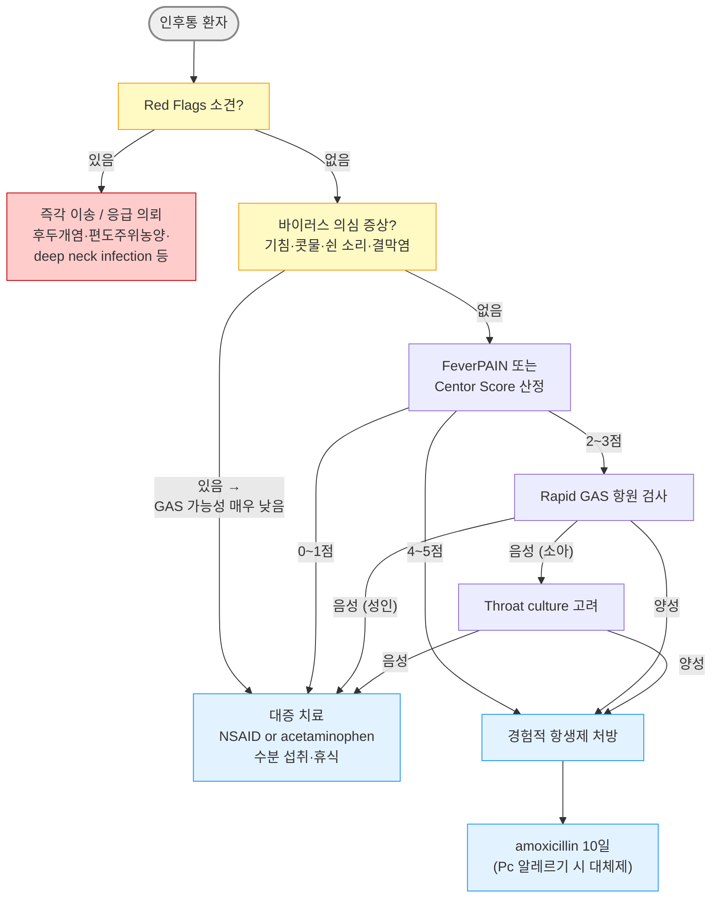

# 급성 인두염 Acute Pharyngitis

## <mark style="color:green;">일반 사항</mark>

* 인두의 급성 염증으로, 상기도 감염 중 가장 흔한 외래 방문 원인의 하나
* 대부분 바이러스 감염이며, 세균 감염(주로 GAS)과의 감별이 치료 결정의 핵심
* 재발 또는 만성 감염의 경우 해부학적 이상·면역 저하 등에 대한 평가·치료를 위하여 의뢰
* 전파 경로 : 바이러스 - 코 분비물 접촉 (☞ [감기](060_-common-cold.md)); GAS - 비말 감염
* GAS 경과 : 24\~72시간 잠복 후 발병 → 발병 2\~3일째 발열 최고조 → 합병증 없으면 5\~7일째 자연 호전; 항생제로 증상 기간 약 16\~24시간 단축
* 항생제의 합병증 예방 효과 : 류마티스열 예방 가능 (발병 9일 이내 투여 시); 편도주위농양 등 화농성 합병증 발생 빈도 감소; PSGN(사구체신염) 예방 효과는 없음
* 생활 복귀 : 항생제 시작 후 24시간이 경과하고 발열 등 심한 증상이 없으면 직장·학교 복귀 가능

## <mark style="color:green;">원인</mark>&#x20;

* 바이러스 (감염의 대부분) : rhinovirus, adenovirus, EBV, CMV, influenza, parainfluenza, SARS-CoV-2 등
* 세균 : 성인 10\~15%, 소아 15\~30%; 주로 group A Streptococcus (GAS, GABHS = S. pyogenes); 그 외 group C/G Streptococcus, Mycoplasma pneumoniae, Chlamydophila pneumoniae
* 비감염성 : 물리적·화학적 손상, 위산 역류, 건조한 공기

### <mark style="color:orange;">위험 인자</mark>

* 늦가을\~초봄의 감기·독감 유행 시기
* 연령 : 소아·청소년 (GAS 호발; 3\~14세 고위험)
* rheumatic fever 가족력
* 보육 시설, 학교 등 집단 생활
* 당뇨, 면역저하자
* 직·간접 흡연
* 위산 역류
* 편도·아데노이드의 세균 군체 형성

## <mark style="color:green;">임상 양상</mark>

* 주요 증상 : 인후통, 삼킴곤란, 발열
* 인두 궤양 : CMV, HIV, 크론병, 혈관염 관련
* 편도·연구개 점상 출혈 : EBV, CMV 관련
* adenovirus 감염 시 인두결막열 (발열 최대 7일, 결막염 최대 14일 지속)

<table><thead><tr><th width="114">구분</th><th>바이러스 의심 소견</th><th>세균(GAS) 의심 소견</th></tr></thead><tbody><tr><td>동반 증상</td><td>기침, 콧물, 코막힘, 쉰 소리¹⁾</td><td>기침·콧물·쉰 소리 없음</td></tr><tr><td>발열</td><td>간헐적·경미</td><td>갑작스러운 인후통 + 고열</td></tr><tr><td>전신 증상</td><td>일반적 감기 양상</td><td>두통, 구역·구토, 복통</td></tr><tr><td>구강 내 소견</td><td>구강 궤양 가능, viral exanthem</td><td>편도인두 염증·삼출물, 구개 점상 출혈</td></tr><tr><td>림프절</td><td>경미한 전경부 림프절염</td><td>앞쪽 목 림프절 비대·압통</td></tr><tr><td>기타</td><td>결막염 (adenovirus)</td><td>성홍열 모양 발진 가능; 3~14세 호발</td></tr></tbody></table>

1\) 셋 이상 동반 시 GAS 가능성 매우 낮음 → 검사·항생제 불필요

### <mark style="color:orange;">GAS 관련 합병증 및 연관 질환</mark>

#### <mark style="color:$primary;">성홍열 Scarlet Fever</mark>

* GAS 인두염 증상 + 피부 발진

**피부 증상**

* 선홍색 작은 구진; 피부는 건조·거친 사포 질감 또는 goose pimple appearance
* 홍반은 누르면 일시적으로 소실; 굴곡부에 Pastia's line 형성 가능
* 얼굴 : 이마·뺨 홍조 + 입 주위 창백 (circumoral pallor); 얼굴에는 발진 드묾
* 발진 출현 : 발열 후 12\~48시간; 귀·목·가슴·겨드랑이 → 몸통·사지 → 전신 순으로 24시간에 걸쳐 진행
* 발진 소실 : 3\~5일 후 시작; 이후 7\~10일부터 얼굴 → 몸통 → 손발 순으로 표피 탈락 (1개월 이상 지속되기도 함)

#### <mark style="color:$primary;">연쇄구균 감염 후 사구체신염 PSGN</mark>

* GAS 인두염 발병 1\~3주 후 고혈압, 부종, 혈뇨 발생
* 항생제 치료로 PSGN 발병 위험 감소 불가
* 류마티스열과의 차이 : 류마티스열은 인두염 후에만 발생하나, PSGN은 인두염 외에 GAS 피부 감염(농가진 등) 후에도 발생할 수 있음

#### <mark style="color:$primary;">류마티스열 Rheumatic Fever</mark>

* GAS 인두염 발병 2\~3주 후 발생; 드묾 (미국 10만 명당 1명 이하)
* GAS 인두염 발병 9일 이내 항생제 투여 시 예방 가능

### <mark style="color:$danger;">🚩 Red Flags!</mark>

<mark style="color:$danger;">**즉각 이송 또는 응급 조치**</mark>

* 호흡기 폐쇄 소견 : "hot potato" voice, 빈호흡, dyspnea, 흉부 함몰, sniffing position, tripod position → 급성 후두개염 또는 편도주위농양
* 심한 개구 장애 (trismus) → 편도주위농양, deep neck space infection
* 고열(≥39℃) + 빈맥 + 의식 변화 → 패혈증 소견
* 편측 경부 통증·부종 + 호흡곤란·흉통 (패혈성 폐색전증 시사) + 고열 → Lemierre's syndrome&#x20;


**후두개염 의심 시 주의** : 설압자(tongue depressor)를 이용한 구강 내 시진은 급성 기도 폐쇄를 촉발할 수 있음. 후두개염이 의심되면 구강 검사 시도 없이 즉각 이송


<mark style="color:$warning;">**당일 또는 조기 의뢰**</mark>

* 심한 편측 인후 통증 + 구개수 편위 → 편도주위농양
* 경부 부종·압통 + 발열 → deep neck infection
* 항생제 치료 48\~72시간 후에도 증상 악화 또는 무반응
* 연하 장애로 수분·음식 섭취 불가능한 경우

<mark style="color:$info;">**외래 추적 / 추가 평가 계획**</mark> <mark style="color:$info;">- 즉각 위험 낮으나 호전 없으면 의뢰</mark>

* 연간 3\~4회 이상 반복적 GAS 인두편도염
* 심한 편도 비대·삼출, 후경부 림프절, 피로 → EBV 단핵구증
* 항생제 10일 완료 후에도 증상 지속

## <mark style="color:green;">진단</mark>

### <mark style="color:orange;">검사</mark>

* 임상적으로 세균 감염 여부를 판단할 수 없는 경우에 고려
* 기침·콧물 등 바이러스 의심 증상이 뚜렷한 경우에는 RADT를 시행하지 않음 - 보균자 상태에서도 양성이 나올 수 있어 과잉 치료로 이어질 수 있음
* Rapid GAS 항원 검사 (인후 면봉) : 특이도 높음(≥95%), 민감도 중등증\~높음(70\~90%; kit 종류에 따라 차이); 음성이라도 소아에서는 throat culture 추가 고려 (위음성 가능성); 성인에서는 음성 시 배양 검사 불필요
* 항연쇄구균 항체 (ASO, anti-DNase B) : 과거 감염 반영; 급성기 진단에 부적합
* 배양 검사 : 표준 검사이나 결과까지 24\~48시간 소요; 보균 상태에서도 양성으로 나옴에 유의


**GAS 보균자(carrier)** : 편도에 GAS가 존재하지만 실제 감염이 아닌 상태로, 항생제 치료 효과가 낮고 필요하지 않음. 반복 GAS 양성 환자에서 보균자 여부를 감별해야 하며, 보균자는 전염성도 낮음.


### <mark style="color:orange;">감별</mark>


**점수 체계 사용 전 전제** : FeverPAIN과 Centor Score는 GAS 감염 가능성을 평가하기 위한 도구로서 바이러스성 인두염을 진단하기 위한 것이 아님(점수 체계는 바이러스 증상이 없는 환자에게만 적용); 기침·콧물 등 바이러스 의심 증상이 뚜렷한 환자에게는 점수 산정 없이 바로 대증 치료로 진행&#x20;


#### <mark style="color:$primary;">FeverPAIN scoring</mark>

<table><thead><tr><th width="357">기준 항목</th><th width="108">해당 시</th></tr></thead><tbody><tr><td><strong>F</strong>ever - 최근 24시간 이내 발열</td><td>1점</td></tr><tr><td><strong>P</strong>urulence - 편도 삼출물</td><td>1점</td></tr><tr><td><strong>A</strong>ttend rapidly - 증상 발생 후 3일 이내 내원</td><td>1점</td></tr><tr><td>severely <strong>I</strong>nflamed tonsils - 심한 편도 염증</td><td>1점</td></tr><tr><td><strong>N</strong>o cough or coryza - 기침·콧물 없음</td><td>1점</td></tr></tbody></table>

* 판정 : 점수 - Streptococcus 가능성&#x20;
  * 0\~1점 - 13\~18% → 항생제 투여 안 함
  * 2\~3점 - 34\~40% → 48\~72시간 지연 처방 고려 또는 Rapid 검사
  * 4\~5점 - 62\~65% → 즉시 항생제 처방

#### <mark style="color:$primary;">Centor Score (Modified McIsaac)</mark>

<table><thead><tr><th width="198">기준 항목</th><th>점수</th></tr></thead><tbody><tr><td>발열 (≥38℃)</td><td>+1점</td></tr><tr><td>기침 없음</td><td>+1점</td></tr><tr><td>전경부 림프절 비대·압통</td><td>+1점</td></tr><tr><td>편도 부종 또는 삼출물</td><td>+1점</td></tr><tr><td>연령 : 3~14세 </td><td>+1점</td></tr><tr><td>　　15~44세</td><td>0점</td></tr><tr><td>　　≥45세</td><td>-1점 (노인층에서는 세균성 GAS 인두염 확률 매우 낮음)</td></tr></tbody></table>

* 판정 및 처치&#x20;
  * ≤1점 → Strep 가능성 낮음(≤10%); 다른 진단 고려; 항생제 불필요
  * 2\~3점 → 중등 위험군; Rapid GAS 검사 시행 후 결정
  * 4\~5점 → Strep 가능성 높음(≥51%); 경험적 항생제 치료 고려

#### <mark style="color:$primary;">증상·병력에 따른 감별</mark>

<table><thead><tr><th width="141">원인·상태</th><th>특징적 소견</th><th>감별점 및 처치</th></tr></thead><tbody><tr><td>바이러스성 <br>인두염</td><td>기침·콧물·쉰 소리 동반, 경미한 발열</td><td>가장 흔함; 항생제 불필요; 대증 치료</td></tr><tr><td>GAS 인두염</td><td>삼출성 편도, 전경부 림프절 비대·압통, 고열; 기침 없음</td><td>Centor/FeverPAIN 활용; amoxicillin 10일</td></tr><tr><td>EBV 단핵구증</td><td>심한 편도 비대·삼출, 후경부 림프절, 비장비대, 극심한 피로; 주로 청소년·청년</td><td>heterophile Ab 검사; amoxicillin/ampicillin 투여 시 발진 유발 - 이는 약물 알레르기가 아님 (EBV 관련 면역 반응)</td></tr><tr><td>편도주위농양</td><td>편측 편도 돌출, 구개수 편위, trismus, "hot potato" voice</td><td>즉각 이비인후과 의뢰; 절개배농 필요</td></tr><tr><td>급성 후두개염</td><td>연하 장애, 경부 과신전 체위, 천명; 성인에서도 발생</td><td>즉각 이송; 경부 측면 X-ray "thumb sign"</td></tr><tr><td>COVID-19</td><td>인후통 + 미각·후각 이상, 발열, 전신 증상</td><td>SARS-CoV-2 검사; 격리 지침 준수</td></tr><tr><td>디프테리아</td><td>회백색 위막(편도·인두), bull neck, 저음 쉰 소리</td><td>예방접종 미비자에서 고려; 즉시 이송 및 신고</td></tr><tr><td>임균성 인두염</td><td>구강성교 병력; 무증상이기도 함</td><td>성 위험 인자 확인; ceftriaxone</td></tr><tr><td><em>A. haemolyticum</em></td><td>10~20대 청소년·청년; GAS 유사 인후통 + 성홍열 모양 발진; GAS RADT 음성</td><td>macrolide (azithromycin) 치료; β-lactam 효과 불확실</td></tr></tbody></table>

***



<p align="center"><strong>급성 인두염 진단 및 치료 알고리듬</strong></p>

***

## <mark style="background-color:$warning;">Management</mark>

### <mark style="color:orange;">치료 방침</mark>

* 바이러스성 : 항생제 불필요; 대증 치료
* 세균성(GAS) : FeverPAIN 또는 Centor score에 기초하여 항생제 투여 여부 결정
* 치료 완료 후 완치 판정 검사 불필요 (예외 : 류마티스열 병력 환자)
* 항생제 투여 후 2\~3일 내 증상 완화 없으면 항생제 변경 또는 재평가

## <mark style="color:green;">비-약물 치료 및 예방</mark>

### <mark style="color:orange;">비-약물 치료</mark>

* 안정 휴식
* 충분한 수분 섭취 (따뜻한 음료 권장)
* 사탕 또는 throat lozenge 물고 있기
  * 박하·멘톨 등의 제품이 도움이 될 수 있으나 일부에서는 증상을 악화시킬 수 있음
* 소금물 가글 : 물 1컵(250 ㎖) + 소금 ¼\~½ tsp (1.5\~3 g); 일부에서 증상 완화
* 흡연·간접 흡연 회피
* 건조한 환경에서 공기 가습

### <mark style="color:orange;">예방</mark>

* 손씻기 등 일반적 호흡기 감염 예방법과 동일
* 항생제 시작 24시간 이후 전염성 소실로 간주
* 예방적 항생제 : 일반적으로 권하지 않음; 급성 류마티스열 병력 환자는 예방적 투여 고려 (전문과 협진)
* 반복 감염 시 가족 및 밀접 접촉자에 대하여 배양 검사 및 치료 고려

## <mark style="color:green;">약물 치료</mark>

### <mark style="color:$primary;">항생제</mark>

* 투여 기간 : 통상 10일; 증상 완화 후에도 과정을 끝까지 완료
* 지속·재발 감염 시 배양 검사 시행 후 동정된 균주에 맞는 항생제로 치료 (통상 10일)
* 반복 감염 시 가족·밀접 접촉자에 대하여 배양 검사 및 치료 고려

**GAS 급성 인두편도염 권고 항생제** \[대한감염학회 성인 급성 상기도 감염 항생제 사용지침, 2017]


**Antimicrobial stewardship 원칙** : GAS 인두염에는 narrow-spectrum 항생제(amoxicillin, 1세대 세파)를 우선 사용. amoxicillin/clavulanate 등 broad-spectrum 항생제는 단순 GAS 인두염에 routine 사용하지 않음


| 상황                                                         | 약제                                                     | 용량 및 기간                                     |
| ---------------------------------------------------------- | ------------------------------------------------------ | ------------------------------------------- |
| 1차 선택                                                      | amoxicillin <mark style="color:blue;">\[파목신]</mark>¹⁾  | 500 ㎎ bid 또는 1 g qd (1회 투여로 복약 순응도 우수); 10일 |
| Pc 4형 알레르기 (발진)                                            | cephalexin <mark style="color:blue;">\[팔렉신]</mark>     | 500 ㎎ bid; 10일                              |
| cefadroxil <mark style="color:blue;">\[듀리세프]</mark>        | 1,000 ㎎ qd\~bid; 10일                                   |                                             |
| cefdinir <mark style="color:blue;">\[옴니세프]</mark>          | 300 ㎎ bid; 5일                                          |                                             |
| Pc 1형 알레르기 (anaphylaxis)²⁾                                 | clindamycin <mark style="color:blue;">\[훌그램]</mark> 우선 | 300 ㎎ tid; 10일                              |
| azithromycin <mark style="color:blue;">\[지스로맥스]</mark>³⁾   | 500 ㎎ qd ×1일 → 250 ㎎ qd ×4일; 5일                        |                                             |
| clarithromycin <mark style="color:blue;">\[클래리시드]</mark>³⁾ | 250 ㎎ bid; 10일                                         |                                             |

1\) 소아 : 40\~50 ㎎/㎏/day, 분 2회, 최대 1,000 ㎎; 10일\
2\) 세팔로스포린 교차반응 가능(\~1\~10%) → clindamycin 우선\
3\) Macrolide 내성 : 한국·아시아 지역에서 GAS macrolide 내성률이 20\~30% 수준으로 보고됨. macrolide(azithromycin, clarithromycin)는 지역 내 내성률을 고려하여 제한적으로 사용하며, Pc 1형 알레르기에서는 clindamycin을 우선 고려


**페니실린 치료 실패·재발 시** : amoxicillin/clavulanate <mark style="color:blue;">\[오구멘틴]</mark> 500/125 ㎎ tid ×10일 또는 clindamycin <mark style="color:blue;">\[훌그램]</mark>으로 대체 고려. 반복 실패 원인 : ⓵ 구강 내 β-lactamase 생성균에 의한 amoxicillin 분해, ⓶ GAS 보균 상태(carrier). 단순 GAS 인두염 1차 치료에는 사용하지 않음.



**NICE 지침** (NG84, 2023) : phenoxymethylpenicillin 5\~10일 1차 선택 (국내 처방 접근성 낮음). Pc 알레르기 시 clarithromycin 250\~500 ㎎ bid ×5일. 임신부에서 erythromycin 250\~500 ㎎ qid 또는 500\~1,000 ㎎ bid ×5일


### <mark style="color:$primary;">통증 및 대증 치료</mark>

* NSAID (ibuprofen, naproxen) : acetaminophen보다 인후통 완화에 다소 우수한 보고 있음
* acetaminophen : NICE 지침에서 급성 인후통 1차 진통제로 추천; NSAID 금기(위장장애, 임신부) 시 사용
* 단회 dexamethasone : 10 ㎎ (PO 또는 IM) 투여가 증상 완화·회복 단축에 효과적
  * 적응증 : 연하 장애로 약을 삼키기 어렵거나 일상생활이 불가능한 수준의 극심한 인후통에 한정하여 선택적 사용
  * 단회 투여이므로 반복 사용 불가; 일률적 사용은 권하지 않음
* 국소 마취제/진통제 : 심한 인후통에 도포 또는 가글 (비보험)
  * lidocaine <mark style="color:blue;">\[카미스타드-엔 겔]</mark>, benzocaine <mark style="color:blue;">\[허리케인 겔]</mark>, diclofenac <mark style="color:blue;">\[아프니벤큐 액]</mark>

***

### <mark style="color:red;">질병코드</mark>

J02 급성 인두염

***

## <mark style="color:purple;">처방례</mark>

> **처방례 1. 바이러스성 인두염 (세균 감염 가능성 낮음)**
>
> ```
> 부루펜 200 ㎎/T        3T  #3  (식후)
> 코데닝 정              3T  #3  (기침·콧물 동반 시)
> ```
>
> _✽ 진통·해열 목적으로 ibuprofen 기본 처방. 기침·콧물 동반 시에만 복합 감기약 추가. 항생제 불필요._

> **처방례 2. GAS 인두염 의심 (항생제 병합)**
>
> ```
> 파목신 500 ㎎/C        2C  #2  (식후 즉시, 10일)
> 맥시부펜 이알 300 ㎎/T  2T  #2  (식후)
> 코푸 시럽 20 ㎖/P      4P  #4  (기침·콧물 동반 시)
> ```
>
> _✽ amoxicillin은 식후 즉시 복용하면 위장 장애 감소. 증상 호전 후에도 10일 완료 필수. 48\~72시간 내 반응 없으면 재평가. 항생제 기인성 설사 예방 목적으로 probiotics 병용 선택 가능._

> **처방례 3. GAS 인두염 + Pc 1형 알레르기 (anaphylaxis 병력)**
>
> ```
> 지스로맥스 500 ㎎/T    1T  #1  (1일차)
> 지스로맥스 250 ㎎/T    1T  #1  (2~5일차)
> 맥시부펜 이알 300 ㎎/T  2T  #2  (식후)
> ```
>
> _✽ azithromycin 5일 요법. **한국·아시아 지역 GAS macrolide 내성률 20\~30%** : 내성 우려 시 clindamycin <mark style="color:blue;">\[훌그램]</mark> 300 ㎎ tid ×10일을 우선 선택._

***

### <mark style="color:$success;">핵심 복약 지도</mark>

* **항생제 완료** : 증상이 나아져도 처방된 10일 과정 끝까지 복용 - 조기 중단 시 재발 및 류마티스열 위험 증가
* **전염성 소실 시점** : 항생제 시작 후 24시간 경과 + 발열 없으면 학교·직장 복귀 가능
* **진통제 선택** : ibuprofen은 식사 후 복용; 위장 장애·임신부·고령자는 acetaminophen으로 교체
* **재방문 시점** : 항생제 복용 2\~3일 후에도 증상이 나빠지거나 호전 없으면 재내원
* **알레르기 고지** : 과거 페니실린 알레르기 반응이 있었던 경우 처방 전 반드시 고지
* **dexamethasone 처방 시** : 단회 투여이므로 추가 복용 불필요; 당뇨 환자는 당일 혈당 상승 가능성 안내

### <mark style="color:blue;">환자 안내서</mark>

**급성 인두염(인후염)이란?**\
목구멍(인두)에 생긴 염증으로, 대부분 바이러스 감염이며 1주일 이내에 자연 회복됩니다. 연쇄구균(GAS) 세균 감염인 경우 항생제가 필요하며, 적절히 치료받으면 합병증(류마티스열 등)을 예방할 수 있습니다.

**일상 관리**

* 충분히 쉬고 따뜻한 물·차를 자주 마십시오.
* 소금물 가글(물 한 컵 + 소금 한 꼬집)을 하루 수 회 하면 불편감이 줄어들 수 있습니다.
* 흡연, 연기, 자극적인 음식을 피하십시오.

**항생제를 처방받으셨다면**

* 증상이 나아져도 처방받은 날수(보통 10일)를 끝까지 복용하십시오. 중간에 멈추면 재발하거나 드물게 심장·신장 합병증이 생길 수 있습니다.
* 항생제를 시작한 지 24시간이 지나고 열이 없으면 학교나 직장에 나가도 됩니다.

**즉시 병원에 오셔야 할 때**

* 숨쉬기가 힘들거나, 침을 삼키기 어려울 정도로 목이 심하게 아플 때
* 한쪽 목이 유독 심하게 붓거나, 입을 제대로 벌리기 어려울 때
* 목 주위 피부가 붓거나 발갛게 변하고 열이 날 때
* 항생제를 2\~3일 복용했는데도 증상이 나빠질 때
* 몸에 붉은 발진이 생길 때
