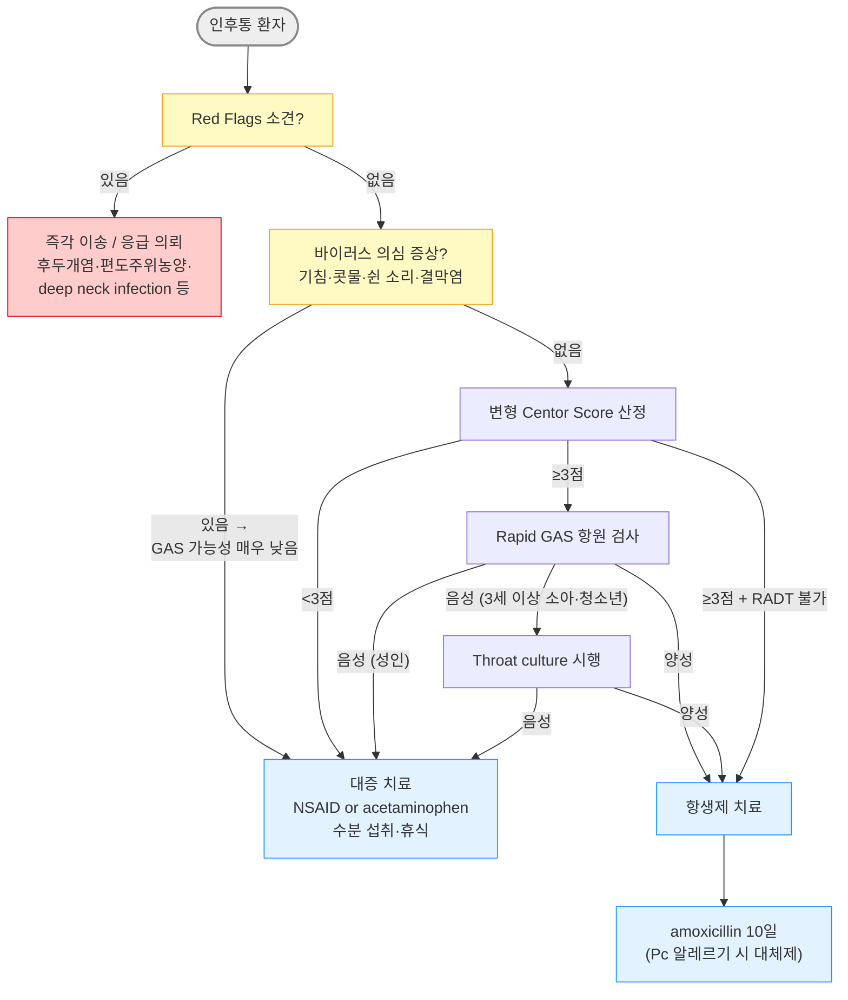

# 급성 인두염 Acute Pharyngitis

## <mark style="color:green;">일반 사항</mark>

* 인두의 급성 염증으로, 상기도 감염 중 가장 흔한 외래 방문 원인의 하나
* 대부분 바이러스 감염이며, 세균 감염(주로 GAS)과의 감별이 치료 결정의 핵심
* 재발 또는 만성 감염의 경우 해부학적 이상·면역 저하 등에 대한 평가·치료를 위하여 의뢰
* 전파 경로 : 바이러스 - 코 분비물 접촉 (☞ [감기](060_-common-cold.md)); GAS - 비말 감염
* GAS 경과 : 24\~72시간 잠복 후 발병 → 발병 2\~3일째 발열 최고조 → 합병증 없으면 5\~7일째 자연 호전; 항생제로 증상 기간 약 16\~24시간 단축
* 항생제의 합병증 예방 효과 : 류마티스열 예방 가능 (발병 9일 이내 투여 시); 편도주위농양 등 화농성 합병증 발생 빈도 감소; PSGN(사구체신염) 예방 효과는 없음
* 생활 복귀 : 적절한 항생제 시작 후 최소 12\~24시간이 경과하고 해열제를 사용하지 않아도 발열이 없으며 전신 상태가 양호하면 직장·학교 복귀 가능; 의료인·집단 유행 상황에서는 24시간 기준 적용

## <mark style="color:green;">원인</mark>&#x20;

* 바이러스 (감염의 대부분) : rhinovirus, adenovirus, EBV, CMV, influenza, parainfluenza, SARS-CoV-2 등
* 세균 : 성인 약 5\~15%, 소아 20\~30%; 주로 group A Streptococcus (GAS, GABHS = *S. pyogenes*); 그 외 group C/G Streptococcus, 청소년·젊은 성인의 *Fusobacterium necrophorum*, 성접촉 관련 *Neisseria gonorrhoeae*, 예방접종 미비자·해외 노출자의 *Corynebacterium diphtheriae* 등
* 비감염성 : 물리적·화학적 손상, 위산 역류, 건조한 공기

### <mark style="color:orange;">위험 인자</mark>

* 늦가을\~초봄의 감기·독감 유행 시기
* 연령 : 소아·청소년 (GAS 호발; 3\~14세 고위험)
* 급성 류마티스열의 과거력, 확진 GAS 환자와의 가정 내 밀접 접촉
* 보육 시설, 학교 등 집단 생활
* 당뇨, 면역 저하자
* 직·간접 흡연
* 위산 역류
* 편도·아데노이드의 세균 군체 형성

## <mark style="color:green;">임상 양상</mark>

* 주요 증상 : 인후통, 삼킴곤란, 발열
* 인두·구강 궤양 : 바이러스 감염을 시사; 성 위험 노출 후 발열·발진·전신 림프절병증·점막 궤양이 동반되면 급성 HIV 감염 고려
* 연구개 점상 출혈 : GAS 또는 EBV 감염에서 관찰 가능
* adenovirus 감염 시 인두결막열 (발열 최대 7일, 결막염 최대 14일 지속)

<table><thead><tr><th width="114">구분</th><th>바이러스 의심 소견</th><th>세균(GAS) 의심 소견</th></tr></thead><tbody><tr><td>동반 증상</td><td>기침, 콧물, 코막힘, 쉰 소리¹⁾</td><td>기침·콧물·쉰 소리 없음</td></tr><tr><td>발열</td><td>간헐적·경미</td><td>갑작스러운 인후통 + 고열</td></tr><tr><td>전신 증상</td><td>일반적 감기 양상</td><td>두통, 구역·구토, 복통</td></tr><tr><td>구강 내 소견</td><td>구강 궤양 가능, viral exanthem</td><td>편도인두 염증·삼출물, 구개 점상 출혈</td></tr><tr><td>림프절</td><td>경미한 전경부 림프절염</td><td>앞쪽 목 림프절 비대·압통</td></tr><tr><td>기타</td><td>결막염 (adenovirus)</td><td>성홍열 모양 발진 가능; 3~14세 호발</td></tr></tbody></table>

1\) 기침·콧물·쉰 소리·구강 궤양·결막염 등 명백한 바이러스 소견이 있으면 GAS 검사와 항생제 치료가 일반적으로 불필요

### <mark style="color:orange;">GAS 관련 합병증 및 연관 질환</mark>

#### <mark style="color:$primary;">성홍열 Scarlet Fever</mark>

* GAS 인두염 증상 + 피부 발진

**피부 증상**

* 선홍색 작은 구진; 피부는 건조·거친 사포 질감 또는 goose pimple appearance
* 홍반은 누르면 일시적으로 소실; 굴곡부에 Pastia's line 형성 가능
* 얼굴 : 이마·뺨 홍조 + 입 주위 창백 (circumoral pallor); 얼굴에는 발진 드묾
* 발진 출현 : 발열 후 12\~48시간; 귀·목·가슴·겨드랑이 → 몸통·사지 → 전신 순으로 24시간에 걸쳐 진행
* 발진 소실 : 3\~5일 후 시작; 이후 7\~10일부터 얼굴 → 몸통 → 손발 순으로 표피 탈락 (1개월 이상 지속되기도 함)

#### <mark style="color:$primary;">연쇄구균 감염 후 사구체신염 PSGN</mark>

* GAS 인두염 발병 1\~3주 후 고혈압, 부종, 혈뇨 발생
* 항생제 치료로 PSGN 발병 위험 감소 불가
* 류마티스열과의 차이 : 류마티스열은 인두염 후에만 발생하나, PSGN은 인두염 외에 GAS 피부 감염(농가진 등) 후에도 발생할 수 있음

#### <mark style="color:$primary;">류마티스열 Rheumatic Fever</mark>

* GAS 인두염 발병 2\~3주 후 발생; 드묾 (미국 10만 명당 1명 이하)
* GAS 인두염 발병 9일 이내 항생제 투여 시 예방 가능

### <mark style="color:$danger;">🚩 Red Flags!</mark>

<mark style="color:$danger;">**즉각 이송 또는 응급 조치**</mark>

* 기도 폐쇄 소견 : stridor, 청색증·저산소증, 심한 호흡곤란·흉부 함몰, 침도 삼키지 못하고 흘림, sniffing/tripod position → 급성 후두개염 또는 심경부 감염
* "hot potato" voice 또는 심한 개구 장애(trismus)에 위 기도 폐쇄 소견이 동반됨 → 편도주위농양 또는 deep neck space infection
* 고열(≥39℃) + 빈맥 + 의식 변화 → 패혈증 소견
* 인두염이 잠시 호전된 뒤 오한·고열이 재발하면서 편측 경부 통증·부종 또는 호흡곤란·흉막성 흉통 발생 → Lemierre's syndrome&#x20;


**후두개염 의심 시 주의** : 환자를 눕히거나 불필요하게 자극하지 않고 즉각 이송. 특히 소아에서 설압자를 이용한 무리한 인두 시진은 급성 기도 폐쇄를 촉발할 수 있음. 영상 검사는 안정된 환자에서만 보조적으로 고려하며 기도 확보를 지연해서는 안 됨


<mark style="color:$warning;">**당일 또는 조기 의뢰**</mark>

* 심한 편측 인후 통증 + 구개수 편위, "hot potato" voice 또는 trismus(기도 폐쇄 소견 없음) → 편도주위농양
* 경부 부종·압통 + 발열(기도 폐쇄·패혈증 소견 없음) → deep neck infection
* 항생제 치료 48\~72시간 후에도 증상 악화 또는 무반응
* 연하 장애로 수분·음식 섭취 불가능한 경우

<mark style="color:$info;">**외래 추적 / 추가 평가 계획**</mark> <mark style="color:$info;">- 즉각 위험 낮으나 호전 없으면 의뢰</mark>

* 반복적이며 일상생활에 지장을 주는 GAS 인두편도염 → 발생 횟수·중증도·검사 결과를 기록하고 이비인후과 평가 고려
* 심한 편도 비대·삼출, 후경부 림프절, 피로 → EBV 단핵구증
* 항생제 10일 완료 후에도 증상 지속

## <mark style="color:green;">진단</mark>

### <mark style="color:orange;">검사</mark>

* 임상 양상만으로 바이러스성 인두염과 GAS 인두염을 완전히 구분할 수 없으므로, 명백한 바이러스 소견이 없는 환자에서는 변형 Centor 점수로 검사 필요성을 선별
* 기침·콧물 등 바이러스 의심 증상이 뚜렷한 경우에는 RADT를 시행하지 않음 - 보균자 상태에서도 양성이 나올 수 있어 과잉 치료로 이어질 수 있음
* Rapid GAS 항원 검사(RADT, 인후 면봉) : 특이도 높음(≥95%), 민감도는 검사법에 따라 차이; 양성이면 GAS 감염으로 판단. 3세 이상 소아·청소년에서는 음성 RADT를 throat culture로 확인하고, 성인에서는 음성 후 배양 검사를 통상 시행하지 않음
* 3세 미만 : GAS 인두염과 류마티스열이 드물어 routine 검사하지 않음; 다만 유증상이며 확진 GAS 환자와 밀접 접촉했거나 집단 유행 상황이면 선택적으로 고려
* 항연쇄구균 항체 (ASO, anti-DNase B) : 과거 감염 반영; 급성기 진단에 부적합
* 배양 검사 : 표준 검사이나 결과까지 24\~48시간 소요; 보균 상태에서도 양성으로 나옴에 유의


**GAS 보균자(carrier)** : 편도에 GAS가 존재하지만 실제 감염이 아닌 상태로, 항생제 치료 효과가 낮고 필요하지 않음. 반복 GAS 양성 환자에서 보균자 여부를 감별해야 하며, 보균자는 전염성도 낮음.


### <mark style="color:orange;">감별</mark>


**점수 체계 사용 전 전제** : FeverPAIN과 Centor Score는 GAS 감염 가능성을 평가하기 위한 도구로서 바이러스성 인두염을 진단하거나 GAS 감염을 확진하는 검사가 아님. 기침·콧물 등 바이러스 의심 증상이 뚜렷한 환자에게는 점수 산정 없이 대증 치료로 진행&#x20;


#### <mark style="color:$primary;">FeverPAIN scoring</mark>

<table><thead><tr><th width="357">기준 항목</th><th width="108">해당 시</th></tr></thead><tbody><tr><td><strong>F</strong>ever - 최근 24시간 이내 발열</td><td>1점</td></tr><tr><td><strong>P</strong>urulence - 편도 삼출물</td><td>1점</td></tr><tr><td><strong>A</strong>ttend rapidly - 증상 발생 후 3일 이내 내원</td><td>1점</td></tr><tr><td>severely <strong>I</strong>nflamed tonsils - 심한 편도 염증</td><td>1점</td></tr><tr><td><strong>N</strong>o cough or coryza - 기침·콧물 없음</td><td>1점</td></tr></tbody></table>

* NICE의 검사 비의존적 대안 전략&#x20;
  * 0\~1점 → 항생제 투여하지 않음
  * 2\~3점 → 원칙적으로 항생제를 투여하지 않거나 임상 경과에 따라 지연 처방 고려
  * 4\~5점 → 즉시 또는 지연 항생제 처방 고려
* 국내 진료에서는 아래 변형 Centor–RADT 전략을 우선 적용

#### <mark style="color:$primary;">Centor Score (Modified McIsaac)</mark>

<table><thead><tr><th width="198">기준 항목</th><th>점수</th></tr></thead><tbody><tr><td>발열 (≥38℃)</td><td>+1점</td></tr><tr><td>기침 없음</td><td>+1점</td></tr><tr><td>전경부 림프절 비대·압통</td><td>+1점</td></tr><tr><td>편도 부종 또는 삼출물</td><td>+1점</td></tr><tr><td>연령 : 3~14세 </td><td>+1점</td></tr><tr><td>　　15~44세</td><td>0점</td></tr><tr><td>　　≥45세</td><td>-1점 (노인층에서는 세균성 GAS 인두염 확률 매우 낮음)</td></tr></tbody></table>

* 국내 최신 급성 상기도 감염 항생제 사용지침에 따른 판정 및 처치&#x20;
  * <3점 → GAS 가능성이 낮아 일반적으로 검사·항생제 불필요; 다른 진단 및 대증 치료 고려
  * ≥3점 → RADT 시행; 양성이면 항생제 치료
  * ≥3점이지만 RADT를 시행할 수 없는 경우 → 경험적 항생제 치료 고려
  * 급성 류마티스열 과거력, 확진 GAS 환자와의 가정 내 접촉, 성홍열·국소 합병증 의심 등 고위험 상황에서는 점수가 낮아도 검사를 적극 고려

#### <mark style="color:$primary;">증상·병력에 따른 감별</mark>

<table><thead><tr><th width="141">원인·상태</th><th>특징적 소견</th><th>감별점 및 처치</th></tr></thead><tbody><tr><td>바이러스성 <br>인두염</td><td>기침·콧물·쉰 소리 동반, 경미한 발열</td><td>가장 흔함; 항생제 불필요; 대증 치료</td></tr><tr><td>GAS 인두염</td><td>삼출성 편도, 전경부 림프절 비대·압통, 고열; 기침 없음</td><td>변형 Centor 점수로 검사 대상 선별; RADT 양성이면 amoxicillin 10일</td></tr><tr><td>EBV 단핵구증</td><td>심한 편도 비대·삼출, 후경부 림프절, 비장비대, 극심한 피로; 주로 청소년·청년</td><td>heterophile Ab 검사; amoxicillin/ampicillin 투여 시 발진 가능. 발진이 곧 영구적 페니실린 알레르기를 뜻하지는 않으나 진성 지연성 과민반응도 가능하므로 추후 알레르기 평가 고려</td></tr><tr><td>급성 HIV 감염</td><td>성 위험 노출 후 발열, 인후통, 발진, 전신 림프절병증, 점막 궤양 등 단핵구증 유사 증상</td><td>HIV Ag/Ab 검사; 초기 감염이 강하게 의심되나 음성이면 HIV RNA 검사 고려</td></tr><tr><td>편도주위농양</td><td>편측 편도 돌출, 구개수 편위, trismus, "hot potato" voice</td><td>즉각 이비인후과 의뢰; 흡인 또는 배농 여부 평가</td></tr><tr><td>급성 후두개염</td><td>연하 장애·침 흘림, 경부 과신전 체위, stridor; 성인에서도 발생</td><td>즉각 이송 및 기도 평가; 안정된 경우에만 영상 검사를 보조적으로 고려</td></tr><tr><td>COVID-19·인플루엔자</td><td>인후통, 발열, 기침, 근육통 등; 증상만으로 감별 어려움</td><td>유행 상황, 고위험군 여부 및 항바이러스제 치료 가능 기간을 고려하여 검사</td></tr><tr><td>디프테리아</td><td>회백색 위막(편도·인두), bull neck, 저음 쉰 소리</td><td>예방접종 미비·해외 노출 시 고려; 위막을 억지로 떼지 않고 비말격리, 즉시 이송·신고. 가능하면 투약 전 검체 채취하되 결과를 기다리지 않고 항독소·항생제 치료</td></tr><tr><td>임균성 인두염</td><td>구강성교 병력; 무증상이기도 함</td><td>인두 NAAT/배양 및 동반 STI 검사; 국내 STI 지침에 따라 ceftriaxone 치료 후 완치판정 검사</td></tr><tr><td><em>F. necrophorum</em></td><td>주로 청소년·젊은 성인; 심한 인두염 후 일시 호전 뒤 고열·오한, 편측 경부 통증</td><td>Lemierre 증후군 의심 시 즉각 이송, 혈액배양 및 경부 영상 평가</td></tr><tr><td><em>A. haemolyticum</em></td><td>10~20대 청소년·청년; GAS 유사 인후통 + 성홍열 모양 발진; GAS RADT 음성</td><td>배양 등으로 확인; 감수성 및 임상 상황에 따라 항생제 선택</td></tr></tbody></table>

***


```mermaid
graph TD
    A([인후통 환자]) --> B[Red Flags 소견?]
    B -->|있음| C["즉각 이송 / 응급 의뢰<br/>후두개염·편도주위농양·<br/>deep neck infection 등"]
    B -->|없음| D["바이러스 의심 증상?<br/>기침·콧물·쉰 소리·결막염"]
    D -->|"있음 → <br/>GAS 가능성 매우 낮음"| E["대증 치료<br/>NSAID or acetaminophen<br/>수분 섭취·휴식"]
    D -->|없음| F["변형 Centor Score 산정"]
    F -->|"<3점"| E
    F -->|"≥3점"| G["Rapid GAS 항원 검사"]
    G -->|양성| H["항생제 치료"]
    G -->|"음성 (성인)"| E
    G -->|"음성 (3세 이상 소아·청소년)"| J["Throat culture 시행"]
    J -->|양성| H
    J -->|음성| E
    F -->|"≥3점 + RADT 불가"| H
    H --> I["amoxicillin 10일<br/>(Pc 알레르기 시 대체제)"]

style A fill:#eeeeee,stroke:#888888,stroke-width:2px
classDef yellow fill:#fff9c4,stroke:#f39c12
class B,D yellow
style C fill:#ffcccc,stroke:#cc0000
classDef sky fill:#e3f2ff,stroke:#2196f3
class E,I,H sky

```

<p align="center"><strong>급성 인두염 진단 및 치료 알고리듬</strong></p>

***

## <mark style="background-color:$warning;">Management</mark>

### <mark style="color:orange;">치료 방침</mark>

* 바이러스성 : 항생제 불필요; 대증 치료
* 세균성(GAS) : 국내에서는 변형 Centor 점수로 검사 대상을 선별하고 RADT 양성이면 항생제 치료; ≥3점이지만 RADT가 불가능한 경우에만 경험적 치료 고려
* 치료 완료 후 완치 판정 검사 불필요; 급성 류마티스열 고위험군 또는 전형적 증상 재발 등 특수 상황에서만 고려
* 항생제 투여 후 48\~72시간 내 반응이 없으면 진단·복약 순응도·화농성 합병증·다른 원인 및 보균 상태를 먼저 재평가한 뒤 항생제 변경 여부 결정

## <mark style="color:green;">비-약물 치료 및 예방</mark>

### <mark style="color:orange;">비-약물 치료</mark>

* 안정 휴식
* 충분한 수분 섭취 (따뜻한 음료 권장)
* 사탕 또는 throat lozenge 물고 있기
  * 박하·멘톨 등의 제품이 도움이 될 수 있으나 일부에서는 증상을 악화시킬 수 있음
* 소금물 가글 : 물 1컵(250 ㎖) + 소금 ¼\~½ tsp (1.5\~3 g); 일부에서 증상 완화
* 흡연·간접 흡연 회피
* 건조한 환경에서 공기 가습

### <mark style="color:orange;">예방</mark>

* 손씻기 등 일반적 호흡기 감염 예방법과 동일
* 적절한 항생제 시작 후 12\~24시간부터 전염성이 크게 감소; 해열제를 사용하지 않아도 발열이 없고 전신 상태가 양호해야 복귀 가능
* 예방적 항생제 : 일반적으로 권하지 않음; 급성 류마티스열 병력 환자는 예방적 투여 고려 (전문과 협진)
* 무증상 가족·밀접 접촉자의 routine 배양 검사나 경험적 치료는 권하지 않음; 집단 유행, 류마티스열 고위험 상황 또는 반복적인 가족 내 전파가 강하게 의심되는 특수 상황은 별도 평가

## <mark style="color:green;">약물 치료</mark>

### <mark style="color:$primary;">항생제</mark>

* 투여 기간 : 약제에 따라 5\~10일; 증상 완화 후에도 처방된 과정을 끝까지 완료
* 지속·재발 감염 시 복약 순응도, 재감염, GAS 보균 상태, EBV·*F. necrophorum* 등 다른 원인 및 화농성 합병증을 재평가하고 필요 시 배양 검사 후 치료
* 무증상 가족·밀접 접촉자의 routine 검사·치료는 시행하지 않음

**GAS 급성 인두편도염 권고 항생제** \[질병관리청, 2025 급성 상기도 감염 항생제 사용 지침]


**Antimicrobial stewardship 원칙** : GAS 인두염에는 amoxicillin을 1차로 사용. 비중증 페니실린 알레르기에서는 1세대 세팔로스포린을 고려할 수 있음. amoxicillin/clavulanate 및 광범위 세팔로스포린은 단순 GAS 인두염의 routine 1차 약제로 사용하지 않음


<table><thead><tr><th width="205">상황</th><th>약제</th><th>성인 용량 및 기간</th></tr></thead><tbody><tr><td>1차 선택</td><td>amoxicillin <mark style="color:blue;">[파목신]</mark>¹⁾</td><td>1,000 ㎎ qd 또는 500 ㎎ bid; 10일</td></tr><tr><td rowspan="2">비중증 지연성 페니실린 알레르기²⁾</td><td>cephalexin <mark style="color:blue;">[팔렉신]</mark></td><td>500 ㎎ bid; 10일</td></tr><tr><td>cefadroxil <mark style="color:blue;">[듀리세프]</mark></td><td>1,000 ㎎ qd; 10일</td></tr><tr><td rowspan="2">즉시형 또는 중증 페니실린 알레르기³⁾</td><td>azithromycin <mark style="color:blue;">[지스로맥스]</mark>⁴⁾</td><td>500 ㎎ qd; 5일</td></tr><tr><td>clindamycin <mark style="color:blue;">[훌그램]</mark>⁴⁾</td><td>300 ㎎ tid; 10일</td></tr></tbody></table>

1\) 소아 : 50 ㎎/㎏ qd(최대 1,000 ㎎) 또는 25 ㎎/㎏/회 bid(1회 최대 500 ㎎); 10일\
2\) 단순한 비중증 지연성 발진에 한함. 즉시형 반응 또는 중증 지연성 과민반응 병력에서는 사용하지 않음\
3\) 두드러기·혈관부종·기관지경련·아나필락시스 등 즉시형 반응에서는 cephalexin·cefadroxil 회피. SJS/TEN, DRESS, AGEP 또는 장기 침범 등 중증 지연성 반응은 관련 β-lactam을 피하고 전문 평가\
4\) 국내 GAS macrolide 내성률이 40\~50%까지 보고되며 clindamycin 내성도 지역·시기에 따라 달라질 수 있음. 치료 반응을 주의 깊게 관찰하고 이전 감수성 결과가 있으면 참고; clindamycin은 *C. difficile* 감염 위험 고려


**페니실린 치료 무반응·재발 시** : GAS는 penicillin 내성이 보고되지 않았으므로 약제를 바로 변경하기보다 복약 순응도, 재감염, GAS 보균자에서의 바이러스 동시감염, EBV·*F. necrophorum* 등 다른 원인과 편도주위농양 등 화농성 합병증을 먼저 평가. 진성 치료 실패로 판단되면 배양·임상 상황에 따라 amoxicillin/clavulanate <mark style="color:blue;">[오구멘틴]</mark> 500/125 ㎎ tid ×10일, 1세대 세팔로스포린 또는 clindamycin <mark style="color:blue;">[훌그램]</mark> 등을 고려. 단순 GAS 인두염 1차 치료에는 광범위 항생제를 사용하지 않음.



**NICE 지침** (NG84, 2023 업데이트) : FeverPAIN 0\~1점은 항생제를 처방하지 않고, 2\~3점은 무항생제 또는 지연 처방, 4\~5점은 즉시 또는 지연 처방을 고려. 항생제가 필요하면 phenoxymethylpenicillin 5\~10일을 1차 선택(국내 처방 접근성 낮음). 페니실린 알레르기 시 clarithromycin 250\~500 ㎎ bid ×5일; 임신부에서 macrolide가 꼭 필요하면 erythromycin 고려


### <mark style="color:$primary;">통증 및 대증 치료</mark>

* NSAID (ibuprofen, naproxen) : acetaminophen보다 인후통 완화에 다소 우수한 보고 있음
* acetaminophen : NICE 지침에서 급성 인후통 1차 진통제로 추천; NSAID 금기(위장장애, 임신부) 시 사용
* 단회 dexamethasone 10 ㎎(PO 또는 IM) : 일부 연구에서 24\~48시간 이내 통증 완전 소실 가능성을 높였으나 routine 사용은 권하지 않음
  * 기도 폐쇄·심경부 감염을 배제한 성인의 매우 심한 인후통에서 대안의 효과·위험을 설명한 뒤 선택적으로 단회 고려
  * 당뇨·면역저하 환자에서는 특히 신중하고 반복 투여는 권하지 않음
* 국소 진통 가글 : 심한 인후통에서 단기간 보조적으로 고려(비급여); 구강점막용 마취 겔을 인두에 직접 도포하지 않음
  * diclofenac <mark style="color:blue;">[아프니벤큐 액]</mark> 등 — 제품별 허가사항의 적용 연령·용법 확인

***

### <mark style="color:red;">질병코드</mark>

* J02.0 연쇄구균에 의한 급성 인두염
* J02.8 기타 명시된 병원체에 의한 급성 인두염
* J02.9 상세불명의 급성 인두염

***

## <mark style="color:purple;">처방례</mark>

> **처방례 1. 바이러스성 인두염 (세균 감염 가능성 낮음)**
>
> ```
> 부루펜 200 ㎎/T        3T  #3  (식후)
> 코데닝 정              3T  #3  (기침·콧물 동반 시)
> ```
>
> _✽ 진통·해열 목적으로 ibuprofen 기본 처방. 기침·콧물 동반 시에만 복합 감기약 추가. 항생제 불필요._

> **처방례 2. RADT 양성 등으로 확인된 GAS 인두염**
>
> ```
> 파목신 500 ㎎/C        2C  #2  (식후 즉시, 10일)
> 맥시부펜 이알 300 ㎎/T  2T  #2  (식후)
> ```
>
> _✽ RADT를 시행할 수 없는 경우에는 변형 Centor ≥3점에서 경험적 항생제를 고려할 수 있음. amoxicillin은 음식과 관계없이 복용 가능하나 위장 불편 시 식후 복용. 증상 호전 후에도 10일 완료 필수. 48\~72시간 내 반응 없으면 재평가. Probiotics는 균주·용량별 근거가 달라 일률적으로 병용하지 않으며 선택적으로 고려._

> **처방례 3. GAS 인두염 + Pc 1형 알레르기 (anaphylaxis 병력)**
>
> ```
> 지스로맥스 500 ㎎/T    1T  #1  (5일)
> 맥시부펜 이알 300 ㎎/T  2T  #2  (식후)
> ```
>
> _✽ 국내 최신 지침의 azithromycin 500 ㎎ qd ×5일 요법. **국내 GAS macrolide 내성률이 40\~50%까지 보고**되므로 치료 반응을 주의 깊게 관찰. clindamycin도 내성 및 *C. difficile* 감염 위험이 있어 일률적인 우선 대체제로 사용하지 않음._

***

### <mark style="color:$success;">핵심 복약 지도</mark>

* **항생제 완료** : 증상이 나아져도 약제에 따라 처방된 5\~10일 과정을 끝까지 복용
* **생활 복귀** : 적절한 항생제 시작 후 최소 12\~24시간 경과 + 해열제 없이 발열 없음 + 전신 상태 양호; 의료인·집단 유행 상황은 24시간 기준 적용
* **진통제 선택** : ibuprofen은 식사 후 복용; 위장 장애·임신부·고령자는 acetaminophen으로 교체
* **재방문 시점** : 항생제 복용 2\~3일 후에도 증상이 나빠지거나 호전 없으면 재내원
* **알레르기 고지** : 과거 페니실린 알레르기 반응이 있었던 경우 처방 전 반드시 고지
* **dexamethasone 처방 시** : 단회 투여이므로 추가 복용 불필요; 당뇨 환자는 당일 혈당 상승 가능성 안내

### <mark style="color:blue;">환자 안내서</mark>

**급성 인두염(인후염)이란?**\
목구멍(인두)에 생긴 염증으로, 대부분 바이러스 감염이며 1주일 이내에 자연 회복됩니다. 연쇄구균(GAS) 세균 감염인 경우 항생제가 필요하며, 적절히 치료받으면 합병증(류마티스열 등)을 예방할 수 있습니다.

**일상 관리**

* 충분히 쉬고 따뜻한 물·차를 자주 마십시오.
* 소금물 가글(물 한 컵 + 소금 한 꼬집)을 하루 수 회 하면 불편감이 줄어들 수 있습니다.
* 흡연, 연기, 자극적인 음식을 피하십시오.

**항생제를 처방받으셨다면**

* 증상이 나아져도 처방받은 날수(약에 따라 5\~10일)를 끝까지 복용하십시오. 적절한 치료는 전파와 고름집 같은 합병증을 줄이고 류마티스열을 예방하는 데 도움이 됩니다. 다만 항생제가 연쇄구균 감염 후 신장염을 예방하는 것은 아닙니다.
* 적절한 항생제를 시작한 지 최소 12\~24시간이 지나고, 해열제를 복용하지 않아도 열이 없으며 몸 상태가 좋아졌을 때 학교나 직장에 복귀하십시오. 의료인이나 집단 유행 상황에서는 24시간을 기준으로 합니다.

**즉시 병원에 오셔야 할 때**

* 숨쉬기가 힘들거나, 침을 삼키기 어려울 정도로 목이 심하게 아플 때
* 한쪽 목이 유독 심하게 붓거나, 입을 제대로 벌리기 어려울 때
* 목 주위 피부가 붓거나 발갛게 변하고 열이 날 때
* 항생제를 2\~3일 복용했는데도 증상이 나빠질 때
* 항생제 복용 후 두드러기, 입술·혀 부종, 숨참이 생기면 즉시 응급진료를 받고, 그 밖의 새로운 발진도 처방 의료기관에 알려 평가받을 때
