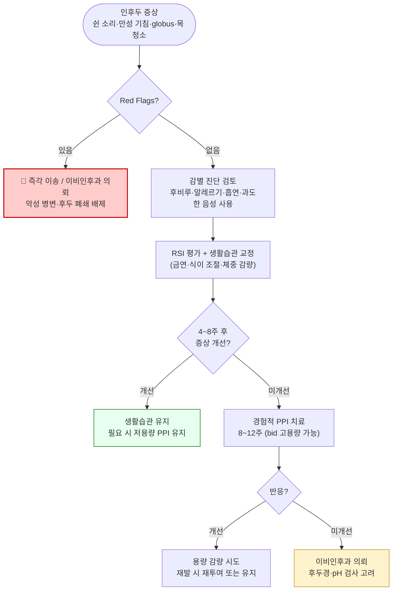

# 인후두역류 Laryngopharyngeal Reflux, LPR

## <mark style="color:green;">일반 사항</mark>

* refluxate (위장에서 역류된 acid, pepsin 등 효소, gas, liquid)가 인후두까지 역류됨으로써 발생하는 larynx 또는 hypopharynx에서의 증상
* 유병률: 24시간 dual sensor pH probe 검사상 증상이 있는 사람의 ½~⅔, 증상이 없는 사람의 ⅓에서 LPR 관찰
* GERD와 달리 주로 **upright position**(활동 시)에 발생하며, 가슴쓰림 등 전형적인 GERD 증상이 동반되지 않는 경우가 많음 (⅔ 이상)


원인과 기전에 대한 논란이 있으며, 알려진 것보다 흔하지 않을 수 있다는 주장이 있음. 산 역류와 후두 증상 사이의 인과 관계를 보여 주는 확실한 증거가 없음.


## <mark style="color:green;">원인 및 기전</mark>

### <mark style="color:orange;">병태생리 가설</mark>

* 상부 식도 괄약근 이완, 활동 시 복압 증가(예: bending over, Valsalva, exercise)에 의한 역류 → refluxate의 후두 점막에 대한 직접 자극 또는 식도 자극을 통한 미주신경 관련 후두 반사 발생 → 기침, 기관지 수축
* laryngeal epithelium은 산과 pepsin의 화학적 손상에 취약
* 인후두는 refluxate 제거 능력이 낮아 산과 pepsin이 오래 머무르며 점막을 자극

### <mark style="color:orange;">GERD와의 차이점</mark>

* LPR 증상은 upright position에서 발생 (GERD는 주로 supine)
* GERD보다 산 노출 빈도 낮음; LPR 증상 환자의 ¾에서는 식도염 없음
* 가슴쓰림 등 전형적 GERD 증상이 없는 경우가 많아 위식도역류에 의한 것인지 불분명한 경우 있음

## <mark style="color:green;">임상 양상</mark>

* 쉰 목소리 또는 발성 장애 (⅔ 이상에서 발생)
* 가래가 없는 만성 기침 또는 목 청소 (throat clearing) (½에서 발생)
* 가슴쓰림 (⅓에서 발생)
* 인두의 덩어리 느낌 (globus sensation), 삼킴곤란
* 코 막힘, 후비루


**RSI (Reflux Symptom Index)**: 9개 증상(쉰 소리, 목 청소, 가래, 삼킴곤란, 식후 기침, 호흡 장애, 성가신 기침, 인두 이물감, 가슴쓰림/역류/소화불량) 각 0~5점으로 합산; **총점 ≥13점**이면 LPR 가능성 높음. 임상적으로 활용 가능한 선별 도구.


***

### <mark style="color:$danger;">🚩 Red Flags!</mark>

<mark style="color:$danger;">**즉각 이송 또는 응급 조치**</mark>

* 혈담(hemoptysis) 동반
* 급속히 진행하는 삼킴곤란 + 체중 감소 → 인두·후두 악성 종양 감별 필요
* 천명(stridor) 또는 호흡 곤란 → 후두 폐쇄 의심

<mark style="color:$warning;">**당일 또는 조기 의뢰**</mark>

* 4주 이상 지속되는 쉰 목소리 (특히 흡연자, 50세 이상) → 악성 병변 배제 위해 후두경 검사
* 연하 통증(odynophagia) 또는 연하 장애 악화
* 항생제·PPI 치료에도 인후통 지속 시

<mark style="color:$info;">**외래 추적 / 추가 평가 계획**</mark> <mark style="color:$info;">- 즉각 위험 낮으나 호전 없으면 의뢰</mark>

* PPI 8~12주 경험적 치료 후 증상 개선 없는 경우 → 이비인후과 의뢰; 후두경·pH 검사 고려
* 재발성 후두 증상으로 PPI 장기 의존 시 → 전문과 평가

***

## <mark style="color:green;">진단</mark>

* 임상 진단: 특이적인 단일 진단 검사 없음; 증상(RSI ≥13) + 후두경 소견 + 치료 반응을 종합하여 판단

### <mark style="color:orange;">검사</mark>

* **후두경 검사**: 후두 부종, 피열연골 부위 발적·육아종 관찰 (RFS ≥7이면 LPR 가능성); 악성 병변 배제에 중요
* **24시간 dual sensor pH probe**: 산 역류에 대한 민감도·특이도 높으나 LPR 증상 발현과 반드시 일치하지 않음; 치료 반응 없는 환자에서 고려
* **esophageal pH·impedance testing**: 비산성 역류 포함하여 평가 가능
* **경험적 PPI 치료**: 진단 목적으로 활용 가능; 고용량 PPI (예: omeprazole 40 ㎎ bid) 최소 8~12주 투여 후 반응 평가

### <mark style="color:orange;">감별 진단</mark>

* 후비루 (부비동염, 알레르기비염, 비-알레르기비염)
* 상부 호흡기 감염
* 목구멍 청소 습관, 과도한 음성 사용
* 온도 또는 기후 변화에 의한 자극
* 흡연, 음주, 환경 자극
* 악성 병변 (인두암, 후두암, 식도암) — Red Flags 동반 시 배제 우선

***



<p align="center"><strong>인후두역류 진단 및 치료 알고리듬</strong></p>

<p align="center"><em><mark style="color:$info;">Ref. 대한이비인후과학회; European Position Paper on LPR (2021)</mark></em></p>

***

## <mark style="background-color:$warning;">Management</mark>

### 치료 방침

* 생활습관 교정을 먼저 시작하고, 충분한 기간(4~8주) 후 효과를 평가
* 약물 치료는 증상이 있는 환자에서 생활습관 교정과 병행; 증상이 없는 환자에게 예방적 투여는 권고하지 않음
* 치료 반응이 없을 경우 진단 재평가 및 전문과 의뢰

## <mark style="color:green;">비-약물 치료 및 예방</mark>

### <mark style="color:orange;">생활습관 교정</mark>

* 금연, 음주 제한
* 과식 회피; 규칙적인 소량의 식사
* 식후 2시간 내 격렬한 운동·활동 회피
* 취침 전 3시간 내 식사 회피
* 취침 시 침대 머리 부분 높이기 (15~20 ㎝)
* 비만인 경우 체중 감량

#### <mark style="color:$primary;">피할 음식</mark>

* **카페인** (괄약근 이완 작용): 커피(디카페인 포함), 페퍼민트, 스포츠 드링크, 초콜릿
* **산성·매운 음식** (점막 직접 자극): 과일(특히 감귤류), 토마토, 잼·젤리, 바베큐 소스, 샐러드 드레싱, 탄산 음료
* **고지방 음식**: 식후 역류 시간 연장

## <mark style="color:green;">약물 치료</mark>

* 증상이 없는 LPR 환자에 대한 약물 치료는 권고하지 않음
* 산 분비 억제: PPI, H2-차단제 (☞ GERD 챕터); GERD 증상이 없는 LPR 환자에서의 효과는 논란

#### <mark style="color:$primary;">PPI</mark>

* **용량 조절 원칙**: 저용량으로 시작 → 6~8주 내 효과 없으면 증량 → 6~8주 내 효과 없으면 중단 (반동성 위산 과다 방지 위해 6~8주간 tapering)
* **고용량 경험적 치료**: omeprazole 40 ㎎ bid (또는 동등 용량) 최소 8~12주 투여; 산 역류 감소 여부와 증상 개선 정도가 일정하지 않음
* GERD가 동반된 경우 GERD 치료 기준을 따름
* 효과 있는 환자에서 용량 감량 시 흔히 재발; 효과 있는 경우 6개월간 치료 후 재평가


16주 고용량 PPI 투여가 위약과 효과 차이 없었다는 보고 있음. LPR 진단의 불확실성을 반영하므로, 치료 반응이 없으면 진단 재평가를 우선 고려.


#### <mark style="color:$primary;">H2-차단제</mark>

* PPI 치료의 보조 (예: PPI — 아침, H2-차단제 — 취침 시) 또는 PPI 중단 시 대체제로 고려

#### <mark style="color:$primary;">제산제</mark>

* 식사(특히 산성 식품) 후 30분 또는 역류가 예상되는 상황(예: 운동 전) 복용
* alginate 함유 제산제 (예: 가비스콘): 물리적 장벽 형성; LPR에서 PPI 보조 또는 단독 사용 고려

#### <mark style="color:$primary;">기타 약물</mark>

* 일부 환자에서 TCA, 항경련제가 유효 (PPI 등이 효과 없을 때 또는 감량 시 고려)
  * nortriptyline <mark style="color:blue;">[센시발]</mark>: 10 ㎎ qd → 효과 없으면 20 ㎎ qd → 효과 없으면 중단 (6~9주간 tapering)
  * gabapentin <mark style="color:blue;">[뉴론틴]</mark>: 저용량부터 시작; 신경병증성 인후 통증 및 과민 반응 개선 목적

***

### <mark style="color:red;">질병코드</mark>

K21.0 식도염을 동반한 위-식도역류병\
K21.9 식도염을 동반하지 않은 위-식도역류병

***

## <mark style="color:purple;">처방례</mark>

> **처방례 1. 경증 LPR (생활습관 교정 + 저용량 PPI)**
>
> ```
> 오메프라졸 20 ㎎/C     1C  #1  (아침 식전 30분)
> ```
>
> _✽ 생활습관 교정과 병행. 6~8주 후 반응 평가; 호전 시 동일 용량으로 6개월 유지 후 감량 시도._

> **처방례 2. 중등도 LPR / 경험적 고용량 치료**
>
> ```
> 오메프라졸 40 ㎎/C     1C  #2  (아침·저녁 식전 30분, 8~12주)
> 가비스콘 현탁액 10 ㎖/포  1포  (식후 및 취침 전)
> ```
>
> _✽ 고용량 bid 요법. 증상 개선 없으면 12주 시점에 중단 후 진단 재평가. 중단 시 반동 방지 위해 6~8주간 tapering._

> **처방례 3. PPI 치료 반응 불충분 + 신경 과민성 인후 증상**
>
> ```
> 오메프라졸 20 ㎎/C     1C  #1  (아침 식전)
> 센시발 10 ㎎/T         1T  #1  (취침 전)
> ```
>
> _✽ nortriptyline은 인후 과민 및 신경병증성 통증 조절 목적. 6~9주 후 효과 평가; 효과 없으면 tapering 후 중단._

***

### <mark style="color:$success;">핵심 복약 지도</mark>

* **PPI 복용 시각**: 아침 식전 30분 복용이 원칙 — 식사와 함께 복용 시 효과 감소
* **치료 기간**: LPR은 GERD보다 치료 반응이 느림; 최소 8~12주 복용 후 효과를 판정
* **PPI 중단 시**: 갑자기 중단 시 반동성 위산 과다 발생 가능 — 6~8주에 걸쳐 서서히 감량
* **생활습관 중요성**: 약물 단독으로는 한계 있음 — 금연, 식이 조절, 취침 전 공복이 치료의 핵심
* **nortriptyline 처방 시**: 졸음·구강 건조 등 부작용 안내; 취침 전 복용; 임의 중단 금지

### <mark style="color:blue;">환자 안내서</mark>

**인후두역류란?**\
위산과 소화 효소가 식도를 넘어 목구멍(인후두)까지 역류하여 자극을 주는 상태입니다. 속쓰림 없이 목소리가 쉬거나, 목에 이물감이 느껴지거나, 만성 기침이 생기는 것이 특징입니다.

**일상 관리 (가장 중요!)**

* 담배는 반드시 끊으세요. 흡연은 위산 역류를 악화시키는 가장 큰 요인입니다.
* 식사 후 최소 2~3시간은 눕거나 격렬한 운동을 피하세요.
* 자기 전 3시간 이내에는 식사하지 마세요.
* 커피(디카페인 포함), 탄산음료, 감귤류, 매운 음식, 술을 줄이세요.
* 체중이 많이 나가신다면 감량이 증상 개선에 도움이 됩니다.

**약을 처방받으셨다면**

* 위산 억제제(PPI)는 **아침 식사 30분 전**에 드세요. 식후 복용 시 효과가 크게 줄어듭니다.
* 증상이 나아졌다고 갑자기 끊지 마세요. 담당 의사와 상의하여 서서히 줄여야 합니다.
* 목소리·목 증상은 회복에 시간이 걸립니다. 최소 2~3개월은 꾸준히 복용하세요.

**즉시 병원에 오셔야 할 때**

* 피가 섞인 가래나 피를 토할 때
* 삼킬 때 통증이 생기거나 음식을 삼키기 어려워질 때
* 쉰 소리가 4주 이상 지속될 때 (특히 흡연자)
* 이유 없이 체중이 줄 때
