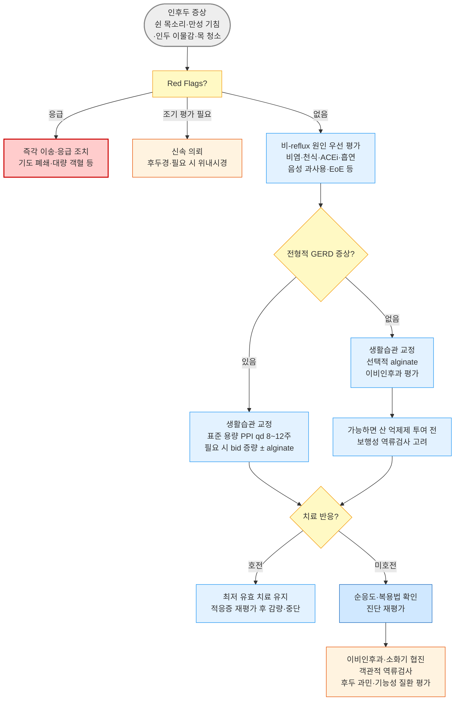

# 인후두역류 Laryngopharyngeal Reflux, LPR

## <mark style="color:green;">일반 사항</mark>

* LPR은 위·십이지장 내용물이 상부 식도 괄약근보다 위쪽으로 역류하여 인두·후두에 증상 또는 병변을 일으키는 상태를 말함
* 그러나 쉰 목소리, 목 청소, 만성 기침, 인두 이물감 등은 비특이적이므로, 증상만 있는 단계에서는 이를 곧바로 LPR로 확진하지 않고 여러 기전이 관여하는 만성 인후두 증상군으로 접근
* LPR에 통일된 진단 기준과 확진검사가 없어 실제 유병률은 알려져 있지 않음
* 전형적인 가슴쓰림·산 역류 없이 인후두 증상만 나타날 수 있으나, 활동 시·야간 또는 직립·앙와위 역류가 모두 가능하므로 LPR과 GERD를 체위만으로 구분할 수 없음


산 역류와 후두 증상 사이의 인과 관계를 보여 주는 확실한 증거가 없으며, LPR은 알려진 것보다 흔하지 않을 수 있다는 주장이 있음. 전형적 GERD 증상이 없는 LPR에서 PPI 치료 효과는 제한적이며, 위약 대비 유의한 차이가 없다는 연구 결과들이 있음


## <mark style="color:green;">원인 및 기전</mark>

### <mark style="color:orange;">병태생리 가설</mark>

* 상부 식도 괄약근 이완, 활동 시 복압 증가(예 : bending over, Valsalva, exercise)에 의한 역류 → refluxate의 후두 점막에 대한 직접 자극 또는 식도 자극을 통한 미주신경 관련 후두 반사 발생 → 기침, 기관지 수축
* laryngeal epithelium은 산과 pepsin의 화학적 손상에 취약
* pepsin의 세포 내 내재화(internalization)와 재활성화가 점막 손상에 관여할 수 있다는 전임상적 가설이 있으나, 이를 개별 환자의 PPI 무반응 또는 non-acid reflux를 설명하는 확립된 임상 기전으로 단정할 수 없음
* 인후두는 refluxate 제거 능력이 낮아 산과 pepsin이 오래 머무르며 점막을 자극
* 일부에서는 acid reflux가 초기 trigger로 작용한 후 laryngeal sensory neuropathy / central sensitization으로 이행하여 역류가 없어도 증상이 지속될 수 있음

### <mark style="color:orange;">GERD와의 차이점</mark>

* GERD와 달리 가슴쓰림·산 역류 없이 인후두 증상만 나타날 수 있으나, 두 질환 모두 주간·야간 및 직립·앙와위 역류가 가능
* 상부위장관내시경이 정상이어도 병적 역류를 배제할 수 없고, 반대로 식도염이 있다고 해서 인후두 증상과의 인과관계가 입증되는 것은 아님
* 전형적 GERD 증상이 없는 단독 인후두 증상은 역류 이외의 원인이 흔하므로 감별 진단과 필요 시 객관적 역류검사가 중요

## <mark style="color:green;">임상 양상</mark>

* 쉰 목소리 또는 발성 장애 (⅔ 이상에서 발생)
* 가래가 없는 만성 기침 또는 목 청소 (throat clearing) (½에서 발생)
* 가슴쓰림 (⅓에서 발생)
* 인두 이물감 (globus sensation), 인후통, 목의 점액감
* 삼킴곤란이 동반될 수 있으나, 진행성 연하 곤란·연하 통증은 경고 증상으로 평가


**RSI (Reflux Symptom Index)** : 9개 증상(쉰 소리, 목 청소, 가래, 삼킴곤란, 식후 기침, 호흡 장애, 성가신 기침, 인두 이물감, 가슴쓰림/역류/소화불량)을 각 0점(문제없음)\~5점(극심함)으로 합산. 통상 >13을 비정상으로 보았으나 특이도가 낮으므로, LPR 진단이나 역류검사 필요 여부를 결정하는 절단점으로 사용하지 않고 증상 부담과 치료 전후 변화를 추적하는 데 참고


### <mark style="color:$danger;">🚩 Red Flags!</mark>

<mark style="color:$danger;">**즉각 이송 또는 응급 조치**</mark>

* 협착음(stridor), 진행하는 호흡 곤란 또는 기도 폐쇄 의심
* 대량 객혈, 저산소증 또는 혈역학적 불안정을 동반한 객혈
* 음식물·침도 삼키기 어렵거나 흡인·탈수 위험이 있는 급성 중증 삼킴곤란

<mark style="color:$warning;">**당일 또는 조기 의뢰**</mark>

* 4주 이상 호전되지 않는 쉰 목소리 → 후두경 검사; 흡연·과음, 경부 종괴, 두경부암 병력, 최근 삽관·경부 수술 등 고위험 단서가 있으면 4주를 기다리지 않고 조기 의뢰
* 진행성 연하 곤란 (progressive dysphagia) 또는 연하 통증(odynophagia)
* 원인 불명의 체중 감소, 토혈·흑색변 또는 빈혈
* 정상 귀 진찰 소견을 보이는 원인 불명의 일측성 이통(unilateral otalgia, referred pain), 지속성 또는 일측성 인후통, 경부 종괴
* 소량이라도 원인 불명의 객혈이 반복되거나 지속되는 경우

<mark style="color:$info;">**외래 추적 / 추가 평가 계획**</mark> <mark style="color:$info;">- 즉각 위험 낮으나 호전 없으면 의뢰</mark>

* 비역류성 원인을 평가하고 적절히 관리했는데도 증상이 지속 또는 재발하는 경우
* 객관적 GERD 근거 없이 PPI에 장기 의존하거나 한 차례 적절한 치료에도 반응하지 않는 경우

## <mark style="color:green;">진단</mark>

* 특이적인 단일 확진검사는 없으며 증상이나 후두경 소견만으로 LPR을 진단할 수 없음. 전형적 GERD 증상 유무, 비-reflux 원인 평가, 후두경·상부위장관내시경 및 보행성 역류검사 결과를 종합하여 역류의 기여 가능성을 판단
* 전형적 GERD 증상 없이 인후두 증상만 있는 경우에는 경험적 PPI보다 비-reflux 원인 평가 및 가능하면 산 억제제 투여 전 보행성 역류검사를 우선 고려
* 가슴쓰림·산 역류 등 전형적 GERD 증상이 동반된 경우에는 표준 용량 PPI trial을 고려할 수 있으나, 치료 반응만으로 GERD가 인후두 증상의 원인이라고 확진하지 않음

### <mark style="color:orange;">검사</mark>

* 후두경 검사 : 후두 부종, 피열연골 부위 발적·육아종 등이 관찰될 수 있으나 비특이적이고 관찰자 간 일치도도 낮음. RFS는 소견의 중증도 추적에 참고할 수 있지만 단독 진단 근거로 사용하지 않으며, 악성 병변 등 비-reflux 원인 배제에 중요
* 상부위장관내시경 : 삼킴곤란, 체중 감소, 토혈·흑색변, 빈혈 등 경고 증상이 있으면 우선 시행. 정상 내시경은 GERD를 배제하지 못하고, 식도염만으로 인후두 증상과의 인과관계를 확정하지 못함
* 보행성 역류검사 : 객관적 GERD가 확인되지 않은 단독 인후두 증상에서는 원칙적으로 PPI 중단 상태에서 시행. 장시간 무선 pH 검사와 24시간 pH-impedance 중 최적 검사법 및 LPR 특이 절단점은 아직 확립되지 않음
* 24시간 pH-impedance : 산성·약산성·비산성 역류 및 액체·가스 역류를 평가할 수 있음. 이미 객관적 GERD가 확인되었으나 고용량 산 억제 중에도 증상이 지속될 때에는 치료 중 검사를 선택적으로 고려
* 하인두 센서를 포함한 HEMII-pH/dual-sensor 검사는 인두 역류를 직접 포착할 수 있다는 장점이 있으나, 정상 참고치·판독 일치도·증상 연관성에 논란이 있어 확정적 gold standard로 단정하지 않음
* 타액 pepsin 검사와 oropharyngeal pH 검사는 현재 routine 진단검사로 권고하지 않음
* 경험적 치료 반응은 진단을 확정하지 못하며, 무반응이면 약제 증량보다 진단 재평가를 우선

### <mark style="color:orange;">감별 진단</mark>

* 후비루 (부비동염, 알레르기비염, 비-알레르기비염) - Upper Airway Cough Syndrome (UACS)
* 만성 기침 증후군 (UACS·GERD·천식 overlap) - ACEi 복용 여부 확인
* 근긴장성 발성 장애 (muscle tension dysphonia) - 음성 과사용, 직업적 음성 사용자에서 흔함
* 후두 감각 신경병증 (laryngeal sensory neuropathy) - 특정 자극(냄새, 찬 공기)에 대한 과민 반응
* 호산구 식도염 (eosinophilic esophagitis, EoE) - 삼킴곤란이 주 증상이고 알레르기 소인이 있는 환자에서 감별 필요; 식도 생검으로 확진
* 상부 호흡기 감염
* 목구멍 청소 습관, 과도한 음성 사용
* 온도 또는 기후 변화에 의한 자극
* 흡연, 음주, 환경 자극
* 악성 병변 (인두암, 후두암, 식도암) - Red Flags 동반 시 배제 우선


```mermaid
graph TD
A([인후두 증상<br/>쉰 목소리·만성 기침<br/>·인두 이물감·목 청소]) --> B[Red Flags?]
B -->|응급| C["즉각 이송·응급 조치<br/>기도 폐쇄·대량 객혈 등"]
B -->|조기 평가 필요| D["신속 의뢰<br/>후두경·필요 시 위내시경"]
B -->|없음| E["비-reflux 원인 우선 평가<br/>비염·천식·ACEi·흡연<br/>음성 과사용·EoE 등"]
E --> F{전형적 GERD 증상?}
F -->|있음| G["생활습관 교정<br/>표준 용량 PPI qd 8~12주<br/>필요 시 bid 증량 ± alginate"]
F -->|없음| H["생활습관 교정<br/>선택적 alginate<br/>이비인후과 평가"]
H --> I["가능하면 산 억제제 투여 전<br/>보행성 역류검사 고려"]
G --> J{치료 반응?}
I --> J
J -->|호전| K["최저 유효 치료 유지<br/>적응증 재평가 후 감량·중단"]
J -->|미호전| L["순응도·복용법 확인<br/>진단 재평가"]
L --> M["이비인후과·소화기 협진<br/>객관적 역류검사<br/>후두 과민·기능성 질환 평가"]

style A fill:#eeeeee,stroke:#888888,stroke-width:2px
classDef yellow fill:#fff9c4,stroke:#f39c12
class B,F,J yellow
classDef sky fill:#e3f2ff,stroke:#2196f3
class E,G,H,I,K sky
style L fill:#d0e8ff,stroke:#1a6abf
    style C fill:#ffcccc,stroke:#cc0000,stroke-width:2px
    style D fill:#fff3e0,stroke:#e65100
    style M fill:#fff3e0,stroke:#e65100

```

<p align="center"><strong>인후두역류 진단 및 치료 알고리듬</strong></p>

***

## <mark style="background-color:$warning;">Management</mark>

### <mark style="color:orange;">치료 방침</mark>

* 생활습관 교정과 식이 조정을 우선 시행하되, 근거가 제한적임을 설명하고 환자별 증상 유발 요인에 맞춰 적용
* 단독 인후두 증상에는 산 억제제를 routine으로 시작하지 않고 비-reflux 원인 평가 및 가능하면 객관적 역류검사를 우선 고려
* 전형적 GERD 증상이 동반되면 표준 용량 PPI 1일 1회로 시작하여 8\~12주 평가하고, 반응이 불충분할 때 복용법·순응도를 확인한 뒤 필요 시 1일 2회로 증량
* 한 차례 적절한 PPI trial에도 반응이 없으면 다른 PPI·P-CAB로 반복 교체하거나 고용량을 지속하기보다 진단 재평가 및 객관적 검사를 우선

### <mark style="color:orange;">치료 불응 시 고려할 기전 및 감별진단</mark>

* 아래 구분은 확립된 LPR phenotype 분류가 아니라, 치료 불응 환자에서 진단과 치료 방향을 재검토하기 위한 임상적 사고 틀임

<table><thead><tr><th width="157">기전·감별진단</th><th width="220">임상 단서</th><th>평가 및 치료 방향</th></tr></thead><tbody><tr><td><strong>GERD overlap</strong></td><td>heartburn/regurgitation 동반; 식후·야간 악화; 비만·열공탈장 등 GERD 위험인자</td><td>GERD 기준에 따른 lifestyle + PPI; 필요 시 alginate</td></tr><tr><td><strong>Non-acid reflux 의심</strong></td><td>산 억제 중에도 식후 역류감·기침 지속</td><td>증상만으로 진단하지 않고 pH-impedance 고려; alginate를 선택적으로 사용</td></tr><tr><td><strong>Laryngeal hypersensitivity</strong></td><td>목 청소·마른기침 반복; 냄새·찬 공기 등 자극 과민; 적절한 검사에서 원인 불명</td><td>Speech-language/cough-control therapy 우선 또는 병행; 선택적 neuromodulator</td></tr><tr><td><strong>Functional globus</strong></td><td>연하 시보다 공복·비연하 시 이물감; 식사 시 호전; 구조적 이상 없음</td><td>Reassurance; 필요 시 CBT 또는 speech therapy; 선택적 neuromodulator</td></tr><tr><td><strong>Muscle tension dysphonia</strong></td><td>음성 피로; 직업적 음성 사용자; 말 많이 하면 악화; 후두경상 긴장 패턴</td><td>Speech/voice therapy 및 후두 긴장 완화 훈련</td></tr></tbody></table>


**PPI를 고려할 임상 상황**

PPI trial 고려 : heartburn/regurgitation 등 전형적 GERD 증상 동반 또는 객관적 GERD 확인\
PPI routine 사용을 피할 상황 : isolated throat symptom만 있는 경우 / 객관적 검사 정상 / 한 차례 적절한 PPI trial에 완전 무반응


#### <mark style="color:$primary;">진단·치료 시 흔한 오류</mark>

* 인후두 증상이 있으면 무조건 PPI 시작 → 비-reflux 원인을 먼저 배제할 것
* PPI 실패 시 증량만 반복 → 반응 없으면 중단 후 진단 재평가
* RSI 점수만으로 LPR 진단 → RSI는 선별 도구; 진단 기준 아님
* 후두경 소견(RFS)을 과신 → 특이도 낮음; 단독 진단 근거 불가
* Muscle tension dysphonia, laryngeal hypersensitivity 등 비-reflux 원인을 간과
* PPI 반응을 LPR 확진으로 해석 → 자연 경과·위약 효과·다른 기전에 의한 호전 가능

## <mark style="color:green;">비-약물 치료 및 예방</mark>

### <mark style="color:orange;">생활습관 교정</mark>

* 금연, 음주 제한
* 과식 회피; 규칙적인 소량의 식사
* 식후 바로 눕거나 개인적으로 역류를 유발하는 격렬한 운동 회피
* 취침 전 3시간 내 식사 회피
* 야간·앙와위 역류가 있으면 취침 시 침대 머리 부분 높이기 (15\~20 ㎝)
* 비만인 경우 체중 감량

#### <mark style="color:$primary;">식이 조정</mark>

**식이 원칙**

* 모든 환자에게 특정 음식을 일률적으로 금지하지 않고, 증상 일지를 통해 개인적으로 증상을 유발하는 음식·음료를 확인하여 제한
* 흔한 유발 요인인 과식, 고지방식, 술, 카페인 음료, 초콜릿, 페퍼민트, 탄산음료, 산성·매운 음식은 증상과의 연관성이 확인될 때 줄임

**Low-acid diet** (pH ＞5 식품 중심)&#x20;

* 채소, 생선, 통곡물 등 위주의 식사가 증상 개선에 도움될 수 있음 (소규모 연구 근거; Mediterranean diet 패턴 참고 가능)

## <mark style="color:green;">약물 치료</mark>

* 산 분비 억제 : PPI, H2-차단제 (☞ [소화기계 약제](../224_/073_.md#h2-h2-receptor-antagonist)); 전형적 GERD 증상이 없는 단독 인후두 증상에서의 효과는 제한적이며 논란이 있음

#### <mark style="color:$primary;">Alginate 제산제</mark>

* 국내 허가 용법은 성인 및 12세 이상에서 일반적으로 1회 10\~20 ㎖, 1일 4회(식후 및 취침 전); 제품별 허가사항 확인
* alginate 함유 제산제 (예 : 가비스콘 <mark style="color:blue;">\[가비스콘]</mark>) : 위 내용물 표면에 물리적 장벽(raft) 형성 → acid pocket 차단 → LPR 증상 감소
* 산성·약산성 역류에 기전상 도움이 될 수 있으나 LPR 임상시험은 규모가 작고 진단 기준도 다양함. 단독 또는 GERD 치료의 보조로 선택적 사용
* 다른 경구약과의 복용 간격을 확인하고, 심부전·신장애 등 나트륨 제한 환자와 고칼슘혈증·신석회침착증·반복성 칼슘 신결석 환자에서는 주의

#### <mark style="color:$primary;">PPI</mark>

* 전형적 GERD 증상 또는 객관적 GERD가 있는 환자에서 GERD 치료 기준에 따라 사용; isolated throat symptom만 있는 경우 routine 경험 치료를 피함
* omeprazole 20 ㎎ qd 또는 동등 표준 용량을 식전 30\~60분에 8\~12주 trial → 복용법·순응도를 확인한 뒤 필요 시 bid로 증량
* 한 차례 적절한 trial에 무반응이면 다른 PPI·P-CAB로 반복 교체하거나 고용량을 지속하기보다 중단 후 진단 재평가
* 유지 적응증이 없으면 최저 유효 용량으로 줄이거나 중단. 장기·고용량 복용자는 반동성 위산 과다 가능성을 설명하고 단계적 감량 또는 즉시 중단 중 환자 상황에 맞는 방법을 선택


지속성 인후 증상 환자에게 lansoprazole 30 ㎎ bid를 16주 투여한 TOPPITS RCT에서 위약보다 유의한 효과가 없었음. PPI 무반응은 고용량 치료를 반복하기보다 LPR 진단 자체와 non-acid reflux, laryngeal hypersensitivity 등 다른 기전을 재평가할 신호


#### <mark style="color:$primary;">H2-차단제</mark>

* LPR의 1차 치료로 권고하지 않으며, 객관적 GERD 환자의 간헐적 야간 돌파 증상 또는 PPI 중단 후 일시적 반동 증상에 선택적으로 고려
* famotidine <mark style="color:blue;">\[가스터]</mark> 또는 nizatidine <mark style="color:blue;">\[액시드]</mark> 등을 사용할 수 있으나, 지속 투여 시 tachyphylaxis가 발생할 수 있어 routine 장기 병용은 피함

#### <mark style="color:$primary;">P-CAB (Potassium-Competitive Acid Blocker)</mark>

* 국내 임상에서 사용 비중이 증가한 PPI 대안이나 LPR 치료는 국내 허가 외 사용이며, 객관적 GERD 근거 없는 단독 인후두 증상에 routine으로 권고할 근거는 부족
* 장점 : 식사 여부와 상관없이 복용 가능 (PPI의 식전 30분 제약 없음); 야간 산 돌파(nocturnal acid breakthrough) 억제에 효과적; 초회 복용부터 빠른 산 억제 효과
* tegoprazan <mark style="color:blue;">\[케이캡]</mark> 50 ㎎ qd : 소규모 위약대조 RCT에서 증상·소견은 개선되었으나 위약보다 우월하지 않았음
* fexuprazan <mark style="color:blue;">\[펙수클루]</mark> 40 ㎎ qd : 8주 RCT에서 esomeprazole 40 ㎎ qd와 전체 효과 차이가 없었고 중증 RSI 하위군에서 초기 호전이 빨랐음. RSI/RFS만으로 환자를 선정하고 위약군이 없었다는 한계
* PPI 무반응만을 근거로 P-CAB로 교체하지 않으며, 장기 복용 후 중단 방법은 환자의 GERD 적응증·용량·복용 기간과 중단 증상에 따라 개별화

#### <mark style="color:$primary;">Neuromodulator (난치성 만성 기침·후두 과민)</mark>

* PPI 불응만으로 후두 과민을 진단하지 않음. 비-reflux 원인과 객관적 GERD를 적절히 평가한 뒤 원인불명 또는 난치성 만성 기침·후두 과민이 확인된 환자에서 speech-language/cough-control therapy를 우선 또는 병행
* gabapentin <mark style="color:blue;">\[뉴론틴]</mark> 또는 pregabalin <mark style="color:blue;">\[리리카]</mark> : 전문적 평가와 위험-편익 상의 후 저용량부터 선택적으로 사용; 졸림·어지럼·인지 저하·낙상 및 다른 중추신경 억제제 병용 시 호흡억제 위험에 주의
* nortriptyline <mark style="color:blue;">\[센시발]</mark> : 근거가 주로 소규모 후향 연구에 국한되므로 routine 1차 선택으로 권고하지 않음. 선택 시 저용량부터 시작하고 항콜린성 부작용, 기립저혈압, 심전도 위험 등을 고려
* 위 약제는 LPR 또는 만성 기침 치료 목적으로 국내 허가 외 사용이므로, 필요 시 이비인후과·호흡기·음성치료 전문가와 협진

***

### <mark style="color:red;">질병코드</mark>

K21.0 식도염을 동반한 위-식도역류병\
K21.9 식도염을 동반하지 않은 위-식도역류병

✽ K21.0/K21.9는 GERD가 임상적·객관적으로 진단된 경우 사용. 인후두 증상만으로 GERD 코드를 부여하지 않고 실제 확인된 증상 또는 후두 질환에 해당하는 코드를 우선 고려

***

## <mark style="color:purple;">처방례</mark>

> **처방례 1. 단독 인후두 증상에서 alginate를 선택적으로 사용하는 경우**
>
> ```
> 가비스콘 현탁액 10 ㎖/포  1~2포  #4  (식후 및 취침 전)
> ```
>
> _✽ 생활습관 교정과 비-reflux 원인 평가를 병행. 객관적 GERD 근거 없는 단독 인후두 증상에는 PPI를 routine으로 추가하지 않음. 국내 허가 용법은 성인 및 12세 이상에서 1회 10\~20 ㎖, 1일 4회(식후 및 취침 전)이며 제품별 허가사항 확인._

> **처방례 2. 전형적 GERD 증상이 동반된 경우의 초기 trial**
>
> ```
> 오메프라졸 20 ㎎/C         1C  #1  (아침 식전 30~60분, 8~12주)
> 가비스콘 현탁액 10 ㎖/포   1~2포  #4  (식후 및 취침 전, 필요 시)
> ```
>
> _✽ heartburn/regurgitation 등 전형적 GERD 증상이 동반된 경우에 사용. 반응이 불충분하면 복용법·순응도를 먼저 확인하고 필요 시 오메프라졸 20 ㎎ bid 또는 동등 용량으로 증량. 한 차례 적절한 8\~12주 trial에 무반응이면 고용량을 반복하기보다 진단 재평가 및 객관적 역류검사 고려._

> **처방례 3. 난치성 만성 기침·후두 과민에 대한 전문적 평가 후 선택적 치료**
>
> ```
> 센시발 10 ㎎/T            1T  #1  (취침 전)
> ```
>
> _✽ PPI 무반응만으로 처방하지 않음. 비-reflux 원인과 객관적 GERD를 평가하고 원인불명 또는 난치성 만성 기침·후두 과민이 확인된 경우 speech-language/cough-control therapy를 우선 또는 병행하며 전문의 판단하에 선택. 국내 허가 외 사용이며 졸림·구강 건조·변비·배뇨장애·기립저혈압·심전도 위험에 주의._

***

### <mark style="color:$success;">핵심 복약 지도</mark>

* **PPI 복용 시각** : 1일 1회는 아침 식전 30\~60분, 1일 2회는 아침·저녁 식전 30\~60분 복용
* **P-CAB 복용 시각** : tegoprazan, fexuprazan은 식사 여부와 무관하게 복용 가능 - 복용 편의성이 필요한 환자에 유리
* **alginate 복용 시각** : 식후 및 취침 전 복용; 다른 경구약과의 복용 간격 및 제품별 허가사항 확인
* **치료 기간** : 전형적 GERD가 동반되어 PPI trial을 시행할 때 8\~12주 후 효과와 지속 적응증을 재평가
* **PPI 중단 시** : 장기·고용량 복용 후에는 일시적 반동 증상이 생길 수 있음. 단계적 감량 또는 즉시 중단 중 환자 상황에 맞는 방법을 의사와 상의
* **생활습관 중요성** : 약물 단독으로는 한계 있음 - 금연, 식이 조절, 취침 전 공복이 치료의 핵심
* **nortriptyline 처방 시** : 국내 허가 외 사용임을 설명하고 졸음·구강 건조·변비·배뇨장애·기립저혈압 등 부작용 안내

### <mark style="color:blue;">환자 안내서</mark>

**인후두역류란?**\
위 내용물이 목구멍(인후두)까지 역류하여 목소리 변화, 목의 이물감, 목 청소 또는 만성 기침 등에 영향을 주는 상태를 말합니다. 그러나 이러한 증상은 비염·천식·약물·흡연·음성 과사용이나 후두 과민 등 다른 원인으로도 흔히 생기므로, 증상만으로 인후두역류를 확진할 수 없습니다.

**일상 관리 (가장 중요!)**

* 담배는 끊으세요. 흡연은 역류와 후두 자극을 악화시킬 수 있습니다.
* 식사 후 최소 2\~3시간은 눕거나 격렬한 운동을 피하세요.
* 자기 전 3시간 이내에는 식사하지 마세요.
* 모든 음식을 일률적으로 금지할 필요는 없습니다. 커피·탄산음료·술·고지방식·산성 또는 매운 음식 가운데 본인의 증상을 유발하는 음식을 확인하여 줄이세요.
* 채소, 생선, 통곡물 위주의 담백한 식사가 증상 개선에 도움이 됩니다.
* 체중이 많이 나가신다면 감량이 증상 개선에 도움이 됩니다.

**약을 처방받으셨다면**

* 위산 억제제(PPI)는 1일 1회이면 **아침 식사 30\~60분 전**, 1일 2회이면 **아침·저녁 식사 30\~60분 전**에 드세요.
* 케이캡, 펙수클루 등 새로운 위산 억제제(P-CAB)는 식사와 무관하게 복용할 수 있습니다.
* 알긴산 제제(가비스콘 등)는 **식후와 취침 전**에 드세요. 다른 약과의 복용 간격은 의사·약사에게 확인하세요.
* 모든 인후두 증상에 위산 억제제가 필요한 것은 아닙니다. 정해진 평가 기간 후 효과가 없으면 임의로 증량·연장하지 말고 진단을 다시 확인하세요.
* 장기간 위산 억제제를 복용했다면 중단 방법을 담당 의사와 상의하세요.

**즉시 응급진료가 필요한 경우**

* 숨쉬기 어렵거나 숨을 들이쉴 때 거친 소리가 날 때
* 많은 피를 기침으로 토하거나 어지럼·호흡곤란이 동반될 때
* 음식물이나 침도 삼키기 어렵고 숨이 막히거나 탈수가 우려될 때

**빠른 시일 내 진료가 필요한 경우**

* 소량이라도 피가 섞인 가래가 반복되거나 피를 토할 때
* 삼킬 때 통증이 생기거나 점차 음식을 삼키기 어려워질 때
* 한쪽 귀가 원인 불명으로 아플 때
* 쉰 소리가 4주 이상 지속될 때 (특히 흡연자)
* 이유 없이 체중이 줄 때
