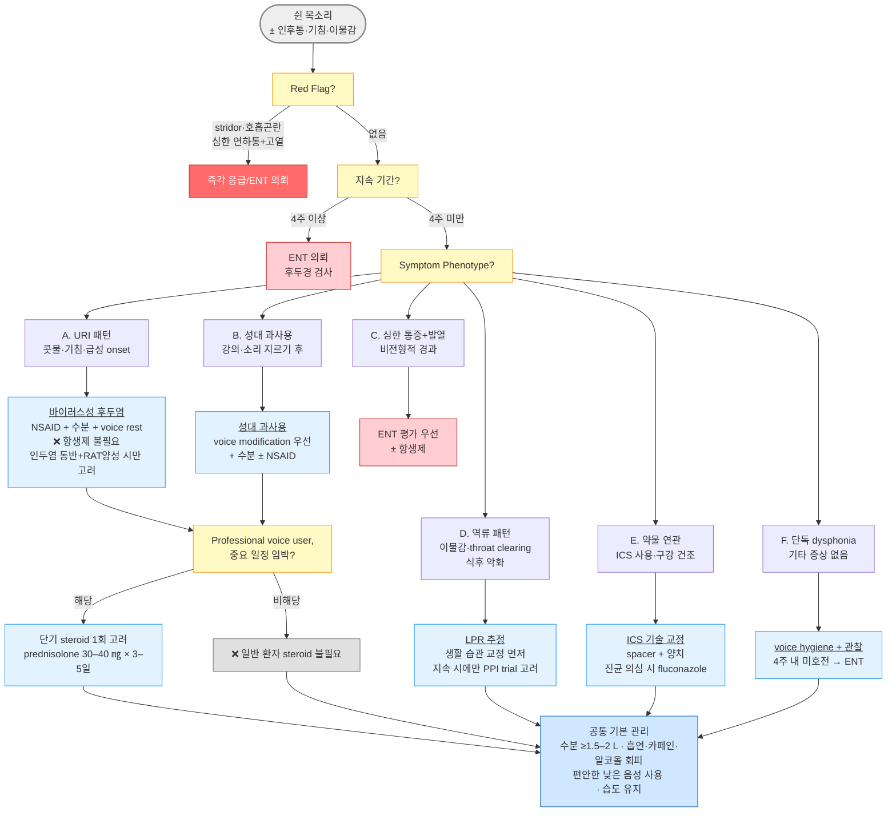

# 후두염 Laryngitis

## <mark style="color:green;">일반 사항</mark>

* 후두 또는 성대 점막의 염증으로, 쉰 목소리(dysphonia)를 주증상으로 하는 임상 증후군
* 급성 후두염 : 3주 미만 지속; 바이러스성이 대부분이며 원인 및 악화 요인을 피하고 적절히 관리하면 2\~3주 내 자연 치유
* 만성 후두염 : 3주 이상 지속; 반복적 자극 또는 기저 질환에 의함

## <mark style="color:green;">원인 및 위험 인자</mark>

* 감염 : 바이러스(대부분; URI 관련), 세균(드묾), 진균(면역저하자·흡입 스테로이드 사용자)
* 자극 : 공기 건조, 오염된 공기, 흡연, 흡인, GERD/인후두역류(LPR), 알레르겐, 후비루, 성대 과사용, 외상, 흡입 스테로이드(ICS)

<table><thead><tr><th width="79">구분</th><th>주요 위험 인자</th></tr></thead><tbody><tr><td>급성</td><td>상기도 감염(바이러스), 외상(기도 삽관), 성대 과사용(말하기·노래·소리 지르기), 기침, 면역 저하</td></tr><tr><td>만성</td><td>알레르기, 만성 비부비동염, voice abuse(교사·텔레마케터·가수), GERD/LPR, 흡연, 알코올 남용, ICS 사용, RA, sarcoidosis, 뇌졸중, 환경오염, 약물(항콜린제·항히스타민제·ACEI)</td></tr></tbody></table>


**ICS(흡입 스테로이드)와 dysphonia** : ICS는 후두염 및 dysphonia의 흔한 원인 약물임. 흡입 후 양치질만으로 예방이 불충분할 경우, spacer 사용 및 ICS 용량 조절을 고려. 진균성 후두염(칸디다)이 의심되면 fluconazole을 사용



**ACEI(ACE 억제제)와 만성 후두염** : ACEI 유발 기침(복용 환자의 5\~20%)은 후두 자극과 쉰 목소리를 유발하여 만성 후두염으로 오인될 수 있음. 만성 기침·쉰 목소리 환자에서 ACEI 복용력을 반드시 확인하고, 원인 약물 중단(ARB로 대체) 후 수주 내 호전 여부를 추적


## <mark style="color:green;">임상 양상</mark>

* 쉰 목소리, 인후통, 마른기침
* URI에 의한 경우 : 인후통, 기침, 콧물, 발열, 피로감, 국소 림프절염 동반

### <mark style="color:$danger;">🚩 Red Flags!</mark>

<mark style="color:$danger;">**즉각 조치 또는 응급 의뢰**</mark>

* 흡기 시 천명음(stridor), 급격한 호흡곤란 → 후두개염(epiglottitis) 또는 croup
* 심한 연하통 + 고열 + 목 앞 부종 → 급성 성문상 후두염
* 침을 삼키지 못해 흘리는 침 흘림(drooling) → 후두개염

<mark style="color:$warning;">**당일 또는 조기 의뢰**</mark>

* 심한 연하곤란(삼킴곤란) 동반
* 경부 종괴 또는 압통 동반
* 쉰 목소리와 동반된 객혈(hemoptysis) → 후두암·하기도 병변
* 면역저하자에서 치료에 반응 없는 후두염

<mark style="color:$info;">**외래 추적 / 추가 평가 계획**</mark> <mark style="color:$info;">- 즉각 위험 낮으나 호전 없으면 의뢰</mark>

* 4주 이상(고위험군-60세 이상·흡연자·음주자-은 3주 이상) 다른 원인 없이 지속되는 쉰 목소리
* 쉰 목소리와 함께 의도하지 않은 체중 감소&#x20;
* 3주 이상 지속되는 경부 이물감, 연하곤란(삼킴곤란)

## <mark style="color:green;">진단</mark>

* 임상 진단 : 전형적 증상(쉰 목소리·인후통·마른기침) + 병력으로 진단
* 후두경 검사 : 4주 이상 dysphonia 지속 시, Red Flag 동반 시, 음성 직업군에서 고려; 고위험군(60세 이상·흡연자·음주자)은 3주 이상 지속 시 권고

### <mark style="color:orange;">감별</mark>

<table><thead><tr><th width="180">질환</th><th>감별 포인트</th></tr></thead><tbody><tr><td>후두개염(epiglottitis)</td><td>고열, 심한 연하통, 목 앞 부종, stridor; 응급 처치 필요</td></tr><tr><td>크루프(croup)</td><td>주로 소아; 개 짖는 기침(barking cough), 흡기 시 stridor</td></tr><tr><td>성대 결절/폴립</td><td>음성 직업군; 서서히 진행하는 dysphonia; 후두경으로 확인</td></tr><tr><td>후두암</td><td>고령·흡연자; 서서히 악화되는 dysphonia; 후두경 + 생검</td></tr><tr><td>근긴장성 발성장애</td><td>스트레스·긴장 관련; 음성 피로, 경직된 발성</td></tr><tr><td>인후두역류(LPR)</td><td>인후 이물감, 만성 기침, 식후 악화; 단, 과잉 진단 주의</td></tr><tr><td>ICS 유발 dysphonia</td><td>ICS 사용력; 흡입 후 양치 여부 확인; spacer·용량 조절 고려</td></tr><tr><td>반회후두신경 마비<br>(RLN palsy)</td><td>갑상선 수술·흉부 종양·대동맥류 병력; 갑작스러운 단측 성대 마비; 흡인 동반 가능; ENT 의뢰</td></tr><tr><td>노인성 후두(Presbylarynx)</td><td>고령; 염증 없는 성대 위축·긴장 저하; 기식성·약한 목소리; 음성치료 고려</td></tr></tbody></table>

***



<p align="center"><strong>급성 후두염 - Symptom Phenotype 기반 진단·치료 알고리듬</strong></p>

***

## <mark style="background-color:$warning;">Management</mark>

### <mark style="color:orange;">치료 방침</mark>

* 보통 항생제는 필요 없음 - 대부분 바이러스성 후두염이며 세균성은 드묾&#x20;
  * 항생제 고려 대상 : 인두염(편도염) 동반 + Centor/McIsaac 기준 + RAT 양성
* 스테로이드는 일반 환자에서 routine 사용 권고되지 않음 - 아래 제한 조건에서만 고려
* 원인 및 악화 요인 제거가 가장 중요한 치료

## <mark style="color:green;">비-약물 치료 및 예방</mark>

* 성대 휴식 : 큰 소리·무리한 발성 피하고 편안한 낮은 음성으로 최소한만 사용 (속삭이기는 성대의 긴장을 높임); 최신 경향으로는 '절대적 음성 휴식(total voice rest)'보다 음성 보존(voice conservation/relative rest)이 성대 근육 위축 예방 측면에서 더 권장됨 (☞ [목쉼](../222_/058_-hoarseness.md#undefined-11))
* 증기 흡입 : 환자의 주관적 증상 완화에 도움 될 수 있으나 근거는 제한적
* 충분한 수분 섭취 : 하루 2 L 이상(음식·음료  포함); 점막 촉촉하게 유지
* 금연 : 흡연은 성대 점막 직접 손상; 만성 후두염의 주요 원인
* 알레르겐 회피, 실내 습도 유지(40\~60%), 마스크 착용
* GERD/LPR 관리 : 전형적 역류 증상이 있는 경우; 술·카페인·신 음료 회피, 식후 3시간 내 눕지 않기 (☞ [위식도역류질환](../224_/081_-gerd.md))
  * LPR(인후두역류) 과잉 진단 주의 : LPR은 임상적으로 과잉 진단되는 경향이 있음. 전형적 GERD 증상(흉통, 위산 역류감)이 없고 단순 이물감·만성 기침만 있는 경우, 경험적 PPI 치료는 제한적으로 고려하며 장기 처방을 피함 (☞ [인후두역류](062_-laryngopharyngeal-reflux-lpr.md))
* ICS 관련 dysphonia 예방 : 흡입 후 반드시 물로 입안 헹구기; 증상 지속 시 spacer 사용 및 ICS 용량 조절 검토
* 개인위생 : 손 씻기, 호흡기 질환 예방

## <mark style="color:green;">약물 치료</mark>

* 통증·기침·콧물 : 대증 치료 (☞ [인후통](061_-acute-pharyngitis.md#undefined-14), [기침](../220_/006_-cough.md#management), [감기](060_-common-cold.md#management))
* 항생제 : 후두염 단독으로는 원칙적으로 불필요
  * 항생제 적용 대상 : 인두염(편도염)이 동반되고 [Centor/McIsaac](061_-acute-pharyngitis.md#centor-score-modified-mcisaac) score ≥3점 + RAT 양성 - amoxicillin 500 ㎎ bid × 10일 고려 <mark style="color:blue;">\[파목신]</mark>; RAT 음성이라도 임상적으로 강하게 의심되면 처방 가능
* 항진균제 : 진균성 후두염 의심 시(ICS 사용자·면역저하자) fluconazole 100\~200 ㎎ qd × 14일 <mark style="color:blue;">\[푸루나졸]</mark>
* 스테로이드 : 일반 환자에서는 routine 권고하지 않음
  * 스테로이드 적용 대상 - 다음 조건을 충족 시에만 고려
    * Professional voice user (성악가·아나운서·강사 등)
    * 중요한 음성 사용 일정이 수일 내 임박
    * Severe dysphonia - 단, 기도 문제(stridor·호흡곤란)가 없는 경우
  * prednisolone 30\~40 ㎎ qd (오전) × 3\~5일 <mark style="color:blue;">\[솔론도]</mark>
  * 반복 처방은 음성 남용 지속과 이어지므로 원칙적으로 1회에 한함

***

### <mark style="color:red;">질병코드</mark>

J04.0 급성 후두염\
J37.0 만성 후두염

***

## <mark style="color:purple;">처방례</mark>

> **처방례 1. 바이러스성 급성 후두염 (대부분의 경우)**
>
> ```
> 부루펜 200 ㎎/T  3T  tid  pc  × 5일
> ```
>
> _✽기침·콧물 동반 시 코데닝 6T #3 추가; 항생제는 처방하지 않음_\
> &#xNAN;_✽통증·부종이 심하거나 하루 복용 횟수를 줄이고 싶은 경우 naproxen 250\~500 ㎎ bid 대안 고려_ <mark style="color:blue;">\[탁센]</mark>

> **처방례 2. 인두염 동반 + RAT 양성 (GAS 인두후두염)**
>
> ```
> 파목신 500 ㎎/C   2C  bid  × 10일
> 맥시부펜 이알 300 ㎎/T  2T  bid  pc
> ```
>
> _✽기침·콧물 동반 시 코푸 시럽 20 ㎖/P 4P #4 추가_\
> &#xNAN;_✽후두염 단독(인두염 미동반)에는 이 처방례 사용하지 않음_

> **처방례 3. ICS 관련 진균성 후두염**
>
> ```
> 푸루나졸 100 ㎎/C  2C  qd  × 14일
> ```
>
> _✽ICS 흡입 후 양치질 교육 반드시 시행; spacer 사용 및 ICS 용량 조절 검토_

> **처방례 4. Professional voice user - 중요 일정 임박 (steroid 단기, 1회 한정)**
>
> ```
> 솔론도 5 ㎎/T   8T  qd  am  × 5일
> 부루펜 200 ㎎/T  3T  tid  pc  × 5일
> ```
>
> _✽일반 환자에는 사용하지 않음; 반복 처방 금지_\
> &#xNAN;_✽세균 감염이 배제되지 않은 경우 파목신 500 ㎎ bid × 7일 추가 고려_

***

### <mark style="color:$success;">핵심 복약 지도</mark>

* **항생제 불필요 원칙** : 후두염의 대부분은 항생제가 필요하지 않으며, 목을 쉬게 하는 것이 가장 중요한 치료임을 설명
* **amoxicillin** - 증상이 호전되어도 처방된 10일간 끊지 말고 복용; 중단 시 내성균 출현 가능
* **fluconazole** - 간독성 드물지만 가능; 복통·황달·피로감 발생 시 중단 후 즉시 내원
* **prednisolone** - 아침 식후 복용; 5일 이내 단기 사용이므로 감량 없이 종료 가능; 일반 환자에게 반복 처방하지 않음; 당뇨 환자는 혈당 일시 상승 가능(복용 기간 중 혈당 모니터링 강화); 불면증 발생 시 담당 의사에게 알릴 것
* **ibuprofen** - 공복 복용 삼가; 신기능 저하자·위궤양 병력자·임신부 주의
* **ICS 사용 중인 경우** - 흡입 후 반드시 물로 입안을 헹구고, 증상 지속 시 spacer 사용 또는 용량 조절 의논

***

### <mark style="color:blue;">환자 안내서</mark>

**후두염이란?**\
목소리를 만드는 성대(후두)에 염증이 생긴 상태입니다. **대부분 감기 바이러스가 원인이며, 항생제는 필요하지 않습니다.** 충분한 휴식과 관리로 2\~3주 안에 좋아집니다.

**가장 중요한 치료는 목을 쉬게 하는 것입니다**

* 큰 소리나 무리한 발성을 피하고, 꼭 말해야 할 때는 편안한 낮은 목소리로 짧게 하세요.
* 속삭이는 것도 성대에 부담이 될 수 있으니 주의하세요.

**집에서 할 수 있는 관리법**

* 하루 1.5\~2 L 이상 물을 충분히 마시면 성대 점막이 촉촉해집니다.
* 소금물 가글(물 한 컵 + 소금 ½ 티스푼)을 하루 수회 하면 도움이 될 수 있습니다.
* 가습기나 세숫대야 물로 실내 습도를 40\~60%로 유지하세요.
* 담배, 알코올, 커피, 신 음식(역류 유발)을 피하세요.

**이런 증상이 생기면 즉시 병원으로**

* 숨을 들이쉴 때 쇳소리(그르렁·쌕쌕)가 나거나 숨쉬기가 힘든 경우
* 음식이나 침을 삼키기 매우 힘들거나 침이 저절로 흘러내리거나 고열이 함께 있는 경우
* 쉰 목소리와 함께 피가 섞인 가래(객혈)가 나오는 경우
* **4주 이상 쉰 목소리가 지속되는 경우** - 정밀 검사가 필요합니다 (60세 이상·흡연자·음주자는 3주 이상 시 바로 내원)
* 쉰 목소리와 함께 의도하지 않은 체중 감소가 있는 경우

**약 복용 안내**

* 항생제를 처방받으셨다면 처방된 날짜까지 모두 복용하세요.
* 흡입 스테로이드(ICS)를 쓰신다면 흡입 후 반드시 물로 입안을 헹구어 주세요.
