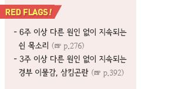
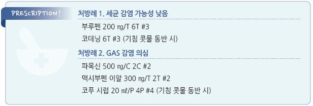

# 후두염 Laryngitis

## 일반 사항

* 후두 또는 성대 점막의 염증
*   급성 후두염 경과 : 원인 및 악화 요인을 피하고 적절히 관리하는

    경우 2\~3주 내 자연 치유

## 원인

*   감염 : virus(감염의 대부분 차지; URI 관련),

    세균(Group A Streptococcus ), 곰팡이
* 자극 : 공기 건조, 오염된 공기, 흡연, 흡인, GERD/인후두역류, 알레르겐, 후비루, 과사용, 외상, 흡입 steroid 사용

### 위험 인자

* 급성 : 기도 감염, 외상(기도 삽관), 과사용(말하기, 노래하기, 소리 지르기), 기침, 면역 저하
*   만성 : 알레르기, 만성 비부비동염, voice abuse(강사, 텔레마케터), GERD/인후두역류, 흡연, 알코올 남용, RA,

    sarcoidosis, 뇌졸중, 환경오염, 약물(흡입 steroid, 항콜린제, 항히스타민제)

## 임상 양상

* 쉰 목소리, 인후통, 마른기침
* URI에 의한 경우 URI의 일반적 증상 : 인후통, 기침, 콧물, 발열, 피로감, 국소 림프절염

## 진단

* 검사 : 필요시 후두경 검사

***

## Management

### 치료 방침

* 과사용 회피 등 보존적 치료
* 대증 약물 치료; 일반적으로 항생제 치료는 필요 없음

## 비-약물 치료 및 예방

* 성대 휴식, voice training (☞ p.277)
*   냉/온 증기 흡입, 수분 섭취 늘림, 소금물 가글

    •소금물 가글액 : 물 1컵(250 ㎖), 소금 ¼~~½ teaspoon(1.5~~3 g)
* 금연
* 알레르겐 회피
* 적절한 습도 유지
* 마스크 착용
* GERD 관리 : 술/카페인/신 음료 섭취 회피, 유발 음식 회피 (☞ p.408)
* 개인위생 관리, 호흡기 질환 예방

## 약물 치료

* 통증, 기침 등 증상 치료 (☞ p.284)
* 항생제 : GAS 감염 시 amoxicillin 등 (☞ p.293)
* 항진균제 : 곰팡이 감염 시 fluconazole 100\~200 ㎎ qd ×14d \[푸루나졸]
* steroid : 심한 증상에 대하여 염증 완화 목적으로 고려

> **질병코드** J04.0 급성 후두염

J37.0 만성 후두염

