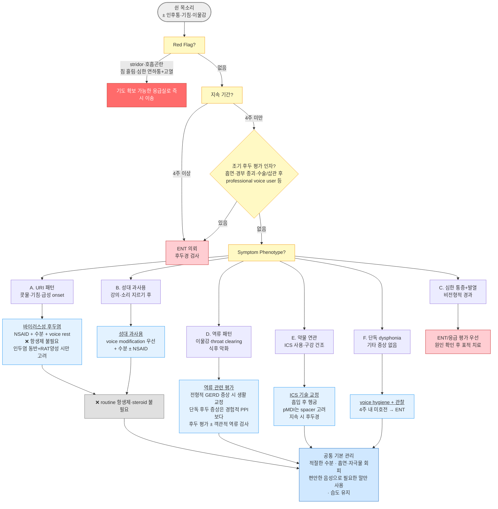

# 후두염 Laryngitis

## <mark style="color:green;">일반 사항</mark>

* 후두 또는 성대 점막의 염증으로, 쉰 목소리(dysphonia)를 주증상으로 하는 임상 증후군
* 급성 후두염 : 3주 미만 지속; 바이러스성이 대부분이며 원인 및 악화 요인을 피하고 적절히 관리하면 2\~3주 내 자연 치유
* 만성 후두염 : 3주 이상 지속; 반복적 자극 또는 기저 질환에 의함

## <mark style="color:green;">원인 및 위험 인자</mark>

* 감염 : 바이러스(대부분; URI 관련), 세균(드묾), 진균(면역 저하자·흡입 스테로이드 사용자)
* 비감염성 원인·악화 요인 : 공기 건조, 오염된 공기·연기 흡입, 흡연, 위식도역류질환(GERD)/인후두역류(LPR), 알레르겐, 후비루, 성대 과사용, 기도 삽관 등의 외상, 흡입 스테로이드(ICS)

<table><thead><tr><th width="79">구분</th><th>주요 원인·위험 인자</th></tr></thead><tbody><tr><td>급성</td><td>상기도 감염(바이러스), 외상(기도 삽관), 성대 과사용(말하기·노래·소리 지르기), 심한 기침, 면역 저하</td></tr><tr><td>만성</td><td>알레르기·만성 비부비동염, 지속적인 성대 과사용(교사·상담원·가수 등), GERD/LPR, 흡연, 과도한 음주, ICS 사용, 환경오염</td></tr><tr><td>후두염 없이 dysphonia를 유발·악화할 수 있는 상태</td><td>뇌졸중·파킨슨병 등 신경계 질환, 반회후두신경 마비, 노인성 성대 위축, 류마티스관절염의 윤상피열관절 침범, sarcoidosis 등 침윤성 질환, 점막을 건조하게 하는 약물(항콜린제·항히스타민제), ACEI 유발 기침</td></tr></tbody></table>


**ICS(흡입 스테로이드)와 dysphonia** : ICS는 국소 점막 자극, 성대 기능 변화·근병증 또는 칸디다증 등을 통해 dysphonia를 유발할 수 있음. 흡입기 사용법을 점검하고 흡입 후 물로 입안을 헹구며, 정량식흡입기(pMDI)는 spacer 사용을 고려. 증상이 지속되면 처방의와 상의하여 최소 유효 용량·제형 조절 및 후두경 검사를 검토하며, 환자가 임의로 ICS를 중단하지 않도록 교육. ICS 사용력만으로 진균성 후두염을 진단하거나 항진균제를 경험적으로 투여하지 않음



**ACEI(ACE 억제제)와 dysphonia** : ACEI 유발 기침은 후두 자극과 쉰 목소리를 유발하여 만성 후두염으로 오인될 수 있음. 만성 기침·쉰 목소리 환자에서 ACEI 복용력을 확인하고, 임상적으로 의심되면 ARB 등으로 대체한 후 호전 여부를 추적(대개 1\~4주, 일부는 더 오래 지속)


## <mark style="color:green;">임상 양상</mark>

* 쉰 목소리, 인후통, 마른기침
* URI에 의한 경우 : 인후통, 기침, 콧물, 발열, 피로감, 경부 림프절 종대 동반 가능

### <mark style="color:$danger;">🚩 Red Flags!</mark>

<mark style="color:$danger;">**즉각 조치 또는 응급 의뢰**</mark>

* 흡기성 협착음(stridor), 급격하거나 진행하는 호흡곤란·청색증 → 급성 상기도 폐쇄, 후두개염/성문상염 등
* 인두 소견에 비해 심한 인후통·연하통 + 고열·먹먹한 목소리(hot-potato voice)·독성 병색 → 후두개염/성문상염 또는 심경부 감염
* 침도 삼키지 못하고 흘림(drooling), tripod 자세 → 후두개염/성문상염; 기도 확보가 가능한 응급실로 즉시 이송

<mark style="color:$warning;">**당일 또는 조기 의뢰**</mark>

* 설명되지 않는 경부 종괴, 진행성 연하곤란·연하통, 의도하지 않은 체중 감소 동반
* 쉰 목소리와 동반된 객혈(hemoptysis) → 후두암·하기도 병변 평가
* 흡연력이 있거나 45세 이상에서 지속적이고 설명되지 않는 쉰 목소리; 기간을 기계적으로 기다리지 말고 조기 후두경 고려
* 최근 두경부·갑상선·흉부 수술 또는 기관삽관 후 발생한 dysphonia, 특히 흡인·약한 기침 동반
* 갑자기 발생한 기식성·약한 목소리 또는 흡인 증상 → 성대 마비 가능
* 면역 저하자에서 비전형적이거나 치료에 반응하지 않는 후두염
* Professional voice user에서 중요한 일정이 임박했거나 음성 변화가 심한 경우

<mark style="color:$info;">**외래 추적 / 추가 평가 계획**</mark> <mark style="color:$info;">- 즉각 위험 낮으나 호전 없으면 의뢰</mark>

* 명확한 양성 원인이 있더라도 4주 이내에 호전되지 않는 dysphonia → 후두경 검사
* 반복되는 dysphonia 또는 점차 악화되는 음성 변화
* 3주 이상 지속되는 인후 이물감·만성 기침 등에서 초기 관리 후 호전이 없거나 진단이 불확실한 경우

## <mark style="color:green;">진단</mark>

* 임상 진단 : 급성 URI 또는 성대 과사용 후 발생한 전형적인 쉰 목소리·인후통·마른기침은 병력과 진찰로 진단하며 routine 검사는 필요하지 않음
* 원인별 검사 : GAS 인두염, 인플루엔자·COVID-19 등의 검사는 해당 감염이 의심되고 결과가 치료·격리 결정에 영향을 줄 때 선택적으로 시행
* 후두경 검사 : dysphonia가 4주 이내에 호전되지 않거나 Red Flag·심각한 원인 의심 시 기간과 관계없이 시행/의뢰. 흡연력, 경부 종괴, 최근 두경부·흉부 수술/기관삽관, professional voice user에서는 조기 평가 고려
* 영상 검사 : 주증상이 dysphonia인 환자에서는 특별한 예외가 없는 한 CT/MRI보다 후두 시각화를 먼저 시행

### <mark style="color:orange;">감별</mark>

<table><thead><tr><th width="180">질환</th><th>감별 포인트</th></tr></thead><tbody><tr><td>후두개염/성문상염</td><td>인두 소견에 비해 심한 인후통·연하통, 고열, 침 흘림, 먹먹한 목소리, 독성 병색, 진행 시 stridor; 응급 기도 평가</td></tr><tr><td>크루프(croup)</td><td>주로 소아; 개 짖는 기침(barking cough), 흡기성 협착음(stridor)</td></tr><tr><td>성대 결절/폴립</td><td>음성 직업군; 서서히 진행하거나 반복되는 dysphonia; 후두경으로 확인</td></tr><tr><td>후두암</td><td>흡연력·고령, 경부 종괴·연하곤란·객혈·체중 감소; 지속되거나 점차 악화되는 dysphonia; 후두경 ± 생검</td></tr><tr><td>근긴장성 발성장애</td><td>음성 피로, 목의 긴장감, 힘주어 말하는 양상; 후두 병변 배제 후 진단</td></tr><tr><td>인후두역류(LPR)</td><td>인후 이물감, 만성 기침·목청소; 증상만으로 진단하지 않으며 과잉 진단 주의</td></tr><tr><td>ICS 유발 dysphonia</td><td>ICS 사용력; 흡입기 사용법·용량·제형 확인. 비감염성 원인이 흔하며 지속 시 후두경 고려</td></tr><tr><td>반회후두신경 마비<br>(RLN palsy)</td><td>최근 갑상선·두경부·흉부 수술, 기관삽관, 흉부 종양·대동맥류 병력; 기식성·약한 목소리, 약한 기침·흡인; ENT 의뢰</td></tr><tr><td>노인성 성대 위축<br>(Presbylaryngis)</td><td>고령; 염증 없는 성대 위축·성문 폐쇄부전; 기식성·약한 목소리; 후두경 확인 후 음성치료 고려</td></tr><tr><td>진균성·결핵성 후두염</td><td>면역 저하, 고용량 ICS, 결핵 노출·전신 증상; 백색 병변·궤양은 악성 종양과 유사할 수 있어 후두경 ± 조직검사·배양 필요</td></tr></tbody></table>

***


```mermaid
graph TD
    A([쉰 목소리<br/>± 인후통·기침·이물감]) --> B[Red Flag?]
    B -- stridor·호흡곤란<br/>침 흘림·심한 연하통+고열 --> C[기도 확보 가능한 응급실로 즉시 이송]
    B -- 없음 --> D[지속 기간?]
    D -- 4주 이상 --> E[ENT 의뢰<br/>후두경 검사]
    D -- 4주 미만 --> W{조기 후두 평가 인자?<br/>흡연·경부 종괴·수술/삽관 후<br/>professional voice user 등}
    W -- 있음 --> E
    W -- 없음 --> F[Symptom Phenotype?]

    F --> G["A. URI 패턴<br/>콧물·기침·급성 onset"]
    F --> H["B. 성대 과사용<br/>강의·소리 지르기 후"]
    F --> I["D. 역류 패턴<br/>이물감·throat clearing<br/>식후 악화"]
    F --> J["E. 약물 연관<br/>ICS 사용·구강 건조"]
    F --> K["F. 단독 dysphonia<br/>기타 증상 없음"]
    F --> L["C. 심한 통증+발열<br/>비전형적 경과"]

    G --> M["<u>바이러스성 후두염</u><br/>NSAID + 수분 + voice rest<br/>❌ 항생제 불필요<br/>인두염 동반+RAT양성 시만 고려"]
    H --> N["<u>성대 과사용</u><br/>voice modification 우선<br/>+ 수분 ± NSAID"]
    I --> O["<u>역류 관련 평가</u><br/>전형적 GERD 증상 시 생활 교정<br/>단독 후두 증상은 경험적 PPI보다<br/>후두 평가 ± 객관적 역류 검사"]
    J --> P["<u>ICS 기술 교정</u><br/>흡입 후 헹굼<br/>pMDI는 spacer 고려<br/>지속 시 후두경"]
    K --> Q["<u>voice hygiene + 관찰</u><br/>4주 내 미호전 → ENT"]
    L --> R[ENT/응급 평가 우선<br/>원인 확인 후 표적 치료]

    M --> U["❌ routine 항생제·steroid 불필요"]
    N --> U

    U --> V[공통 기본 관리<br/>적절한 수분 · 흡연·자극물 회피<br/>편안한 음성으로 필요한 말만 사용<br/>· 습도 유지]
    O --> V
    P --> V
    Q --> V

style A fill:#eeeeee,stroke:#888888,stroke-width:2px
classDef yellow fill:#fff9c4,stroke:#f39c12
class B,D,W,F yellow
classDef red fill:#ff6b6b,stroke:#c0392b,color:#fff
class C red
classDef sky fill:#e3f2ff,stroke:#2196f3
class M,N,O,P,Q sky
classDef l_red fill:#ffcdd2,stroke:#c62828
class E,R l_red
style V fill:#d0e8ff,stroke:#1a6abf
    style U fill:#e0e0e0,stroke:#757575,stroke-width:1px
```

<p align="center"><strong>급성 후두염 - Symptom Phenotype 기반 진단·치료 알고리듬</strong></p>

***

## <mark style="background-color:$warning;">Management</mark>

### <mark style="color:orange;">치료 방침</mark>

* 보통 항생제는 필요 없음 - 대부분 바이러스성 후두염이며 세균성은 드묾&#x20;
  * 동반된 GAS 인두염이 RAT 또는 배양검사로 확인된 경우에만 해당 인두염을 치료
* 후두를 시각화하기 전 dysphonia에 항생제·전신 스테로이드·항역류제를 routine으로 처방하지 않음
* 원인 및 악화 요인 제거가 가장 중요한 치료

## <mark style="color:green;">비-약물 치료 및 예방</mark>

* 음성 보존(relative voice rest) : 큰 소리·노래·장시간 통화·무리한 발성을 피하고, 필요한 말만 힘주지 않은 평소의 편안한 음정과 크기로 짧게 함. 속삭이기도 일부 환자에서는 후두 긴장을 높일 수 있으므로 피함; 장기간의 절대적 음성 휴식보다 증상에 맞춘 상대적 휴식을 권함 (☞ [목쉼](../222_/058_-hoarseness.md#undefined-11))
* 증기 흡입 : 환자의 주관적 증상 완화에 도움 될 수 있으나 근거는 제한적
* 충분한 수분 섭취 : 수분 제한이 필요한 심부전·신부전·간경변 등이 없다면 탈수가 되지 않도록 적절히 섭취
* 금연 : 흡연은 성대 점막 직접 손상; 만성 후두염의 주요 원인
* 알레르겐 회피, 실내 습도 유지(40\~60%), 마스크 착용
* GERD/LPR 관리 : 가슴쓰림·산 역류 등 전형적인 역류 증상이 있으면 식후 3시간 내 눕지 않고 개인별 유발 음식·음료를 피함 (☞ [위식도역류질환](../224_/081_-gerd.md))
  * LPR(인후두역류) 과잉 진단 주의 : 전형적 GERD 증상 없이 단독 dysphonia·이물감·만성 기침만 있는 경우 증상만으로 LPR을 진단하거나 경험적 PPI를 routine으로 처방하지 않음. 지속 시 후두 평가 및 필요에 따라 객관적 역류 검사를 고려 (☞ [인후두역류](062_-laryngopharyngeal-reflux-lpr.md))
* ICS 관련 dysphonia 예방 : 흡입 후 물로 입안을 헹구고 뱉기; 흡입기 사용법을 재교육하며 pMDI는 spacer 사용 고려. 증상 지속 시 처방의와 상의하여 최소 유효 용량·제형 조절 및 후두경 검사 검토
* 개인위생 : 손 씻기, 호흡기 질환 예방

## <mark style="color:green;">약물 치료</mark>

* 통증·기침·콧물 : 대증 치료 (☞ [인후통](061_-acute-pharyngitis.md#undefined-14), [기침](../220_/006_-cough.md#management), [감기](060_-common-cold.md#management))
* 항생제 : 후두염 단독으로는 원칙적으로 불필요
  * 동반된 인두염에서 GAS 검사가 필요한지는 [Centor/McIsaac](061_-acute-pharyngitis.md#centor-score-modified-mcisaac) 기준과 임상 양상에 따라 결정. 적절히 시행한 RAT 또는 배양검사가 양성이면 amoxicillin 500 ㎎ bid × 10일 <mark style="color:blue;">\[파목신]</mark>; 성인의 RAT 음성에서는 routine 배양검사나 경험적 항생제 처방을 권하지 않음
* 항진균제 : ICS 사용자·면역 저하자에서 지속성 dysphonia, 백색 병변·궤양 등으로 진균성 후두염이 의심되면 이비인후과 후두경 ± 조직검사·배양 의뢰. ICS 사용력만으로 fluconazole을 경험적으로 투여하지 않으며, Candida 등 원인 진균이 확인되면 균종·침범 범위·면역 상태와 국내 허가사항에 따라 치료
* 스테로이드 : 후두를 시각화하기 전에는 일반 환자뿐 아니라 professional voice user에서도 routine으로 처방하지 않음
  * Professional voice user에서 중요한 일정이 임박했거나 dysphonia가 심하면 조기 후두경 검사 의뢰
  * 후두경으로 급성 염증성 성대 부종이 확인되고 성대 출혈·진균 감염 등 금기가 배제된 선택적 환자에서만, 기대 이득과 고혈당·불면·감염 악화 등의 위험을 설명한 후 이비인후과 판단하에 단기 전신 스테로이드를 고려

***

### <mark style="color:red;">질병코드</mark>

J04.0 급성 후두염\
J37.0 만성 후두염

***

## <mark style="color:purple;">처방례</mark>

> **처방례 1. 바이러스성 급성 후두염 (대부분의 경우)**
>
> ```
> 부루펜 200 ㎎/T  1–2T  tid  pc  prn  × 3–5일
> ```
>
> _✽기침이 수면·일상을 방해할 때 코데닝 6T #3 tid pc × 3–5일을 선택적으로 추가; 항생제는 처방하지 않음_\
> _✽통증이 심하거나 하루 복용 횟수를 줄이고 싶은 경우 naproxen 250 ㎎ bid 대안 고려 \[탁센]_ 

> **처방례 2. GAS 인두염이 동반된 급성 후두염 - RAT 또는 배양검사 양성**
>
> ```
> 파목신 500 ㎎/C   1C  bid  × 10일
> 맥시부펜 이알 300 ㎎/T  1T  bid  pc  prn  × 3–5일
> ```
>
> _✽기침이 수면·일상을 방해할 때 코푸 시럽 20 ㎖/P 4P #4 × 3–5일을 선택적으로 추가_\
> _✽후두염 단독(인두염 미동반)에는 이 처방례를 사용하지 않음_

***

### <mark style="color:$success;">핵심 복약 지도</mark>

* **항생제 불필요 원칙** : 후두염의 대부분은 항생제가 필요하지 않으며, 목을 쉬게 하는 것이 가장 중요한 치료임을 설명
* **amoxicillin** - GAS 인두염이 확인되어 처방된 경우 증상이 호전되어도 10일 요법을 완료; 남은 약을 보관하거나 다른 사람과 나누지 않음
* **ibuprofen/dexibuprofen** - 공복 복용을 삼가고 다른 NSAID와 중복 복용하지 않음; 신기능 저하·위궤양/위장관 출혈·심혈관질환 병력자와 임신부는 주의
* **dihydrocodeine 복합 진해거담제** - 졸릴 수 있으므로 운전·위험한 기계 조작 및 음주를 피함; 수면제·진정제·다른 감기약과 병용 전 확인하고 호흡기질환·수면무호흡이 있으면 처방의에게 알림
* **ICS 사용 중인 경우** - 흡입 후 물로 입안을 헹구고 뱉으며, 임의로 중단하지 않음. 증상 지속 시 흡입기 사용법, pMDI의 spacer 사용, 용량·제형 조절을 처방의와 의논

***

### <mark style="color:blue;">환자 안내서</mark>

**후두염이란?**\
목소리를 만드는 성대(후두)에 염증이 생긴 상태입니다. **대부분 감기 바이러스가 원인이며, 항생제는 필요하지 않습니다.** 충분한 휴식과 관리로 2\~3주 안에 좋아집니다.

**가장 중요한 치료는 목을 쉬게 하는 것입니다**

* 큰 소리나 무리한 발성을 피하고, 꼭 말해야 할 때는 힘주지 않은 평소의 편안한 목소리로 짧게 하세요.
* 속삭이는 것도 성대에 부담이 될 수 있으니 주의하세요.

**집에서 할 수 있는 관리법**

* 심장·콩팥·간질환 등으로 수분 섭취를 제한하라는 지시를 받은 경우가 아니라면 탈수가 되지 않도록 물을 충분히 드세요.
* 소금물 가글(물 한 컵 + 소금 ½ 티스푼)은 동반된 목 통증을 일시적으로 줄이는 데 도움이 될 수 있지만, 성대 염증을 직접 치료하는 방법은 아닙니다.
* 가습기나 세숫대야 물로 실내 습도를 40\~60%로 유지하세요.
* 담배와 연기·분진을 피하고, 역류 증상이 있다면 식후 3시간 안에 눕지 말고 본인에게 증상을 유발하는 음식·음료를 줄이세요.

**이런 증상이 생기면 즉시 응급실로**

* 숨을 들이쉴 때 목에서 날카롭고 거친 소리가 나거나 숨쉬기가 힘든 경우
* 음식이나 침을 삼키기 매우 힘들고 침이 저절로 흐르거나, 심한 목 통증과 고열·먹먹한 목소리가 함께 있는 경우

**다음 증상은 신속히 진료받으세요**

* 쉰 목소리와 함께 피가 섞인 가래, 목의 덩이, 삼킴곤란 또는 의도하지 않은 체중 감소가 있는 경우
* 최근 목·갑상선·가슴 수술 또는 기관삽관 후 쉰 목소리, 약한 기침이나 사레가 발생한 경우
* 흡연력이 있으면서 원인을 알 수 없는 쉰 목소리가 지속되거나 점차 심해지는 경우
* **4주 이내에 쉰 목소리가 호전되지 않는 경우** - 후두경 검사가 필요합니다.

**약 복용 안내**

* 항생제를 처방받으셨다면 처방된 날짜까지 모두 복용하세요.
* 진해거담제 복용 후 졸릴 수 있으므로 운전이나 음주를 피하세요.
* 흡입 스테로이드(ICS)를 쓰신다면 흡입 후 물로 입안을 헹구고 뱉으세요. 쉰 목소리가 지속되어도 임의로 중단하지 말고 처방한 의료진과 상의하세요.
