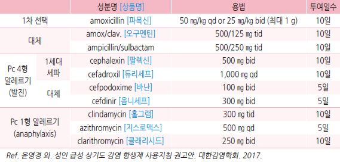
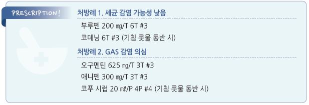

# 편도염 Tonsillitis


## 일반 사항

* 편도의 감염 또는 염증 상태
* 만성 : 3개월 이상 지속; 보통 항생제를 투여하면 증상이 호전되나 중단하면 곧 재발됨

### 편도 및 아데노이드

* 기능 : 림프 조직의 일부로서 호흡기 점막의 1차 방어 역할
*   4\~10세에 가장 활성, 사춘기 이후 활동 및 크기 감소

    •adenotonsillar hypertrophy는 3\~6세에 가장 크고, 8세 이후에 작아지기 시작
* 비대에 따른 증상 : 구강 호흡, 입마름, 인두 이물감, 코골이, 수면 장애, 이관 폐쇄, 중이염

## 원인

#### 급성

* 대부분 바이러스 감염에 의함; 세균 중에는 GABHS가 가장 흔함

#### 만성

*   감염

    •바이러스 : EBV, adenovirus

    •세균 : β-lactamase 생성 세균을 포함한 중복 균주 감염; Streptococcus , H. influenzae , Pepto-Streptococcus ,

    Fusobacterium
* 감염 외 : GERD, 알레르기, 천식

## 임상 양상

#### 급성 감염

* 구강 증상 : 편도 비대, 편도/인두 삼출물, 구개 점상 출혈, 입마름, 삼킴 통증
* 비-구강 증상 : 무기력, 발열, 오한, 두통, 근육통, 귀 통증, 경부 림프절병증(압통, 비대 ＞2 ㎝)
* 경과 : 보통 3\~4일 내 자연 호전되기 시작

#### 만성 감염

* 구강 증상 : 구취, 만성 인두염, 이물감, cryptic plug

> ✽cryptic plug : tonsillar crypt에 상피 세포, 림프구, 세균, 기타 찌꺼기가 축적되어 만들어진, 악취가 나는 작은 덩어리.

> ```
> 석회화하면 편도결석(tonsillolith)을 형성
> ```

*   편도 비대 : 감염이 있다고 항상 편도 비대가 나타나는 것은 아니며 만성 감염에서는 작아지기도함;

    편도의 크기만으로 감염 여부를 결정할 수 없음

## 진단

* 검사 : 신속 항원 검사, 배양 검사; 선택적으로 시행 (☞ p.291)

### 감별

#### 림프종(lymphoma)

* 임상 양상 : 편측 편도의 빠르게 진행하는 비대
* 동반 증상 : 야간 발한, 발열, 체중 감소, 림프절병증

***

## Management

### 치료 방침

* 대증 치료 (☞ p.284)
* 세균 감염 의심 시 항생제 치료

### 항생제

*   Streptococcus pyogenes (GABHS) 급성 인두편도염의 권고 항생제 용량 및 치료 기간

    
* 만성 편도염 : 포도알균 또는 혐기성 균이 β-lactamase를 생성하므로 세파계 또는 clindamycin이 보다 효과적
* tetracyclines, fluoroquinolones, sulfonamide는 GAS 편도염에 사용하지 않음

### 편도 절제

#### 효과

*   수면 장애를 유발하는 adenotonsillar hypertrophy가 있는 성장 부진 소아에서 아데노이드편도 절제술 시행 후 유의미한

    성장 증가가 이루어지는 경우가 있음
* 편도 및 아데노이드 절제 후 면역 저하는 관찰되지 않음

#### 한계

* 편도 절제 후 일시적으로 감염이 줄어드나 적절한 구강 위생 관리에 비하여 우월하지 않음
* 편도 절제 2년 후 중증 인두편도염 발생 빈도가 수술을 하지 않은 환자와 차이 없음

#### 편도절제술 적응증 [AAO-HNSF](../2019/)

*   편도염\*이 다음 빈도로 발생

    ① 최근 1년 동안 ≥7회, 또는 ② 최근 2년 동안 매년 ≥5회, 또는 ③ 최근 3년 동안 매년 ≥3회

> \*편도염 진단 기준 : 인후통 및 다음 중 하나 이상 해당

> ```
> ① 경부 림프절병증, ② 편도 삼출물, ③ GABHS 배양 검사(+), ④ ＞38.3℃
> ```

*   위 적응증에 해당되지 않더라도 다음의 경우에는 절제술 검토 : 다수 항생제에 대한 알레르기/불내성,

    PFAPA(periodic fever, aphthous stomatitis, pharyngitis, & adenitis), ≥2회 편도주위농양 병력; 성장 장애,

    저조한 학업 성취도, 야뇨, 천식, 행동 장애 등을 가진 폐쇄성 수면 호흡 장애 소아

### Tonsillar crypt 이물 제거

* 물리적 제거(면봉, water jet) 또는 질산은 소작

> **질병코드** J03 급성 편도염

J35.0 만성 편도염


