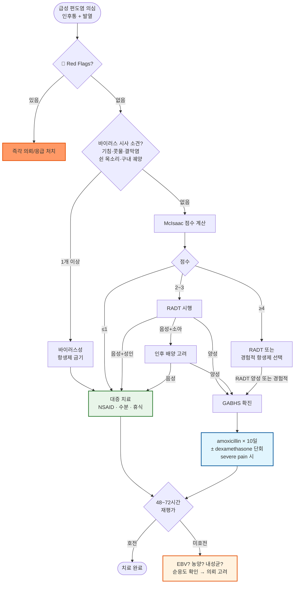

# 편도염 Tonsillitis

## <mark style="color:green;">일반 사항</mark>

* 편도(tonsil)의 감염 또는 염증 상태; 통상 구개 편도(palatine tonsil)를 지칭
* 분류
  * **급성** : 수일 내 발생; 보통 3\~4일 내 자연 호전
  * **재발성(recurrent)** : 급성 에피소드 반복; 편도 절제 적응증 평가 대상
  * **만성(chronic)** : 3개월 이상 지속적 저강도 염증; 구취·편도결석(tonsillolith) 중심

#### <mark style="color:$primary;">편도 및 아데노이드</mark>

* 기능 : 림프 조직의 일부로서 호흡기 점막의 1차 방어 역할
* 4\~10세에 가장 활성; 사춘기 이후 활동 및 크기 감소
  * Adenotonsillar hypertrophy : 3\~6세에 최대 → 8세 이후 자연 감소
* 비대에 따른 증상 : 구강 호흡, 입마름, 인두 이물감, 코골이, 수면 장애, 이관 폐쇄, 중이염

## <mark style="color:green;">원인</mark>

#### <mark style="color:$primary;">급성 편도염</mark>

* **바이러스** : 대부분 차지; adenovirus, rhinovirus, coronavirus, EBV 등
* **세균** : GABHS(GAS; *Group A β-hemolytic Streptococcus*, *S. pyogenes*)가 가장 중요
  * 급성 세균성 인두편도염의 약 15\~30% (소아) · 5\~15% (성인) 차지


⚠️ **EBV (전염성 단핵구증) 의심 시 amoxicillin · ampicillin 금기**

EBV 감염 환자에게 amoxicillin 또는 ampicillin을 투여하면 약 80%에서 전신성 반구진 발진(maculopapular rash)이 발생합니다. **삼출성 편도염 + 심한 피로 + 경부·전신 림프절병증** 조합이면 EBV를 먼저 배제하십시오.


#### <mark style="color:$primary;">만성 편도염</mark>

* **바이러스** : EBV, adenovirus
* **세균** : β-lactamase 생성 균주 포함 혼합 감염 — *Streptococcus*, *H. influenzae*, *Peptostreptococcus*, *Fusobacterium*
* **감염 외** : GERD, 알레르기, 천식

## <mark style="color:green;">임상 양상</mark>

#### <mark style="color:$primary;">급성 편도염</mark>

* **구강 증상** : 편도 비대, 삼출물(tonsillar exudate), 구개 점상 출혈, 삼킴 통증, 입마름
* **전신 증상** : 발열(>38℃), 오한, 무기력, 두통, 근육통
* **기타** : 귀 통증(방사통), 경부 림프절병증(압통·비대 >2 ㎝)
* **경과** : 보통 3\~4일 내 자연 호전; 세균성 미치료 시 1\~2주 지속 가능

#### <mark style="color:$primary;">만성/재발성 편도염</mark>

* **구강 증상** : 구취, 만성 인두염, 이물감, cryptic plug
  * **Cryptic plug** : tonsillar crypt에 상피 세포·림프구·세균·찌꺼기가 축적된 악취 덩어리; 석회화 시 편도결석(tonsillolith) 형성
* **편도 크기** : 만성에서 오히려 위축될 수 있음; 크기만으로 감염 여부 판단 불가

### <mark style="color:$danger;">🚩 Red Flags!</mark>

<mark style="color:$danger;">**즉각 조치 또는 의뢰**</mark>

* 개구 장애(trismus) 동반 → 편도주위농양(peritonsillar abscess) 의심; 즉시 이비인후과 의뢰
* 목소리 변화(hot potato voice) + 구개 편위 → 편도주위농양 강력 시사
* 호흡 곤란 또는 흡기성 협착음(stridor) → 후두 부종·심부경부감염 의심
* 과도한 침 흘림(drooling) + 삼킴 불능 → 후두개염·심부경부감염 감별 필요
* 경부 강직 + 발열 → 수막염 감별 필요
* **초기 인후통 후 일시적 호전 → 수일 뒤 고열 재발 + 경부 통증·종창** → Lemierre 증후군 의심 (*Fusobacterium necrophorum* 경정맥 혈전염·패혈성 폐색전 동반 가능; 주로 15\~24세 청년층)

<mark style="color:$warning;">**당일 또는 조기 의뢰**</mark>

* 일측성 편도 비대의 빠른 진행 → 림프종·편도 악성 종양 배제
* 항생제 치료에도 48\~72시간 내 호전 없는 심한 세균성 편도염
* 전신 증상 악화(탈수 위험, 고열 지속) → 정맥 수액·입원 치료 고려
* 소아에서 adenotonsillar hypertrophy로 인한 호흡 장애 또는 심각한 코골이

<mark style="color:$info;">**외래 추적 / 추가 평가 계획**</mark> <mark style="color:$info;">- 즉각 위험 낮으나 호전 없으면 의뢰</mark>

* 항생제 치료 완료 후에도 재발하는 반복성 편도염 → 편도 절제 적응증 평가
* 만성 편도결석 반복 재발로 생활 불편 → 이비인후과 의뢰
* GABHS 감염 후 관절통·흉통 발생 → 류마티스 열(rheumatic fever) 배제

## <mark style="color:green;">진단</mark>

### <mark style="color:orange;">1단계 : 바이러스 시사 소견 확인</mark>

아래 소견 중 하나 이상 있으면 GABHS 가능성 낮음 → **항생제 불필요; 대증 치료만 시행**

<table><thead><tr><th width="220">바이러스 시사 소견</th><th>임상 의의</th></tr></thead><tbody><tr><td>기침</td><td>GABHS 가능성 ↓ (McIsaac 기침 없음 항목의 근거)</td></tr><tr><td>콧물·비루</td><td>바이러스성 상기도 감염 시사</td></tr><tr><td>결막염</td><td>adenovirus 등 바이러스 패턴</td></tr><tr><td>쉰 목소리(애성)</td><td>후두 침범 → 세균성 편도염과 구분</td></tr><tr><td>구내 궤양·수포</td><td>herpes, herpangina 등 바이러스 감별</td></tr></tbody></table>

### <mark style="color:orange;">2단계 : McIsaac 점수 (GABHS 예측)</mark>

_바이러스 시사 소견이 없을 때 적용_

<table><thead><tr><th width="290">항목</th><th width="80">점수</th></tr></thead><tbody><tr><td>편도 삼출물 또는 부종</td><td>+1</td></tr><tr><td>전경부 림프절 압통/비대</td><td>+1</td></tr><tr><td>발열 (>38℃)</td><td>+1</td></tr><tr><td>기침 없음</td><td>+1</td></tr><tr><td>나이 3\~14세</td><td>+1</td></tr><tr><td>나이 15\~44세</td><td>0</td></tr><tr><td>나이 ≥45세</td><td>-1</td></tr></tbody></table>

<table><thead><tr><th width="80">점수</th><th width="150">GABHS 가능성</th><th width="230">성인 권장 처치</th><th>소아 권장 처치</th></tr></thead><tbody><tr><td>≤1</td><td>~2–5%</td><td>항생제 불필요; 대증 치료</td><td>항생제 불필요; 대증 치료</td></tr><tr><td>2–3</td><td>~11–28%</td><td>RADT 시행; 양성 시에만 항생제</td><td>RADT 시행; 음성 시 배양 고려</td></tr><tr><td>≥4</td><td>~51%</td><td>RADT 또는 경험적 항생제 (선택적)</td><td>RADT 시행; 음성 시 배양 고려</td></tr></tbody></table>


**고령자(≥45세) 주의** : McIsaac 점수에서 ≥45세는 -1점이나, 고령자·면역 저하자에서는 비전형적 세균 감염 가능성이 높습니다. 전신 상태가 불량하거나 발열·삼킴 장애가 심한 경우에는 점수와 무관하게 RADT를 적극 고려하십시오.



**"검사 기반 확진 후 처방" 원칙** : 성인에서 McIsaac 2\~3점은 RADT 확인 후 처방이 기본입니다. 경험적 항생제는 검사가 불가하거나 심한 삼킴 장애로 즉각 치료가 필요한 예외적 상황에서만 허용합니다.


### <mark style="color:orange;">검사</mark>

* **신속 항원 검사(RADT)** : 민감도 70\~90%, 특이도 95% 이상; 음성이어도 임상적 의심 높은 소아는 배양 추가 고려
* **인후 배양 검사** : GABHS 진단 표준; 결과 24\~48시간 소요
* **CBC** : 이형림프구(atypical lymphocyte) >10% → EBV 강력 시사
* **Monospot 검사 또는 EBV IgM** : EBV 전염성 단핵구증 의심 시

### <mark style="color:orange;">감별</mark>

#### <mark style="color:$primary;">림프종(Lymphoma)</mark>

* **임상 양상** : 일측성 편도의 빠르게 진행하는 비대; 궤양·출혈 동반 가능
* **동반 증상** : 야간 발한, 발열, 체중 감소, 전신 림프절병증

#### <mark style="color:$primary;">EBV 전염성 단핵구증</mark>

* **특징적 임상 양상** : 삼출성 편도염 + **심한 피로(임상 중증도에 비례 이상으로 과도)** + **후경부(posterior cervical) 림프절병증** + 비장비대
* **검사 소견** : 이형림프구 >10%, 간효소(AST/ALT) 이상, Monospot 양성; 발병 초기 Monospot 위음성 가능 → EBV IgM으로 확인
* **감별 포인트** : amoxicillin 투여 후 전신 발진 발생 → EBV 강력 시사
* **처치** : NSAID 대증 치료 중심; 중증 삼킴 장애 또는 기도 압박 시 steroid 단회 고려; amoxicillin/ampicillin 금기; 비장비대 시 **증상 발생 후 최소 3\~4주간** 접촉 스포츠·격렬한 신체 활동 금지 (비장 파열 예방)

#### <mark style="color:$primary;">편도주위농양(Peritonsillar Abscess)</mark>

* **임상 양상** : 편측 인후통 심화, trismus, hot potato voice, 구개 편위
* **처치** : 절개 배농 + 항생제 → 이비인후과 즉시 의뢰

***



<p align="center"><strong>급성 편도염 진단 및 치료 알고리듬</strong></p>

<p align="center"><em><mark style="color:$info;">Ref. McIsaac WJ et al. JAMA 2004;291:1587-1595. / IDSA Pharyngitis Guideline 2012. / NICE NG84 2018. / 윤영경 외. 대한감염학회. 2017.</mark></em></p>

***

## <mark style="background-color:$warning;">Management</mark>


**치료 원칙**

* 바이러스 시사 소견 확인 → 있으면 항생제 없이 대증 치료; 이 단계에서 70\~80% 종료
* GABHS 치료 시 **반드시 10일 전 과정 완료** (penicillin/amoxicillin 기준) — 류마티스 열 예방
* 심한 인후통·삼킴 장애에서 **dexamethasone 단회** 고려


### <mark style="color:orange;">치료 실패 평가 (48–72시간 재평가)</mark>

항생제 시작 48\~72시간 후에도 호전 없을 경우 다음을 순서대로 확인:

1. **복약 순응도** : 처방대로 복용 중인지 확인
2. **EBV 가능성** : 단핵구증 임상 양상 재검토; Monospot/EBV IgM 미시행이면 시행
3. **편도주위농양 발생** : 편측 편도 비대·구개 편위·trismus 발생 여부 확인
4. **내성균 또는 다른 균종** : 배양 결과 확인; 항생제 변경 또는 이비인후과 의뢰
5. **Lemierre 증후군** : 일시적 호전 후 고열 재발 + 경부 통증·종창 → 조영 증강 CT 긴급 시행 또는 즉시 전원

## <mark style="color:green;">비-약물 치료 및 예방</mark>

* **충분한 수분 섭취** : 연하 통증이 있어도 차가운 음료·아이스크림 등으로 수분 유지
* **충분한 휴식** : 특히 발열 기간 중 안정
* **소금물 가글** : 따뜻한 생리식염수 또는 소금물(물 1컵 + 소금 ¼ 티스푼)로 자주 가글
* **부드러운 음식** : 연하 통증 기간 중 죽·두부·요거트 등 자극이 적은 음식
* **금연** : 흡연은 편도 점막 손상 및 면역 기능 저하
* **격리** : GABHS 확인된 경우 항생제 복용 시작 후 **24시간까지** 전파 가능 → 등교·출근 자제

## <mark style="color:green;">약물 치료</mark>

### <mark style="color:orange;">대증 치료 (해열진통제)</mark>

* **NSAID** : 항염 효과로 편도 통증·부종에 더 효과적; 식후 복용 필수
  * ibuprofen <mark style="color:blue;">\[부루펜]</mark>, <mark style="color:blue;">\[애드빌]</mark> / naproxen <mark style="color:blue;">\[탁센]</mark>
* **acetaminophen** : 항염 효과 없으나 위장 장애·CKD·고령·임산부에서 NSAID 대체 선택
  * <mark style="color:blue;">\[타이레놀]</mark>

### <mark style="color:orange;">Corticosteroid (중증 통증·삼킴 장애 시)</mark>

* **dexamethasone** — 인후통 완화 및 회복 시간 단축 효과
  * 성인 : 10 ㎎ 단회 (PO 또는 IM)
  * 소아 : 0.6 ㎎/㎏ 단회 (최대 10 ㎎)
  * 반복 사용하지 않음; GABHS 확인 또는 고위험 시 항생제와 병용
  * EBV 단핵구증에서 심한 편도 비대로 기도 압박 위협 시에도 고려 가능

### <mark style="color:orange;">항생제</mark>

_<mark style="color:$info;">(Ref. 윤영경 외. 성인 급성 상기도 감염 항생제 사용지침 권고안. 대한감염학회. 2017)</mark>_


**GABHS에 amoxicillin이 1차 선택제인 이유** : GABHS는 β-lactamase를 생성하지 않으므로 amoxicillin 단독으로 완전 치료 가능; 협스펙트럼으로 장내 세균총 영향 최소화. 단순 급성 GABHS 편도염에서 amoxicillin/clavulanate는 불필요하게 광범위하여 사용하지 않음.


#### <mark style="color:$primary;">GABHS 급성 편도염 — 1차 선택</mark>

* amoxicillin 50 ㎎/㎏/day qd 또는 25 ㎎/㎏ bid (최대 1 g/day) × **10일** <mark style="color:blue;">\[파목신]</mark>
  * 성인 : amoxicillin 500 ㎎ bid 또는 1,000 ㎎ qd × 10일

#### <mark style="color:$primary;">GABHS 급성 편도염 — 대체</mark>

* ampicillin/sulbactam 500/250 ㎎ tid × 10일

#### <mark style="color:$primary;">페니실린 지연형 알레르기 (발진, Type IV)</mark>

* **1세대 세파 (1차)**
  * cephalexin 500 ㎎ bid × 10일 <mark style="color:blue;">\[팔렉신]</mark>
  * cefadroxil 1,000 ㎎ qd × 10일 <mark style="color:blue;">\[듀리세프]</mark>
* **대체 (단축 요법 가능)**
  * cefpodoxime 100 ㎎ bid × 5일 <mark style="color:blue;">\[바난]</mark>
  * cefdinir 300 ㎎ bid × 5일 <mark style="color:blue;">\[옴니세프]</mark>

#### <mark style="color:$primary;">페니실린 즉시형 알레르기 (아나필락시스, Type I)</mark>

* clindamycin 300 ㎎ tid × 10일 <mark style="color:blue;">\[훌그램]</mark>
* azithromycin 500 ㎎ qd × 5일 <mark style="color:blue;">\[지스로맥스]</mark>
* clarithromycin 250 ㎎ bid × 10일 <mark style="color:blue;">\[클래리시드]</mark>


⚠️ **macrolide 사용 주의** : 국내 GAS macrolide 내성률이 70% 이상으로 azithromycin·clarithromycin은 치료 실패 가능성이 높습니다. **페니실린 즉시형 알레르기 환자에게만** 제한 사용하고, 48\~72시간 내 치료 반응을 반드시 재평가하십시오.

**GAS 편도염에 사용하지 않는 항생제** : tetracyclines, fluoroquinolones, sulfonamide


#### <mark style="color:$primary;">만성/재발성 편도염</mark>

* β-lactamase 생성 균주(포도알균·혐기성균) 비중이 높으므로 β-lactamase 안정제 병합 또는 세파·clindamycin 사용
  * amoxicillin/clavulanate 625 ㎎ tid × 10일 <mark style="color:blue;">\[오구멘틴]</mark>
  * cefdinir 300 ㎎ bid × 10일 <mark style="color:blue;">\[옴니세프]</mark>
  * clindamycin 300 ㎎ tid × 10일 <mark style="color:blue;">\[훌그램]</mark>

## <mark style="color:green;">시술 및 기타 처치</mark>

### <mark style="color:orange;">Tonsillar Crypt 이물 제거</mark>

* **물리적 제거** : 면봉 또는 water jet으로 cryptic plug 제거; 반복 재발 시 이비인후과 의뢰
* **질산은 소작** : 반복되는 crypt 형성 시 시술 고려

## <mark style="color:green;">편도 절제</mark>

### <mark style="color:orange;">효과 및 한계</mark>

* 수면 장애 동반 adenotonsillar hypertrophy 소아에서 절제 후 유의한 성장 증가 보고
* 편도·아데노이드 절제 후 면역 저하는 관찰되지 않음
* 편도 절제 후 단기적 감염 감소; 그러나 **절제 2년 이후에는 수술하지 않은 군과 발생 빈도 차이 없음**
* 성인에서는 감염 빈도 외에 **삶의 질(인후통 반복, 직장 결근, 구취 등)** 도 절제 결정의 중요 요소

### <mark style="color:orange;">편도절제술 적응증</mark>

_<mark style="color:$info;">(Ref. Mitchell RB et al. Otolaryngol Head Neck Surg. 2019;160(1\_suppl):S1-S42. AAO-HNS Clinical Practice Guideline: Tonsillectomy in Children — Update 2019)</mark>_

**편도염\*이 다음 빈도로 발생한 경우**

1. 최근 1년 동안 ≥7회, 또는
2. 최근 2년 동안 매년 ≥5회, 또는
3. 최근 3년 동안 매년 ≥3회

**\*편도염 진단 기준 : 인후통 및 다음 중 하나 이상**

1. 경부 림프절병증
2. 편도 삼출물
3. GABHS 배양 검사 양성
4. 체온 >38.3℃

**위 적응증에 해당하지 않더라도 다음 경우에는 절제술 검토**

* 다수 항생제에 대한 알레르기/불내성
* PFAPA (periodic fever, aphthous stomatitis, pharyngitis, & adenitis)
* ≥2회 편도주위농양 병력 (성인의 경우 1회 후에도 개별 검토 가능)
* 성장 장애, 저조한 학업 성취도, 야뇨, 천식, 행동 장애 등을 동반한 폐쇄성 수면 호흡 장애 소아

***

### <mark style="color:red;">질병코드</mark>

J03 급성 편도염

J35.0 만성 편도염

***

## <mark style="color:purple;">처방례</mark>

> **처방례 1. 급성 편도염 — 바이러스성 (바이러스 시사 소견 있음 또는 McIsaac ≤1)**
>
> ```
> 이부프로펜 200 ㎎/T   3T   tid (식후)
> 코푸 시럽　　20 ㎖/P   4P   qid     (기침·콧물 동반 시)
> ```
>
> _✽ 항생제 불필요. 충분한 수분 섭취·휴식 지도. 3\~4일 내 자연 호전 기대._

> **처방례 2. GABHS 확진 (RADT 양성 또는 McIsaac ≥4) — 성인, 페니실린 알레르기 없음**
>
> ```
> 파목신 500 ㎎/T　　1T   bid   × 10일
> 이부프로펜 200 ㎎/T   3T   tid (식후)
> ```
>
> _✽ 반드시 10일 전 과정 완료 (증상 호전 후에도 중단 금지; 류마티스 열 예방). 복용 시작 48\~72시간 내 호전 없으면 재진._

> **처방례 3. GABHS — 인후통·삼킴 장애 심한 경우 (steroid 추가)**
>
> ```
> 파목신 500 ㎎/T　　　　　1T   bid   × 10일
> 이부프로펜 200 ㎎/T　　   3T   tid (식후)
> 덱사메타손 0.5 ㎎/T　　   20T  단회 (식후, 또는 IM 가능)
> ```
>
> _✽ dexamethasone은 단회만 투여. 인후통·발열의 빠른 완화 목적. EBV 단핵구증에서 기도 압박 위협 시에도 고려 가능._

> **처방례 4. GABHS — 페니실린 지연형 알레르기 (발진) 환자**
>
> ```
> 팔렉신 500 ㎎/T　　　1T   bid   × 10일
> 이부프로펜 200 ㎎/T   3T   tid (식후)
> ```
>
> _✽ cefadroxil 1 g qd × 10일로 대체 가능._

> **처방례 5. 만성/재발성 편도염 (β-lactamase 생성 혼합 균주)**
>
> ```
> 오구멘틴 625 ㎎/T   1T   tid (식후)   × 10일
> 이부프로펜 200 ㎎/T   3T   tid (식후)
> ```
>
> _✽ 만성·재발성에서는 β-lactamase 생성 혼합균 비율이 높음. 반복 재발 시 편도 절제 적응증 평가._

***

### <mark style="color:$success;">핵심 복약 지도</mark>

> **항생제 — 왜 10일을 모두 복용해야 하나요?**
>
> 1. 증상이 2\~3일 만에 나아져도 **처방받은 10일 전 과정을 반드시 완료**하십시오.
> 2. 중간에 끊으면 세균이 완전히 제거되지 않아 재발하거나, 드물게 류마티스 열(심장 판막 손상)이 발생할 수 있습니다.
> 3. 복용 중 피부 발진·두드러기·호흡 곤란이 생기면 **즉시 중단하고 내원**하십시오.
>
> ※ 세팔로스포린 일부와 azithromycin은 5일 단축 요법이 가능하나, **류마티스 열 예방 목적으로는 10일 요법이 가장 확립된 근거**를 가집니다.

> **해열진통제 복용법**
>
> 1. 이부프로펜·나프록센은 반드시 **식후**에 복용하십시오 (공복 시 위장 장애 위험).
> 2. 이부프로펜은 4\~6시간, 나프록센은 8\~12시간 간격을 지키십시오.
> 3. 위장 장애·신장 기능 저하·고령·임신 중이면 처방 전 반드시 알려주십시오 → 아세트아미노펜(타이레놀)으로 대체 가능합니다.

> **GABHS 감염자의 격리**
>
> 1. 항생제 복용 시작 후 **24시간까지** 다른 사람에게 전파될 수 있습니다.
> 2. 첫 24시간은 학교·직장 출석을 삼가십시오.
> 3. 손 씻기·기침 예절을 철저히 지키십시오.

> **언제 다시 병원을 방문해야 하나요?**
>
> * 항생제 시작 48\~72시간 후에도 발열·인후통이 호전되지 않는 경우
> * **입을 벌리기 어렵거나** 목소리가 이상해진 경우 → 즉시 내원
> * **호흡이 힘들거나** 숨소리가 이상한 경우 → 즉시 내원
> * 항생제 복용 후 전신에 발진이 생긴 경우 → 즉시 내원
> * 목이 아프다가 나아졌다 싶었는데 **며칠 뒤 고열과 목 통증이 다시 심해진** 경우 → 즉시 내원

***

### <mark style="color:blue;">환자 안내서</mark>


**편도염, 대부분은 항생제 없이도 낫습니다**

편도염의 80% 이상은 바이러스 감염으로, 충분한 수분 섭취와 휴식만으로 1주일 내에 대부분 회복됩니다. 세균(용련균, GAS) 감염이 확인된 경우에만 항생제가 필요합니다.


#### <mark style="color:$primary;">편도염이란 무엇인가요?</mark>

편도는 목 안쪽 양측에 위치한 림프 조직으로, 외부 세균과 바이러스를 막는 1차 방어 역할을 합니다. 편도염은 이 편도에 감염·염증이 발생한 상태입니다. 목이 아프고, 열이 나며, 편도가 붓거나 흰 삼출물이 맺힐 수 있습니다.

#### <mark style="color:$primary;">어떻게 관리하나요?</mark>

* **충분한 수분 섭취**가 가장 중요합니다. 차가운 음료나 아이스크림도 도움이 됩니다.
* **충분히 쉬십시오.** 특히 열이 있는 동안에는 안정이 중요합니다.
* 따뜻한 소금물(물 1컵 + 소금 ¼ 티스푼)로 자주 **가글**하면 증상이 완화됩니다.
* 삼키기 어려울 경우 죽·두부·요거트 등 **부드러운 음식**을 드십시오.
* **담배를 피우지 마십시오.** 흡연은 회복을 늦추고 재발 위험을 높입니다.

#### <mark style="color:$primary;">항생제가 꼭 필요한가요?</mark>

대부분의 편도염은 바이러스성이므로 항생제가 효과 없습니다. **세균(용련균) 감염이 확인된 경우에만** 항생제를 사용합니다. 항생제가 처방된 경우, 증상이 나아져도 **반드시 10일 전 과정을 복용**하십시오. 일찍 끊으면 류마티스 열(심장 합병증)이 발생할 수 있습니다.

#### <mark style="color:$primary;">이럴 때는 즉시 병원을 방문하세요</mark>

* **입이 잘 벌어지지 않거나** 목소리가 이상해진 경우
* **숨쉬기가 힘들거나** 숨소리가 이상한 경우
* 침을 삼키지 못하고 흘릴 정도로 심한 경우
* 항생제 복용 후 **전신에 발진**이 생긴 경우
* 목의 한쪽이 **갑자기 심하게 부어오른** 경우
* **목이 아프다가 나아진 후 며칠 뒤 고열과 목 통증이 다시 심해진** 경우
