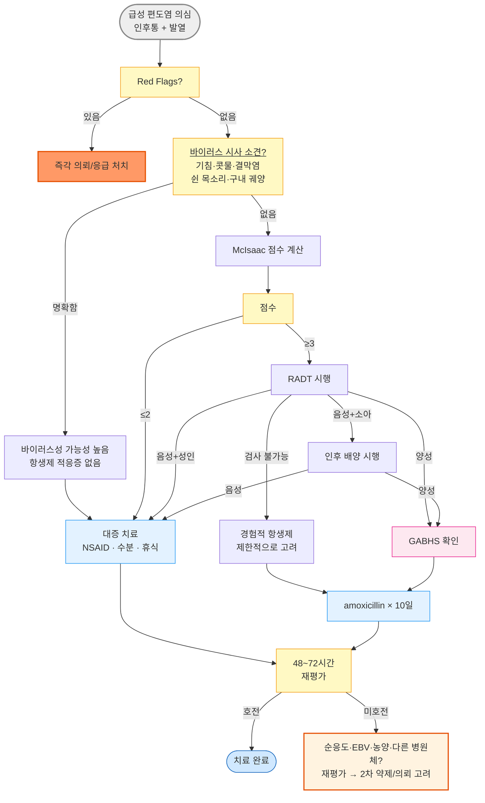

# 편도염 Tonsillitis

## <mark style="color:green;">일반 사항</mark>

* 편도(tonsil)의 감염 또는 염증 상태; 통상 구개 편도(palatine tonsil)를 지칭

#### <mark style="color:$primary;">분류</mark>

* 급성 : 수일 내 발생; 일부는 3\~4일 내 뚜렷하게 호전하며 대부분 1주 이내 자연 호전
* 재발성(recurrent) : 급성 에피소드 반복; 편도 절제 적응증 평가 대상
* 만성(chronic) : 지속적인 인두 불편감·구취·편도와(tonsillar crypt)의 찌꺼기 또는 편도결석 등이 반복되는 상태를 임상적으로 지칭; 보편적으로 합의된 기간·진단 기준은 없음

#### <mark style="color:$primary;">편도 및 아데노이드</mark>

* 기능 : 림프 조직의 일부로서 호흡기 점막의 1차 방어 역할
* 4\~10세에 가장 활성; 사춘기 이후 활동 및 크기 감소
  * Adenotonsillar hypertrophy : 3\~6세에 최대, 8세 이후 자연 감소
* 비대에 따른 증상 : 구강 호흡, 입마름, 인두 이물감, 코골이, 수면 장애, 이관 폐쇄, 중이염

## <mark style="color:green;">원인</mark>

#### <mark style="color:$primary;">급성 편도염</mark>

* 바이러스 : 대부분 차지; adenovirus, rhinovirus, coronavirus(SARS-CoV-2 포함), influenza virus, EBV 등
* 세균 : GABHS(GAS; _Group A β-hemolytic Streptococcus_, _S. pyogenes_)가 가장 중요
  * 급성 세균성 인두편도염의 약 15\~30% (소아) · 5\~15% (성인) 차지

#### <mark style="color:$primary;">만성 편도염</mark>

* 재발성 급성 편도염에서는 GAS 재감염, 치료 순응도, 보균 상태에서의 바이러스 감염, 편도와 내 biofilm 등을 고려
* 만성 인두 증상은 GERD/인후두역류, 후비루·알레르기, 흡연·건조 등 비감염성 원인이 편도염처럼 나타날 수 있으므로 감별 필요
* 편도결석은 편도와에 세포·세균·음식물 찌꺼기 등이 축적·석회화된 것으로, 그 자체가 항생제 적응증은 아님

## <mark style="color:green;">임상 양상</mark>

#### <mark style="color:$primary;">급성 편도염</mark>

* 구강 증상 : 편도 비대, 삼출물(tonsillar exudate), 구개 점상 출혈, 삼킴 통증, 입마름
* 전신 증상 : 발열(＞38℃), 오한, 무기력, 두통, 근육통
* 기타 : 귀 통증(방사통), 압통을 동반한 전경부 림프절병증
* 경과 : 일부는 3\~4일 내 뚜렷하게 호전하며 대부분 1주 이내 자연 호전; 원인과 무관하게 자연 호전할 수 있으므로 임상 경과만으로 세균성 여부를 판단하지 않음

#### <mark style="color:$primary;">만성/재발성 편도염</mark>

* 구강 증상 : 구취, 만성 인두염, 이물감, cryptic plug
  * Cryptic plug : tonsillar crypt에 상피 세포·림프구·세균·찌꺼기가 축적된 악취 덩어리; 석회화 시 편도결석(tonsillolith) 형성
* 편도 크기 : 만성에서 오히려 위축될 수 있음; 크기만으로 감염 여부 판단 불가

### <mark style="color:$danger;">🚩 Red Flags!</mark>

<mark style="color:$danger;">**즉각 조치 또는 의뢰**</mark>

* 개구 장애(trismus) 동반 → 편도주위농양(peritonsillar abscess)
* 목소리 변화(hot potato voice) + 구개 편위 → 편도주위농양
* 호흡 곤란 또는 흡기성 협착음(stridor) → 후두 부종·심부경부감염
* 과도한 침 흘림(drooling) + 삼킴 불능 → 후두개염·심부경부감염
* 경부 강직 + 발열 → 수막염
* 초기 인후통 후 일시적 호전 → 수일 뒤 고열 재발 + 경부 통증·종창 → Lemierre 증후군

<mark style="color:$warning;">**당일 또는 조기 의뢰**</mark>

* 빠르게 진행하는 일측성 편도 비대, 궤양·출혈, 경부 종괴, 체중 감소 또는 지속적 편측 귀 방사통 → 림프종·편도 악성 종양
* 항생제 치료에도 48\~72시간 내 호전 없는 심한 세균성 편도염
* 전신 증상 악화(탈수 위험, 고열 지속)
* GABHS 감염 후 수 주 이내 이동성 다발관절염, 흉통·호흡곤란·두근거림, 무도병 또는 특징적 발진 → 급성 류마티스열 평가

<mark style="color:$info;">**외래 추적 / 추가 평가 계획**</mark> <mark style="color:$info;">- 즉각 위험 낮으나 호전 없으면 의뢰</mark>

* 항생제 치료 완료 후에도 재발하는 반복성 편도염
* 반복되는 증상성 편도결석으로 생활에 불편이 있는 경우
* 소아에서 편도·아데노이드 비대와 코골이, 구강 호흡, 목격된 수면 무호흡 또는 성장·학업·행동 문제가 동반된 경우 → 이비인후과/수면 평가 계획

## <mark style="color:green;">진단</mark>

#### <mark style="color:$primary;">1단계 : 바이러스 시사 소견 확인</mark>

* 아래와 같은 명확한 바이러스 시사 소견이 있으면 GABHS 가능성이 낮음 → 특별한 고위험 요인이 없으면 GAS 검사를 시행하지 않고 항생제 없이 대증 치료

<table><thead><tr><th width="163.5294189453125">바이러스 시사 소견</th><th width="409.1763916015625">임상 의의</th></tr></thead><tbody><tr><td>기침</td><td>GABHS 가능성 ↓</td></tr><tr><td>콧물·비루</td><td>바이러스성 상기도 감염 시사</td></tr><tr><td>결막염</td><td>adenovirus 등 바이러스 패턴</td></tr><tr><td>쉰 목소리(애성)</td><td>후두 침범 → 세균성 편도염과 구분</td></tr><tr><td>구내 궤양·수포</td><td>herpes, herpangina 등 바이러스 감별</td></tr></tbody></table>

#### <mark style="color:$primary;">2단계 : McIsaac 점수 (GABHS 예측)</mark>

* 바이러스 시사 소견이 없을 때 적용

<table><thead><tr><th width="290">항목</th><th width="80">점수</th></tr></thead><tbody><tr><td>편도 삼출물 또는 부종</td><td>+1</td></tr><tr><td>전경부 림프절 압통/비대</td><td>+1</td></tr><tr><td>발열 (＞38℃)</td><td>+1</td></tr><tr><td>기침 없음</td><td>+1</td></tr><tr><td>나이 3~14세</td><td>+1</td></tr><tr><td>나이 15~44세</td><td>0</td></tr><tr><td>나이 ≥45세</td><td>-1</td></tr></tbody></table>

<table><thead><tr><th width="80">점수</th><th width="124.11767578125">GABHS 가능성</th><th width="262.941162109375">성인 권장 처치</th><th width="277.4117431640625">소아 권장 처치</th></tr></thead><tbody><tr><td>≤1</td><td>~2–5%</td><td>검사·항생제 불필요; 대증 치료</td><td>검사·항생제 불필요; 대증 치료</td></tr><tr><td>2</td><td>~11–17%</td><td>통상 검사·항생제 불필요; 유행·밀접 접촉, 류마티스열 병력 등 고위험 요인이 있으면 검사 고려</td><td>개별 위험도에 따라 검사 고려</td></tr><tr><td>≥3</td><td>~28–53%</td><td>RADT 시행; 양성 시 항생제. RADT가 불가능할 때만 경험적 항생제 고려</td><td>RADT 시행; 음성이면 인후 배양으로 확인</td></tr></tbody></table>

* 고위험군 주의 : McIsaac 점수는 검사를 생략할 수 있는 저위험군 선별에 유용하지만 절대 기준은 아님. GAS 밀접 접촉, 류마티스열 병력, 면역 저하 또는 국소·전신 합병증 의심 시 점수와 무관하게 검사·추가 평가 고려

### <mark style="color:orange;">검사</mark>

* 신속 항원 검사(RADT) : 민감도는 검사법에 따라 약 70\~90%, 특이도 95% 이상; 3세 이상 소아·청소년에서 음성이면 인후 배양으로 확인하고, 성인은 음성 후 배양을 routine으로 시행하지 않음
* 인후 배양 검사 : GABHS 진단 표준; 결과 24\~48시간 소요
* CBC : 이형림프구(atypical lymphocyte) ＞10% → EBV 강력 시사
* EBV 검사 : CBC와 heterophile antibody(Monospot)를 초기 검사로 사용할 수 있으나 발병 첫 주와 소아에서 위음성 가능; 비전형적이거나 확진이 중요하면 EBV VCA IgM·VCA IgG·EBNA 항체 조합으로 판정

### <mark style="color:orange;">감별</mark>

#### <mark style="color:$primary;">림프종(Lymphoma)</mark>

* 임상 양상 : 일측성 편도의 빠르게 진행하는 비대; 궤양·출혈 동반 가능
* 동반 증상 : 야간 발한, 발열, 체중 감소, 전신 림프절병증

#### <mark style="color:$primary;">EBV 전염성 단핵구증</mark>

* 특징적 임상 양상 : 삼출성 편도염 + 심한 피로(임상 중증도에 비례 이상으로 과도) + 후경부(posterior cervical) 림프절병증 + 비장비대
* 검사 소견 : 이형림프구 ＞10%, 간효소(AST/ALT) 이상, Monospot 양성; 발병 초기 또는 소아에서는 Monospot 위음성 가능 → EBV 특이항체(VCA IgM·VCA IgG·EBNA)로 확인
* 감별 포인트 : amoxicillin/ampicillin 투여 후 반구진 발진이 나타날 수 있으나 발생률은 과거 알려진 80\~100%보다 낮고 연구마다 차이가 큼; 발진만으로 EBV를 확진하거나 영구적인 penicillin 알레르기로 단정하지 않음
* 처치 : 해열진통제와 수분 공급 중심; uncomplicated EBV 감염에는 steroid를 사용하지 않으며 기도 폐쇄 위험 등 중증 합병증에서만 고려. 불필요한 amoxicillin/ampicillin 투여를 피하되 세균 동시 감염이 확인되면 별도 판단
* 운동 : 비장비대 촉진 여부와 관계없이 증상 시작 후 최소 3주간 운동을 피함. 이후 임상적으로 회복되고 발열이 없으면 가벼운 비접촉 운동부터 단계적으로 재개하며, 접촉 스포츠는 비장 파열 위험을 설명하고 개별 결정

#### <mark style="color:$primary;">편도주위농양(Peritonsillar Abscess)</mark>

* 임상 양상 : 편측 인후통 심화, trismus, hot potato voice, 구개 편위
* 처치 : 기도 평가, 배농(바늘 흡인 또는 절개 배농) 및 항생제 → 이비인후과 즉시 의뢰

#### <mark style="color:$primary;">기타 중요 감별</mark>

* 디프테리아 : 예방접종 미완료·유행 지역 여행력, 제거 시 출혈하는 회백색 위막 → 즉시 격리·신고 및 항독소/항생제 치료 평가
* 성홍열 : GAS 인두편도염 + 사포 같은 발진, 딸기혀
* 급성 HIV 감염·임균성 인두염 : 성 노출력과 전신 발진·점막 병변 등을 확인하여 위험에 따라 검사
* 후두개염·후인두농양 : 침 흘림, 삼킴 불능, 경부 강직·신전 제한, 독성 병색 또는 호흡곤란
* _Fusobacterium necrophorum_ 감염 : 청소년·젊은 성인에서 악화하거나 재발하는 인후통, 고열, 편측 경부 통증·종창 시 Lemierre 증후군 고려

***


```mermaid
graph TD
    A([급성 편도염 의심<br/>인후통 + 발열]) --> B[Red Flags?]
    B -- 있음 --> C[즉각 의뢰/응급 처치]
    B -- 없음 --> D[<u>바이러스 시사 소견?</u><br/>기침·콧물·결막염<br/>쉰 목소리·구내 궤양]
    D -- 명확함 --> E[바이러스성 가능성 높음<br/>항생제 적응증 없음]
    D -- 없음 --> F[McIsaac 점수 계산]
    E --> G[대증 치료<br/>NSAID · 수분 · 휴식]
    F --> H[점수]
    H -- ≤2 --> G
    H -- ≥3 --> I[RADT 시행]
    I -- 양성 --> K[GABHS 확인]
    I -- 음성+소아 --> L[인후 배양 시행]
    I -- 음성+성인 --> G
    L -- 양성 --> K
    L -- 음성 --> G
    I -- 검사 불가능 --> J[경험적 항생제<br/>제한적으로 고려]
    J --> M
    K --> M[amoxicillin × 10일]
    G --> N[48~72시간<br/>재평가]
    M --> N
    N -- 호전 --> O([치료 완료])
    N -- 미호전 --> P[순응도·EBV·농양·다른 병원체?<br/>재평가 → 2차 약제/의뢰 고려]

style A fill:#eeeeee,stroke:#888888,stroke-width:2px
classDef yellow fill:#fff9c4,stroke:#f39c12
class B,D,H,N yellow
classDef sky fill:#e3f2ff,stroke:#2196f3
class G,M sky
style K fill:#fde8f0,stroke:#e91e8c
        style C fill:#f96,stroke:#e65100,stroke-width:2px
    style P fill:#fff3e0,stroke:#e65100,stroke-width:2px
    style O fill:#d0e8ff,stroke:#1a6abf
```

<p align="center"><strong>급성 편도염 진단 및 치료 알고리듬</strong></p>

***

## <mark style="background-color:$warning;">Management</mark>

### <mark style="color:orange;">치료 원칙</mark>

* 명확한 바이러스 시사 소견이 있으면 특별한 고위험 요인이 없는 한 검사·항생제 없이 대증 치료
* GABHS가 확인되면 항생제 종류별 권장 기간을 완료; penicillin/amoxicillin은 10일 요법이 표준
* Dexamethasone은 routine으로 사용하지 않음. 진통제로 조절되지 않는 매우 심한 인후통에서 심부경부감염·농양·기도 위험을 배제한 후 제한적인 이득과 위험을 설명하고 단회 투여를 선택적으로 고려

#### <mark style="color:$primary;">치료 실패 평가 (48–72시간 재평가)</mark>

* 항생제 시작 48\~72시간 후에도 호전 없을 경우 다음을 순서대로 확인

1. 복약 순응도 : 처방대로 복용 중인지 확인
2. EBV 가능성 : 단핵구증 임상 양상 재검토; 필요 시 Monospot 또는 EBV 특이항체(VCA IgM·VCA IgG·EBNA) 시행
3. 편도주위농양 발생 : 편측 편도 비대·구개 편위·trismus 발생 여부 확인
4. 다른 병원체·재감염·GAS 보균 가능성 : 배양 결과와 임상 양상 확인; 필요 시 2차 항생제 또는 이비인후과 의뢰. GAS의 penicillin 내성은 보고되지 않았으므로 단순히 내성으로 간주하지 않음
5. Lemierre 증후군 : 일시적 호전 후 고열 재발 + 경부 통증·종창 → 조영 증강 CT 긴급 시행 또는 즉시 전원

## <mark style="color:green;">비-약물 치료 및 예방</mark>

* 충분한 수분 섭취 : 연하 통증이 있어도 차가운 음료·아이스크림 등으로 수분 유지
* 충분한 휴식 : 특히 발열 기간 중 안정
* 소금물 가글 : 따뜻한 생리식염수 또는 소금물(물 1컵 + 소금 ¼ 티스푼)로 자주 가글
* 부드러운 음식 : 연하 통증 기간 중 죽·두부·요거트 등 자극이 적은 음식
* 금연 : 흡연은 편도 점막 손상 및 면역 기능 저하
* 격리 : GABHS 확인 시 적절한 항생제 시작 후 최소 12\~24시간이 지나고 발열이 없어질 때까지 등교·출근 자제

## <mark style="color:green;">약물 치료</mark>

### <mark style="color:orange;">대증 치료</mark>&#x20;

#### <mark style="color:$primary;">해열진통제</mark>

**NSAID**&#x20;

* 통증·발열 완화에 효과적; 최소 유효용량을 최단기간 사용하고 위장 불편이 있으면 음식과 함께 복용
* 탈수·섭취 불량, 소화성 궤양, 신기능 저하, 항응고제 복용 또는 임신 후기에는 사용을 피하거나 신중히 판단
* ibuprofen <mark style="color:blue;">\[부루펜]</mark>&#x20;
  * 성인 : 200\~400 ㎎ q6\~8hr 필요 시 복용 <mark style="color:blue;">\[부루펜]</mark>
  * 소아 : 5\~10 ㎎/㎏ q6\~8hr, 최대 40 ㎎/㎏/d; ≥6개월 연령 허가
    * <mark style="color:blue;">\[부루펜 시럽]</mark>(20 ㎎/㎖. 0.25\~0.5 ㎖/㎏ tid\~qid 또는 1.5 ㎖/㎏/d #3\~4)
* naproxen sodium : 275 ㎎ tid 또는 550 ㎎ bid <mark style="color:blue;">\[아나프록스 275 ㎎]</mark> (보험 주의)

**Acetaminophen**

* 항염 효과 없으나 위장 장애·CKD·고령·임산부에서 NSAID 대체 선택
* 성인 : 650\~1,000 ㎎ q4\~6hr; 최대 4 g/d이나 일반적으로 3 g/d 이하 권장. 만성 간질환, 과량 음주, 영양불량·저체중에서는 2 g/d 이하 등 개별 조정 <mark style="color:blue;">\[타이레놀]</mark>
  * 서방형 : 650 ㎎ × (1\~)2정 q8hr; 최대 6정/d(3,900 ㎎) <mark style="color:blue;">\[타이레놀 8시간 이알 서방정]</mark>; 씹거나 쪼개지 말고 그대로 삼킬 것
* 소아 : 10\~15 ㎎/㎏ q4\~6hr, 최대 5회/d; 아래 세토펜 현탁액 허가 용량표는 생후 4개월부터 제시됨
  * <mark style="color:blue;">\[세토펜 현탁액]</mark>(32 ㎎/㎖. 0.4 ㎖/㎏ qid 또는 1.5\~2 ㎖/㎏/d #4)

#### <mark style="color:$primary;">Corticosteroid (routine 사용하지 않음)</mark>

**Dexamethasone**&#x20;

* 표준 해열진통제에 비해 추가 이득은 제한적이며 지침별 권고가 일치하지 않음; routine으로 처방하지 않음
* 진통제로 조절되지 않는 매우 심한 인후통에서 농양·심부경부감염·기도 위험을 배제한 후 단회 투여를 선택적으로 고려
  * 성인 : 10 ㎎ 단회 (PO 또는 IM)
  * 소아 : 0.6 ㎎/㎏ 단회 (최대 10 ㎎)
  * 반복 사용하지 않음; 당뇨병, 면역 저하, 활동성 소화성 궤양 등에서는 위험·이득을 신중히 평가
  * EBV 단핵구증에서는 uncomplicated disease에 사용하지 않으며, 심한 편도 비대로 기도 압박이 우려되는 경우에만 고려

### <mark style="color:orange;">항생제</mark>

　　_<mark style="color:$info;">(Ref. 질병관리청·대한항균요법학회. 2025 급성 상기도 감염 항생제 사용 지침)</mark>_

* GABHS에 amoxicillin이 1차 선택제인 이유 : GABHS는 β-lactamase를 생성하지 않으므로 amoxicillin 단독으로 완전 치료 가능; 협스펙트럼으로 장내 세균총 영향 최소화. 단순 급성 GABHS 편도염에서 amoxicillin/clavulanate는 불필요하게 광범위하여 사용하지 않음
* EBV (전염성 단핵구증) 의심 시 불필요한 amoxicillin·ampicillin 투여를 피함 : 반구진 발진이 나타날 수 있으나 발생률은 과거 알려진 80\~100%보다 낮고 연구마다 차이가 큼. 발진은 EBV 확진 소견이나 영구적인 penicillin 알레르기의 증거가 아님
* '검사 기반 처방' 원칙 : 성인에서 McIsaac ≥3점은 RADT를 시행하여 양성이면 처방. 경험적 항생제는 McIsaac ≥3점이면서 RADT 시행이 불가능한 경우에만 제한적으로 고려

#### <mark style="color:$primary;">GABHS 급성 편도염</mark>&#x20;

**1차 선택**

* amoxicillin 50 ㎎/㎏/day qd 또는 25 ㎎/㎏ bid (최대 1 g/day) × 10일 <mark style="color:blue;">\[파목신]</mark>
  * 성인 : amoxicillin 500 ㎎ bid 또는 1,000 ㎎ qd × 10일

#### <mark style="color:$primary;">페니실린 지연형 알레르기 (발진, Type IV)</mark>

**1세대 세파** (1차)

* cephalexin 500 ㎎ bid × 10일 <mark style="color:blue;">\[팔렉신]</mark>
* cefadroxil 1,000 ㎎ qd × 10일 <mark style="color:blue;">\[듀리세프]</mark>

#### <mark style="color:$primary;">페니실린 즉시형 알레르기 (아나필락시스, Type I)</mark>

* clindamycin 300 ㎎ tid × 10일 <mark style="color:blue;">\[훌그램]</mark>
* azithromycin 500 ㎎ qd × 5일 <mark style="color:blue;">\[지스로맥스]</mark>
* clarithromycin 250 ㎎ bid × 10일 <mark style="color:blue;">\[클래리시드]</mark>


**macrolide 사용 주의** : 국내 GAS macrolide 내성률은 40\~50%까지 높게 보고되어 azithromycin·clarithromycin은 치료 실패 가능성이 있음. 페니실린 즉시형 알레르기 등 β-lactam을 사용할 수 없는 환자에게 제한하고, 48\~72시간 내 치료 반응을 반드시 재평가

**GAS 편도염에 사용하지 않는 항생제** : tetracyclines, fluoroquinolones, sulfonamide


#### <mark style="color:$primary;">치료 실패·재발성 세균성 편도염</mark>

* 만성 인두 불편감·편도결석만으로 항생제를 처방하지 않음. 재발한 각 급성 에피소드에서 바이러스 감염, GAS 재감염·보균 및 다른 병원체 여부를 재평가
* 적절한 1차 치료와 순응도에도 48\~72시간 내 호전이 없고 농양 등 합병증을 배제한 경우 배양 결과·최근 항생제 사용을 고려하여 다음 2차 약제를 선택
  * amoxicillin/clavulanate 625 ㎎ tid × 10일 <mark style="color:blue;">\[오구멘틴]</mark>
  * cephalexin 또는 cefadroxil 등 1세대 cephalosporin(비즉시형 penicillin 알레르기에서 사용)
  * cefpodoxime 또는 cefdinir 등 경구 cephalosporin - 제품별 허가 용법·치료 기간 확인
  * clindamycin 300 ㎎ tid × 10일 <mark style="color:blue;">\[훌그램]</mark> - 감수성·_C. difficile_ 감염 위험 고려

## <mark style="color:green;">시술 및 기타 처치</mark>

### <mark style="color:orange;">편도결석 관리</mark>

* 편도결석은 대부분 경과 관찰; 구강 위생, 충분한 수분 섭취, 소금물 가글로 관리
* 면봉·날카로운 기구 또는 강한 water jet을 이용한 공격적인 자가 제거는 출혈·점막 손상·흡인 위험이 있어 피함
* 크거나 깊이 박혀 있거나 통증·연하곤란·구취가 지속되는 경우 이비인후과에서 제거 또는 cryptolysis/편도절제술을 개별 검토; 질산은 소작을 routine으로 권고할 근거는 부족

### <mark style="color:orange;">편도 절제</mark>

#### <mark style="color:$primary;">효과 및 한계</mark>

* 수면 장애 동반 adenotonsillar hypertrophy 소아에서 절제 후 유의한 성장 증가 보고
* 편도·아데노이드 절제 후 면역 저하는 관찰되지 않음
* 소아에서는 자연 경과로 에피소드가 감소할 수 있어 수술의 절대적 이득이 제한될 수 있음; 빈도 기준 미달 시 watchful waiting 권고
* 적응증을 충족한 성인 재발성 급성 편도염에서는 NATTINA 연구에서 편도절제술이 보존 치료보다 24개월 동안 인후통 부담을 줄이고 비용 효과적인 것으로 보고됨
* 감염 빈도 외에 삶의 질, 등교·직장 결근, 수술 후 약 2주간의 심한 통증과 출혈·재입원 위험을 함께 고려하여 공동 의사결정

　_<mark style="color:$info;">(Ref. Wilson JA et al. Lancet. 2023;401:2051-2059. NATTINA trial; Evidence-Based Interventions. Tonsillectomy for recurrent tonsillitis. Reviewed 2024)</mark>_

#### <mark style="color:$primary;">편도절제술 적응증</mark>

　_<mark style="color:$info;">(Ref. Mitchell RB et al. Otolaryngol Head Neck Surg. 2019;160(1\_suppl):S1-S42. AAO-HNS Clinical Practice Guideline: Tonsillectomy in Children - Update 2019)</mark>_

**의무기록으로 확인된 임상적으로 유의하고 적절히 치료된 급성 편도염이 일상생활·등교·근무를 방해하면서 다음 빈도로 발생한 경우**

1. 최근 1년 동안 ≥7회, 또는
2. 최근 2년 동안 매년 ≥5회, 또는
3. 최근 3년 동안 매년 ≥3회

* 각 에피소드 기록 기준 : 인후통 및 다음 중 하나 이상; ⓵ 경부 림프절병증, ⓶ 편도 삼출물, ⓷ GABHS 검사 양성, ⓸ 체온 ＞38.3℃

**위 적응증에 해당하지 않더라도 다음 경우에는 절제술 검토**

* 다수 항생제에 대한 알레르기/불내성
* PFAPA (periodic fever, aphthous stomatitis, pharyngitis, & adenitis)
* ≥2회 편도주위농양 병력 (성인의 경우 1회 후에도 개별 검토 가능)
* 편도비대와 폐쇄성 수면 호흡 장애가 있는 소아에서 성장 장애, 저조한 학업 성취도, 야뇨, 천식, 행동 장애 등이 동반된 경우
  * 2세 미만 또는 비만, Down 증후군, 두개안면 이상, 신경근질환 등 고위험군이거나 진찰 소견과 보고된 중증도가 불일치하면 수술 전 수면다원검사 권고
  * 수면다원검사로 확인된 폐쇄성 수면무호흡에서는 편도절제술 권고; 수술 후에도 수면 호흡 장애가 지속·재발할 수 있음을 설명

***

### <mark style="color:red;">질병코드</mark>

J03.00 재발성으로 명시되어 있지 않은 연쇄알균성 편도염

J03.01 재발성 연쇄알균성 편도염

J03.80 재발성으로 명시되어 있지 않은 기타 명시된 병원체에 의한 급성 편도염

J03.81 재발성 기타 명시된 병원체에 의한 급성 편도염

J03.90 재발성으로 명시되어 있지 않은 상세불명의 급성 편도염

J03.91 재발성 상세불명의 급성 편도염

J35.0 만성 편도염

J36 편도주위농양

***

## <mark style="color:purple;">처방례</mark>

> **처방례 1. 급성 편도염 - 바이러스성 (명확한 바이러스 시사 소견 또는 McIsaac ≤2)**
>
> ```
> 이부프로펜 200 ㎎/T   2T   tid (필요 시)
> 코푸 시럽　　20 ㎖/P   4P   qid     (기침·콧물 동반 시)
> ```
>
> _✽ 항생제 불필요. 충분한 수분 섭취·휴식 지도. 일부는 3\~4일 내 뚜렷하게 호전하며 대부분 1주 이내 회복._

> **처방례 2. GABHS 확인(RADT 또는 배양 양성) - 성인, 페니실린 알레르기 없음**
>
> ```
> 파목신 500 ㎎/T　　1T   bid   × 10일
> 이부프로펜 200 ㎎/T   2T   tid (필요 시)
> ```
>
> _✽ Amoxicillin은 증상 호전 후에도 10일 전 과정 완료. 복용 시작 48\~72시간 내 호전 없으면 재진._

> **처방례 3. GABHS - 인후통·삼킴 장애가 심한 경우**
>
> ```
> 파목신 500 ㎎/T　　　　　1T   bid   × 10일
> 이부프로펜 200 ㎎/T　　   2T   tid (필요 시)
> ```
>
> _✽ 심부경부감염·농양·기도 위험을 먼저 배제한다. 표준 진통제로 조절되지 않는 매우 심한 인후통에서는 이득과 위험을 설명한 후 dexamethasone 10 ㎎ PO/IM 단회를 선택적으로 고려할 수 있으나 routine 또는 반복 투여하지 않는다._

> **처방례 4. GABHS - 페니실린 지연형 알레르기 (발진) 환자**
>
> ```
> 팔렉신 500 ㎎/T　　　1T   bid   × 10일
> 이부프로펜 200 ㎎/T   2T   tid (필요 시)
> ```
>
> _✽ cefadroxil 1 g qd × 10일로 대체 가능._

> **처방례 5. 적절한 1차 치료 후에도 호전되지 않는 재발성 세균성 편도염**
>
> ```
> 오구멘틴 625 ㎎/T   1T   tid (식후)   × 10일
> 이부프로펜 200 ㎎/T   2T   tid (필요 시)
> ```
>
> _✽ 단순 만성 인두 불편감·편도결석에는 사용하지 않는다. 순응도, GAS 재감염·보균, EBV·다른 병원체 및 편도주위농양을 재평가하고 필요 시 배양 후 선택한다. 반복 재발 시 편도 절제 적응증 평가._

***

### <mark style="color:$success;">핵심 복약 지도</mark>

> **항생제 - 왜 처방된 기간을 모두 복용해야 하나요?**
>
> 1. 증상이 2\~3일 만에 나아져도 **처방된 기간을 완료**하십시오. Penicillin·amoxicillin은 10일 요법이 표준입니다.
> 2. 중간에 끊으면 세균이 완전히 제거되지 않아 재발하거나, 드물게 류마티스 열(심장 판막 손상)이 발생할 수 있습니다.
> 3. 두드러기·입술/혀 부종·호흡 곤란이 생기면 복용을 중단하고 즉시 진료받으십시오. 단순 반구진 발진도 처방 의료진에게 연락하여 평가받되, 임의로 영구적인 penicillin 알레르기로 판단하지 마십시오.
>
> ※ 세팔로스포린 일부와 azithromycin은 5일 단축 요법이 가능하나, **류마티스 열 예방 목적으로는 10일 요법이 가장 확립된 근거**를 가집니다.

> **해열진통제 복용법**
>
> 1. 이부프로펜·나프록센은 최소 유효용량을 필요한 기간만 복용하고, 위장 불편이 있으면 음식과 함께 복용하십시오.
> 2. 이부프로펜은 6\~8시간, 나프록센은 8\~12시간 간격을 지키십시오.
> 3. 탈수·섭취 불량, 위궤양·출혈, 신장 기능 저하, 항응고제 복용 또는 임신 중이면 처방 전 반드시 알려주십시오. 상황에 따라 아세트아미노펜(타이레놀)으로 대체할 수 있습니다.

> **GABHS 감염자의 격리**
>
> 1. 적절한 항생제를 시작하면 전파력이 빠르게 감소합니다.
> 2. 항생제 시작 후 최소 **12\~24시간이 지나고 발열이 없어질 때까지** 학교·직장 출석을 삼가십시오.
> 3. 손 씻기·기침 예절을 철저히 지키십시오.

> **언제 다시 병원을 방문해야 하나요?**
>
> * 항생제 시작 48\~72시간 후에도 발열·인후통이 호전되지 않는 경우
> * **입을 벌리기 어렵거나** 목소리가 이상해진 경우 → 즉시 내원
> * **호흡이 힘들거나** 숨소리가 이상한 경우 → 즉시 내원
> * 항생제 복용 후 두드러기·입술/혀 부종·호흡 곤란이 생긴 경우 → 복용을 중단하고 즉시 내원; 단순 반구진 발진은 처방 의료진에게 연락하여 평가
> * 목이 아프다가 나아졌다 싶었는데 **며칠 뒤 고열과 목 통증이 다시 심해진** 경우 → 즉시 내원

***

### <mark style="color:blue;">환자 안내서</mark>


**편도염, 대부분은 항생제 없이도 낫습니다**

편도염은 대부분 바이러스 감염으로, 충분한 수분 섭취와 휴식만으로 1주일 내에 대부분 회복됩니다. 세균(용련균, GAS) 감염이 검사로 확인된 경우 항생제가 필요하며, 검사를 시행할 수 없고 세균 감염 가능성이 높은 일부 환자에서는 의사의 판단으로 경험적 치료를 고려할 수 있습니다.


#### <mark style="color:$primary;">편도염이란 무엇인가요?</mark>

편도는 목 안쪽 양측에 위치한 림프 조직으로, 외부 세균과 바이러스를 막는 1차 방어 역할을 합니다. 편도염은 이 편도에 감염·염증이 발생한 상태입니다. 목이 아프고, 열이 나며, 편도가 붓거나 흰 삼출물이 맺힐 수 있습니다.

#### <mark style="color:$primary;">어떻게 관리하나요?</mark>

* **충분한 수분 섭취**가 가장 중요합니다. 차가운 음료나 아이스크림도 도움이 됩니다.
* **충분히 쉬십시오.** 특히 열이 있는 동안에는 안정이 중요합니다.
* 따뜻한 소금물(물 1컵 + 소금 ¼ 티스푼)로 자주 **가글**하면 증상이 완화됩니다.
* 삼키기 어려울 경우 죽·두부·요거트 등 **부드러운 음식**을 드십시오.
* **담배를 피우지 마십시오.** 흡연은 회복을 늦추고 재발 위험을 높입니다.

#### <mark style="color:$primary;">항생제가 꼭 필요한가요?</mark>

대부분의 편도염은 바이러스성이므로 항생제가 효과 없습니다. **세균(용련균) 감염이 확인되었거나 의사가 세균 감염 가능성이 높다고 판단한 경우** 항생제를 사용합니다. 항생제가 처방된 경우 증상이 나아져도 **처방된 기간을 완료**하십시오. Penicillin·amoxicillin은 류마티스 열 예방을 위해 10일간 복용하는 것이 표준입니다.

#### <mark style="color:$primary;">이럴 때는 즉시 병원을 방문하세요</mark>

* **입이 잘 벌어지지 않거나** 목소리가 이상해진 경우
* **숨쉬기가 힘들거나** 숨소리가 이상한 경우
* 침을 삼키지 못하고 흘릴 정도로 심한 경우
* 항생제 복용 후 **두드러기·입술/혀 부종·호흡 곤란**이 생긴 경우; 단순한 붉은 반점 형태의 발진은 처방 의료진에게 연락하여 평가받으십시오.
* 목의 한쪽이 **갑자기 심하게 부어오른** 경우
* **목이 아프다가 나아진 후 며칠 뒤 고열과 목 통증이 다시 심해진** 경우
